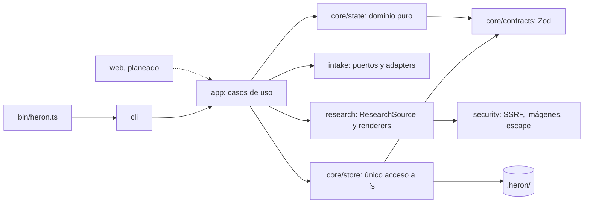

# Heron

Heron es una herramienta independiente (CLI hoy, Web UI más adelante) que convierte el modelo funcional de un producto en un contrato de diseño neutral y versionado: research con provenance, dirección visual, foundations, tokens W3C DTCG, componentes, pantallas y un export portable que cualquier stack consume sin instalar Heron.

## 1. Qué es Heron y qué NO es

Actúa como **AI UX/UI Product Designer + Design Director + Design System Compiler**. Parte de un master-plan de Navori Master (`UX.md`, `ux.json`, `MASTER.md`) y trabaja con gates humanos; su estado vive en `.heron/`, versionado en el repo del producto.

- **Independiente** de `navori-harness`: lee sus archivos, nunca importa su código.
- **Contrato neutral:** el export no depende de React, Vue ni de ningún stack.
- **Penpot** (self-hosted) es el lienzo editable, **no** la fuente de verdad.
- **No es** un generador de componentes React, ni un wrapper de Penpot, ni un theme generator.

Invariante dual: sin `UX.md` + `ux.json` válidos Heron trabaja en `reference-only` (research, referencias y direcciones visuales) y bloquea toda operación de producción; con ambos válidos habilita `full`.

## 2. Estado actual y roadmap

**P1** está hecha y **P2** (research) está implementada; su recorrido manual sobre un producto real (P2.A9) lo ejecuta el usuario con [docs/research.md](docs/research.md). Fuente: `specs/_master/01-heron/parts.json` y `STATUS.md`.

| Parte | Objetivo                                                            | Depende de  | Estado                           |
| ----- | ------------------------------------------------------------------- | ----------- | -------------------------------- |
| P1    | Núcleo, `heron init` y detección de modo                            | -           | hecho                            |
| P2    | Research `reference-only` determinista y seguro                     | P1          | hecho (pendiente recorrido real) |
| P3    | Agentes (Claude Code / Codex CLI) y 3 direcciones visuales          | P2          | pendiente                        |
| P4    | Contrato UX y `ProductContext` con precedencia y `CONFLICT`         | P1          | pendiente                        |
| P5    | Slice vertical `full`: un flow y 2-3 pantallas hasta export neutral | P3, P4, P12 | pendiente                        |
| P6    | Penpot: sistema completo (tokens, componentes, pantallas)           | P5, P12     | pendiente                        |
| P7    | Producto completo, revisiones y creator → reviewer                  | P5, P6      | pendiente                        |
| P8    | Web UI control plane                                                | P5          | pendiente                        |
| P9    | Self-host (Docker) y hardening                                      | P6, P8      | pendiente                        |
| P10   | Refero como fuente opcional de research                             | P3          | pendiente                        |
| P11   | Validación `full` con un producto real                              | P7          | pendiente                        |
| P12   | Penpot base y propuestas visuales                                   | P3          | pendiente                        |

Las 3 propuestas de dirección visual se revisan y comparan **solo en Penpot**, una página por dirección (D23-D25); en `full` Penpot es obligatorio para pasar el gate `direction` (D26). Por eso P12 se insertó entre P3 y P5 sin renumerar: el orden lo dan las dependencias.

## 3. Arquitectura en 1 minuto

Regla: `bin → cli|web → app (run* → UseCaseResult) → dominio puro y puertos→adapters; contratos Zod versionados en core/contracts; solo core/store toca el filesystem; fronteras en tests/repo/boundaries.test.ts`.

| Módulo                                                                        | Estado                |
| ----------------------------------------------------------------------------- | --------------------- |
| `bin/`, `src/cli/`, `src/app/`                                                | existe (P1)           |
| `src/core/{contracts,state,store}`                                            | existe (P1)           |
| `src/intake/` (navori-master, filesystem)                                     | existe (P1)           |
| `src/research/`, `src/security/`                                              | existe (P2)           |
| `src/agents/`                                                                 | planeado (P3)         |
| `src/penpot/`, `src/tokens/`, `src/design/`, `src/validation/`, `src/export/` | planeado (P5-P7, P12) |
| `src/web/`                                                                    | planeado (P8)         |



Detalle: [docs/architecture.md](docs/architecture.md), [docs/adr/](docs/adr/) y la skill [`heron-architecture`](.claude/skills/heron-architecture/SKILL.md).

## 4. Uso del CLI (P1 y P2)

Requisitos: Bun 1.4.2 (sin Node) y Git.

```bash
git clone <url-del-repo> navori-heron
cd navori-heron
bun install
bun link          # expone `heron` desde bin/heron.ts
heron --version   # 0.1.0
```

Sin `bun link`: `bun bin/heron.ts <comando>` o `bun run heron <comando>`.

```text
heron init [path] [--stage <NN-slug>] [--locale <bcp47>] [--dry-run] [--json]
heron status [path] [--json]
heron doctor [path] [--json]
heron gate <gate> approve|reject [path] [--note <text>] [--reason <text>] [--yes] [--json]
heron references add [path] --source <manual|url|image|design-md> [--origin <text>] [--url <url>] [--file <path>]
    [--screenshot] [--allow-local] --reason <text> --study <text>... --do-not-copy <text>... --influence <text>...
    [--crop <x,y,w,h=note>]... [--json]
heron references list [path] [--all] [--json]
heron references show <REF-n> [path] [--json]
heron references compare <REF-n> <REF-n> [<REF-n> <REF-n>] [path] [--json]
heron references remove <REF-n> [path] [--reason <text>] [--json]
heron references import <file.json> [path] [--allow-local] [--json]
heron brand add [path] --kind <kind> --origin <origin> --value <text> [--file <path>] [--reference <REF-n>] [--note <text>] [--json]
heron research render [path] [--json]
```

- `init`: detecta el contexto, decide el modo y escribe `.heron/`. Con varias etapas y ninguna activa usa la última `cerrada` y lo avisa; `--stage` fuerza una.
- `init --locale` fija el idioma de las salidas de research (tag BCP 47; se conserva entre ejecuciones).
- `status`: modo, etapa, fase, gates, artefactos obsoletos y las órdenes permitidas (incluye las de research y el aviso `ASSETS_LARGE`). Solo lectura.
- `doctor`: revisa Bun, la ruta, `.heron/`, el lock, el `.gitignore` y la detección. Solo lectura.
- `gate`: registra una decisión humana ligada a hashes. Gates: `intake`, `research`, `direction`, `foundations`, `representative-screens`, `visual-review`. Rechazar exige `--reason`; sin TTY hay que pasar `--yes`. Con P2, `research approve` funciona con 5 o más referencias con provenance; los demás gates siguen sin aprobar hasta que una parte posterior produzca sus artefactos (exit 3); `reject` funciona siempre.

- `references`, `brand` y `research render`: research sin IA con provenance completa, defensas SSRF, de rutas y de imágenes, y un moodboard HTML estático. Flujo, formato de lote y recorrido manual en [docs/research.md](docs/research.md); política de seguridad en [docs/security.md](docs/security.md). Con 5 o más referencias con provenance completa, `gate research approve` pasa a `research-ready`.

### `reference-only` (`fixtures/no-ux`, sin `UX.md` ni `ux.json`)

```text
$ heron init --dry-run fixtures/no-ux      # exit 0
Project detected
Navori Master: yes
Stage: 01-mvp

MASTER.md: ✓
DECISIONS.md: ✓
parts.json: ✓
UX.md:  missing
ux.json: missing
DIGEST.md: ✓
CODEBASE.md: ✓

Mode:
REFERENCE ONLY

Full product generation disabled.
Visual research is available.

Dry run: nothing was written to .heron/
```

### `full` (`fixtures/membership-product`)

```text
$ heron init --dry-run fixtures/membership-product      # exit 0
Project detected
Navori Master: yes
Stage: 01-mvp

MASTER.md: ✓
DECISIONS.md: ✓
parts.json: ✓
UX.md:  ✓
ux.json: ✓
DIGEST.md: ✓
CODEBASE.md: ✓

Harness UX declaration: md-json

Mode:
FULL PRODUCT

Surfaces:
- MOBILE
- DASHBOARD
- PARTNER

Screens: 6
Flows: 3
Patterns: 2

Ready for research.

Dry run: nothing was written to .heron/
```

`--dry-run` calcula y muestra todo sin escribir. Sin él, `init` escribe `.heron/` en el path indicado: no lo uses sobre `fixtures/` (los tests trabajan sobre copias temporales).

### `--json` y códigos de salida

Con `--json` la salida es exactamente un `CliEnvelope` (una línea JSON en stdout, también en errores); contrato en `schemas/cli-envelope.v1.schema.json`.

```text
$ heron init --dry-run --json fixtures/no-ux
{"kind":"CliEnvelope","schemaVersion":1,"command":"init","runId":"run-...","durationMs":4,"ok":true,"code":0,"data":{...}}
```

| Código | Significado                                                                                                                                                                |
| ------ | -------------------------------------------------------------------------------------------------------------------------------------------------------------------------- |
| 0      | OK (también `reference-only`)                                                                                                                                              |
| 1      | Error inesperado (`UNEXPECTED_ERROR`; `HERON_DEBUG=1` agrega el stack)                                                                                                     |
| 2      | Uso: opción, comando o gate desconocido, ruta o `--stage` inválidos, falta `--reason`/`--yes`; research: provenance o marca incompleta, URL, lote, crop o imagen inválidos |
| 3      | Bloqueado: `.heron/` inseguro o inválido, no inicializado, `MODE_BLOCKED`, precondición no cumplida; research: `SSRF_BLOCKED`, `UNSAFE_PATH`, fase congelada               |
| 4      | `doctor`: falla un check que no es de dependencia                                                                                                                          |
| 5      | `doctor`: falla una dependencia (p. ej. versión de Bun); research: red, motor de imágenes (sharp) o fuente no disponible                                                   |
| 6      | Lock tomado por otro escritor o revisión de `state.json` cambiada                                                                                                          |

## 5. Cómo se trabaja

- **Master-plan** en `specs/_master/` (`MASTER.md`, `DECISIONS.md`, `parts.json`, `STATUS.md`): define las partes P1-P12.
- **Specs SDD** en `specs/NNNN-*` (p. ej. `specs/0001-heron-core`): una por parte, con requisitos `R<n>` trazables a tests.
- **Harness navori** (`.claude/agents/`): `orchestrator` coordina, `implementer` implementa, `reviewer` revisa, `publisher` abre el PR.
- **Quality gate:** `bun run check` (`format:check` + `lint` + `typecheck` + `test:coverage`). Otros scripts: `bun test`, `bun run gen:schemas`.
- **CI:** `.github/workflows/ci.yml` corre `bun install --frozen-lockfile && bun run check` en cada PR.
- **Git:** las ramas parten de `develop` y los PR apuntan a `develop`. Commits Conventional en español, **un commit por tarea y un PR por parte**.

## 6. Skills del proyecto

Propias (`.claude/skills/`):

- [`heron-architecture`](.claude/skills/heron-architecture/SKILL.md): capas, fronteras y recetas.
- `heron-design-tokens`: convenciones de tokens.
- `heron-accessibility`: criterios de accesibilidad.
- [`dominio`](.claude/skills/dominio/SKILL.md): glosario y reglas del dominio.

De terceros (vendorizadas): Penpot AI Kit (6 skills `penpot-*`, CC-BY-4.0), `frontend-design` y `webapp-testing` (Apache-2.0) y `refero-design` (MIT). Origen, SHA, licencias y modificaciones en [`docs/third-party-skills.md`](docs/third-party-skills.md). Las `penpot-*`, `refero-design` y `webapp-testing` tienen `disable-model-invocation: true`: solo corren si las invocas por nombre, porque asumen Penpot MCP, cuenta Refero o Playwright vivos.

## 7. Estructura del repo

```text
bin/heron.ts   entrada del CLI
src/           cli, app, core (contracts, state, store), intake, research, security
schemas/       JSON Schemas generados desde los contratos
scripts/       gen-schemas y check-coverage
fixtures/      productos sintéticos para tests y pruebas manuales
tests/         unit, e2e, repo (fronteras, schemas, CI) y perf (`bun run test:perf`, fuera de `check`, paso propio en CI)
specs/         master-plan (_master) y specs SDD
docs/          arquitectura, research, seguridad y ADR
.claude/       harness navori: agentes, skills, hooks
```

## 8. Contribuir y licencia

Trabaja en una rama desde `develop`, corre `bun run check` antes de abrir el PR y apunta el PR a `develop`. Más contexto en [docs/architecture.md](docs/architecture.md) y [fixtures/README.md](fixtures/README.md).

Licencia: por definir.
