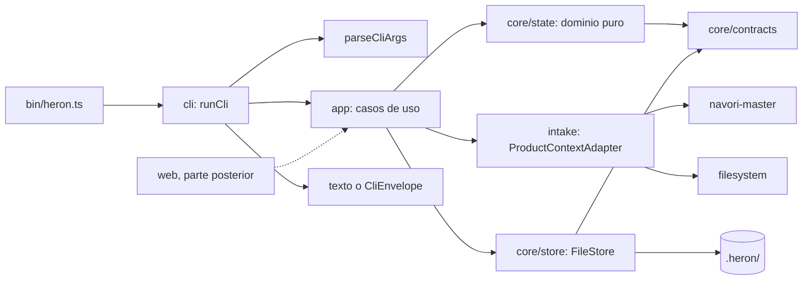

# Arquitectura de Heron (P1 y P2)

Un solo paquete con módulos por frontera en `src/` (D4). Se dividirá en paquetes solo cuando exista un segundo entregable real. Este documento describe lo que P1 y P2 implementan; los módulos de agentes, diseño, tokens, Penpot y web aparecen en `MASTER.md` pero no existen todavía.

## Módulos y reglas de frontera

| Módulo                | Responsabilidad                                                                                                                   | Puede importar                                        |
| --------------------- | --------------------------------------------------------------------------------------------------------------------------------- | ----------------------------------------------------- |
| `src/core/contracts/` | Esquemas Zod, tipos, JSON canónico, versionado, códigos de salida                                                                 | solo `zod` y archivos hermanos                        |
| `src/core/state/`     | Dominio puro: fases, transiciones, gates, modo, obsolescencia                                                                     | `core/contracts` y hermanos; sin `Bun`/`bun:`         |
| `src/core/store/`     | `FileStore`, escritura atómica, lock, hash                                                                                        | `core/contracts`; **único** que importa `node:fs`     |
| `src/intake/`         | Puertos y adapters de detección de contexto (`navori-master`, `filesystem`), lector provisional de `ux.json`                      | `core`; recibe el filesystem como lectura inyectada   |
| `src/security/`       | Primitivas puras o inyectables: clasificador SSRF, `Fetcher`, saneo de imágenes, escáner de texto no confiable, escape, redacción | solo `core/contracts`; no toca el filesystem          |
| `src/research/`       | Puerto `ResearchSource`, registro y adapters (`manual`, `url`, `image`, `design-md`), validación de provenance, renderers         | `core/contracts`, lectura de `core/store`, `security` |
| `src/app/`            | Casos de uso (init, status, doctor, gate, references, brand, research render) compartidos por CLI y, más adelante, web            | `core`, `intake`, `research`, `security`              |
| `src/cli/`            | Parseo de argumentos, render, envelope, `runCli` (copy en inglés, D14)                                                            | `app`, `core`                                         |
| `bin/heron.ts`        | Entrada del proceso                                                                                                               | `cli`                                                 |

Reglas:

- `contracts` no importa nada interno.
- `core` no importa `intake`, `app` ni `cli`; `intake` no importa `app` ni `cli`; `app` no importa `cli`.
- Los adapters implementan puertos y no se importan entre sí (`src/intake/adapters/<a>` no importa `<b>`); lo mismo en `src/research/adapters/`, que solo importa el registro (`src/research/registry.ts`).
- `src/security/` solo importa `core/contracts`; `src/research/` no importa `intake` (salvo tipos), `app` ni `cli`. `fetch(` y `node:dns` solo aparecen en `src/security/fetch/system.ts`, y `sharp` solo en `src/security/images/` (ADR [0003](adr/0003-research-source-boundary.md) y [0004](adr/0004-sharp-image-sanitizing.md)).
- Ningún módulo importa `navori`, `navori/*` ni `@navori/*`: Heron lee los archivos del harness, no su código.
- Solo `src/core/store/**` importa `node:fs` (DP2). Excepción acotada: `scripts/gen-schemas.ts` y `scripts/check-coverage.ts` son herramientas de build, no se distribuyen ni escriben en `.heron/`.

**Cómo se verifican.** `tests/repo/boundaries.test.ts` recorre `src/`, `bin/` y `scripts/`, extrae todos los imports (estáticos, dinámicos, `require` y `import type`) y falla con una línea `archivo -> especificador: regla` por violación. Las reglas son tablas de datos (capas, vendors y tokens prohibidos) con autoverificación por fila, y viven solo en ese test, no duplicadas en el linter (DP20). Además prohíbe `Bun.`/`bun:` en `contracts` y `state`, y se autoverifica con un fuente sintético que cubre cada forma de import.

## Flujo de un comando



`runCli` genera un `runId` por invocación, parsea los argumentos y llama al caso de uso. Los casos de uso devuelven un resultado tipado (`ok`, código, findings, datos) y la CLI lo traduce a texto (stdout; fallos en stderr) o, con `--json`, a un único `CliEnvelope`. Una excepción inesperada termina con exit 1 y `UNEXPECTED_ERROR`.

Para los comandos que escriben (`init`, `gate`, `references add|import|remove`, `brand add`, `research render`), todos pasan por un único envoltorio (`withWriteRun`, `src/app/write-run.ts`) y el orden es: tomar el lock, recuperar staging huérfano, recalcular la huella de las entradas y el modo, evaluar precondiciones, escribir en staging, promover artefactos, promover `state.json` con `stateRevision + 1`, liberar el lock. `references add|import` y `brand add --file` capturan (red e imágenes) **antes** de tomar el lock, sobre una instantánea de `stateRevision`; si otro comando escribió mientras tanto, el commit falla con exit 6 sin escribir. `status`, `doctor` y `references list|show|compare` son de solo lectura: no toman el lock ni escriben. Detalle y justificación en el [ADR 0001](adr/0001-state-persistence.md).

## Modo `full` / `reference-only`

El modo lo decide `src/core/state/mode.ts` a partir del informe de detección:

- `full`: existen `UX.md` y un `ux.json` válido y la declaración `ux` del harness (si existe) lo respalda.
- `reference-only`: falta alguno, `ux.json` es inválido, o el harness declara `ux = "md"` (solo UX.md). Con D6, si el harness declara solo UX.md, Heron no usa UX.md parcialmente.
- D27: si la declaración `ux` del harness no coincide con los archivos presentes, Heron fuerza `reference-only` y emite `UX_DECLARATION_MISMATCH` hasta que coincidan. Un valor desconocido se ignora para decidir y emite `HARNESS_UNKNOWN_VALUE`. Sin declaración (harness legacy) deciden los archivos.

En `reference-only` está bloqueada toda transición cuyo destino sea una fase de producción (`direction-selected` en adelante): `MODE_BLOCKED`, sin evaluar la precondición. Research visual sigue disponible. Con D26, en `full` el gate `direction` exige además Penpot activo y 3 propuestas escritas; en `reference-only` registrar una preferencia no exige Penpot. `status` recalcula el modo y muestra `Mode: REFERENCE ONLY (persisted: FULL PRODUCT)` si difiere del persistido; el modo efectivo es `full` solo si ambos lo son.

En `full`, `init` muestra además surfaces y conteos de `ux.json`; en `reference-only` no, para no sugerir uso parcial.

## Máquina de estados

Fases, en orden (`HERON_PHASES` en `src/core/contracts/heron-state.ts`): `initialized`, `intake-ready`, `researching`, `research-ready`, `directions-ready`, `direction-selected`, `foundations-ready`, `representative-screens-ready`, `system-ready`, `screens-ready`, `penpot-synced`, `validated`, `exported`. Son de producción (`PRODUCTION_PHASES`) de `direction-selected` a `exported`.

Gates humanos (`GATE_NAMES`): `intake`, `research`, `direction`, `foundations`, `representative-screens`, `visual-review`. Cada aprobación queda ligada a los sha256 de los artefactos que enlaza el gate (`GATE_BINDINGS` en `src/core/state/gates.ts`); si un artefacto cambia después, la aprobación deja de ser válida y se marca como invalidada. El gate `intake` es ortogonal al research: se aprueba desde `initialized` o, como bucle, desde fases posteriores a research, y es precondición de `direction-selected`.

Las transiciones válidas son la tabla `TRANSITIONS` (`src/core/state/transitions.ts`): una fila por `(fase origen, evento)` con destino, precondición y marca `production`. No se copia aquí; léase el archivo. `canTransition` evalúa en este orden:

1. Existe la fila `(from, evento)`; si no, `TRANSITION_NOT_ALLOWED`.
2. Guard de modo: fila de producción en `reference-only` es `MODE_BLOCKED`.
3. Guard de aprobaciones: una transición de producción (salvo rechazos y `revise`) exige que las aprobaciones registradas sigan válidas; si no, `PRECONDITION_UNMET` (`approvals-valid`).
4. Precondición de la fila; un hecho ausente cuenta como no cumplido.

`applyTransition` devuelve un nuevo `HeronState` (inmutable) con la entrada de `history[]`. Un rechazo o una regresión marca los artefactos posteriores como obsoletos. `init` y `gate` mueven el estado, y desde P2 también `references add|import` (evento `reference-added`: `initialized`/`intake-ready` a `researching`). `references remove`, `brand add` y `research render` registran una revisión sin transición. Los demás eventos (direcciones, sistema, pantallas, validación, exportación) los producirán partes posteriores.

## Layout de `.heron/`

```text
.heron/
  .gitignore          versionado; lo escribe init en la misma transacción
  project.json        HeronProject v1
  state.json          HeronState v1; punto de commit, siempre el último en escribirse
  intake/
    mode.json         ModeDecision v1 (incluye el informe de detección; sin fechas)
  research/           P2; ver docs/research.md
    references.json   ResearchReferences v1, fuente de verdad (atado al gate research)
    provenance.json   ResearchProvenance v1, proyección derivada (atado al gate research)
    REFERENCES.md     vista derivada
    moodboards/index.html  vista estática con CSP
    assets/{sha256}.webp   imágenes saneadas
    sources/{sha256}.md|.txt  texto externo, untrusted
  brand/
    brand.json        BrandInputs v1
    assets/{sha256}.webp   imágenes de marca saneadas
  staging/{runId}/    transitorio (ignorado)
  .lock               transitorio (ignorado)
  .lock.reclaim       transitorio (ignorado)
```

`state.artifacts` registra el sha256 de `intake/mode.json`, `project.json` y, tras P2, los artefactos de research y marca. Las fechas solo viven en `history[]` y en las decisiones de gate, nunca en `mode.json`, y `init` es idempotente: si nada cambió, no escribe ni crea revisión. `/.heron/` está en el `.gitignore` del propio repo de Heron porque allí `init` es solo una prueba manual.

## Contratos versionados y `gen:schemas`

Los contratos viven en `src/core/contracts/` como esquemas Zod: `HeronProject`, `HeronState`, `ModeDecision`, `CliEnvelope` y, desde P2, `ResearchReferences`, `ResearchProvenance`, `BrandInputs` y `ReferenceBatch` (este último es una entrada, con `z.strictObject`). Los documentos persistidos usan `z.looseObject` (conservan campos desconocidos al reescribir) y un `schemaVersion` entero que sube solo con cambios incompatibles: renombrar, quitar o cambiar el significado de un campo, o añadir un valor a un enum persistido. Leer una versión mayor que la soportada falla nombrando la soportada y nunca se escribe un documento que no se pudo leer. `CliEnvelope` es salida transitoria y usa `z.object`.

**Enmienda (OD1-C′, P2).** Agregar un código de finding no sube versión: lo persistido guarda el código como texto con patrón `^[A-Z][A-Z0-9_]*$` y los emisores siguen tipados con la unión cerrada `FindingCode`. Agregar valores a `ADAPTER_IDS` en P2 (`markdown`, `manual`) es una corrección única de un enum que DP7 exigía completo desde P1. Un `.heron/` creado por P1 sigue leyéndose sin `DOCUMENT_INVALID`.

`bun run gen:schemas` emite `schemas/*.v1.schema.json` desde esos esquemas. `tests/repo/schemas.test.ts` compara lo generado con los archivos en disco (faltantes, sobrantes o distintos), de modo que un contrato modificado sin regenerar rompe el test. No se emite schema de `ux.json`: es un contrato del harness, y Heron solo tiene un lector provisional (D5) en `src/intake/ux-contract.ts`.

## Códigos de salida

`ExitCode` en `src/core/contracts/common.ts`: 0 ok, 1 inesperado, 2 uso, 3 bloqueado (modo, precondición, `.heron/` inválido o inseguro), 4 validación (`doctor`), 5 dependencia no disponible (`doctor`), 6 lock o revisión. La tabla por comando está en el [README](../README.md#--json-y-códigos-de-salida); la de research, en [docs/research.md](research.md#códigos-de-salida). Todo código sale de `ExitCode`, sin literales numéricos en `src/app/`.
