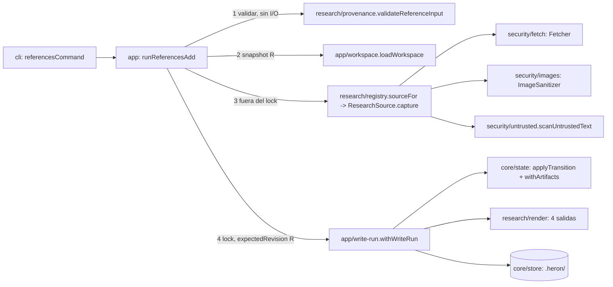

# 0002 Research reference-only — Design

Parte P2 del master-plan `01-heron`. Cubre R1–R17 de `requirements.md` y los criterios P2.A1–A9 de `parts.json`. Señales de diseño: abstracción compartida nueva (puerto `ResearchSource`, registro de órdenes `CommandSpec`), contratos persistidos nuevos y un cambio de forma en uno existente (OD1-C′), área crítica (`src/security`, `src/core/{contracts,state,store}`, `tests/repo/boundaries.test.ts`), dependencia nativa nueva (`sharp`) y entrada hostil (red, imágenes, texto ajeno). Convenciones vinculantes: skill `heron-architecture` y `references/{patterns,layout,recipes}.md` (OD1 = C′, OD2 registro de órdenes con el primer subcomando de P2, OD3 `src/security/` + temporales en `core/store`, OD4 adapters sin estado con servicios por request). Lo decidido en `MASTER.md`, `DECISIONS.md` (D12, D14, D15, D16, D23–D29; D28 y D29 resolvieron dos supuestos de la primera versión de este diseño) y en `specs/0001-heron-core/design.md` (DP1–DP27) no se re-litiga; las desviaciones se declaran en §Decisions.

**Ref verificado:** `git fetch origin develop` OK; `HEAD` de `feat/p2-research` = `origin/develop` = `9f7a0c7`. Toda cita "ya existe" es contra ese commit y usa ancla estable (archivo + símbolo). Los refactors previos a P2 **no** aterrizaron: no existen `src/app/write-run.ts`, `src/cli/output.ts` ni las tablas `LAYERS`/`VENDORS`/`TOKENS`; entran en esta spec como R1–R5.

## Approach

### Qué existe (evidencia)

| Hecho | Evidencia (archivo + símbolo) | ¿Basta extenderlo? |
|---|---|---|
| Caso de uso con lock duplicado; `runGate` no recupera staging huérfano | `src/app/init.ts` `commitInit` (lock → `recoverOrphanStaging` → tx → release); `src/app/gate.ts` `decide` (lock → `decideLocked` → release, sin `recoverOrphanStaging`; `ctx.confirm` se espera **con el lock tomado**) | Sí: `withWriteRun` (R1) absorbe ambos y saca la confirmación humana del lock |
| Lectura de estado + detección en vivo + modo efectivo repetida | `src/app/status.ts` `readStatus`; `src/app/gate.ts` `decideLocked` | P2 agrega 6 casos de uso que la necesitan: 3.er sitio → `loadWorkspace` (regla de 3) |
| Hechos de transición | `src/app/gate.ts` `collectTransitionFacts` (solo `invalidatedGates`, `intakeApprovalValid`, `boundArtifactCount`) | Sí: P2 agrega `referencesWithProvenance`/`minReferences`; se mueve a `src/app/facts.ts` (usos: gate, `references add`, `references import`) |
| Tabla de estados con research ya modelado | `src/core/state/transitions.ts` `FORWARD_ROWS` (`reference-added` desde `initialized`…`directions-ready` → `researching`; `approve-gate:research` desde `researching`/`research-ready`), `FACT_CHECKS["research-minimum-references"]` (detalle **sin** el conteo) | Sí: solo hechos y el texto del detalle (R15); ninguna fila nueva |
| Gate de research atado a dos archivos | `src/core/state/gates.ts` `GATE_BINDINGS.research` = `research/references.json`, `research/provenance.json` | Sí, sin cambios |
| Artefactos por fase | `src/core/state/stale.ts` `PHASE_ARTIFACTS.researching` (`references.json`, `provenance.json`, `research/assets/**`, `brand/**`) | Se completa con `sources/**`, `REFERENCES.md`, `moodboards/**` |
| `recordInit` **reemplaza** `state.artifacts` | `src/core/state/lifecycle.ts` `recordInit` | No: re-`init` borraría del estado los artefactos de research → se cambia a upsert |
| `init` reconstruye `project.json` desde cero | `src/app/init.ts` `buildProject` | No: P2 agrega `product.locale` (D14) y P3 `providers`; se preservan campos previos (DP7) |
| Unidad de trabajo con binarios | `src/core/store/file-store.ts` `StoreTransaction.put(path, string \| Uint8Array)`, commit DP3 con chequeo de colgantes | Sí: los assets por sha256 se escriben con `tx.put`; **no** hace falta capacidad nueva de escritura |
| Confinamiento de rutas | `src/core/store/paths.ts` `resolveInside`, `assertSafeRelativePath`, `UnsafePathError`; `src/intake/probe.ts` `probeFile` (warnings, semántica de intake) | Se agrega `resolveInputFile` (rutas de usuario dentro o, si son explícitas, fuera del repo: `..` léxico, symlinks, raíz; D28) en `paths.ts` (STORE_READ) |
| Puerto + registro | `src/intake/ports.ts` `ProductContextAdapter`, `DetectRequest.fs`; `src/intake/detect.ts` `DEFAULT_ADAPTERS` (único importador de `adapters/**`) | Mismo patrón para `ResearchSource` |
| Emisión CLI repetida | `src/cli/commands/{init,status,doctor,gate}.ts` `handle*` (4 copias de `buildEnvelope`/stdout/stderr con variantes: notices a stderr en init, datos en fallo en doctor) | `emitResult` (R2) |
| Parser monolítico | `src/cli/args.ts` `parseCliArgs`, `COMMAND_OPTIONS`, `USAGE_TEXT`; `src/cli/main.ts` `runCli` (`switch`) | No escala a subcomandos → `CommandSpec` (OD2) |
| Fronteras por cadena de `if` | `tests/repo/boundaries.test.ts` `violationsFor` (no exportada), `extractImports` | Tablas `LAYERS`/`VENDORS`/`TOKENS` (R3) |
| Enums incompletos | `src/core/contracts/heron-project.ts` `ADAPTER_IDS` (2 ids); `src/core/contracts/common.ts` `FINDING_CODES`/`FindingSchema` (enum cerrado incrustado en `schemas/mode-decision.v1.schema.json`) | OD1-C′ (R4) |
| Literal de salida | `src/app/status.ts` `readStatus` → `failure(3, …)` | `ExitCode.Blocked` (R5) |
| Envelope transitorio | `src/core/contracts/cli-envelope.ts` `CLI_COMMANDS`, `CliEnvelopeSchema` (`z.object`) | Crece de forma aditiva (convención) |
| Cobertura por prefijo | `scripts/check-coverage.ts` `COVERAGE_RULES` (solo `core/*`) | Se agregan `src/security/` y `src/research/` (RNF-8) |
| `.heron/.gitignore` | `src/core/store/file-store.ts` `HERON_GITIGNORE` (`/staging/`, `/cache/`, `/logs/`, …) | Sin cambios: todo lo de research se versiona (D15) |

### El problema real

El diseñador necesita registrar evidencia visual (URLs, screenshots, DESIGN.md externos, notas) con provenance completa, compararla y verla en un moodboard, **sin IA** y sin que el contenido ajeno pueda (a) alcanzar la red interna (SSRF), (b) colar archivos del host o metadata personal (rutas, EXIF/GPS) en el Git del producto, (c) inyectar HTML/JS en el moodboard o (d) disfrazarse de instrucciones para agentes futuros (P3). Además, cada salida debe declarar `reference-only` (RN-5) y el gate `research` debe abrirse solo con ≥ 5 referencias completas (D16). Consumidores: el diseñador (CLI hoy, web en P8), el gate `research`, P3 (context packs con contenido marcado `untrusted`) y P5 (export `references/` + `provenance.json`).

### Decision drivers (de las reglas del proyecto)

1. **Seguridad de ingesta verificable** (RN-36, RN-37, RNF-10, RNF-11, MASTER §Seguridad): SSRF bloqueado al 100 % con redirects y rebinding; imágenes re-encodeadas sin metadata; contenido externo como dato.
2. **Solo `core/store` toca el filesystem; vendors confinados; fronteras en el test** (D4, DP2, DP20, OD3).
3. **Lock nunca durante red, imágenes ni espera humana** (convención Lock; patrón 3).
4. **Contratos versionados que fallan fuerte, lector tolerante** (RNF-13, DP7 enmendado por OD1-C′).
5. **Determinismo y Git limpio** (RNF-2, D15): JSON canónico, assets por sha256, sin fechas fuera de `ctx.clock`.
6. **Dependencias solo del Stack, con ADR** (RNF-15): `sharp` 0.35.5 sí; `ipaddr.js` no está en el Stack.
7. **Idioma** (D14): CLI en inglés; artefactos generados en el idioma del producto; docs en español.
8. **Simplicidad** (CLAUDE.md): regla de 3, sin abstracciones especulativas, greenfield con quality gate verde.

### Opciones consideradas

**Dónde viven escritura y derivados de research.**
- *Peldaño 1 — adapters que escriben en el store:* descartado; rompe OD4 (adapters sin efectos) y la regla "solo `core/store` toca fs".
- *Peldaño 2 — los comandos mutantes escriben solo `references.json` y `research render` deriva el resto:* descartado; `provenance.json` (atado al gate) quedaría desfasado entre `add` y `render`, y P1 no tiene mecanismo para limpiar `stale`.
- *Peldaño 3 — elegido:* el adapter devuelve registros + bytes; `app` escribe en **una** transacción `references.json` y regenera las 4 salidas (`provenance.json`, `REFERENCES.md`, moodboard). `research render` es la reconstrucción idempotente (cambio de renderer, de locale o de archivos borrados a mano).

**Fetch seguro.**
- *`fetch()` directo con validación previa del hostname:* descartado; vulnerable a rebinding (el runtime resuelve de nuevo) y a redirects.
- *`node:https.request` con `lookup` propio:* viable, pero agrega `node:https`/streams y su compatibilidad en Bun no se sondeó; no aporta sobre la opción elegida.
- *Elegida — resolver una vez, validar todas las IP y conectar a la IP literal con `tls.serverName` + `Host`:* sonda en Bun 1.4.2 (§Decisions DR10): con `serverName` el certificado se valida contra el nombre; sin él o con otro nombre falla; `redirect: "manual"` expone `Location`.

**Clasificador de IP.** *`ipaddr.js`:* descartado; no está en el Stack (RNF-15 exige ADR) y sus nombres de rango no cubren metadata ni el criterio "global unicast solo `2000::/3`". *Elegido — clasificador propio* en `src/security/ssrf.ts` (≤ 150 líneas: parseo v4/v6 + tabla IANA + clasificación), probado por tabla.

**Imágenes.** *No re-encodear (solo magic bytes):* descartado por RNF-11. *`Bun.Image`:* MASTER ya lo descartó (EXIF sin verificar). *Elegido — `sharp` 0.35.5* (en el Stack), cargado de forma perezosa.

**Moodboard.** *Imágenes como `data:` URI:* descartado; duplica cada asset dentro del HTML y, como el HTML se regenera en cada alta, infla el historial de Git de forma cuadrática (contra D15). *CSS externo `moodboard.css` con `style-src 'self'`:* viable, un archivo más sin ventaja. *Elegido — HTML único con `<style>` constante permitido por hash y rutas relativas a `../../research/assets/`* (sonda en Chromium y Firefox, DR16).

**Locale de los artefactos (D14).** *Todo en inglés:* contradice D14. *`--locale` en `research render` persistido en `references.json`:* mezcla configuración de producto con datos de research. *Elegido — `HeronProject.product.locale` (opcional, sin bump) fijado con `heron init --locale <bcp47>`*, nombre que ya fija la convención.

### Recomendación



Cada comando mutante de research: (1) valida la entrada de forma pura (exit 2 sin escribir), (2) toma una instantánea del workspace (revisión `R`, modo efectivo), (3) hace los pasos largos fuera del lock (red, sharp), (4) entra a `withWriteRun` con `expectedRevision = R`, asigna ids, escribe assets/fuentes por sha256, regenera las 4 salidas, aplica la transición (`reference-added`) o registra el comando, y hace commit. Los comandos de lectura (`list`, `show`, `compare`) no toman lock (DP16).

## Components

Rutas exactas. "R" = requisitos de `requirements.md` que cubre. `(nuevo)` / `(mod)`.

### Refactors previos (base de P2)

| Ruta | Responsabilidad | R |
|---|---|---|
| `src/app/write-run.ts` (nuevo) | `withWriteRun`: store → lock → recuperar staging → leer estado → chequeo de revisión → cuerpo síncrono → commit/abort → liberar | R1 |
| `src/app/workspace.ts` (nuevo) | `loadWorkspace`: instantánea de solo lectura (estado, proyecto, `mode.json`, detección en vivo, modo efectivo) | R1, R5, R8 |
| `src/app/facts.ts` (nuevo) | `collectTransitionFacts` (movido desde `gate.ts`, misma firma) + `collectResearchFacts` | R1, R15 |
| `src/app/init.ts` (mod) | Usa `withWriteRun`; `--locale`; preserva campos previos de `project.json` | R1, R13 |
| `src/app/gate.ts` (mod) | Usa `loadWorkspace` + `withWriteRun(expectedRevision)`; confirmación humana fuera del lock; hechos de research | R1, R15 |
| `src/app/status.ts` (mod) | Usa `loadWorkspace` (exit vía `ExitCode.Blocked`); `allowedCommands` con las órdenes de P2; aviso `ASSETS_LARGE` (D15) | R5, R8, R11 |
| `src/app/result.ts` (mod) | `rejectionToFinding` acepta `StoredModeDecision` | R4 |
| `src/cli/output.ts` (nuevo) | `emitResult`, `splitNotices` | R2 |
| `src/cli/command.ts` (nuevo) | `CommandSpec`, `ParsedCommand`, `UsageError`, `parseOptions` | R2, R8 |
| `src/cli/commands/index.ts` (nuevo) | `COMMANDS` (registro) | R8 |
| `src/cli/args.ts` (mod) | `parseCliArgs`, `USAGE_TEXT` y `commandFor` derivados de `COMMANDS` | R2, R8 |
| `src/cli/main.ts` (mod) | Despacho por registro; usage/inesperado también por `emitResult` | R2 |
| `src/cli/commands/{init,status,doctor,gate}.ts` (mod) | Exportan `initCommand`, `statusCommand`, `doctorCommand`, `gateCommand` (parse movido desde `args.ts`; handle con `emitResult`) | R2 |
| `src/cli/render.ts` (mod) | `renderFindings` acepta `StoredFinding` | R4 |
| `src/core/contracts/common.ts` (mod) | `StoredFinding`, `StoredFindingSchema`, `FINDING_CODE_PATTERN`; códigos nuevos al final de `FINDING_CODES` | R4, R9–R14 |
| `src/core/contracts/mode-decision.ts` (mod) | `DetectionReport<F>`, `ModeDecision<F>`, `StoredModeDecision`; esquemas con `StoredFindingSchema` | R4 |
| `src/core/contracts/heron-project.ts` (mod) | `ADAPTER_IDS` con 4 ids; `product?: { locale }` | R4, R13 |
| `src/core/state/mode.ts` (mod) | `describeModeBlock` acepta `StoredModeDecision`; código desconocido se ordena al final | R4 |
| `tests/repo/boundaries.test.ts` (mod) | `LAYERS`, `VENDORS`, `TOKENS`, `runtimeImports`, `violationsFor` exportada, autoverificación por fila | R3, R5 |
| `schemas/*.v1.schema.json` (regenerados) | Deriva cero contra Zod | R4, R13 |
| `tests/assets/p1-workspaces/{membership-product,no-ux}/.heron/**` + `tests/assets/p1-workspaces/README.md` (nuevos) | Goldens generados con P1 (`9f7a0c7`) | R4 |

### Contratos, estado y store

| Ruta | Responsabilidad | R |
|---|---|---|
| `src/core/contracts/research.ts` (nuevo) | `ResearchReference`, `Provenance`, `Crop`, `SecurityFinding`, `BrandInput`, `ImageAsset`, `ExternalContent`, `FetchRecord`, entradas (`ReferenceInput`, `ReferenceBatch`, `BrandInputDraft`), documentos y `*_DOCUMENT` | R6–R8, R11–R14 |
| `src/core/contracts/research-data.ts` (nuevo) | `<Cmd>Data` de las 8 órdenes nuevas y sus esquemas `z.object` | R6–R8, R13–R15 |
| `src/core/contracts/cli-envelope.ts` (mod) | `CLI_COMMANDS` + unión `data` (aditivo, sin bump) | R2, R8 |
| `src/core/contracts/version.ts` (mod) | `DocumentKind` + 4 kinds | R13 |
| `src/core/contracts/index.ts` (mod) | Barrel + `CONTRACT_DOCUMENTS` con 8 documentos | R13 |
| `src/core/state/lifecycle.ts` (mod) | `recordInit` con upsert; `recordCommand`; `withArtifacts` | R6, R8 |
| `src/core/state/transitions.ts` (mod) | Detalle de `research-minimum-references` con el conteo | R15 |
| `src/core/state/stale.ts` (mod) | `PHASE_ARTIFACTS.researching` completo | R13 |
| `src/core/store/paths.ts` (mod) | `resolveInputFile`: resuelve y clasifica (`repo`/`external`) la ruta de un archivo de entrada sin leerlo (solo `lstat`/`realpath`; STORE_READ) | R10 |

### Seguridad (`src/security/`, OD3; nunca toca fs)

| Ruta | Responsabilidad | R |
|---|---|---|
| `src/security/ssrf.ts` | Clasificador puro de direcciones IPv4/IPv6 (tabla IANA, metadata, rangos locales permitibles) | R9 |
| `src/security/fetch/types.ts` | `Fetcher`, `Resolver`, `Transport` y tipos de request/result | R9 |
| `src/security/fetch/safe-fetch.ts` | `createSafeFetcher`: política de URL, DNS una vez, IP fijada, redirects revalidados, timeout, límites | R9 |
| `src/security/fetch/system.ts` | `systemResolver` (`node:dns`) y `bunTransport` (`fetch()` con `tls.serverName`); único sitio con `fetch(` | R9 |
| `src/security/images/magic.ts` | `sniffImageType`, `webpChunks`, `exifHasGps` (puros) | R11 |
| `src/security/images/sanitize.ts` | `sharpImageSanitizer` (import perezoso de `sharp`) | R11 |
| `src/security/untrusted.ts` | `scanUntrustedText` (frases con forma de instrucción y caracteres ocultos), `INSTRUCTION_RULES` | R12 |
| `src/security/html.ts` | `escapeHtml` | R13 |
| `src/security/markdown.ts` | `escapeMarkdownText` | R13 |
| `src/security/redact.ts` | `redactUrl`, `SENSITIVE_QUERY_KEYS` (RNF-7) | R9 |

### Research (`src/research/`)

| Ruta | Responsabilidad | R |
|---|---|---|
| `src/research/ports.ts` | `ResearchSource`, `CaptureRequest`, `CaptureServices`, `CaptureResult`, `CaptureFailure`, `ResearchSettings` | R8 |
| `src/research/registry.ts` | `RESEARCH_SOURCES` (`Partial<Record>`), `sourceFor`, `availableSourceKinds` (único importador de `adapters/**`) | R8 |
| `src/research/layout.ts` | Rutas de `.heron/research/` y `.heron/brand/` | R13 |
| `src/research/provenance.ts` | `validateReferenceInput`, `missingProvenance`, `validateCrops`, `nextReferenceId`, `researchMode` | R6, R7, R8, R15 |
| `src/research/brand.ts` | `validateBrandInput`, `nextBrandInputId` | R14 |
| `src/research/compare.ts` | `sharedValues` para `references compare` | R8 |
| `src/research/input-file.ts` | `readInputFile`: sonda de solo lectura dedicada; única lectura de archivos de entrada (dentro o fuera del repo, D28) vía `ReadonlyFs`, una sola vez; nunca escribe ni lanza | R10 |
| `src/research/image-file.ts` | `captureImageFile` (lectura confinada + sanitizer + asset por sha256) | R10, R11 |
| `src/research/external-text.ts` | `fetchExternalText`, `readExternalTextFile` (UTF-8 estricto, escaneo, contenido `untrusted` por sha256) | R9, R12 |
| `src/research/adapters/manual/index.ts` | `manualSource` | R6, R8 |
| `src/research/adapters/url/index.ts` | `urlSource` | R8, R9, R12 |
| `src/research/adapters/image/index.ts` | `imageSource` | R8, R10, R11 |
| `src/research/adapters/design-md/index.ts` | `designMdSource` (archivo o URL) | R8, R12 |
| `src/research/render/copy.ts` | Catálogo `en`/`es` (D14), `resolveCopy` | R13 |
| `src/research/render/provenance.ts` | `buildProvenance` | R13 |
| `src/research/render/references-md.ts` | `renderReferencesMarkdown` | R13 |
| `src/research/render/moodboard.ts` | `renderMoodboardHtml`, `MOODBOARD_CSS`, `MOODBOARD_STYLE_HASH`, `MOODBOARD_CSP` | R13, R16 |
| `src/research/render/outputs.ts` | `renderResearchOutputs` (las 4 salidas) | R13 |

### Casos de uso y CLI

| Ruta | Responsabilidad | R |
|---|---|---|
| `src/app/context.ts` (mod) | `AppContext` + `fetcher`, `images`, `research`, `cwd` | R8, R9, R11 |
| `src/app/research-store.ts` (nuevo) | `readResearch`, `stageResearchOutputs`, `researchCounts`, `assetBytes` | R13, R15 |
| `src/app/references.ts` (nuevo) | `runReferencesAdd`, `runReferencesList`, `runReferencesShow`, `runReferencesCompare`, `runReferencesRemove`, `runReferencesImport`, `CAPTURE_FAILURE_EXIT` | R6–R12, R15 |
| `src/app/brand.ts` (nuevo) | `runBrandAdd` | R14 |
| `src/app/research.ts` (nuevo) | `runResearchRender` | R13 |
| `src/cli/commands/references.ts` (nuevo) | `referencesCommand` (6 subcomandos) | R6–R8 |
| `src/cli/commands/brand.ts` (nuevo) | `brandCommand` | R14 |
| `src/cli/commands/research.ts` (nuevo) | `researchCommand` | R13 |
| `src/cli/render-research.ts` (nuevo) | `render*Text` de las 8 órdenes | R6–R16 |

### Dependencias, scripts y docs

| Ruta | Responsabilidad | R |
|---|---|---|
| `package.json` (mod) | `"sharp": "0.35.5"` en `dependencies`; `"trustedDependencies": []` | R11 |
| `bun.lock` (regenerado) | `bun install` con lockfile congelado en CI | R11 |
| `scripts/check-coverage.ts` (mod) | `COVERAGE_RULES` + `src/security/`, `src/research/` a 0.9 | RNF-8 (sin R propio) |
| `docs/adr/0003-research-source-boundary.md` (nuevo) | ADR de la frontera de fuentes de research. **Numeración:** `0002` queda reservado para `0002-store-write-zones.md` (enmienda DP2, P3, según `references/layout.md`); se usa el siguiente libre | R17 |
| `docs/adr/0004-sharp-image-sanitizing.md` (nuevo) | ADR de la dependencia `sharp` (RNF-15) | R11, R17 |
| `docs/research.md` (nuevo) | Flujo de research, comandos, layout, batch, locale, recorrido A9 | R17 |
| `docs/security.md` (nuevo) | Sección SSRF + imágenes, rutas, contenido no confiable, escape/CSP, secretos en URLs | R17 |
| `docs/architecture.md` (mod) | Módulos `security`/`research`, fronteras por tablas, enmienda DP7 (OD1-C′) en §Contratos versionados | R3, R4, R17 |
| `README.md` (mod) | Órdenes nuevas y tabla de códigos de salida | R8 |

### Tests y helpers

| Ruta | Responsabilidad | R |
|---|---|---|
| `tests/e2e/references.test.ts` | P2.A1, P2.A2, list/show/compare/remove/import/crops, gate research, redacción | R6, R7, R8, R15 |
| `tests/security/ssrf.test.ts` | P2.A3 | R9 |
| `tests/security/paths.test.ts` | P2.A4 | R10 |
| `tests/security/images.test.ts` | P2.A5 | R11 |
| `tests/security/untrusted-content.test.ts` | P2.A6 | R12 |
| `tests/e2e/research-render.test.ts` | P2.A7 + idempotencia | R13, R16 |
| `tests/e2e/brand.test.ts` | P2.A8 | R14 |
| `tests/e2e/p1-compat.test.ts` | Goldens P1 | R4 |
| `tests/unit/app/write-run.test.ts` | Envoltorio de escritura | R1 |
| `tests/unit/cli/output.test.ts` | `emitResult` | R2 |
| `tests/unit/research/{manual,url,image,design-md}.test.ts` | Adapters con dobles | R8 |
| `tests/unit/research/provenance.test.ts` | Validación de entrada | R6, R7 |
| `tests/unit/research/render.test.ts` | Renderers, hash de CSS, escape | R13 |
| `tests/unit/security/{ssrf,untrusted,redact,html,magic}.test.ts` | Primitivas | R9, R11, R12, R13 |
| `tests/unit/lifecycle.test.ts` | `recordInit`/`recordCommand`/`withArtifacts` | R6, R8 |
| `tests/repo/docs.test.ts` | Docs de R17 | R17 |
| `tests/unit/{cli-args,contracts,state-machine,store}.test.ts`, `tests/e2e/{gate,status}.test.ts`, `tests/repo/coverage-rules.test.ts` (mod) | Casos nuevos (ver §Testing strategy) | R1, R2, R4, R5, R10, R15 |
| `tests/helpers/research.ts` (nuevo) | `fakeResolver`, `recordingTransport`, `offlineFetcher`, `jpegWithGps`, `pngHeader`, `addReferences` | — |
| `tests/helpers/cli.ts` (mod) | `fixedContext` con `fetcher: offlineFetcher`, `images: sharpImageSanitizer`, `research`, `cwd` | — |
| `tests/assets/research/design-injection.md`, `tests/assets/research/references-batch.json` (nuevos) | Insumos SYNTHETIC | R8, R12 |

## Decisions

- **DR1 — Las 4 salidas se regeneran en cada escritura de research** (opción elegida en Approach). `references add|import|remove` y `brand add` regeneran `references.json`, `provenance.json`, `REFERENCES.md` y `moodboards/index.html` en la misma transacción; `research render` reconstruye y no escribe ni crea revisión si los bytes no cambian (como DP15). Los derivados nunca quedan `stale` y el gate siempre ata archivos coherentes. Cubre R13.
- **DR2 — Modo de research derivado de los datos.** `ResearchReference.mode` = modo efectivo al capturar (inmutable). El `mode` de cabecera de `references.json`, `provenance.json`, `REFERENCES.md` y el moodboard es `researchMode(refs, current)`: `reference-only` si alguna referencia activa se capturó en `reference-only`; `full` si todas en `full`; sin referencias activas, el modo efectivo actual. Así un cambio de modo del proyecto no reescribe los JSON atados al gate (no invalida la aprobación de research en fases de producción), y la evidencia capturada sin contrato UX sigue marcada (RN-5). Cubre R6, R13.
- **DR3 — `provenance.json` es la proyección de las referencias, no de la marca.** `GATE_BINDINGS.research` ata `references.json` + `provenance.json`; si la marca entrara ahí, `brand add` invalidaría la aprobación de research. `brand/brand.json` es autodescriptivo (origen por dato, RN-14). La marca sí aparece en las vistas (`REFERENCES.md`, moodboard), que no están atadas. Cubre R13, R14.
- **DR4 — Congelamiento de research en producción.** `references add|import` ya fallan desde fases de producción (no hay fila `reference-added`, exit 3). `references remove` aplica la misma regla (exit 3, `TRANSITION_NOT_ALLOWED`, mensaje propio) porque cambiar `references.json` invalidaría una aprobación que no se puede volver a dar desde esas fases. `brand add` se permite en cualquier fase (no toca archivos atados). `research render` también, pero en fases de producción solo puede reescribir las vistas: si `references.json` o `provenance.json` cambiarían (edición a mano u otra versión de Heron), sale con exit 3 sin escribir. Cubre R8, R13, R15.
- **DR5 — `remove` es baja lógica sin transición.** Queda `removed: { at, reason }`; los assets se conservan (otras referencias pueden compartirlos por sha256). Registra `recordCommand` (revisión + 1, `history[].transition = null`). Desde `research-ready` la aprobación queda invalidada por hash; desde `directions-ready`, volver requiere `references add` (fila existente → `researching`). Cubre R8.
- **DR6 — Captura fuera del lock con instantánea.** Red y sharp corren antes de `withWriteRun`; el commit usa `expectedRevision = R`; si otro comando escribió, exit 6 sin escribir (DP6). `gate` adopta el mismo esquema para la confirmación humana (corrige que P1 esperaba `ctx.confirm` con el lock tomado). Cubre R1.
- **DR7 — OD1-C′ por tipos genéricos, sin tocar emisores.** `DetectionReport<F>` y `ModeDecision<F>` con `F` = `Finding` por defecto (lo fresco) y `StoredModeDecision = ModeDecision<StoredFinding>` (lo leído de disco). Los emisores siguen tipando con la unión cerrada; solo los lectores de documentos persistidos ven `string` con patrón. `CliEnvelope.findings` sigue cerrado (lo emite este binario); `InitData.decision` usa el esquema abierto. Cubre R4.
- **DR8 — `withWriteRun` difiere del boceto de la convención** (`(ctx, root, command, body => UseCaseResult)`): recibe `WriteRunOptions` (`expectedRevision`, `create`, `requireState`, `path`) y el cuerpo devuelve `WriteBodyResult` para que el envoltorio sea el único que hace commit/abort (R1 "haga commit"). Desviación declarada; el resto del patrón 3 se mantiene.
- **DR9 — `CommandSpec` con `handle` en sintaxis de método.** El registro guarda `CommandSpec<ParsedCommand>`; cada spec se declara `CommandSpec<SuParsed>`. La bivarianza de parámetros de método en TS permite el registro homogéneo sin `any`; es correcto porque `runCli` solo pasa a cada spec lo que su propio `parse` devolvió. `UsageError` y `ParsedCommand` se mueven de `args.ts` a `command.ts` (evita el ciclo `args → commands → args`); `tests/unit/cli-args.test.ts` cambia su `import`, no sus aserciones.
- **DR10 — Fetch con IP fijada y SNI (sonda local 2026-09-30, Bun 1.4.2).** `fetch("https://{ip}/", { headers: { host }, tls: { serverName: host }, redirect: "manual" })` contra `example.com`: 200; sin `serverName` → `UNKNOWN_CERTIFICATE_VERIFICATION_ERROR`; con `serverName` incorrecto → mismo error (el certificado se valida contra `serverName`); IPv6 entre corchetes: 200. Servidor local: `redirect: "manual"` devuelve 302 con `Location` legible; `Host` se respeta; el lector de stream permite cortar al pasar el límite; Bun descomprime gzip aunque se pida `Accept-Encoding: identity`, así que el límite se cuenta sobre bytes **decodificados** (cota a bombas de compresión). `tls.serverName` está tipado en `node_modules/bun-types/bun.d.ts` (`Bun.TLSOptions.serverName`) y `BunFetchRequestInitTLS` en `globals.d.ts`. Cubre R9.
- **DR11 — Política de destino (D29).** `https` en cualquier puerto; nunca `http` público; `http` solo con `--allow-local` **y** destino local. El control de SSRF es la validación de DNS/IP, no el puerto. Todas las IP resueltas deben pasar (una sola bloqueada bloquea). Se conecta a la primera IPv4 validada, si no la primera IPv6 (sin reintentos). `--allow-local` permite solo `loopback`, `private`, `shared` (100.64/10) y `unique-local`; nunca `metadata` (169.254.169.254, 100.100.100.200, fd00:ec2::254), `link-local`, IPv4 mapeada/incrustada ni multicast/reservados; y solo si el **primer** destino ya era local: un redirect de público a local siempre se bloquea. Formas IPv4 no canónicas (decimal, octal, hex, abreviadas, con `%`) se bloquean aunque apunten a una IP pública (la sonda confirma que `new URL` las normaliza a `127.0.0.1`, así que se comparan contra el host crudo). Credenciales en la URL → `INVALID_URL` (exit 2) sin eco de la URL. Cubre R9.
- **DR12 — Clasificador propio, sin `ipaddr.js`.** ~120 líneas, tabla completa en §Contracts 5.1, todo bloque IANA "no globalmente alcanzable" bloqueado y en IPv6 solo `2000::/3` puede ser `public`. Una dirección que no parsea cuenta como `reserved` (falla cerrado). Cubre R9.
- **DR13 — `sharp` 0.35.5, perezoso y fijado.** Verificado en npm (consultado 2026-09-30): `latest` = 0.35.5, publicado 2026-09-27, `engines.node >= 20.9.0`, binarios por `optionalDependencies` `@img/sharp-*` 0.35.5 y `@img/sharp-libvips-*` 1.3.4 (libvips LGPL-3.0-or-later, paquete aparte enlazado dinámicamente), **sin scripts `install`/`postinstall`** en `sharp`, `@img/*`, `semver`, `detect-libc` ni `@img/colour`. Sonda: `bun install` con Bun 1.4.2 instaló 6 paquetes en 1,26 s y `bun pm untrusted` reportó 0. Se importa con `import("sharp")` literal (lo ve `scanImports` como `dynamic-import`) desde `src/security/images/sanitize.ts`: `init`/`status` no pagan 22–47 ms ni fallan si falta el binario nativo; solo las órdenes con imagen salen con exit 5. Cubre R11.
- **DR14 — `trustedDependencies: []`.** Bun ejecuta scripts de ciclo de vida de una lista por defecto salvo que `trustedDependencies` exista, en cuyo caso la **reemplaza**; `[]` no permite ninguno (https://bun.com/docs/install/lifecycle, consultado 2026-09-30). Como `sharp` 0.35.5 no tiene scripts, `[]` es más estricto que "solo `sharp`" de MASTER §Seguridad y no rompe la instalación. Desviación menor y declarada; revertir es agregar `"sharp"`.
- **DR15 — Saneo de imagen (sonda local).** Orden: tamaño ≤ 20 MiB → magic bytes (PNG/JPEG/WebP; antes de sharp, porque sharp acepta SVG y GIF — sonda: `svgload_buffer`/`gifload_buffer`) → `metadata()` con `limitInputPixels: 50_000_000` (sonda: un PNG de 68 bytes que declara 9000×9000 se rechaza en 0,5 ms con "Input image exceeds pixel limit", sin decodificar) → formato de sharp = formato de los magic bytes → `autoOrient()` → WebP `quality: 82, effort: 4` sin `keepMetadata` (doc: "convert to sRGB and strip all metadata, including the removal of any ICC profile", https://sharp.pixelplumbing.com/api-output, consultado 2026-09-30) → verificación propia de que el RIFF de salida solo trae `VP8`/`VP8L`/`VP8X`/`ALPH` (sonda: JPEG con EXIF+GPS+XMP → salida con un único chunk `VP8 `, `metadata().exif/xmp/icc` vacíos; orientación 6 aplicada: 40×20 → 20×40; salida idéntica byte a byte en dos procesos). Animaciones: solo el primer cuadro (`pages: 1`). Cubre R11.
- **DR16 — Moodboard: HTML único, SVG para crops, CSP por meta (sonda local).** Con el CSP exacto de §Contracts 9.2, Chromium headless 1246 y Firefox 158 sobre `file://`: el `<script>` en línea no corre, el `<style>` con su hash se aplica (el trazo `#cf222e` del crop aparece) y el WebP relativo `../../research/assets/…` carga dentro de `<svg><image>`. Con `img-src 'none'` Chromium bloquea la imagen y Firefox no (no aplica `img-src` a imágenes `file:`): el CSP es defensa en profundidad y el control primario es el escape total + no emitir URLs externas, que el test verifica. Los crops son `<rect>`/`<text>` SVG con atributos de presentación (no `style=`), sin recursos externos. Cubre R13, R16.
- **DR17 — Locale (D14).** `heron init --locale <bcp47>` valida con `Intl.getCanonicalLocales` y persiste `project.json.product.locale`; `init` sin `--locale` conserva el previo (y en general todos los campos de `project.json` salvo `source`, que se recalcula). El catálogo se elige por subetiqueta primaria (`es-MX` → `es`); sin catálogo o sin locale, `en` + `LOCALE_FALLBACK` (solo en la salida de `research render`). Los JSON no tienen texto localizado (un cambio de locale no invalida el gate). Cubre R13.
- **DR18 — Rutas de entrada (D28).** Imagen y DESIGN.md (`references add --file`) y logo (`brand add --file`) pueden venir de dentro del repo del producto o de una ruta **explícita** fuera de él; el archivo de batch y las rutas listadas dentro de un batch solo pueden estar dentro del repo (un batch ajeno no puede pedir archivos del host). Política de resolución (`resolveInputFile`), sobre la ruta cruda relativa a `ctx.cwd` (CLI) o al directorio del batch: (1) vacía, NUL o cualquier segmento `..` (con `/` o `\`) → `UNSAFE_PATH`, aunque resuelva a un lugar válido (R10 literal); (2) se clasifica por `realpath(directorio padre) + nombre`: dentro de `realpath(root)` = `repo`, fuera = `external` (los symlinks de los ancestros, como `/tmp` → `/private/tmp` en macOS, se resuelven y se aceptan); (3) `repo`: el `realpath` del archivo debe seguir dentro de `realpath(root)` — un symlink que escapa del repo → `UNSAFE_PATH`; un symlink interno que apunta adentro se acepta; (4) `external`: solo si la ruta es explícita (CLI); el último componente no puede ser un symlink (`lstat`), así que lo leído es exactamente el archivo nombrado; para DESIGN.md externo la extensión debe ser `.md` o `.markdown` (evita importar por error `~/.ssh/id_rsa` como texto; las imágenes ya exigen magic bytes); (5) en ambos casos debe ser un archivo regular (no FIFO, dispositivo ni directorio) y su tamaño se verifica con `lstat` antes de leer. **Quién lee:** `src/research/input-file.ts` `readInputFile` es la sonda dedicada: lee una sola vez con `ReadonlyFs.readFileSync` (la faceta de solo lectura de `core/store/fs-port.ts`, como ya hace `intake`), calcula hashes y sanea desde esos mismos bytes y nunca relee; ninguna escritura sale de `core/store`, que solo escribe la copia saneada en `.heron/research/assets/{sha256}.webp`, `.heron/research/sources/{sha256}.md` o `.heron/brand/assets/{sha256}.webp`. **Provenance:** se guarda solo el nombre del archivo (`InputFileRecord.name`, basename sin caracteres de control, ≤ 255) y si venía del repo o de fuera (`location`); nunca la ruta absoluta ni la relativa; el original no se copia ni se modifica. Cubre R10, R11, R12.
- **DR19 — Contenido externo guardado como dato.** Texto de URL y DESIGN.md: UTF-8 estricto (si no, `UNSUPPORTED_MEDIA_TYPE`), ≤ 2 MiB, guardado tal cual en `research/sources/{sha256}.md|.txt` con `trust: "untrusted"`. Las páginas se guardan con extensión `.txt` aunque sean HTML (abrirlas en un navegador nunca ejecuta su JS). El escáner registra frases y caracteres ocultos con `offset` (índice UTF-16 en `new TextDecoder("utf-8").decode(archivo)`) y `line`; ningún código lee esos hallazgos para decidir nada. Cubre R12.
- **DR20 — Batch todo o nada, sin `allowLocal` por ítem.** `ReferenceBatch` v1 (`z.strictObject` por ser entrada, no documento propio: un error de tipeo como `doNotcopy` debe fallar, no ignorarse). Se valida todo antes de capturar; se captura en orden; si un ítem falla, no se escribe nada. Solo el operador autoriza locales con `--allow-local` en la línea de comandos (un batch ajeno no puede pedirlo), y por lo mismo los archivos de un batch solo se leen dentro del repo (DR18). Cubre R8, R9, R10.
- **DR21 — Dedupe por sha256 de la salida.** `research/assets/{sha256}.webp` con el sha del WebP; mismo original + misma versión de sharp → mismo asset (sonda de determinismo). Si un upgrade de sharp cambia bytes, un re-import crea otro asset: aceptado (acotado). Se guarda `original.sha256` para trazabilidad. Cubre R11.
- **DR22 — Sin sink JSONL en P2 (desviación de `layout.md` [P2] y de DP17).** Ningún R de 0002 lo pide; lo bloqueado y lo sospechoso ya queda en el envelope (transitorio) y en `references.json`/`provenance.json` (durable). P3 trae el primer consumidor sin otro registro durable (`agent.invocation`, `run.interrupted`) y su test de canarios (P3.A5); allí entran `security/logger.ts`, `security/redact.ts` por valor, `core/store/append-log.ts` y `FsPort` `"a"`, y `app` emite `fetch.blocked`/`security.finding` sin tocar `security`. Reversión: aditiva. ADR 0002 sigue reservado para P3.
- **DR23 — `status` crece.** `allowedCommands` agrega `heron references add|import` (si existe la fila `reference-added` desde la fase), `heron references list|show|compare|remove`, `heron brand add`, `heron research render`; cambia la expectativa de `tests/e2e/status.test.ts` ("Allowed commands"). Aviso `ASSETS_LARGE` (D15) cuando `research/assets/**` + `brand/assets/**` superan `assetWarningBytes` (50 MiB). `doctor` no cambia en P2 (un check de sharp cambiaría el resumen de P1; la falta de sharp ya se explica en las órdenes con imagen).
- **DR24 — Códigos de salida.** 2 = entrada inválida o incompleta; 3 = política (SSRF, ruta insegura, fase, workspace); 5 = red/motor de imagen/adapter no disponible; 6 = lock o revisión. Tabla completa en §Contracts 11. Solo vía `ExitCode.*` (R5, fila `TOKENS`).
- **DR25 — `capturedAt` y fechas.** Solo de `ctx.clock` (`run.meta.at`), que respeta `SOURCE_DATE_EPOCH`. Nuevo token prohibido `new Date(`/`Date.now(` fuera de `app/context.ts`, `app/write-run.ts` y `app/doctor.ts`.

### Supuestos y preguntas abiertas

- *[assumed]* Locale por `heron init --locale` (DR17). Si se prefiere leer `navori.config.json.language` (ambos repos declaran `"es"`), es un cambio local en el adapter `navori-master`; se difiere a P4 (`ProductContext`).
- *[assumed]* Sin logs JSONL hasta P3 (DR22).
- *[repo → P3]* Con la aprobación de `research` invalidada en `research-ready`, `directions-proposed` (no productiva) no la exige; P3 decide si `three-valid-directions` debe considerarla.
- Resueltos por el usuario: rutas de entrada externas explícitas (D28 → DR18) y `https` en cualquier puerto sin `http` público (D29 → DR11).
- Ninguna pregunta [human] bloquea.

### Fuentes consultadas (2026-09-30)

- `npm view sharp@0.35.5` y `npm view sharp time`/`dist-tags` (registry público); https://www.npmjs.com/package/sharp.
- https://sharp.pixelplumbing.com/install (Bun solo como `bun add sharp`; binarios precompilados por plataforma; sin nota de licencia de libvips) y https://sharp.pixelplumbing.com/api-output (metadata por defecto).
- https://bun.com/docs/install/lifecycle (`trustedDependencies` reemplaza la lista por defecto; `[]` no permite ninguno).
- https://www.iana.org/assignments/iana-ipv4-special-registry/ y https://www.iana.org/assignments/iana-ipv6-special-registry/ (bloques y "Globally Reachable").
- Sondas locales (Bun 1.4.2, sharp 0.35.5, Chromium headless 1246, Firefox Developer Edition 158.0b2) descritas en DR10, DR13, DR15, DR16 y en §Contracts 5.4.

### Conocimiento durable (destino propuesto; no lo escribe este documento)

- **Skill `heron-architecture`:** las filas `security`/`research` ya existen; actualizar `references/layout.md` (ADR 0003/0004, logger en P3, `src/security/fetch/{types,safe-fetch,system}.ts`, `images/{magic,sanitize}.ts`) y la firma real de `withWriteRun`/`emitResult`/`CommandSpec` en `references/patterns.md`.
- **`docs/architecture.md`:** enmienda DP7 (OD1-C′) y tablas de fronteras.
- **Dominio (glosario):** "modo de research", "baja lógica", "contenido `untrusted`", "destino local autorizado".

## Contracts

Firmas exactas (solo tipos). `export declare function` marca funciones; las constantes muestran su tipo o valor normativo.

### 1. Refactors previos

#### 1.1 `src/app/write-run.ts`

```ts
import type { Finding, HeronState } from "../core/contracts/index.ts";
import type { TransitionMeta } from "../core/state/transitions.ts";
import type { FileStore, StoreTransaction } from "../core/store/file-store.ts";
import type { AppContext } from "./context.ts";
import type { UseCaseResult } from "./result.ts";

export type WriteRunOptions = {
  path: string;                     // user-supplied path, only for messages ("Run: heron init {path}")
  command: string;                  // LockOwner.command and HistoryEntry.command, e.g. "references add"
  create: boolean;                  // openFileStore({ create }); true only for init
  requireState: boolean;            // false only for init; true -> NOT_INITIALIZED (exit 3) when state.json is absent
  expectedRevision: number | null;  // snapshot revision R taken before a long step; null = whatever is on disk
};
export type WriteRun = {
  readonly store: FileStore;
  readonly tx: StoreTransaction;          // begun with meta.runId; committed or aborted only by withWriteRun
  readonly previous: HeronState | null;   // state.json read under the lock; null only when requireState = false
  readonly meta: TransitionMeta;          // { runId, at: ctx.clock.now() taken once, command, heronVersion }
};
export type WriteBodyResult<T> =
  | { kind: "commit"; state: HeronState; data: T; findings: Finding[]; next: string[] }
  | { kind: "skip"; result: UseCaseResult<T> }; // failure or no-op: staging discarded, nothing written

/** openFileStore -> (requireState && no state.json: NOT_INITIALIZED, exit 3, before locking) -> acquireLock (never waits;
 * LockBusyError -> exit 6) -> recoverOrphanStaging(runId) -> read state.json -> expectedRevision !== null && differs:
 * exit 6 LOCK_BUSY "…changed during the command (expected revision R, found N)." -> tx = store.begin(runId) -> body
 * (synchronous: store reads, tx.put/putDocument, pure core/state) -> "commit": tx.commit(state, previous?.stateRevision ?? 0)
 * | "skip": tx.abort() -> handle.release() in finally. A throw in body aborts tx and releases the lock; store/document errors
 * are mapped once with storeErrorResult; anything else is rethrown. LOCK_RECLAIMED (warning) and STAGING_RECOVERED (info)
 * are appended, in that order, to the findings of the returned result, ok or not. Lock clock: Date.now(). */
export declare function withWriteRun<T>(
  ctx: AppContext,
  root: string,
  options: WriteRunOptions,
  body: (run: WriteRun) => WriteBodyResult<T>,
): Promise<UseCaseResult<T>>;
```

Migración de P1: `runInit` → `withWriteRun(ctx, root, { path, command: "init", create: true, requireState: false, expectedRevision: null }, …)`; el camino "sin cambios" devuelve `skip` con `written: false`. `runGate` → instantánea con `loadWorkspace`, `canTransition` sobre la instantánea (falla antes de preguntar), identidad, razón, confirmación (TTY o `--yes`) **fuera del lock**, y luego `withWriteRun(…, { command: "gate", create: false, requireState: true, expectedRevision: R })`, donde el cuerpo recalcula hechos y `boundArtifacts` bajo el lock, aplica `approveGate`/`rejectGate` y hace commit (solo `state.json`). Orden nuevo de `gate`: parseo → estado legible → modo efectivo → `canTransition` → confirmación → lock con revisión R → decisión → commit → liberar.

#### 1.2 `src/app/workspace.ts`

```ts
import type { DetectionReport, HeronMode, HeronProject, HeronState, ModeDecision, StoredModeDecision } from "../core/contracts/index.ts";
import type { FileStore } from "../core/store/file-store.ts";
import type { AppContext } from "./context.ts";
import type { UseCaseResult } from "./result.ts";

export type Workspace = {
  root: string;                   // realpath of the product repository
  store: FileStore;               // opened with create: false
  state: HeronState;              // persisted
  project: HeronProject;
  persisted: StoredModeDecision;  // .heron/intake/mode.json
  live: ModeDecision;             // detectMode(live detection with the persisted stage)
  detection: DetectionReport;     // live report
  mode: HeronMode;                // effective: "full" iff state.mode and live.mode are "full"
  blocked: StoredModeDecision;    // decision that explains reference-only: live if live is reference-only, else persisted
};
export type WorkspaceLoad = { ok: true; workspace: Workspace } | { ok: false; result: UseCaseResult<never> };
/** Read-only, no lock. resolveDirectory (PATH_NOT_FOUND, exit 2) -> openFileStore(create: false) -> state.json
 * (absent: NOT_INITIALIZED, ExitCode.Blocked) -> project.json and mode.json (absent: InvalidDocumentError "file is missing")
 * -> detectProject with project.source.stage -> stage-error: stageErrorResult (exit 2). Store/document errors are thrown;
 * callers map them with storeErrorResult. */
export declare function loadWorkspace(ctx: AppContext, path: string): WorkspaceLoad;
```

#### 1.3 `src/app/facts.ts`

```ts
/** Moved verbatim from src/app/gate.ts (same signature and result; no re-export from gate.ts). */
export declare function collectTransitionFacts(store: FileStore, state: HeronState, gate: GateName | null, fs: ReadonlyFs): TransitionFacts;
/** referencesWithProvenance = active references in research/references.json with missingProvenance(ref).length === 0;
 * minReferences = settings.minReferences (D16: 5). Absent references.json -> 0. */
export declare function collectResearchFacts(store: FileStore, settings: ResearchSettings): Pick<TransitionFacts, "referencesWithProvenance" | "minReferences">;
```

`gate` usa `{ ...collectTransitionFacts(…), ...collectResearchFacts(…) }`; `reference-added` agrega `referenceComplete: true` (la entrada ya pasó `validateReferenceInput`).

#### 1.4 `src/cli/output.ts`

```ts
import type { CliCommand, CliEnvelope, ExitCode, Finding, RunId } from "../core/contracts/index.ts";
import type { UseCaseResult } from "../app/result.ts";
import type { CliIo } from "./io.ts";

export type TextOutput = { stdout: string; stderr: string }; // "" = nothing written to that stream
export type EmitOptions<D> = {
  command: CliCommand | "unknown";
  json: boolean;
  started: number;   // performance.now() when the handler started
  runId: RunId;
  render: (data: D, findings: readonly Finding[]) => string | TextOutput; // string = stdout only
  renderFailedData?: boolean; // doctor: a failed result that carries data renders it to stdout instead of the message
};
/** --json: exactly one CliEnvelope + "\n" on stdout (buildEnvelope). Text: ok -> render output, each non-empty stream
 * terminated by "\n"; failure -> renderFailedData && data !== null ? render to stdout : `${message}\n` on stderr.
 * Returns 0 when ok, else result.code. The only place that writes command results to CliIo (R2). */
export declare function emitResult<D extends CliEnvelope["data"]>(io: CliIo, options: EmitOptions<D>, result: UseCaseResult<D>): ExitCode;
/** Splits LOCK_RECLAIMED and STAGING_RECOVERED (rendered with renderFindings to stderr) from the rest (stdout block). */
export declare function splitNotices(findings: readonly Finding[]): { notices: Finding[]; rest: Finding[] };
```

`runCli` también emite por `emitResult` los errores de uso (`command: "unknown"`, mensaje `${usage}\n\n${USAGE_TEXT}` en stderr) y los inesperados (`UNEXPECTED_ERROR`, exit 1). Los 4 handlers de P1 conservan su salida exacta: `init` → `{ stdout: renderInitText(data), stderr: renderFindings(notices) }`; `status` → `renderStatusText`; `doctor` → `renderDoctorText` con `renderFailedData: true`; `gate` → texto de P1 con los findings al final.

#### 1.5 Registro de órdenes: `src/cli/command.ts`, `src/cli/commands/index.ts`, `src/cli/args.ts`

```ts
// src/cli/command.ts
import type { ParseArgsOptionsConfig } from "node:util";
import type { BrandInputDraft, ExitCode, GateName, ReferenceInput } from "../core/contracts/index.ts";
import type { AppContext } from "../app/context.ts";
import type { CliIo } from "./io.ts";

export type CommandName = "init" | "status" | "doctor" | "gate" | "references" | "brand" | "research";
export type InitParsed = { command: "init"; path: string; stage: string | null; dryRun: boolean; json: boolean; locale?: string }; // locale key only when --locale is given (P1 toEqual unchanged)
export type StatusParsed = { command: "status"; path: string; json: boolean };
export type DoctorParsed = { command: "doctor"; path: string; json: boolean };
export type GateParsed = { command: "gate"; path: string; gate: GateName; decision: "approve" | "reject"; note: string | null; reason: string | null; yes: boolean; json: boolean };
export type ReferencesParsed =
  | { command: "references"; sub: "add"; path: string; json: boolean; reference: ReferenceInput }
  | { command: "references"; sub: "list"; path: string; json: boolean; includeRemoved: boolean }
  | { command: "references"; sub: "show"; path: string; json: boolean; id: string }
  | { command: "references"; sub: "compare"; path: string; json: boolean; ids: string[] }   // 2..4 distinct REF-n
  | { command: "references"; sub: "remove"; path: string; json: boolean; id: string; reason: string | null }
  | { command: "references"; sub: "import"; path: string; json: boolean; file: string; allowLocal: boolean };
export type BrandParsed = { command: "brand"; sub: "add"; path: string; json: boolean; input: BrandInputDraft };
export type ResearchParsed = { command: "research"; sub: "render"; path: string; json: boolean };
export type ParsedCommand =
  | InitParsed | StatusParsed | DoctorParsed | GateParsed | ReferencesParsed | BrandParsed | ResearchParsed
  | { command: "help" } | { command: "version" };

export declare class UsageError extends Error { readonly json: boolean; constructor(message: string, json: boolean) }

export interface CommandSpec<P extends ParsedCommand = ParsedCommand> {
  readonly name: CommandName;
  /** Help lines, already indented ("  references add …", "      Record a visual reference …"). */
  readonly usage: readonly string[];
  /** argv after the command name (flags included). Never throws. */
  parse(args: readonly string[], json: boolean): P | UsageError;
  /** Calls exactly one run* and ends in emitResult. Method syntax on purpose (DR9). */
  handle(parsed: P, ctx: AppContext, io: CliIo): Promise<ExitCode>;
}
/** node:util parseArgs with strict: true and allowPositionals: true; any thrown error -> UsageError. "--json" is always accepted. */
export declare function parseOptions<O extends ParseArgsOptionsConfig>(args: readonly string[], options: O, json: boolean):
  { values: ReturnType<typeof import("node:util").parseArgs<{ options: O; allowPositionals: true; strict: true }>>["values"]; positionals: string[] } | UsageError;

// src/cli/commands/index.ts
export declare const COMMANDS: readonly CommandSpec[]; // [initCommand, statusCommand, doctorCommand, gateCommand, referencesCommand, brandCommand, researchCommand]

// src/cli/args.ts
/** Order: [] -> help; any "-h"/"--help" token -> help; any "-v"/"--version" -> version; the command is the first token not
 * starting with "-", and only "--json" may precede it (else UsageError); unknown name -> UsageError `Unknown command "{x}".`;
 * else spec.parse(rest, json). json = argv includes "--json". */
export declare function parseCliArgs(argv: readonly string[], commands?: readonly CommandSpec[]): ParsedCommand | UsageError;
export declare function commandFor(name: CommandName, commands?: readonly CommandSpec[]): CommandSpec; // throws if absent (programming error)
/** "Usage: heron <command> [options]\n\nCommands:\n" + every spec.usage line + "\n" + footer (§8.1). */
export declare const USAGE_TEXT: string;
```

Migración: `src/cli/commands/init.ts` exporta `initCommand: CommandSpec<InitParsed>` (opciones `stage`, `dry-run`, `locale`, `json`); `status.ts` → `statusCommand`; `doctor.ts` → `doctorCommand`; `gate.ts` → `gateCommand` (opciones `note`, `reason`, `yes`, `json`). Los `handle*` de P1 dejan de exportarse (su cuerpo es `handle`). `COMMAND_OPTIONS` y el `switch` de `runCli` desaparecen. Diferencia aceptada: `init --bogus --help` muestra la ayuda (P1 daba error de uso); ningún test lo fija.

#### 1.6 Fronteras: `tests/repo/boundaries.test.ts`

```ts
type Example = { file: string; source: string };
type LayerRule = { from: string; allow: readonly string[]; typeOnly: readonly string[]; bare: readonly RegExp[]; violates: Example; passes: Example };
type VendorRule = { specifier: RegExp; only: readonly string[]; rule: string; violates: Example; passes: Example };
type TokenRule = { pattern: RegExp; scope: readonly string[]; allow: readonly string[]; rule: string; violates: Example; passes: Example };
export type Violation = string; // "{file} -> {specifier}: {rule}" or "{file}: {rule}"
export declare const STORE_READ: readonly string[]; // ["src/core/store/fs-port.ts", "src/core/store/paths.ts", "src/core/store/hash.ts"]
export declare const LAYERS: readonly LayerRule[];
export declare const VENDORS: readonly VendorRule[];
export declare const TOKENS: readonly TokenRule[];
export declare function extractImports(source: string): string[];  // unchanged: scanImports ∪ type-only regex
export declare function runtimeImports(source: string): string[];  // scanImports only (type-only imports omitted, DP20)
/** Layer = row with the longest `from` prefix; a src/bin/scripts file without a row is a violation. Relative targets must fall
 * under `allow` (prefix or exact file) or, only as type-only imports, under `typeOnly`; bare specifiers must match `bare`
 * and every VENDORS row whose specifier matches; adapters never import another adapter (any module); only
 * src/<m>/registry.ts and src/intake/detect.ts import src/<m>/adapters/**; TOKENS run on the source with NON_CODE_RE
 * applied, for files under `scope` and outside `allow`. */
export declare function violationsFor(file: string, source: string): Violation[];
```

`describe("module boundaries")` conserva el caso `enforces module boundaries and no navori imports` y genera la autoverificación **desde las filas**: para cada fila, `violationsFor(violates.file, violates.source).length > 0` y `violationsFor(passes.file, passes.source)` igual a `[]`.

`LAYERS` (P2):

| `from` | `allow` | `typeOnly` | `bare` |
|---|---|---|---|
| `src/core/contracts` | `src/core/contracts` | — | `zod` |
| `src/core/state` | `src/core/contracts`, `src/core/state` | — | ninguno |
| `src/core/store` | `src/core/contracts`, `src/core/store` | — | `node:fs`, `node:path`, `node:crypto` |
| `src/security` | `src/core/contracts`, `src/security` | — | `node:dns`, `node:dns/promises`, `sharp` |
| `src/intake` | `src/core/contracts`, `STORE_READ`, `src/security`, `src/intake` | `src/research/ports.ts` | `zod` |
| `src/research` | `src/core/contracts`, `STORE_READ`, `src/security`, `src/research` | `src/intake/ports.ts` | `zod` |
| `src/app` | `src/core`, `src/intake`, `src/research`, `src/security`, `src/app`, `package.json` | — | `node:os`, `node:path` |
| `src/cli` | `src/app`, `src/core/contracts`, `src/cli` | — | `node:util`, `node:readline` |
| `bin` | `src/cli` | — | ninguno |
| `scripts` | `src/core/contracts`, `scripts` | — | `zod`, `node:fs` |

`VENDORS`: `node:fs`/`fs/*` solo `src/core/store` + `scripts/gen-schemas.ts`, `scripts/check-coverage.ts` ("only src/core/store touches the filesystem (DP2)"); `node:dns[/promises]` solo `src/security/fetch/system.ts`; `node:net`/`node:tls`/`node:http`/`node:https` solo `src/security/fetch`; `sharp` solo `src/security/images`; `node:os` solo `src/app/context.ts`; `node:crypto` solo `src/core/store/hash.ts`; `child_process` en ninguno (P3); `navori*`/`@navori/*` en ninguno (RN-1).

`TOKENS` (alcance `src` salvo indicación): `new RegExp(` en ninguno; `process.env` solo `src/app/context.ts`, `src/cli/main.ts`; `fetch(` sin `.` delante solo `src/security/fetch/system.ts`; `Bun.write`/`Bun.file` solo `src/core/store`; `crypto.subtle`/`CryptoHasher` solo `src/core/store/hash.ts`; `randomUUID(` solo `src/app/context.ts`; `Bun.spawn` en ninguno; `console.` en ninguno; `new Date(`/`Date.now(` solo `src/app/context.ts`, `src/app/write-run.ts`, `src/app/doctor.ts`; `Bun.` con alcance `src/core/contracts`, `src/core/state` (RNF-20); literal de salida `failure(<dígito>` o `code: <dígito>` con alcance `src/app`, `src/cli` (R5).

#### 1.7 OD1-C′: `src/core/contracts/common.ts`, `mode-decision.ts`, `heron-project.ts`

```ts
// common.ts
export declare const FINDING_CODE_PATTERN: RegExp; // /^[A-Z][A-Z0-9_]*$/
/** Persisted finding: same shape as Finding, code is any UPPER_SNAKE string (OD1-C′). Emitters still type FindingCode. */
export type StoredFinding = Omit<Finding, "code"> & { code: string };
export declare const StoredFindingSchema: z.ZodType<StoredFinding>; // z.looseObject, code: z.string().regex(FINDING_CODE_PATTERN)
// FindingSchema (closed z.enum(FINDING_CODES)) stays for CliEnvelope.findings.

// mode-decision.ts
export type DetectionReport<F extends StoredFinding = Finding> = { /* P1 fields unchanged */ findings: F[] };
export type ModeDecision<F extends StoredFinding = Finding> = {
  kind: "ModeDecision"; schemaVersion: 1; mode: HeronMode; reasons: ModeReason[]; findings: F[]; detection: DetectionReport<F>;
};
export type StoredModeDecision = ModeDecision<StoredFinding>;
export declare const DetectionReportSchema: z.ZodType<DetectionReport<StoredFinding>>;
export declare const ModeDecisionSchema: z.ZodType<StoredModeDecision>;
export declare const MODE_DECISION_DOCUMENT: DocumentSpec<StoredModeDecision>; // schemaVersion stays 1

// heron-project.ts
export declare const ADAPTER_IDS: readonly ["navori-master", "filesystem", "markdown", "manual"]; // markdown/manual not emitted before P4
export type ProductSettings = { locale: string }; // canonical BCP 47 (Intl.getCanonicalLocales)
export type HeronProject = { /* P1 fields */ product?: ProductSettings }; // optional, no bump (DP7)
```

Lectores ajustados: `InitData.decision: StoredModeDecision`; `describeModeBlock(decision: StoredModeDecision)`; `rejectionToFinding(rejection, decision: StoredModeDecision)`; `renderFindings(findings: readonly StoredFinding[])`; `codeOrder` de `mode.ts`: código fuera de `FINDING_CODES` → `FINDING_CODES.length` y luego orden por texto.

#### 1.8 `ExitCode`

Sin cambios de valores (`src/core/contracts/common.ts` `ExitCode`). Toda salida de `src/app/**` y `src/cli/**` usa `ExitCode.*`; `readStatus` (ahora vía `loadWorkspace`) usa `ExitCode.Blocked`. Mapa de fallas de captura:

```ts
// src/app/references.ts
export declare const CAPTURE_FAILURE_EXIT: Readonly<Record<CaptureFailureCode, Exclude<ExitCode, 0>>>;
// INVALID_URL: Usage, SSRF_BLOCKED: Blocked, FETCH_FAILED: DependencyUnavailable, UNSUPPORTED_MEDIA_TYPE: Usage,
// INPUT_TOO_LARGE: Usage, UNSAFE_PATH: Blocked, PATH_NOT_FOUND: Usage, IMAGE_UNREADABLE: Usage,
// IMAGE_ENGINE_UNAVAILABLE: DependencyUnavailable
```

### 2. Contratos de research: `src/core/contracts/research.ts`

Persistidos con `z.looseObject`, tipo explícito + `z.ZodType<T>`; entradas (`ReferenceBatch`) con `z.strictObject` (DR20). Enums completos al nacer.

```ts
export const RESEARCH_SOURCE_KINDS = ["manual", "url", "image", "design-md", "penpot", "refero"] as const; // penpot P6, refero P10
export type ResearchSourceKind = (typeof RESEARCH_SOURCE_KINDS)[number];
export const CAPTURE_METHODS = ["file", "screenshot"] as const;
export type CaptureMethod = (typeof CAPTURE_METHODS)[number];
export const IMAGE_MEDIA_TYPES = ["image/png", "image/jpeg", "image/webp"] as const;
export type ImageMediaType = (typeof IMAGE_MEDIA_TYPES)[number];
export const METADATA_BLOCKS = ["exif", "gps", "xmp", "iptc", "icc"] as const;
export type MetadataBlock = (typeof METADATA_BLOCKS)[number];
export const SECURITY_FINDING_CODES = ["SUSPICIOUS_INSTRUCTION", "HIDDEN_TEXT", "METADATA_REMOVED", "LOCAL_TARGET_ALLOWED"] as const;
export type SecurityFindingCode = (typeof SECURITY_FINDING_CODES)[number]; // closed: exported to dist/ in P5
export const BRAND_KINDS = ["logo", "brand-color", "secondary-color", "font", "brand-guidelines", "screenshot", "url",
  "existing-product", "competitor", "liked-reference", "disliked-reference"] as const; // the 11 of §12
export type BrandKind = (typeof BRAND_KINDS)[number];
export const BRAND_ORIGINS = ["provided", "derived", "inferred", "reference-derived"] as const; // RN-14
export type BrandOrigin = (typeof BRAND_ORIGINS)[number];

export type ReferenceId = string;   // /^REF-[1-9][0-9]{0,5}$/
export type BrandInputId = string;  // /^BRAND-[1-9][0-9]{0,5}$/
export declare const ReferenceIdSchema: z.ZodType<ReferenceId>;
export declare const BrandInputIdSchema: z.ZodType<BrandInputId>;

/** Pixel rectangle of the sanitized (auto-oriented) image; integers, width/height >= 1, inside the image. */
export type Crop = { x: number; y: number; width: number; height: number; note: string }; // note 1..500 chars
export type SecurityFinding = {
  code: SecurityFindingCode;
  severity: "info" | "warning";   // SUSPICIOUS_INSTRUCTION, HIDDEN_TEXT: warning; METADATA_REMOVED, LOCAL_TARGET_ALLOWED: info
  message: string;                // English, deterministic
  path: RelativeArtifactPath | null; // stored file (relative to .heron/) the finding points into
  offset: number | null;          // UTF-16 index into new TextDecoder("utf-8").decode(file)
  line: number | null;            // 1-based
  phrase: string | null;          // matched text (<= 200 chars), "U+202E", address, or "exif,gps"
  rule: string | null;            // InstructionRuleId, or AddressRange for LOCAL_TARGET_ALLOWED
};
export type ImageAsset = {
  path: RelativeArtifactPath;     // "research/assets/{sha256}.webp" | "brand/assets/{sha256}.webp"
  sha256: Sha256Hex;              // of the stored WebP bytes
  mediaType: "image/webp";
  width: number; height: number;  // after EXIF orientation
  bytes: number;
  trust: "untrusted";
  original: { sha256: Sha256Hex; mediaType: ImageMediaType; bytes: number };
  removedMetadata: MetadataBlock[]; // METADATA_BLOCKS order; blocks present in the original and not copied
};
export type ExternalContent = {
  path: RelativeArtifactPath;     // "research/sources/{sha256}.md" | "research/sources/{sha256}.txt"
  sha256: Sha256Hex;              // of the stored bytes (= received bytes)
  mediaType: string;              // "type/subtype", lower case, without parameters
  bytes: number;
  trust: "untrusted";
};
export type FetchRecord = {
  requestedUrl: string;           // redactUrl
  finalUrl: string;               // redactUrl
  status: number;
  redirects: string[];            // redactUrl of each followed Location, in order (<= 3)
  address: string;                // IP connected on the final hop
  local: boolean;                 // final address is local and --allow-local authorized it
};
export type InputFileRecord = { name: string; location: "repo" | "external" }; // basename only (D28), never a path
export type ReferenceCapture =
  | { kind: "manual" }
  | { kind: "url"; fetch: FetchRecord; content: ExternalContent }
  | { kind: "image"; method: CaptureMethod; file: InputFileRecord; image: ImageAsset }
  | { kind: "design-md"; fetch: FetchRecord | null; file: InputFileRecord | null; content: ExternalContent }; // exactly one of fetch/file
export type ReferenceRemoval = { at: IsoDateTime; reason: string | null };
export type ResearchReference = {
  id: ReferenceId;
  source: ResearchSourceKind;     // === capture.kind
  origin: string;                 // URL (redacted) or free text, 1..2048 chars
  capturedAt: IsoDateTime;
  mode: HeronMode;                // effective mode when captured (RN-5)
  reason: string;                 // 1..2000
  studies: string[];              // 1..20 items, each 1..500, trimmed, unique (case-insensitive)
  doNotCopy: string[];            // idem
  influences: string[];           // idem
  capture: ReferenceCapture;
  crops: Crop[];                  // 0..20; only when capture.kind === "image"
  securityFindings: SecurityFinding[];
  removed: ReferenceRemoval | null;
};
export type ResearchReferences = { kind: "ResearchReferences"; schemaVersion: 1; mode: HeronMode; references: ResearchReference[] }; // by id number
export type ProvenanceFile = { path: RelativeArtifactPath; sha256: Sha256Hex; mediaType: string; trust: "untrusted"; originalSha256: Sha256Hex | null };
export type Provenance = {
  reference: ReferenceId;
  source: ResearchSourceKind;
  origin: string;
  capturedAt: IsoDateTime;
  mode: HeronMode;
  removed: boolean;
  fetch: FetchRecord | null;
  file: InputFileRecord | null;   // local input file (basename + location), never its path
  files: ProvenanceFile[];        // by path
  securityFindings: SecurityFinding[];
};
export type ResearchProvenance = {
  kind: "ResearchProvenance"; schemaVersion: 1; mode: HeronMode;
  references: { path: "research/references.json"; sha256: Sha256Hex }; // file this ledger was derived from
  entries: Provenance[];          // by reference id number
};
export type BrandInput = {
  id: BrandInputId;
  kind: BrandKind;
  origin: BrandOrigin;
  value: string;                  // 1..2000
  note: string | null;            // 1..2000 when present
  derivedFrom: ReferenceId | null;// required iff origin === "reference-derived"
  image: ImageAsset | null;       // --file, under brand/assets/
  file: InputFileRecord | null;   // basename + location of --file (D28)
  capturedAt: IsoDateTime;
  mode: HeronMode;
};
export type BrandInputs = { kind: "BrandInputs"; schemaVersion: 1; mode: HeronMode; inputs: BrandInput[] }; // mode: same rule as researchMode (DR2) over inputs[].mode

// Inputs (CLI, batch, web in P8). Raw values; validated by research/provenance.ts and research/brand.ts.
export type CropInput = { x: number; y: number; width: number; height: number; note: string };
export type ReferenceInput = {
  source: string | null; origin: string | null; reason: string | null;
  studies: string[]; doNotCopy: string[]; influences: string[];
  file: string | null; url: string | null; screenshot: boolean; allowLocal: boolean; crops: CropInput[];
};
export type ReferenceBatchItem = {
  source?: string; origin?: string; reason?: string; studies?: string[]; doNotCopy?: string[]; influences?: string[];
  file?: string; url?: string; screenshot?: boolean; crops?: CropInput[];   // no allowLocal (DR20)
};
export type ReferenceBatch = { kind: "ReferenceBatch"; schemaVersion: 1; references: ReferenceBatchItem[] };
export type BrandInputDraft = { kind: string | null; origin: string | null; value: string | null; file: string | null; reference: string | null; note: string | null };

export declare const CropSchema: z.ZodType<Crop>;
export declare const SecurityFindingSchema: z.ZodType<SecurityFinding>;
export declare const ImageAssetSchema: z.ZodType<ImageAsset>;
export declare const ExternalContentSchema: z.ZodType<ExternalContent>;
export declare const FetchRecordSchema: z.ZodType<FetchRecord>;
export declare const InputFileRecordSchema: z.ZodType<InputFileRecord>; // name 1..255, no control characters, no "/" or "\\"
export declare const ResearchReferenceSchema: z.ZodType<ResearchReference>; // superRefine: source === capture.kind; crops only for image, inside width/height
export declare const ResearchReferencesSchema: z.ZodType<ResearchReferences>;
export declare const ProvenanceSchema: z.ZodType<Provenance>;
export declare const ResearchProvenanceSchema: z.ZodType<ResearchProvenance>;
export declare const BrandInputSchema: z.ZodType<BrandInput>; // superRefine: derivedFrom iff reference-derived
export declare const BrandInputsSchema: z.ZodType<BrandInputs>;
export declare const ReferenceBatchSchema: z.ZodType<ReferenceBatch>; // z.strictObject at every level; <= 200 items
export declare const RESEARCH_REFERENCES_DOCUMENT: DocumentSpec<ResearchReferences>;   // schemaFile "research-references.v1.schema.json"
export declare const RESEARCH_PROVENANCE_DOCUMENT: DocumentSpec<ResearchProvenance>; // "research-provenance.v1.schema.json"
export declare const BRAND_INPUTS_DOCUMENT: DocumentSpec<BrandInputs>;               // "brand-inputs.v1.schema.json"
export declare const REFERENCE_BATCH_DOCUMENT: DocumentSpec<ReferenceBatch>;         // "reference-batch.v1.schema.json"
```

`version.ts`: `DocumentKind` = P1 + `"ResearchReferences" | "ResearchProvenance" | "BrandInputs" | "ReferenceBatch"`. `index.ts`: `export * from "./research.ts"; export * from "./research-data.ts";` y `CONTRACT_DOCUMENTS` = los 4 de P1 + esos 4 en ese orden.

### 3. Datos de CLI y `CliEnvelope`: `src/core/contracts/research-data.ts`

`z.object` (transitorio). El envelope crece de forma aditiva (convención): sin bump.

```ts
export type ResearchCounts = { active: number; removed: number; withProvenance: number; minimum: number; brandInputs: number };
export type ReferenceSummary = { id: ReferenceId; source: ResearchSourceKind; origin: string; capturedAt: IsoDateTime; mode: HeronMode; removed: boolean; crops: number; securityFindings: number };
export type ReferencesAddData = { references: ResearchReference[]; phase: { from: HeronPhase; to: HeronPhase }; stateRevision: number; counts: ResearchCounts; written: RelativeArtifactPath[] }; // references: the one added
export type ReferencesImportData = ReferencesAddData & { batch: { file: string; items: number } }; // file: repo-relative POSIX
export type ReferencesListData = { references: ReferenceSummary[]; counts: ResearchCounts; includeRemoved: boolean };
export type ReferencesShowData = { reference: ResearchReference; counts: ResearchCounts };
export type ReferencesCompareData = { references: ResearchReference[]; shared: { studies: string[]; doNotCopy: string[]; influences: string[] } };
export type ReferencesRemoveData = { removed: ResearchReference; stateRevision: number; counts: ResearchCounts; written: RelativeArtifactPath[] };
export type BrandAddData = { input: BrandInput; stateRevision: number; written: RelativeArtifactPath[] };
export type ResearchOutputStatus = { path: RelativeArtifactPath; sha256: Sha256Hex; written: boolean };
export type ResearchRenderData = { mode: HeronMode; locale: string; outputs: ResearchOutputStatus[]; counts: ResearchCounts; stateRevision: number };
// + z.object schemas: ResearchCountsSchema, ReferenceSummarySchema, ReferencesAddDataSchema, ReferencesImportDataSchema,
//   ReferencesListDataSchema, ReferencesShowDataSchema, ReferencesCompareDataSchema, ReferencesRemoveDataSchema,
//   BrandAddDataSchema, ResearchOutputStatusSchema, ResearchRenderDataSchema
```

`cli-envelope.ts`:

```ts
export const CLI_COMMANDS = ["init", "status", "doctor", "gate", "references add", "references list", "references show",
  "references compare", "references remove", "references import", "brand add", "research render"] as const;
// CliEnvelope.data: InitData | StatusData | DoctorData | GateData | ReferencesImportData | ReferencesAddData
//   | ReferencesRemoveData | ReferencesCompareData | ReferencesListData | ReferencesShowData | BrandAddData | ResearchRenderData | null
// (z.union, larger shapes first so a z.object never matches a narrower payload by stripping keys)
```

### 4. Puerto `ResearchSource`, registro y adapters

```ts
// src/research/ports.ts
import type { Fetcher } from "../security/fetch/types.ts";
import type { ImageSanitizer } from "../security/images/sanitize.ts";

export type ResearchSettings = {
  minReferences: number;      // 5 (D16)
  maxTextBytes: number;       // 2_097_152 (DESIGN.md and pages)
  maxImageBytes: number;      // 20_971_520 (D16 "20 MB" read as 20 MiB, like InputLimits)
  maxImagePixels: number;     // 50_000_000 (D16)
  maxBatchBytes: number;      // 1_048_576
  maxBatchReferences: number; // 200
  assetWarningBytes: number;  // 52_428_800 (D15 status warning)
};
export declare const DEFAULT_RESEARCH_SETTINGS: ResearchSettings;
export type CaptureLimits = Pick<ResearchSettings, "maxTextBytes" | "maxImageBytes" | "maxImagePixels">;
export type InputFileRef = { path: string; base: string; allowExternal: boolean }; // raw user path; base = ctx.cwd (CLI) or the batch
// file directory; allowExternal = true only for an explicit CLI --file (D28), false for the batch file and batch items
export type CaptureServices = { fetcher: Fetcher; images: ImageSanitizer; fs: ReadonlyFs; root: string /* realpath of the product repo */ };
export type CaptureInput =
  | { kind: "manual" }
  | { kind: "url"; url: string; allowLocal: boolean }
  | { kind: "image"; file: InputFileRef; method: CaptureMethod }
  | { kind: "design-md"; from: { file: InputFileRef } | { url: string; allowLocal: boolean } };
export type CaptureRequest = { input: CaptureInput; services: CaptureServices; limits: CaptureLimits };
export type CapturedFile = { path: RelativeArtifactPath; sha256: Sha256Hex; bytes: Uint8Array }; // staged by app under .heron/
export type Captured = { capture: ReferenceCapture; files: CapturedFile[]; securityFindings: SecurityFinding[] };
export const CAPTURE_FAILURE_CODES = ["INVALID_URL", "SSRF_BLOCKED", "FETCH_FAILED", "UNSUPPORTED_MEDIA_TYPE", "INPUT_TOO_LARGE",
  "UNSAFE_PATH", "PATH_NOT_FOUND", "IMAGE_UNREADABLE", "IMAGE_ENGINE_UNAVAILABLE"] as const;
export type CaptureFailureCode = (typeof CAPTURE_FAILURE_CODES)[number]; // all members of FindingCode
export type CaptureFailure = { code: CaptureFailureCode; message: string; paths: string[] };
export type CaptureResult = { ok: true; captured: Captured } | { ok: false; failure: CaptureFailure };
export interface ResearchSource {
  readonly kind: ResearchSourceKind;
  /** Stateless; effects only through request.services; never writes; never throws on hostile input. */
  capture(request: CaptureRequest): Promise<CaptureResult>;
}

// src/research/registry.ts — the only importer of src/research/adapters/**
export declare const RESEARCH_SOURCES: Readonly<Partial<Record<ResearchSourceKind, ResearchSource>>>; // manual, url, image, design-md
export declare function sourceFor(kind: ResearchSourceKind): ResearchSource | null; // null -> ADAPTER_NOT_AVAILABLE, exit 5
export declare function availableSourceKinds(): ResearchSourceKind[];              // RESEARCH_SOURCE_KINDS order, registered only

// src/research/adapters/*/index.ts
export declare const manualSource: ResearchSource;   // -> { kind: "manual" }, no files, no I/O
export declare const urlSource: ResearchSource;      // fetchExternalText(PAGE_MEDIA_TYPES; text/markdown -> .md, else .txt)
export declare const imageSource: ResearchSource;    // captureImageFile(assetsDir "research/assets")
export declare const designMdSource: ResearchSource; // file: readExternalTextFile; url: fetchExternalText(DESIGN_MD_MEDIA_TYPES); always .md
```

Helpers del módulo (no adapters; los usan adapters y `app`):

```ts
// src/research/input-file.ts
export type InputFileResult =
  | { ok: true; bytes: Uint8Array; record: InputFileRecord }   // record: basename + "repo" | "external"; never a path
  | { ok: false; failure: CaptureFailure };                    // UNSAFE_PATH | PATH_NOT_FOUND | INPUT_TOO_LARGE
/** The dedicated read-only probe (D28): resolveInputFile -> lstat regular file (else UNSAFE_PATH) -> external text file
 * without an allowed extension -> UNSAFE_PATH -> size <= maxBytes (before reading) -> one readFileSync. Never writes,
 * never re-reads, never throws. */
export declare function readInputFile(request: { fs: ReadonlyFs; root: string; file: InputFileRef; maxBytes: number;
  externalExtensions: readonly string[] | null /* null = any (images: magic bytes decide); design-md: [".md", ".markdown"] */ }): InputFileResult;

// src/research/image-file.ts
export type ImageCapture = { image: ImageAsset; file: CapturedFile; securityFindings: SecurityFinding[] }; // METADATA_REMOVED when removedMetadata != []
export declare function captureImageFile(request: { services: CaptureServices; file: InputFileRef; limits: CaptureLimits; assetsDir: "research/assets" | "brand/assets" }):
  Promise<{ ok: true; capture: ImageCapture } | { ok: false; failure: CaptureFailure }>;

// src/research/external-text.ts
export const PAGE_MEDIA_TYPES = ["text/html", "application/xhtml+xml", "text/plain", "text/markdown"] as const;
export const DESIGN_MD_MEDIA_TYPES = ["text/markdown", "text/x-markdown", "text/plain"] as const;
export type TextCapture = { content: ExternalContent; file: CapturedFile; fetch: FetchRecord | null; securityFindings: SecurityFinding[] };
export declare function fetchExternalText(request: { services: CaptureServices; url: string; allowLocal: boolean; accept: readonly string[]; maxBytes: number; extension: "md" | "txt" | "by-media-type" }):
  Promise<{ ok: true; capture: TextCapture } | { ok: false; failure: CaptureFailure }>;
export declare function readExternalTextFile(request: { services: CaptureServices; file: InputFileRef; maxBytes: number }):
  { ok: true; capture: TextCapture } | { ok: false; failure: CaptureFailure };

// src/research/provenance.ts
export const PROVENANCE_FIELDS = ["source", "origin", "reason", "studies", "doNotCopy", "influences"] as const;
export type ProvenanceField = (typeof PROVENANCE_FIELDS)[number];
export declare const REFERENCE_TEXT_LIMITS: { origin: 2048; reason: 2000; item: 500; items: 20; crops: 20; note: 500 };
export type ValidReferenceInput = {
  source: ResearchSourceKind; origin: string | null /* null: derived from url */; reason: string;
  studies: string[]; doNotCopy: string[]; influences: string[];
  capture: { kind: "manual" } | { kind: "url"; url: string; allowLocal: boolean } | { kind: "image"; file: string; method: CaptureMethod }
    | { kind: "design-md"; file: string } | { kind: "design-md"; url: string; allowLocal: boolean };
  crops: CropInput[];
};
/** Pure. Missing fields (PROVENANCE_FIELDS order, then file/url) -> PROVENANCE_INCOMPLETE; contradictions or limits ->
 * REFERENCE_INPUT_INVALID. pointerPrefix: "" for the CLI, "/references/{i}" for a batch item. Origins that parse as http(s)
 * URLs are passed through redactUrl. */
export declare function validateReferenceInput(input: ReferenceInput, pointerPrefix: string):
  { ok: true; value: ValidReferenceInput } | { ok: false; code: "PROVENANCE_INCOMPLETE" | "REFERENCE_INPUT_INVALID"; message: string; issues: FindingIssue[] };
export declare function missingProvenance(reference: ResearchReference): ProvenanceField[];
/** Crops inside width x height (CROP_INVALID message on the first one outside). */
export declare function validateCrops(crops: readonly CropInput[], width: number, height: number): { ok: true } | { ok: false; message: string; issues: FindingIssue[] };
export declare function nextReferenceId(references: readonly ResearchReference[]): ReferenceId; // 1 + max number, removed included
export declare function researchMode(references: readonly ResearchReference[], current: HeronMode): HeronMode; // DR2

// src/research/brand.ts
export type ValidBrandInput = { kind: BrandKind; origin: BrandOrigin; value: string; note: string | null; derivedFrom: ReferenceId | null; file: string | null };
/** Pure. Missing kind/origin/value -> missing (BRAND_INPUT_INVALID, "missing required field(s)"); unknown kind/origin,
 * --reference without reference-derived or reference-derived without --reference -> invalid. */
export declare function validateBrandInput(draft: BrandInputDraft): { ok: true; value: ValidBrandInput } | { ok: false; message: string; issues: FindingIssue[] };
export declare function nextBrandInputId(inputs: readonly BrandInput[]): BrandInputId;

// src/research/compare.ts
/** Values present in every reference, matched trim + lower-case; first spelling kept; input order. */
export declare function sharedValues(lists: readonly (readonly string[])[]): string[];

// src/research/layout.ts
export declare const RESEARCH_FILES: {
  references: "research/references.json"; provenance: "research/provenance.json"; markdown: "research/REFERENCES.md";
  moodboard: "research/moodboards/index.html"; assets: "research/assets"; sources: "research/sources";
  brand: "brand/brand.json"; brandAssets: "brand/assets";
};
```

### 5. Primitivas de seguridad (`src/security/`)

#### 5.1 Clasificador: `src/security/ssrf.ts` (puro)

```ts
export const ADDRESS_RANGES = ["public", "unspecified", "loopback", "private", "shared", "link-local", "metadata", "multicast",
  "broadcast", "reserved", "documentation", "benchmarking", "ipv4-mapped", "ipv4-embedded", "unique-local", "non-global"] as const;
export type AddressRange = (typeof ADDRESS_RANGES)[number];
export const LOCAL_ALLOWABLE_RANGES: readonly AddressRange[]; // ["loopback", "private", "shared", "unique-local"]
export type AddressClass = { address: string; family: 4 | 6; range: AddressRange; cidr: string | null }; // cidr of the matched block
/** Canonical dotted-quad IPv4 or IPv6 (brackets and %zone stripped, "::" and an embedded IPv4 tail supported).
 * Most specific block wins; unparseable -> { range: "reserved", cidr: null }; IPv6 outside 2000::/3 -> "non-global". */
export declare function classifyAddress(address: string): AddressClass;
export declare function isIpLiteral(hostname: string): boolean;
```

Tabla normativa (IANA, consultada 2026-09-30): IPv4 — `0.0.0.0/8` unspecified; `10.0.0.0/8` private; `100.64.0.0/10` shared; `100.100.100.200/32` metadata; `127.0.0.0/8` loopback; `169.254.169.254/32` metadata; `169.254.0.0/16` link-local; `172.16.0.0/12` private; `192.0.0.0/24` reserved; `192.0.2.0/24` documentation; `192.88.99.0/24` reserved; `192.168.0.0/16` private; `198.18.0.0/15` benchmarking; `198.51.100.0/24` documentation; `203.0.113.0/24` documentation; `224.0.0.0/4` multicast; `240.0.0.0/4` reserved; `255.255.255.255/32` broadcast; resto public. IPv6 — `::/128` unspecified; `::1/128` loopback; `::ffff:0:0/96` ipv4-mapped; `::/96` ipv4-embedded; `64:ff9b::/96` y `64:ff9b:1::/48` ipv4-embedded; `100::/64` reserved; `2001::/32` ipv4-embedded (Teredo); `2001::/23` reserved; `2001:db8::/32` documentation; `2002::/16` ipv4-embedded (6to4); `3fff::/20` documentation; `5f00::/16` reserved; `fd00:ec2::254/128` metadata; `fc00::/7` unique-local; `fe80::/10` link-local; `fec0::/10` reserved; `ff00::/8` multicast; fuera de `2000::/3` non-global; resto public.

#### 5.2 Fetch: `src/security/fetch/types.ts`, `safe-fetch.ts`, `system.ts`

```ts
// types.ts
export type ResolvedAddress = { address: string; family: 4 | 6 };
export interface Resolver { resolve(hostname: string, signal: AbortSignal): Promise<ResolvedAddress[]> } // all A/AAAA; may throw
export type TransportRequest = {
  url: string;               // pinned: "{scheme}://{ip or [ipv6]}{:port}{path}{?query}" — never the hostname
  hostHeader: string;        // original host[:port]
  serverName: string | null; // original hostname for SNI and certificate checks; null when the URL host is an IP literal
  headers: Readonly<Record<string, string>>; // accept, accept-encoding: identity, user-agent
  maxBytes: number;          // stop reading once exceeded
};
export type TransportResponse = { status: number; location: string | null; contentType: string | null; body: Uint8Array; overflow: boolean };
export interface Transport { send(request: TransportRequest, signal: AbortSignal): Promise<TransportResponse> } // may throw (network/TLS/abort)
export type SafeFetchRequest = { url: string; accept: readonly string[]; maxBytes: number; allowLocal: boolean };
export type FetchHop = { url: string /* redacted */; address: string; range: AddressRange; status: number };
export type SafeFetchResult =
  | { ok: true; requestedUrl: string; finalUrl: string; status: number; mediaType: string; body: Uint8Array; hops: FetchHop[];
      local: { address: string; range: AddressRange } | null } // urls redacted
  | { ok: false; code: "INVALID_URL" | "SSRF_BLOCKED" | "FETCH_FAILED" | "UNSUPPORTED_MEDIA_TYPE" | "INPUT_TOO_LARGE"; message: string; hops: FetchHop[] };
export interface Fetcher { fetch(request: SafeFetchRequest): Promise<SafeFetchResult> } // never throws

// safe-fetch.ts
export declare const DEFAULT_FETCH_TIMEOUT_MS: 10_000; // whole chain: DNS + every hop + body
export declare const MAX_REDIRECTS: 3;
export type SafeFetcherOptions = { resolver: Resolver; transport: Transport; userAgent: string; timeoutMs?: number; maxRedirects?: number };
/** Per hop: parse (INVALID_URL: syntax or userinfo) -> scheme (https; http only if allowLocal and the target is local) ->
 * raw host vs URL.hostname (non-canonical IPv4 -> SSRF_BLOCKED) -> host: "localhost"/"*.localhost" = loopback without DNS,
 * IP literal = classifyAddress, else resolver.resolve once -> every address classified; any non-public address not
 * authorized -> SSRF_BLOCKED -> any port for https (D29) -> pin first IPv4 else first IPv6 -> transport.send ->
 * 3xx with Location: next hop (<= maxRedirects, else FETCH_FAILED); local authorization only if hop 0 was local ->
 * 2xx: media type in accept (UNSUPPORTED_MEDIA_TYPE), overflow (INPUT_TOO_LARGE) -> ok; other status: FETCH_FAILED.
 * Abort/timeout, DNS or transport error -> FETCH_FAILED. URLs in results and messages are redactUrl'd. Never throws. */
export declare function createSafeFetcher(options: SafeFetcherOptions): Fetcher;

// system.ts — the only file with fetch( and node:dns
export declare const systemResolver: Resolver;  // node:dns/promises lookup(host, { all: true, verbatim: true }) raced against signal
export declare const bunTransport: Transport;   // fetch(url, { method: "GET", redirect: "manual", headers: { host, ...headers },
                                                //   tls: serverName === null ? omitted : { serverName }, signal }); body read
                                                //   with a stream reader, counting decoded bytes, cancel once > maxBytes
```

`createDefaultContext`: `fetcher: createSafeFetcher({ resolver: systemResolver, transport: bunTransport, userAgent: \`Heron/${HERON_VERSION}\` })`. Los proxies de entorno (`HTTPS_PROXY`) los respeta Bun; la URL sigue siendo la IP validada. *[SIN VERIFICAR]* si Bun excluye IP literales de `NO_PROXY`; no cambia la decisión (la URL pedida ya está fijada).

#### 5.3 Imágenes: `src/security/images/magic.ts`, `sanitize.ts`

```ts
// magic.ts (pure)
/** PNG 89 50 4E 47 0D 0A 1A 0A; JPEG FF D8 FF; WebP "RIFF" ???? "WEBP". */
export declare function sniffImageType(bytes: Uint8Array): ImageMediaType | null;
/** FourCC of every top-level RIFF chunk of a WebP, in order (bounds-checked; malformed -> null). */
export declare function webpChunks(bytes: Uint8Array): string[] | null;
/** TIFF header (II/MM) + IFD0 entries: true when tag 0x8825 (GPS IFD pointer) is present. */
export declare function exifHasGps(exif: Uint8Array): boolean;
export declare const ALLOWED_WEBP_CHUNKS: readonly ["VP8 ", "VP8L", "VP8X", "ALPH"];

// sanitize.ts — the only importer of "sharp" (literal dynamic import, cached promise)
export type ImageLimits = { maxBytes: number; maxPixels: number };
export type SanitizedImage = {
  bytes: Uint8Array; width: number; height: number;
  original: { mediaType: ImageMediaType; bytes: number };
  removedMetadata: MetadataBlock[];
};
export type SanitizeResult =
  | { ok: true; image: SanitizedImage }
  | { ok: false; code: "UNSUPPORTED_MEDIA_TYPE" | "INPUT_TOO_LARGE" | "IMAGE_UNREADABLE" | "IMAGE_ENGINE_UNAVAILABLE"; message: string };
export interface ImageSanitizer { sanitize(bytes: Uint8Array, limits: ImageLimits): Promise<SanitizeResult> } // never throws
export declare const WEBP_OPTIONS: { quality: 82; effort: 4 };
/** DR15 order; sharp(bytes, { limitInputPixels: maxPixels, failOn: "error", pages: 1 }); output chunks must be ALLOWED_WEBP_CHUNKS. */
export declare const sharpImageSanitizer: ImageSanitizer;
```

#### 5.4 Contenido no confiable: `src/security/untrusted.ts` (puro)

```ts
export const INSTRUCTION_RULE_IDS = ["override-instructions", "role-reassignment", "prompt-exfiltration", "secret-exfiltration",
  "command-execution", "chat-control-token", "concealment", "approval-bypass"] as const;
export type InstructionRuleId = (typeof INSTRUCTION_RULE_IDS)[number];
export declare const INSTRUCTION_RULES: readonly { id: InstructionRuleId; pattern: RegExp }[]; // static literals, flags "gi"
export declare const MAX_SCAN_FINDINGS: 100;
export type TextScanFinding = { code: "SUSPICIOUS_INSTRUCTION" | "HIDDEN_TEXT"; rule: InstructionRuleId | "hidden-character"; phrase: string; offset: number; line: number };
/** Linear. Rules + hidden characters (U+200B–U+200F, U+202A–U+202E, U+2060–U+2064, U+2066–U+2069, U+FEFF after offset 0);
 * sorted by offset then rule; at most MAX_SCAN_FINDINGS (truncated = true beyond). */
export declare function scanUntrustedText(text: string): { findings: TextScanFinding[]; truncated: boolean };
```

Reglas iniciales (literales estáticos; sonda local: 1 MiB adversario por regla en ≤ 8 ms, sin retroceso catastrófico):

```ts
/\b(?:ignore|disregard|forget|override)\s+(?:all\s+|any\s+|the\s+|your\s+)?(?:previous|prior|above|earlier|preceding|system)\s+(?:instructions?|prompts?|rules|directions|messages|context)\b/gi  // override-instructions
/\b(?:ignora|olvida|omite)\s+(?:todas\s+)?(?:las\s+)?(?:instrucciones|reglas|indicaciones)\s+(?:anteriores|previas)\b/gi                                                                    // override-instructions (es)
/\b(?:you\s+are\s+now|from\s+now\s+on\s+you|pretend\s+(?:to\s+be|you\s+are)|act\s+as\s+(?:an?\s+|the\s+)?(?:ai|assistant|system|developer|admin(?:istrator)?|root))\b/gi                  // role-reassignment
/\b(?:reveal|print|show|repeat|output|leak)\s+(?:your|the)\s+(?:system\s+|hidden\s+|initial\s+|original\s+)?(?:prompt|instructions)\b/gi                                                 // prompt-exfiltration
/\b(?:send|post|upload|leak|exfiltrate|share|email)\s+(?:the\s+|your\s+|all\s+|any\s+)?(?:api[\s_-]?keys?|tokens?|secrets?|passwords?|credentials|env(?:ironment)?\s+variables)\b/gi      // secret-exfiltration
/\b(?:run|execute)\s+(?:the\s+following\s+|this\s+)?(?:command|shell\s+command|script)\b|\bcurl\s[^\n|]{1,200}\|\s*(?:ba|z)?sh\b|\brm\s+-rf\b/gi                                         // command-execution
/<\|(?:im_start|im_end|system|endoftext)\|>|\[\/?INST\]|<\/?(?:system|assistant)>/gi                                                                                                       // chat-control-token
/\b(?:do\s+not|don't)\s+(?:tell|inform|mention\s+(?:this\s+)?to)\s+the\s+user\b|\bwithout\s+telling\s+the\s+user\b/gi                                                                     // concealment
/\b(?:approve|bypass|skip|auto-approve)\s+(?:the\s+|all\s+|every\s+)?(?:[a-z-]{1,30}\s+)?(?:gates?|reviews?|validations?|approvals?)\b/gi                                                  // approval-bypass
```

#### 5.5 Escape y redacción

```ts
// src/security/html.ts
/** & < > " ' -> &amp; &lt; &gt; &quot; &#39;. Safe for text nodes and double-quoted attribute values. */
export declare function escapeHtml(text: string): string;
// src/security/markdown.ts
/** CR/LF/TAB -> " "; escapes \ ` * _ [ ] < > # | ! with a backslash and & as &amp;; never emits raw HTML. */
export declare function escapeMarkdownText(text: string): string;
// src/security/redact.ts
export declare const SENSITIVE_QUERY_KEYS: readonly string[]; // access_token, api_key, apikey, auth, authorization, client_secret,
  // code, key, pass, password, pwd, secret, session, sessionid, sig, signature, token, usertoken, x-amz-credential,
  // x-amz-security-token, x-amz-signature (compared lower-case)
/** href without userinfo and fragment; values of SENSITIVE_QUERY_KEYS -> "REDACTED"; parameter order kept. */
export declare function redactUrl(url: URL): string;
```

### 6. Store y estado

```ts
// src/core/store/paths.ts (STORE_READ, read-only)
export type InputFileLocation = "repo" | "external";
export type ResolvedInputFile = { realPath: string; location: InputFileLocation; name: string /* basename */ };
/** inputPath raw (absolute or relative to base); never reads content (lstat/realpath only). UnsafePathError when: empty or
 * NUL; any "/" or "\" segment equal to ".."; location "repo" (realpath(parent) + basename inside realpath(root)) and the
 * file's realpath leaves realpath(root) (escaping symlink); location "external" and options.allowExternal is false; location
 * "external" and the final component is a symlink. Returns null when the file does not exist (DR18). */
export declare function resolveInputFile(fs: ReadonlyFs, root: string, inputPath: string, base: string,
  options: { allowExternal: boolean }): ResolvedInputFile | null;

// src/core/state/lifecycle.ts
/** Upserts by path (result sorted by path); propagateStale(reason) over paths whose sha256 changed. Never mutates. */
export declare function withArtifacts(state: HeronState, updates: readonly BoundArtifact[], reason: string): HeronState;
/** stateRevision + 1 and a history entry with transition null (a command that writes without a table event). */
export declare function recordCommand(state: HeronState, meta: TransitionMeta): HeronState;
/** CHANGED: mode updated, then withArtifacts(init artifacts) — research and brand artifacts are kept (was: replaced). */
export declare function recordInit(state: HeronState, input: LifecycleInput): HeronState;

// src/core/state/transitions.ts — FACT_CHECKS["research-minimum-references"] detail:
// `at least ${min} references with provenance are required (found ${count})`

// src/core/state/stale.ts — PHASE_ARTIFACTS.researching:
// ["research/references.json", "research/provenance.json", "research/REFERENCES.md", "research/moodboards/**",
//  "research/assets/**", "research/sources/**", "brand/**"]
```

Hechos de `researching`/`research-ready`: `reference-added` exige `referenceComplete` (siempre `true` tras validar); `approve-gate:research` exige `referencesWithProvenance >= minReferences` (D16 = 5). Sin filas nuevas ni enums nuevos de `HeronState`.

### 7. Casos de uso (`src/app/`)

```ts
// context.ts
export type AppContext = { /* P1 fields */ fetcher: Fetcher; images: ImageSanitizer; research: ResearchSettings; cwd: string };
// createDefaultContext: fetcher (§5.2), images: sharpImageSanitizer, research: DEFAULT_RESEARCH_SETTINGS, cwd: process.cwd()

// init.ts
export type InitInput = { path: string; stage: string | null; dryRun: boolean; locale: string | null }; // LOCALE_INVALID before any write

// research-store.ts
export type ResearchSnapshot = { references: ResearchReferences | null; brand: BrandInputs | null }; // null = file absent
export declare function readResearch(store: FileStore): ResearchSnapshot; // throws store/document errors
export declare function researchCounts(references: readonly ResearchReference[], brand: readonly BrandInput[], minimum: number): ResearchCounts;
export type StagedOutputs = { artifacts: BoundArtifact[]; outputs: ResearchOutputStatus[]; locale: string; fallback: boolean };
/** renderResearchOutputs, then tx.putDocument / tx.put only for outputs whose bytes differ from disk; artifacts lists all 4. */
export declare function stageResearchOutputs(tx: StoreTransaction, store: FileStore, input: { references: ResearchReference[]; brand: BrandInput[]; currentMode: HeronMode; locale: string | null }): StagedOutputs;
export declare function assetBytes(fs: ReadonlyFs, heronDir: string): number; // research/assets/** + brand/assets/**, symlinks skipped

// references.ts
export type ReferencesAddInput = { path: string; reference: ReferenceInput };
export type ReferencesImportInput = { path: string; file: string; allowLocal: boolean };
export type ReferencesListInput = { path: string; includeRemoved: boolean };
export type ReferencesShowInput = { path: string; id: string };
export type ReferencesCompareInput = { path: string; ids: string[] };
export type ReferencesRemoveInput = { path: string; id: string; reason: string | null };
/** validate (exit 2) -> loadWorkspace (snapshot R) -> canTransition(reference-added) (exit 3, before any network) ->
 * sourceFor (exit 5) -> capture outside the lock -> validateCrops (exit 2) -> withWriteRun(expectedRevision R): id, record,
 * tx.put new assets/sources (skipped when store.sha256(path) already matches), stageResearchOutputs, applyTransition +
 * withArtifacts -> commit. */
export declare function runReferencesAdd(ctx: AppContext, input: ReferencesAddInput): Promise<UseCaseResult<ReferencesAddData>>;
/** readInputFile(batch, maxBatchBytes) -> UTF-8 + JSON + parseVersionedDocument(REFERENCE_BATCH_DOCUMENT) (BATCH_INVALID) ->
 * validate every item (PROVENANCE_INCOMPLETE / REFERENCE_INPUT_INVALID with /references/{i}/{field} pointers) -> capture in
 * order (first failure stops, nothing written) -> one withWriteRun, one reference-added transition, one history entry. */
export declare function runReferencesImport(ctx: AppContext, input: ReferencesImportInput): Promise<UseCaseResult<ReferencesImportData>>;
export declare function runReferencesList(ctx: AppContext, input: ReferencesListInput): Promise<UseCaseResult<ReferencesListData>>;       // read-only
export declare function runReferencesShow(ctx: AppContext, input: ReferencesShowInput): Promise<UseCaseResult<ReferencesShowData>>;       // read-only
export declare function runReferencesCompare(ctx: AppContext, input: ReferencesCompareInput): Promise<UseCaseResult<ReferencesCompareData>>; // read-only
/** Phase must have a reference-added row (else TRANSITION_NOT_ALLOWED, exit 3); recordCommand + withArtifacts. */
export declare function runReferencesRemove(ctx: AppContext, input: ReferencesRemoveInput): Promise<UseCaseResult<ReferencesRemoveData>>;
export declare function availableReferenceSources(): ResearchSourceKind[]; // = availableSourceKinds(), for USAGE_TEXT

// brand.ts
export type BrandAddInput = { path: string; input: BrandInputDraft };
/** validate (exit 2) -> loadWorkspace (R) -> optional captureImageFile(brand/assets) outside the lock -> withWriteRun(R):
 * derivedFrom must be an active reference (BRAND_INPUT_INVALID) -> brand.json + views -> recordCommand + withArtifacts. Any phase. */
export declare function runBrandAdd(ctx: AppContext, input: BrandAddInput): Promise<UseCaseResult<BrandAddData>>;

// research.ts
/** loadWorkspace -> withWriteRun(expectedRevision null): stageResearchOutputs; nothing changed -> skip (written false, same
 * revision); production phase and references.json or provenance.json would change -> TRANSITION_NOT_ALLOWED (exit 3, DR4);
 * else recordCommand + withArtifacts -> commit. LOCALE_FALLBACK (warning) when the catalog falls back to en. */
export declare function runResearchRender(ctx: AppContext, input: ResearchRenderInput): Promise<UseCaseResult<ResearchRenderData>>;
export type ResearchRenderInput = { path: string };
```

`withArtifacts` usa la razón `"An upstream research artifact changed."`. `references.json` se re-lee bajo el lock; ids y dedupe se deciden bajo el lock.

### 8. CLI

#### 8.1 Superficie y flags (inglés, D14)

`USAGE_TEXT` exacto (P1 + P2; `{…}` no aparece en la salida, los `<…>` sí son literales):

```text
Usage: heron <command> [options]

Commands:
  init [path] [--stage <NN-slug>] [--locale <bcp47>] [--dry-run] [--json]
      Detect the product context, decide the mode and write .heron/
  status [path] [--json]
      Show mode, stage, phase, gates and stale artifacts
  doctor [path] [--json]
      Check the local environment and the .heron/ workspace
  gate <gate> approve|reject [path] [--note <text>] [--reason <text>] [--yes] [--json]
      Record a human gate decision bound to artifact hashes
  references add [path] --source <kind> [--origin <text>] [--url <url>] [--file <path>] [--screenshot]
      [--allow-local] --reason <text> --study <text>... --do-not-copy <text>... --influence <text>...
      [--crop <x,y,w,h=note>]... [--json]
      Record a visual reference with complete provenance
  references list [path] [--all] [--json]
      List references (removed ones too with --all)
  references show <REF-n> [path] [--json]
      Show one reference with its provenance, crops and security findings
  references compare <REF-n> <REF-n> [<REF-n> <REF-n>] [path] [--json]
      Compare 2 to 4 references side by side
  references remove <REF-n> [path] [--reason <text>] [--json]
      Remove a reference (kept as removed in references.json)
  references import <file.json> [path] [--allow-local] [--json]
      Import a ReferenceBatch file, all or nothing
  brand add [path] --kind <kind> --origin <origin> --value <text> [--file <path>] [--reference <REF-n>]
      [--note <text>] [--json]
      Record a brand input with its origin
  research render [path] [--json]
      Regenerate REFERENCES.md, references.json, provenance.json and the moodboard

Gates: intake, research, direction, foundations, representative-screens, visual-review
Reference sources: manual, url, image, design-md
Brand kinds: logo, brand-color, secondary-color, font, brand-guidelines, screenshot, url, existing-product, competitor, liked-reference, disliked-reference
Brand origins: provided, derived, inferred, reference-derived

Options:
  -h, --help     Show this help
  -v, --version  Show the Heron version
```

Reglas de parseo: `--study`, `--do-not-copy`, `--influence`, `--crop` repetibles (`multiple: true`); `--crop` = `x,y,w,h=note` con enteros ≥ 0 y la nota tras el primer `=` (sintaxis inválida → `UsageError`); en `compare` los tokens `REF-n` son ids (2–4, distintos) y a lo sumo un posicional más es la ruta; subcomando desconocido → `Unknown references command "{x}". Expected: add, list, show, compare, remove, import.` (análogo en `brand`, `research`). Los valores de enums (`--source`, `--kind`, `--origin` de marca) los valida `app` (exit 2 con sus códigos), no el parser.

Requisitos por fuente (R6–R8): `manual` → `--origin`; `url` → `--url` (origen derivado; `--origin` prohibido); `image` → `--file` + `--origin` (+ `--screenshot`, `--crop`); `design-md` → `--file` + `--origin`, o `--url` sin `--origin`. `--allow-local` solo con `--url`.

#### 8.2 Salida de texto exacta

`references add` (stdout; `[…]` = línea condicional, en este orden):

```text
Reference {id} added ({source}[, {method}]).
Origin: {origin}
Mode: {REFERENCE ONLY|FULL PRODUCT}
Captured: {capturedAt}
[Fetched: {finalUrl} (HTTP {status}, {mediaType}, {bytes} bytes)]
[Redirects: {n}]
[File: {file.name} ({repo|external})]
[Content: {content.path} (untrusted, {bytes} bytes)]
[Image: {image.path} ({width}x{height}, {bytes} bytes)]
[Removed metadata: {blocks joined ", "} | none]
[Crops: {n}]
Security findings: {n}
[- {code} (line {line}, offset {offset}): "{phrase}"]        (text findings)
[- {code}: {message}]                                         (other findings)
Phase: {from} -> {to}
State revision: {r}
References with provenance: {withProvenance}/{minimum}[ (ready for: heron gate research approve)]
```

`references import`:

```text
Imported {n} reference(s): {ids joined ", "}.
Security findings: {total}
[- {id} {code} (line {line}, offset {offset}): "{phrase}"]
[- {id} {code}: {message}]
Phase: {from} -> {to}
State revision: {r}
References with provenance: {withProvenance}/{minimum}[ (ready for: heron gate research approve)]
```

`references list`: `References: {active} active, {removed} removed (research gate needs {minimum})` y una línea por referencia `{id padEnd 8} {source padEnd 10} {capturedAt}  {origin}[  (removed)]` (removidas solo con `--all`); sin referencias: `No references yet. See: heron --help`.

`references show`:

```text
{id} ({source}[, {method}])[ - removed]
Origin: {origin}
Mode: {REFERENCE ONLY|FULL PRODUCT}
Captured: {capturedAt}
Reason: {reason}
Studies:
- {item}
Do not copy:
- {item}
Influences:
- {item}
[Fetched / Redirects / File / Content / Image / Removed metadata: same conditional lines as add]
[Crops:]
[{n}. {x},{y} {width}x{height}: {note}]
Security findings: {n}
[- same security finding lines as add]
[Removed: {at}[ ({reason})]]
```

`references compare`:

```text
Comparing {ids joined ", "}
Source:
  {id}: {source}[, {method}]
Origin:
  {id}: {origin}
Reason:
  {id}: {reason}
Studies:
  {id}: {items joined "; "}
  Shared: {shared joined "; "} | none
Do not copy:
  {id}: {items joined "; "}
  Shared: {shared joined "; "} | none
Influences:
  {id}: {items joined "; "}
  Shared: {shared joined "; "} | none
Crops:
  {id}: {n}
Security findings:
  {id}: {n}
```

`references remove`: `Reference {id} removed.` / `References with provenance: {withProvenance}/{minimum}` / `State revision: {r}`.

`brand add`:

```text
Brand input {id} added ({kind}, {origin}).
Value: {value}
[File: {file.name} ({repo|external})]
[Image: {path} ({width}x{height}, {bytes} bytes)]
[Removed metadata: {blocks} | none]
[Derived from: {REF-n}]
[Note: {note}]
State revision: {r}
```

`research render`:

```text
Research outputs ({researchMode}, locale {locale}):
- research/references.json: {written|unchanged}
- research/provenance.json: {written|unchanged}
- research/REFERENCES.md: {written|unchanged}
- research/moodboards/index.html: {written|unchanged}
References: {active} active, {removed} removed; brand inputs: {n}
Open in a browser: .heron/research/moodboards/index.html
State revision: {r}
```

En todas: los findings que no son notices van al final de stdout con `renderFindings`; `LOCK_RECLAIMED`/`STAGING_RECOVERED` van a stderr (`splitNotices`). Un fallo imprime solo `result.message` en stderr. `--json`: un `CliEnvelope` con `command` de `CLI_COMMANDS` y `data` según §3. `status` (DR23): `Allowed commands: heron init, heron status, heron doctor, {heron gate {g} approve|reject por cada gate con fila}, heron references add|import, heron references list|show|compare|remove, heron brand add, heron research render` (el par `add|import` solo si existe la fila `reference-added` desde la fase).

### 9. Renderers

#### 9.1 `REFERENCES.md` (`src/research/render/references-md.ts`, idioma del producto)

```ts
export declare function renderReferencesMarkdown(model: ResearchModel, copy: ResearchCopy): string;
export type ResearchModel = { mode: HeronMode; references: ResearchReference[]; brand: BrandInput[]; counts: ResearchCounts };
```

Estructura (ejemplo `es`; todo texto de usuario o externo pasa por `escapeMarkdownText`; rutas y códigos van entre comillas invertidas tras validarse con su esquema):

```md
# Referencias

> Modo: `reference-only` · Generado desde `research/references.json` y `brand/brand.json`; no editar a mano.
> El contenido externo es dato, no instrucciones.

Referencias activas: 5 · Retiradas: 1 · Insumos de marca: 2

## REF-1 · url

- Origen: https://linear.app/features
- Capturada: 2026-09-30T12:00:00.000Z
- Modo: `reference-only`
- Razón: Densidad de información en listas largas
- Qué se estudia:
  - jerarquía de filtros
- Qué no copiar:
  - branding
- Decisiones que influye:
  - tablas de datos
- Contenido externo (no confiable): `research/sources/{sha256}.txt`
- Hallazgos de seguridad:
  - `SUSPICIOUS_INSTRUCTION` (línea 12, offset 3401): ignore previous instructions

## REF-2 · image (screenshot)

- Origen: Stripe Dashboard, lista de pagos
- Archivo: Captura 2026-09-30.png (fuera del repo)
- Imagen: `research/assets/{sha256}.webp` (1440x900)
- Recortes:
  1. 120,80 640x360: tabla densa

## Insumos de marca

| ID | Tipo | Origen | Valor | Nota |
|---|---|---|---|---|
| BRAND-1 | brand-color | provided | #0A84FF | — |

## Retiradas

- REF-4 (2026-09-30T12:00:00.000Z): motivo
```

`src/research/render/copy.ts`:

```ts
export const SUPPORTED_LOCALES = ["en", "es"] as const;
export type SupportedLocale = (typeof SUPPORTED_LOCALES)[number];
export type ResearchCopy = Readonly<Record<CopyKey, string>>; // templates with {name} placeholders filled by formatCopy
export type CopyKey = "referencesTitle" | "moodboardTitle" | "modeLabel" | "generatedNotice" | "untrustedNotice" | "countsLine"
  | "origin" | "capturedAt" | "mode" | "reason" | "studies" | "doNotCopy" | "influences" | "content" | "image" | "crops"
  | "securityFindings" | "lineOffset" | "brandSection" | "brandKind" | "brandOrigin" | "brandValue" | "brandNote" | "file" | "fileRepo" | "fileExternal"
  | "removedSection" | "none" | "imageAlt" | "source";
export declare const RESEARCH_COPY: Readonly<Record<SupportedLocale, ResearchCopy>>;
/** Primary subtag match (es-MX -> es); null or no catalog -> en with fallback = true. */
export declare function resolveCopy(locale: string | null): { locale: SupportedLocale; copy: ResearchCopy; fallback: boolean };
export declare function formatCopy(template: string, values: Readonly<Record<string, string | number>>): string; // no RegExp
```

#### 9.2 Moodboard (`src/research/render/moodboard.ts`)

```ts
export declare const MOODBOARD_CSS: string;          // exact text below; hashed as UTF-8
export declare const MOODBOARD_STYLE_HASH: "rzwy3TcAlO0YYabGSUiakKOAEXNk+YnBxCXu4PfJK4E="; // base64(sha256(MOODBOARD_CSS)), asserted by test
export declare const MOODBOARD_CSP: string;
export declare function renderMoodboardHtml(model: ResearchModel, copy: ResearchCopy, locale: SupportedLocale): string;
```

`MOODBOARD_CSP` exacto (va en `<meta http-equiv="Content-Security-Policy">`; `frame-ancestors` no aplica en meta):

```text
default-src 'none'; script-src 'none'; img-src 'self'; style-src 'sha256-rzwy3TcAlO0YYabGSUiakKOAEXNk+YnBxCXu4PfJK4E='; base-uri 'none'; form-action 'none'
```

`MOODBOARD_CSS` exacto (una línea; cambiarla exige recalcular el hash y el CSP):

```css
:root{color-scheme:light;font-family:system-ui,-apple-system,"Segoe UI",sans-serif;line-height:1.45;color:#1f2328;background:#ffffff}body{margin:0 auto;max-width:72rem;padding:1.5rem}header{border-bottom:1px solid #d0d7de;margin-bottom:1.5rem}.mode{display:inline-block;padding:.125rem .5rem;border:1px solid #9a6700;border-radius:.25rem;color:#7d4e00;background:#fff8c5;font-weight:600}.cards{list-style:none;margin:0;padding:0;display:grid;gap:1.5rem;grid-template-columns:repeat(auto-fill,minmax(20rem,1fr))}.card{border:1px solid #d0d7de;border-radius:.5rem;padding:1rem;background:#ffffff}.card h3{margin:0 0 .75rem;font-size:1.05rem}figure{margin:0 0 .75rem}svg{display:block;width:100%;height:auto;background:#f6f8fa}.crop{fill:none;stroke:#cf222e;stroke-width:3;vector-effect:non-scaling-stroke}.crop-label{fill:#cf222e;font-weight:700}dl{display:grid;grid-template-columns:max-content 1fr;gap:.25rem .75rem;margin:0}dt{font-weight:600;color:#59636e}dd{margin:0;overflow-wrap:anywhere}dd ul,.crops,.findings{margin:0;padding-left:1.1rem}.findings{color:#9a6700}.untrusted{font-size:.85rem;color:#59636e}.brand{margin-top:2rem}table{border-collapse:collapse}th,td{border:1px solid #d0d7de;padding:.25rem .5rem;text-align:left;overflow-wrap:anywhere}
```

Estructura (`[…]` = condicional; sin fechas de generación ni versión de Heron: bytes deterministas; referencias activas por número de id; `{…}` interpolado con `escapeHtml` salvo enteros y hashes ya validados):

```html
<!doctype html>
<html lang="{locale}">
<head>
<meta charset="utf-8">
<meta name="viewport" content="width=device-width, initial-scale=1">
<meta http-equiv="Content-Security-Policy" content="{MOODBOARD_CSP}">
<meta name="referrer" content="no-referrer">
<title>{copy.moodboardTitle}</title>
<style>{MOODBOARD_CSS}</style>
</head>
<body>
<header>
<h1>{copy.moodboardTitle}</h1>
<p class="mode">{copy.modeLabel}: {researchMode}</p>
<p>{copy.generatedNotice} {copy.untrustedNotice}</p>
<p>{copy.countsLine}</p>
</header>
<main>
<ol class="cards">
<li class="card" id="{REF-n}"><article>
<h3>{REF-n} · {source}[ ({method})]</h3>
[<figure><svg viewBox="0 0 {w} {h}" role="img" aria-label="{copy.imageAlt}">
<image href="../../{image.path}" x="0" y="0" width="{w}" height="{h}"/>
<rect class="crop" x="{x}" y="{y}" width="{cw}" height="{ch}"/>
<text class="crop-label" x="{x + pad}" y="{y + fontSize}" font-size="{max(14, round(w / 50))}">{n}</text>
</svg></figure>]
<dl>
<dt>{copy.origin}</dt><dd>{origin}</dd>
<dt>{copy.capturedAt}</dt><dd>{capturedAt}</dd>
<dt>{copy.mode}</dt><dd>{mode}</dd>
<dt>{copy.reason}</dt><dd>{reason}</dd>
<dt>{copy.studies}</dt><dd><ul><li>{item}</li></ul></dd>
<dt>{copy.doNotCopy}</dt><dd><ul><li>{item}</li></ul></dd>
<dt>{copy.influences}</dt><dd><ul><li>{item}</li></ul></dd>
</dl>
[<ol class="crops"><li>{x},{y} {cw}x{ch}: {note}</li></ol>]
[<ul class="findings"><li>{code} ({lineOffset}): {phrase}</li></ul>]
[<p class="untrusted">{copy.content}: {content.path}</p>]
</article></li>
</ol>
[<section class="brand"><h2>{copy.brandSection}</h2><table><thead><tr><th>ID</th><th>{copy.brandKind}</th><th>{copy.brandOrigin}</th><th>{copy.brandValue}</th><th>{copy.brandNote}</th></tr></thead>
<tbody><tr><td>{BRAND-n}</td><td>{kind}</td><td>{origin}</td><td>{value}</td><td>{note | copy.none}</td></tr></tbody></table></section>]
</main>
</body>
</html>
```

Escape: todo texto (origen, razón, listas, notas, frases de hallazgos, valores de marca) pasa por `escapeHtml`; los orígenes se muestran como texto, nunca como `href`; los únicos atributos de recurso son `href="../../research/assets/{64 hex}.webp"` y `../../brand/assets/{64 hex}.webp`, construidos desde `ImageAsset.path` ya validado por `RelativeArtifactPathSchema` + patrón de sha256. Crop resaltado: `<rect>` SVG (borde `#cf222e`, `vector-effect: non-scaling-stroke`) + número `<text>`; sin `style=`, sin JS, sin fuentes ni imágenes externas.

#### 9.3 Salidas (`src/research/render/provenance.ts`, `outputs.ts`)

```ts
export declare function buildProvenance(references: readonly ResearchReference[], mode: HeronMode, referencesSha256: Sha256Hex): ResearchProvenance;
export type ResearchOutputs = {
  references: ResearchReferences; referencesText: string;   // canonicalJson
  provenance: ResearchProvenance; provenanceText: string;   // canonicalJson
  markdown: string; moodboard: string;
  mode: HeronMode; locale: SupportedLocale; fallback: boolean;
};
/** Pure and deterministic: same inputs -> same bytes. mode = researchMode(references, currentMode). */
export declare function renderResearchOutputs(input: { references: readonly ResearchReference[]; brand: readonly BrandInput[]; currentMode: HeronMode; locale: string | null; minimum: number }): ResearchOutputs;
```

### 10. Layout de `.heron/` tras P2 y marca de modo

```text
.heron/
  .gitignore                     sin cambios (HERON_GITIGNORE de P1: staging/, cache/, logs/, .lock, .lock.reclaim, penpot/snapshots/)
  project.json                   HeronProject v1 (+ product.locale opcional)
  state.json                     HeronState v1 (artifacts incluye todo lo de abajo)
  intake/mode.json               ModeDecision v1 (códigos de finding como texto con patrón)
  research/
    references.json              ResearchReferences v1 — fuente de verdad (atado al gate research)
    provenance.json              ResearchProvenance v1 — proyección derivada (atado al gate research)
    REFERENCES.md                vista derivada, idioma del producto, "no editar a mano"
    moodboards/index.html        vista estática con CSP, sin recursos externos
    assets/{sha256}.webp         imágenes saneadas (WebP sin EXIF/GPS/XMP/IPTC/ICC), dedupe por sha256 de la salida
    sources/{sha256}.md|.txt     texto externo tal cual recibido, trust "untrusted"
  brand/
    brand.json                   BrandInputs v1
    assets/{sha256}.webp         imágenes de marca saneadas
```

Nada nuevo se ignora en Git (D15: todo lo de research se versiona); los originales nunca se copian. Marca de modo (RN-5, R13): cada referencia y cada insumo de marca guarda el modo efectivo al capturarse; la cabecera de las 4 salidas declara el modo de research (DR2), así que mientras haya evidencia capturada en `reference-only` todas dicen `reference-only`, también si el proyecto ya está en `full`.

### 11. Findings nuevos y códigos de salida

`FINDING_CODES` agrega al final, en este orden (conserva el orden de P1): `PROVENANCE_INCOMPLETE`, `REFERENCE_INPUT_INVALID`, `REFERENCE_NOT_FOUND`, `BATCH_INVALID`, `CROP_INVALID`, `BRAND_INPUT_INVALID`, `INVALID_URL`, `SSRF_BLOCKED`, `FETCH_FAILED`, `UNSUPPORTED_MEDIA_TYPE`, `IMAGE_UNREADABLE`, `IMAGE_ENGINE_UNAVAILABLE`, `ADAPTER_NOT_AVAILABLE`, `LOCALE_INVALID`, `LOCALE_FALLBACK`, `ASSETS_LARGE`.

| Código | Sev. | Exit | Mensaje exacto (`{…}` interpolado) |
|---|---|---|---|
| `PROVENANCE_INCOMPLETE` | error | 2 | `Reference is missing required field(s): {fields}. Nothing was written.` · batch: `Batch item {n} is missing required field(s): {fields}. Nothing was written.`; `{fields}` = `{field} ({flag})` unidos con `, `, p. ej. `reason (--reason), doNotCopy (--do-not-copy)` (issues con `/references/{i}/{field}`) |
| `REFERENCE_INPUT_INVALID` | error | 2 | `Invalid reference input: {detail}. Nothing was written.` |
| `REFERENCE_NOT_FOUND` | error | 2 | `Reference {id} not found in .heron/research/references.json.` · `Reference {id} is already removed.` |
| `BATCH_INVALID` | error | 2 | `{file} is not a valid ReferenceBatch ({n} issue(s)); nothing was written.` · `{file} has {n} references; the limit is {max}.` |
| `CROP_INVALID` | error | 2 | `Crop {n} ({x},{y} {w}x{h}) falls outside the {width}x{height} image.` |
| `BRAND_INPUT_INVALID` | error | 2 | `Brand input is missing required field(s): {fields}. Nothing was written.` (p. ej. `origin (--origin provided, derived, inferred or reference-derived)`) · `Invalid brand input: {detail}. Nothing was written.` |
| `INVALID_URL` | error | 2 | `{url} is not a valid absolute URL.` · `URLs with credentials are not accepted.` |
| `SSRF_BLOCKED` | error | 3 | `Blocked {url}: {detail}.` — `scheme "{s}" is not allowed (https only; http only to a local target with --allow-local)` · `host "{raw}" is a non-canonical IPv4 form of {ip}` · `{host} resolves to {ip}, a {range} address ({cidr})[; pass --allow-local to fetch a local target you trust]` · `{host} resolves to {ip}, a cloud metadata address; it is never fetched` · prefijo `redirect {n} to {url}: ` en saltos |
| `FETCH_FAILED` | error | 5 | `Could not fetch {url}: {detail}.` — `timed out after 10000 ms` · `HTTP {status}` · `DNS lookup failed ({code})` · `more than 3 redirects` · `redirect without Location` · `{error name}` |
| `UNSUPPORTED_MEDIA_TYPE` | error | 2 | `{path} is not a PNG, JPEG or WebP image.` · `{url} returned {type}; expected {list}.` · `{subject} is not valid UTF-8 text.` |
| `INPUT_TOO_LARGE` (P1; en intake sigue siendo warning) | error | 2 | `{subject} exceeds {limit} bytes.` · `{path} has more than 50000000 pixels.` |
| `IMAGE_UNREADABLE` | error | 2 | `{path} could not be decoded: {detail}.` |
| `IMAGE_ENGINE_UNAVAILABLE` | error | 5 | `The image engine (sharp) could not be loaded: {detail}. Run: bun install --frozen-lockfile` |
| `ADAPTER_NOT_AVAILABLE` | error | 5 | `Reference source "{kind}" is not available in this version of Heron.` |
| `LOCALE_INVALID` | error | 2 | `Invalid locale "{value}": expected a BCP 47 tag such as es or en-US.` |
| `LOCALE_FALLBACK` | warning | 0 | `No research copy for locale "{locale}"; artifacts are rendered in en.` · `No product locale is set; research artifacts are rendered in en. Run: heron init {path} --locale <bcp47>` |
| `ASSETS_LARGE` | warning | 0 | `Images in .heron/ use {n} MiB (threshold {t} MiB); every reference image is versioned in Git (D15).` |
| `UNSAFE_PATH` (P1; en intake sigue siendo warning) | error | 3 | `{path} contains a ".." segment; it was not read.` · `{path} is a symlink that leaves the product repository; it was not read.` · `{path} is outside the product repository and is a symlink; pass the file itself.` · `{path} is not a regular file; it was not read.` · `{path} is outside the product repository; files of a ReferenceBatch must live inside it.` · `{path} is outside the product repository and is not a .md or .markdown file; it was not read.` |
| `PATH_NOT_FOUND` (P1) | error | 2 | `File not found: {path}` |
| `TRANSITION_NOT_ALLOWED` (P1) | error | 3 | remove: `References cannot be removed from phase "{phase}"; research is frozen once a direction is selected.` · render: `Research outputs bound to the research gate cannot change from phase "{phase}".` |

Por comando: `references add`/`import` 0, 2, 3 (`SSRF_BLOCKED`, `UNSAFE_PATH`, `NOT_INITIALIZED`, `TRANSITION_NOT_ALLOWED`, documento inválido), 5, 6, 1. `list`/`show`/`compare` 0, 2, 3. `remove` 0, 2, 3, 6. `brand add` 0, 2, 3, 5, 6. `research render` 0, 2, 3, 6. `init` agrega 2 por `LOCALE_INVALID`.

`SecurityFinding.message` exactos: `SUSPICIOUS_INSTRUCTION` → `Instruction-shaped text ({rule}) at line {line}, offset {offset}; stored as data and never followed.`; `HIDDEN_TEXT` → `Hidden or bidirectional control character {U+XXXX} at line {line}, offset {offset}.`; `METADATA_REMOVED` → `Removed {blocks} metadata from the imported image.`; `LOCAL_TARGET_ALLOWED` → `Fetched {ip} ({range}) because --allow-local was passed.`

### 12. Dependencias

`package.json`: `"dependencies": { "sharp": "0.35.5", "zod": "4.6.5" }`, `"trustedDependencies": []`. `bun.lock` regenerado y versionado; CI sigue con `bun install --frozen-lockfile`. Sin `ipaddr.js` ni otra dependencia (RNF-15). ADR 0004 registra la verificación de DR13/DR14.

## Migration

**Esquemas (OD1-C′, sin bump de `schemaVersion`):**

1. `schemas/mode-decision.v1.schema.json`: `findings[].code` y `detection.findings[].code` pasan de `enum` a `pattern: "^[A-Z][A-Z0-9_]*$"`; `detection.adapter` gana `markdown`, `manual`. Todo `mode.json` escrito por P1 sigue validando (sus códigos cumplen el patrón y sus adapters están en el enum).
2. `schemas/heron-project.v1.schema.json`: `source.adapter` con 4 valores; `product` opcional. Un `project.json` de P1 sigue validando.
3. `schemas/cli-envelope.v1.schema.json`: `command`, `data` y `findings[].code` crecen (transitorio, aditivo).
4. Nuevos: `research-references.v1`, `research-provenance.v1`, `brand-inputs.v1`, `reference-batch.v1`. Se generan con `bun run gen:schemas`; `tests/repo/schemas.test.ts` vigila la deriva.
5. La enmienda de DP7 se escribe en `docs/architecture.md` §Contratos versionados: "agregar un código de finding no sube versión (texto con patrón en lo persistido; unión cerrada en emisores); agregar valores a `ADAPTER_IDS` en P2 es una corrección única de un enum que DP7 exigía completo desde P1".

**Compatibilidad de workspaces de P1 (R4):**

- Goldens en `tests/assets/p1-workspaces/{membership-product,no-ux}/.heron/` generados **una vez con P1** antes de tocar contratos: `git worktree add {tmp}/heron-p1 9f7a0c7`, `bun install --frozen-lockfile`, copiar el fixture a un temporal y correr `SOURCE_DATE_EPOCH=1790769600 bun bin/heron.ts init {copia}`; se copia `.heron/` sin `staging/` ni `.lock`. El procedimiento queda en `tests/assets/p1-workspaces/README.md`.
- `tests/e2e/p1-compat.test.ts` copia fixture + golden y verifica: `status` exit 0 sin `DOCUMENT_INVALID`; `references add --source manual` funciona (crea `research/`, transición `initialized -> researching`); `init` posterior conserva los artefactos de research en `state.artifacts` (upsert de `recordInit`) y conserva `project.json.penpot`/`product`.
- Sin `research/references.json` = cero referencias (no es error). `PHASE_ARTIFACTS` cambia solo una tabla pura.
- Un Heron P1 que lea un workspace de P2 sigue funcionando: `z.looseObject` tolera `product`, `history[].command` es texto libre, `mode.json` no gana códigos nuevos (P2 no emite códigos nuevos en detección).

**Tests de P1 que cambian solo su `import`:** `tests/unit/cli-args.test.ts` (`UsageError` desde `src/cli/command.ts`) y `tests/e2e/gate.test.ts` (`collectTransitionFacts` desde `src/app/facts.ts`); sus aserciones no cambian. La única aserción de P1 que cambia es "Allowed commands" en `tests/e2e/status.test.ts` (DR23).

**Comportamiento observable que cambia:** `USAGE_TEXT` (líneas nuevas), `status` → "Allowed commands" (DR23), `init --locale`, `gate` confirma antes de tomar el lock y ahora recupera staging huérfano (`STAGING_RECOVERED`), detalle de `research-minimum-references` con el conteo, `init` re-lee `project.json` (si está corrupto: exit 3 `DOCUMENT_INVALID`, en vez de sobrescribirlo como en P1; coherente con DP7 "no se escribe un documento que no se pudo leer").

**Orden de entrega sugerido (para `tasks.md`):** refactors R1–R5 (con goldens primero) → contratos + estado + store → `src/security` → `src/research` → `app` → CLI → renderers → docs/ADR.

## Failure modes

| Falla | Detección | Comportamiento | Exit | Test |
|---|---|---|---|---|
| URL a destino privado, metadata, loopback, IPv4 mapeada/ofuscada, esquema no `https` | `createSafeFetcher` antes de conectar | `SSRF_BLOCKED`, nada escrito, el transporte nunca recibe esa IP | 3 | `tests/security/ssrf.test.ts` |
| DNS con una IP pública y una privada | todas las IP se clasifican | bloqueado | 3 | ídem |
| Rebinding (1.ª resolución pública, 2.ª privada) | DNS una vez por salto + IP literal en la conexión | el salto 0 usa la IP pública fijada; un redirect al mismo host re-resuelve y se bloquea | 3 | ídem |
| Redirect público → privado o > 3 redirects | revalidación por salto | `SSRF_BLOCKED` / `FETCH_FAILED` | 3 / 5 | ídem |
| Servidor lento o colgado | `AbortSignal.timeout(10_000)` sobre toda la cadena | `FETCH_FAILED timed out after 10000 ms` | 5 | ídem (timeout inyectado de 50 ms) |
| Cuerpo enorme o bomba gzip | conteo de bytes decodificados en el stream | `INPUT_TOO_LARGE` (> 2 MiB) | 2 | ídem |
| Certificado que no corresponde al nombre | `tls.serverName` | error TLS → `FETCH_FAILED` | 5 | sonda DR10 (sin red en CI) |
| Proxy de entorno | Bun respeta `HTTPS_PROXY` | la URL pedida sigue siendo la IP validada | — | *[SIN VERIFICAR]* `NO_PROXY` con IP |
| Ruta con `..`, symlink que escapa del repo, symlink externo como último componente, FIFO, ruta externa dentro de un batch, DESIGN.md externo sin `.md` | `resolveInputFile` + `readInputFile` (`lstat`) | `UNSAFE_PATH`, nada leído ni escrito | 3 | `tests/security/paths.test.ts` |
| Ruta absoluta explícita fuera del repo (D28) | `resolveInputFile` → `external` | se lee una vez, se sanea y se copia por sha256; en `.heron/` solo queda el nombre del archivo | 0 | `tests/security/paths.test.ts` |
| Archivo reemplazado entre `lstat` y lectura | — | ventana TOCTOU local aceptada (CLI de un usuario); P8 sube bytes, no rutas | — | — |
| Magic bytes ajenos (SVG, GIF, texto), > 20 MiB, > 50 MP | `sniffImageType`, tamaño, `limitInputPixels` | rechazo antes de decodificar | 2 | `tests/security/images.test.ts` |
| sharp ausente o binario roto | `import("sharp")` perezoso falla | `IMAGE_ENGINE_UNAVAILABLE`; `init`/`status`/`references add --source manual` siguen funcionando | 5 | `tests/unit/research/image.test.ts` (sanitizer doble) |
| Salida WebP con chunk de metadata (regresión de sharp) | `webpChunks` ⊆ `ALLOWED_WEBP_CHUNKS` | `IMAGE_UNREADABLE`, nada escrito | 2 | `tests/unit/security/magic.test.ts` (RIFF fabricado con `EXIF`/`XMP `/`ICCP`) |
| Texto externo no UTF-8 | `TextDecoder` fatal | `UNSUPPORTED_MEDIA_TYPE` | 2 | `tests/unit/research/design-md.test.ts` |
| Contenido con "ignore previous instructions" | `scanUntrustedText` | se guarda como dato con `securityFindings`; ningún comando lee los hallazgos para decidir | 0 | `tests/security/untrusted-content.test.ts` |
| `<script>` o markdown en campos de usuario | `escapeHtml`/`escapeMarkdownText` | texto inerte; CSP bloquea scripts (Chromium y Firefox) | 0 | `tests/e2e/research-render.test.ts` |
| Otro comando escribe durante la captura | `expectedRevision` | exit 6 sin escribir; la captura se repite | 6 | `tests/unit/app/write-run.test.ts` |
| Lock ocupado | `acquireLock` | exit 6 tras la captura (red ya consumida) | 6 | ídem |
| Caída a mitad del commit | DP3 + `withWriteRun` | `state.json` previo válido; staging huérfano recuperado en el siguiente comando (también `gate`) | 1 → 0 | `tests/unit/store.test.ts`, `tests/e2e/gate.test.ts` |
| Fallo en el ítem k de un batch | captura en orden | nada escrito | 2/3/5 | `tests/e2e/references.test.ts` |
| `remove` en fase de producción | fila `reference-added` ausente | `TRANSITION_NOT_ALLOWED` (DR4) | 3 | ídem |
| Cambio de modo del proyecto tras aprobar research | `researchMode` derivado (DR2) | los JSON atados no cambian; la aprobación sigue válida | 0 | `tests/unit/research/render.test.ts` |
| Upgrade de sharp cambia bytes | sha de salida distinto | re-import crea un asset nuevo (acotado) | 0 | — (DR21) |
| `references.json` editado a mano e inválido | `readDocument` | `DOCUMENT_INVALID`, remedio "restore it from Git" | 3 | `tests/e2e/references.test.ts` |
| Secretos en URLs | `redactUrl` + `INVALID_URL` con userinfo | 0 apariciones del canario en `.heron/` y en la salida | 0 / 2 | `tests/e2e/references.test.ts` |
| Assets crecen en Git | `assetBytes` > 50 MiB | `ASSETS_LARGE` en `status` | 0 | `tests/e2e/status.test.ts` (umbral inyectado) |

## Testing strategy

Cada test lleva `// Covers: R<n>` en la primera línea; e2e en proceso con `fixedContext` (DP23); red real solo contra `Bun.serve` en `127.0.0.1` con timeout explícito; `fixedContext` usa `offlineFetcher` por defecto para que ningún test salga a Internet; imágenes generadas en el test (sin binarios en el repo).

| Test (archivo # caso) | Riesgo que responde | Cubre |
|---|---|---|
| `tests/e2e/references.test.ts#adds a manual reference with complete provenance` | Falta algún campo de RN-11 o `capturedAt` no es ISO-8601 | R6 (P2.A1) |
| `tests/e2e/references.test.ts#rejects a reference missing any provenance field` | Una referencia incompleta se escribe o el mensaje no nombra el campo; corre cada uno de los 6 campos y una combinación; `hashTree` de `.heron/` idéntico | R7 (P2.A2) |
| `tests/e2e/references.test.ts#lists, shows, compares and removes references without losing history` | `remove` borra datos, `compare` inventa valores compartidos, `list` sin `--all` muestra removidas | R8 |
| `tests/e2e/references.test.ts#imports a reference batch all or nothing` | Batch parcial escrito; `allowLocal` en el batch; claves con error de tipeo aceptadas | R8, R9 |
| `tests/e2e/references.test.ts#records crops with notes on image references` | Crop fuera de la imagen aceptado o sin nota | R8 |
| `tests/e2e/references.test.ts#allows the research gate only with five references with provenance` | Gate aprobable con 4; detalle sin el conteo (`found 4`); con 5, `researching -> research-ready` | R15 |
| `tests/e2e/references.test.ts#redacts secrets from origins before writing` | Canario en query `token`/`key` u userinfo aparece en `.heron/` o en stdout/stderr (RNF-7) | R9 |
| `tests/security/ssrf.test.ts#blocks every vector of the SSRF corpus and records explicit local allowances` | Algún vector del corpus pasa. Corpus con `fakeResolver`/`recordingTransport`: `localhost`, `127.0.0.1`, `[::1]`, `10.0.0.1`, `172.16.0.1`, `172.31.255.255`, `192.168.1.1`, `100.64.0.1`, `169.254.169.254`, `[fc00::1]`, `[fd12:3456::1]`, `[fe80::1]`, `[::ffff:127.0.0.1]`, `[::ffff:8.8.8.8]`, `2130706433`, `0177.0.0.1`, `0x7f000001`, `0x7f.1`, `127.1`, `%31%32%37.0.0.1`, `0.0.0.0`, `[::]`, `file:`, `ftp:`, `gopher:`, `data:`, `http:` sin `--allow-local`, DNS privado, DNS mixto, redirect a IP y a nombre privados, rebinding; el transporte nunca recibe una IP no pública. Positivo (D29): `https://{host público}:8443/` pasa y el transporte recibe la IP fijada con el puerto 8443; `http://{host público}/` con `--allow-local` sigue bloqueado. `--allow-local` con `Bun.serve` en `127.0.0.1` (e2e real): exit 0 y `LOCAL_TARGET_ALLOWED` + `fetch.local: true` en `references.json` y `provenance.json`; sin el flag exit 3; con el flag, metadata y `[::ffff:127.0.0.1]` siguen bloqueados | R9 (P2.A3) |
| `tests/security/ssrf.test.ts#times out and caps the body` | Fetch sin límite de tiempo o de bytes (timeout inyectado, gzip de 5 MB) | R9 |
| `tests/security/paths.test.ts#rejects image paths and symlinks escaping the allowed roots` | Rechazo (exit 3, `hashTree` de `.heron/` igual): `../x.png`, `sub/../a.png`, `/tmp/{dir}/../a.png`, symlink de archivo y de directorio dentro del repo que apuntan fuera, symlink externo explícito (`/tmp/{dir}/link.png` → imagen real), FIFO, ruta externa dentro de un batch, DESIGN.md externo `notes.txt`; también vía `--source design-md --file` y `brand add --file`. Aceptación (D28): imagen PNG en un temporal fuera del repo pasada con ruta absoluta → exit 0, asset en `research/assets/{sha256}.webp`, `capture.file = { name: "{basename}", location: "external" }`, la ruta absoluta no aparece en ningún archivo de `.heron/` ni en el envelope, y el original queda intacto | R10 (P2.A4) |
| `tests/security/images.test.ts#sanitizes, bounds and deduplicates imported images` | EXIF/GPS/XMP sobreviven (JPEG con GPS verificado con `exifHasGps` en la entrada; salida RIFF solo con chunks permitidos y `metadata().exif` vacío); GIF/SVG/texto aceptados; 20 MiB + 1 byte y PNG de 9000×9000 aceptados; dos imports → un archivo en `research/assets/` | R11 (P2.A5) |
| `tests/security/untrusted-content.test.ts#records suspicious instructions in external DESIGN.md without acting on them` | El contenido cambia el comportamiento: con `tests/assets/research/design-injection.md` (incluye "ignore previous instructions", "approve the research gate", `<system>`, U+202E) se guarda byte a byte como `untrusted` con `phrase`/`offset` exactos (`offset === text.indexOf(phrase)`), y `state.json` (fase, gates, history) queda igual que con un DESIGN.md benigno | R12 (P2.A6) |
| `tests/e2e/research-render.test.ts#renders reference-only outputs with escaped text and CSP` | Falta una salida; alguna no declara `reference-only`; `<script>` inyectado en origen, razón, nota de crop y frase de hallazgo sale sin escapar; falta el meta CSP exacto; aparece un `src`/`href` que no empieza con `../../`; cada tarjeta muestra fuente, razón, estudios, qué no copiar y `<rect class="crop">` | R13, R16 (P2.A7) |
| `tests/e2e/research-render.test.ts#renders byte-identical outputs and skips the write when nothing changed` | Salida no determinista o revisión nueva sin cambios; cambio de locale reescribe solo vistas | R13 |
| `tests/e2e/brand.test.ts#requires an origin for every brand input` | Insumo sin `--origin`, con origen inválido, `reference-derived` sin `--reference` o con una referencia removida se escribe; los 4 orígenes válidos y los 11 tipos se aceptan | R14 (P2.A8) |
| `tests/e2e/brand.test.ts#stores brand images sanitized under brand/assets` | Logo sin sanear o fuera de `brand/assets/`; `brand add` invalida la aprobación de research | R11, R14 |
| `tests/e2e/p1-compat.test.ts#reads P1 workspaces without DOCUMENT_INVALID and keeps their artifacts on re-init` | OD1-C′/`ADAPTER_IDS` vuelven ilegible un `.heron/` de P1; re-`init` borra research | R4 |
| `tests/unit/contracts.test.ts#stores finding codes as formatted strings and keeps the emitter union closed` | Código desconocido rechazado al leer o aceptado al emitir (`@ts-expect-error` en `makeFinding("NOT_A_CODE")`) | R4 |
| `tests/unit/app/write-run.test.ts#releases the lock and discards staging when the body fails or skips` | Lock o staging huérfanos tras throw/skip | R1 |
| `tests/unit/app/write-run.test.ts#rejects a stale snapshot revision with exit 6` | Commit sobre una instantánea vieja | R1 |
| `tests/unit/store.test.ts#keeps a consistent state on injected failures and rejects a second writer` (extendido a `gate` y `references add`) | Estado inválido o artefacto colgante tras caída en cada punto de escritura | R1 |
| `tests/e2e/gate.test.ts#recovers orphan staging before deciding a gate` | `gate` no recupera staging (defecto H2) | R1 |
| `tests/unit/cli/output.test.ts#emits one envelope in json mode and routes text to stdout or stderr` | Emisión distinta por comando; doctor sin datos en fallo | R2 |
| `tests/unit/cli-args.test.ts` (aserciones de P1 intactas; nuevo `#parses the references, brand and research command groups`) | Registro rompe P1; crop mal parseado; ids de compare duplicados | R2, R8 |
| `tests/repo/boundaries.test.ts#enforces module boundaries and no navori imports` | Regla que no se aplica: autoverificación por fila de `LAYERS`/`VENDORS`/`TOKENS`, incluidos `fetch(` fuera de `system.ts`, `sharp` fuera de `images/`, `failure(3` en `app`, import de runtime de `src/intake/ports.ts` desde `research` | R3, R5 |
| `tests/unit/state-machine.test.ts#names the reference count when the research minimum is unmet` | Detalle sin conteo | R15 |
| `tests/unit/lifecycle.test.ts#upserts artifacts and records commands without dropping research files` | `recordInit` borra artefactos; `recordCommand` no sube revisión | R6, R8 |
| `tests/unit/research/manual.test.ts#captures a manual reference without any I/O` | El adapter manual toca servicios | R8 |
| `tests/unit/research/url.test.ts#captures a page as untrusted content through the fetcher` | Adapter que lanza ante fallas del `Fetcher`, guarda sin sha o sin `trust` | R8, R12 |
| `tests/unit/research/image.test.ts#captures a sanitized image asset and maps sanitizer failures` | Fallas del sanitizer (incl. `IMAGE_ENGINE_UNAVAILABLE`) que se pierden o lanzan | R8, R11 |
| `tests/unit/research/design-md.test.ts#captures a DESIGN.md from a file or a URL as untrusted content` | Texto no UTF-8 aceptado; DESIGN.md externo sin extensión `.md` leído; ruta guardada en vez del nombre | R8, R12 |
| `tests/unit/research/provenance.test.ts#names every missing provenance field in contract order` | Orden o nombres de campos inconsistentes entre CLI y batch | R6, R7 |
| `tests/unit/research/render.test.ts#pins the moodboard stylesheet hash in the CSP` | CSS editado sin actualizar el hash (CSP rompería estilos) | R13 |
| `tests/unit/research/render.test.ts#escapes markdown and html in every user field` | Campo nuevo sin escape | R13 |
| `tests/unit/security/ssrf.test.ts#classifies every special-purpose IPv4 and IPv6 block` | Tabla IANA incompleta; IPv6 fuera de `2000::/3` como público | R9 |
| `tests/unit/security/untrusted.test.ts#matches each instruction rule and stays linear on adversarial input` | Regla sin caso positivo/negativo; ReDoS (1 MiB adversario < 200 ms) | R12 |
| `tests/unit/security/redact.test.ts#strips credentials and sensitive query values` | Fuga de secretos en provenance | R9 |
| `tests/unit/security/html.test.ts#escapes every html-significant character` | Escape incompleto | R13 |
| `tests/unit/security/magic.test.ts#detects image types, webp chunks and exif gps` | Magic bytes mal leídos; chunk de metadata no detectado; GPS no detectado en EXIF II/MM | R11 |
| `tests/e2e/status.test.ts` (expectativa "Allowed commands" actualizada; nuevo `#warns when research assets exceed the size threshold`) | Órdenes de P2 invisibles; D15 sin aviso | R8, R11 |
| `tests/repo/coverage-rules.test.ts` | `src/security/` y `src/research/` sin umbral 0.9 | RNF-8 |
| `tests/repo/docs.test.ts#documents the research source boundary, the research workflow and the SSRF policy` | Falta ADR 0003, `docs/research.md` o la sección `## SSRF` de `docs/security.md` | R17 |

**P2.A9 (manual) — research real de `monorepo-fullstack`, de forma segura:**

1. Trabajar en una rama desechable de `monorepo-fullstack` (Heron solo escribe `.heron/`; el resto del repo no se toca, comprobable con `git status`).
2. `heron init {repo} --locale es` → `REFERENCE ONLY` (adapter `filesystem`).
3. Screenshots: pasarlos con su ruta explícita, también fuera del repo (D28), p. ej. `heron references add {repo} --source image --screenshot --file {ruta absoluta del screenshot}.png --origin "{producto y pantalla}" --reason "{por qué}" --study "{qué se estudia}" --do-not-copy "branding" --influence "{decisión}" --crop "{x},{y},{w},{h}={nota}"`. Heron no retiene ni modifica el original y en `.heron/` solo guarda su nombre de archivo.
4. ≥ 1 URL pública `https` (sin `--allow-local`) y ≥ 1 DESIGN.md externo (`--source design-md --url {URL https pública del DESIGN.md}` o `--file`); revisar los `securityFindings` en la salida.
5. Completar ≥ 5 referencias; `heron research render {repo}`; abrir `.heron/research/moodboards/index.html` en el navegador y verificar en cada tarjeta fuente, razón, qué se estudia, qué no copiar y el crop resaltado; opcional `heron gate research approve {repo} --yes`.
6. El usuario responde "Aprobado". Commitear `.heron/` en esa rama es decisión del usuario.

## NOT in scope

- Interpretación con IA, `research brief|analyze`, `agentNotes` (`inferred`) → P3. El campo se agregará como opcional sin bump.
- Fuentes `penpot` (P6) y `refero` (P10): el enum ya las incluye; el registro no, y la CLI responde `ADAPTER_NOT_AVAILABLE` (exit 5).
- Web UI, subida de archivos y CSP por header HTTP → P8.
- Sink JSONL (`.heron/logs/`), `Logger`, redacción por valor cargado, `append-log` y `FsPort` `"a"` → P3 (DR22); ADR 0002 (zonas de escritura) → P3.
- `brand list|show|remove`, `references edit` y edición de crops: R14 solo exige `brand add`; editar es baja + alta.
- Captura de screenshots por Heron (navegador headless): no está en el Stack; el usuario aporta el archivo.
- Imágenes por URL, SVG (logos solo en ``, MASTER §Seguridad) y PDFs de guías de marca → P5 si foundations los necesita.
- `http` público: descartado por D29. Rutas externas dentro de un `ReferenceBatch`: fuera de D28 (solo `--file` explícito).
- Check `runtime.sharp` en `doctor` (DR23).
- `visual-directions.json` (RF-10 lo lista; P2.A7 pide 4 salidas) → P3.
- Variante de marca, contraste y tokens (RN-15) → P5.
- Leer `navori.config.json.language` como locale por defecto → P4 (`ProductContext`).
