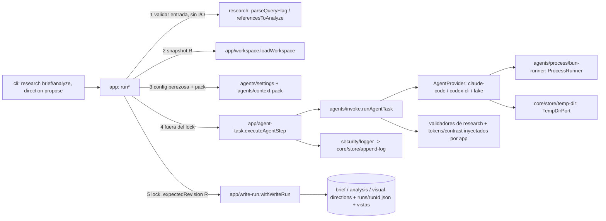

# 0003 Agentes y direcciones visuales reference-only — Design

Parte P3 del master-plan `01-heron`. Cubre R1–R21 de `requirements.md` y los criterios P3.A1–A12 de `parts.json`. Señales de diseño: abstracción compartida nueva (puertos `AgentProvider` y `ProcessRunner`, context packs, plantillas versionadas), contratos persistidos nuevos (`AgentRun`, `ResearchBrief`, `ResearchAnalysis`, `VisualDirections`) y un cambio aditivo en `HeronProject`, áreas críticas (`src/agents/adapters`, `src/core/contracts`, `src/core/state`, `src/core/store`, `src/security`, `tests/repo/boundaries.test.ts`), entrada hostil que llega a un LLM, procesos hijos que usan las credenciales del usuario y una decisión cara de revertir (la frontera de IA). Convenciones vinculantes: skill `heron-architecture` y `references/{patterns,layout,recipes}.md`. Lo decidido en `MASTER.md` (Arquitectura 1, 6, 7, 8; Seguridad; Stack), `DECISIONS.md` (D10, D12, D14, D16, D18, D23–D26) y en las specs 0001 y 0002 no se re-litiga; las desviaciones se declaran en §Decisions. Revisado tras el challenge `challenge_p3-spec.md` (F1–F24): la tabla de §Revisión tras challenge, al final, dice qué se aplicó y qué no.

**Ref verificado:** `git fetch origin develop` OK el 2026-10-01; `origin/develop` = `b8ee0a9`. La rama de trabajo `docs/p2-evidence` solo cambia `specs/_master/01-heron/{STATUS.md,parts.json}` sobre él. Toda cita `archivo:línea` vale para `b8ee0a9`.

**Orden de integración con 0004 (vinculante).** 0004 (`specs/0004-product-context`) se integra **antes** que 0003, precedida por la **T0 de 0004** (micro-tarea compartida, `specs/0004-product-context/tasks.md` › Lote 0) que (a) deriva de los registros las listas y conteos fijos de los tests (`CONTRACT_DOCUMENTS`, `CLI_COMMANDS`, `COMMANDS`, `FINDING_CODES`), (b) define en `src/core/state/lifecycle.ts` una única función `freshen(state, paths)` que limpia las entradas `stale` de artefactos regenerados y que usan las dos specs, y (c) fija la numeración de ADRs: 0003 conserva **ADR 0002** (zonas de escritura, anunciado en `specs/0002-research/tasks.md`) y **ADR 0005** (frontera de IA); 0004 toma **ADR 0006**. Las citas marcadas **†** apuntan a archivos que 0004 modifica antes que P3: al implementar se ubican por el **símbolo** indicado, no por la línea. Las listas append-only (`FINDING_CODES`, `CLI_COMMANDS`, `DocumentKind`, `CONTRACT_DOCUMENTS`, `COMMANDS`, `DOCTOR_CHECK_IDS`, `allowedCommands`) reciben las entradas de P3 **después** de las de P4.

## Decisiones del usuario (resueltas el 2026-10-01)

El usuario resolvió el 2026-10-01 las cuatro decisiones que la versión anterior dejaba abiertas, todas con la opción recomendada. Ahora son DR35–DR38, con la evidencia y las opciones descartadas. La primera versión también planteaba como OD cómo se ejercita Codex y el timeout de `doctor --deep`; esas ya eran DR26 y DR20. El alcance de una configuración inválida es DR21 y la acumulación de las consultas `provided` es DR27. Además, el usuario agregó un requisito: "no tope de costo no significa dejar abierta la manguera — usar patrones que ayuden al ahorro de tokens". Ese requisito se cubre con R19–R21, §Economía de tokens y DR39–DR45.

| Decisión | Elegida (decidido por el usuario 2026-10-01) | DR |
|---|---|---|
| OD1.a autenticación | Suscripción con el binario oficial; API keys fuera del entorno del hijo | DR35 |
| OD1.b `CLAUDE_CODE_OAUTH_TOKEN` | Se reenvía al hijo, redactado en todo sink | DR35 |
| OD1.c rutas de nube/gateway | No se pasan; `AGENT_ENV_IGNORED` lo informa | DR35 |
| OD1.d mínimo de Claude Code | 2.1.259 (MASTER) + sonda de capacidades por `--help` | DR35 |
| OD2 modelo | Sin modelo por default; `agents.models` opcional | DR36 |
| OD3 imágenes | `research analyze` solo con texto en P3 | DR37 |
| OD4 costo | Sin tope duro; se registra y se avisa con un presupuesto blando (DR45) | DR38 |

**Secuencia:** T1 entrega primero `docs/agent-providers.md` §Términos (P3.A11), que registra la evidencia y la conclusión de DR35; el usuario la aprueba como parte de P3.A11.

## Approach

### Qué existe (evidencia)

| Hecho | Evidencia (b8ee0a9; † = 0004 modifica el archivo antes, ubicar por símbolo) | ¿Basta extenderlo? |
|---|---|---|
| Fases, eventos y precondiciones de direcciones ya modelados | `src/core/state/transitions.ts`† `FORWARD_ROWS` (:254-256, filas `directions-proposed` y `approve-gate:direction`), `FACT_CHECKS["three-valid-directions"]` (:112-114), `FACT_CHECKS["direction-selectable"]` (:115-126), `TransitionFacts` (:17-43) | Sí: un hecho nuevo (`researchApprovalValid`); sin filas ni enums nuevos |
| `visual-directions.json` ya es artefacto de fase, depende de las referencias y está atado al gate `direction` | `src/core/state/stale.ts`† `PHASE_ARTIFACTS["directions-ready"]` (:23), `ARTIFACT_DEPENDENCIES` (:40); `src/core/state/gates.ts:26` `GATE_BINDINGS.direction` | Sí |
| `references.json` está atado al gate `research` | `src/core/state/gates.ts:25` | No sirve para notas del agente (DR2) |
| `stale` solo crece | `src/core/state/stale.ts`† `withStale` (:125-137); `src/core/state/lifecycle.ts`† `withArtifacts` (:37-51) | Lo resuelve `freshen`, que la T0 de 0004 agrega a `lifecycle.ts`; P3 solo la llama |
| Envoltorio de escritura con instantánea y revisión esperada | `src/app/write-run.ts:52-145`; captura fuera del lock en `src/app/references.ts`† `runReferencesAdd` | Sí (patrón 3) |
| Un `runId` por invocación de CLI | `src/cli/main.ts:42-43` | Sí: `AgentRun`, `history[]` y logs comparten id |
| Spawn prohibido hoy, "P3 revisits it" | `tests/repo/boundaries.test.ts:248` (`child_process`), `:314` (`Bun.spawn`) | Se abre un único sitio (DR5) |
| `process.kill` ya se usa para sondear el dueño del lock | `src/core/store/lock.ts:38` (`process.kill(pid, 0)` en `defaultIsProcessAlive`) | La regla nueva de `TOKENS` lo permite ahí (DR5) |
| No hay manejadores de señales; el proceso sale con el código del caso de uso | `bin/heron.ts:5` (`process.exit(await runCli(…))`); `ExitCode` cerrado 0–6 en `src/core/contracts/common.ts`† `ExitCode` (:121-130) | Las señales no entran a `ExitCode` (DR5) |
| `process.env` solo en `src/app/context.ts` y `src/cli/main.ts` | Fila `process.env` de `TOKENS`; `src/app/context.ts:80` | Sí: snapshot en `AppContext` |
| Sin sink de logs ni redacción por valor | `docs/security.md:62`; `src/security/redact.ts:33` (solo URLs); P2 DR22 | Se agregan `append-log`, `logger`, redactor |
| `.heron/logs/` ya es local | `src/core/store/file-store.ts:27-36` (`HERON_GITIGNORE`) | Sí |
| `FsPort` sin append | `src/core/store/fs-port.ts:19` | Se amplía con `"a"` |
| Tests sin red por un doble que falla | `tests/helpers/cli.ts:37` (`fetcher: offlineFetcher`) | Mismo patrón para el runner de agentes (DR30) |
| `bun test` recoge todo `*.test.ts` bajo `tests/` | `bunfig.toml` (`[test] root = "tests"`), `package.json` (`"test": "bun test"`) | La prueba en vivo no puede llamarse `*.test.ts` (DR30) |
| `doctor`: checks secuenciales con `runCheck(spec, 10_000)`; ids cerrados; P1 fija 6 líneas | `src/app/doctor.ts:28`, `:203-254`; `src/core/contracts/cli-envelope.ts`† `DOCTOR_CHECK_IDS` (:91-98); `tests/e2e/doctor.test.ts:41-49` | Se extiende con temporizadores propios (DR20) |
| Pie de `USAGE_TEXT` literal y su aserción exacta | `src/cli/args.ts:36-48` (`Gates:`, `Reference sources:`, …); `tests/unit/cli-args.test.ts`† (:112 `toBe`, y la lista de `COMMANDS` justo antes) | P3 agrega 2 líneas al pie (§Contracts 13) |
| `HeronProject` sin agentes; `init` conserva todo salvo `source` | `src/core/contracts/heron-project.ts`† `HeronProject` (:12-22); `src/app/init.ts`† `writeInit` (:142-150) | `agents` opcional y validado de forma perezosa (DR21) |
| Puerto + registro `Partial` con servicios por request | `src/research/ports.ts:39-83`; `src/research/registry.ts:9-19` | Mismo patrón |
| Escáner de texto con forma de instrucción; hallazgos guardados | `src/security/untrusted.ts:112`; `src/core/contracts/research.ts:64-73`, `:85-91` | Se reutiliza (DR9, DR23) |
| Escape de Markdown que neutraliza enlaces, imágenes y autolinks | `src/security/markdown.ts` `escapeMarkdownText` (escapa `!`, `[`, `]`, rompe `https://`) | Todo texto de agente en `REFERENCES.md` pasa por él (DR24) |
| Vistas regeneradas en cada escritura; los JSON del gate no cambian | `src/app/research-store.ts:56-111`; `src/research/render/outputs.ts:30-72` | Sí |
| `allowedCommands` de `status` | `src/app/status.ts`† `readStatus` (:140-149) | Crece |
| Matriz exhaustiva del estado con hechos "satisfechos" | `tests/unit/state-machine.test.ts`† `SATISFIED` (:55-66) | Gana `researchApprovalValid: true` |
| Cobertura por prefijo | `scripts/check-coverage.ts`† `COVERAGE_RULES` (:7-13) | + `src/agents/`, `src/tokens/` |
| CLIs locales y banderas | `claude --help` 2.1.286 (`--safe-mode`, `--restricted`, `--permission-mode`, `--permission-prompts`, `--disallowedTools`, `--json-schema`, `--system-prompt`; `--system-prompt-file` existe en la doc pero `--help` no la lista); `codex exec --help` 0.159.2 (`--ignore-user-config`, `--ignore-rules`, `--json`, `-o`, `--output-schema`, `--image`, `--disable`); `codex features list` | Verificado el 2026-10-01 (DR6) |
| Sesión por exit code | `claude auth status` y `codex login status`: 0 con sesión, 1 sin ella (sonda local con directorios de configuración vacíos; doc en https://code.claude.com/docs/en/cli-reference) | Sí (R14) |

### El problema real

El diseñador necesita que un modelo **interprete** su research (consultas por faceta, notas por referencia) y **proponga** 3 direcciones exploratorias con datos suficientes para que P12 las dibuje en Penpot, usando las suscripciones que ya paga (D18), sin que (a) el agente toque el repo, la red o archivos del host, (b) el contenido externo o el que viene en `.heron/` le dé órdenes, (c) un secreto llegue a un log o a `.heron/`, (d) un agente colgado o una salida inválida dejen el estado a medias, ni (e) los tests dependan de un modelo real. Consumidores: el diseñador (CLI), P12 (compila `visual-directions.json`), P5 (hereda la preferencia, D12) y P7 (loop creator → reviewer sobre el mismo puerto).

### Decision drivers (de las reglas del proyecto)

1. **Capacidad mínima del agente** (RN-35, RN-36, MASTER Arquitectura 1 y Seguridad): sin herramientas, sin MCP, fuera del repo, sin secretos; el control real es de capacidades y schema, y debe fallar cerrado.
2. **Tests deterministas sin modelos reales** (§72, MASTER Testing): proveedor `fake`, binarios falsos, runner que falla por default.
3. **Reproducibilidad y observabilidad** (RN-41, RNF-14).
4. **Lock nunca durante IA** (patrón 3).
5. **Vendors y efectos confinados con fronteras verificadas** (D4, DP2, DP20).
6. **Contratos versionados que fallan fuerte** (RNF-13) y schemas de salida que ambos CLIs aceptan.
7. **Secretos** (RN-40, RNF-7): canarios en 0.
8. **Simplicidad** (§75, CLAUDE.md): sin SDKs, sin colas, regla de 3.
9. **Idioma** (D14).
10. **Integración en serie con 0004** sin colisiones de listas ni de helpers.

### Opciones consideradas

**Frontera de IA.** *Peldaño 1 — patrón existente:* no hay nada de IA. *Peldaño 2 — Agent SDKs:* descartado por MASTER Stack ("Agent SDKs de Anthropic/OpenAI …") y RNF-15. *Peldaño 3 — elegido:* CLIs como proceso hijo, sin herramientas y atados a schema (MASTER Arquitectura 1); no se re-litiga.

**Dónde viven las notas del agente.** *`ResearchReference.agentNotes`* (P2 §NOT in scope lo anticipó): descartado; `references.json` está atado al gate `research` (`src/core/state/gates.ts:25`), cada `analyze` invalidaría la aprobación y mezclaría campos humanos e inferidos (RF-11). *Elegido:* `research/analysis.json` sin gate, con digest por referencia (DR2).

**Cuántos sitios lanzan procesos.** *`Bun.spawn` en cada adapter* (`references/layout.md`): duplica timeout, grupo, señales y límites. *Elegido:* `ProcessRunner` con una implementación (`src/agents/process/bun-runner.ts`), como `src/security/fetch/system.ts` es el único `fetch(` (DR5).

**Control de herramientas en Codex.** *Lista negra de tipos de ítem:* falla abierta ante tipos nuevos, y es el control principal porque `unified_exec` no se apaga. *Elegido:* lista blanca de eventos e ítems; todo lo demás es `policy-violation` (DR7).

**Contraste.** *Número del agente:* viola RN-35. *`colorjs.io` desde P3:* ADR y peso para una fórmula de 20 líneas. *Elegido:* `src/tokens/contrast.ts` puro (DR11).

**Composición SYNTHETIC.** *Árbol recursivo:* `$ref` recursivo en el schema de salida, soporte incierto en el modo estricto de Codex. *Solo texto:* P12 no podría compilarla. *Elegido:* lista plana con `parent` y el vocabulario cerrado de MASTER Contratos (DR12).

**Invocaciones por comando.** *Una por referencia:* N runs, fallas parciales. *Elegido:* una tarea por comando, todo o nada (DR1).

### Recomendación



Cada comando de agente: (1) valida la entrada de forma pura (exit 2 sin escribir); (2) toma la instantánea `R` y verifica fase y precondiciones que no dependen de la salida (exit 3 antes de gastar una invocación); (3) resuelve `agents` (inválido: exit 2) y arma el pack (exit 2 si no cabe); (4) fuera del lock: sonda completa del proveedor (versión, capacidades, sesión), invocación, validación por schema y por validadores de dominio, hasta 2 reparaciones; cada intento al log; (5) con éxito, `withWriteRun(expectedRevision R)` escribe documento, `runs/<runId>.json` y vistas, aplica la transición o `recordCommand`, llama `freshen` y hace commit. Con falla, nada se escribe salvo la línea de log.

## Economía de tokens

Requisito del usuario (2026-10-01): "no tope de costo no significa dejar abierta la manguera — usar patrones que ayuden al ahorro de tokens". Sin tope duro (DR38), cada patrón tiene un mecanismo verificable.

| Patrón | Mecanismo | DR | Verificación |
|---|---|---|---|
| No repetir trabajo | Cache por `agentCacheKey` (plantilla + schema + proveedor + modelo + pack proyectado); `analyze` incremental por `inputKey`; `--force` para saltarla | DR39 | `research-agents.test.ts#reuses the stored run when inputs are unchanged unless --force` (0 llamadas al proveedor en la segunda corrida); `cache.test.ts` |
| Enviar solo lo necesario | Proyección por tarea, `PACK_LIMITS`, HTML → texto, truncado determinista con marcador, sin imágenes | DR9, DR37, DR40, DR44 | `context-pack.test.ts#compacts external text and caps items deterministically` |
| Prefijo estable para la cache de prompt | Plantilla y schema fijos primero; datos variables al final; sin timestamps ni ids aleatorios | DR41 | `context-pack.test.ts#renders a stable prefix without timestamps or run ids` |
| Salida corta y estructurada | Solo JSON del schema con topes; `CLAUDE_CODE_MAX_OUTPUT_TOKENS` por tarea | DR13, DR42 | `argv.test.ts#invokes agent CLIs isolated, tool-less and schema-bound` (entorno del hijo) |
| Contexto mínimo del agente | `--tools ""`, `--safe-mode`, `--restricted`, `--strict-mcp-config`, `--disallowedTools "mcp__*"`; Codex con `--ignore-user-config` y features desactivadas: ni definiciones de herramientas, ni `CLAUDE.md`, ni plugins, skills, MCP o memoria entran al contexto de cada llamada | DR6 | `argv.test.ts#invokes agent CLIs isolated, tool-less and schema-bound` |
| Reparar barato | La reparación manda solo salida previa, issues y hechos mínimos; nunca el pack | DR10, DR43 | `invoke.test.ts#sends only the previous output, the issues and the task facts in a repair` |
| Reusar el análisis | Direcciones con notas guardadas y proyección mínima, sin fuentes crudas | DR44 | `directions.test.ts#feeds directions from stored analyses instead of raw sources` |
| Medir y avisar | Tokens (incl. cacheados) y costo por invocación; totales en `status`/`doctor`; aviso blando por día | DR45 | `agent-usage.test.ts#totals tokens by day from the local log and warns over the soft budget`; `status.test.ts#shows agent token totals and the soft budget`; `doctor.test.ts#reports agent token usage against the soft budget` |

## Components

Rutas exactas. "R" = requisitos de `requirements.md`. `(nuevo)` / `(mod)`. † = 0004 lo modifica antes.

### Store, seguridad y tokens

| Ruta | Responsabilidad | R |
|---|---|---|
| `src/core/store/temp-dir.ts` (nuevo) | `TempDirPort`, `TempWorkspace`, `nodeTempDirs` (`mkdtemp` en `os.tmpdir()`, 0700, archivos 0600, `dispose` recursivo) | R1 |
| `src/core/store/append-log.ts` (nuevo) | `openAppendLog`, `LogSink`, `pruneLogs`, `readLogEvents` | R15, R21 |
| `src/core/store/fs-port.ts` (mod) | `openSync` acepta `"a"` | R15 |
| `src/security/env.ts` (nuevo) | `buildAgentEnv`, `AGENT_ENV_ALLOWLIST`, `AGENT_API_KEY_VARS`, `AGENT_ROUTE_VARS` | R2 |
| `src/security/redact.ts` (mod) | `createValueRedactor`, `Redactor`, `SECRET_NAME_MARKERS` | R6, R15 |
| `src/security/logger.ts` (nuevo) | `createLogger`, `Logger`, `nullLogger`, `LOG_EVENT_NAMES` | R15 |
| `src/tokens/contrast.ts` (nuevo) | `parseHexColor`, `contrastRatio`, `checkContrast`, `CONTRAST_THRESHOLDS` | R12 |

### Contratos y estado

| Ruta | Responsabilidad | R |
|---|---|---|
| `src/core/contracts/agents.ts` (nuevo) | Ids de proveedor, rol, tarea y estado; `AgentSettingsInput`; `AgentRun`, `AgentRunRef`, `AGENT_RUN_DOCUMENT` | R6, R7 |
| `src/core/contracts/directions.ts` (nuevo) | `RESEARCH_FACETS`; salidas de agente; documentos `ResearchBrief`, `ResearchAnalysis`, `VisualDirections` (importa de `agents.ts`, nunca al revés) | R9–R13 |
| `src/core/contracts/agents-data.ts` (nuevo) | `<Cmd>Data` de las 4 órdenes y `AgentRunSummary` | R9–R13 |
| `src/core/contracts/heron-project.ts`† (mod) | `agents?: unknown` (validación perezosa, DR21) | R7 |
| `src/core/contracts/common.ts`† (mod) | 18 `FINDING_CODES` nuevos tras los de P4 | R2–R14, R19, R21 |
| `src/core/contracts/cli-envelope.ts`† (mod) | `CLI_COMMANDS`, unión `data`, `DOCTOR_CHECK_IDS` (aditivo) | R9–R14 |
| `src/core/contracts/version.ts`† (mod) | `DocumentKind` + 4 | R6, R9–R11 |
| `src/core/contracts/index.ts`† (mod) | Barrel + `CONTRACT_DOCUMENTS` (+ 4 tras los de P4) | R6, R9–R11 |
| `schemas/*.v1.schema.json` (regenerados y 4 nuevos) | Deriva cero contra Zod | R6, R9–R11 |
| `src/core/state/transitions.ts`† (mod) | `TransitionFacts.researchApprovalValid`; `three-valid-directions` lo exige | R11 |
| `src/core/state/stale.ts`† (mod) | `PHASE_ARTIFACTS.researching` + `brief.json`, `analysis.json`; `ARTIFACT_DEPENDENCIES` de `analysis.json` y `visual-directions.json` | R10, R11 |
| `src/app/facts.ts`† (mod) | `collectDirectionFacts` (`researchApprovalValid`) | R11 |

`freshen(state, paths)` **no** es componente de P3: la crea la T0 de 0004 en `src/core/state/lifecycle.ts` y P3 solo la llama (DR17, DR31).

### Agentes (`src/agents/`)

| Ruta | Responsabilidad | R |
|---|---|---|
| `src/agents/ports.ts` | `AgentProvider`, `ProcessRunner`, `ProcessSpec`, `ProcessOutcome`, `ProviderServices`, `ProviderProbe`, `AgentRequest`, `AgentAttempt`, `ContextItem`, `ContextPack` | R1, R3–R5 |
| `src/agents/settings.ts` | `DEFAULT_AGENT_SETTINGS`, `resolveAgentSettings` (validación perezosa), `providerIdForRole` | R7 |
| `src/agents/json-schema.ts` | `toProviderSchema`, `OPENAI_STRICT_KEYWORDS`, `assertStrictCompatible` | R1, R3 |
| `src/agents/context-pack.ts` | `buildContextPack`, `renderContextPack`, `repairPack`, `referenceItems`, `compactText`, `PACK_LIMITS` | R5, R20 |
| `src/agents/text-modules.d.ts` | `declare module "*.md"` | R6 |
| `src/agents/prompts.ts` | `PROMPT_TEMPLATES`, `templateFor`, `REPAIR_TEMPLATE` | R3, R6 |
| `src/agents/tasks.ts` | `AGENT_TASKS` (con `maxOutputTokens` por tarea) | R5, R9–R12, R20 |
| `src/agents/cache.ts` | `agentCacheKey`, `analysisInputKey` | R19 |
| `src/agents/process/bun-runner.ts` | `bunProcessRunner` (único `Bun.spawn`/`Bun.which`/`process.on|off|once`; `process.kill` también permitido en `lock.ts`) | R1, R4 |
| `src/agents/adapters/claude-code/index.ts` | `claudeCodeProvider`, `CLAUDE_FIXED_ARGS`, `CLAUDE_REQUIRED_FLAGS`, `claudeArgv` | R1, R6, R14 |
| `src/agents/adapters/codex-cli/index.ts` | `codexCliProvider`, `CODEX_FIXED_ARGS`, `CODEX_ALLOWED_EVENT_TYPES`, `CODEX_ALLOWED_ITEM_TYPES`, `codexArgv`, `codexPrompt` | R1, R8, R14 |
| `src/agents/invoke.ts` | `runAgentTask` | R3, R4, R6, R15 |
| `src/agents/registry.ts` | `AGENT_PROVIDERS`, `providerFor` | R7 |
| `src/agents/adapters/fake/index.ts` | `fakeProvider`, `createFakeProvider` | R3, R11, R12 |
| `src/agents/adapters/fake/responders.ts` | Respuestas deterministas `SYNTHETIC` por tarea | R9–R12 |

### Research y vistas

| Ruta | Responsabilidad | R |
|---|---|---|
| `src/research/brief.ts` (nuevo) | `parseQueryFlag`, `validateResearchQuery`, `validateBriefOutput`, `buildBrief`, `queryId`, `GENERIC_QUERY_TERMS` | R9 |
| `src/research/analysis.ts` (nuevo) | `referenceDigest`, `referencesToAnalyze`, `validateAnalysisOutput`, `mergeAnalysis`, `freshAnalyses` | R10 |
| `src/research/directions.ts` (nuevo) | `validateDirectionsOutput`, `buildVisualDirections`, `selectDirection`, `DIRECTION_LIMITS` | R11–R13 |
| `src/research/layout.ts` (mod) | `RESEARCH_FILES.brief`, `.analysis`, `.directions`; `runPath` | R6, R9–R11 |
| `src/research/render/references-md.ts` (mod) | `renderReferencesMarkdown` con secciones de brief, notas inferidas y direcciones (todo con `escapeMarkdownText`) | R16 |
| `src/research/render/copy.ts` (mod) | Copy `en`/`es` de las secciones | R16 |
| `src/research/render/outputs.ts` (mod) | `renderResearchOutputs` recibe `agent` | R16 |
| `prompts/visual-researcher/research-brief@v1.md` (nuevo) | Plantilla del brief | R9 |
| `prompts/visual-researcher/research-analyze@v1.md` (nuevo) | Plantilla del análisis | R10 |
| `prompts/design-director/direction-propose@v1.md` (nuevo) | Plantilla de direcciones | R11, R12 |
| `prompts/shared/repair@v1.md` (nuevo) | Plantilla de reparación | R3 |
| `prompts/shared/probe@v1.md` (nuevo) | Plantilla de la sonda | R14 |

### Casos de uso y CLI

| Ruta | Responsabilidad | R |
|---|---|---|
| `src/app/context.ts` (mod) | `AppContext.env`, `.agents`, `.logRetentionDays`; `createDefaultContext` | R1, R2, R15 |
| `src/app/agent-task.ts` (nuevo) | `executeAgentStep` (con cache de DR39 y aviso de DR45), `finalizeAgentRun`, `AGENT_STATUS_EXIT` | R3–R7, R15, R19, R21 |
| `src/app/agent-usage.ts` (nuevo) | `summarizeAgentUsage` (totales del log local y presupuesto blando) | R21 |
| `src/app/research-store.ts` (mod) | `readResearch` lee los 3 documentos de agente; `stageResearchOutputs` exige `agent` | R16 |
| `src/app/references.ts`†, `src/app/brand.ts` (mod) | Pasan `agent` a `stageResearchOutputs` | R16 |
| `src/app/research.ts`† (mod) | `runResearchRender` pasa `agent`; `runResearchBrief`, `runResearchAnalyze` | R9, R10, R16 |
| `src/app/directions.ts` (nuevo) | `runDirectionPropose`, `runDirectionSelect` | R11–R13 |
| `src/app/status.ts`† (mod) | `allowedCommands` con las órdenes de P3; `agentUsage` | R9–R13, R21 |
| `src/cli/render.ts`† (mod) | `renderStatusText`: línea de uso de agentes y aviso de presupuesto | R21 |
| `src/app/doctor.ts` (mod) | `DoctorInput.deep`, `agentChecks` (temporizadores propios, en paralelo) | R14 |
| `src/cli/args.ts` (mod) | Pie de `USAGE_TEXT`: `Research facets:` (desde `RESEARCH_FACETS`) y `Agent roles:` | R9, R11 |
| `src/cli/command.ts`† (mod) | `CommandName` + `direction`; `ResearchParsed` (brief, analyze); `DirectionParsed`; `DoctorParsed.deep` | R9–R14 |
| `src/cli/commands/research.ts` (mod) | Subcomandos `brief`, `analyze` | R9, R10 |
| `src/cli/commands/direction.ts` (nuevo) | `directionCommand` | R11–R13 |
| `src/cli/commands/doctor.ts` (mod) | `--deep` | R14 |
| `src/cli/commands/index.ts`† (mod) | Registra `directionCommand` | R11–R13 |
| `src/cli/main.ts` (mod) | `envelopeCommand` para `research brief|analyze` y `direction propose|select` | R9–R13 |
| `src/cli/render-agents.ts` (nuevo) | `renderResearchBriefText`, `renderResearchAnalyzeText`, `renderDirectionProposeText`, `renderDirectionSelectText` | R9–R13 |

### Repo, docs y tests

| Ruta | Responsabilidad | R |
|---|---|---|
| `tests/repo/boundaries.test.ts` (mod) | Filas `src/agents`, `src/tokens`; `node:os` en `temp-dir.ts`; `Bun.spawn`, `Bun.which`, `process.on|off|once` solo en `bun-runner.ts`; `process.kill` en `bun-runner.ts` y `src/core/store/lock.ts` | R1 |
| `scripts/check-coverage.ts`† (mod) | `src/agents/` y `src/tokens/` a 0,9 | RNF-8 |
| `tests/repo/coverage-rules.test.ts`† (mod) | Vigila los prefijos nuevos | RNF-8 |
| `package.json` (mod) | Script `test:live` = `bun tests/live/agents.live.ts` (fuera de `bun test`) | R18 |
| `docs/adr/0002-store-write-zones.md` (nuevo) | Zonas de escritura (enmienda DP2) | R17 |
| `docs/adr/0005-ai-provider-boundary.md` (nuevo) | Frontera de proveedores de IA | R17 |
| `docs/agent-providers.md` (nuevo) | §Términos (P3.A11, primero) y luego instalación, versiones, banderas exactas, entorno, roles, `doctor`, costos | R17 |
| `docs/architecture.md`, `docs/security.md`, `docs/research.md`, `README.md` (mod) | Módulo `agents`, zonas, prompt injection y secretos de agentes, flujo brief/analyze/directions, órdenes nuevas | R17 |
| `tests/repo/docs.test.ts`† (mod) | ADRs, `docs/agent-providers.md`, cada bandera fija presente en la doc, §Términos con fuentes y fechas | R17 |
| `tests/repo/live-agents.test.ts` (nuevo) | `fixedContext` rechaza spawns; ningún `*.test.ts` usa `HERON_LIVE_AGENTS`; `tests/live/` sin `*.test.ts` | R1 |
| `tests/live/agents.live.ts` (nuevo) | Sonda viva opt-in (`HERON_LIVE_AGENTS=1 bun run test:live`): banderas, sesión, schema por tarea | R18 |
| `tests/helpers/agents.ts` (nuevo) | `writeFakeAgentBin`, `fakeBinEnv`, `withAgentSettings`, `researchReadyWorkspace`, `scriptedProvider`, `refusingRunner` | — |
| `tests/helpers/cli.ts` (mod) | `fixedContext` con `env: {}`, `agents: { runner: refusingRunner, providers: { fake: fakeProvider } … }`, `logRetentionDays` | — |
| `tests/helpers/faulty-fs.ts` (mod) | Acepta `"a"` | — |
| `tests/e2e/p2-compat.test.ts`† (mod) | Workspaces de P2 sin `agents` ni documentos de agente | R7, R16 |
| Tests de §Testing strategy | — | R1–R17 |

## Decisions

- **DR1 — Una tarea de agente por comando, fuera del lock.** Hasta 3 invocaciones sobre la instantánea `R`; solo el commit toma el lock (`withWriteRun(expectedRevision R)`). Si otro comando escribió, exit 6 y la salida se descarta (DR22). Cubre R3, R11.
- **DR2 — Notas del agente en `research/analysis.json`.** Sin gate; por referencia `referenceSha256 = referenceDigest(ref)` y `origin: "inferred"`; `references.json` y `provenance.json` no cambian (RF-11). Desviación declarada de P2 §NOT in scope. Cubre R10.
- **DR3 — Estado de las direcciones en P3.** `VisualDirections.mode` es `reference-only` en P3. `direction select` guarda `preferred` salvo que documento y proyecto sean `full` (P5: `selected`); `directionSelected` = `selection?.status === "selected"`. En un proyecto `full`, `direction propose` produce direcciones `reference-only` con `DIRECTIONS_WITHOUT_UX_CONTEXT`. Cubre R11, R13.
- **DR4 — Re-proponer limpia la preferencia** con `DIRECTION_PREFERENCE_CLEARED`; heredarla es de P5 (D12). Cubre R11, R13.
- **DR5 — Un solo sitio de spawn y semántica de señales.** `bunProcessRunner` es la única implementación de `ProcessRunner` y el único archivo con `Bun.spawn`, `Bun.which` y `process.on|off|once`; `process.kill` se permite ahí y en `src/core/store/lock.ts` (sondeo existente del dueño del lock). Reglas: `detached: true` (nuevo grupo); al vencer, `process.kill(-pid, "SIGTERM")` y `SIGKILL` tras `killGraceMs` (3 000 ms; ≤ 5 000 por RNF-6), cada `kill` en try/catch (`ESRCH` = ya murió) y nunca después de que el hijo salió (se chequea `exitCode` antes, contra pid reutilizado); tras el `SIGKILL` se espera `exited` como máximo `killGraceMs` y luego se **cancelan los lectores** de stdout/stderr (un nieto que retiene la tubería no cuelga a Heron); los timers se limpian en `finally`; un `EPIPE` al escribir stdin cuenta como `failed`. Señales del padre: mientras haya un hijo vivo, SIGINT/SIGTERM de Heron matan el grupo, desinstalan el manejador y **re-emiten la misma señal** (`process.kill(process.pid, signal)`), así Heron termina con el estado convencional de la señal; no hay código propio ni envelope (las señales quedan fuera de `ExitCode`, que sigue cerrado 0–6). Los descendientes que crean otra sesión (PTY de `unified_exec`) no los alcanza `kill(-pid)`: los contiene el sandbox `read-only` sin red de Codex, y en Claude no existen (sin herramientas). Enmienda `references/layout.md`. Cubre R1, R4.
- **DR6 — Banderas de aislamiento adicionales a P3.A1 (sondeadas en `--help` el 2026-10-01).** Claude Code: `--safe-mode` (doc: "CLAUDE.md, skills, plugins, hooks, MCP servers … and auto memory do not load. Authentication, model selection, built-in tools, and permissions work normally"), `--restricted` (≥ 2.1.248; doc: "Use it when an evaluation harness drives `claude` on a shared machine and Claude Code must not run commands or read that machine's user and project settings"; carga solo settings administrados y `--settings`, así que **reemplaza** al "`--setting-sources` mínimo" de MASTER Seguridad con un efecto más fuerte), `--permission-mode dontAsk` y `--permission-prompts none` (≥ 2.1.259), `--disallowedTools "mcp__*"` (la doc: `--tools` "doesn't affect MCP tools"), `--system-prompt <plantilla>` (reemplaza el prompt de agente de código, como recomienda la doc para "a non-coding agent in a pipeline"; se usa la forma en línea y no `--system-prompt-file` porque `claude --help` 2.1.286 no lista esta última y la sonda de capacidades solo puede exigir lo que `--help` muestra). Codex: `--ignore-user-config`, `--ignore-rules`, `--json`, `-o`, `--color never`, `--disable` de `shell_tool`, `browser_use`, `browser_use_external`, `computer_use`, `apps`, `plugins`, `hooks`, `multi_agent`, `image_generation`, `view_image` (existen en 0.159.2; un nombre desconocido aborta con "Unknown feature flag", sondeado) y `-c web_search="disabled"` (verificado en la sonda viva del 2026-10-01, codex 0.159.3: el valor, la lista `--disable` y `--ignore-user-config` fueron aceptados con salida 0). **No hay reversión que quite una bandera**: si una versión no la soporta, la sonda de capacidades (DR35.d) bloquea con `AGENT_UNAVAILABLE`; la única reversión es subir el mínimo. Verificado en la sonda viva del 2026-10-01 (claude 2.1.287): las banderas de DR6 conservan la sesión de suscripción (salida 0) y `--tools ""` + `--json-schema` produce `structured_output` (el plan B de DR13 queda como respaldo). [SIN VERIFICAR] hasta una sonda dedicada: que `~/.codex/AGENTS.md` no se cargue con `--ignore-user-config`. Cubre R1, R8.
- **DR7 — Monitor de eventos de Codex por lista blanca (falla cerrada).** `unified_exec` no se desactiva en 0.159.2 (`--disable unified_exec` no cambia `codex features list`, sondeado), así que el monitor es el control principal. Cada línea de stdout (`--json`) se parsea; se permite solo: eventos `thread.started`, `turn.started`, `turn.completed`, `turn.failed`, `item.started`, `item.updated`, `item.completed`, `error`, e ítems de tipo `agent_message` y `reasoning`. Cualquier otra cosa (tipo de ítem desconocido o de herramienta, evento desconocido, línea no JSON, objeto sin `type`) devuelve `{ stop: <token> }` al runner, que mata el grupo; el run queda `policy-violation` (exit 3). El `token` es el tipo saneado (`[a-z_.]{1,40}`, si no `"unknown"`); **la línea cruda nunca sale del callback** (puede traer `aggregated_output` con archivos del host): ni a `ProcessOutcome`, ni al finding, ni al log. Codex corre con `captureStdout: false` (solo se conservan los contadores de uso de `turn.completed`). Subir el mínimo de Codex o probar una versión nueva exige re-sondear la lista (`docs/agent-providers.md`). Cubre R8.
- **DR8 — Context packs deterministas.** Ítems con `kind`, `id`, `trust`, prioridad y contenido; orden por (prioridad, orden de kind, número de id). Solo los kinds de `AGENT_TASKS[task].allowedItems` entran (otro kind es error de programación, P3.A4). Antes del presupuesto se aplican los topes y la compactación de DR40. Recorte (último recurso): si `chars > budget`, se truncan a 2 000 caracteres los ítems recortables (`external-text`, `analysis-note`, `brief-query` inferida) de mayor número de prioridad y mayor id primero, y luego se descartan en el mismo orden; prioridad 0 nunca se toca; si no alcanza, `CONTEXT_PACK_OVER_BUDGET` (exit 2) sin invocar, con un remedio por comando (§Contracts 14). El pack viaja por stdin; 120 000 caracteres quedan muy por debajo del tope de 10 MB de stdin de Claude Code (https://code.claude.com/docs/en/headless). Cubre R5.
- **DR9 — Delimitación y proyección.** Todo ítem que no sea `heron` (instrucciones y hechos de Heron) va delimitado entre `<<<data:{trust}:{sha8}>>>` y `<<<end:{sha8}>>>` (`sha8` = primeros 8 hex del sha256 de su contenido; el contenido no puede contener su propio cierre salvo un punto fijo de sha256), con los caracteres ocultos o bidi reescritos como `\u{XXXX}`: también lo `operator`, porque un `.heron/` clonado de otro repo es contenido de un tercero. El ítem `reference` es una **proyección por lista blanca** (`referenceItems`): `id`, `source`, `reason`, `studies`, `doNotCopy`, `influences`, `crops[].note`; `origin` va en un ítem aparte `reference-origin` (`untrusted`) y de `securityFindings` solo pasa el conteo (`findings="{n}"` en la cabecera), nunca `phrase`. Las plantillas dicen que todo lo delimitado es dato y que no se siguen instrucciones ahí; el control real sigue siendo de capacidades (DR6, DR7). Cubre R5.
- **DR10 — Reparación compacta.** Intento 1 con la plantilla de la tarea y el pack completo; intentos 2 y 3 con `prompts/shared/repair@v1.md` y un pack de reparación (`repairPack`) que **no** reenvía el pack original: solo `task-input` (hechos mínimos: ids válidos, facetas, umbrales), `previous-output` (`untrusted`, ≤ 32 000 caracteres) y `validation-issues` (`heron`) (DR43). Repara JSON inválido o cortado, falta de salida estructurada, Zod y validadores de dominio; no repara `timeout`, `failed`, `policy-violation`, `unavailable`. Cubre R3, R20.
- **DR11 — Contraste en `src/tokens/contrast.ts`.** WCAG 2.2 (umbral sRGB 0,04045) sobre `#RRGGBB`; `passes` con el valor sin redondear, `ratio` guardado a 2 decimales half-up; umbrales de RNF-9. `research` no importa `tokens`: `app` inyecta `checkContrast`. Adelanta un archivo del módulo `tokens` de P5 (enmienda de `references/layout.md`). Cubre R12.
- **DR12 — Composición plana** (`nodes[]` con `parent`, vocabulario cerrado de MASTER, ≤ 60 nodos, profundidad ≤ 6, una raíz, sin ciclos, referencias existentes; texto `SYNTHETIC`). Cubre R12.
- **DR13 — Schemas de salida y dialectos.** Salidas con `z.strictObject`, todo requerido (opcional = `nullable`), sin recursión; un único `shape` alimenta la versión estricta (salida) y la `looseObject` (documento). `toProviderSchema(schema, "claude")` = `z.toJSONSchema` con `target: "draft-7"` y sin el `$schema` raíz (enmendado tras la sonda viva del 2026-10-01, claude 2.1.287: el validador de `--json-schema` respondió `no schema with key or ref "https://json-schema.org/draft/2020-12/schema"` y salió con 1, así que el CLI aplica su dialecto por defecto; los schemas de salida no usan `$defs`, `definitions`, `prefixItems` ni `$ref`, verificado). `"openai-strict"` es **conservador**: conserva solo `OPENAI_STRICT_KEYWORDS` (`type`, `properties`, `required`, `additionalProperties`, `items`, `enum`, `const`, `anyOf`, `description`) y quita todo lo demás (`$schema`, `pattern`, `format`, `minLength`, `maxLength`, `minItems`, `maxItems`, `minimum`, `maximum`, `exclusiveMinimum`, `exclusiveMaximum`, `multipleOf`, `default`); Zod revalida todo y la reparación cubre lo que el dialecto no pide. Se amplía una palabra solo cuando la sonda viva la demuestre. Claude: si `structured_output` falta, el adapter intenta `JSON.parse` sobre `result` (sin cerco de código) antes de declarar `invalid-output` (plan B de `--tools ""` + `--json-schema`). El schema de Claude viaja como un argumento (decenas de KB) y el de Codex como archivo en `io`. Salida acotada: DR42. Cubre R1, R3.
- **DR14 — Entorno del hijo por lista blanca.** `buildAgentEnv` copia solo `AGENT_ENV_ALLOWLIST`, agrega `NO_COLOR=1`, nunca copia `HERON_*`/`PENPOT_*`, ni `AGENT_API_KEY_VARS` (DR35.a), ni `AGENT_ROUTE_VARS` (DR35.c); los que estaban presentes se informan con `AGENT_ENV_IGNORED`. `CLAUDE_CODE_OAUTH_TOKEN` pasa (DR35.b) y el redactor lo trata como secreto. Cubre R2.
- **DR15 — `AgentRun` solo para runs exitosos; fallas al log.** `runs/<runId>.json` en la misma transacción que el documento; stdout/stderr no se guardan. Un run fallido no toca `.heron/` salvo `logs/`. `runs/**` no entra en `state.artifacts`. Cubre R3, R6.
- **DR16 — Logs.** `.heron/logs/<YYYY-MM-DD>.jsonl` (UTC de `ctx.clock`), una línea JSON canónica por evento, append sin fsync (best effort). Eventos en P3: `agent.invocation` y `security.finding`. Poda a 30 días (D16). Todo pasa por `Redactor`. `doctor` no escribe logs. El resto de eventos y el sink a stderr: P9. Cubre R15.
- **DR17 — `freshen` de la T0 de 0004.** `freshen(state, paths)` vive en `src/core/state/lifecycle.ts` y la crea la **T0 de 0004** (micro-tarea compartida, con su caso `tests/unit/lifecycle.test.ts#freshens regenerated artifacts and marks their dependents stale`). P3 no define ni conserva un helper propio: la llama al reescribir `brief.json`, `analysis.json` y `visual-directions.json`, y `withArtifacts` sigue marcando `stale` a los dependientes. Cubre R10, R11.
- **DR18 — Precondición de direcciones.** `three-valid-directions` exige `researchApprovalValid`; cierra la pregunta abierta de P2. `app` la evalúa antes de invocar con `validDirections: 3` hipotético (exit 3). Cubre R11.
- **DR19 — Fases de brief y analyze:** donde existe la fila `reference-added` (`src/core/state/transitions.ts`† `FORWARD_ROWS`, :248-252), el congelamiento de P2 DR4. Sin transición: `recordCommand` + `withArtifacts` + `freshen`. Cubre R9, R10.
- **DR20 — `doctor`: base WARNING, `--deep` FAIL, temporizadores propios (la primera versión lo planteaba como OD).** `agentChecks` **no** pasa por `runCheck`: corre los proveedores asignados a un rol **en paralelo**, cada uno con ≤ 2 spawns (`--version`, `auth status`) de `probeTimeoutMs` = 4 000 ms (≤ 8 s por proveedor, dentro de RNF-5 aunque sean dos); stdout de `auth status` descartado; nunca lee `~/.claude`, `~/.codex` ni el keychain. Ausente, viejo o sin sesión = WARNING (P1/P2 sin IA siguen en exit 0); `fake` asignado = WARNING; `agents` inválido = WARNING `agents.config`. `--deep` corre la sonda completa (versión, capacidades, sesión) y la tarea `probe` por proveedor, en paralelo, con `deepTimeoutMs` = 60 000 ms propio: RF-4 no fija tiempo para `--deep` y RNF-5 sigue rigiendo `doctor` sin `--deep`; una falla es FAIL `dependency` (exit 5). Cubre R14.
- **DR21 — Configuración de agentes perezosa.** `HeronProject.agents` se persiste como `unknown` opcional (no invalida `project.json`); `resolveAgentSettings` lo valida con `AgentSettingsInputSchema` solo en los comandos de agente y en `doctor`. Inválido → `AGENT_CONFIG_INVALID` (exit 2, issues con punteros `/agents/…`, ruta `.heron/project.json`), como pide `references/recipes.md` ("Configuración inválida → exit 2"); `status`, `references`, `init` y el resto no se ven afectados (un typo no bloquea Heron). Modelos con `MODEL_NAME_PATTERN` (nunca empiezan con `-`). `timeoutMs` 1 000..3 600 000 (P3.A3 configura 2 000 por esta vía). Sin `HERON_AGENT_*`. No es OD: la convención ya decide. Cubre R7, R4.
- **DR22 — Sin caché de salidas tras exit 6.** Cubre R3.
- **DR23 — Guarda de secretos y de segundo orden en la salida.** Redactor por valor sobre el JSON validado antes de escribir (`SECRET_REDACTED`); `scanUntrustedText` sobre sus textos (`AGENT_OUTPUT_SUSPICIOUS` + `security.finding`, no bloquea; vuelve a los packs delimitado). Cubre R6.
- **DR24 — Vistas.** `REFERENCES.md` gana tres secciones solo si existe el documento; todo texto de agente pasa por `escapeMarkdownText` (enlaces, imágenes y autolinks quedan inertes). Sin documentos, bytes idénticos a P2. El moodboard no cambia (D24). `research render` re-deriva vistas, no crea `visual-directions.json` (desviación menor de RF-10). Cubre R16.
- **DR25 — Códigos de salida** solo vía `ExitCode.*`: 2 entrada/config/pack/consulta; 3 fase, precondición, documento inválido, `policy-violation`; 4 `invalid-output`; 5 agente no disponible, falla o `timeout`; 6 lock o revisión. Las señales no tienen código propio (DR5). Cubre R3–R8.
- **DR26 — Codex en P3 (la primera versión lo planteaba como OD).** MASTER ya fija que el loop creator → reviewer es P7: las tareas de P3 usan `creator`; Codex se ejercita en P3.A12 intercambiando `agents.roles` y en `doctor --deep`. Mapeo tarea → rol y ronda de reviewer: fuera (P7). Cubre R7, R18.
- **DR27 — Consultas `provided` acumulativas.** `buildBrief` conserva las consultas `provided` del `brief.json` previo y agrega las nuevas (dedupe por id); las `inferred` se reemplazan en cada corrida; `--reset-queries` descarta las `provided` anteriores. Cubre R9.
- **DR28 — Ids de consulta estables.** `queryId = "Q-" + primeros 8 hex de sha256(faceta + "\n" + consulta en minúsculas)`; re-generar el brief no cambia el significado de un id. `analysis.answersQueries` se filtra contra los ids vigentes al renderizar y al armar packs. Por eso `analysis.json` depende solo de `references.json` (su frescura es por digest de referencia), no de `brief.json`: un brief nuevo no deja `stale` el análisis sin nada que lo limpie. Cubre R9, R10.
- **DR29 — Plantilla en Codex.** Codex no tiene `--system-prompt`: el adapter manda por stdin `codexPrompt(system, pack)` = `<heron-instructions>\n{plantilla}\n</heron-instructions>\n\n{pack}`; la plantilla queda a nivel de usuario (separación de roles más débil que en Claude), compensada por los controles de capacidad (DR6, DR7). `-c developer_instructions=…` como canal de sistema queda [SIN VERIFICAR] para un seguimiento. `argv.test.ts` verifica que el stdin de Codex empieza con la plantilla. Cubre R1.
- **DR30 — Tests sin agentes reales por construcción.** `fixedContext` inyecta `agents.runner = refusingRunner` (lanza "real agent CLI spawned in a default test", como `offlineFetcher` en P2) y `providers = { fake: fakeProvider }`; los tests de adapters pasan `bunProcessRunner` y binarios falsos explícitamente. La sonda viva se llama `tests/live/agents.live.ts` (fuera del patrón `*.test.ts`, así `bun test` y `bun run check` nunca la recogen) y corre con `HERON_LIVE_AGENTS=1 bun run test:live`. Cubre R1.
- **DR31 — Integración después de 0004 y de su T0.** P3 depende de la **T0 de 0004** (`specs/0004-product-context/tasks.md` › Lote 0): `freshen` única (DR17), aserciones de tests derivadas de `CONTRACT_DOCUMENTS`, `CLI_COMMANDS`, `COMMANDS`, `FINDING_CODES` y `DOCTOR_CHECK_IDS` (sin conteos fijos) y reserva de ADR (0002 y 0005 para P3, 0006 para P4). P3 no reimplementa la T0: solo agrega entradas a los registros, llama `freshen`, usa ADR 0002/0005 y rebasa las citas † por símbolo. Cubre —.
- **DR32 — Sin `AgentRun.direction` en P3.** Siempre sería `null`; P5 lo agrega (aditivo) cuando el pack incluya una dirección. Evita además el ciclo `agents.ts` ↔ `directions.ts`: `directions.ts` importa `AgentRunRef` de `agents.ts` y nunca al revés. Cubre R6.
- **DR33 — Hex tolerante.** `PaletteColorOutput.hex` acepta `^#[0-9A-Fa-f]{6}$` y `buildVisualDirections` lo normaliza a mayúsculas: no se gastan reparaciones en la caja. Cubre R12.
- **DR34 — `brief.json` en `PHASE_ARTIFACTS.researching`** (junto con `analysis.json`): es research; si una regresión vuelve antes de `researching`, quedan `stale` como el resto del research. Cubre R9, R10.
- **DR35 — Autenticación, credenciales y términos (decidido por el usuario 2026-10-01; antes OD1).** Evidencia (2026-10-01): los términos de consumo de Anthropic (vigentes desde 2025-10-08) prohíben el acceso "through automated or non-human means … script" salvo con API key "or where we otherwise explicitly permit it" (https://www.anthropic.com/legal/consumer-terms). La página legal de Claude Code dice que OAuth de Free/Pro/Max "is designed to support ordinary use of Claude Code", que "Developers building products … should use API key authentication", que no impide "an end user from signing in to the unmodified Claude Code binary with their own Claude subscription" y que los límites de Pro/Max "assume ordinary, individual usage" (https://code.claude.com/docs/en/legal-and-compliance). Con `-p`, `ANTHROPIC_API_KEY` "is always used when present" (https://code.claude.com/docs/en/authentication), y en Codex una API key "takes precedence" (https://platform.openai.com/docs/codex/non-interactive-mode). Los términos de OpenAI quedan [SIN VERIFICAR] (403). Decisiones: **(a)** suscripción con el binario oficial sin modificar y la sesión del operador; `AGENT_API_KEY_VARS` nunca llega al hijo y `AGENT_ENV_IGNORED` lo informa. Descartadas: solo API keys (contradice D18, cobro por token) y ambas por proveedor (más configuración). **(b)** `CLAUDE_CODE_OAUTH_TOKEN` se reenvía si el operador lo exportó (permite CI/headless) y el redactor lo trata como secreto. Descartada: solo login interactivo. **(c)** Las rutas de nube o gateway (`AGENT_ROUTE_VARS`) no se pasan y `AGENT_ENV_IGNORED` lo informa. Descartada: pasarlas. **(d)** El mínimo de Claude Code sigue en 2.1.259 (MASTER) y la sonda `full` exige que `claude --help` liste cada bandera de `CLAUDE_REQUIRED_FLAGS`; si falta una, `AGENT_UNAVAILABLE` y nunca se invoca. Descartada: subir el mínimo a 2.1.286. §Términos (T1) registra esta conclusión para P3.A11. Cubre R2, R1, R17.
- **DR36 — Modelo por proveedor (decidido por el usuario 2026-10-01; antes OD2).** Sin `--model`/`-m` por default; `agents.models.<id>` es opcional y `AgentRun` registra `model.requested` y `model.reported` (Claude: claves del desglose por modelo; Codex: vacío, porque sus eventos documentados no lo traen). Descartadas: defaults fijados por Heron (decide modelo y costo por el usuario) y exigir el modelo antes del primer uso (fricción). Cubre R6, R7.
- **DR37 — `research analyze` solo con texto en P3 (decidido por el usuario 2026-10-01; antes OD3).** El agente recibe campos humanos proyectados, notas de crop y texto externo compactado, nunca imágenes. Descartadas: imágenes nativas en P3 (requieren una sonda por proveedor y cuestan más) y la herramienta `Read` (contradice P3.A1). Las imágenes quedan como seguimiento tras una sonda. Cubre R10, R20.
- **DR38 — Sin tope duro de costo (decidido por el usuario 2026-10-01; antes OD4).** El límite por comando es estructural: ≤ 3 invocaciones (1 + 2 reparaciones compactas, DR43), sin reintento ante `timeout`, cada una con su `timeoutMs`. Tokens, tokens cacheados, costo estimado y duración se registran (DR45) y un umbral diario configurable avisa sin bloquear. Descartadas: tope por comando configurable y tope diario duro. El ahorro concreto lo dan DR39–DR44. Cubre R21.
- **DR39 — Cache de resultados por clave de entrada.** `agentCacheKey` = sha256 de `canonicalJson({ task, template: { id, version, sha256 }, schema: { dialect, sha256 }, provider, model: requested, pack: pack.sha256 })`; se guarda en `AgentRun.cacheKey` y en el `AgentRunRef` del documento. `research brief` y `direction propose` no invocan cuando se cumplen las cuatro condiciones: la clave nueva es igual a la del documento vigente, el documento conserva el sha256 de `AgentRun.outputs` (no fue editado a mano), `runs/<runId>.json` existe y no se pasó `--force`. En ese caso responden exit 0, `AGENT_RUN_REUSED` (info) y `run.reused = true`, sin escribir y sin revisión nueva. `research analyze` aplica lo mismo por referencia: `ReferenceAnalysis.inputKey = analysisInputKey(referenceDigest, template, schema, provider, model)`, así que solo se envían las referencias cuya clave cambió (análisis incremental) y `--force` re-analiza las pedidas o todas. La clave es estable porque el pack es determinista (DR41). Cubre R19.
- **DR40 — Proyección y compactación del input.** Cada tarea recibe solo los campos de su proyección (DR9, DR44) y `PACK_LIMITS`: ≤ 30 referencias por pack, en orden ascendente de id (`analyze` procesa las primeras 30 pendientes y lista las restantes para la siguiente corrida); ≤ 6 000 caracteres de texto externo por referencia; ≤ 20 insumos de marca; ≤ 20 consultas. Antes de truncar, `compactText` pasa el texto externo de HTML a texto: quita los bloques `script`, `style` y `noscript` y las etiquetas, decodifica `&amp; &lt; &gt; &quot; &#39; &nbsp;` y colapsa espacios. Es un escáner lineal sin RegExp con cuantificadores anidados. Luego trunca la cabeza con el marcador `[…truncated by Heron: {n} chars omitted]`. Nunca entran imágenes (DR37), internos de captura, `capturedAt`, rutas ni hallazgos crudos. El recorte por presupuesto de DR8 queda como último recurso. Cubre R20.
- **DR41 — Orden apto para la cache de prompt.** Prefijo estático primero y datos variables al final. En Claude: `--system-prompt` = plantilla (fija por tarea y versión), `--json-schema` fijo por tarea, y el stdin del pack empieza con la cabecera y los ítems estáticos (`task-input` y `contrast-policy`, sin valores por corrida) antes de los ítems variables en orden determinista. En Codex: el bloque `<heron-instructions>` va primero (DR29). Ningún prompt incluye `runId`, fechas, duraciones, ids aleatorios, rutas absolutas ni conteos que cambien sin que cambie la entrada. Beneficio: corridas repetidas dentro de la ventana de cache del proveedor reutilizan el prefijo. Claude Code cachea prompts con TTL configurable (`CLAUDE_CODE_PROMPT_CACHE_TTL`, https://code.claude.com/docs/en/env-vars); Heron no lo cambia. Codex reporta `cached_input_tokens`. Los tokens cacheados se registran (DR45). Cubre R20.
- **DR42 — Salida estructurada y acotada.** Solo JSON del schema, sin prosa fuera de campos con largo máximo; los arrays y strings de las salidas tienen topes (§Contracts 5). Claude: Heron fija `CLAUDE_CODE_MAX_OUTPUT_TOKENS` en el entorno del hijo con `AGENT_TASKS[task].maxOutputTokens` (brief 4 000, analyze 8 000, direction-propose 16 000, probe 500). La variable está documentada ("Set the maximum number of output tokens for most requests … Claude Code lowers a value above a model's cap to the cap", https://code.claude.com/docs/en/env-vars, consultado 2026-10-01) y la pone Heron, no se hereda. Una salida cortada cuenta como `invalid-output` y se repara (DR43). Codex: sin bandera verificada; lo acota el schema; `-c model_max_output_tokens` queda [SIN VERIFICAR] y no se usa. Cubre R20.
- **DR43 — Reparación sin reenviar el prompt.** Las sesiones no se persisten (P3.A1: `--no-session-persistence`, `--ephemeral`), así que no se puede continuar la conversación. Por eso cada reparación es una invocación nueva y pequeña: plantilla `shared/repair`, `task-input` (ids, facetas y umbrales válidos), salida previa (≤ 32 000 caracteres) e issues; nunca el pack original. Con reparaciones así de baratas se mantienen las 2 que permite P3.A2. Cubre R3, R20.
- **DR44 — Direcciones desde el análisis guardado.** `direction-propose` no recibe `external-text` ni `reference-origin`. Para una referencia con análisis fresco va la proyección mínima (`id`, `reason`, `doNotCopy`, `influences`) más su `analysis-note`; sin análisis fresco, la proyección normal. Nunca fuentes crudas. Cubre R20.
- **DR45 — Telemetría y presupuesto blando.** `AgentUsage` por invocación: `inputTokens`, `outputTokens`, `cachedInputTokens`, `costUsd`, `costIsEstimate`. **Semántica normalizada (2026-10-01):** `inputTokens` = total de tokens de entrada procesados por la invocación (frescos + escritura de cache + lectura de cache); `cachedInputTokens` = el subconjunto leído de cache. Razón: en la API de Anthropic `usage.input_tokens` EXCLUYE lecturas y escrituras de cache; la sonda viva de claude 2.1.287 dio `inputTokens: 2` con `cachedInputTokens: 706` en una respuesta trivial, así que sumar solo `input_tokens` subcontaría gravemente el presupuesto blando. En Claude: `inputTokens = input_tokens + cache_creation_input_tokens + cache_read_input_tokens` (se suman los numéricos presentes; `null` solo si los tres faltan), `cachedInputTokens = cache_read_input_tokens`, `outputTokens = output_tokens`, `costUsd = total_cost_usd`. Verificado en la sonda viva: claves del sobre `-p`: `api_error_status, duration_api_ms, duration_ms, fast_mode_disabled_reason, fast_mode_state, first_content_frame_ms, is_error, modelUsage, num_turns, permission_denials, queued_turn_count, result, result_index, session_id, stop_reason, structured_output, subagent_stats, subtype, terminal_reason, time_to_request_ms, total_cost_usd, ttft_ms, ttft_stream_ms, type, usage, uuid`; claves de `usage`: `cache_creation, cache_creation_input_tokens, cache_read_input_tokens, fallback_credit, inference_geo, input_tokens, iterations, output_tokens, output_tokens_details, server_tool_use, service_tier, speed`; `modelUsage` está indexado por id de modelo (`claude-opus-5-5`); `total_cost_usd` es un número. En Codex salen de `turn.completed.usage.{input_tokens,cached_input_tokens,output_tokens}` (verificado el 2026-10-01 con codex 0.159.3; las claves vistas son `cache_write_input_tokens`, `cached_input_tokens`, `input_tokens`, `output_tokens` y `reasoning_output_tokens`; las dos extra hoy no se suman: `cache_write_input_tokens` y `reasoning_output_tokens`). Codex no cambia: `input_tokens` se toma como que ya incluye `cached_input_tokens`, según la semántica de uso de OpenAI; la sonda mostró `cached_input_tokens` en 0 (`input_tokens` 11112, `output_tokens` 23), así que esa inclusión no se observó y se apoya solo en la documentación de OpenAI. Los eventos `agent.invocation` los llevan. `summarizeAgentUsage` suma el día UTC y la ventana de retención (30 días) desde el log local (por workspace, no por cuenta). `status` muestra una línea y `StatusData.agentUsage`; `doctor` agrega el check `agents.usage`. `agents.warnTokensPerDay` (entero ≥ 1 000, sin default = sin aviso) dispara `AGENT_BUDGET_WARNING` (warning) en `status`, `doctor` y al final de cada comando de agente cuando los tokens de entrada + salida del día lo superan. Nunca bloquea (DR38). Un run reutilizado (DR39) suma 0. Cubre R21.

### Supuestos y preguntas abiertas

- Decididas por el usuario (2026-10-01): DR35–DR38.
- *[assumed]* 0004 y su micro-tarea compartida se integran antes (DR31).
- *[repo → P5]* Reutilización de la composición plana en `ScreenDesign.layout`; `AgentRun.direction`.
- *[repo → P12]* Render de la composición y la paleta en Penpot.
- *Sonda viva del 2026-10-01 (claude 2.1.287, codex 0.159.3; `HERON_LIVE_AGENTS=1 bun run test:live`).* Verificado: sondas completas de ambos CLIs (`ready`; mínimos 2.1.259 y 0.159.2), banderas de DR6 en `--help`, Codex con `-c web_search="disabled"`, `--disable` e `--ignore-user-config` (salida 0), `turn.completed.usage` con `cached_input_tokens` (DR45), un `invoke` de Codex con salida válida y sin `policy-violation`. Tipos de evento/ítem de Codex en una respuesta trivial: `thread.started`, `turn.started`, `item.completed/agent_message`, `turn.completed`. Claude falló por el `$schema` 2020-12 (DR13 enmendado). Repetida tras el arreglo (1098c62), todas las comprobaciones pasaron: banderas de DR6 con la sesión de suscripción, `--tools ""` + `--json-schema` con `structured_output`, claves del sobre y de `usage`, `modelUsage` por id de modelo, `total_cost_usd` numérico y un `invoke` del adapter con salida válida y sin `policy-violation` (DR45 normaliza `inputTokens` tras esta corrida).
- *[SIN VERIFICAR → repetir la sonda de T11]* carga de `~/.codex/AGENTS.md`; palabras del modo estricto de Codex más allá de `OPENAI_STRICT_KEYWORDS`; `todo_list` u otros ítems benignos de Codex (hoy = `policy-violation`).
- Ninguna pregunta bloquea la implementación.

### Fuentes consultadas (2026-10-01)

- https://code.claude.com/docs/en/headless; https://code.claude.com/docs/en/cli-reference; https://code.claude.com/docs/en/authentication; https://code.claude.com/docs/en/legal-and-compliance; https://www.anthropic.com/legal/consumer-terms.
- https://platform.openai.com/docs/codex/non-interactive-mode (servida al pedir https://learn.chatgpt.com/docs/non-interactive-mode; el challenge reporta que hoy redirige a un 404, así que la lista de tipos de evento de DR7 queda como la citada y la sonda viva la re-confirma).
- https://openai.com/policies/terms-of-use/ — **no disponible** (HTTP 403).
- Sondas locales sin llamar a un modelo: `claude --help` 2.1.286, `codex exec --help`, `codex features list` y `--disable` 0.159.2, exit codes de `claude auth status`/`codex login status` con directorios vacíos, `z.toJSONSchema` de Zod 4.6.5.
- Secundaria (contexto): https://alternativeto.net/news/2026/2/anthropic-officially-bans-using-subscription-authentication-for-third-party-claude-use.

### Conocimiento durable (destino propuesto; no lo escribe este documento)

- **Skill `heron-architecture`:** `references/layout.md` (spawn único en `src/agents/process/bun-runner.ts`, `src/agents/tasks.ts`, `src/tokens/contrast.ts` desde P3, ADR 0005); `patterns.md` §6 (firmas de `ProcessRunner`, `TempDirPort`), §10 (dialectos conservadores), §12 (regla `process.kill`).
- **`docs/architecture.md`:** módulo `agents`, zonas (ADR 0002).
- **Dominio:** "context pack", "ítem delimitado", "reparación", "dirección `preferred`", "propuesta `SYNTHETIC`".

## Contracts

Firmas exactas (solo tipos). `export declare function` marca funciones; las constantes muestran su tipo o valor normativo.

### 1. Store: `src/core/store/temp-dir.ts`, `append-log.ts`, `fs-port.ts`

```ts
// temp-dir.ts — node:os and mkdtemp only here (ADR 0002, zone 3)
export interface TempWorkspace {
  readonly path: string;                              // realpath of a fresh 0700 directory under os.tmpdir()
  writeFile(name: string, data: string): string;      // name /^[a-z0-9][a-z0-9.-]{0,63}$/; mode 0600; returns absolute path
  readFile(name: string): string | null;              // null when absent or unreadable
  dispose(): void;                                    // rm -rf, errors ignored; idempotent
}
export interface TempDirPort { create(prefix: string): TempWorkspace } // prefix /^[a-z][a-z0-9-]{0,31}$/
export declare const nodeTempDirs: TempDirPort;

// append-log.ts — zone 2
export interface LogSink { write(line: string): void } // line without "\n"; never throws
/** Deletes logs/YYYY-MM-DD.jsonl older than now - retentionDays (UTC, by name); other names untouched. */
export declare function pruneLogs(fs: FsPort, heronDir: string, now: Date, retentionDays: number): void;
/** mkdir .heron/logs/, pruneLogs, then a sink appending `${line}\n` to logs/{UTC date}.jsonl with flag "a"; fs errors swallowed. */
export declare function openAppendLog(fs: FsPort, heronDir: string, now: Date, options: { retentionDays: number }): LogSink;
/** Parsed JSON objects of logs/*.jsonl whose file date is >= since (UTC day), in file then line order; unparsable lines skipped. */
export declare function readLogEvents(fs: ReadonlyFs, heronDir: string, since: Date): Record<string, unknown>[];

// fs-port.ts
openSync(path: string, flags: "r" | "w" | "wx" | "a"): number; // CHANGED: + "a"
```

### 2. Seguridad: `src/security/env.ts`, `redact.ts`, `logger.ts`

```ts
// env.ts (pure)
export const AGENT_ENV_ALLOWLIST: readonly string[] = [
  "PATH", "HOME", "USER", "LOGNAME", "SHELL", "LANG", "LC_ALL", "LC_CTYPE", "LC_MESSAGES", "TZ", "TMPDIR", "TERM",
  "XDG_CONFIG_HOME", "XDG_DATA_HOME", "XDG_CACHE_HOME", "XDG_STATE_HOME",
  "SSL_CERT_FILE", "SSL_CERT_DIR", "NODE_EXTRA_CA_CERTS",
  "HTTPS_PROXY", "HTTP_PROXY", "NO_PROXY", "https_proxy", "http_proxy", "no_proxy",
  "CLAUDE_CONFIG_DIR", "CLAUDE_CODE_OAUTH_TOKEN", "CODEX_HOME",           // OAUTH_TOKEN: DR35.b
];
export const AGENT_API_KEY_VARS: readonly string[] = ["ANTHROPIC_API_KEY", "ANTHROPIC_AUTH_TOKEN", "OPENAI_API_KEY", "CODEX_API_KEY"]; // DR35.a
export const AGENT_ROUTE_VARS: readonly string[] = ["CLAUDE_CODE_USE_BEDROCK", "CLAUDE_CODE_USE_VERTEX", "CLAUDE_CODE_USE_FOUNDRY",
  "ANTHROPIC_BASE_URL"];                                                                                        // DR35.c
export const FORBIDDEN_ENV_PREFIXES: readonly string[] = ["HERON_", "PENPOT_"];
export type AgentEnv = { env: Record<string, string>; ignored: string[] /* AGENT_API_KEY_VARS + AGENT_ROUTE_VARS present, sorted */ };
/** Copies only AGENT_ENV_ALLOWLIST names with a non-empty value, then NO_COLOR=1; forbidden prefixes never copied. Keys sorted. */
export declare function buildAgentEnv(parent: Readonly<Record<string, string | undefined>>): AgentEnv;

// redact.ts (adds; redactUrl unchanged)
export const SECRET_NAME_MARKERS: readonly string[] = ["KEY", "TOKEN", "SECRET", "PASSWORD", "PASSWD", "CREDENTIAL", "AUTH", "COOKIE", "SESSION"];
export interface Redactor { redact(text: string): { text: string; count: number } }
/** Secret values = env values whose upper-cased name contains a marker or starts with HERON_/PENPOT_, plus `extra`;
 * length >= 8; replaced longest first with "[REDACTED]" by split/join (no RegExp from data). */
export declare function createValueRedactor(env: Readonly<Record<string, string | undefined>>, extra?: readonly string[]): Redactor;

// logger.ts (never touches fs)
export const LOG_EVENT_NAMES = ["agent.invocation", "security.finding"] as const;
export type LogEventName = (typeof LOG_EVENT_NAMES)[number];
export type LogFields = Readonly<Record<string, string | number | boolean | null>>;
export interface Logger { event(name: LogEventName, fields: LogFields): void }
/** line = redactor.redact(canonicalJson({ at, event, ...fields })).text, written to each sink; a throwing sink is ignored. */
export declare function createLogger(sinks: readonly { write(line: string): void }[], redactor: Redactor, clock: { now(): Date }): Logger;
export declare const nullLogger: Logger;
```

### 3. Tokens: `src/tokens/contrast.ts` (puro)

```ts
import type { ContrastResult, PalettePairUsage } from "../core/contracts/index.ts";
export const CONTRAST_THRESHOLDS: Readonly<Record<PalettePairUsage, number>> = {
  "body-text": 4.5, "large-text": 3, "ui-component": 3, "focus-indicator": 3, // RNF-9; WCAG 2.2 SC 1.4.3, 1.4.11
};
export declare function parseHexColor(hex: string): { r: number; g: number; b: number } | null; // "#RRGGBB" or "#rrggbb"
export declare function relativeLuminance(rgb: { r: number; g: number; b: number }): number;   // WCAG 2.2 (0.04045)
export declare function contrastRatio(foregroundHex: string, backgroundHex: string): number | null;
export declare function checkContrast(foregroundHex: string, backgroundHex: string, usage: PalettePairUsage): ContrastResult | null;
```

Vectores normativos: `#000000`/`#FFFFFF` → 21.00; `#767676`/`#FFFFFF` → 4.54.

### 4. Contratos de agentes: `src/core/contracts/agents.ts`

```ts
export const AGENT_PROVIDER_IDS = ["claude-code", "codex-cli", "fake"] as const;
export type AgentProviderId = (typeof AGENT_PROVIDER_IDS)[number];
export const AGENT_ROLES = ["creator", "reviewer"] as const;
export type AgentRole = (typeof AGENT_ROLES)[number];
export const AGENT_TASK_IDS = ["research-brief", "research-analyze", "direction-propose", "probe"] as const;
export type AgentTaskId = (typeof AGENT_TASK_IDS)[number];
export const AGENT_RUN_STATUSES = ["succeeded", "invalid-output", "timeout", "failed", "policy-violation", "unavailable"] as const;
export type AgentRunStatus = (typeof AGENT_RUN_STATUSES)[number];
export const PACK_TRUST_LEVELS = ["heron", "operator", "untrusted"] as const;
export type PackTrust = (typeof PACK_TRUST_LEVELS)[number];
export const PACK_ITEM_KINDS = ["task-input", "contrast-policy", "operator-query", "reference", "reference-origin", "brand-input",
  "brief-query", "analysis-note", "external-text", "previous-output", "validation-issues"] as const;
export type PackItemKind = (typeof PACK_ITEM_KINDS)[number];
export const MODEL_NAME_PATTERN = /^[A-Za-z0-9][A-Za-z0-9._:/-]{0,99}$/; // never starts with "-" (reaches argv)

/** Shape of project.json "agents" (hand-edited, every key optional). Validated lazily (DR21), not by HeronProjectSchema. */
export type AgentSettingsInput = {
  roles?: { creator?: AgentProviderId | undefined; reviewer?: AgentProviderId | undefined } | undefined;
  models?: { "claude-code"?: string | undefined; "codex-cli"?: string | undefined; fake?: string | undefined } | undefined; // DR36
  timeoutMs?: number | undefined;          // int 1_000..3_600_000 (RNF-6 default 600_000)
  contextBudgetChars?: number | undefined; // int 10_000..1_000_000 (RNF-12 default 120_000)
  warnTokensPerDay?: number | undefined;   // int >= 1_000; absent = no soft-budget warning (DR45)
};
export const AgentSettingsInputSchema: z.ZodType<AgentSettingsInput>; // z.looseObject; models match MODEL_NAME_PATTERN

export type TemplateRef = { id: string /* "design-director/direction-propose" */; version: number; sha256: Sha256Hex };
export type AgentUsage = { inputTokens: number | null; outputTokens: number | null; cachedInputTokens: number | null; costUsd: number | null; costIsEstimate: boolean };
export type PackItemRef = { kind: PackItemKind; id: string; trust: PackTrust; sha256: Sha256Hex; chars: number };
export type PackTrim = { id: string; action: "truncated" | "dropped"; originalChars: number; keptChars: number };
export type AgentInvocation = {
  attempt: number; kind: "initial" | "repair"; provider: AgentProviderId; cliVersion: string | null;
  model: { requested: string | null; reported: string[] }; template: TemplateRef;
  input: { sha256: Sha256Hex; chars: number }; output: { sha256: Sha256Hex; bytes: number } | null;
  status: AgentRunStatus; exitCode: number | null; signal: string | null; durationMs: number; usage: AgentUsage; issues: number;
};
export type AgentRun = {
  kind: "AgentRun"; schemaVersion: 1; runId: RunId; task: AgentTaskId; command: string; role: AgentRole; provider: AgentProviderId;
  cacheKey: Sha256Hex;                                        // agentCacheKey (DR39)
  startedAt: IsoDateTime; heronVersion: string; mode: HeronMode;
  outputSchema: { task: AgentTaskId; dialect: "claude" | "openai-strict"; sha256: Sha256Hex };
  pack: { sha256: Sha256Hex; chars: number; budget: number; items: PackItemRef[]; trimmed: PackTrim[] };
  inputs: BoundArtifact[];                                    // .heron files the pack was built from, sorted by path
  references: ReferenceId[];                                  // references present in the pack (RN-41)
  schemas: { kind: DocumentKind; schemaVersion: number }[];   // documents read and written, sorted by kind
  outputs: BoundArtifact[];                                   // documents written by this run (not the run file)
  status: "succeeded";                                        // DR15
  invocations: AgentInvocation[];                             // 1..3
}; // no `direction` in P3 (DR32)
export const AgentRunSchema: z.ZodType<AgentRun>;            // z.looseObject
export const AGENT_RUN_DOCUMENT: DocumentSpec<AgentRun>;     // "agent-run.v1.schema.json"
export type AgentRunRef = { runId: RunId; path: RelativeArtifactPath /* runs/<runId>.json */; provider: AgentProviderId; template: TemplateRef; cacheKey: Sha256Hex };
```

`HeronProject` (mod): `agents?: unknown` (`z.unknown().optional()`; su forma documentada es `AgentSettingsInput`; DR21). `DocumentKind` + `"AgentRun" | "ResearchBrief" | "ResearchAnalysis" | "VisualDirections"`; `CONTRACT_DOCUMENTS` agrega `AGENT_RUN_DOCUMENT`, `RESEARCH_BRIEF_DOCUMENT`, `RESEARCH_ANALYSIS_DOCUMENT`, `VISUAL_DIRECTIONS_DOCUMENT` al final (tras los de P4).

### 5. Research con agentes: `src/core/contracts/directions.ts` (importa `AgentRunRef` de `agents.ts`)

```ts
export const RESEARCH_FACETS = ["product-category", "flow", "screen-type", "ux-pattern", "ui-element",
  "visual-style", "density", "content-strategy", "navigation"] as const; // §8
export type ResearchFacet = (typeof RESEARCH_FACETS)[number];
export type QueryId = string;      // /^Q-[0-9a-f]{8}$/ (DR28)
export const DIRECTION_IDS = ["DIR-A", "DIR-B", "DIR-C"] as const;
export type DirectionId = (typeof DIRECTION_IDS)[number];
export const PALETTE_PAIR_USAGES = ["body-text", "large-text", "ui-component", "focus-indicator"] as const;
export type PalettePairUsage = (typeof PALETTE_PAIR_USAGES)[number];
export const PALETTE_ROLES = ["background", "surface", "text", "text-muted", "primary", "on-primary", "accent", "border", "feedback"] as const;
export const BASIC_COMPONENT_KINDS = ["button", "text-input", "card", "badge", "navigation", "list-item", "tabs", "dialog", "toggle", "avatar"] as const;
export const COMPOSITION_NODE_TYPES = ["frame", "stack", "grid", "component", "text", "image", "slot"] as const; // MASTER Contratos
export type ContrastResult = { ratio: number; threshold: number; passes: boolean };

// ---- Agent outputs (transient; z.strictObject, every key required, nullable instead of optional; DR13) ----
export type BriefQueryOutput = { facet: ResearchFacet; job: string /*1..200*/; query: string /*1..120*/; question: string /*1..300*/; rationale: string /*1..300*/ };
export type ResearchBriefOutput = { queries: BriefQueryOutput[] /* 3..20 */ };
export type AnalysisObservationOutput = { aspect: string /*1..80*/; note: string /*1..500*/ };
export type ReferenceAnalysisOutput = {
  reference: ReferenceId; observations: AnalysisObservationOutput[] /*1..8*/; facets: ResearchFacet[] /*1..9 unique*/;
  suggestedDoNotCopy: string[] /*0..8, each 1..200; never merged into human doNotCopy*/; answersQueries: QueryId[] /*0..20*/;
};
export type ResearchAnalysisOutput = { analyses: ReferenceAnalysisOutput[] /* 1..50 */ };
export type DirectionReferenceOutput = { reference: ReferenceId; takes: string[] /*1..5*/; doNotCopy: string[] /*1..5*/ };
/** The 13 attributes of §11. Strings 1..400; lists 1..5 items of 1..300. */
export type DirectionAttributes = {
  personality: string; density: string; surfaceTreatment: string; typographyStrategy: string; colorStrategy: string;
  imageryStrategy: string; navigationCharacter: string; componentWeight: string; motionCharacter: string;
  references: DirectionReferenceOutput[] /*2..6*/; risks: string[]; whenItFits: string[]; whenItDoesnt: string[];
};
export type PaletteColorOutput = { id: string /*^c[1-9][0-9]?$*/; name: string /*1..40*/; hex: string /*^#[0-9A-Fa-f]{6}$, DR33*/; role: (typeof PALETTE_ROLES)[number] };
export type ContrastPairOutput = { foreground: string; background: string; usage: PalettePairUsage };
export type FontFamilyOutput = { role: "display" | "text" | "mono"; family: string /*1..60*/; fallback: string[] /*1..4*/ };
export type TypeStepOutput = { id: string /*^t[1-9][0-9]?$*/; name: string; sizePx: number /*8..128*/; lineHeight: number /*1..2*/; weight: number /*100..900 step 100*/; usage: string };
export type ComponentSpecOutput = { kind: (typeof BASIC_COMPONENT_KINDS)[number]; variant: string; fill: string; text: string; typeStep: string; radiusPx: number /*0..32*/; notes: string };
export type CompositionNodeOutput = {
  id: string /*^n[0-9]{1,2}$*/; parent: string | null; type: (typeof COMPOSITION_NODE_TYPES)[number];
  direction: "row" | "column" | null; columns: number | null /*1..6*/; fill: string | null; typeStep: string | null;
  component: number | null /* index into componentSheet */; text: string | null /*<=120, SYNTHETIC*/; imageHint: string | null /*<=120*/;
};
export type VisualProposalOutput = {
  palette: { colors: PaletteColorOutput[] /*4..12*/; pairs: ContrastPairOutput[] /*2..12*/ };
  typeScale: { families: FontFamilyOutput[] /*1..3*/; steps: TypeStepOutput[] /*4..10*/ };
  componentSheet: ComponentSpecOutput[] /*4..10*/;
  composition: { title: string; description: string; nodes: CompositionNodeOutput[] /*1..60*/ };
};
export type VisualDirectionOutput = { id: DirectionId; name: string /*1..60*/; summary: string /*1..400*/; attributes: DirectionAttributes; proposal: VisualProposalOutput };
export type DirectionProposalOutput = { directions: VisualDirectionOutput[] /* exactly 3 */ };
export type ProbeOutput = { status: "ok"; facets: ResearchFacet[] /* 1..2 */ };
export const ResearchBriefOutputSchema: z.ZodType<ResearchBriefOutput>;
export const ResearchAnalysisOutputSchema: z.ZodType<ResearchAnalysisOutput>;
export const DirectionProposalOutputSchema: z.ZodType<DirectionProposalOutput>;
export const ProbeOutputSchema: z.ZodType<ProbeOutput>;

// ---- Persisted documents (z.looseObject) ----
export type BriefQuery = { id: QueryId; facet: ResearchFacet; job: string; query: string; question: string | null; rationale: string | null; origin: "provided" | "inferred" };
export type ResearchBrief = {
  kind: "ResearchBrief"; schemaVersion: 1; mode: HeronMode; briefedAt: IsoDateTime; run: AgentRunRef;
  queries: BriefQuery[];   // "provided" (accumulated, DR27) then "inferred"; each group by id
};
export type ReferenceAnalysis = ReferenceAnalysisOutput & { referenceSha256: Sha256Hex; inputKey: Sha256Hex /* analysisInputKey, DR39 */; analyzedAt: IsoDateTime; run: AgentRunRef; origin: "inferred" };
export type ResearchAnalysis = { kind: "ResearchAnalysis"; schemaVersion: 1; mode: HeronMode; analyses: ReferenceAnalysis[] /* by reference id number */ };
export type ContrastPair = ContrastPairOutput & { contrast: ContrastResult };
export type VisualProposal = Omit<VisualProposalOutput, "palette"> & { marking: "SYNTHETIC"; palette: { colors: PaletteColorOutput[] /* hex upper-cased */; pairs: ContrastPair[] } };
export type VisualDirection = Omit<VisualDirectionOutput, "proposal"> & { proposal: VisualProposal; origin: "inferred" };
export type DirectionSelection = { direction: DirectionId; status: "preferred" | "selected"; decidedBy: string; decidedAt: IsoDateTime; note: string | null; stateRevision: number };
export type VisualDirections = {
  kind: "VisualDirections"; schemaVersion: 1; mode: HeronMode /* "reference-only" in P3, DR3 */; proposedAt: IsoDateTime; run: AgentRunRef;
  basis: { references: ReferenceId[]; brief: Sha256Hex | null; analysis: Sha256Hex | null };
  directions: VisualDirection[] /* exactly 3 */; selection: DirectionSelection | null;
};
export const RESEARCH_BRIEF_DOCUMENT: DocumentSpec<ResearchBrief>;       // "research-brief.v1.schema.json"
export const RESEARCH_ANALYSIS_DOCUMENT: DocumentSpec<ResearchAnalysis>; // "research-analysis.v1.schema.json"
export const VISUAL_DIRECTIONS_DOCUMENT: DocumentSpec<VisualDirections>; // "visual-directions.v1.schema.json"
```

### 6. Puerto y servicios de agentes: `src/agents/ports.ts`, `settings.ts`, `json-schema.ts`, `context-pack.ts`

```ts
import type { TempDirPort } from "../core/store/temp-dir.ts"; // type-only (LAYERS row)
export type JsonSchemaObject = Readonly<Record<string, unknown>>;
export type ContextItem = { kind: PackItemKind; id: string; trust: PackTrust; priority: number /* 0 = never trimmed */; content: string; findings: number };
export type ContextPack = { task: AgentTaskId; budget: number; items: ContextItem[]; text: string; sha256: Sha256Hex; chars: number; refs: PackItemRef[]; trimmed: PackTrim[] };
export type LineVerdict = "continue" | { stop: string /* sanitized token, never the line */ };
export type ProcessSpec = {
  command: string; args: readonly string[]; cwd: string; env: Readonly<Record<string, string>>;
  stdin: string | null; timeoutMs: number; killGraceMs: number; maxOutputBytes: number;
  captureStdout: boolean;                                        // false: stdout only reaches onStdoutLine (or is discarded)
  onStdoutLine?: ((line: string) => LineVerdict) | undefined;
};
export type ProcessOutcome =
  | { kind: "exited"; exitCode: number | null; signal: string | null; stdout: string; stderrTail: string /* last 2 KiB */; durationMs: number }
  | { kind: "timeout"; stderrTail: string; durationMs: number }
  | { kind: "stopped"; reason: string /* the LineVerdict token */; durationMs: number }
  | { kind: "output-too-large"; durationMs: number }
  | { kind: "not-found"; command: string };
export interface ProcessRunner { run(spec: ProcessSpec): Promise<ProcessOutcome> } // never throws
export type ProviderServices = { runner: ProcessRunner; temp: TempDirPort; env: Readonly<Record<string, string>>; probeTimeoutMs: number /* 4_000 */; killGraceMs: number /* 3_000 */ };
export type ProbeLevel = "basic" /* --version + session */ | "full" /* + capabilities (--help lists every required flag) */;
export type ProviderProbe =
  | { status: "ready"; cliVersion: string | null; minimum: string | null }
  | { status: "missing" | "outdated" | "unsupported" | "logged-out" | "error"; cliVersion: string | null; minimum: string | null; detail: string };
export type AgentRequest = { task: AgentTaskId; attempt: number; templateId: string; system: string; pack: ContextPack; outputSchema: z.ZodType<unknown>; model: string | null; timeoutMs: number };
export type AgentAttempt =
  | { status: "succeeded"; output: unknown; outputText: string; cliVersion: string | null; reportedModels: string[]; usage: AgentUsage; exitCode: number | null; durationMs: number }
  | { status: "invalid-output"; detail: string; outputText: string | null; cliVersion: string | null; reportedModels: string[]; usage: AgentUsage; exitCode: number | null; durationMs: number }
  | { status: "timeout" | "failed" | "policy-violation" | "unavailable"; detail: string /* never a raw event line; redacted by app */; cliVersion: string | null; exitCode: number | null; signal: string | null; durationMs: number };
export interface AgentProvider {
  readonly id: AgentProviderId; readonly label: string; readonly minimumVersion: string | null; // "2.1.259" | "0.159.2" | null
  probe(services: ProviderServices, level: ProbeLevel): Promise<ProviderProbe>; // never reads credential files; never throws
  invoke(request: AgentRequest, services: ProviderServices): Promise<AgentAttempt>; // fresh empty cwd; never throws on hostile output
}

// settings.ts
export type AgentSettings = { roles: Record<AgentRole, AgentProviderId>; models: Partial<Record<AgentProviderId, string>>; timeoutMs: number; contextBudgetChars: number; warnTokensPerDay: number | null };
export const DEFAULT_AGENT_SETTINGS: AgentSettings = { roles: { creator: "claude-code", reviewer: "codex-cli" }, models: {}, timeoutMs: 600_000, contextBudgetChars: 120_000, warnTokensPerDay: null };
/** Parses project.agents with AgentSettingsInputSchema; invalid -> { ok: false, issues } with pointers under /agents. */
export declare function resolveAgentSettings(raw: unknown): { ok: true; settings: AgentSettings } | { ok: false; issues: FindingIssue[] };
export declare function providerIdForRole(settings: AgentSettings, role: AgentRole): AgentProviderId;

// json-schema.ts
export type SchemaDialect = "claude" | "openai-strict";
export const OPENAI_STRICT_KEYWORDS: readonly string[] = ["type", "properties", "required", "additionalProperties", "items", "enum", "const", "anyOf", "description"];
/** claude: z.toJSONSchema as is. openai-strict: keeps only OPENAI_STRICT_KEYWORDS at every node (DR13). */
export declare function toProviderSchema(schema: z.ZodType<unknown>, dialect: SchemaDialect): JsonSchemaObject;
/** Throws when an object node lacks additionalProperties:false, lists fewer required keys than properties, or (openai-strict)
 * uses a keyword outside OPENAI_STRICT_KEYWORDS. Tests only. */
export declare function assertStrictCompatible(schema: JsonSchemaObject, dialect: SchemaDialect): void;

// context-pack.ts
export type PackInput = { task: AgentTaskId; budget: number; items: readonly ContextItem[] };
export type PackResult = { ok: true; pack: ContextPack } | { ok: false; chars: number; budget: number; trimmed: PackTrim[] };
/** reference -> one "reference" item (operator; allowlist projection: id, source, reason, studies, doNotCopy, influences,
 * crops[].note) + one "reference-origin" item (untrusted; origin). Never securityFindings[].phrase (only the count). */
export declare function referenceItems(reference: ResearchReference): ContextItem[];
/** Asserts allowed kinds (throws: programming error); sorts; renders; trims as DR8. Deterministic. */
export declare function buildContextPack(input: PackInput): PackResult;
/** "# Heron context pack · task {task} · budget {budget} chars\n" + per item `<item kind id trust sha256 findings [truncated]>`
 * + content (non-heron items wrapped as DR9) + "</item>\n". */
export declare function renderContextPack(task: AgentTaskId, budget: number, items: readonly ContextItem[]): string;
/** Repair pack (DR43): ONLY the task-input items of `pack` + previous-output (untrusted, ≤ 32_000 chars) + validation-issues
 * (heron); never the other original items; not trimmed. */
export declare function repairPack(pack: ContextPack, previousOutput: string | null, issues: readonly FindingIssue[]): ContextPack;
export const PACK_LIMITS = { maxReferences: 30, maxExternalChars: 6_000, maxBrandInputs: 20, maxQueries: 20 } as const; // DR40
/** DR40: text/html -> text (drops script/style/noscript blocks and tags, decodes &amp; &lt; &gt; &quot; &#39; &nbsp;, collapses
 * whitespace; linear, no nested-quantifier RegExp), then head truncation to maxChars with
 * "[…truncated by Heron: {n} chars omitted]". Deterministic. */
export declare function compactText(text: string, mediaType: string, maxChars: number): { text: string; omitted: number };
```

Prioridad y trust por kind: `task-input`, `contrast-policy`, `validation-issues` → prioridad 0, `heron`; `operator-query`, `reference` → 0, `operator`; `reference-origin` → 1, `untrusted`; `brand-input` → 1, `operator`; `brief-query` → 2, `operator` si `provided` y `untrusted` si `inferred`; `analysis-note` → 3, `untrusted`; `external-text` → 4, `untrusted`; `previous-output` → `untrusted`. Todo lo que no es `heron` va delimitado (DR9).

`src/agents/prompts.ts` / `src/agents/tasks.ts`:

```ts
export type PromptTemplate = { id: string /* "<persona>/<task>" */; version: number; text: string; sha256: Sha256Hex; ref: TemplateRef };
export const PROMPT_TEMPLATES: readonly PromptTemplate[]; // 5 files imported `with { type: "text" }`
export declare function templateFor(id: string): PromptTemplate;
export const REPAIR_TEMPLATE: PromptTemplate; // "shared/repair"
export type AgentTaskSpec<T> = { id: AgentTaskId; role: AgentRole; template: PromptTemplate; output: z.ZodType<T>; allowedItems: readonly PackItemKind[];
  repair: boolean; maxOutputTokens: number /* DR42: brief 4_000, analyze 8_000, direction-propose 16_000, probe 500 */ };
export const AGENT_TASKS: {
  "research-brief": AgentTaskSpec<ResearchBriefOutput>;        // creator · visual-researcher/research-brief@v1 · task-input, operator-query, brand-input, reference, reference-origin
  "research-analyze": AgentTaskSpec<ResearchAnalysisOutput>;   // creator · visual-researcher/research-analyze@v1 · task-input, reference, reference-origin, external-text, brief-query, brand-input
  "direction-propose": AgentTaskSpec<DirectionProposalOutput>; // creator · design-director/direction-propose@v1 · task-input, reference, analysis-note, brief-query, brand-input, contrast-policy (DR44)
  probe: AgentTaskSpec<ProbeOutput>;                           // creator · shared/probe@v1 · task-input; repair false
};
```

### 7. Runner y adapters

```ts
// src/agents/process/bun-runner.ts (DR5)
export declare const bunProcessRunner: ProcessRunner;

// src/agents/adapters/claude-code/index.ts
export const CLAUDE_FIXED_ARGS: readonly string[] = [
  "-p", "--output-format", "json", "--tools", "", "--disallowedTools", "mcp__*", "--strict-mcp-config", "--no-session-persistence",
  "--safe-mode", "--restricted", "--permission-mode", "dontAsk", "--permission-prompts", "none",
];
/** Flags that `claude --help` must list for a "full" probe to be ready (DR35.d): every flag of CLAUDE_FIXED_ARGS plus
 * --json-schema and --system-prompt (all listed by `claude --help` 2.1.286). Missing -> probe "unsupported" naming the first missing flag. */
export const CLAUDE_REQUIRED_FLAGS: readonly string[];
/** [...CLAUDE_FIXED_ARGS, "--json-schema", canonicalJson(toProviderSchema(schema, "claude")), "--system-prompt", system,
 *  ...(model === null ? [] : ["--model", model])]. Never "--bare". */
export declare function claudeArgv(input: { schemaJson: string; system: string; model: string | null }): string[];
export declare const claudeCodeProvider: AgentProvider; // minimumVersion "2.1.259"
// probe basic: claude --version (semver), claude auth status (exit code only, stdout discarded); full: + claude --help.
// invoke: cwd temp "heron-agent-cwd" (empty, the only temp dir Claude needs); stdin = pack.text; captureStdout true;
// child env = services.env + CLAUDE_CODE_MAX_OUTPUT_TOKENS = String(AGENT_TASKS[task].maxOutputTokens) (DR42).
// stdout JSON: is_error or subtype error_* -> failed (subtype); structured_output, else JSON.parse(result without code fence)
// (DR13), else invalid-output; total_cost_usd -> usage.costUsd (estimate); usage tokens; per-model usage keys -> reportedModels.

// src/agents/adapters/codex-cli/index.ts
export const CODEX_DISABLED_FEATURES: readonly string[] = ["shell_tool", "browser_use", "browser_use_external", "computer_use",
  "apps", "plugins", "hooks", "multi_agent", "image_generation", "view_image"];
export const CODEX_FIXED_ARGS: readonly string[] = [
  "exec", "--sandbox", "read-only", "--ephemeral", "--skip-git-repo-check", "--ignore-user-config", "--ignore-rules",
  "--json", "--color", "never", ...CODEX_DISABLED_FEATURES.flatMap((f) => ["--disable", f]), "-c", 'web_search="disabled"',
];
export const CODEX_ALLOWED_EVENT_TYPES: readonly string[] = ["thread.started", "turn.started", "turn.completed", "turn.failed",
  "item.started", "item.updated", "item.completed", "error"];
export const CODEX_ALLOWED_ITEM_TYPES: readonly string[] = ["agent_message", "reasoning"];
/** [...CODEX_FIXED_ARGS, "--output-schema", schemaFile, "-o", lastMessageFile, ...(model === null ? [] : ["-m", model]), "-"]. */
export declare function codexArgv(input: { schemaFile: string; lastMessageFile: string; model: string | null }): string[];
/** "<heron-instructions>\n" + system + "\n</heron-instructions>\n\n" + pack.text (DR29). */
export declare function codexPrompt(system: string, pack: ContextPack): string;
/** Pure monitor (DR7): "continue" for allowed events/items; { stop: token } for anything else; never returns the line. */
export declare function codexLineVerdict(line: string): LineVerdict;
export declare const codexCliProvider: AgentProvider; // minimumVersion "0.159.2"
// probe basic: codex --version, codex login status; full: + codex exec --help lists every flag of CODEX_FIXED_ARGS.
// invoke: io has schema.json (openai-strict); captureStdout false; onStdoutLine = codexLineVerdict (+ usage of turn.completed);
// turn.failed / error -> failed. After exit 0: readFile("last-message.json") -> JSON.parse (failure -> invalid-output).

// src/agents/adapters/fake/index.ts
export type FakeStep = { output: unknown } | { text: string } | { status: "timeout" | "failed" | "policy-violation"; detail: string };
export declare const fakeProvider: AgentProvider;   // probe ready; invoke = responders[task](pack items), SYNTHETIC, deterministic
export declare function createFakeProvider(script: readonly FakeStep[], id?: AgentProviderId): AgentProvider;
```

### 8. Ejecución: `src/agents/invoke.ts`

```ts
export type RunTaskInput<T> = { spec: AgentTaskSpec<T>; provider: AgentProvider; model: string | null; pack: ContextPack; timeoutMs: number;
  validate: (output: T) => FindingIssue[]; runId: RunId; logger: Logger };
export type TaskOutcome<T> =
  | { status: "succeeded"; output: T; outputSha256: Sha256Hex; invocations: AgentInvocation[] }
  | { status: Exclude<AgentRunStatus, "succeeded">; detail: string; issues: FindingIssue[]; invocations: AgentInvocation[] };
/** provider.probe(services, "full") (not ready -> unavailable, no attempt) -> attempts 1..3 (repair per DR10) ->
 * logger.event("agent.invocation", …) after each. Never throws on provider output. */
export declare function runAgentTask<T>(input: RunTaskInput<T>, services: ProviderServices): Promise<TaskOutcome<T>>;
```

`src/agents/cache.ts` (puro, DR39):

```ts
/** sha256Hex(canonicalJson({ task, template: { id, version, sha256 }, schema: { dialect, sha256 }, provider, model, pack })). */
export declare function agentCacheKey(input: { task: AgentTaskId; template: TemplateRef; schema: { dialect: SchemaDialect; sha256: Sha256Hex };
  provider: AgentProviderId; model: string | null; packSha256: Sha256Hex }): Sha256Hex;
/** sha256Hex(canonicalJson({ referenceDigest, template, schema, provider, model })): per-reference freshness of research-analyze. */
export declare function analysisInputKey(input: { referenceDigest: Sha256Hex; template: TemplateRef; schema: { dialect: SchemaDialect; sha256: Sha256Hex };
  provider: AgentProviderId; model: string | null }): Sha256Hex;
```

### 9. Casos de uso (`src/app/`)

```ts
// context.ts
export type AgentServices = { runner: ProcessRunner; temp: TempDirPort; providers: Readonly<Partial<Record<AgentProviderId, AgentProvider>>>;
  probeTimeoutMs: number /* 4_000 */; deepTimeoutMs: number /* 60_000 */; killGraceMs: number /* 3_000 */ };
export type AppContext = { /* P1 + P2 (+ P4) fields */ env: Readonly<Record<string, string | undefined>>; agents: AgentServices; logRetentionDays: number };
// createDefaultContext: env = { ...process.env } (only read), agents = { bunProcessRunner, nodeTempDirs, AGENT_PROVIDERS, 4_000, 60_000, 3_000 },
// logRetentionDays = 30. tests/helpers/cli.ts fixedContext: env {}, runner refusingRunner, providers { fake } (DR30).

// agent-task.ts (helper; not a run*)
export const AGENT_STATUS_EXIT: Readonly<Record<Exclude<AgentRunStatus, "succeeded">, Exclude<ExitCode, 0>>> = {
  "invalid-output": ExitCode.ValidationFailed, timeout: ExitCode.DependencyUnavailable, failed: ExitCode.DependencyUnavailable,
  "policy-violation": ExitCode.Blocked, unavailable: ExitCode.DependencyUnavailable };
export type AgentStepInput<T> = { workspace: Workspace; spec: AgentTaskSpec<T>; items: readonly ContextItem[]; inputs: BoundArtifact[];
  references: ReferenceId[]; validate: (output: T) => FindingIssue[]; command: string; overBudgetRemedy: string;
  previous: { run: AgentRunRef; documentPath: RelativeArtifactPath } | null;  // current document's run, for DR39
  force: boolean };
export type AgentRunDraft = Omit<AgentRun, "outputs" | "schemas">;
export type AgentStepResult<T> =
  | { ok: true; reused: false; output: T; draft: AgentRunDraft; findings: Finding[] }
  | { ok: true; reused: true; run: AgentRunRef; findings: Finding[] }                  // AGENT_RUN_REUSED: nothing sent, nothing written
  | { ok: false; result: UseCaseResult<never> };
/** resolveAgentSettings(project.agents) (AGENT_CONFIG_INVALID, exit 2) -> providerIdForRole -> providerFor(ctx.agents.providers)
 * -> buildAgentEnv(ctx.env) (AGENT_ENV_IGNORED info) -> buildContextPack (CONTEXT_PACK_OVER_BUDGET, exit 2) -> agentCacheKey;
 * !force && previous && key === previous.run.cacheKey && runs file exists && document sha256 equals the run's outputs entry
 * -> reused (no provider call) -> else logger over openAppendLog -> runAgentTask outside the lock -> failure(AGENT_STATUS_EXIT,
 * redacted detail) | value redaction (SECRET_REDACTED) + scanUntrustedText (AGENT_OUTPUT_SUSPICIOUS + security.finding)
 * -> summarizeAgentUsage over the log (AGENT_BUDGET_WARNING when over settings.warnTokensPerDay). */
export declare function executeAgentStep<T>(ctx: AppContext, input: AgentStepInput<T>, runId: RunId): Promise<AgentStepResult<T>>;
export declare function finalizeAgentRun(draft: AgentRunDraft, outputs: BoundArtifact[], schemas: AgentRun["schemas"]): AgentRun;

// research.ts
export type ResearchBriefInput = { path: string; queries: string[]; resetQueries: boolean; force: boolean };
export type ResearchAnalyzeInput = { path: string; refs: string[]; force: boolean };
/** parseQueryFlag each (RESEARCH_QUERY_INVALID, exit 2) -> loadWorkspace (R) -> reference-added row (else TRANSITION_NOT_ALLOWED,
 * exit 3) -> items: provided queries (previous unless resetQueries, plus new) + brand + referenceItems of active references
 * (none at all: AGENT_CONTEXT_EMPTY, exit 2) -> executeAgentStep(research-brief, validateBriefOutput) -> withWriteRun(R):
 * buildBrief, brief.json + runs/<runId>.json, stageResearchOutputs(agent), recordCommand + withArtifacts + freshen -> commit. */
export declare function runResearchBrief(ctx: AppContext, input: ResearchBriefInput): Promise<UseCaseResult<ResearchBriefData>>;
/** loadWorkspace (R) -> phase as brief -> referencesToAnalyze (REFERENCE_NOT_FOUND exit 2; no active: AGENT_CONTEXT_EMPTY exit 2;
 * nothing stale by inputKey and !force: ok, nothing sent or written; > PACK_LIMITS.maxReferences: first 30, rest reported as pending)
 * -> executeAgentStep(research-analyze, validateAnalysisOutput) -> withWriteRun(R):
 * mergeAnalysis, analysis.json + run + views, recordCommand + withArtifacts + freshen. */
export declare function runResearchAnalyze(ctx: AppContext, input: ResearchAnalyzeInput): Promise<UseCaseResult<ResearchAnalyzeData>>;

// directions.ts
export type DirectionProposeInput = { path: string; force: boolean };
export type DirectionSelectInput = { path: string; direction: string; note: string | null };
/** loadWorkspace (R) -> canTransition(directions-proposed, { validDirections: 3, ...collectDirectionFacts }) (exit 3 before any
 * agent call) -> items: minimal projection + fresh analyses (DR44) + brief + brand + contrast-policy -> executeAgentStep(direction-propose,
 * o => validateDirectionsOutput(o, { activeReferences, checkContrast })) -> withWriteRun(R): buildVisualDirections,
 * applyTransition(directions-proposed) + withArtifacts + freshen -> commit. */
export declare function runDirectionPropose(ctx: AppContext, input: DirectionProposeInput): Promise<UseCaseResult<DirectionProposeData>>;
/** identity (IDENTITY_REQUIRED, exit 3) -> loadWorkspace -> withWriteRun(null): visual-directions.json (absent:
 * TRANSITION_NOT_ALLOWED, exit 3) -> selectDirection (DIRECTION_NOT_FOUND, exit 2) -> recordCommand + withArtifacts. */
export declare function runDirectionSelect(ctx: AppContext, input: DirectionSelectInput): Promise<UseCaseResult<DirectionSelectData>>;

// agent-usage.ts (DR45)
export type AgentUsageTotals = { invocations: number; inputTokens: number; outputTokens: number; cachedInputTokens: number; costUsd: number | null };
/** Sums agent.invocation events of the local log: today (UTC of now) and the last `windowDays` days; overBudget when
 * softBudget !== null and today's inputTokens + outputTokens > softBudget. Null token fields count as 0. Pure. */
export declare function summarizeAgentUsage(events: readonly Record<string, unknown>[], now: Date,
  options: { windowDays: number; softBudget: number | null }): AgentUsageSummary;

// facts.ts
export declare function collectDirectionFacts(store: FileStore, state: HeronState): Pick<TransitionFacts, "researchApprovalValid">;

// doctor.ts
export type DoctorInput = { path: string; deep: boolean };
/** Not wrapped by runCheck (DR20): providers assigned to a role in parallel; `agents.<id>` (basic probe, WARNING at worst);
 * `agents.config` WARNING when project.agents is invalid; `agents.usage` (PASS, or WARNING over the soft budget); with deep, `probe.<id>` (full probe + AGENT_TASKS.probe with
 * deepTimeoutMs; FAIL on any non-succeeded status). Never writes (nullLogger). */
export declare function agentChecks(ctx: AppContext, rawSettings: unknown, deep: boolean): Promise<DoctorCheck[]>;
```

`research-store.ts` (mod): `ResearchSnapshot` gana `brief`, `analysis`, `directions` (`null` = ausente); `stageResearchOutputs(tx, store, input)` exige el campo `agent: { brief; analysis; directions }` (todos los llamadores lo pasan); `renderResearchOutputs` recibe el mismo `agent`.

### 10. Dominio de research (`src/research/`, puro salvo `hash.ts` de `STORE_READ`)

```ts
// brief.ts
export const GENERIC_QUERY_TERMS: readonly string[] = ["beautiful", "modern", "clean", "nice", "pretty", "stunning", "sleek",
  "elegant", "cool", "awesome", "amazing", "great", "good", "best", "trendy", "aesthetic", "inspiration", "inspiring", "ui", "ux",
  "design", "designs", "interface", "app", "apps", "website", "web", "page", "pages"];
export type QueryIssue = { code: "missing-facet" | "unknown-facet" | "generic-query" | "missing-job"; message: string };
export declare function parseQueryFlag(raw: string): { facet: ResearchFacet; text: string } | QueryIssue; // "<facet>:<text>"
export declare function validateResearchQuery(query: { facet: string | null; job: string; query: string }): QueryIssue[];
export declare function queryId(facet: ResearchFacet, query: string): QueryId; // DR28
/** Per query (pointer /queries/{i}); ≥ 3 distinct facets; unique ids. */
export declare function validateBriefOutput(output: ResearchBriefOutput): FindingIssue[];
/** provided = (resetQueries ? [] : previous provided) ∪ new operator queries (dedupe by id); inferred = output; ids by queryId. */
export declare function buildBrief(input: { previous: ResearchBrief | null; operator: { facet: ResearchFacet; text: string }[];
  resetQueries: boolean; output: ResearchBriefOutput; mode: HeronMode; briefedAt: IsoDateTime; run: AgentRunRef }): ResearchBrief;

// analysis.ts
export declare function referenceDigest(reference: ResearchReference): Sha256Hex; // sha256Hex(canonicalJson(reference without `removed`))
export declare function referencesToAnalyze(references: readonly ResearchReference[], analysis: ResearchAnalysis | null,
  requested: readonly string[]): { ids: ReferenceId[]; unknown: string[]; fresh: ReferenceId[] };
/** Exactly the expected references once each; facets unique; answersQueries ⊆ queryIds (current brief). */
export declare function validateAnalysisOutput(output: ResearchAnalysisOutput, expected: readonly ReferenceId[], queryIds: readonly QueryId[]): FindingIssue[];
export declare function mergeAnalysis(previous: ResearchAnalysis | null, output: ResearchAnalysisOutput,
  meta: { references: readonly ResearchReference[]; mode: HeronMode; analyzedAt: IsoDateTime; run: AgentRunRef }): ResearchAnalysis;
export declare function freshAnalyses(analysis: ResearchAnalysis | null, references: readonly ResearchReference[]): ReferenceAnalysis[];

// directions.ts
export const DIRECTION_LIMITS = { minReferencesPerDirection: 2, minComponents: 4, requiredComponents: ["button", "text-input", "card"],
  maxCompositionDepth: 6, maxCompositionNodes: 60 } as const;
export type ContrastCheck = (foregroundHex: string, backgroundHex: string, usage: PalettePairUsage) => ContrastResult | null;
/** DIR-A..C once; unique names; 13 attributes non-empty; ≥ 2 distinct active references per direction, each with ≥ 1 doNotCopy;
 * palette ids unique; ≥ 1 body-text pair; pairs refer to existing colors and pass checkContrast (issue names pair, ratio, threshold);
 * steps strictly increasing; requiredComponents present; composition valid (DR12). Pointers into the output. */
export declare function validateDirectionsOutput(output: DirectionProposalOutput, context: { activeReferences: readonly ReferenceId[]; checkContrast: ContrastCheck }): FindingIssue[];
/** Stamps contrast, upper-cases hex (DR33), marking "SYNTHETIC", origin "inferred", mode "reference-only", selection null. */
export declare function buildVisualDirections(output: DirectionProposalOutput, meta: { checkContrast: ContrastCheck; proposedAt: IsoDateTime;
  run: AgentRunRef; basis: VisualDirections["basis"] }): VisualDirections;
export declare function selectDirection(doc: VisualDirections, id: string, input: { mode: HeronMode; decidedBy: string; decidedAt: IsoDateTime;
  note: string | null; stateRevision: number }): VisualDirections | { error: "not-found" };
```

### 11. Estado

```ts
// transitions.ts† — TransitionFacts gains:
researchApprovalValid: boolean;
// FACT_CHECKS["three-valid-directions"]:
predicate(["validDirections", "researchApprovalValid"], (f) =>
  f.researchApprovalValid !== true
    ? "the research approval is not valid (re-approve with: heron gate research approve)"
    : f.validDirections === 3 ? null : "exactly 3 valid directions are required");

// stale.ts†
PHASE_ARTIFACTS.researching = [/* P2 list */, "research/brief.json", "research/analysis.json"];        // DR34
ARTIFACT_DEPENDENCIES["research/analysis.json"] = ["research/references.json"];                       // DR28
ARTIFACT_DEPENDENCIES["research/visual-directions.json"] = ["research/references.json", "intake/product-context.json",
  "research/analysis.json", "research/brief.json"];
// freshen(state, paths): src/core/state/lifecycle.ts, created by 0004 T0 (DR17); not redefined here.
```

### 12. Datos de CLI: `src/core/contracts/agents-data.ts`

```ts
export type AgentRunSummary = { runId: RunId; task: AgentTaskId; provider: AgentProviderId; role: AgentRole; attempts: number /* 0 when reused */;
  durationMs: number; model: string | null; path: RelativeArtifactPath; reused: boolean /* DR39 */; usage: AgentUsage /* summed over attempts */ };
export type AgentUsageSummary = { today: AgentUsageTotals; window: AgentUsageTotals & { days: number }; softBudget: number | null; overBudget: boolean }; // DR45
export type ResearchBriefData = { brief: ResearchBrief; run: AgentRunSummary; written: RelativeArtifactPath[]; stateRevision: number };
export type ResearchAnalyzeData = { analyzed: ReferenceId[]; fresh: ReferenceId[]; pending: ReferenceId[] /* over PACK_LIMITS */;
  analysis: ResearchAnalysis | null; run: AgentRunSummary | null; written: RelativeArtifactPath[]; stateRevision: number };
export type DirectionProposeData = { directions: VisualDirections; run: AgentRunSummary; phase: { from: HeronPhase; to: HeronPhase };
  written: RelativeArtifactPath[]; stateRevision: number };
export type DirectionSelectData = { selection: DirectionSelection; name: string; phase: HeronPhase; written: RelativeArtifactPath[]; stateRevision: number };
```

`CLI_COMMANDS` + `"research brief"`, `"research analyze"`, `"direction propose"`, `"direction select"`; unión `data` + los 4 (más grandes primero); `StatusData` gana `agentUsage: AgentUsageSummary | null` (`null` sin log local); `DOCTOR_CHECK_IDS` + `"agents.config"`, `"agents.usage"`, `"agents.claude-code"`, `"agents.codex-cli"`, `"agents.fake"`, `"probe.claude-code"`, `"probe.codex-cli"`, `"probe.fake"`. Todo tras las entradas de P4, aditivo, sin bump. En fallas de agente `data = null`.

### 13. CLI (inglés, D14)

Líneas nuevas de `USAGE_TEXT` (las de comando salen de cada `spec.usage`; el pie es literal en `src/cli/args.ts`):

```text
  doctor [path] [--deep] [--json]
      Check the local environment, the .heron/ workspace and the agent CLIs (--deep: live schema-bound probe)
  research brief [path] [--query <facet>:<text>]... [--reset-queries] [--force] [--json]
      Ask the creator agent for research queries by interface facet (reference-only)
  research analyze [path] [--ref <REF-n>]... [--force] [--json]
      Ask the creator agent for inferred notes on references (default: missing or stale ones)
  direction propose [path] [--force] [--json]
      Ask the creator agent for 3 exploratory visual directions with their visual proposal data
  direction select <DIR-x> [path] [--note <text>] [--json]
      Record the preferred direction (never approves the direction gate)

Research facets: product-category, flow, screen-type, ux-pattern, ui-element, visual-style, density, content-strategy, navigation
Agent roles: creator, reviewer (configured in .heron/project.json "agents"; see docs/agent-providers.md)
```

Reglas de parseo: `--query` y `--ref` repetibles; `--force` reejecuta aunque la entrada no haya cambiado (DR39); `deep`, `resetQueries` y `force` existen en el resultado del parser solo si se pasó la bandera (los `toEqual` previos no cambian); `direction select` toma el primer posicional como id y a lo sumo uno más como ruta; subcomando desconocido → `Unknown direction command "{x}". Expected: propose, select.` y `Unknown research command "{x}". Expected: brief, analyze, render.`.

Salida de texto (stdout; findings después):

```text
Research brief (REFERENCE ONLY): {n} queries across {f} facets ({k} from you)
  {id} [{facet}] {query}: {question | job}
Agent: {provider} ({model | "default model"}), {attempts} attempt(s), {seconds, 1 decimal} s, {in} in / {out} out / {cached} cached tokens · run {runId}
Agent: reused run {runId} (inputs unchanged; pass --force to ask again)      (when reused)
Written: {written joined ", "}

Analyzed {n} reference(s) (REFERENCE ONLY); {m} already up to date[: {ids}]
  {REF-n}: {k} observation(s), facets {facets} (inferred)
Agent: … / Written: …
All {n} active reference(s) are already analyzed; nothing was sent to the agent.
Pending: {ids} (over the 30-reference pack limit; run again)                 (when pending)

Proposed 3 visual directions (REFERENCE ONLY, exploratory): {from} -> {to}
  {DIR-x} {name}: cites {REF ids} · {c} colors, {p} pairs (min contrast {ratio}) · {s} type steps · {k} components
Agent: … / Written: …
Next: heron direction select <DIR-x> {path}

Preferred direction: {DIR-x} "{name}" (the direction gate is not approved)
Recorded by {decidedBy} at {decidedAt} · state revision {n}
```

`status` agrega, si hay log local: `Agent usage (local log): today {in} in / {out} out / {cached} cached tokens in {n} call(s); last {days} days {in} / {out} / {cached}[; soft budget {b}/day]`. `doctor` conserva su formato. Mensajes: `PASS agents.usage today {in+out} tokens in {n} call(s)[ (soft budget {b})]` o `WARNING agents.usage today {in+out} tokens exceed the soft budget {b}`; `PASS agents.claude-code Claude Code 2.1.286 (minimum 2.1.259), logged in; roles: creator`; `WARNING agents.codex-cli "codex" was not found on PATH` + `Remedy: Install Codex CLI 0.159.2 or newer and run: codex login`; `WARNING agents.claude-code Claude Code 2.1.200 is older than 2.1.259`; `WARNING … not logged in` + `Remedy: Run: claude auth login` | `Run: codex login`; `WARNING agents.fake fake provider: outputs are deterministic and SYNTHETIC`; `WARNING agents.config .heron/project.json "agents" is invalid ({k} issue(s)): {first pointer}: {message}`; con variables ignoradas, el PASS agrega ` · {vars} set but not passed (docs/agent-providers.md)`; `--deep`: `PASS probe.claude-code structured output OK in {s} s (model {m | "default"})` o `FAIL probe.codex-cli {status}: {detail}` (`unsupported: missing {flag}` incluido).

### 14. Findings nuevos y códigos de salida

`FINDING_CODES` agrega al final (tras los de P4), en este orden: `AGENT_UNAVAILABLE`, `AGENT_FAILED`, `AGENT_TIMEOUT`, `AGENT_OUTPUT_INVALID`, `AGENT_POLICY_VIOLATION`, `AGENT_ENV_IGNORED`, `AGENT_CONFIG_INVALID`, `AGENT_RUN_REUSED`, `AGENT_BUDGET_WARNING`, `AGENT_CONTEXT_EMPTY`, `AGENT_OUTPUT_SUSPICIOUS`, `CONTEXT_PACK_TRIMMED`, `CONTEXT_PACK_OVER_BUDGET`, `RESEARCH_QUERY_INVALID`, `DIRECTION_NOT_FOUND`, `DIRECTION_PREFERENCE_CLEARED`, `DIRECTIONS_WITHOUT_UX_CONTEXT`, `SECRET_REDACTED`.

| Código | Sev. | Exit | Mensaje exacto (`{…}` interpolado) |
|---|---|---|---|
| `AGENT_UNAVAILABLE` | error | 5 | `{label} is not available: {detail}. {remedy}` — `"{command}" was not found on PATH` · `version {found} is older than {minimum}` · `unsupported: missing {flag}` · `not logged in` · `"{command} --version" failed ({detail})` |
| `AGENT_FAILED` | error | 5 | `{label} failed (exit {code}[, signal {signal}]): {stderr tail redacted, ≤ 500 chars}. Nothing was written.` · `{label} returned an error result ({subtype}). Nothing was written.` |
| `AGENT_TIMEOUT` | error | 5 | `{label} did not finish within {ms} ms (attempt {n}); its process group was stopped. Nothing was written.` |
| `AGENT_OUTPUT_INVALID` | error | 4 | `{label} returned output that failed validation after {n} attempt(s) ({k} issue(s)); nothing was written.` |
| `AGENT_POLICY_VIOLATION` | error | 3 | `{label} emitted a disallowed event ({token}); the run was stopped and nothing was written.` |
| `AGENT_ENV_IGNORED` | info | 0 | `{vars} is set; it is not passed to the agent, which uses its own login (docs/agent-providers.md).` |
| `AGENT_CONFIG_INVALID` | error | 2 | `.heron/project.json "agents" is invalid ({k} issue(s)); see docs/agent-providers.md.` (issues con punteros `/agents/…`) |
| `AGENT_RUN_REUSED` | info | 0 | `Inputs, template, schema, provider and model are unchanged; reused run {runId} and sent nothing (pass --force to ask again).` |
| `AGENT_BUDGET_WARNING` | warning | 0 | `Agent usage today is {tokens} tokens (input + output), over the soft budget of {budget} (agents.warnTokensPerDay); nothing is blocked.` |
| `AGENT_CONTEXT_EMPTY` | error | 2 | `Nothing to send to the agent: add a --query, a brand input (heron brand add) or a reference (heron references add).` · `No active references to analyze.` |
| `AGENT_OUTPUT_SUSPICIOUS` | warning | 0 | `Agent output has instruction-shaped text ({rule}) at {pointer}; it is stored as inferred data and re-enters later packs as delimited data.` |
| `CONTEXT_PACK_TRIMMED` | warning | 0 | `The context pack exceeded {budget} characters; trimmed: {id} ({action}), …` |
| `CONTEXT_PACK_OVER_BUDGET` | error | 2 | `The context pack needs {chars} characters after trimming; the budget is {budget}. {remedy}` — analyze: `Pass fewer references with --ref or raise agents.contextBudgetChars.`; brief y propose: `Remove references (heron references remove) or raise agents.contextBudgetChars.` |
| `RESEARCH_QUERY_INVALID` | error | 2 | `Query "{raw}" names no research facet; use <facet>:<text> with one of: {facets}.` · `Query "{raw}" uses an unknown facet "{facet}"; expected one of: {facets}.` · `Query "{raw}" has only generic terms; name what the interface does (for example screen-type:membership card).` |
| `DIRECTION_NOT_FOUND` | error | 2 | `Direction {id} not found; expected one of: DIR-A, DIR-B, DIR-C.` |
| `DIRECTION_PREFERENCE_CLEARED` | warning | 0 | `The previous preference ({id}) belonged to the replaced directions and was cleared.` |
| `DIRECTIONS_WITHOUT_UX_CONTEXT` | info | 0 | `Directions are exploratory (reference-only): full-mode directions with ux.json context arrive with P5.` |
| `SECRET_REDACTED` | warning | 0 | `A loaded secret value appeared in the agent output and was replaced with [REDACTED] before writing ({n} occurrence(s)).` |
| `REFERENCE_NOT_FOUND` (P2) | error | 2 | `Reference {id} not found or removed; active references: {ids}.` |
| `TRANSITION_NOT_ALLOWED` (P1) | error | 3 | brief/analyze: `Research is frozen from phase "{phase}"; research brief and analyze run before a direction is selected.` · select: `No visual directions to select from. Run: heron direction propose {path}` |
| `PRECONDITION_UNMET` (P1) | error | 3 | texto de `canTransition` (incluye el detalle de DR18) |

Por comando: `research brief|analyze`, `direction propose`: 0, 2, 3, 4, 5, 6, 1. `direction select`: 0, 2, 3, 6. `doctor` sin `--deep`: como P1; con `--deep`: 5 si falla una sonda. Interrupción por señal: sin código propio (DR5).

### 15. Layout de `.heron/` tras P3

```text
.heron/
  project.json                     HeronProject v1 (+ agents opcional, validado de forma perezosa)
  research/brief.json              ResearchBrief v1 (provided acumulativas + inferred; sin gate)
  research/analysis.json           ResearchAnalysis v1 (inferred; sin gate)
  research/visual-directions.json  VisualDirections v1 (reference-only; atado al gate direction)
  research/REFERENCES.md           vista con las secciones nuevas (DR24)
  runs/<runId>.json                AgentRun v1 de cada run exitoso (versionado)
  logs/<YYYY-MM-DD>.jsonl          agent.invocation / security.finding (ignorado por Git; 30 días)
```

## Migration

**Base:** `origin/develop` + 0004 integrada con su micro-tarea compartida (DR31).

**Esquemas (sin bump de versiones existentes):** `heron-project.v1` gana `agents` (`{}` en JSON Schema, forma documentada en `docs/agent-providers.md`; todo `project.json` previo sigue validando y `init` lo conserva); nuevos `agent-run.v1`, `research-brief.v1`, `research-analysis.v1`, `visual-directions.v1`; `cli-envelope.v1` crece de forma aditiva; las salidas de agente no van a `schemas/` (su sha256 queda en `AgentRun.outputSchema`).

**Compatibilidad de workspaces:** un `.heron/` de P1/P2/P4 sin `agents` usa `DEFAULT_AGENT_SETTINGS`; sin documentos de agente, las vistas quedan idénticas byte a byte y `research render` no escribe. `PHASE_ARTIFACTS`/`ARTIFACT_DEPENDENCIES` son tablas puras: un `state.json` previo no tiene esas rutas y nada se marca `stale`. `tests/e2e/p2-compat.test.ts` (de 0004) agrega el caso de §Testing strategy.

**Aserciones previas que cambian (declaradas):**

- `tests/unit/cli-args.test.ts`†: la aserción exacta de `USAGE_TEXT` (b8ee0a9 :112, `toBe`) gana las líneas de §Contracts 13 y el pie `Research facets:`/`Agent roles:`; la lista de `COMMANDS` gana `direction` (si la micro-tarea de 0004 ya la deriva del registro, solo cambia el pie).
- `tests/unit/state-machine.test.ts`† `SATISFIED`: gana `researchApprovalValid: true`.
- `tests/e2e/doctor.test.ts:41-49`: 8 checks base (`agents.claude-code`, `agents.codex-cli` con binarios falsos en `PATH` y `bunProcessRunner` inyectado) y resumen `8 PASS`.
- `tests/e2e/status.test.ts`†: "Allowed commands" suma `heron research brief|analyze`, `heron direction propose`, `heron direction select` según la fase.
- `tests/unit/contracts.test.ts`† (lista de `schemaFile`): la deriva la micro-tarea de 0004; P3 solo registra 4 documentos.
- `FsPort.openSync` amplía su unión: `tests/helpers/faulty-fs.ts` acepta `"a"`.

**Comportamiento observable que cambia:** `status` agrega la línea de uso de agentes solo si existe el log local, así que los tests de P1/P2/P4 sin agentes no cambian por esto; `doctor` muestra los agentes; `status` las órdenes nuevas; `REFERENCES.md` gana secciones cuando existen los documentos; aparece `.heron/logs/` en el primer comando de agente.

**Orden de entrega:** §Términos (evidencia de DR35) → store/seguridad/ADR 0002 → contratos → estado → dominio puro → módulo `agents` (puertos/packs → plantillas/tareas → runner/adapters + **sonda viva** → invoke/fake) → paso de IA en `app` → vistas → brief/analyze → direcciones → `doctor` → docs/ADR 0005. Cada tarea cierra con `bun run typecheck && bun test` completo (las regresiones de P1/P2/P4 se ven en la tarea que las causa).

## Failure modes

| Falla | Detección | Comportamiento | Exit | Test |
|---|---|---|---|---|
| CLI ausente del `PATH` | `Bun.which` en el runner / sonda | `AGENT_UNAVAILABLE` con remedio; `doctor` WARNING | 5 | `tests/e2e/doctor.test.ts`, `tests/unit/agents/argv.test.ts` |
| Versión menor o banderas ausentes | sonda `basic`/`full` | `AGENT_UNAVAILABLE` (`outdated` / `unsupported: missing {flag}`); nunca se invoca sin una bandera | 5 | `tests/unit/agents/argv.test.ts` |
| Sin sesión | exit 1 de `auth status` / `login status` | `AGENT_UNAVAILABLE` + remedio | 5 | `tests/e2e/doctor.test.ts` |
| API key o ruta de nube en el entorno de Heron | `buildAgentEnv.ignored` | no se pasa (DR35.a/c); `AGENT_ENV_IGNORED` | 0 | `tests/unit/security/env.test.ts` |
| `agents` mal editado o modelo con `-` | `resolveAgentSettings` | `AGENT_CONFIG_INVALID` en comandos de agente; `doctor` WARNING `agents.config`; el resto de Heron funciona | 2 | `tests/unit/agents/roles.test.ts` |
| Agente colgado (ignora SIGTERM) | timer del runner | SIGTERM al grupo, SIGKILL a los 3 s; `timeout` | 5 | `tests/unit/agents/timeout.test.ts` |
| Nieto que retiene stdout tras el kill | espera acotada de `exited` | se cancelan los lectores; `timeout` en ≤ timeout + 2 × gracia | 5 | `tests/unit/agents/timeout.test.ts` |
| Hijo que cierra stdin sin leer | `EPIPE` al escribir | `failed` con detalle | 5 | `tests/unit/agents/timeout.test.ts` |
| Heron recibe SIGINT/SIGTERM con un hijo vivo | manejador del runner | mata el grupo, desinstala, re-emite la señal; sin lock tomado; nada escrito | señal | `tests/unit/agents/timeout.test.ts` (manejador invocado directamente) |
| Salida no JSON, sin salida estructurada o fuera de schema | parseo + Zod (Claude: `result` como plan B) | reparación ≤ 2; luego `invalid-output`; `state.json` igual | 4 | `tests/unit/agents/invoke.test.ts` |
| Salida que cita un `REF` inexistente o un par sin contraste | validadores de dominio | reparación con issues; luego `invalid-output` | 4 | `tests/e2e/directions.test.ts` |
| Codex emite un ítem o evento fuera de la lista blanca (herramienta, tipo nuevo, línea no JSON) | `codexLineVerdict` | `stop` → kill; `policy-violation`; la línea nunca sale del callback | 3 | `tests/unit/agents/codex-events.test.ts` |
| CLI sale ≠ 0 o `is_error` | runner / parseo | `AGENT_FAILED` con stderr redactado | 5 | `tests/unit/agents/argv.test.ts` |
| Salida > 10 MiB | runner | kill; `failed` | 5 | `tests/unit/agents/timeout.test.ts` |
| Pack excede el presupuesto | `buildContextPack` | recorte + `CONTEXT_PACK_TRIMMED`; si no alcanza, `CONTEXT_PACK_OVER_BUDGET` con remedio del comando | 0 / 2 | `tests/unit/agents/context-pack.test.ts` |
| Texto hostil en `origin`, en una frase de hallazgo o en el texto externo | proyección (DR9) | `origin` va delimitado como `untrusted`; `phrase` nunca entra; todo lo no-`heron` va delimitado | 0 | `tests/unit/agents/context-pack.test.ts` |
| Salida del agente con forma de instrucción | `scanUntrustedText` | `AGENT_OUTPUT_SUSPICIOUS` + log | 0 | `tests/unit/agents/run-record.test.ts` |
| Enlace o imagen remota en una nota del agente | `escapeMarkdownText` | inerte en `REFERENCES.md` | 0 | `tests/unit/research/render.test.ts` |
| Secreto cargado en la salida o el stderr | redactor por valor | `[REDACTED]`; `SECRET_REDACTED` | 0 / 5 | `tests/unit/agents/run-record.test.ts` |
| Otro comando escribió durante la invocación | `expectedRevision` | exit 6; salida descartada | 6 | `tests/e2e/directions.test.ts` |
| Aprobación de `research` inválida al proponer | `researchApprovalValid` | exit 3 antes de invocar | 3 | `tests/e2e/directions.test.ts`, `tests/unit/state-machine.test.ts` |
| `brief`/`analyze` desde fase de producción | sin fila `reference-added` | `TRANSITION_NOT_ALLOWED` | 3 | `tests/e2e/research-agents.test.ts` |
| Referencias cambian tras el análisis | `referenceDigest` | la nota deja de ser fresca y no entra al pack | 0 | `tests/unit/research/analysis.test.ts` |
| Un segundo `brief` sin `--query` | `buildBrief` (DR27) | conserva las `provided` previas; `--reset-queries` las descarta | 0 | `tests/e2e/research-agents.test.ts` |
| Entradas, plantilla, schema, proveedor y modelo iguales a los del último run | `agentCacheKey` (DR39) | no se invoca ni se escribe; `AGENT_RUN_REUSED`; `--force` lo salta | 0 | `tests/e2e/research-agents.test.ts` |
| Documento de agente editado a mano después del run | sha256 distinto al de `AgentRun.outputs` | la cache no aplica y se invoca | 0 | `tests/unit/agents/cache.test.ts` |
| Más de 30 referencias pendientes en `analyze` | `PACK_LIMITS.maxReferences` | se analizan las 30 primeras y el resto queda en `pending` | 0 | `tests/e2e/research-agents.test.ts` |
| Salida cortada por `CLAUDE_CODE_MAX_OUTPUT_TOKENS` | JSON inválido | `invalid-output` → reparación compacta | 4 si persiste | `tests/unit/agents/invoke.test.ts` |
| Uso del día sobre `agents.warnTokensPerDay` | `summarizeAgentUsage` | `AGENT_BUDGET_WARNING`; nada se bloquea (DR38) | 0 | `tests/unit/app/agent-usage.test.ts` |
| Sin log local (clon nuevo, logs podados) | `readLogEvents` vacío | `agentUsage` null y totales en 0; sin aviso | 0 | `tests/e2e/status.test.ts` |
| Un test intenta lanzar un CLI real | `refusingRunner` | lanza y el test falla | — | `tests/repo/live-agents.test.ts` |
| El temporal no se pudo borrar | `dispose` ignora errores | queda en `os.tmpdir()` sin secretos | 0 | `tests/unit/store/temp-dir.test.ts` |
| Disco lleno o permiso al escribir el log | `LogSink.write` traga el error | el comando sigue | 0 | `tests/unit/store/append-log.test.ts` |

## Testing strategy

Cada test lleva `// Covers: R<n>` en la primera línea. Ningún test por default llama a un modelo ni lanza un CLI real: `fixedContext` inyecta `refusingRunner` y solo el proveedor `fake` (DR30); los tests de adapters pasan `bunProcessRunner` y binarios de `writeFakeAgentBin` (scripts `#!/usr/bin/env bun` que registran argv, `cwd`, contenido del `cwd`, stdin y entorno junto a su propio archivo, nunca en el `cwd`) con `PATH` apuntando solo a su directorio y al de `bun`. Los tests con procesos reales llevan timeout explícito con razón. La sonda viva (`tests/live/agents.live.ts`) no es un `*.test.ts`.

| Test (archivo # caso) | Riesgo que responde | Cubre |
|---|---|---|
| `tests/unit/agents/prompts.test.ts#registers every template with its version and sha256` | Plantilla sin versión o sha256, id duplicado, tarea que apunta a una plantilla inexistente, `allowedItems` con un kind desconocido, o plantilla que no declara que lo delimitado es dato | R3, R6, R9 |
| `tests/unit/agents/argv.test.ts#invokes agent CLIs isolated, tool-less and schema-bound` | Falta `CLAUDE_CODE_MAX_OUTPUT_TOKENS` de la tarea en el entorno del hijo (DR42); falta una bandera de P3.A1 o DR6, aparece `--bare`, el `cwd` no está vacío o es el repo; el stdin de Codex no empieza con la plantilla (DR29); dialecto equivocado | R1 (P3.A1) |
| `tests/unit/agents/argv.test.ts#maps CLI failures, error results and missing binaries to agent statuses` | `is_error`, exit ≠ 0, binario ausente, `--help` sin una bandera requerida o stdout no JSON se pierden o lanzan; `result` JSON no se usa como plan B | R1 |
| `tests/unit/agents/codex-events.test.ts#stops codex on the first tool-use event as a policy violation` | Un `command_execution` o `web_search` no detiene el proceso o deja salida | R8 (P3.A1) |
| `tests/unit/agents/codex-events.test.ts#stops codex on an unknown item or event type without exposing the line` | Lista negra encubierta: un tipo nuevo, una línea no JSON o un objeto sin `type` pasan; el `aggregated_output` aparece en el finding, el log o `ProcessOutcome` | R8 |
| `tests/unit/agents/json-schema.test.ts#emits provider schemas that both CLIs accept in strict mode` | Objeto no estricto, opcional, recursión, o una palabra fuera de `OPENAI_STRICT_KEYWORDS` en `openai-strict` | R1 |
| `tests/unit/agents/invoke.test.ts#repairs with validation issues and stops after the third attempt` | Reparación sin issues, sin `shared/repair`, de un `timeout`, o 4.º intento | R3 |
| `tests/unit/agents/invoke.test.ts#produces deterministic SYNTHETIC outputs with the fake provider` | El `fake` no pasa los validadores, cambia entre corridas o no marca `SYNTHETIC` | R3, R11, R12 |
| `tests/unit/agents/invoke.test.ts#retries invalid output at most twice and keeps Heron state` | Con `executeAgentStep` y un `createFakeProvider` inválido 3 veces: más de 2 reparaciones; `state.json` o artefactos cambian (`hashTree` de `.heron/` sin `logs/`) | R3 (P3.A2) |
| `tests/unit/agents/timeout.test.ts#kills a hung agent at the configured timeout` | Con timeout de 2 000 ms en la petición (valor que `agents.timeoutMs` también admite, ≥ 1 000): un binario falso que ignora SIGTERM sobrevive; el run no queda `timeout` en ≤ 7 s; un nieto con `setsid` que retiene stdout cuelga al runner; queda el grupo vivo | R4 (P3.A3) |
| `tests/unit/agents/context-pack.test.ts#builds task-scoped packs within budget and tags untrusted items` | Kind no permitido; recorte no determinista; prioridad 0 recortada; texto externo, `origin` u otra entrada no-`heron` sin delimitar; una `phrase` de hallazgo hostil aparece en el pack | R5 (P3.A4) |
| `tests/unit/agents/run-record.test.ts#records reproducibility fields and never leaks secrets` | Falta un campo de RN-41; canarios (`HERON_SECRET_CANARY`, `PENPOT_MCP_KEY`, `ANTHROPIC_API_KEY`, `MY_SERVICE_TOKEN`, `CLAUDE_CODE_OAUTH_TOKEN` fuera del hijo) en el entorno del hijo, `runs/`, `logs/`, envelope o `.heron/` | R2, R6, R15 (P3.A5) |
| `tests/unit/agents/roles.test.ts#resolves role providers from configuration` | Proveedor fijo en código: con `roles` intercambiados cambia quién recibe la invocación; `agents` inválido o modelo con `-` da `AGENT_CONFIG_INVALID` (exit 2) y `status` sigue funcionando | R7 (P3.A6) |
| `tests/e2e/directions.test.ts#proposes three reference-only directions and records a preferred one` | Con `fake`: no son 3, falta un atributo de §11, citan un `REF` inexistente o removido, no dicen `reference-only`; `direction select` llega a `direction-selected`; `gate direction approve` no sale con 3 | R11, R13 (P3.A7) |
| `tests/e2e/directions.test.ts#each direction carries a complete visual proposal with deterministic contrast` | Propuesta incompleta escrita; contraste ≠ `checkContrast` recalculado; par bajo umbral aceptado; hex en minúsculas no normalizado | R12 (P3.A10) |
| `tests/e2e/directions.test.ts#refuses to propose directions while the research approval is invalid` | Se gasta una invocación con la aprobación invalidada | R11 |
| `tests/unit/research/brief.test.ts#rejects research queries without an interface-job facet` | "beautiful UI", faceta desconocida o sin `job` aceptadas; "screen-type:membership card" rechazada; ids no estables | R9 (P3.A8) |
| `tests/e2e/doctor.test.ts#reports agent availability from exit codes without reading credentials` | Disponibilidad, mínimo y sesión mal reportados; lectura de `~/.claude`/`~/.codex`/stdout de `auth status` (fs que registra lecturas, `HOME` temporal con credenciales falsas); un agente ausente vuelve exit ≠ 0 sin `--deep` | R14 (P3.A9) |
| `tests/e2e/doctor.test.ts#runs a schema-bound deep probe through each role provider` | `--deep` no invoca, no valida, una falla no da exit 5, o la sonda se corta a los 10 s de `runCheck` (binario falso que tarda 11 s con `deepTimeoutMs` 20 s; timeout del test 30 s) | R14 |
| `tests/e2e/research-agents.test.ts#formulates a faceted brief with the fake provider and rejects facet-less operator queries` | Brief sin facetas u orígenes; `--query "beautiful UI"` llega al agente; un segundo `brief` sin `--query` pierde las `provided`; `--reset-queries` no las borra | R9 |
| `tests/e2e/research-agents.test.ts#analyzes references as inferred notes without touching human fields` | `references.json`/`provenance.json` cambian; notas sin `origin: inferred`; un segundo `analyze` sin cambios invoca; un `brief` nuevo deja `analysis.json` en `stale` | R10 |
| `tests/e2e/research-agents.test.ts#renders agent sections only when agent documents exist` | Vistas de P2 cambian sin documentos; secciones que desaparecen tras `references add` | R16 |
| `tests/e2e/p2-compat.test.ts#reads P2 workspaces with agent defaults and unchanged research views` | Un workspace de P2 sin `agents` falla o cambia sus vistas | R7, R16 |
| `tests/unit/research/analysis.test.ts#tracks analysis freshness by reference digest` | Nota de una referencia editada o removida sigue entrando al pack | R10 |
| `tests/unit/research/directions.test.ts#validates citations, completeness and contrast of each proposal` | Regla sin caso positivo y negativo; composición con ciclo o dos raíces aceptada | R11, R12 |
| `tests/unit/research/directions.test.ts#records preferred unless both the document and the project are full` | `selected` en `reference-only` | R13 |
| `tests/unit/research/render.test.ts#escapes agent text in the research views` | `` o `[x](javascript:…)` en una nota del agente queda activo en `REFERENCES.md` | R16 |
| `tests/unit/tokens/contrast.test.ts#computes WCAG 2.2 contrast ratios for sRGB hex pairs` | 21.00 y 4.54 fuera de ±0,01; redondeo que decide `passes`; hex inválido aceptado | R12 |
| `tests/unit/state-machine.test.ts#requires a valid research approval to propose directions` | `directions-proposed` acepta una aprobación invalidada | R11 |
| `tests/unit/stale.test.ts#marks directions stale when the brief or the analysis changes` | Dependencias de DR28 mal declaradas | R10, R11 |
| `tests/unit/contracts.test.ts#round-trips the agent documents and rejects an unknown schemaVersion` | Ida y vuelta de los 4 documentos; versión mayor rechazada; ciclo de import entre `agents.ts` y `directions.ts` | R6, R9–R11 |
| `tests/unit/security/env.test.ts#builds the child environment from the allowlist only` | Variable fuera de la lista, `HERON_*`/`PENPOT_*`, API key o ruta de nube pasa | R2 |
| `tests/unit/security/logger.test.ts#redacts loaded secret values by key and by value before any sink` | Secreto ≥ 8 caracteres en un sink; logger que lanza | R15 |
| `tests/unit/store/append-log.test.ts#appends JSONL lines and prunes files older than the retention` | `readLogEvents` lee fuera de la ventana o falla con una línea corrupta; líneas mezcladas, archivo fuera de `logs/`, poda que borra ajenos o recientes | R15 |
| `tests/unit/store/temp-dir.test.ts#creates private empty directories and disposes them` | Permisos ≠ 0700/0600, nombre con `/`, `dispose` que lanza | R1 |
| `tests/repo/boundaries.test.ts#enforces module boundaries and no navori imports` | `Bun.spawn`/`process.on` fuera de `bun-runner.ts`; `process.kill` fuera de `bun-runner.ts` y `lock.ts`; `research` importando `tokens` o `agents`; `agents` importando `research` o `app` | R1 |
| `tests/repo/live-agents.test.ts#keeps real agent CLIs out of the default test run` | `fixedContext().agents.runner` no lanza; algún `*.test.ts` usa `HERON_LIVE_AGENTS`; existe un `*.test.ts` en `tests/live/` | R1 |
| `tests/repo/docs.test.ts#records the subscription terms with sources and dates` | §Términos sin ≥ 2 URLs con `Consultado: AAAA-MM-DD` o sin conclusión | R17 (P3.A11) |
| `tests/repo/docs.test.ts#documents the agent provider boundary, the exact flags and the subscription terms` | Falta ADR 0002/0005; una bandera de `CLAUDE_FIXED_ARGS`/`CODEX_FIXED_ARGS` o un tipo de `CODEX_ALLOWED_ITEM_TYPES` no aparece literal en la doc | R17 |
| `tests/unit/agents/cache.test.ts#derives the cache key from template, schema, provider, model and projected input` | Un cambio de plantilla, schema, proveedor, modelo o pack no cambia la clave, o un cambio de `runId`/fecha sí la cambia; `analysisInputKey` ignora el digest | R19 |
| `tests/e2e/research-agents.test.ts#reuses the stored run when inputs are unchanged unless --force` | Una segunda corrida idéntica de `research brief`/`direction propose` hace ≥ 1 llamada al proveedor (contador del `fake` = 0 esperado) o escribe; `--force` no invoca; un documento editado a mano se reutiliza | R19 |
| `tests/unit/agents/context-pack.test.ts#compacts external text and caps items deterministically` | HTML crudo (`<script>`, etiquetas) llega al pack; más de 30 referencias, 20 marcas o 20 consultas; texto externo > 6 000 caracteres sin marcador; dos builds dan bytes distintos | R20 |
| `tests/unit/agents/context-pack.test.ts#renders a stable prefix without timestamps or run ids` | El pack cambia con el reloj o el `runId`; el prefijo (cabecera + ítems estáticos) cambia entre packs con referencias distintas; aparece una fecha o ruta absoluta | R20 |
| `tests/unit/agents/invoke.test.ts#sends only the previous output, the issues and the task facts in a repair` | La reparación reenvía referencias, texto externo o notas del pack original | R3, R20 |
| `tests/e2e/directions.test.ts#feeds directions from stored analyses instead of raw sources` | El pack de `direction propose` trae `external-text` o `reference-origin`, o no usa las notas frescas | R20 |
| `tests/unit/app/agent-usage.test.ts#totals tokens by day from the local log and warns over the soft budget` | Totales que mezclan días o la ventana; `null` que rompe la suma; aviso que bloquea o que no aparece al superar el umbral | R21 |
| `tests/e2e/status.test.ts#shows agent token totals and the soft budget` | `status` sin la línea de uso tras un run del `fake`, o con ella sin log local | R21 |
| `tests/e2e/doctor.test.ts#reports agent token usage against the soft budget` | `agents.usage` ausente, o FAIL en vez de WARNING al superar el umbral | R21 |
| `tests/e2e/status.test.ts` (expectativa "Allowed commands" actualizada) | Órdenes de P3 invisibles | R9–R13 |
| `tests/repo/coverage-rules.test.ts` | `src/agents/` y `src/tokens/` sin 0,9 | RNF-8 |
| `tests/live/agents.live.ts` (manual, `HERON_LIVE_AGENTS=1 bun run test:live`) | DR6, DR13 o DR7 no funcionan con los CLIs reales: sesión con las banderas, `--tools ""` + `--json-schema`, `web_search`, ítems benignos de Codex | R18 |

**P3.A11 (manual) — términos.** T1 entrega `docs/agent-providers.md` §Términos con la evidencia y la conclusión de DR35; el usuario la lee y responde "Aprobado".

**P3.A12 (manual) — research y direcciones reales sobre `monorepo-fullstack`, de forma segura:**

1. Rama desechable con el research de P2.A9 (≥ 5 referencias) y `heron gate research approve {repo} --yes`.
2. `HERON_LIVE_AGENTS=1 bun run test:live` y `heron doctor {repo} --deep` → PASS en `probe.claude-code` y `probe.codex-cli`.
3. `heron research brief {repo} --query "screen-type:membership card" --query "flow:QR redemption"`.
4. `heron research analyze {repo}` → notas `inferred` en `REFERENCES.md`; `git diff -- .heron/research/references.json` vacío.
5. `heron direction propose {repo}` → 3 direcciones con 13 atributos, ≥ 2 referencias por dirección con qué no copiar, contraste calculado.
6. Intercambiar `agents.roles` en `.heron/project.json` (`creator: "codex-cli"`) y repetir el paso 5 (DR26).
7. `heron direction select DIR-x {repo}`; `heron status {repo}` sigue en `directions-ready`. El usuario responde "Aprobado".

## NOT in scope

- Direcciones `full` con contexto UX y 2 pantallas por dirección; herencia de la preferencia; `AgentRun.direction` → P5.
- Loop creator → reviewer y mapeo tarea → rol → P7.
- Render de las propuestas en Penpot (D24) → P12; sin preview HTML.
- Imágenes hacia el agente (DR37) → seguimiento tras sonda.
- API keys y rutas de nube (descartadas en DR35) y proveedores por API directa (C5).
- `ProductContext` dentro de los packs → P5 (con 0004 ya integrada, P5 decide qué bloques entran).
- Topes duros de costo (DR38); el control es el presupuesto blando y los patrones de ahorro (DR39–DR45).
- Sink a stderr y eventos `state.transition`, `gate.decided`, `fetch.blocked`, `run.interrupted`, `lock.reclaimed`, `export.written` → P9.
- Variables `HERON_AGENT_*`; `heron.config.json`.
- Notas en el moodboard; `direction list|show`; caché de salidas tras exit 6.
- `-c developer_instructions` como canal de sistema en Codex (DR29, seguimiento).
- Reparación continuando la sesión del CLI: la impide el aislamiento de P3.A1 (DR43).
- Ajuste del TTL de la cache de prompt (`CLAUDE_CODE_PROMPT_CACHE_TTL`) y totales por cuenta en lugar de por workspace (DR45).

## Revisión tras challenge

| Hallazgo | Decisión | Dónde |
|---|---|---|
| F1 lista negra de Codex | Aplicado: lista blanca de eventos e ítems; todo lo demás `policy-violation`; la línea nunca sale del callback; `captureStdout: false` | DR7, §Contracts 6–7, test `stops codex on an unknown item or event type…` |
| F2 `src/cli/args.ts` | Aplicado: Components, T15, Migration (`USAGE_TEXT` y lista de `COMMANDS`) | §Components, §Migration |
| F3 mínimo de Claude / reversión | Aplicado: OD1.d, hoy DR35.d (capacidad por `--help`); sin reversión que quite banderas; `--restricted` y `--permission-mode dontAsk` agregadas | OD1.d, DR6 |
| F4 guard de tests | Aplicado: `refusingRunner` + solo `fake` en `fixedContext`; sonda viva fuera de `*.test.ts` | DR30 |
| F5 dialecto | Aplicado: `openai-strict` conservador con lista cerrada | DR13 |
| F6 plantilla en Codex | Aplicado: stdin con bloque de instrucciones; `-c developer_instructions` [SIN VERIFICAR] | DR29 |
| F7 proyección de `reference` | Aplicado: lista blanca, `origin` aparte `untrusted`, sin `phrase`; todo lo no-`heron` delimitado | DR9 |
| F8 stale de `analysis.json` | Aplicado: `analysis.json` ya no depende de `brief.json`; ids de consulta estables | DR28 |
| F9 señales / exit 130 | Aplicado: re-emitir la señal; sin código nuevo en `ExitCode` | DR5, DR25 |
| F10 `process.kill` en `lock.ts` | Aplicado: permitido en `bun-runner.ts` y `lock.ts` | DR5, Components |
| F11 orden y archivos compartidos | Aplicado: tareas en serie con "Depende de" y "Comparte"; vistas antes de brief/analyze | `tasks.md` |
| F12 consultas `provided` | Aplicado como DR (acumulativas + `--reset-queries`) | DR27 |
| F13 nietos, pipes, zombis | Aplicado: espera acotada, cancelación de lectores, `ESRCH`, timers; tests de nieto y `EPIPE` | DR5, §Failure modes |
| F14 sonda viva tarde | Aplicado: sonda viva como criterio de salida de T11 (Lote 6, antes de invoke y app); `--tools ""` + `--json-schema` en [SIN VERIFICAR] con plan B | DR6, DR13, `tasks.md` T11 |
| F15 T9 grande | Aplicado: partido en T12 (invoke/fake), T13 (paso de IA en `app`), T14 (vistas), T15 (brief/analyze); ninguna tarea pasa de 10 archivos | `tasks.md` |
| F16 timeout mínimo | Aplicado: `timeoutMs` ≥ 1 000; A3 configura 2 000 por `project.json` | DR21, §Contracts 4 |
| F17 timeouts de `doctor` | Aplicado: sin `runCheck`, en paralelo, 4 s por spawn; `--deep` 60 s | DR20 |
| F18 config inválida | Aplicado como DR (validación perezosa, exit 2): lo decide `recipes.md`, no es OD | DR21 |
| F19 ciclo de contratos | Aplicado: sin `AgentRun.direction`; dependencia en un solo sentido | DR32 |
| F20 regresiones tardías | Aplicado: cada tarea cierra con `bun run typecheck && bun test` completo (los compat de 0004 corren desde T4); el caso de compat de P3 entra con las vistas (T14) | `tasks.md` |
| F21 Markdown | Aplicado: `escapeMarkdownText` + test | DR24 |
| F22 remedio de presupuesto | Aplicado: remedio por comando | §Contracts 14 |
| F23 hex / `AGENTS.md` | Aplicado: hex tolerante normalizado; `AGENTS.md` a la sonda viva | DR33, DR6 |
| F24 `brief.json` en `initialized` | Aplicado: va a `researching` | DR34 |
