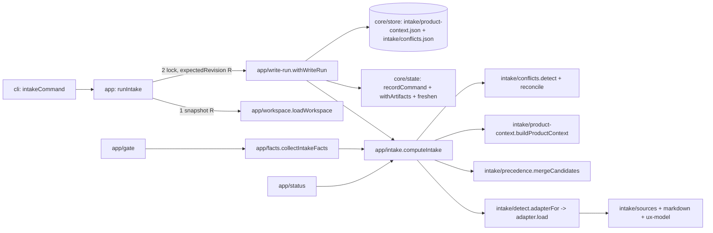

# 0004 Contrato UX y ProductContext — Design

Parte P4 del master-plan `01-heron`. Cubre R1–R18 de `requirements.md` y los criterios P4.A1–A9 de `parts.json`. Señales de diseño: contrato compartido nuevo y persistido (`ProductContext`, `IntakeConflicts`), cambios aditivos en contratos existentes (`HeronProject`, `canonicalJson`), áreas críticas (`src/intake/adapters/navori-master`, `src/core/contracts`, `src/core/state`), regla de autoridad entre fuentes (RN-7) y frontera anticorrupción con un contrato ajeno que acaba de aterrizar en navori-harness. Convenciones vinculantes: skill `heron-architecture` (`references/{patterns,layout,recipes}.md`). Lo decidido en `MASTER.md`, `DECISIONS.md` (D1–D29), `specs/0001-heron-core/design.md` (DP1–DP27) y `specs/0002-research/design.md` (DR1–DR25) no se re-litiga; las desviaciones y enmiendas se declaran en § Decisions.

**Revisión tras challenge** (`.navori/state/handoffs/challenge_p4-spec.md`, veredicto CONCERNS): frescura sin procedencia volátil y re-aprobación de `intake` en sitio (F1), vocabulario y fixture alineados con el DIGEST real y verificación de realismo sobre este repo (F2), reglas de fingerprint (F5), contadores derivados y tarea compartida T0 con 0003 (F4, F7, F14), Done de T1 con la suite completa (F8), tareas divididas (F12), `kind` de conflicto persistido como texto (F16) y seis decisiones que el usuario resolvió el 2026-10-01 (DR28–DR33). Detalle por hallazgo en § Decisions › Hallazgos del challenge.

**Ref verificado:** `git fetch origin develop` OK; `origin/develop` = `b8ee0a9` (merge de P2). El árbol de trabajo (`docs/p2-evidence`, `37024e2`) difiere de `origin/develop` solo en `specs/_master/01-heron/{STATUS.md,parts.json}`, así que toda cita "ya existe" de `src/`, `tests/` y `fixtures/` vale para `origin/develop`. Evidencia del harness: clon local `navori-harness`, `origin/main` = `833745f6` (contiene `aa149ad5`, PR #1128 "fase ux con contrato UX.md/ux.json", 2026-09-30).

**Orden de integración:** 0004 se integra antes que 0003 (decisión del orquestador). La tarea T0 es común a ambas specs y aterriza con el primer PR de 0004; 0003 la omite si ya está en `develop` (§ Migration › Archivos compartidos con 0003).

## Decisiones del usuario (resueltas el 2026-10-01)

Las seis decisiones abiertas de la revisión anterior (OD1–OD6) las resolvió el usuario el 2026-10-01; cada una es ahora un DR de § Decisions y no queda ninguna decisión abierta. Las enmiendas al master-plan se registraron en `specs/_master/01-heron/DECISIONS.md` (D30–D32) y en `MASTER.md`/`parts.json`.

| Antes | Pregunta | Elegida | DR | Master |
|---|---|---|---|---|
| OD1 | Cómo se eligen los adapters `markdown`/`manual` | A: `heron init --adapter markdown\|manual --context <archivo>...`, persistido | DR28 | — |
| OD2 | P4.A7 tal como estaba escrito fallaba con `NOT_INITIALIZED` | D: `init` + `intake` sobre una copia temporal del fixture | DR29 | D30 (P4.A7 enmendado) |
| OD3 | Cómo declara SYNTHETIC un archivo de datos de `fixtures/` | A: manifiesto en el archivo `SYNTHETIC` de cada fixture | DR30 | — |
| OD4 | `--refresh` de RF-5 | A: se acepta como alias sin efecto | DR31 | D32 (nota en RF-5) |
| OD5 | P4.A5 "byte a byte" | A: clave, orden y valor canónico; `ux.json` intacto | DR32 | D31 (P4.A5 enmendado) |
| OD6 | `language` del harness como idioma por defecto | C: se registra como dato del producto; el locale de los artefactos sale solo de `--locale` | DR33 | — |

## Approach

### Qué existe (evidencia)

| Hecho | Evidencia | ¿Basta extenderlo? |
|---|---|---|
| Puerto con `load` reservado para P4 | `src/intake/ports.ts:28-30` `LoadRequest`, `AdapterLoadResult` ("P4 widens this union…"); `:40` `loadNotAvailable`; `src/intake/adapters/navori-master/index.ts:157` y `adapters/filesystem/index.ts:39` devuelven el stub | Sí: es el punto de extensión previsto |
| Ids de adapter completos | `src/core/contracts/heron-project.ts:4` `ADAPTER_IDS` (4 ids, OD1-C′ de P2) | Sí, sin cambio de enum |
| Lector provisional de `ux.json` | `src/intake/ux-contract.ts:16` `UX_CONTRACT_READER`; `:34` `z.looseObject`; `:144` `readUxContract`; `:216` `checkUxFiles` | Sí para la validez del modo; falta el mapeo y el punto de conmutación |
| Lectores del harness tolerantes | `src/intake/adapters/navori-master/harness.ts:57` `readVersioned`, `:99` `readNavoriConfig` (solo `specsDir`), `:193` `readStageState`; sin lector de `parts.json` | Se agregan `name`/`language` y `readParts` |
| Detección de los 7 artefactos | `src/intake/adapters/navori-master/index.ts:24` `ARTIFACT_FILES` | Sí; `context/md/*` no entra a la detección |
| Gate `intake` modelado, solo hasta `directions-ready` | `src/core/state/transitions.ts:97` `FACT_CHECKS["intake-context-valid"]`; filas `:244-247`, `:272`; `specs/0001-heron-core/design.md` DP9; `src/core/state/gates.ts:24` `GATE_BINDINGS.intake` | Hechos y textos sí; faltan filas de re-aprobación en producción (DR7) |
| Callejón sin salida latente de P1 | Un re-`init` en fase de producción reescribe `intake/mode.json` (atado al gate) → `approvals-valid` bloquea la producción y no hay fila `approve-gate:intake` desde ahí | Se resuelve con DR7 |
| Nadie produce los hechos de intake | `src/app/facts.ts:64` `collectTransitionFacts`; `tests/e2e/gate.test.ts:43-47` espera "productContextValid is not available" | Se agrega `collectIntakeFacts` |
| `stale` solo crece | `src/core/state/stale.ts:125` `withStale`; `src/core/state/lifecycle.ts:37` `withArtifacts`; 0003 propone `freshen` (`specs/0003-agents-directions/design.md` DR17) | Una sola función `freshen` en T0 (compartida) |
| `canonicalJson` pierde claves `__proto__` | `src/core/contracts/canonical-json.ts` `normalize` (`out[key] = …`); sonda: `{"__proto__":{"x":1},"big":…}` → solo `big` | Se corrige en T2 |
| DIGEST y CODEBASE reales | navori-harness `core-assets/master-plan/{digest,en/digest}.md`: 8 secciones fijas (`Resumen por archivo`/`Summary per file`, `Hechos`/`Facts`, `Actores`/`Actors`, `Capacidades`/`Capabilities`, `Integraciones externas`/`External integrations`, `Entidades de datos`/`Data entities`, `Superficies`/`Surfaces`, `Hallazgos`/`Findings`), viñetas que citan su archivo, `Ninguno`/`None` si vacía; `CODEBASE.md` sin plantilla (lo escribe un scout; aquí `Stack`/`Estructura`/`Convenciones`/`Specs`) | El vocabulario de rol incluye `Actores`/`Actors` y `Entidades de datos`/`Data entities` (DR8) |
| El harness ya tiene el contrato UX en código, sin JSON Schema | navori-harness `origin/main` `aa149ad5`: `packages/cli/src/lib/master/schema.ts:405-460` `UX_ID_PATTERNS`, `UxContractSchema` (`z.strictObject`); `git ls-tree -r origin/main` sin `ux*.schema.json` | El lector provisional se mantiene (D5); el mapeo lee los campos reales como opcionales |
| Los fixtures no son válidos para el harness | Sonda con `UxContractSchema`/`PartsSchema` de `aa149ad5`: `membership-product/ux.json` 60 issues, `parts.json` inválido | El fixture completo se reescribe válido |
| Cobertura de intake | `scripts/check-coverage.ts` `COVERAGE_RULES` sin `src/intake/`; lcov actual 100 % | Se agrega `src/intake/` a 0.9 |
| ajv no está instalado | `package.json`; MASTER § Stack: ajv 8.20.0 "solo tests" | devDependency |
| Contadores literales en tests | `tests/unit/contracts.test.ts:133` (lista de 8 schemas), `tests/unit/cli-args.test.ts:102-140` (`COMMANDS` y `USAGE_TEXT` literales), `tests/e2e/status.test.ts:55` ("Allowed commands" literal) | Se derivan de los registros en T0 (F7) |

### El problema real

P5 y siguientes necesitan **un** modelo del producto, con procedencia y sin contradicciones ocultas, independiente de cómo llegó (master-plan, markdown suelto, entrada manual) y del formato todavía provisional de `ux.json`. Hoy Heron solo sabe si el contrato UX existe y es válido (P1); no sabe qué dice ni qué hacer cuando `ux.json` y `MASTER.md` discrepan. Además, el modelo debe poder actualizarse cuando el master-plan cambia en cualquier fase sin forzar una regresión de fase (RN-29: lo dependiente queda `stale`; RN-28: la aprobación se re-otorga). Consumidores: el gate `intake`, `heron status`, P5 (direcciones en full, foundations, pantallas), P7 (`UX-PROPOSAL`, RN-9/RN-10) y P11 (conmutar el lector sin tocar a los consumidores).

### Decision drivers (de las reglas del proyecto)

1. **Autoridad explícita y nada silencioso** (RN-7, RN-8, context/md/PLAN.md §6).
2. **Nada inventado** (RN-38, §75.13): todo elemento apunta a una sección o puntero real de una fuente.
3. **Lector anticorrupción aislado** (D5, RN-1, RN-46, patrón 11).
4. **Contratos versionados que fallan fuerte** (RNF-13, DP7 + OD1-C′): cambios aditivos sin bump; códigos y tipos persistidos como texto con formato.
5. **Determinismo sin falsos cambios** (RNF-2): mismas fuentes → mismos bytes, y un cambio irrelevante (líneas movidas, prosa sin elementos, fuente no usada) no cambia bytes.
6. **Sin callejones sin salida** (RN-28, RN-29): un cambio de entrada deja `stale` y pide re-aprobación; nunca obliga a retroceder de fase.
7. **Solo `core/store` escribe; lock corto** (D4, DP2, patrón 3).
8. **Simplicidad** (CLAUDE.md, §75.15): regla de 3; sin motor de reglas; P4 no anticipa P5.
9. **Compatibilidad y coordinación** (lección de P2, 0003 en paralelo): `.heron/` de P1/P2 legibles; listas compartidas solo se agregan al final.

### Opciones consideradas

**Dónde vive el modelo del producto.**
- *Peldaño 1 — sin modelo nuevo (P5 lee `ux.json` y los `.md`):* descartado; viola el aislamiento de D5 (`references/layout.md`), no ofrece precedencia ni `CONFLICT`, y la conmutación de P11 tocaría a cada consumidor.
- *Peldaño 2 — elegido: extender el puerto existente.* `ProductContextAdapter.load` devuelve un borrador (fuentes + candidatos); módulos puros de `src/intake` fusionan, detectan conflictos y reconcilian ids; `app` escribe dos documentos en una transacción.
- *Peldaño 3 — grafo de hechos con procedencia por campo y motor de reglas:* descartado; P4.A1 pide `sourceRef` por elemento y un motor de reglas no tiene segundo caso de uso.

**Dónde viven los conflictos.** *Dentro de `product-context.json`:* descartado; un `ack` reescribiría el contexto. *Elegido — `intake/conflicts.json`* (ya en `GATE_BINDINGS.intake`).

**Cómo se sabe si el contexto está al día (F1).** *Hashes de todas las fuentes dentro del documento atado:* descartado; un byte en `DIGEST.md`, `CODEBASE.md`, una fuente no usada o una línea movida invalidaba la aprobación sin cambio de contenido. *Sidecar no atado con la procedencia volátil:* descartado; dos documentos a mantener alineados por clave. *Elegido — procedencia estable dentro del documento* (anclas de sección en lugar de números de línea, fuentes sin sha256, mensajes sin líneas) y **frescura = regenerar y comparar bytes** (DR2): los bytes solo cambian si cambia el contenido extraído, el estado de una fuente o el extractor.

**Qué pasa si el contenido cambia en una fase de producción.** *Congelar `intake` (versión anterior, DR7 previo):* descartado por el challenge; el único remedio era `gate intake reject` (regresión). *Elegido — `intake` escribe en cualquier fase, propaga `stale` y el gate `intake` se re-aprueba en sitio* (filas nuevas, DR7). `gate intake reject` sigue disponible para quien quiera retroceder.

**Cómo se interpreta Markdown.** *Dependencia de parseo:* fuera del Stack. *Prosa libre:* rompe RN-38. *Elegido — extractor por líneas con vocabulario de rol es ∪ en* tomado de las plantillas reales del harness (DR8).

### Recomendación



`heron intake` toma una instantánea (revisión `R`, modo efectivo, detección en vivo con el adapter persistido), entra a `withWriteRun` con `expectedRevision = R` y, bajo el lock (lectura local, sin red ni IA), llama a `computeIntake`. Si los bytes de ambos documentos no cambian, no hay revisión nueva; si cambian, se escriben en la misma transacción con `recordCommand` + `withArtifacts` (marca `stale` a los dependientes) + `freshen` (limpia lo regenerado), en cualquier fase. `status` y el gate llaman a la misma función sin escribir y comparan bytes.

## Components

Rutas exactas. "R" = requisitos que cubre. `(nuevo)` / `(mod)`. Cada fila aparece en el campo **Archivos** de alguna tarea (tabla de cobertura al final de `tasks.md`).

### Compartido con 0003 (T0)

| Ruta | Responsabilidad | R |
|---|---|---|
| `src/core/state/lifecycle.ts` (mod) | `freshen(state, paths)` (firma de 0003 DR17) | R8 |
| `tests/unit/lifecycle.test.ts` (mod) | Caso de `freshen` (nombre de 0003) | R8 |
| `tests/unit/contracts.test.ts`, `tests/unit/cli-args.test.ts`, `tests/e2e/status.test.ts`, `tests/e2e/doctor.test.ts` (mod) | Aserciones sin conteos fijos: derivadas de `CONTRACT_DOCUMENTS`, `CLI_COMMANDS`, `COMMANDS`, `FINDING_CODES` y `DOCTOR_CHECK_IDS`; prefijo P1/P2 fijo en "Allowed commands" | R18 |

### Contratos (`src/core/contracts/`, área crítica)

| Ruta | Responsabilidad | R |
|---|---|---|
| `src/core/contracts/product-context.ts` (nuevo) | `ProductContext`, secciones y elementos, `SourceRef`, `SOURCE_KINDS`, `Conflict`, `IntakeConflicts`, `ManualContext`, `*_DOCUMENT` | R1, R5, R9 |
| `src/core/contracts/intake-data.ts` (nuevo) | `IntakeData`, `ConflictsListData`, `ConflictsAckData`, `ProductContextCounts` | R6, R8 |
| `src/core/contracts/cli-envelope.ts` (mod) | `CLI_COMMANDS` + `intake`, `conflicts list`, `conflicts ack`; unión `data` | R6, R8 |
| `src/core/contracts/version.ts` (mod) | `DocumentKind` + `ProductContext`, `IntakeConflicts`, `ManualContext` | R1 |
| `src/core/contracts/index.ts` (mod) | Barrel + 3 documentos al final de `CONTRACT_DOCUMENTS` | R1, R11 |
| `src/core/contracts/common.ts` (mod) | 13 códigos al final de `FINDING_CODES` | R2, R5–R9, R14 |
| `src/core/contracts/canonical-json.ts` (mod) | `normalize` crea propiedades propias (conserva `__proto__`) | R10 |
| `src/core/contracts/heron-project.ts` (mod) | `source.inputs?: RelativeArtifactPath[]` (DR28) | R9 |
| `schemas/*.v1.schema.json` (regenerados + 3 nuevos) | Deriva cero contra Zod | R1, R11 |

### Estado (`src/core/state/`, área crítica)

| Ruta | Responsabilidad | R |
|---|---|---|
| `src/core/state/transitions.ts` (mod) | Detalle de `intake-context-valid`; filas de re-aprobación de `intake` en sitio desde las 8 fases de producción (DR7) | R7, R8 |
| `src/core/state/mode.ts` (mod) | `describeModeBlock` para `markdown`/`manual` | R9 |

### Intake (`src/intake/`; `adapters/navori-master` es área crítica)

| Ruta | Responsabilidad | R |
|---|---|---|
| `src/intake/ports.ts` (mod) | T3: `Candidate`, `ContextDraft`, `AdapterSelection`, `DetectRequest.selection`; T9: `LoadRequest.mode`, `AdapterLoadResult` (sin stub) | R2, R9 |
| `src/intake/detect.ts` (mod) | `adapterFor` (T9); `OPT_IN_ADAPTERS` y selección (T10) | R9 |
| `src/intake/text.ts` (nuevo) | `normalizeText`, `stripInline`, `actorKeys` | R4, R5 |
| `src/intake/sources.ts` (nuevo) | `readSource`, `listContextMarkdown`, `MAX_CONTEXT_FILES` | R2 |
| `src/intake/markdown.ts` (nuevo) | `parseMarkdown`, `ROLE_HEADINGS`, `extractRoleSections`, `sectionAnchor` | R2, R16 |
| `src/intake/ux-markdown.ts` (nuevo) | `extractUxMarkdown` (marcadores `ux-kind`) | R2 |
| `src/intake/ux-contract.ts` (mod) | `UxReader`, `PROVISIONAL_UX_READER`, `ACTIVE_UX_READER` | R10 |
| `src/intake/ux-model.ts` (nuevo) | `uxCandidates`, `KNOWN_UX_FIELDS`, `extensionsOf` | R3, R10 |
| `src/intake/precedence.ts` (nuevo) | `SOURCE_PRECEDENCE`, `sourceRank`, `mergeCandidates`, `COMPARABLE_FIELDS`, `NAME_KEYED_SECTIONS` | R4 |
| `src/intake/product-context.ts` (nuevo) | `buildProductContext`, `withConflictIds`, `countSections` | R1, R3 |
| `src/intake/conflicts.ts` (nuevo) | `detectConflicts`, `reconcileConflicts`, `acknowledgeConflict`, `unacknowledgedCount`, `conflictFingerprint` | R5, R6, R7 |
| `src/intake/inputs.ts` (nuevo) | `validateSelection`, `parseManualContext`, `MAX_CONTEXT_INPUTS` | R9 |
| `src/intake/adapters/navori-master/index.ts` (mod) | `load` real (`loadNavoriMaster`) | R2, R3 |
| `src/intake/adapters/navori-master/harness.ts` (mod) | `NavoriConfigView.name`/`language`, `readParts` (con ids de criterio) | R2, R15, R16 |
| `src/intake/adapters/navori-master/decisions.ts` (nuevo) | `parseDecisions` (etiquetas es/en) | R2 |
| `src/intake/adapters/filesystem/index.ts` (mod) | `load` real | R3, R9 |
| `src/intake/adapters/markdown/index.ts` (nuevo) | `markdownAdapter` | R9 |
| `src/intake/adapters/manual/index.ts` (nuevo) | `manualAdapter` | R9 |

### Casos de uso y CLI

| Ruta | Responsabilidad | R |
|---|---|---|
| `src/app/intake.ts` (nuevo) | `runIntake`, `computeIntake`, `PRODUCT_CONTEXT_FILE`, `CONFLICTS_FILE` | R8 |
| `src/app/conflicts.ts` (nuevo) | `runConflictsList`, `runConflictsAck` | R6 |
| `src/app/facts.ts` (mod) | `collectIntakeFacts` | R7 |
| `src/app/gate.ts` (mod) | `gateFacts` suma los hechos de intake | R7, R12 |
| `src/app/status.ts` (mod) | `openConflicts`, `PRODUCT_CONTEXT_STALE`, órdenes permitidas | R14 |
| `src/app/workspace.ts` (mod) | `selectionOf`; `loadWorkspace` detecta con la selección persistida | R9 |
| `src/app/init.ts` (mod) | `--adapter`, `--context` (DR28) | R9 |
| `src/cli/command.ts` (mod) | `CommandName` + `intake`, `conflicts`; `IntakeParsed`, `ConflictsParsed`; `InitParsed.adapter`/`context` | R6, R8, R9 |
| `src/cli/commands/intake.ts` (nuevo) | `intakeCommand` (con `--refresh`, DR31) | R8 |
| `src/cli/commands/conflicts.ts` (nuevo) | `conflictsCommand` | R6 |
| `src/cli/commands/index.ts` (mod) | `COMMANDS` + 2 grupos al final | R6, R8 |
| `src/cli/commands/init.ts` (mod) | Parseo de `--adapter`/`--context` | R9 |
| `src/cli/render-intake.ts` (nuevo) | `renderIntakeText`, `renderConflictsListText`, `renderConflictsAckText` | R6, R8 |
| `src/cli/render.ts` (mod) | `renderInitText`: `Adapter:` e insumos para `markdown`/`manual` | R9 |

### Fixtures, dependencias, scripts y docs

| Ruta | Responsabilidad | R |
|---|---|---|
| `fixtures/membership-product/**` (mod) | Fixture completo (19 secciones; JSON válidos contra el harness `aa149ad5`; etapa `01-mvp`, `ux: "md-json"`, mismos ids y orden de superficies) | R13 |
| `fixtures/conflict/**` (nuevo) | Copia con un único conflicto de actor | R13 |
| `fixtures/*/SYNTHETIC`, `fixtures/README.md` (mod) | Manifiesto SYNTHETIC (DR30), tabla de fixtures, comando de sonda del harness | R11, R13 |
| `tests/assets/p2-workspaces/membership-product/.heron/**` + `README.md` (nuevos) | Golden generado con P2 (`b8ee0a9`) sobre el fixture nuevo | R18 |
| `tests/assets/intake/product-brief.md`, `tests/assets/intake/manual-context.json` (nuevos) | Insumos SYNTHETIC de `markdown` y `manual` | R9 |
| `package.json` (mod), `bun.lock` (regenerado) | `"ajv": "8.20.0"` en `devDependencies` | R11 |
| `scripts/check-coverage.ts` (mod) | `COVERAGE_RULES` + `src/intake/` a 0.9 | RNF-8 |
| `docs/adr/0006-canonical-data-model.md` (nuevo) | ADR (número fijado, DR18) | R17 |
| `docs/contracts.md` (nuevo) | Kinds, versionado, schemas, `ProductContext` y conflictos | R17 |
| `docs/integrations/navori-harness.md` (nuevo) | Mapa archivo → campo, subconjunto provisional, conmutación, límites de las heurísticas (P4.A9) | R10, R17 |
| `docs/architecture.md`, `README.md` (mod) | Módulo intake, enmienda de DP9, layout, órdenes nuevas | R17 |
| `.claude/skills/heron-architecture/references/{layout,recipes}.md` (mod) | Archivos reales de intake, receta "Fuente nueva de ProductContext" (F15) | R17 |

### Tests y helpers

| Ruta | Responsabilidad | R |
|---|---|---|
| `tests/contracts/product-context.test.ts` (nuevo) | P4.A1, traza de elementos, reference-only, idioma y tolerancia | R1, R2, R3, R13, R15, R16 |
| `tests/contracts/ux-contract.test.ts` (`git mv` de `tests/unit/ux-contract.test.ts`) | Casos de P1 + P4.A5 | R10 |
| `tests/contracts/json-schema.test.ts` (nuevo) | P4.A6 | R11 |
| `tests/unit/intake/precedence.test.ts` (nuevo) | P4.A2, P4.A3 | R4, R5, R7 |
| `tests/unit/intake/conflicts.test.ts` (nuevo) | Detección, ids estables, reapertura, ack | R5, R6 |
| `tests/unit/intake/markdown.test.ts` (nuevo) | Extractor es/en, DIGEST real, fuentes | R2, R16 |
| `tests/unit/intake/navori-master.test.ts` (nuevo) | `DECISIONS.md`, `UX.md` por `ux-kind` | R2 |
| `tests/unit/intake/adapters.test.ts` (nuevo) | P4.A4 | R9 |
| `tests/e2e/intake.test.ts` (nuevo) | Escritura, idempotencia, dry-run, frescura, producción | R8 |
| `tests/e2e/conflicts.test.ts` (nuevo) | `conflicts list\|ack`, bloqueo del gate | R6, R7 |
| `tests/e2e/p2-compat.test.ts` (nuevo) | Golden de P2 | R18 |
| `tests/e2e/gate.test.ts`, `tests/e2e/status.test.ts`, `tests/e2e/init.test.ts` (mod) | P4.A8, conflictos en `status`, `--adapter` | R7, R9, R12, R14 |
| `tests/perf/init.perf.test.ts` (mod) | `status` con contexto y 50 archivos de contexto | R14 |
| `tests/unit/harness-readers.test.ts`, `tests/unit/state-machine.test.ts`, `tests/unit/mode.test.ts`, `tests/unit/contracts.test.ts`, `tests/unit/cli-args.test.ts` (mod) | Casos nuevos | R1, R7, R8, R9, R10, R15, R16 |
| `tests/repo/coverage-rules.test.ts`, `tests/repo/docs.test.ts` (mod) | `src/intake/` a 0.9; docs de R17 | R17 |
| `tests/helpers/fixtures.ts` (mod) | `FixtureName` + `conflict`; `copyP2Workspace` | R13, R18 |
| `tests/helpers/intake.ts` (nuevo) | `candidate`, `draftOf`, `masterRef` (dobles de borradores) | — |

## Decisions

- **DR1 — "19 bloques" = las 19 secciones de contenido de §5; `metadata` es la cabecera.** context/md/PLAN.md §5 lista 20 nodos. Cada sección es una lista de elementos con `sourceRef`, `alsoIn` y `conflicts`; `product` es una lista de hechos `{key, value}` (`name`, `summary`, `language`). Cubre R1.
- **DR2 — Procedencia estable y frescura por regeneración.** El documento atado no lleva nada que cambie sin cambio de contenido: `sourceRef.locator` es un ancla de sección (`§<encabezado>`) en Markdown y un JSON Pointer en JSON (nunca un número de línea); `metadata.sources` registra `{source, path, status}` sin sha256 (los hashes de los 7 artefactos ya viven en `intake/mode.json`); los mensajes de findings nombran sección o puntero, no línea; sin `generatedAt` ni versión de Heron. "Al día" = regenerar con `computeIntake` y comparar bytes. Cambian bytes, y por tanto piden re-aprobación: un valor extraído, una sección renombrada, una fuente que aparece, desaparece, deja de leerse o pasa a aportar elementos, el modo, el adapter, la etapa, el lector UX o **una versión nueva de Heron cuyo extractor produce otra salida** (política de upgrade: `status` muestra `PRODUCT_CONTEXT_STALE`, el usuario corre `heron intake` y re-aprueba `intake` en sitio). No cambian bytes: líneas movidas, prosa fuera de secciones de rol, ediciones de `CODEBASE.md` o de fuentes `unused`. Cubre R2, R7, R8, R14.
- **DR3 — Precedencia como dato y solo para "el mismo dato".** `SOURCE_PRECEDENCE` = RN-7 + `manual` + `navori.config.json` (estas dos nunca compiten). Se agrupan candidatos por (sección, clave); gana el de menor rango, desempate por orden de la fuente en el borrador y luego por orden de aparición. Campos comparables (`COMPARABLE_FIELDS`) iguales tras `normalizeText` → `alsoIn`; distintos → el valor ganador y un `value-mismatch` por par. Las contradicciones estructurales no sustituyen valores: se marcan. Campos que solo trae una fuente se unen al elemento. Cubre R4, R5.
- **DR4 — Catálogo cerrado de conflictos deterministas, de cobertura mínima** (IDs, actores, roles, permisos): `actor-unknown`, `permission-contradiction` (igualdad de texto normalizado entre una capacidad de `ux.json` y un "No puede", o una acción prohibida y un "Puede"), `value-mismatch` y `reference-unknown` (`RN-`/`RF-`/`RNF-` no definidos en `MASTER.md`, `P<n>` o `P<n>.A<m>` ausentes de `parts.json`, `D<n>` ausente de `DECISIONS.md` de la etapa). Solo contra una fuente definidora presente y legible (si falta, `REFERENCES_NOT_CHECKED`). Las contradicciones con distinta redacción no se detectan (falsos negativos esperados; los semánticos con IA quedan fuera, P4 › fuera de alcance); `docs/integrations/navori-harness.md` lo documenta. Cubre R5.
- **DR5 — Identidad estable de conflictos (F5).** Unidad = un par contradictorio: `value-mismatch` por (ganador, otro valor), `permission-contradiction` por (actor, ítem normalizado), `actor-unknown` por actor, `reference-unknown` por (id, tipo de fuente que cita). `fingerprint` = sha256 del JSON canónico de `{kind, subject, values}` con `values` = pares `[source, normalizeText(value)]` **ordenados** (sin `path` ni localizador): mover líneas, reordenar fuentes o renombrar la etapa no cambia el fingerprint. `reconcileConflicts`: mismo fingerprint que uno `open` → conserva id y `ack`; mismo fingerprint que uno `resolved` → vuelve a `open` con su id y su `ack` (los valores son idénticos a los reconocidos); nuevo → `CONFLICT-{max+1}` en orden (tipo, sujeto); `open` que ya no aparece → `resolved` (nunca se borra ni se reusa su id). Un valor distinto = otro fingerprint = nuevo reconocimiento. Cubre R5.
- **DR6 — Reconocimiento.** `heron conflicts ack <id> --note <texto>` exige nota, identidad del SO y TTY o `--yes`; registra `{by, at, note, runId}` vía `withWriteRun` (`recordCommand` + `withArtifacts` + `freshen`). Reconocer después de aprobar invalida esa aprobación (RN-28) y se re-aprueba en sitio. Cubre R6.
- **DR7 — `intake` en cualquier fase y re-aprobación en sitio (F1; enmienda de DP9).** `heron intake` escribe en cualquier fase cuando cambian bytes; `withArtifacts` marca `stale` a los dependientes (`ARTIFACT_DEPENDENCIES`: direcciones, foundations, pantallas). `transitions.ts` agrega 8 filas `[p, approve-gate:intake, p, intake-context-valid]`, una por fase de producción (`direction-selected` … `exported`), en la sección de re-aprobación: el gate `intake` se re-aprueba sin cambiar de fase (guardas de modo y de aprobaciones de P1 intactas). Resuelve también el callejón latente de P1 (re-`init` en producción reescribe `mode.json`). `gate intake reject` sigue disponible para retroceder. Cubre R7, R8.
- **DR8 — Markdown por vocabulario de rol, es ∪ en, tomado de las plantillas reales.** `parseMarkdown` separa secciones (ignora bloques de código y comentarios HTML salvo `ux-kind`); `ROLE_HEADINGS` normalizados: `summary` (`Resumen ejecutivo`/`Executive summary`), `moscow` (`Alcance (MoSCoW)`/`Scope (MoSCoW)`), `actors` (`Actores y permisos`/`Actors and permissions` de MASTER y `Actores`/`Actors` de DIGEST), `rules`, `functional`, `nonFunctional`, `entities` (`Dominio y datos`/`Domain and data` y `Entidades de datos`/`Data entities`), `questions` (`Preguntas abiertas`/`Open questions`), `brand` (`Marca`/`Brand`/`Insumos de marca`/`Brand inputs`). En `actors`/`entities`, una tabla manda (MASTER) y, si no hay tabla, las viñetas con nombre en negrita o antes de ` — ` (DIGEST). Un id (`RN-`, `RF-`, `RNF-`, `M/S/C/W<n>`) se define solo dentro de la sección de su rol. Las demás secciones del DIGEST (`Hechos`, `Capacidades`, `Integraciones externas`, `Superficies`, `Hallazgos`, `Resumen por archivo`) y todo `CODEBASE.md` no aportan elementos: la fuente queda `status: "read"` con `SOURCE_NO_ELEMENTS` (info). Cubre R2, R16.
- **DR9 — Qué aporta cada fuente** (tabla en § Contracts 7). `UX.md` solo en `full` (D6) y solo sus secciones `ux-kind` listadas; `ux.json` vía el lector activo con los campos del contrato del harness (`aa149ad5`) como opcionales tipados; desconocidos → `extensions`. Cubre R2, R3, R10.
- **DR10 — Conmutación del lector (D5 → P11).** `UxReader = { id, read }`; `ACTIVE_UX_READER = PROVISIONAL_UX_READER`. P11: copia fijada del JSON Schema que publique el harness en `src/intake/vendor/` con su sha256; un `UxReader` nuevo que la valida (Zod 4.6.5 trae `z.fromJSONSchema`, fidelidad *[SIN VERIFICAR]*); `ACTIVE_UX_READER` apunta al nuevo; `UxJsonCheck.reader` pasa de literal a enum (aditivo). Ningún consumidor cambia; `metadata.uxReader` cambia → regenerar y re-aprobar. Cubre R10.
- **DR11 — Idioma (DR33).** `readNavoriConfig` devuelve `language` solo si vale exactamente `es` o `en` (otro texto → `HARNESS_UNKNOWN_VALUE` info). `navori-master` lo aporta como hecho `product/language` (`sourceRef` `navori.config.json` `/language`). El locale de los artefactos no cambia. Cubre R15.
- **DR12 — Fixtures anclados al contrato real (F8, F13).** `membership-product` y `conflict` validan contra `MasterIndexSchema`, `MasterStateSchema`, `PartsSchema` y `UxContractSchema` de navori-harness `aa149ad5` (sonda manual; `fixtures/README.md` guarda el comando reproducible y el commit). Fijos: etapa `01-mvp`, `state.json.ux = "md-json"`, superficies `MOBILE`, `DASHBOARD`, `PARTNER` en ese orden, 6 pantallas, 3 flows, 2 patterns, ids de P1. `context/DIGEST.md` sigue la plantilla real de 8 secciones (en inglés): `Actors` y `Data entities` en viñetas que emparejan con `MASTER.md` (casos reales de `alsoIn`). `conflict`: `ACT-PARTNER` declara en `ux.json` la capacidad "See member data", prohibida en `MASTER.md` → exactamente `CONFLICT-001`. Cubre R13.
- **DR13 — `brand` solo desde fuentes del producto.** Secciones `brand` y `ManualContext.brand`; `.heron/brand/brand.json` (P2) no entra (mismo criterio que 0002 DR3). Cubre R1, R3.
- **DR14 — `approvedBy` de P4.A8 = `GateDecision.decidedBy`** (`src/core/contracts/heron-state.ts:144`); no se renombra. Cubre R12.
- **DR15 — `--refresh` (DR31).** Se acepta y no cambia nada; el texto de uso lo dice. Cubre R8.
- **DR16 — T0 compartida con 0003 (F4, F7, F14).** T0 aterriza con el primer PR de 0004 y es la "micro-tarea compartida" que 0003 asume (0003 DR17 y DR31): (a) `freshen(state, paths)` en `src/core/state/lifecycle.ts`, la única función que quita `stale` de lo regenerado, usada por `intake` y `conflicts ack` (0004) y por brief, analyze y direcciones (0003) — se elimina `clearStale`; (b) los tests compartidos dejan de fijar cantidades: lista de schemas desde `CONTRACT_DOCUMENTS`, `USAGE_TEXT` desde `COMMANDS`, invariantes de `CLI_COMMANDS` y `FINDING_CODES` (únicos, con formato, cada orden con su `CommandSpec`), resumen de `doctor` desde `DOCTOR_CHECK_IDS` y prefijo fijo de P1/P2 en "Allowed commands"; (c) ADR: 0003 usa 0002 y 0005, 0004 usa 0006 (DR18). Cubre R8, R18.
- **DR17 — Hechos de intake siempre presentes.** `collectIntakeFacts` entrega `productContextValid` y `unacknowledgedConflicts` siempre (sin documentos: `false`, `0`); detalles de `intake-context-valid`: `the product context is missing or out of date` · `{n} conflict(s) are not acknowledged`. `core/state` no nombra órdenes; `app` agrega `next`. Cubre R7.
- **DR18 — ADR fijado: `docs/adr/0006-canonical-data-model.md`** (F14). 0003 conserva 0002 (zonas de escritura) y 0005 (frontera de IA); `tests/repo/docs.test.ts` busca número y slug.
- **DR19 — ajv 8.20.0 como devDependency.** En el Stack ("solo tests"); RNF-15 rige runtime, sin ADR propio (va en el ADR 0006). Sonda: `Ajv2020({ strict: true })` compila los 8 schemas actuales; T14 verifica los 3 nuevos. Cubre R11.
- **DR20 — Límites.** `context/md/`: no recursivo, solo `.md`, máx. 50 por nombre (`INPUT_TOO_LARGE` warning); cada fuente ≤ `ctx.limits.maxInputBytes`. `--context`: máx. 50, dentro del repo, `.md`/`.markdown` para `markdown`, `.json` para `manual`. Cubre R2, R9.
- **DR21 — Emparejar actores y entidades por nombre.** `actorKeys(nombre)`: NFKD sin marcas, minúsculas, sin paréntesis, espacios colapsados, alternativas por `/`. Un actor de `ux.json` empareja por `ACT-*` fijado en la celda o por clave. Secciones con clave por nombre (`actors`, `entities`, `NAME_KEYED_SECTIONS`): si una fuente de mayor rango aportó ≥ 1 elemento, los de menor rango sin par no entran y se listan en `LOWER_TIER_ITEMS_SKIPPED` (info) — no son contradicción, y evitan duplicados con otra redacción. Cubre R4, R5.
- **DR22 — `markdown` y `manual` siempre en `reference-only`.** Reporte de detección con `uxMarkdown`/`uxJson` no aplicables (`path: ""`) y `ADAPTER_REFERENCE_ONLY` (info); `describeModeBlock` → `the {adapter} adapter has no UX contract`. Cubre R9.
- **DR23 — `status`.** `openConflicts` = `open` sin `ack`; `null` sin `conflicts.json` ("not tracked yet"). `allowedCommands` agrega, tras las de P2, `heron intake` y `heron conflicts list|ack`. `status` regenera el contexto para `PRODUCT_CONTEXT_STALE`; el perf de P1 se extiende con 50 archivos de contexto (RNF-1). Cubre R14.
- **DR24 — Golden de P2.** Generado una vez con P2 (`b8ee0a9`) sobre el fixture nuevo (5 referencias manuales + `research render`, sin decisiones de gate); el test aprueba `research` en la copia y comprueba que `intake` + `gate intake approve` no la invalidan. Goldens de P1 sin cambios (`INPUTS_CHANGED` warning, ya admitido). Cubre R18.
- **DR25 — Extensiones como lista y `canonicalJson` corregido (DR32).** `Extensions = { key, value }[]` en el orden de la fuente, armadas desde `JSON.parse` (no desde la salida de Zod, que descarta `__proto__`); `canonicalJson.normalize` usa propiedades propias (`Object.defineProperty`/`Object.fromEntries`), lo que también corrige la pérdida de `__proto__` en documentos de P1/P2. Enteros > 2^53 conservan el valor que da `JSON.parse` (límite documentado). Cubre R10.
- **DR26 — `kind` de conflicto persistido como texto (F16).** `Conflict.kind` persistido = `z.string().regex(/^[a-z][a-z0-9-]*$/)`; `ConflictKind` (unión cerrada) tipa a los emisores, como `StoredFinding` (OD1-C′). Un tipo nuevo no es bump. Cubre R5.
- **DR27 — Verificación de realismo (F2, F11).** T11 corre `bun run heron intake --dry-run --json .` sobre este repo (`specs/_master/01-heron`, `reference-only`) y registra en el PR los conteos frente a `MASTER.md`/`DECISIONS.md` a `37024e2`: `businessRules` 49, `functionalRequirements` 23, `nonFunctionalRequirements` 20, `decisions` 29, `capabilities` 26 (M16+S5+C5), `constraints` 11 (W1–W11), `actors` 7 (con `alsoIn` del DIGEST para los que emparejan), `entities` 17, `unresolvedQuestions` 0, conflictos esperados `[]`. Si el master cambió, se recalculan con los `grep` de § Testing strategy. Las heurísticas de actores y permisos no se pueden medir sobre datos reales todavía (ningún repo real tiene `ux.json`); queda como riesgo. Cubre R2, R16.

- **DR28 — Selección de `markdown`/`manual` por `init` (decidido por el usuario 2026-10-01; antes OD1, opción A).** `heron init [path] --adapter markdown|manual --context <archivo>...` persiste `source.adapter` y `source.inputs` (opcional, sin bump) en `project.json`; la selección queda fija hasta `--adapter auto`; `loadWorkspace` detecta con ella. Descartadas: B (archivos convencionales: inventa un contrato en repos ajenos), C (flags por corrida en `intake`: modo y contexto con adapters distintos), D (solo librería: adapters sin uso por CLI en V1). Cubre R9.
- **DR29 — P4.A7 sobre una copia temporal (decidido por el usuario 2026-10-01; antes OD2, opción D; master enmendado en D30).** El `run` de P4.A7 pasa a `d="$(mktemp -d)" && cp -R fixtures/membership-product/. "$d" && bun run heron init "$d" >/dev/null && bun run heron intake --json "$d"` y su `expected` agrega "`fixtures/` sin cambios": ejerce la escritura real sin tocar `fixtures/` (el texto anterior fallaba con `NOT_INITIALIZED`). `intake --dry-run` sigue funcionando sin `.heron/` (lo usa la verificación de realismo, DR27). Descartadas: A (`--dry-run`: solo el cálculo), B (dry run implícito sin workspace: incoherente con las demás órdenes), C (init implícito: escribiría en `fixtures/`). Cubre R8.
- **DR30 — Manifiesto SYNTHETIC (decidido por el usuario 2026-10-01; antes OD3, opción A).** El `SYNTHETIC` de cada fixture conserva su primera línea, una línea en blanco y la lista ordenada de sus archivos de datos (todo archivo regular salvo `SYNTHETIC`: `.md` y `.json`, incluido `navori.config.json`); el test de P4.A6 exige igualdad de conjuntos con el disco y la línea de marca en cada `.md`. Los JSON no cambian (siguen válidos para el harness). Descartadas: B (`$comment`: inviable en `ux.json`, que es `strictObject`), C (marcador raíz: no declara cada archivo). Cubre R11.
- **DR31 — `--refresh` como alias sin efecto (decidido por el usuario 2026-10-01; antes OD4, opción A; registrado en D32).** `heron intake` acepta `--refresh` y no cambia nada (toda corrida relee las fuentes, DR2); el texto de uso lo dice y `tests/unit/cli-args.test.ts` lo cubre. RF-5 queda literal. Descartadas: B (quitarlo: enmienda de RF-5), C (darle un significado: rompería el determinismo o los ids estables). Cubre R8.
- **DR32 — P4.A5 en valor canónico (decidido por el usuario 2026-10-01; antes OD5, opción A; master enmendado en D31).** P4.A5 dice ahora: los campos desconocidos de `ux.json` conservan su clave, su orden y su valor en JSON canónico, los IDs no cambian y `ux.json` nunca se reescribe (sha256 igual). Implementación en DR25 (lista `{key, value}`, `canonicalJson` que conserva `__proto__`); los enteros > 2^53 conservan el valor de `JSON.parse` (límite documentado en `docs/integrations/navori-harness.md`). Descartadas: B (escáner JSON con offsets para guardar el fragmento crudo: un parser más en área crítica para un caso que el harness hoy rechaza), C (valor canónico + sha256 del fragmento: el mismo escáner sin conservar bytes). Cubre R10.
- **DR33 — `language` del harness solo como dato del producto (decidido por el usuario 2026-10-01; antes OD6, opción C).** `navori.config.json.language` (`es`/`en` explícitos) se registra como hecho `product/language` del `ProductContext` (DR11); el locale de los artefactos generados sigue saliendo solo de `--locale` (`project.json.product.locale`), así que P4 no toca `src/app/research.ts` ni `src/app/references.ts` y las salidas de P2 no cambian. Descartadas: A (usarlo como locale por defecto: `language` es el idioma de los documentos del repo, no necesariamente el del producto), B (no leerlo: el dato se pierde para P5). Cubre R15.

### Hallazgos del challenge

| Hallazgo | Resultado |
|---|---|
| F1 frescura sin salida | Aplicado: DR2 (procedencia estable), DR7 (intake en cualquier fase + re-aprobación en sitio); tests "does not report stale when an unused or non-contributing source changes" y "absorbs a product context change in a production phase and re-approves intake in place" |
| F2 DIGEST/CODEBASE reales | Aplicado: DR8, DR12 (DIGEST con plantilla real), DR27 (realismo sobre este repo) |
| F3 `--refresh` | OD4 → el usuario eligió el alias sin efecto: DR31 (D32) |
| F4 `clearStale` vs `freshen` | Aplicado: DR16, T0 |
| F5 fingerprint | Aplicado: DR5 (pares, valores ordenados, sin path ni localizador, reapertura de `resolved`) |
| F6 A5 byte a byte | OD5 → el usuario eligió valor canónico: DR32 (D31); aplicado DR25; la parte "ux.json intacto" se prueba en T11 |
| F7 contadores | Aplicado: T0 deriva de los registros; Done sin números fijos |
| F8 T1 Done | Aplicado: Done de T1 = `bun test` completo; DR12 fija etapa y declaración |
| F9 OD1 solo librería | Se ofreció como opción D de OD1; el usuario eligió A (DR28) |
| F10 idioma | OD6 → el usuario eligió C: DR33 |
| F11 heurísticas | Aplicado: DR4 ("cobertura mínima"), DR27, documentado en la integración |
| F12 tareas grandes | Aplicado: T3/T4, T8/T9 divididas; A5 completo en T11 |
| F13 deriva del fixture | Parcial: comando de sonda reproducible en `fixtures/README.md` (DR12). Rechazado el test que fija el sha256 del fixture: detecta ediciones del fixture, no la deriva del harness, que es el riesgo; la defensa real es el JSON Schema publicado (trigger de D5/P11) |
| F14 ADR | Aplicado: 0006 (DR18) |
| F15 skill | Aplicado: T15 actualiza `references/{layout,recipes}.md` |
| F16 `CONFLICT_KINDS` | Aplicado: DR26 |
| F17 menores | Aplicado: perf de `status` (DR23), dry-run en producción = sale 0 (no hay congelamiento), `P<n>.A<m>` (DR4), sonda ajv de los 3 schemas nuevos en T14. Rechazado: generar tipos de elemento por reflexión (la convención exige tipo explícito + `z.ZodType<T>`; la deriva la vigila `tests/repo/schemas.test.ts`) |

### Supuestos y riesgos

- *[assumed]* Tablas de actores `Actor`/`Puede`/`No puede` (o `Can`/`Cannot`), como `MASTER.md` de esta etapa (`MASTER.md:79-87`); la plantilla del harness no fija formato. Otro formato: actores de MASTER sin leer (`CONTEXT_SECTION_UNREADABLE`), sin falla.
- Falsos positivos `actor-unknown` cuando los nombres difieren (`Member` vs `Socio`): cada uno exige `ack` con nota para aprobar (R7); mitigación: fijar `ACT-*` en la tabla. Falsos negativos de `permission-contradiction` con redacción distinta.
- *[repo → orquestador]* El harness tiene el contrato UX en `main` sin JSON Schema publicado; pedir `ux.v1.schema.json` habilitaría P11 y la detección de deriva de fixtures.
- Conflictos de merge con 0003 en archivos compartidos: § Migration › Archivos compartidos con 0003.

### Fuentes consultadas (2026-10-01)

- navori-harness `origin/main` (`833745f6`, contiene `aa149ad5`): `packages/cli/src/lib/master/{schema,ux,markers}.ts`, `packages/cli/src/lib/config/schema.ts`, `packages/core/core-assets/master-plan/{master,ux,decisions,digest}.md` y `en/*`, `core-assets/skills/master-plan.md`, vía `git show` (solo lectura).
- npm registry: `npm view ajv@8.20.0` (`latest` = 8.20.0).
- Sondas locales (scratchpad, Bun 1.4.2): ajv 2020 estricto sobre `schemas/*.json`; schemas del harness sobre los fixtures; `JSON.parse`/Zod/`canonicalJson` con `__proto__` y enteros enormes.
- `node_modules/zod` 4.6.5: `v4/classic/from-json-schema.d.ts`.

### Conocimiento durable (lo escribe T15)

- Skill `heron-architecture`: `references/layout.md` [P4] con los archivos reales, `tests/assets/p2-workspaces/` y ADR 0006; `references/recipes.md` "Fuente nueva de ProductContext".
- `docs/architecture.md`: modelo canónico, "frescura = regenerar y comparar", enmienda de DP9.
- Dominio (glosario): "fuente definidora", "mismo dato", "conflicto estructural", "contexto al día", "procedencia estable".

## Contracts

Firmas exactas (solo tipos). `export declare function` marca funciones. Documentos persistidos: `z.looseObject` + `StoredFinding`; entradas (`ManualContext`): `z.strictObject`; datos de CLI: `z.object`.

### 1. `ProductContext` (`src/core/contracts/product-context.ts`)

```ts
export const PRODUCT_CONTEXT_SECTIONS = [
  "product", "actors", "capabilities", "businessRules", "functionalRequirements",
  "nonFunctionalRequirements", "surfaces", "journeys", "flows", "screens", "states",
  "functionalComponents", "patterns", "entities", "constraints", "brand", "decisions",
  "traceability", "unresolvedQuestions",
] as const; // the 19 content sections of context/md/PLAN.md §5 (DR1)
export type ProductContextSection = (typeof PRODUCT_CONTEXT_SECTIONS)[number];

/** RN-7 order first; "manual" and "navori.config.json" never compete (DR3). */
export const SOURCE_KINDS = [
  "DECISIONS.md", "MASTER.md", "parts.json", "ux.json", "UX.md", "DIGEST.md", "CODEBASE.md",
  "context", "manual", "navori.config.json",
] as const;
export type SourceKind = (typeof SOURCE_KINDS)[number];

/** locator: "§<heading>" (inline formatting stripped) for Markdown; RFC 6901 JSON Pointer for JSON. Never a line number (DR2). */
export type SourceRef = { source: SourceKind; path: RelativeArtifactPath; locator: string };
export type Sourced = { sourceRef: SourceRef; alsoIn: SourceRef[]; conflicts: string[] }; // conflicts: CONFLICT ids, sorted
export type Extension = { key: string; value: unknown }; // unknown ux.json field, source order (DR25)

export const PRODUCT_FACT_KEYS = ["name", "summary", "language"] as const;
export type ProductFact = Sourced & { key: (typeof PRODUCT_FACT_KEYS)[number]; value: string };
export type ActorElement = Sourced & {
  id: string | null; name: string; goal: string | null;
  can: string[]; cannot: string[]; // MASTER.md "Puede"/"No puede" (or ManualContext)
  capabilities: string[]; forbiddenActions: string[]; constraints: string[]; // ux.json
  surfaces: string[]; relations: string[]; extensions: Extension[];
};
export type CapabilityElement = Sourced & { id: string | null; priority: "must" | "should" | "could"; text: string };
/** businessRules: RN-n · functionalRequirements: RF-n and UX-n · nonFunctionalRequirements: RNF-n. */
export type RequirementElement = Sourced & { id: string; text: string; derivedFrom: string[] };
export type SurfaceElement = Sourced & {
  id: string; name: string | null; purpose: string | null; actors: string[];
  capabilities: string[]; constraints: string[]; requirements: string[]; extensions: Extension[];
};
export type JourneyElement = Sourced & {
  id: string; name: string | null; actor: string | null; goal: string | null; trigger: string | null;
  initialState: string | null; expectedResult: string | null; flows: string[];
  requirements: string[]; exceptions: string[]; extensions: Extension[];
};
export type FlowElement = Sourced & {
  id: string; name: string | null; actor: string | null; purpose: string | null; trigger: string | null;
  preconditions: string[]; steps: string[]; decisions: string[]; alternateStates: string[];
  errors: string[]; result: string | null; screens: string[]; requirements: string[]; extensions: Extension[];
};
export type ScreenAction = { label: string; priority: "primary" | "secondary" | "destructive" | null };
export type ScreenElement = Sourced & {
  id: string; name: string | null; surface: string; actors: string[]; purpose: string | null;
  requirements: string[]; journeys: string[]; flows: string[]; information: string[];
  actions: ScreenAction[]; states: string[]; conditions: string[];
  navigation: { from: string[]; to: string[] }; permissions: string[]; events: string[]; extensions: Extension[];
};
export type StateElement = Sourced & { name: string; global: boolean; screens: string[] };
export type ComponentElement = Sourced & {
  id: string; name: string | null; responsibility: string | null; information: string[];
  actions: string[]; states: string[]; screens: string[]; variations: string[]; extensions: Extension[];
};
export type PatternElement = Sourced & {
  id: string; name: string | null; purpose: string | null; screens: string[]; states: string[];
  rules: string[]; requirements: string[]; extensions: Extension[];
};
export type EntityElement = Sourced & { name: string; details: string[] };
export const CONSTRAINT_KINDS = [
  "out-of-scope", "surface", "actor", "heron-must-preserve", "heron-may-improve", "heron-owns", "declared",
] as const;
export type ConstraintElement = Sourced & {
  kind: (typeof CONSTRAINT_KINDS)[number]; id: string | null; subject: string | null; text: string;
};
export type BrandElement = Sourced & { kind: BrandKind; value: string }; // BRAND_KINDS of research.ts
export type DecisionElement = Sourced & {
  id: string; question: string | null; chosen: string | null; discarded: string[]; date: string | null;
};
export type TraceabilityElement = Sourced & {
  requirement: string; parts: string[]; journeys: string[]; flows: string[]; screens: string[]; patterns: string[];
};
export type QuestionElement = Sourced & { text: string };

/** used: contributed ≥ 1 element · read: parsed, no element (SOURCE_NO_ELEMENTS) · unused: present but excluded by mode (D6). No sha256 (DR2). */
export type ContextSourceRecord = {
  source: SourceKind;
  path: RelativeArtifactPath;
  status: "used" | "read" | "unused" | "absent" | "unreadable";
};
export type ProductContextMetadata = {
  adapter: AdapterId;
  mode: HeronMode; // effective mode at intake (RN-5)
  stage: { dir: string; selection: StageSelection } | null;
  uxReader: "provisional-1" | null; // null when ux.json was not used
  sources: ContextSourceRecord[]; // draft order (DR3)
  uxExtensions: Extension[]; // unknown top-level ux.json keys
  findings: StoredFinding[]; // extraction findings, FINDING_CODES order then path; messages without line numbers
};
export type ProductContext = {
  kind: "ProductContext";
  schemaVersion: 1;
  metadata: ProductContextMetadata;
  product: ProductFact[]; actors: ActorElement[]; capabilities: CapabilityElement[];
  businessRules: RequirementElement[]; functionalRequirements: RequirementElement[];
  nonFunctionalRequirements: RequirementElement[]; surfaces: SurfaceElement[]; journeys: JourneyElement[];
  flows: FlowElement[]; screens: ScreenElement[]; states: StateElement[];
  functionalComponents: ComponentElement[]; patterns: PatternElement[]; entities: EntityElement[];
  constraints: ConstraintElement[]; brand: BrandElement[]; decisions: DecisionElement[];
  traceability: TraceabilityElement[]; unresolvedQuestions: QuestionElement[];
};
export type ProductContextSectionMap = { [S in ProductContextSection]: ProductContext[S][number] };
export const ProductContextSchema: z.ZodType<ProductContext>; // z.looseObject; Extension.value: z.unknown()
export const PRODUCT_CONTEXT_DOCUMENT: DocumentSpec<ProductContext>; // "product-context.v1.schema.json"
```

Orden de elementos en cada sección: el de su `sourceRef` ganador por (rango de la fuente, orden de la fuente en el borrador, orden de aparición en la fuente). Listas internas sin duplicados; `alsoIn` en orden de precedencia.

### 2. Conflictos

```ts
export const CONFLICT_KINDS = ["actor-unknown", "permission-contradiction", "value-mismatch", "reference-unknown"] as const; // emitters + numbering order
export type ConflictKind = (typeof CONFLICT_KINDS)[number];
export const CONFLICT_KIND_PATTERN = /^[a-z][a-z0-9-]*$/; // persisted kind (DR26)
export type ConflictId = string; // /^CONFLICT-\d{3,}$/
export type ConflictValue = { sourceRef: SourceRef; value: string }; // "cannot: See member data", "(not declared)", …
export type ConflictAck = { by: string; at: IsoDateTime; note: string; runId: RunId }; // note 1..2000 chars
export type Conflict = {
  id: ConflictId;
  kind: string; // persisted as formatted text; emitters use ConflictKind
  subject: string; // "ACT-PARTNER · see member data", "businessRules/RN-3", "RF-9", "ACT-GUEST"
  status: "open" | "resolved";
  files: RelativeArtifactPath[]; // sorted, unique
  values: ConflictValue[]; // exactly 2: the contradicting pair, precedence order
  impact: string[]; // "<section>/<key>", sorted
  winner: SourceRef | null; // value-mismatch only (DR3)
  fingerprint: Sha256Hex; // DR5
  ack: ConflictAck | null;
};
export type IntakeConflicts = { kind: "IntakeConflicts"; schemaVersion: 1; conflicts: Conflict[] }; // sorted by id
export const IntakeConflictsSchema: z.ZodType<IntakeConflicts>;
export const INTAKE_CONFLICTS_DOCUMENT: DocumentSpec<IntakeConflicts>; // "intake-conflicts.v1.schema.json"
```

### 3. `ManualContext` (entrada del adapter `manual`)

```ts
/** Input authored by the user (z.strictObject). No UX-structure sections: they only come from ux.json (RN-3). */
export type ManualContext = {
  kind: "ManualContext";
  schemaVersion: 1;
  product: { name: string; summary?: string };
  actors?: { name: string; can?: string[]; cannot?: string[] }[];
  capabilities?: { id?: string; priority: "must" | "should" | "could"; text: string }[]; // id /^[MSC]\d+$/
  businessRules?: { id: string; text: string }[]; // /^RN-\d+$/
  functionalRequirements?: { id: string; text: string }[]; // /^RF-\d+$/
  nonFunctionalRequirements?: { id: string; text: string }[]; // /^RNF-\d+$/
  entities?: { name: string; details?: string[] }[];
  constraints?: { text: string }[];
  brand?: { kind: BrandKind; value: string }[];
  decisions?: { id: string; question?: string; chosen?: string; discarded?: string[]; date?: string }[]; // /^D\d+$/
  unresolvedQuestions?: { text: string }[];
};
export const ManualContextSchema: z.ZodType<ManualContext>;
export const MANUAL_CONTEXT_DOCUMENT: DocumentSpec<ManualContext>; // "manual-context.v1.schema.json"
```

### 4. Datos de CLI (`src/core/contracts/intake-data.ts`) y `CliEnvelope`

```ts
export type ProductContextCounts = Record<ProductContextSection, number>;
export type ConflictSummary = { id: ConflictId; kind: string; subject: string; acknowledged: boolean };
export type IntakeData = {
  mode: HeronMode; adapter: AdapterId; stage: StageRef | null;
  dryRun: boolean;
  written: boolean; // false on dry run and when bytes did not change
  stateRevision: number | null; // null on dry run without .heron/
  counts: ProductContextCounts;
  conflicts: ConflictSummary[]; // status "open", by id
};
export type ConflictsListData = { tracked: boolean; conflicts: Conflict[] };
export type ConflictsAckData = { conflict: Conflict; stateRevision: number; unacknowledged: number };
export const IntakeDataSchema: z.ZodType<IntakeData>;
export const ConflictsListDataSchema: z.ZodType<ConflictsListData>;
export const ConflictsAckDataSchema: z.ZodType<ConflictsAckData>;
```

`CLI_COMMANDS` agrega al final `"intake"`, `"conflicts list"`, `"conflicts ack"`; la unión `data` de `CliEnvelope` agrega los tres esquemas justo antes de `InitDataSchema` (campos requeridos disjuntos). Sin bump.

### 5. Contratos existentes que cambian (aditivo, sin bump)

```ts
// heron-project.ts (DR28)
source: { adapter: AdapterId; specsDir: string | null; stage: { dir: string; selection: StageSelection } | null;
          inputs?: RelativeArtifactPath[] | undefined };
// version.ts
export type DocumentKind = /* P1+P2 */ | "ProductContext" | "IntakeConflicts" | "ManualContext";
// index.ts: CONTRACT_DOCUMENTS appends PRODUCT_CONTEXT_DOCUMENT, INTAKE_CONFLICTS_DOCUMENT, MANUAL_CONTEXT_DOCUMENT
// canonical-json.ts: normalize builds each object with own data properties (Object.defineProperty), so a "__proto__" key survives (DR25)
```

### 6. Puerto y módulos de intake

```ts
// src/intake/ports.ts — T3 adds the types, T9 switches the load signature
export type AdapterSelection = { adapter: "markdown" | "manual"; inputs: RelativeArtifactPath[] };
export type DetectRequest = { root: string; stage: string | null; fs: ReadonlyFs; limits: InputLimits; selection?: AdapterSelection | null };
export type LoadRequest = DetectRequest & { report: DetectionReport; mode: HeronMode };
export type Candidate = {
  [S in ProductContextSection]: { section: S; key: string; value: Omit<ProductContextSectionMap[S], keyof Sourced>; ref: SourceRef; order: number };
}[ProductContextSection]; // order: appearance index within its source
export type ContextDraft = { sources: ContextSourceRecord[]; candidates: Candidate[]; uxReader: UxReaderId | null; uxExtensions: Extension[]; findings: Finding[] };
export type AdapterLoadResult =
  | { ok: true; draft: ContextDraft }
  | { ok: false; code: "CONTEXT_INPUT_INVALID" | "INPUTS_CHANGED"; message: string; findings: Finding[] };
export interface ProductContextAdapter {
  readonly id: AdapterId;
  detect(request: DetectRequest): AdapterDetection; // read-only, never throws (P1)
  load(request: LoadRequest): AdapterLoadResult; // read-only, never throws on hostile input
}

// src/intake/detect.ts
export declare function adapterFor(id: AdapterId): ProductContextAdapter | null; // T9
export const OPT_IN_ADAPTERS: Readonly<Partial<Record<AdapterId, ProductContextAdapter>>>; // T10: markdown, manual
export declare function detectProject(request: DetectRequest, adapters?: readonly ProductContextAdapter[]): ProjectDetection; // T10: selection -> that adapter only

// src/intake/text.ts
export declare function stripInline(text: string): string; // drops **, __, `
export declare function normalizeText(text: string): string; // NFC, stripInline, collapse spaces, trim, drop one trailing ".", toLowerCase()
export declare function actorKeys(cell: string): { keys: string[]; pinnedId: string | null }; // DR21

// src/intake/sources.ts
export const MAX_CONTEXT_FILES = 50;
export type LoadedSource = { record: ContextSourceRecord; text: string | null }; // strict UTF-8 or null
export declare function readSource(fs: ReadonlyFs, root: string, path: RelativeArtifactPath, source: SourceKind, limits: InputLimits): { loaded: LoadedSource; finding: Finding | null };
export declare function listContextMarkdown(fs: ReadonlyFs, root: string, dir: RelativeArtifactPath, limits: InputLimits): { paths: RelativeArtifactPath[]; findings: Finding[] };

// src/intake/markdown.ts
export const SECTION_ROLES = ["summary", "moscow", "actors", "rules", "functional", "nonFunctional", "entities", "questions", "brand"] as const;
export type SectionRole = (typeof SECTION_ROLES)[number];
export const ROLE_HEADINGS: Readonly<Record<SectionRole, readonly string[]>>; // normalized es ∪ en (DR8)
export const NONE_LITERALS: readonly string[]; // "ninguna", "ninguno", "none"
export type MarkdownSection = { heading: string; level: number; role: SectionRole | null; uxKind: string | null; startLine: number; endLine: number };
export type MarkdownDoc = { lines: string[]; sections: MarkdownSection[]; title: MarkdownSection | null };
export declare function parseMarkdown(text: string): MarkdownDoc;
export declare function sectionAnchor(section: MarkdownSection): string; // "§" + stripInline(heading)
export declare function extractRoleSections(doc: MarkdownDoc, origin: { source: SourceKind; path: RelativeArtifactPath }): { candidates: Candidate[]; findings: Finding[] };

// src/intake/ux-markdown.ts
export const UX_MARKDOWN_KINDS = ["global-states", "open-questions", "out-of-scope", "heron-handoff"] as const;
export declare function extractUxMarkdown(doc: MarkdownDoc, path: RelativeArtifactPath): { candidates: Candidate[]; findings: Finding[] };

// src/intake/ux-contract.ts (mod)
export type UxReaderId = typeof UX_CONTRACT_READER; // "provisional-1"
export type UxReader = { readonly id: UxReaderId; read(bytes: Uint8Array, options: { expectedStage: string | null }): UxContractReadResult };
export const PROVISIONAL_UX_READER: UxReader;
export const ACTIVE_UX_READER: UxReader; // single switch point (DR10)

// src/intake/ux-model.ts
export const KNOWN_UX_FIELDS: Readonly<Record<"root" | "surfaces" | "actors" | "journeys" | "flows" | "screens" | "functionalComponents" | "patterns" | "uxRequirements" | "traceability", readonly string[]>>;
/** Unknown keys of a raw JSON.parse object, in source order, as own-property entries (DR25). */
export declare function extensionsOf(raw: Record<string, unknown>, known: readonly string[]): Extension[];
export type UxIds = { actors: Set<string>; surfaces: Set<string>; journeys: Set<string>; flows: Set<string>; screens: Set<string>; patterns: Set<string>; uxRequirements: Set<string> };
export declare function uxCandidates(raw: Record<string, unknown>, contract: UxContract, path: RelativeArtifactPath): { candidates: Candidate[]; extensions: Extension[]; ids: UxIds; findings: Finding[] };

// src/intake/precedence.ts
export const SOURCE_PRECEDENCE: readonly SourceKind[]; // = SOURCE_KINDS order (DR3)
export declare function sourceRank(kind: SourceKind): number;
export const COMPARABLE_FIELDS: Readonly<Partial<Record<ProductContextSection, readonly string[]>>>;
// businessRules/functionalRequirements/nonFunctionalRequirements/capabilities: ["text"]; decisions: ["question", "chosen"]; product: ["value"]
export const NAME_KEYED_SECTIONS: readonly ProductContextSection[]; // ["actors", "entities"] (DR21)
export type ValueMismatch = { section: ProductContextSection; key: string; winner: ConflictValue; other: ConflictValue };
export type MergedElement = { section: ProductContextSection; key: string; value: Candidate["value"]; sourceRef: SourceRef; alsoIn: SourceRef[] };
export declare function mergeCandidates(candidates: readonly Candidate[], sourceOrder: readonly RelativeArtifactPath[]): { merged: MergedElement[]; mismatches: ValueMismatch[]; findings: Finding[] };

// src/intake/product-context.ts
export type BuildMeta = { adapter: AdapterId; mode: HeronMode; stage: { dir: string; selection: StageSelection } | null };
export type DefinedIds = { requirements: Set<string> | null; parts: Map<string, Set<string>> | null; decisions: Set<string> | null; masterActors: boolean }; // parts: P<n> -> A<m> ids; null = defining source absent
// internal additive field: uxActors: { id: string; name: string; ref: SourceRef }[] — actors ux.json declares (incl. unpaired ones), needed for actor-unknown
export type DetectedConflict = Omit<Conflict, "id" | "status" | "ack" | "kind"> & { kind: ConflictKind };
export declare function buildProductContext(draft: ContextDraft, meta: BuildMeta): { context: ProductContext; mismatches: ValueMismatch[]; defined: DefinedIds };
export declare function withConflictIds(context: ProductContext, conflicts: IntakeConflicts): ProductContext;
export declare function countSections(context: ProductContext): ProductContextCounts;

// src/intake/conflicts.ts
export declare function conflictFingerprint(conflict: Pick<DetectedConflict, "kind" | "subject" | "values">): Sha256Hex; // DR5
export declare function detectConflicts(context: ProductContext, mismatches: readonly ValueMismatch[], defined: DefinedIds): DetectedConflict[];
export declare function reconcileConflicts(previous: IntakeConflicts | null, detected: readonly DetectedConflict[]): IntakeConflicts;
export type AckOutcome =
  | { ok: true; doc: IntakeConflicts; conflict: Conflict }
  | { ok: false; code: "CONFLICT_NOT_FOUND" | "CONFLICT_ALREADY_ACKNOWLEDGED"; message: string };
export declare function acknowledgeConflict(doc: IntakeConflicts, id: ConflictId, ack: ConflictAck): AckOutcome;
export declare function unacknowledgedCount(doc: IntakeConflicts | null): number; // open && ack === null

// src/intake/inputs.ts
export const MAX_CONTEXT_INPUTS = 50;
export type SelectionCheck =
  | { ok: true; selection: AdapterSelection }
  | { ok: false; code: "PATH_NOT_FOUND" | "UNSAFE_PATH" | "CONTEXT_INPUT_INVALID"; message: string; issues: FindingIssue[] };
export declare function validateSelection(fs: ReadonlyFs, root: string, selection: AdapterSelection, limits: InputLimits): SelectionCheck;
export declare function parseManualContext(bytes: Uint8Array): { ok: true; value: ManualContext } | { ok: false; issues: FindingIssue[] };

// src/intake/adapters/navori-master/harness.ts (mod)
export type NavoriConfigView = { specsDir: string; name: string | null; language: "es" | "en" | null; unknownLanguage: string | null };
export type PartView = { id: string; title: string | null; seedRequirements: string[]; acceptance: string[]; pointer: string };
export type PartsView = { version: 1; parts: PartView[]; skipped: Finding[] };
export declare function readParts(fs: ReadonlyFs, root: string, stageRelativeDir: string, limits: InputLimits): HarnessReadResult<PartsView>;

// src/intake/adapters/navori-master/decisions.ts
export declare function parseDecisions(doc: MarkdownDoc, path: RelativeArtifactPath): { candidates: Candidate[]; ids: Set<string>; findings: Finding[] };

// adapters
export const navoriMasterAdapter: ProductContextAdapter; // load = loadNavoriMaster
export const filesystemAdapter: ProductContextAdapter;
export const markdownAdapter: ProductContextAdapter;
export const manualAdapter: ProductContextAdapter;
```

### 7. Qué aporta cada fuente

Fuentes de `navori-master`, en el orden del borrador: `DECISIONS.md`, `MASTER.md`, `parts.json`, `ux.json`, `UX.md`, `context/DIGEST.md`, `context/CODEBASE.md`, `context/md/*.md` (por nombre), `navori.config.json`. `state.json` e `index.json` no aportan elementos.

| Fuente (tier) | Regla de extracción | Sección ← elemento (clave) |
|---|---|---|
| `navori.config.json` | `name` no vacío; `language` `es`/`en` (DR11) | `product` ← `name`, `language` |
| `DECISIONS.md` | `## D<n>` con ítems `Pregunta:`/`Question:`, `Elegida:`/`Chosen:`, `Descartadas:`/`Discarded:` (por `;`), `Fecha:`/`Date:`; `Sin decisiones`/`No decisions` → nada | `decisions` ← (`D<n>`), locator `§D<n>` |
| `MASTER.md` | **summary**: primer párrafo sin `Origen:`/`Source:`; **moscow**: `M<n>.`/`S<n>.`/`C<n>.` y `W<n>.`; **actors**: tabla actor/`Puede`/`No puede` (`` `ACT-…` `` fija id); **rules**/**functional**/**nonFunctional**: ítems o filas cuyo primer token es el id del rol; **entities**: primera tabla (nombre + resto en `details`); **questions**: ítems o párrafos salvo `Ninguna`/`None`; **brand**: `<tipo>: <valor>` | `product/summary`; `capabilities` (`M1`…); `constraints` (`W<n>`, `out-of-scope`); `actors`; `businessRules`/`functionalRequirements`/`nonFunctionalRequirements`; `entities`; `unresolvedQuestions`; `brand` |
| `DIGEST.md` (plantilla real) | **actors** (`Actores`/`Actors`): viñetas, nombre en negrita o antes de ` — `; **entities** (`Entidades de datos`/`Data entities`): viñetas igual; el resto de secciones no aporta | `actors`, `entities` (solo emparejan si `MASTER.md` ya aportó, DR21) |
| `CODEBASE.md` | Ninguna regla propia; si tuviera secciones de rol, aplican | normalmente nada: `read` + `SOURCE_NO_ELEMENTS` |
| `context/md/*.md` (y `context` del adapter `markdown`) | Reglas de rol, como `MASTER.md` | según secciones presentes |
| `parts.json` (`readParts`, `version` 1, tolerante) | `parts[].seedRequirements`; ids de parte y de criterio | `traceability` ← (requisito) con `parts`; `DefinedIds.parts` |
| `ux.json` (solo `full`) | `surfaces`, `actors`, `journeys`, `flows`, `screens`, `functionalComponents`, `patterns` por id; `uxRequirements` → `functionalRequirements` (`UX-n`); `traceability`; `screens[].states` → `states`; `constraints` de superficies y actores | homónimas |
| `UX.md` (solo `full`, `ux-kind`) | `global-states` → `states` (`global: true`; ítems o tokens entre backticks); `open-questions` → `unresolvedQuestions`; `out-of-scope` → `constraints`; `heron-handoff` (`### Heron MUST preserve`/`MAY improve`/`owns`) → `constraints` de su tipo | — |
| `ManualContext` (`manual`) | Cada sección presente; locator = puntero | homónimas; `constraints` tipo `declared` |
| `markdown` (`context`) | `product` ← título `#` y primer párrafo del primer insumo; reglas de rol en cada insumo (orden de `--context`) | — |

Campos de `ux.json` con tipo inesperado → `null`/omitidos con `CONTEXT_SECTION_UNREADABLE`; ids duplicados en `ux.json`/`parts.json` → el primero, `CONTEXT_DUPLICATE_ID`; referencias internas de `ux.json` no declaradas → `UX_REFERENCE_UNRESOLVED` (warning).

### 8. Reglas de conflicto (`detectConflicts`)

| Tipo | Se dispara cuando | `subject` | `values` (par) | `impact` | `winner` |
|---|---|---|---|---|---|
| `actor-unknown` | Actor de `ux.json` sin par en la tabla de actores de `MASTER.md` | id del actor | `MASTER.md` `(not declared)` · `ux.json` `<id> <name>` | el actor y quien cita su id (`surfaces.actors`, `journeys.actor`, `flows.actor`, `screens.actors`, `screens.permissions`) | `null` |
| `permission-contradiction` | Actor emparejado con capacidad de `ux.json` ∈ `cannot`, o acción prohibida ∈ `can` (texto normalizado) | `<id> · <ítem normalizado>` | `MASTER.md` `cannot: <texto>` · `ux.json` `capability: <texto>` | igual | `null` |
| `value-mismatch` | Mismo (sección, clave) con campos comparables distintos | `<sección>/<clave>` | ganador · otro | el elemento y quien lo cita | `sourceRef` ganador |
| `reference-unknown` | `ux.json` o `parts.json` citan un id que su fuente definidora no declara | el id citado | definidora `(not defined)` · fuente que cita `<id>` | los elementos que lo citan | `null` |

Numeración y reconciliación: DR5. Un `D<n>` con prefijo de etapa (`01-x/D3`) no se verifica.

### 9. Estado (`src/core/state/`)

```ts
// lifecycle.ts (T0, shared with 0003)
/** Removes the StaleEntry of each path in `paths` (just regenerated from current inputs). Never mutates. */
export declare function freshen(state: HeronState, paths: readonly RelativeArtifactPath[]): HeronState;
// transitions.ts
//   FACT_CHECKS["intake-context-valid"] details: "the product context is missing or out of date" · "{n} conflict(s) are not acknowledged"
//   FORWARD_ROWS re-approval section: for p of PRODUCTION_PHASES: [p, "approve-gate:intake", p, "intake-context-valid"] (DR7)
// mode.ts — describeModeBlock: detection.adapter "markdown" | "manual" -> "the {adapter} adapter has no UX contract"
```

### 10. Casos de uso (`src/app/`)

```ts
// intake.ts
export const PRODUCT_CONTEXT_FILE = "intake/product-context.json";
export const CONFLICTS_FILE = "intake/conflicts.json";
export type IntakeInput = { path: string; dryRun: boolean };
export type IntakeSnapshot = { root: string; detection: DetectionReport; mode: HeronMode; selection: AdapterSelection | null };
export type IntakeComputation = {
  context: ProductContext; conflicts: IntakeConflicts;
  texts: { context: string; conflicts: string }; // canonical JSON, the exact bytes the store writes
  findings: Finding[]; // extraction findings + CONFLICT_OPEN per open unacknowledged conflict
};
/** Pure over the snapshot: adapterFor(...).load -> buildProductContext -> detectConflicts -> reconcileConflicts(previous) -> withConflictIds -> texts. */
export declare function computeIntake(ctx: AppContext, snapshot: IntakeSnapshot, previous: IntakeConflicts | null): { ok: true; value: IntakeComputation } | { ok: false; result: UseCaseResult<never> };
/** Initialized: loadWorkspace -> withWriteRun(expectedRevision R): previous conflicts.json -> computeIntake -> unchanged: skip ->
 * tx.put both -> recordCommand + withArtifacts + freshen -> commit, in any phase (DR7). --dry-run never writes and works without .heron/. */
export declare function runIntake(ctx: AppContext, input: IntakeInput): Promise<UseCaseResult<IntakeData>>;

// conflicts.ts
export type ConflictsListInput = { path: string; all: boolean };
export type ConflictsAckInput = { path: string; id: string; note: string | null; yes: boolean };
export declare function runConflictsList(ctx: AppContext, input: ConflictsListInput): Promise<UseCaseResult<ConflictsListData>>; // read-only, no lock
/** note -> identity -> loadWorkspace -> open, not acknowledged -> confirmation (no lock) -> withWriteRun(expectedRevision R):
 * acknowledgeConflict -> tx.put conflicts.json -> recordCommand + withArtifacts + freshen -> commit. */
export declare function runConflictsAck(ctx: AppContext, input: ConflictsAckInput): Promise<UseCaseResult<ConflictsAckData>>;

// facts.ts
/** productContextValid = both documents exist and computeIntake reproduces them byte for byte; unacknowledgedConflicts = unacknowledgedCount(stored). */
export declare function collectIntakeFacts(ctx: AppContext, workspace: Workspace, store: FileStore): Pick<TransitionFacts, "productContextValid" | "unacknowledgedConflicts">;

// workspace.ts
export declare function selectionOf(project: HeronProject): AdapterSelection | null; // markdown/manual + inputs, else null
```

`runInit` (mod, DR28): `--adapter markdown|manual` exige ≥ 1 `--context` y pasa `validateSelection` antes de escribir; persiste `source.adapter` y `source.inputs`; sin `--adapter`, una selección previa se conserva; `--adapter auto` la borra. `gateFacts` suma `collectIntakeFacts` cuando `gate === "intake"`. `readStatus` usa `computeIntake` sin escribir.

### 11. CLI (inglés, D14)

```text
  init [path] [--stage <NN-slug>] [--adapter auto|markdown|manual] [--context <file>]... [--locale <bcp47>] [--dry-run] [--json]
      Detect the product context, decide the mode and write .heron/
  intake [path] [--dry-run] [--refresh] [--json]
      Build the ProductContext from the product sources and record conflicts (every run re-reads the sources)
  conflicts list [path] [--all] [--json]
      List the conflicts found by the last intake
  conflicts ack <CONFLICT-NNN> [path] --note <text> [--yes] [--json]
      Acknowledge a conflict with a note (unblocks the intake gate)
```

```ts
// command.ts
export type IntakeParsed = { command: "intake"; path: string; dryRun: boolean; json: boolean }; // --refresh parsed and ignored (DR31)
export type ConflictsParsed =
  | { command: "conflicts"; action: "list"; path: string; all: boolean; json: boolean }
  | { command: "conflicts"; action: "ack"; path: string; id: string; note: string | null; yes: boolean; json: boolean };
// InitParsed gains `adapter?` and `context?`, present only when given (P1 shapes kept).
export const intakeCommand: CommandSpec<IntakeParsed>;
export const conflictsCommand: CommandSpec<ConflictsParsed>;
// render-intake.ts
export declare function renderIntakeText(data: IntakeData): string;
export declare function renderConflictsListText(data: ConflictsListData): string;
export declare function renderConflictsAckText(data: ConflictsAckData): string;
```

Salida de texto (`{…}` interpolado; los findings van después, con `renderFindings`):

```text
Product context ({FULL PRODUCT|REFERENCE ONLY}, adapter {adapter}[, stage {dir}]):
- intake/product-context.json: {written|unchanged|not written (dry run)}
- intake/conflicts.json: {written|unchanged|not written (dry run)}
Sections: product {n}, actors {n}, … , unresolvedQuestions {n}   (las 19, en orden de PRODUCT_CONTEXT_SECTIONS)
Conflicts: {none|{open} open, {unacknowledged} not acknowledged}
- {id} {kind} {subject}: {acknowledged|not acknowledged}
[Dry run: nothing was written to .heron/]
```

```text
{id} [{open|resolved}, {acknowledged by {by}|not acknowledged}] {kind} · {subject}
  Files: {files joined by ", "}
  Values:
  - {source} {locator}: {value}
  Impact: {impact joined by ", " | none}
```
(`conflicts list` repite el bloque separado por línea en blanco; sin conflictos: `No open conflicts.`; sin `conflicts.json`: `No product context yet. Run: heron intake {path}`.)

```text
{id} acknowledged by {by}: {note}
Conflicts not acknowledged: {unacknowledged}
```

`renderInitText` agrega, solo para `markdown`/`manual`, `Adapter: {id}` y `- {input}: ✓|missing` por insumo en lugar de las líneas de `UX.md`/`ux.json`; las salidas de P1 no cambian.

### 12. Layout de `.heron/` tras P4

```text
.heron/
  project.json                 HeronProject v1 (+ source.inputs opcional)
  state.json                   HeronState v1 (artifacts incluye los dos de abajo)
  intake/mode.json             ModeDecision v1 (sin cambios)
  intake/product-context.json  ProductContext v1 — atado al gate intake; procedencia estable, regenerable byte a byte
  intake/conflicts.json        IntakeConflicts v1 — atado al gate intake; guarda los ack
  research/…, brand/…          sin cambios (P2)
```

### 13. Findings nuevos y códigos de salida

`FINDING_CODES` agrega al final, en este orden: `PRODUCT_CONTEXT_STALE`, `CONFLICT_OPEN`, `CONFLICT_NOT_FOUND`, `CONFLICT_ALREADY_ACKNOWLEDGED`, `NOTE_REQUIRED`, `CONTEXT_INPUT_INVALID`, `CONTEXT_SECTION_UNREADABLE`, `CONTEXT_DUPLICATE_ID`, `UX_REFERENCE_UNRESOLVED`, `REFERENCES_NOT_CHECKED`, `ADAPTER_REFERENCE_ONLY`, `SOURCE_NO_ELEMENTS`, `LOWER_TIER_ITEMS_SKIPPED`. El orden de `metadata.findings` depende del índice en `FINDING_CODES`: ambas specs solo agregan al final (§ Migration).

| Código | Sev. | Exit | Mensaje exacto |
|---|---|---|---|
| `PRODUCT_CONTEXT_STALE` | warning | 0 | `The product context is out of date: its sources, the mode or the Heron extractor changed since the last heron intake. Run: heron intake {path}` |
| `CONFLICT_OPEN` | warning | 0 | `{id} ({kind}) on {subject} is not acknowledged. Run: heron conflicts ack {id} {path} --note <text>` |
| `CONFLICT_NOT_FOUND` | error | 2 | `{id} not found in .heron/intake/conflicts.json.` · `{id} is resolved; only open conflicts can be acknowledged.` |
| `CONFLICT_ALREADY_ACKNOWLEDGED` | error | 2 | `{id} was already acknowledged by {by} at {at}.` |
| `NOTE_REQUIRED` | error | 2 | `heron conflicts ack requires --note <text>.` |
| `CONTEXT_INPUT_INVALID` | error | 2 | `{path} is not a valid ManualContext ({n} issue(s)); nothing was written.` · `{path} must be a .md or .markdown file for the markdown adapter.` · `{path} must be a .json file for the manual adapter.` · `Too many --context files ({n}); the limit is 50.` |
| `CONTEXT_SECTION_UNREADABLE` | warning | 0 | `{path} §{heading}: no table with actor, can and cannot columns and no bulleted names; its actors are not read.` · `{path} §{heading}: a table row has {n} cells; it is skipped.` · `{path} §{heading}: "{kind}" is not a brand input kind; the item is skipped.` · `{path} {pointer}: expected {type}; the value is ignored.` |
| `CONTEXT_DUPLICATE_ID` | warning | 0 | `{id} appears more than once in {path} ({pointers}); the first one is used.` |
| `UX_REFERENCE_UNRESOLVED` | warning | 0 | `{pointer}: {kind} "{id}" is not declared in ux.json.` |
| `REFERENCES_NOT_CHECKED` | info | 0 | `{file} is missing or unreadable; references to {what} are not checked.` · `MASTER.md has no actor table; ux.json actors are not checked against it.` |
| `ADAPTER_REFERENCE_ONLY` | info | 0 | `The {adapter} adapter has no UX contract; Heron stays in REFERENCE ONLY with this source.` |
| `SOURCE_NO_ELEMENTS` | info | 0 | `{path} was read but has no section Heron extracts elements from.` |
| `LOWER_TIER_ITEMS_SKIPPED` | info | 0 | `{section} from {path} not in {winner path}: {items}; the higher-precedence list is used.` |
| `INPUTS_CHANGED` (P1; aquí error) | error | 3 | `{path} changed while Heron was reading it; nothing was written. Run the command again.` |
| `INPUT_TOO_LARGE` (P1; warning) | warning | 0 | `{dir} has {n} Markdown files; only the first 50 by name are read.` |

Por comando: `intake` 0, 2 (`CONTEXT_INPUT_INVALID`, `USAGE`), 3 (`NOT_INITIALIZED`, `DOCUMENT_INVALID`, `SCHEMA_VERSION_UNSUPPORTED`, `INPUTS_CHANGED`, `UNSAFE_PATH`), 6, 1. `conflicts list` 0, 3, 1. `conflicts ack` 0, 2 (`NOTE_REQUIRED`, `CONFLICT_NOT_FOUND`, `CONFLICT_ALREADY_ACKNOWLEDGED`, `CONFIRMATION_REQUIRED`, `IDENTITY_REQUIRED`), 3, 6, 1. `init` agrega 2 (`USAGE`, `PATH_NOT_FOUND`, `CONTEXT_INPUT_INVALID`) y 3 (`UNSAFE_PATH`). `gate intake approve` 3 con los detalles de DR17, desde cualquier fase con fila.

### 14. Fixtures

- `membership-product` (DR12): `navori.config.json` sin `language`; `MASTER.md` en inglés con `Metadata`, `Executive summary`, `Scope (MoSCoW)` (M1, M2, S1, C1, W1), `Actors and permissions` (`Member` `` `ACT-MEMBER` ``, `Partner` `` `ACT-PARTNER` ``, `Admin` `` `ACT-ADMIN` ``; `Actor`/`Can`/`Cannot`), `Business rules` (RN-1..RN-3), `Functional requirements` (RF-1..RF-4), `Non-functional requirements` (tabla RNF-1, RNF-2), `Domain and data` (tabla), `Open questions` `None`; `DECISIONS.md` D1, D2; `parts.json`, `index.json`, `state.json` y `ux.json` válidos para el harness; `UX.md` con `ux-kind` (`global-states`, una pregunta en `open-questions`, `out-of-scope`, `heron-handoff`); `context/DIGEST.md` con las 8 secciones reales en inglés (`Actors` y `Data entities` en viñetas que emparejan con MASTER; las demás con `None` o texto); `context/CODEBASE.md`; `context/md/brand.md` (`## Brand` con `brand-color`, `font`, `logo`).
- `conflict`: igual salvo `ux.json` › `ACT-PARTNER.capabilities` con "See member data" → exactamente `CONFLICT-001`.
- `SYNTHETIC` (DR30): primera línea `SYNTHETIC fixture — not a real product.`, una línea en blanco y la lista ordenada de archivos de datos.

### 15. Dependencias

`devDependencies` + `"ajv": "8.20.0"` (DR19); `bun.lock` regenerado. Sin dependencias de runtime nuevas (RNF-15).

## Migration

**Esquemas (sin bump):** nuevos `product-context.v1`, `intake-conflicts.v1`, `manual-context.v1`; `heron-project.v1` con `source.inputs` opcional; `cli-envelope.v1` crece. `mode-decision.v1` no cambia (DR33). Un `.heron/` de P1/P2 sigue validando.

**`canonicalJson` (DR25):** solo cambia la salida de objetos con una clave `__proto__` (antes se perdía); ningún documento escrito por P1/P2 la contiene en claves conocidas.

**Estado (DR7):** 8 filas nuevas de re-aprobación de `intake`; `tests/unit/state-machine.test.ts` actualiza la matriz exhaustiva. Enmienda de DP9 registrada en `docs/architecture.md`.

**Compatibilidad de workspaces (R18):** goldens de P1 sin cambios (`INPUTS_CHANGED` warning, exit 0, ya admitido); golden de P2 nuevo, generado **después** de reescribir el fixture y **antes** de tocar contratos: `git worktree add {tmp}/heron-p2 b8ee0a9`, `bun install --frozen-lockfile`, copia del fixture, `SOURCE_DATE_EPOCH=1790769600 bun bin/heron.ts init {copia}`, cinco `references add --source manual …`, `research render`; se copia `.heron/` sin `staging/` ni `.lock` (procedimiento en `tests/assets/p2-workspaces/README.md`). Un `.heron/` sin `product-context.json` sigue válido: `Open conflicts: not tracked yet` y el gate falla con `the product context is missing or out of date`.

**Aserciones existentes que cambian:** las tres de T0 (derivadas); `tests/e2e/gate.test.ts:46` (DR17); `tests/unit/state-machine.test.ts` (filas de DR7); `tests/unit/ux-contract.test.ts` se mueve con `git mv` a `tests/contracts/` sin cambiar aserciones.

**Comportamiento observable que cambia:** órdenes `intake` y `conflicts`; `init --adapter/--context`; `status` con conflictos y `PRODUCT_CONTEXT_STALE`; el gate `intake` se aprueba y se re-aprueba en sitio en producción. El locale de research no cambia (DR33).

### Archivos compartidos con 0003 (orden: 0004 primero)

| Archivo | Cómo agrega 0004 | Cómo agrega 0003 (al rebasar) |
|---|---|---|
| `src/core/state/lifecycle.ts`, `tests/unit/lifecycle.test.ts` | T0 crea `freshen` y su caso | Omite su versión de `freshen` (T4 de 0003) y la usa |
| `tests/unit/contracts.test.ts`, `tests/unit/cli-args.test.ts`, `tests/e2e/status.test.ts`, `tests/e2e/doctor.test.ts` | T0 los vuelve derivados de `CONTRACT_DOCUMENTS`, `CLI_COMMANDS`, `COMMANDS`, `FINDING_CODES` y `DOCTOR_CHECK_IDS`; 0004 agrega sus casos | Agrega entradas a los registros y sus casos; no toca las aserciones derivadas |
| `src/core/contracts/common.ts` (`FINDING_CODES`) | 13 códigos tras los de P2 | Sus 15 tras los de 0004 |
| `src/core/contracts/cli-envelope.ts` | `CLI_COMMANDS` tras P2; esquemas `data` justo antes de `InitDataSchema` | Igual, después de los de 0004 |
| `src/core/contracts/{version,index}.ts` | 3 kinds/documentos tras P2 | 4 tras los de 0004 |
| `src/core/contracts/heron-project.ts` | `source.inputs` dentro de `source` | `agents` en la raíz |
| `schemas/` | `bun run gen:schemas` | Regenera tras rebasar |
| `src/cli/command.ts`, `src/cli/commands/index.ts` | `intake`, `conflicts` al final de `CommandName` y `COMMANDS` | Sus grupos después |
| `src/app/status.ts` (`allowedCommands`) | Tras P2 | Después de los de 0004 |
| `src/core/state/transitions.ts` | Detalle de `intake-context-valid` y filas de re-aprobación (sección de re-aprobación) | Hecho `researchApprovalValid` en `three-valid-directions` |
| `src/app/{facts,gate}.ts` | `collectIntakeFacts`; una línea de spread en `gateFacts` para `intake` | `collectDirectionFacts`; su línea de spread |
| `src/app/init.ts` | `source` + `inputs` en `writeInit` | Conserva `agents` en el mismo bloque |
| `scripts/check-coverage.ts`, `tests/repo/coverage-rules.test.ts` | Fila `src/intake/` | Fila `src/agents/` |
| `tests/repo/docs.test.ts`, `docs/architecture.md`, `README.md` | Su caso y sus secciones | Los suyos |
| `fixtures/membership-product/**` | T1 lo reescribe | Corre su Done completo tras rebasar (`doctor.test.ts` usa el fixture) |
| `docs/adr/` | `0006-canonical-data-model.md` | `0002-store-write-zones.md`, `0005-ai-provider-boundary.md` |
| `src/core/state/stale.ts` (`ARTIFACT_DEPENDENCIES`) | Sin cambios | Sus filas; documenta que `intake` deja `stale` sus direcciones (dependen de `product-context.json`) |

**Orden de entrega:** T0 → fixtures + golden de P2 → contratos → lectores/extractores → precedencia y conflictos → adapters → casos de uso y CLI → JSON Schemas con ajv → docs y skill.

## Failure modes

| Falla | Detección | Comportamiento | Exit | Test |
|---|---|---|---|---|
| Fuente ausente | `readSource` | `absent`; sus secciones vacías; verificaciones dependientes con `REFERENCES_NOT_CHECKED` | 0 | `tests/unit/intake/conflicts.test.ts` |
| Fuente con symlink que escapa, no regular o > límite | `probeFile` | `unreadable` + `UNSAFE_PATH`/`INPUT_TOO_LARGE` | 0 | `tests/unit/intake/markdown.test.ts` |
| Fuente no UTF-8 o JSON roto | decodificación estricta / `JSON.parse` | `unreadable` + `HARNESS_UNREADABLE` | 0 | ídem |
| Edición de `CODEBASE.md`, de prosa sin rol, de una fuente `unused` o líneas movidas | regeneración = mismos bytes (DR2) | Ni `PRODUCT_CONTEXT_STALE` ni aprobación invalidada | 0 | `tests/e2e/intake.test.ts` |
| Contenido cambia en fase de producción | regeneración ≠ bytes | `intake` escribe, dependientes `stale`, aprobación `intake` invalidada; se re-aprueba en sitio (DR7) | 0 | ídem |
| Heron nuevo cambia el extractor | regeneración ≠ bytes | `PRODUCT_CONTEXT_STALE`; `heron intake` + re-aprobación en sitio | 0 | — (política DR2) |
| `parts.json` con `version: 2` | `readParts` | `HARNESS_VERSION_UNSUPPORTED`, no se usa | 0 | `tests/unit/harness-readers.test.ts` |
| Más de 50 `.md` en `context/md/` | `listContextMarkdown` | 50 primeros + `INPUT_TOO_LARGE` | 0 | `tests/unit/intake/markdown.test.ts` |
| Tabla de actores ilegible | `extractRoleSections` | `CONTEXT_SECTION_UNREADABLE`; verificación de actores omitida | 0 | ídem |
| Texto con forma de instrucción en el master-plan | — | dato (RN-36); marcado `untrusted` para agentes en P5 | 0 | — |
| `ux.json` cambia entre detección y carga | sha256 ≠ `report.uxJson.sha256` | `INPUTS_CHANGED` (error), nada escrito | 3 | `tests/e2e/intake.test.ts` |
| `ManualContext` inválido o con secciones UX | `parseManualContext` | `CONTEXT_INPUT_INVALID` con issues; nada escrito | 2 | `tests/unit/intake/adapters.test.ts` |
| Mismo id con texto distinto | `mergeCandidates` | valor ganador + `value-mismatch` por par; gate bloqueado hasta `ack` | 0 | `tests/unit/intake/precedence.test.ts` |
| Permiso prohibido en `ux.json` | `detectConflicts` | `permission-contradiction`; el actor conserva ambos lados | 0 | ídem |
| Nombres de actor distintos (falso positivo) | `actorKeys` | `actor-unknown`; `ack` con nota o fijar `ACT-*` | 0 | `tests/unit/intake/conflicts.test.ts` |
| Líneas movidas, etapa renombrada o valor revertido | fingerprint (DR5) | mismo id y `ack`; un `resolved` vuelve a `open` con su `ack` | 0 | ídem |
| Clave `__proto__` o entero enorme en `ux.json` | `extensionsOf` + `canonicalJson` corregido | la clave se conserva; el entero conserva el valor de `JSON.parse` (límite documentado) | 0 | `tests/contracts/ux-contract.test.ts` |
| `conflicts.json` editado e inválido | `readDocument` | `DOCUMENT_INVALID` ("restore it from Git") | 3 | `tests/e2e/conflicts.test.ts` |
| `ack` sobre conflicto resuelto, inexistente o ya reconocido | `acknowledgeConflict` | exit 2, nada escrito | 2 | ídem |
| Otro comando escribe durante `intake`/`ack` | `expectedRevision` | exit 6 sin escribir | 6 | `tests/e2e/intake.test.ts` |
| Caída a mitad del commit | DP3 + `withWriteRun` | `state.json` previo válido; staging recuperado | 1 → 0 | `tests/unit/store.test.ts` (sin cambio) |
| `status` lento con muchas fuentes | regeneración en cada `status` | p95 ≤ 2 000 ms con 50 archivos de contexto | 0 | `tests/perf/init.perf.test.ts` |

## Testing strategy

Cada test lleva `// Covers: R<n>`; e2e en proceso con `fixedContext` (DP23) y `copyFixture`; nunca se escribe en `fixtures/`; sin red. Los nombres de casos con criterio son los de `parts.json`.

| Test (archivo # caso) | Riesgo que responde | Cubre |
|---|---|---|
| `tests/unit/lifecycle.test.ts#freshens regenerated artifacts and marks their dependents stale` (T0, nombre de 0003) | `freshen` muta, borra otras rutas o deja la entrada | R8 |
| `tests/unit/contracts.test.ts#validates every registered document kind and its schema file name` (P1, derivado en T0) | Un documento sin registrar, un nombre de schema fuera de patrón o una lista que el segundo en integrar rompe | R1, R18 |
| `tests/unit/cli-args.test.ts#derives the usage text, parsing and lookup from the command registry` (P2, derivado en T0) | `USAGE_TEXT` desalineado con `COMMANDS`; contador literal | R18 |
| `tests/unit/contracts.test.ts#keeps the append-only registries unique and well-formed` (T0) | `CLI_COMMANDS` o `FINDING_CODES` con duplicados, formato inválido o una orden sin `CommandSpec`; aserciones con cantidades fijas que el segundo en integrar rompe | R18 |
| `tests/e2e/doctor.test.ts#reports every base check as PASS on an initialized workspace without writing` (P1, derivado en T0) | El resumen `Summary: N PASS…` fijo rompe al agregar checks (0003 agrega 2) | R18 |
| `tests/e2e/status.test.ts#reports mode, phase, gates and counts without writing anything` (P1, prefijo fijo en T0) | Órdenes de P1/P2 perdidas o reordenadas en "Allowed commands" | R14, R18 |
| `tests/e2e/init.test.ts#reports FULL PRODUCT for the membership-product fixture` (P1, sin cambios) | El fixture reescrito cambia la salida o los conteos de P1 | R13, R18 |
| `tests/e2e/p2-compat.test.ts#reads P2 workspaces without DOCUMENT_INVALID and keeps their research artifacts` | Contratos de P4 vuelven ilegible un `.heron/` de P2 | R18 |
| `tests/unit/contracts.test.ts#round-trips the intake documents and rejects a newer schemaVersion naming the supported one` | Ida y vuelta de los 3 documentos; v2 sin mensaje (RNF-13); `kind` de conflicto desconocido rechazado al leer | R1, R5 |
| `tests/unit/contracts.test.ts#keeps __proto__ keys and sorts keys at every depth` | `canonicalJson` pierde claves (DR25) | R10 |
| `tests/unit/intake/markdown.test.ts#extracts role sections in Spanish and English and ignores everything else` | Un idioma faltante; ids fuera de su sección; código o `Origen:` como datos; locator con número de línea | R2, R16 |
| `tests/unit/intake/markdown.test.ts#reads the real DIGEST template and reports sources without elements` | El DIGEST real (8 secciones) no aporta actores/entidades; `CODEBASE.md` no queda `read` con `SOURCE_NO_ELEMENTS`; límite de 50 archivos | R2, R16 |
| `tests/unit/intake/navori-master.test.ts#parses decisions and UX.md ux-kind sections` | Etiquetas es/en; marcadores `ux-kind`; `Ninguna`/`None` | R2 |
| `tests/unit/harness-readers.test.ts#reads the harness language and a tolerant parts.json` | `language` desconocido sin finding; `parts.json` con extras rechazado; v2 usado; ids de criterio | R15, R16 |
| `tests/contracts/ux-contract.test.ts#rejects broken relations and preserves unknown fields` (P1, movido) | `ACTIVE_UX_READER` cambia la validez del modo | R10 |
| `tests/contracts/ux-contract.test.ts#preserves unknown ux.json fields and stable ids` | Extensiones (por elemento y raíz) perdidas, reordenadas o alteradas, incluida `__proto__`; ids normalizados; en T11, `ux.json` reescrito por `intake` | R10 (P4.A5) |
| `tests/unit/intake/precedence.test.ts#applies source precedence and records the winning source` | Tabla de los 8 tiers por pares; `alsoIn` en orden; desempates; formato distinto del mismo texto sin conflicto; `LOWER_TIER_ITEMS_SKIPPED` en secciones por nombre | R4 (P4.A2) |
| `tests/unit/intake/conflicts.test.ts#detects each conflict kind deterministically` | Una regla de DR4 sin caso positivo/negativo; `P<n>.A<m>`; fuente definidora ausente | R5 |
| `tests/unit/intake/conflicts.test.ts#keeps conflict ids and acknowledgements stable across runs` | Renumeración por líneas movidas, reorden de fuentes o renombre de etapa; segunda contradicción del mismo actor reabre la primera; `resolved` que vuelve no recupera id y `ack`; id reusado | R5, R6 |
| `tests/unit/state-machine.test.ts#names the missing product context or the unacknowledged conflicts` | Detalle genérico (DR17) | R7 |
| `tests/unit/state-machine.test.ts#re-approves the intake gate in place from every production phase` | Falta una fila de DR7; la re-aprobación cambia la fase o salta las guardas | R7 |
| `tests/contracts/product-context.test.ts#maps membership-product into ProductContext v1 with its nineteen sections` | Sección faltante o vacía; elemento sin `sourceRef`; documento inválido; `metadata.sources` incompleto | R1, R2, R13 (P4.A1) |
| `tests/contracts/product-context.test.ts#every element points to the source text it came from` | Elemento inventado (RN-38): la sección `§…` contiene el id o el texto normalizado, o el puntero resuelve al valor | R3 |
| `tests/contracts/product-context.test.ts#reads the harness language and tolerates unknown sections and fields` | `language` mal leído; sección desconocida rompe el extractor | R15, R16 |
| `tests/unit/intake/precedence.test.ts#records a CONFLICT and blocks the intake gate until acknowledged` | Sobre `conflict`: `CONFLICT-001` `permission-contradiction` con archivos, par de valores, impacto, `winner: null`, actor con ambos lados; gate con `PRECONDITION_UNMET`; tras `ack`, ok | R5, R7 (P4.A3) |
| `tests/unit/intake/adapters.test.ts#keeps UX sections empty in reference-only` | `ux-only-json`, `no-ux`, declaración `md` (D6) y `filesystem` incompleto filtran estructura UX | R3 |
| `tests/unit/intake/adapters.test.ts#only the filesystem and navori-master adapters can reach full` | `markdown`/`manual` llegan a `full`; `filesystem` con un solo archivo llega a `full`; `ManualContext` inválido escribe | R9 (P4.A4) |
| `tests/unit/mode.test.ts#explains reference-only for the markdown and manual adapters` | Mensaje engañoso (DR22) | R9 |
| `tests/e2e/intake.test.ts#writes the product context and its conflicts once and skips unchanged runs` | Revisión nueva sin cambios; bytes no deterministas; `stale` sin limpiar; `--refresh` cambia algo | R8 |
| `tests/e2e/intake.test.ts#previews the product context with --dry-run without a workspace` | `--dry-run` escribe o exige `.heron/` | R8 |
| `tests/e2e/intake.test.ts#does not report stale when an unused or non-contributing source changes` | F1: `CODEBASE.md`, prosa sin rol, `UX.md` en `reference-only` o líneas movidas disparan `PRODUCT_CONTEXT_STALE` o invalidan la aprobación | R2, R14 |
| `tests/e2e/intake.test.ts#absorbs a product context change in a production phase and re-approves intake in place` | F1: un cambio en producción obliga a `reject`; dependientes no quedan `stale`; la fase cambia | R7, R8 |
| `tests/e2e/conflicts.test.ts#lists and acknowledges conflicts with a note and an identity` | `ack` sin nota, identidad o TTY/`--yes` escribe; `list --all` omite resueltos | R6 |
| `tests/e2e/conflicts.test.ts#blocks the intake gate while a conflict is not acknowledged` | Aprobación con conflictos abiertos; tras `ack`, aprueba | R7 (P4.A3) |
| `tests/e2e/gate.test.ts#approves intake with valid context, recording approvedBy, artifact hashes, and committing only state.json` | Sin `decidedBy`/fecha; hashes ≠ los tres archivos; fase ≠ `intake-ready`; otro archivo de `.heron/` cambia | R12 (P4.A8) |
| `tests/e2e/status.test.ts#reports open conflicts and a stale product context` | `openConflicts` nulo con `conflicts.json`; sin `PRODUCT_CONTEXT_STALE` tras editar una regla; órdenes de P4 invisibles | R14 |
| `tests/perf/init.perf.test.ts#status p95 under 2000 ms with a product context and 50 context files` | La regeneración en `status` rompe RNF-1 | R14 |
| `tests/e2e/init.test.ts#selects the markdown or manual adapter explicitly and keeps it on re-init` | Selección perdida al re-`init`; `--context` fuera del repo; `--adapter auto` no la borra | R9 |
| `tests/e2e/p2-compat.test.ts#runs intake and approves the intake gate over a P2 workspace without invalidating research` | `intake` o el gate tocan archivos atados a `research` | R18 |
| `tests/unit/cli-args.test.ts#parses intake, conflicts and the init adapter options` | `--context` sin `--adapter`; `ack` sin id; `--refresh` rechazado | R6, R8, R9 |
| `tests/contracts/json-schema.test.ts#emitted JSON Schemas validate every fixture and fixtures are marked SYNTHETIC` | `init` + `intake` sobre los 7 fixtures producen documentos que ajv 2020 estricto rechaza (incluidos los 3 schemas nuevos); un archivo de datos sin declarar; `manual-context.json` inválido | R11 (P4.A6) |
| `tests/repo/coverage-rules.test.ts` (mod) | `src/intake/` sin umbral 0.9 | RNF-8 |
| `tests/repo/docs.test.ts#documents the canonical data model and the navori-harness integration` | Falta `docs/adr/0006-canonical-data-model.md`, `docs/contracts.md`, `docs/integrations/navori-harness.md` (con mapa, subconjunto provisional, conmutación y límites de heurísticas) o la enmienda de DP9 | R17 |

**Verificación de realismo (DR27, T11, comando, no test):** `bun run heron intake --dry-run --json .` sobre este repo → exit 0, `data.mode = "reference-only"`, `data.adapter = "navori-master"`; los conteos se comparan con `grep -c '^- \*\*RN-[0-9]' specs/_master/01-heron/MASTER.md` (49), `'^- \*\*RF-[0-9]'` (23), `'^| RNF-[0-9]'` (20), `grep -c '^## D[0-9]' specs/_master/01-heron/DECISIONS.md` (29), `'^- [MSC][0-9]*\.'` (26), `'^- W[0-9]*\.'` (11); `actors` 7, `entities` 17; conflictos y `alsoIn` del DIGEST se registran en el PR.

**P4.A7 (comando, DR29 / D30):** `d="$(mktemp -d)" && cp -R fixtures/membership-product/. "$d" && bun run heron init "$d" >/dev/null && bun run heron intake --json "$d"` → exit 0, `data.mode = "full"`, `data.conflicts = []`, `data.counts.surfaces = 3`, `screens = 6`, `flows = 3`, `patterns = 2`; `git status --porcelain fixtures/` vacío.

**P4.A9 (manual):** el usuario lee `docs/contracts.md` y `docs/integrations/navori-harness.md` y comprueba el mapa archivo → campo (§ Contracts 7), el subconjunto provisional exigido de `ux.json` (`schemaVersion`, `masterStage`, `surfaces[].id`, `screens[].id/surface`, `flows[].id/screens`, `patterns[].id/screens` y sus relaciones), la tolerancia (`extensions`), los pasos de conmutación (DR10), los límites de las heurísticas de conflicto (DR4, DR21) y la frase de que Heron no redefine el contrato del harness (D2, RN-6). Responde "Aprobado".

## NOT in scope

- Conflictos semánticos con IA y marcado `untrusted` del texto del master-plan para context packs → P5.
- Adapters Jira, Notion, Linear, GitHub (W7).
- Definir o modificar el contrato UX del harness (D2); conmutar a la copia fijada → P11 (DR10).
- `.heron/brand/brand.json` dentro del `ProductContext` (DR13) → P5.
- Cambiar el locale de los artefactos de research (DR33).
- Leer `plans/plan<n>.md`, `context/INTAKE.md` y `context/raw/**` (no están en RN-7); extraer `Hechos`, `Capacidades`, `Integraciones externas`, `Superficies` o `Hallazgos` del DIGEST (DR8).
- Parsear las secciones de entidades de `UX.md` (`ux.json` es la fuente estructurada, §6).
- `heron conflicts unack` y edición de notas (Git es el historial).
- Mostrar el `ProductContext` en la Web UI → P8.
