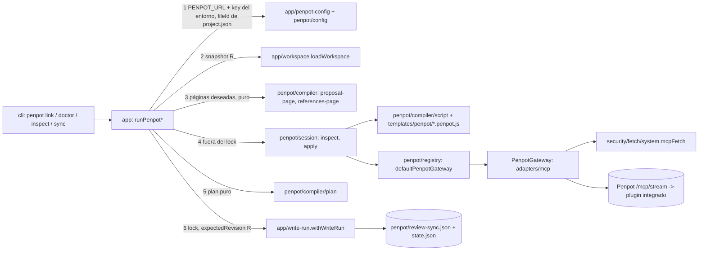

# 0005 Penpot base y propuestas visuales — Design

Parte P12 del master-plan `01-heron`. Cubre R1–R22 de `requirements.md` y los criterios P12.A1–A8 de `parts.json`. Señales de diseño: puerto y adapter nuevos hacia un sistema externo (`PenpotGateway` sobre el MCP oficial), contrato persistido nuevo (`PenpotSyncState`), código que se ejecuta dentro de Penpot con datos no confiables (riesgo de inyección), un secreto que viaja en una URL (MCP key / `userToken`), infraestructura difícil de revertir (compose y volúmenes de Penpot) y áreas críticas (`src/penpot`, `src/core/contracts`, `src/core/state`, `src/core/store`, `src/security`, `tests/repo/boundaries.test.ts`). Convenciones vinculantes: skill `heron-architecture` y `references/{patterns,layout,recipes}.md` (patrones 3, 9 y 10). Lo decidido en `MASTER.md` (Arquitectura 2 y 3, Seguridad, Stack), `DECISIONS.md` (D7, D8, D12, D14, D23–D26) y en las specs 0001–0004 no se re-litiga; las desviaciones se declaran en § Decisions.

**Revisión 2 (2026-10-01).** Aplica las decisiones del usuario sobre OD1–OD6 (DR33–DR38), las decisiones que faltaban (DR39–DR43) y el challenge `.navori/state/handoffs/challenge_p12-spec.md`: B1 (registro y filas de frontera, § Contracts 12), B2 (URL por entorno, DR33 y DR43), B3 (spike del Lote 1 y congelamiento de plantillas, DR44 y § Spike), C1–C10 y N1–N7 (tabla de trazabilidad al final de § Decisions).

**Ref verificado:** `git fetch origin develop` OK el 2026-10-01; `origin/develop` = `ca38bbf` (suma a `4b635f5` P3 T10–T11 y P4 T11–T13). Toda cita `archivo:línea` del repo vale para `ca38bbf` (leída con `git show origin/develop:<ruta>`); las marcadas **†** apuntan a archivos que P3 (T12–T17) todavía modifica: al implementar se ubican por el **símbolo** indicado. Evidencia de Penpot: tag `2.17.2` de `penpot/penpot` (archivos citados en § Fuentes consultadas), consultado el 2026-10-01.

## Decisiones abiertas

Ninguna. Las seis de la versión anterior las cerró el usuario el 2026-10-01:

| OD | Decisión | DR |
|---|---|---|
| OD1 | URL de Penpot por variable de entorno local junto con la key; `heron penpot link` guarda solo el `fileId` | DR33 (y DR7, DR43) |
| OD2 | `@modelcontextprotocol/sdk` 1.31.0 (ya fijado por MASTER Stack y RNF-15; no estaba abierta) | DR34 (y DR6) |
| OD3 | Registro cerrado + `manage.py create-profile`; el Lote 1 confirma que el perfil queda verificado | DR35 |
| OD4 | Telemetría desactivada; proveedor de Google Fonts decidido de forma explícita (activo) | DR36 |
| OD5 | Página References con tarjetas solo de texto | DR37 (y DR30) |
| OD6 | 3 páginas con la misma geometría, sin enmendar P12.A5; cómo se cumple "lado a lado" | DR38 |

## Approach

### Qué existe (evidencia)

| Hecho | Evidencia (`ca38bbf`; † = P3 lo modifica antes, ubicar por símbolo) | ¿Basta extenderlo? |
|---|---|---|
| `project.json` ya tiene la configuración de Penpot; `init` la crea desactivada y nadie lee `penpot.url` | `src/core/contracts/heron-project.ts:22`, `:37-42` (`url: z.string().nullable()`); `src/app/init.ts:75` (`penpot: { enabled: false, url: null, … }`) | Sí: `penpot link` llena `enabled` y `fileId`; `url` queda `null` y no se lee (DR33); sin cambio de schema |
| Los hechos de Penpot y la precondición de D26 ya existen, sin productor | `src/core/state/transitions.ts:34-35` (`penpotEnabled`, `penpotProposalsWritten`, "produced from P12"), `:119-130` (`direction-selectable`); `src/core/contracts/common.ts:66` (`PENPOT_REQUIRED_FOR_DIRECTION`) | Sí: P12 agrega el colector (DR18) |
| `penpot/sync-state.json` está atado al gate `visual-review` y depende de `design/**` | `src/core/state/gates.ts:29`; `src/core/state/stale.ts:31`, `:56-57` | No para páginas de revisión: reescribirlas invalidaría `visual-review` (DR16) |
| `.heron/.gitignore` excluye solo `/penpot/snapshots/` | `src/core/store/file-store.ts:34` (`HERON_GITIGNORE`) | Sí: el registro de P12 se versiona |
| Las direcciones traen todos los datos de su propuesta, con contraste ya calculado | `src/core/contracts/directions.ts:343-369` (`VisualProposal`, `VisualDirections`); `src/research/directions.ts:263` (`buildVisualDirections`) | Sí: es la entrada del compilador |
| El validador de direcciones no verifica `fill`, `text` ni `typeStep` de la hoja de componentes | `src/research/directions.ts` `checkComponents` (solo revisa tipos requeridos y mínimo) | El compilador resuelve con respaldo y aviso (DR24); hallazgo para P3 |
| Registro de plantillas de texto con sha256 | `src/agents/prompts.ts:1-30` (`PROMPT_TEMPLATES`, `template`, import `with { type: "text" }`); patrón 10 | Sí: mismo patrón para `templates/penpot/*.penpot.js` (DR13) |
| Solo `src/<m>/registry.ts` (y `intake/detect.ts`) importa `src/<m>/adapters/**`; precedente de registro | `tests/repo/boundaries.test.ts:441-449` (`violationsFor`); `src/research/registry.ts` (`RESEARCH_SOURCES`, `sourceFor`); `src/app/references.ts:41` | Sí: `src/penpot/registry.ts` (B1, § Contracts 12) |
| Filas de fronteras: la fila de prefijo más largo gana; `bare` se exige antes que `VENDORS` | `tests/repo/boundaries.test.ts:413-431` | Filas específicas para `compiler/`, `compiler/templates.ts` y `adapters/mcp` (§ Contracts 12) |
| `fetch(` solo en un archivo | `tests/repo/boundaries.test.ts:309-316` (`TOKENS`); `src/security/fetch/system.ts` (`bunTransport`) | Sí: `mcpFetch` vive ahí (DR7) |
| Clasificador puro de IPs del SSRF de P2 | `src/security/ssrf.ts:205` (`classifyAddress`), `:236` (`isIpLiteral`), `:23` (`LOCAL_ALLOWABLE_RANGES`: loopback, private, shared, unique-local) | Sí: valida el host de `PENPOT_URL` (DR7) |
| `redactUrl` ya oculta `userToken`; el redactor por valor trata todo `PENPOT_*`/`HERON_*` de ≥ 8 caracteres como secreto | `src/security/redact.ts:26` (`"usertoken"`), `:33`, `:64-65`, `:88-99` (`createValueRedactor`) | Sí: la key de archivo entra como secreto extra (DR8); el valor de `PENPOT_URL` también queda redactado, así que los mensajes nombran la variable (DR33) |
| El entorno de los agentes nunca recibe `PENPOT_*` | `src/security/env.ts:49` (`FORBIDDEN_ENV_PREFIXES`) | Sí (R7) |
| `FileStat` del puerto de filesystem no expone el modo | `src/core/store/fs-port.ts:3-9`; `nodeFs.lstatSync` devuelve `fs.Stats` (`:36`) | Se agrega `mode: number` (aditivo, DR39) |
| `doctor`: checks secuenciales con timeout de 10 s; exit 5 si falla uno de dependencia | `src/app/doctor.ts:28`, `:203-260`†; `DOCTOR_CHECK_IDS` en `src/core/contracts/cli-envelope.ts:119-134` | Se extiende (DR21) |
| Escritura con instantánea, revisión esperada y `skip` sin escribir | `src/app/write-run.ts:37-52` (`WriteBodyResult`, `withWriteRun`) | Sí (patrón 3) |
| `freshen`, `withArtifacts`, `recordCommand` | `src/core/state/lifecycle.ts:42`, `:60`, `:87` | Sí |
| Registros append-only | `CLI_COMMANDS` (`src/core/contracts/cli-envelope.ts:70-90`), `FINDING_CODES` (`src/core/contracts/common.ts:34-113`, termina en `SECRET_REDACTED`), `LOG_EVENT_NAMES` (`src/security/logger.ts:4`), `DocumentKind`, `CONTRACT_DOCUMENTS` | Sí: P12 agrega al final de lo que haya en `develop` al integrar (C9) |
| Copy de artefactos en `en`/`es` | `src/research/render/copy.ts:1-2`, `:105-121` (`RESEARCH_COPY`, `resolveCopy`) | Patrón sí; tabla propia porque `penpot` no puede importar `research` (DR23) |
| Ubicación ya planeada | `.claude/skills/heron-architecture/references/layout.md:20` (`src/penpot/ ports compiler/{plan,script,ids,templates} adapters/mcp/`), `:24`, `:26`, `:59`, `:70` (`PenpotSession` en `src/penpot/ports.ts`, que P6 importa como tipo) | Sí; `PenpotSession` se declara en `ports.ts` |
| Sonda viva opt-in de precedente | `tests/live/agents.live.ts`; script `test:live` de `package.json` | Mismo patrón: `test:live:penpot` y `test:live:compose` |
| Tests sin red por construcción | `tests/helpers/cli.ts:16`, `:37` (`fixedContext`, `offlineFetcher`) | Mismo patrón: `refusingGateway` (DR26) |
| Hechos del gate desde colectores | `src/app/gate.ts:54`† (`gateFacts`); `src/app/facts.ts` (`collectDirectionFacts`, `collectIntakeFacts`) | Sí: suma `collectPenpotFacts` para `direction` |
| Cobertura por prefijo | `scripts/check-coverage.ts:7-15` (`COVERAGE_RULES`) | + `src/penpot/` a 0,9 |
| `tsc` 7.0.2, `oxlint` 1.86.0 y `oxfmt` 0.71.0 aceptan `*.penpot.js` importado como texto con `return` al nivel superior | Sonda local 2026-10-01 (proyecto temporal con el `tsconfig.json` del repo): `tsc --noEmit` exit 0 con `declare module "*.penpot.js"`; `bun -e` importa el texto; `oxlint` y `oxfmt --check` exit 0 | Sí (DR13) |
| Bun 1.4.2 carga el `.env` del directorio de trabajo y ejecuta el `preload` de su `bunfig.toml` aunque el script viva en otro directorio; lo ya exportado en el shell gana al `.env`; `bun --no-env-file --config=/dev/null` evita ambos, también como shebang `#!/usr/bin/env -S …` | Sonda local 2026-10-01 (directorio con `.env` y `bunfig.toml` con `preload`, script fuera de él); https://bun.com/docs/runtime/environment-variables (consultado 2026-10-01: `--no-env-file`, `env = false`) | No: `bin/heron.ts` no lo evita hoy (`#!/usr/bin/env bun`); DR43 |

Evidencia de Penpot y terceros (consultada 2026-10-01):

| Hecho | Fuente | Consecuencia |
|---|---|---|
| El compose del tag usa `penpotapp/<x>:${PENPOT_VERSION:-2.16}`: sin la variable correría **2.16** | `docker/images/docker-compose.yaml` del tag, sha256 `79330b4445d6c6dba6918d222d342a365710ba90b6bb8a8eae3d333155b0cf5e` | El override exige `PENPOT_VERSION` sin respaldo (DR2) |
| El compose trae `PENPOT_FLAGS: disable-email-verification enable-smtp enable-prepl-server disable-secure-session-cookies enable-mcp` (anclas `x-flags`), `PENPOT_SECRET_KEY: change-this-insecure-key` (`x-secret-key`), contraseña de base `penpot`, `penpot-mailcatch` en `sj26/mailcatcher:latest` publicado en `1080:1080`, frontend en `9001:8080`, `penpot-mcp` sin puertos y telemetría `"true"` | mismo archivo | Contenido del override (DR2, DR47) |
| Flags por default de 2.17.2: `enable-registration`, `enable-secure-session-cookies`, `enable-email-verification`, `enable-google-fonts-provider`, entre otras; `PENPOT_FLAGS` las modifica, no las reemplaza | `common/src/app/common/flags.cljc` del tag (`default`, `parse`) | Quitar `disable-*` deja activos los defaults seguros; Google Fonts es egreso por default (DR36) |
| `docker compose config` conserva los bloques `x-*` del archivo base aunque ningún servicio los use: un override que solo toca servicios deja `change-this-insecure-key` en el modelo | Sonda local con Docker Compose 5.1.2, 2026-10-01 | El override también redefine `x-flags`, `x-secret-key` y `x-uri` (DR2) |
| Con el override de DR2, `config` da imágenes `2.17.2`, puerto `127.0.0.1:9001`, 0 apariciones de las cadenas inseguras y sin `penpot-mailcatch`; sin `PENPOT_PUBLIC_URI` falla con "required variable PENPOT_PUBLIC_URI is missing a value" | Sonda local (`docker compose ... config --format json`, `--services`), 2026-10-01 | Diseño de DR2 verificado |
| `sj26/mailcatcher:v0.11.0` tiene el mismo digest que `latest` | https://hub.docker.com/v2/repositories/sj26/mailcatcher/tags (2026-10-01) | Imagen fijada aunque el servicio esté inactivo (DR47) |
| El frontend solo genera las rutas MCP si su `PENPOT_FLAGS` contiene `enable-mcp`; `/mcp/stream` → `$PENPOT_MCP_URI/mcp`, `/sse`, `/mcp/ws` (websocket del plugin) | `docker/images/files/nginx-entrypoint.sh` (bloque `enable-mcp`), `docker/images/files/nginx-mcp-locations.conf.template` | Endpoint de Heron: `<PENPOT_URL>/mcp/stream?userToken=<key>` (DR5); `enable-mcp` en el frontend es obligatorio (R1) |
| El servidor MCP de la imagen corre en modo multiusuario | `docker/images/Dockerfile.mcp` (`CMD ["node", "index.js", "--multi-user"]`) | El `userToken` es obligatorio y se usa el plugin integrado ("Remote MCP") |
| `execute_code` recibe un único parámetro `code`; responde texto `JSON.stringify({ result, log }, null, 2)`; cualquier excepción vuelve como texto `Tool execution failed: …` (no como `isError`); sin plugin: `No Penpot instance connected for user token. …` o `No Penpot plugin instances are currently connected. …`; timeout de herramienta del servidor `PENPOT_MCP_TOOL_TIMEOUT_S` = 120 s | `mcp/packages/server/src/tools/ExecuteCodeTool.ts`, `src/Tool.ts`, `src/PluginBridge.ts`, `src/PenpotMcpServer.ts`; `mcp/packages/plugin/src/task-handlers/ExecuteCodeTaskHandler.ts` | Clasificación de fallas por texto (DR10); un timeout del cliente no detiene el script (DR45) |
| El código corre como cuerpo de `async () => { … }` con `penpot`, `penpotUtils`, `storage` y `console` en el ámbito | `ExecuteCodeTaskHandler.ts` (`new Function(...)`) | Forma del script (DR11) y del doble de pruebas (DR26) |
| Plugin API del tag (`@penpot/plugin-types` 1.5.0): `penpot.version`, `currentFile` (`id`, `name`, `revn`, `pages`), `createPage()`, `openPage(page)` (async; la página activa recibe las formas nuevas), `Page.remove()`, `findShapes`, `setSharedPluginData`/`getSharedPluginData`, `createBoard`/`createRectangle`/`createText`, `addFlexLayout`/`addGridLayout`, `fonts.findByName`, `Font.applyToText` | `plugins/libs/plugin-types/index.d.ts` del tag; https://doc.plugins.penpot.app/ | Vocabulario de las plantillas (DR12, DR14, DR25) |
| MCP remoto: URL `https://<penpot>/mcp/stream?userToken=YOUR_MCP_KEY`; la key se muestra una sola vez y no es recuperable; conexión por "File → MCP Server → Connect"; MCP activo en una sola pestaña a la vez; Chrome y Edge tienen un ajuste por sitio para mantener activa la pestaña, Firefox y Safari no | https://help.penpot.app/mcp/ | DR5, DR8, DR29, DR42; R3 |
| 2.18.0 (2026-09-23) tiene #12003 abierto (plugin integrado self-hosted conecta `/mcp/ws` sin `userToken`; el mantenedor pidió el 2026-10-01 probar sin reverse proxy); 2.18.1 (2026-10-01) no lo menciona pero cambia las rutas MCP del nginx a `$is_args$args` y agrega el servicio `penpot-admin-console` y el ancla `x-database` (contraseña `penpot`) al compose (sha256 `3d1bb75c95f3e913a34c4a9bb2c2db076ddf1a6f93020128f7e2def69ad99c39`) | https://github.com/penpot/penpot/releases, https://github.com/penpot/penpot/issues/12003, diff de `docker-compose.yaml` y `nginx-mcp-locations.conf.template` entre los tags | Se mantiene 2.17.2 (D7); la sonda de P12.A7 (T13) decide; subir a 2.18 exige ampliar el override (hallazgo sobre RNF-18) |

### El problema real

El diseñador necesita **ver y comparar** en Penpot las 3 propuestas que P3 deja en `visual-directions.json` antes de elegir (D24), y en `full` el gate `direction` exige que estén escritas ahí (D26). Eso requiere: (a) un Penpot self-hosted levantado del deployment oficial sin defaults inseguros y actualizable por una variable; (b) una conexión MCP que falle rápido y con instrucciones cuando falta la pestaña, el plugin, la URL o la key; (c) escribir páginas sin que un texto ajeno (nombres y atributos que redactó un LLM, referencias de la web) se vuelva código ejecutado en Penpot; (d) que repetir la operación no duplique ni reescriba nada, ni siquiera tras un timeout; (e) que la MCP key no termine en un log, en `.heron/`, en Git ni en un host que elija un repo clonado; y (f) que todo se pruebe sin un Penpot real. Consumidores: el diseñador (CLI), P5 (hechos del gate `direction`, 2 pantallas por propuesta), P6 (reusa puerto, sesión, plantillas y marcas para el sistema) y P8 (vista de estado).

### Decision drivers (de las reglas del proyecto)

1. **Penpot no es fuente de verdad y nunca recibe código libre** (RN-23, RN-35, W4, W6; MASTER Arquitectura 2; Seguridad "Inyección hacia Penpot").
2. **Deployment oficial sin editar, versión fijada, actualizable por una variable** (RN-24, RNF-18; MASTER Arquitectura 3).
3. **Falla rápida con instrucción** en los requisitos interactivos del MCP (RN-25, RNF-5).
4. **Secretos fuera de `.heron/`, logs, salida y del control del repo analizado** (RN-40, RNF-7; MASTER Seguridad "Secretos" y "Configuración hostil del repo analizado").
5. **Idempotencia y economía de operaciones**: segunda corrida = 0 escrituras (P12.A5), un script por página cambiada, sin IA.
6. **Lock nunca durante red** (patrón 3); **vendors confinados y fronteras verificadas** (D4, `boundaries.test.ts`).
7. **Tests deterministas sin Penpot real** (MASTER Testing: "servidor MCP falso"); sonda viva opt-in.
8. **Simplicidad** (§75, CLAUDE.md): sin dependencias nuevas fuera de la lista aprobada (RNF-15); regla de 3.
9. **Idioma** (D14): CLI en inglés; copy de las páginas en el idioma del producto.

### Opciones consideradas

**Cómo se escribe en Penpot.** *Peldaño 1 — patrón existente:* no hay escritor de Penpot; el registro de plantillas de P3 (`src/agents/prompts.ts`) sí existe y se reutiliza. *Peldaño 2 — extensión:* una plantilla JS por sección (paleta, tipografía, componentes, composición) que calcula su propio layout: descartado, la lógica quedaría en JS sin `tsc`, sin cobertura y repartida en 6+ plantillas. *Peldaño 3 — elegido:* el layout se calcula en TS puro como un árbol de nodos (`board`, `rect`, `text`) y una sola plantilla genérica (`review-page@v1`) lo dibuja (DR12). Descartados en una línea: importar `.penpot` o escribir en su base (W4); que un LLM escriba el script (W6, RN-35).

**Dónde vive la dirección de Penpot.** Decidido por el usuario (DR33): en `PENPOT_URL`, junto con la key, en el entorno local. Descartados (detalle en DR33): `project.json` (el repo decidiría a qué host va la key, B2), host ligado en el primer uso y confirmación explícita por host.

**Cliente MCP.** SDK oficial 1.31.0, fijado por MASTER Stack (DR34).

**Cómo se prueba el compose fusionado (P12.A1).** *`docker compose config` dentro de `bun test`:* descartado, `bun run check` exigiría Docker en cada máquina y en CI (DR41). *Archivo resuelto versionado con prueba de deriva:* descartado, su contenido depende de la versión de Compose de quien lo genera. *Elegido:* fusión e interpolación puras del subconjunto que usan el compose y el override en `bun test`, más la misma batería de aserciones aplicada a la salida real de `docker compose config` en una comprobación opt-in cuya salida es evidencia obligatoria de todo PR que toque `infra/penpot/` (DR4, C7).

**Dónde se registra lo sincronizado.** *`penpot/sync-state.json` (ruta de MASTER):* descartado, está atado al gate `visual-review` y depende de `design/**`; escribir ahí las páginas de revisión invalidaría aprobaciones de P6. *Sin registro local:* descartado, el hecho del gate `direction` exigiría consultar Penpot en vivo dentro de `heron gate`. *Elegido:* `penpot/review-sync.json` con el mismo kind `PenpotSyncState` y `scope: "review"` (DR16).

**Cómo se logra la idempotencia.** *Solo con el registro local:* descartado, falla si alguien borró páginas en Penpot o si `.heron/` se clonó sin el registro. *Borrar y recrear siempre:* descartado, viola P12.A5. *Elegido:* huella de contenido guardada como marca en la propia página, borrada al empezar a escribir y escrita al final solo si la página quedó exactamente como Heron la dibujó; el plan compara contra lo que Penpot dice (DR15, DR45).

### Recomendación



`heron penpot sync`: (1) valida banderas, el vínculo de `project.json` y `PENPOT_URL`/key del entorno sin I/O de red (exit 2/3/5 antes de conectar); (2) toma la instantánea `R`; (3) compila de forma pura las páginas deseadas desde `visual-directions.json` y/o `references.json` (exit 3 si falta la fuente o está `stale`); (4) fuera del lock: conecta (≤ 10 s), lee las marcas con la plantilla de lectura (≤ 10 s), verifica el `fileId` (exit 3), planea; con `--dry-run` imprime y termina; si no, escribe página por página (≤ 60 s cada una) y, si escribió algo, relee; (5) arma el registro desde la última lectura; (6) si sus bytes no cambian y no hubo escrituras, no toca `.heron/`; si no, `withWriteRun(expectedRevision R)` escribe el registro, `recordCommand` + `withArtifacts` + `freshen` y hace commit. Una corrida parcial hace commit de lo confirmado y sale con 5 (o 3 si la página tiene formas humanas dentro, DR46).

## Economía de operaciones

Requisito del usuario para esta parte: economía de tokens y de operaciones. P12 no invoca IA (RN-35); el costo está en llamadas al MCP y escrituras.

| Patrón | Mecanismo | DR | Verificación |
|---|---|---|---|
| No reescribir lo que ya está | Huella de contenido como marca en la página; el plan solo incluye páginas faltantes o desactualizadas | DR15 | `proposals.test.ts#writes one idempotent page per direction with its visual proposal` (segunda corrida: 0 scripts de escritura) |
| Una lectura por corrida | `inspect@v1` una vez; relectura solo si hubo escrituras | DR15 | mismo caso (1 lectura en la segunda corrida) |
| Un script por página cambiada | `apply` por página; nunca un script por forma | DR15 | `plan.test.ts#plans writes only for missing or outdated pages and reports duplicates` |
| Nada local sin cambio | El registro se deriva de la lectura; bytes iguales → `skip` sin transacción ni historial | DR16 | `proposals.test.ts` (`hashTree` de `.heron/` igual en la segunda corrida) |
| Scripts deterministas y acotados | Literal JSON canónico, sin fechas ni ids aleatorios, ≤ 256 KiB (S7) | DR11 | `script.test.ts#embeds untrusted strings as JSON data in deterministic scripts` |
| Concurrencia sin estado extra | La verificación final de la plantilla reemplaza a un arriendo o a esperas | DR45 | `templates.test.ts#leaves the page without a content mark when two writes interleave` |
| Diagnóstico barato | `doctor`: handshake + 1 lectura; `penpot.file` y `penpot.version` salen de esa lectura | DR21 | `doctor.test.ts#fails fast without plugin and never leaks the MCP key` |
| Ver antes de escribir | `--dry-run` con el plan | DR15 | `penpot.test.ts#previews the plan with --dry-run without writing` |

## Components

Rutas exactas. "R" = requisitos de `requirements.md`. `(nuevo)` / `(mod)`. † = P3 lo modifica antes.

### Infraestructura, lanzador y documentación

| Ruta | Responsabilidad | R |
|---|---|---|
| `infra/penpot/fetch-compose` (nuevo, POSIX sh, ejecutable) | Descarga HTTPS del compose del tag, verificación sha256, `--update`, `--out <dir>` | R2 |
| `infra/penpot/init-env` (nuevo, POSIX sh, ejecutable) | Crea `.env` una sola vez desde `.env.example` con secretos aleatorios y modo 0600 (DR39) | R21 |
| `infra/penpot/compose` (nuevo, POSIX sh, ejecutable) | Wrapper de `docker compose` con proyecto, `--env-file` y los dos archivos; guarda de permisos y de flags prohibidas; `--check` valida sin llamar a `docker` (DR47) | R1, R21 |
| `infra/penpot/docker-compose.yaml` (nuevo, copia sin editar del tag 2.17.2) | Compose oficial vendorizado | R1, R2 |
| `infra/penpot/docker-compose.yaml.sha256` (nuevo) | `79330b4445d6c6dba6918d222d342a365710ba90b6bb8a8eae3d333155b0cf5e  infra/penpot/docker-compose.yaml` (formato `shasum -c`) | R2 |
| `infra/penpot/compose.override.yaml` (nuevo) | Versión, secretos, flags, puerto, mailcatch, telemetría, SMTP opcional (DR2) | R1 |
| `infra/penpot/.env.example` (nuevo) | `PENPOT_VERSION=2.17.2` y el resto de variables; secretos vacíos | R1 |
| `.gitignore` (mod) | `/infra/penpot/.env`, `/infra/penpot/.env.*`, `!/infra/penpot/.env.example` | R21 |
| `bin/heron.ts` (mod), `package.json` (mod: script `heron`) | Lanzador sin `.env` ni `bunfig.toml` del directorio de trabajo (DR43) | R22 |
| `docs/penpot.md` (nuevo) | Guía de operación (R3) y § Versiones (R18) | R3, R18 |
| `docs/adr/0007-penpot-boundary.md` (nuevo) | Frontera de Penpot | R19 |
| `docs/architecture.md`, `docs/security.md`, `README.md` (mod) | Módulo `penpot`, key, URL por entorno, lanzador y scripts, órdenes `heron penpot` | R19 |

### Contratos, estado y store

| Ruta | Responsabilidad | R |
|---|---|---|
| `src/core/contracts/penpot.ts` (nuevo) | `PenpotSyncState`, `PENPOT_SYNC_STATE_DOCUMENT`, datos de CLI (`PenpotLinkData`, `PenpotInspectData`, `PenpotSyncData`) | R5, R8, R11, R15 |
| `src/core/contracts/common.ts` (mod) | 22 `FINDING_CODES` al final de la lista vigente | R4–R17 |
| `src/core/contracts/cli-envelope.ts` (mod) | `CLI_COMMANDS` + 4, unión `data`, `DOCTOR_CHECK_IDS` + 7 | R5, R6, R8, R11 |
| `src/core/contracts/version.ts`, `index.ts` (mod) | `DocumentKind` + `"PenpotSyncState"`; barrel y `CONTRACT_DOCUMENTS` | R15 |
| `schemas/penpot-sync-state.v1.schema.json` (nuevo), `schemas/cli-envelope.v1.schema.json` (regenerado) | Deriva cero | R15 |
| `src/core/state/stale.ts` (mod) | `PHASE_ARTIFACTS["directions-ready"]` y `ARTIFACT_DEPENDENCIES` de `penpot/review-sync.json` | R15 |
| `src/core/store/fs-port.ts` (mod) | `FileStat.mode: number` (aditivo; `nodeFs` ya lo devuelve) | R4 |

### Módulo `src/penpot/` (área crítica)

| Ruta | Responsabilidad | R |
|---|---|---|
| `src/penpot/ports.ts` (nuevo) | `PenpotGateway`, `PenpotCodeRunner`, `PenpotFailure`, `PenpotExecution`, `PenpotSession`, `SessionResult` | R4, R6, R17 |
| `src/penpot/registry.ts` (nuevo) | `defaultPenpotGateway`: único importador de `src/penpot/adapters/**` (B1) | R19 |
| `src/penpot/config.ts` (nuevo, puro) | `parsePenpotUrl`, `mcpEndpoint` | R4 |
| `src/penpot/compatibility.ts` (nuevo) | `PENPOT_TESTED_VERSIONS`, `isTestedVersion` | R6, R18 |
| `src/penpot/results.ts` (nuevo) | Tipos y schemas Zod de lo que devuelven `inspect@v1` y `review-page@v1` | R8, R13, R17 |
| `src/penpot/session.ts` (nuevo) | `parseExecuteText`, `openPenpotSession` (implementa `PenpotSession` sobre un `PenpotCodeRunner`) | R8, R11, R17 |
| `src/penpot/text-modules.d.ts` (nuevo) | `declare module "*.penpot.js"` | R9 |
| `src/penpot/compiler/nodes.ts` (nuevo) | `PenpotNode`, `ReviewPage`, `PageMarks`, `HERON_NAMESPACE` | R10, R13 |
| `src/penpot/compiler/templates.ts` (nuevo) | `PENPOT_TEMPLATES`, `penpotTemplate` (import de texto + sha256); único importador de `templates/penpot/` | R9 |
| `src/penpot/compiler/script.ts` (nuevo) | `renderScript`, `safeJsonLiteral`, `MAX_SCRIPT_BYTES` | R9 |
| `src/penpot/compiler/ids.ts` (nuevo) | `proposalPageId`, `REFERENCES_PAGE_ID`, `proposalSourceSha256`, `referencesSourceSha256`, `contentSha256` | R10, R15, R16 |
| `src/penpot/compiler/copy.ts` (nuevo) | `PENPOT_COPY` (`en`, `es`), `resolvePenpotCopy` | R10, R16 |
| `src/penpot/compiler/components.ts` (nuevo) | Recetas de dibujo por `BasicComponentKind` | R10 |
| `src/penpot/compiler/composition.ts` (nuevo) | Composición plana de P3 → árbol de nodos | R10 |
| `src/penpot/compiler/proposal-page.ts` (nuevo) | `buildProposalPage`, `PROPOSAL_LAYOUT`, `CHROME` | R10, R14 |
| `src/penpot/compiler/references-page.ts` (nuevo) | `buildReferencesPage`, `REFERENCES_LIMITS` | R16 |
| `src/penpot/compiler/plan.ts` (nuevo) | `planReviewSync`, `pageStatuses`, `reviewRecord` | R8, R11, R15 |
| `src/penpot/adapters/mcp/index.ts` (nuevo) | `mcpGateway` (SDK): conexión, `tools/list`, `execute_code`, clasificación, redacción | R4, R6, R7 |
| `templates/penpot/inspect@v1.penpot.js` (nuevo) | Lectura: versión, archivo, páginas con marca | R8 |
| `templates/penpot/review-page@v1.penpot.js` (nuevo) | Crea o reescribe una página de revisión desde nodos y marcas, con guarda de formas humanas y verificación final | R9, R13, R14, R17 |

### Seguridad

| Ruta | Responsabilidad | R |
|---|---|---|
| `src/security/fetch/system.ts` (mod) | `mcpFetch`: `fetch` con `redirect: "error"` (único sitio de `fetch(`) | R7 |
| `src/security/logger.ts` (mod) | `LOG_EVENT_NAMES` + `"penpot.error"` | R7, R17 |

### Casos de uso y CLI

| Ruta | Responsabilidad | R |
|---|---|---|
| `src/app/context.ts`† (mod) | `AppContext.penpot: PenpotServices`; `createDefaultContext` con `defaultPenpotGateway` de `src/penpot/registry.ts` | R4, R6 |
| `src/app/penpot-config.ts` (nuevo) | `resolvePenpotUrl`, `resolvePenpotKey`, `readPenpotLink`, `penpotRedactor` | R4, R7 |
| `src/app/penpot-session.ts` (nuevo) | `withPenpotSession` (abre, cierra con tope, mapea fallas a findings y a `penpot.error`) | R6, R7, R17 |
| `src/app/penpot.ts` (nuevo) | `runPenpotLink`, `runPenpotInspect` | R5, R8 |
| `src/app/penpot-sync.ts` (nuevo) | `runPenpotSync` | R11–R17 |
| `src/app/penpot-doctor.ts` (nuevo) | `penpotChecks`, `runPenpotDoctor` | R6 |
| `src/app/doctor.ts`† (mod) | `penpotChecks` en paralelo con los de agentes solo si hay vínculo | R6 |
| `src/app/facts.ts`† (mod) | `collectPenpotFacts` | R15 |
| `src/app/gate.ts`† (mod) | `gateFacts` suma `collectPenpotFacts` para `direction` | R15 |
| `src/app/status.ts`† (mod) | `allowedCommands` con las órdenes `heron penpot` | R8, R11 |
| `src/cli/commands/penpot.ts` (nuevo) | `penpotCommand` (`link`, `doctor`, `inspect`, `sync`) | R5, R6, R8, R11, R16 |
| `src/cli/commands/index.ts`†, `src/cli/command.ts`†, `src/cli/main.ts`†, `src/cli/args.ts` (mod) | Registro, `PenpotParsed`, envelope, pie de `USAGE_TEXT` | R5, R6, R8, R11 |
| `src/cli/render-penpot.ts` (nuevo) | `renderPenpotLinkText`, `renderPenpotInspectText`, `renderPenpotSyncText` (escapa controles) | R5, R8, R11 |

### Repo, tests y helpers

| Ruta | Responsabilidad | R |
|---|---|---|
| `tests/repo/boundaries.test.ts` (mod) | Filas y autocomprobaciones de § Contracts 12 | R19 |
| `scripts/check-coverage.ts`, `tests/repo/coverage-rules.test.ts` (mod) | `src/penpot/` a 0,9 | RNF-8 |
| `package.json`, `bun.lock` (mod) | `@modelcontextprotocol/sdk` 1.31.0 exacto; scripts `test:live:penpot`, `test:live:compose`; script `heron` (DR43) | R1, R19, R20, R22 |
| `tests/helpers/compose.ts` (nuevo) | `ComposeModel`, `loadComposeModel` (fusión), `interpolateCompose` (interpolación) y `assertPenpotComposeInvariants` (aserciones de R1 compartidas por el test puro y la comprobación real) | R1 |
| `tests/assets/infra/penpot.synthetic.env` (nuevo, SYNTHETIC) | Secretos de relleno para interpolar el override en tests y en `docker compose config` | R1 |
| `tests/infra/penpot-compose.test.ts` (nuevo) | Modelo fusionado, `fetch-compose`, `init-env`, `compose --check`, `.gitignore` | R1, R2, R21 |
| `tests/live/penpot-compose.live.ts` (nuevo) | Comprobación opt-in con `docker compose config` real (DR4) | R1 |
| `tests/helpers/fake-penpot.ts` (nuevo) | `FakePenpot` y `createFakePenpot`: subconjunto en memoria de la Plugin API con `FakePenpotCounters` (lecturas y mutaciones) y `openPage` con promesa controlable (intercalado); `runPenpotScript` como `ExecuteCodeTaskHandler` | R8, R9, R13, R17 |
| `tests/helpers/fake-mcp.ts` (nuevo) | `startFakeMcp(options: FakeMcpOptions): Promise<FakeMcpServer>`: servidor Streamable HTTP en `127.0.0.1:0` con `execute_code` sobre un `FakePenpot` (key esperada, sin plugin, colgado, 500 que repite la URL, contador de peticiones) | R4, R6, R7, R11 |
| `tests/helpers/penpot.ts` (nuevo) | `directionsWorkspace`, `linkedWorkspace`, `CANARY_MCP_KEY`, `penpotEnv` | R5, R11, R14 |
| `tests/helpers/cli.ts`† (mod) | `fixedContext` con `penpot.gateway = refusingGateway` | R19 |
| `tests/assets/penpot/direction-proposal.json` (nuevo, SYNTHETIC) | `DirectionProposalOutput` válido de 3 direcciones con un nombre hostil | R9, R10 |
| `tests/repo/launcher.test.ts` (nuevo) | Lanzador sin `.env` ni `bunfig.toml` ajenos | R22 |
| `tests/live/penpot.live.ts` (nuevo) | Sonda viva opt-in | R18, R20 |
| Tests de § Testing strategy | — | R1–R22 |

## Decisions

- **DR1 — Compose oficial vendorizado y sin editar.** `infra/penpot/docker-compose.yaml` es la copia byte a byte del tag fijado y se versiona en el repo para que P12.A1 corra sin red; `fetch-compose` la reemplaza solo si coincide su sha256. Se opera con `infra/penpot/compose <args>` = `docker compose -p penpot --env-file infra/penpot/.env -f infra/penpot/docker-compose.yaml -f infra/penpot/compose.override.yaml <args>` tras las guardas de DR47 (arranque: `infra/penpot/compose up -d`). Descartado: descargarla en cada uso (tests con red). Cubre R1, R2.
- **DR2 — Contenido del override (verificado con `docker compose config` 5.1.2).** (a) `image: penpotapp/<frontend|backend|mcp|exporter>:${PENPOT_VERSION:?PENPOT_VERSION is required}` en los 4 servicios de Penpot, sin respaldo, porque el compose del tag cae en `2.16`. (b) `PENPOT_FLAGS` base fija, igual en frontend, backend y en el ancla `x-flags`: `enable-mcp enable-prepl-server disable-registration ${PENPOT_EXTRA_FLAGS:-}` (DR35; el login con contraseña, la verificación de email y las cookies seguras son defaults de 2.17.2); `PENPOT_EXTRA_FLAGS` permite agregar `enable-smtp`, OIDC o `disable-google-fonts-provider` sin editar el override, con la guarda de DR47. (c) `PENPOT_SECRET_KEY: ${PENPOT_SECRET_KEY:?…}` en backend, exporter y `x-secret-key`; `PENPOT_PUBLIC_URI: ${PENPOT_PUBLIC_URI:?…}` en frontend, backend, exporter y `x-uri`. (d) `PENPOT_DATABASE_PASSWORD` (backend) y `POSTGRES_PASSWORD` (postgres) desde `${PENPOT_DB_PASSWORD:?…}`: cierra la contraseña fija `penpot`; `init-env` la genera antes del primer `up` (DR39). (e) `penpot-mailcatch` con `profiles: ["disabled"]` e `image: sj26/mailcatcher:v0.11.0` (DR47): Compose no lo arranca y no hay `depends_on` hacia él (verificado con `config --services`); descartado `!reset` sobre el servicio (no documentado para un servicio completo). (f) `ports: !override ["${PENPOT_BIND_ADDRESS:-127.0.0.1}:${PENPOT_HTTP_PORT:-9001}:8080"]` en el frontend: sin `!override` Compose suma la entrada y deja también `0.0.0.0:9001` (las entradas de `ports` se fusionan por `{ip, target, published, protocol}`, https://docs.docker.com/reference/compose-file/merge/); la versión de Compose soportada es la probada (DR40) y la comprobación real de DR4 lo verifica en cualquier otra. (g) `PENPOT_TELEMETRY_ENABLED: ${PENPOT_TELEMETRY_ENABLED:-false}` (DR36). (h) SMTP desde variables opcionales (`PENPOT_SMTP_HOST` vacío por default): sin `enable-smtp` Penpot no envía correo. Las imágenes `postgres:15` y `valkey/valkey:8.1` quedan como las fija el upstream (mayor o menor fijada, no `latest`): fijar el parche o el digest divergiría del compose oficial que RN-24 y RNF-18 piden seguir sin editar; `docs/penpot.md` lo dice (N4). Cubre R1.
- **DR3 — `fetch-compose` en POSIX sh.** `set -eu`; exige `PENPOT_VERSION` con forma `^[0-9]+\.[0-9]+\.[0-9]+$`; descarga con `curl --fail --silent --show-error --location --proto '=https' --tlsv1.2` de `https://raw.githubusercontent.com/penpot/penpot/${PENPOT_VERSION}/docker/images/docker-compose.yaml` a un temporal; sin banderas exige que `PENPOT_VERSION` sea la de `.env.example` y que `shasum -a 256` coincida con `docker-compose.yaml.sha256`, y solo entonces mueve el archivo; `--update` registra versión y sha256 nuevos (confianza en el primer uso, paso humano explícito y revisado en el PR) en `.env.example` y en `.sha256`; `--out <dir>` (sondas de versión) escribe solo en `<dir>`. Descartado: script de Bun (más superficie para un `curl` + `shasum`) y sin checksum (no detecta un cambio del archivo del tag). Cubre R2.
- **DR4 — Prueba del compose: modelo puro en `bun test` y Compose real opt-in (C7).** `tests/helpers/compose.ts` lee los dos YAML con `Bun.YAML.parse` (resuelve anclas y `<<`; https://bun.com/docs/runtime/yaml), interpola `${V}`, `${V:-d}`, `${V-d}`, `${V:?m}`, `${V?m}` y `$$` con un entorno dado, fusiona mapas en profundidad, normaliza `environment` en lista a mapa, reemplaza escalares y excluye servicios con `profiles`; `assertPenpotComposeInvariants(model)` concentra las aserciones de R1. `Bun.YAML.parse` descarta la etiqueta `!override`, así que el test puro verifica además el texto `ports: !override`. La comprobación real `tests/live/penpot-compose.live.ts` (`HERON_LIVE_COMPOSE=1 bun run test:live:compose`) corre `docker compose -p penpot-check --env-file tests/assets/infra/penpot.synthetic.env -f … -f … config --format json` y `config --services`, imprime `docker compose version` y aplica `assertPenpotComposeInvariants` al modelo que produce Compose: así A1 lo verifica Compose y no solo un modelo de Compose. Su salida es evidencia obligatoria de T1, T2 y de todo PR que toque `infra/penpot/` (DR41). Cubre R1.
- **DR5 — Endpoint y autenticación.** Heron se conecta a `new URL("mcp/stream", PENPOT_URL + "/")` con `userToken=<key>` en la query, a través del proxy del frontend (no a `penpot-mcp:4401`, que no publica puertos); requiere el plugin integrado conectado desde el workspace ("Remote MCP", https://help.penpot.app/mcp/). La URL completa solo existe dentro del adapter; nunca se guarda, nunca se registra y todo texto que la pueda contener pasa por `redactUrl` y por el redactor por valor (DR8). Cubre R4, R7.
- **DR6 — Cliente MCP (DR34).** `Client` + `StreamableHTTPClientTransport` de `@modelcontextprotocol/sdk` 1.31.0 (`@modelcontextprotocol/sdk/client/index.js` y `/client/streamableHttp.js`, `fetch: mcpFetch`), `client.connect(transport, { timeout })`, `listTools({}, { timeout })` exige `execute_code`, `callTool({ name: "execute_code", arguments: { code } }, undefined, { timeout })` y `close()` acotado a 2 s. Solo `src/penpot/adapters/mcp/**` importa el SDK (§ Contracts 12). Cubre R4, R6.
- **DR7 — `mcpFetch` y validación de `PENPOT_URL`.** `mcpFetch(url, init)` en `src/security/fetch/system.ts` llama `fetch` con `redirect: "error"` (un redirect podría llevar la query con el `userToken` a otro host; el SDK no aplica su `requestInit` al GET de SSE, por eso se inyecta `fetch` y no `requestInit`). La URL sale solo de `PENPOT_URL` (DR33) y pasa por `parsePenpotUrl`: `https`, o `http` solo si el host es `localhost` o una IP literal de loopback (`classifyAddress`, `src/security/ssrf.ts:205`; `URL.hostname` da `[::1]` para IPv6, N1); una IP literal cuyo rango no sea `public` ni esté en `LOCAL_ALLOWABLE_RANGES` (`src/security/ssrf.ts:23`) se rechaza (metadata, link-local, sin especificar, multicast, reservadas, documentación); sin usuario, contraseña, query ni fragmento; sin la ruta `/mcp/stream` (la que entrega Penpot en Integrations); ≤ 2 048 caracteres. No se usa el validador SSRF completo de P2 (resolución DNS y conexión a la IP validada): bloquea justamente loopback y privadas, donde vive un Penpot self-hosted, y el ancla de confianza ya es el entorno local, no el repo (DR33); un nombre DNS no se resuelve antes de conectar. Cubre R4, R7.
- **DR8 — MCP key.** `PENPOT_MCP_KEY` o `PENPOT_MCP_KEY_FILE` (archivo leído por `ctx.fs` tras `realpathSync`, ≤ 8 KiB, recortado; vacío o ilegible = `PENPOT_CONFIG_INVALID`; con bits de grupo u otros = WARNING `PENPOT_KEY_FILE_PERMISSIONS`, DR39); ambas = exit 2; ninguna = `PENPOT_KEY_MISSING` (exit 5; `doctor`: FAIL `penpot.key`). La key nunca se escribe en `.heron/`; `penpotRedactor` = `createValueRedactor(ctx.env, [key])` + `redactUrl`; una `PENPOT_URL` con `userToken` se rechaza sin repetir su valor, porque la página de Integrations entrega la URL con la key incluida. Cubre R4, R7.
- **DR9 — Capas de la sesión.** El adapter solo sabe conectar y ejecutar código (`PenpotCodeRunner.execute(code, timeoutMs)`) y clasificar fallas; `src/penpot/session.ts` (sin vendors) arma los scripts con el registro de plantillas, valida los resultados con Zod e implementa `PenpotSession` (`inspect`/`apply`, declarada en `ports.ts` para que P6 la importe como tipo, `layout.md:70`). Así toda la lógica de Heron se prueba con un runner falso y el adapter con el servidor falso. Desviación declarada de los nombres de MASTER (`probe`, `inspect`, `apply(plan,{dryRun})`, `exportShape`): `probe` = conectar + `inspect`; `apply` recibe una página y no un plan (para detenerse y converger por página); `dryRun` no llama `apply`; `exportShape` llega en P6. Cubre R8, R11, R17.
- **DR10 — Clasificación de fallas.** Transporte: conexión rechazada, DNS o TLS → `unreachable`; HTTP 401/403 → `rejected`; otro HTTP ≥ 400 → `unreachable` con el estado y el cuerpo redactado; timeout del cliente → `timeout`; `tools/list` sin `execute_code` → `incompatible`. Resultado de `execute_code` (texto): empieza con `Tool execution failed:` y contiene `No Penpot instance connected for user token` o `No Penpot plugin instances are currently connected` → `plugin-not-connected`; contiene `incompatible with the connected Penpot version` → `incompatible`; cualquier otro `Tool execution failed:` → `script-failed`; texto que no es JSON `{ result, log }` o un `result` que no cumple el schema de la plantilla → `incompatible`. El detalle se redacta (también la cadena de `cause` y el mensaje de errores de Bun, que traen la URL), se corta a 500 caracteres y es lo único que sale del adapter: nunca un `Error` crudo (C5). La respuesta a una key equivocada (¿401 o sesión aceptada y luego "No Penpot instance connected for user token"?) la fija S3 antes de T11; hasta entonces el remedio de `plugin-not-connected` también pide revisar la key. Cubre R6, R7, R17.
- **DR11 — Forma del script (N2).** `renderScript(template, data)` = `"const HERON = JSON.parse(" + safeJsonLiteral(data) + ");\n" + template.text`; `safeJsonLiteral(data)` = `JSON.stringify(canonicalJson(data))` con U+2028/U+2029 escritos como `
`/`
`: un literal de cadena cuyo contenido es el JSON canónico. `JSON.parse` crea `__proto__` como propiedad propia, mientras que un literal de objeto fijaría el prototipo. Es la única función que produce código para Penpot; nada más se concatena. Tamaño máximo 262 144 bytes para el script completo (`PENPOT_SCRIPT_TOO_LARGE`, exit 4): las páginas de propuesta quedan muy por debajo porque los límites de P3 las acotan; el tope protege la página References y el proxy (S7 lo confirma o lo baja). Cada plantilla devuelve un objeto con `heron: "<id>@v<n>"`; ninguna usa `console`. Cubre R9.
- **DR12 — Plantilla genérica y layout en TS.** `review-page@v1` sabe dibujar tres tipos de nodo — `board` (posición o tamaño fijo, relleno, radio, trazo, `layout` flex o grid, hijos), `rect` y `text` (caracteres, familia, tamaño, peso, interlineado, color, ancho) — y nada más; todas las decisiones de qué y dónde se toman en `src/penpot/compiler/` (puro, tipado, con cobertura). Las secciones de una propuesta tienen posición y tamaño fijos (`PROPOSAL_LAYOUT`): (1) cabecera con nombre, resumen y banda de modo; (2) paleta con capacidad para 12 muestras y 12 pares; (3) escala tipográfica con 10 filas; (4) hoja de componentes con 10 casillas (5 × 2); (5) composición en un frame de 1 280 × 800; (6) al final, atributos y referencias citadas (texto de largo variable). Así las secciones visuales ocupan la misma geometría en las 3 páginas (DR38); dentro de cada sección el contenido usa flex de Penpot para no medir texto en Heron. Descartados: plantillas por sección (Opciones) y posiciones absolutas para todo el texto (exige medir texto; se encima). Cubre R10.
- **DR13 — Plantillas versionadas.** `templates/penpot/<op>@v<n>.penpot.js`, importadas con `with { type: "text" }` solo desde `src/penpot/compiler/templates.ts` con su sha256 (patrón 10; precedente `src/agents/prompts.ts`). Una `@vN` se congela al integrarse T12 (DR44); antes, T7–T12 pueden corregirla en su lugar; después, todo cambio es `@v(N+1)`. Verificado: `tsc` acepta el módulo con `declare module "*.penpot.js"` y `oxlint`/`oxfmt` aceptan el `return` del nivel superior (sonda en § Qué existe). Cubre R9.
- **DR14 — Marcas `heron`.** Datos compartidos de plugin con namespace `heron` (no `setPluginData`, que depende del id del plugin): en la página `id` (`heron:proposal:DIR-A`, `heron:references`), `content` (huella de contenido), `source` (huella de fuente), `template` (`review-page@v1`) y `mode`; en cada forma creada, `id` (`<id de página>/<clave del nodo>`). `review-page@v1` borra `content` antes de tocar formas y lo escribe al final solo si la verificación de DR45 pasa: una falla o un choque a mitad deja la página sin `content` → `outdated` → la siguiente corrida la reescribe. Al reescribir solo borra formas cuya `id` empieza con el id de la página, con la guarda de DR46. Que las marcas de páginas no activas se lean sin abrirlas lo fija S5 (con su respaldo) antes de T6. Cubre R13, R14, R17.
- **DR15 — Plan por huella.** `contentSha256 = sha256Hex(canonicalJson({ template: TemplateRef, page: { heronId, name, mode, sourceSha256, nodes } }))`. `planReviewSync(desired, inspected)`: por id de página deseada, la primera página del archivo con esa marca es el destino; sin página → `missing` (crear); con `content` distinto (incluido vacío) → `outdated` (reescribir); igual → `up-to-date`; páginas extra con la misma marca → `duplicate` (`PENPOT_DUPLICATE_PAGE`, no se tocan). Una invocación de `execute_code` por página a escribir, en orden de id. Relectura solo si se escribió algo. Cubre R11, R17.
- **DR16 — Registro `penpot/review-sync.json`.** Kind `PenpotSyncState` v1 con `scope` (`"review"` | `"system"`, enum completo al nacer; P6 escribe `"system"` en `penpot/sync-state.json`). Se deriva de la última lectura: solo entra una página cuya marca `content` es igual a la deseada (confirmada); no guarda fechas (la hora queda en `history[]` de `state.json`). Si los bytes no cambian y no hubo escrituras, el caso de uso devuelve `skip` y `.heron/` no cambia. Renombrar el archivo en Penpot o actualizar Penpot cambia `file.name` o `penpotVersion`: la siguiente corrida reescribe el registro aunque no escriba páginas (aceptado y dicho en R11 y R15, N5). Es un registro de revisión, no un artefacto de producción (R14, N6). `kind` de cada entrada se persiste como cadena con patrón `^[a-z][a-z-]*$` (P6 agrega tipos sin bump, como `StoredFinding`). Cubre R11, R14, R15.
- **DR17 — Tablas de estado.** `PHASE_ARTIFACTS["directions-ready"]` agrega `penpot/review-sync.json` (una regresión antes de esa fase lo deja `stale`); `ARTIFACT_DEPENDENCIES["penpot/review-sync.json"] = ["research/visual-directions.json", "research/references.json"]`; `GATE_BINDINGS` no cambia (si el gate `direction` se ata al registro lo decide P5). `runPenpotSync` llama `freshen` sobre el registro. Cubre R15.
- **DR18 — Hecho `penpotProposalsWritten`.** `collectPenpotFacts(store, project)` en `src/app/facts.ts`: `penpotEnabled = project.penpot.enabled && project.penpot.fileId !== null`; `penpotProposalsWritten` = direcciones de `visual-directions.json` con entrada `heron:proposal:<id>` en el registro cuyo `sourceSha256` es `proposalSourceSha256(direction)` y cuyo `file.id` es el `fileId` vinculado. `gateFacts` lo suma para el gate `direction`: en `full` el mensaje de D26 deja de decir "penpotEnabled is not available" y cuenta las páginas reales; la verificación en vivo de `doctor` al aprobar es de P5 (P5.A12). Cubre R15.
- **DR19 — Lock y concurrencia local.** Ninguna llamada a Penpot ocurre con el lock tomado: conexión, lectura y escrituras corren sobre la instantánea `R`; el commit usa `expectedRevision R`. Si otro comando escribió `.heron/` mientras tanto: exit 6 y nada local se escribe; Penpot ya quedó escrito y la siguiente corrida lo encuentra al día (0 escrituras) y solo escribe el registro. Dos `penpot sync` simultáneos sobre la misma página caen en DR45. Cubre R11, R17.
- **DR20 — Fuente ausente o `stale`.** `--proposals` exige `visual-directions.json` válido y fuera de `state.stale`; `--references` exige ≥ 1 referencia activa. Si no: exit 3 `PENPOT_SOURCE_UNAVAILABLE` antes de conectar. Descartado: escribir direcciones `stale` con un aviso (el diseñador revisaría propuestas que ya no corresponden a su research). Cubre R11, R16.
- **DR21 — `doctor`.** Checks y tipos, en este orden: `penpot.config` (workspace: vínculo `enabled` + `fileId`), `penpot.url` (dependency: `PENPOT_URL` presente y válida, DR7), `penpot.key` (dependency; WARNING si el archivo de la key tiene permisos abiertos), `penpot.mcp` (dependency: handshake + `execute_code`, ≤ 10 s), `penpot.plugin` (dependency: lectura `inspect@v1`, ≤ 10 s), `penpot.file` (workspace: archivo conectado = `fileId`), `penpot.version` (dependency: solo PASS o WARNING). `url` y `key` son locales; `file` y `version` salen de la misma lectura (sin llamadas extra); si un check previo falla, los siguientes salen `WARNING Skipped: …`. Total de Penpot ≤ 22 s (10 + 10 + cierre de 2). `heron penpot doctor` siempre los corre (sin vínculo: FAIL `penpot.config`, exit 4); `heron doctor` solo con vínculo y en paralelo con los checks de agentes de P3, así el total de `doctor` sigue ≤ 30 s (RNF-5). `doctor` no escribe logs (P3 DR16). Exit: 5 si falla uno de dependencia, si no 4. Cubre R6.
- **DR22 — Versiones probadas.** `PENPOT_TESTED_VERSIONS = ["2.17.2"]`; `isTestedVersion` compara el prefijo `MAJOR.MINOR.PATCH` de `penpot.version` (formato fijado por S4 antes de T10). Otra versión: WARNING `PENPOT_VERSION_UNTESTED`, nunca bloquea. `penpot link` no guarda la versión (DR33); `inspect` y `doctor` la leen en vivo. La sonda de P12.A7 (T13) actualiza la lista. Cubre R6, R18.
- **DR23 — Copy en el idioma del producto.** Etiquetas de página ("Palette", "Type scale", "Components", "Composition", "Attributes", "References cited", "Do not copy", "REFERENCE ONLY", "SYNTHETIC sample content", nombres de los 13 atributos) en `en` y `es` desde `project.product.locale` (D14), con `en` por default; tabla propia en `src/penpot/compiler/copy.ts` porque `penpot` no puede importar `research`. Los textos de la dirección se muestran tal cual (son datos). Cubre R10, R16.
- **DR24 — Respaldo para referencias de la hoja de componentes.** `fill` y `text` se resuelven como id de color de la paleta, luego como `#RRGGBB`, luego al primer color del rol por default de su tipo (`primary` para `button`, `surface` para `card`, `text` para texto); `typeStep` como id de paso, luego el paso más cercano a 16 px. Cada respaldo emite `PENPOT_PROPOSAL_FALLBACK` con dirección y puntero; nunca se inventa un color fuera de la paleta. Cubre R10.
- **DR25 — Fuentes tipográficas.** La plantilla aplica la familia con `penpot.fonts.findByName(family)` y `Font.applyToText`; si no existe, deja la fuente por default y devuelve el nombre en `fontFallbacks` → `PENPOT_FONT_FALLBACK` (WARNING). Con el proveedor de Google Fonts activo (DR36) las familias de Google están disponibles; S6 lo confirma. Para la escala: pasos con `sizePx ≥ 24` usan la familia `display` si existe, el resto `text`; `mono` solo si una composición lo pide. Cubre R10.
- **DR26 — Tests sin Penpot real.** `fixedContext` inyecta `penpot.gateway = refusingGateway` (lanza "real Penpot connection in a default test", como `offlineFetcher`). Los tests que necesitan red pasan explícitamente `mcpGateway` contra `startFakeMcp` (Bun.serve en `127.0.0.1:0`, `McpServer` + `WebStandardStreamableHTTPServerTransport` del SDK, responde como Penpot 2.17.2: texto `{ result, log }`, `Tool execution failed: …`, 401 con key distinta, "No Penpot instance connected for user token" sin plugin, modo colgado, contador de peticiones). El test de B2 levanta un segundo servidor falso como host canario en `project.json` y exige 0 peticiones a él. `FakePenpot` ejecuta las plantillas reales con `new Function` igual que `ExecuteCodeTaskHandler`, cuenta lecturas y mutaciones, expone `openPage` con una promesa controlable para intercalar dos scripts y nunca implementa más API que la usada; cada comportamiento del doble cita el resultado del spike o el tipo de la Plugin API que imita (C10). La sonda viva es `tests/live/penpot.live.ts` (fuera de `*.test.ts`), `HERON_LIVE_PENPOT=1 bun run test:live:penpot -- --file-id <uuid>` con `PENPOT_URL` y la key en el entorno. Cubre R19, R20.
- **DR27 — ADR 0007.** 0002 y 0005 son de P3 y 0006 de P4; P12 toma `docs/adr/0007-penpot-boundary.md`. Cubre R19.
- **DR28 — Logs.** `LOG_EVENT_NAMES` + `"penpot.error"` con `{ runId, command, kind, template, durationMs, detail }` (detalle redactado, ≤ 500 caracteres). `link`, `inspect` y `sync` registran sus fallas; `doctor` no escribe. Cubre R7, R17.
- **DR29 — Página activa.** `review-page@v1` hace `await penpot.openPage(page)` antes de crear formas (la Plugin API crea en la página activa), así que la vista del usuario cambia durante `sync`; `inspect@v1` nunca abre páginas (salvo el respaldo de S5). `docs/penpot.md` pide no editar mientras corre `sync` y mantener la pestaña en primer plano o con el ajuste de pestaña activa de Chrome/Edge (DR42; 2.17.2 no trae el arreglo de 2.18.0 para pestañas en segundo plano). Cubre R8, R11.
- **DR30 — Página References (DR37).** Una tarjeta de texto por referencia activa en orden de id, en una cuadrícula de 4 columnas; cada lista muestra hasta 5 ítems y cada texto hasta 200 caracteres con `…` (corte determinista por puntos de código); máximo 48 tarjetas (S7 puede bajarlo), el resto en `PENPOT_REFERENCES_TRUNCATED` con los ids omitidos; una referencia de imagen dice "Image not shown in P12" en el copy. Cubre R16.
- **DR31 — Códigos de salida** solo vía `ExitCode.*`: 2 uso, `PENPOT_URL` o key ambigua o inválida; 3 sin `.heron/`, sin vínculo, fuente ausente o `stale`, archivo distinto, formas humanas dentro de tableros de Heron; 4 script demasiado grande (`doctor`: fallas de workspace); 5 `PENPOT_URL` o key ausente, key rechazada, Penpot inalcanzable, plugin ausente, timeout, MCP incompatible, script fallido o intercalado, sincronización parcial; 6 lock o revisión. Cubre R4–R17.
- **DR32 — La sonda de 2.18.x vive en P12.** D7 la ubicaba "al abrir P6"; D25 movió la base de Penpot a P12 y `MASTER.md` › P12 incluye la sonda y P12.A7. La fila de riesgos de MASTER que dice "sondear 2.18.x en P6" y el propio D7 quedan desactualizados (hallazgo, N7). Cubre R18.

### Decisiones del usuario (2026-10-01)

- **DR33 — URL de Penpot por entorno; el vínculo guarda solo `fileId` (OD1, B2).** `PENPOT_URL` (dirección base de Penpot: el mismo valor que `PENPOT_PUBLIC_URI` de la infraestructura) y la key viven en el entorno local del operador, que no se versiona; `heron penpot link` escribe en `project.json` solo `penpot.enabled = true` y `penpot.fileId` (`url` y `version` quedan `null`), y ningún código de Heron lee `penpot.url`. Así un repo clonado o un PR no puede redirigir la key: el workspace solo elige el archivo, y escribir exige además que ese archivo sea el abierto en la pestaña conectada (R12). Validación de host en DR7. Los mensajes nombran `PENPOT_URL`, nunca su valor (el redactor por valor ya la oculta, `src/security/redact.ts:96`). Descartadas: (A) `penpot link --url` persistido en `project.json` — el repo decide el host (B2); (B) `init --penpot-url` — mismo defecto; (C) editar `project.json` a mano — mismo defecto; (D) host ligado en el primer uso fuera del repo, por hash de la key — estado de usuario nuevo fuera de `.heron/`; (E) confirmar cada host nuevo con una bandera — `heron doctor` en un workspace vinculado fallaría hasta confirmar. Consecuencia obligatoria: DR43, sin la cual un `.env` del repo fijaría `PENPOT_URL`. Cubre R4, R5, R7, R22.
- **DR34 — Cliente MCP: `@modelcontextprotocol/sdk` 1.31.0 (OD2).** Fijado por MASTER Stack (L311) y aprobado en RNF-15 (17 dependencias directas, `trustedDependencies` sigue vacío); no era una decisión abierta. Es el mismo SDK que usa el servidor de Penpot (`mcp/packages/server/package.json` del tag pide `^1.29.0`). Detalle en DR6. Descartado: cliente Streamable HTTP propio (≈200 líneas + parser SSE sin necesidad); queda solo como respaldo si `mcp-adapter.test.ts` demuestra que el SDK no corre en Bun 1.4.2, y entonces se registra `D<n>` antes de seguir. Cubre R4, R6.
- **DR35 — Cuentas: registro cerrado + `create-profile` (OD3).** `PENPOT_FLAGS` base con `disable-registration` y `enable-prepl-server` (lo usa `manage.py`); perfiles con `infra/penpot/compose exec penpot-backend python3 manage.py create-profile` (con el registro desactivado es la vía oficial: help.penpot.app, Install with Docker, consultado 2026-10-01). La verificación de email sigue activa (default de 2.17.2); S2 confirma en el Lote 1 que el perfil creado así entra sin verificar email, y si no, se reabre como OD con el usuario antes del Lote 2. Para invitar a alguien sin cuenta, primero se le crea el perfil. SMTP opcional (`PENPOT_EXTRA_FLAGS=enable-smtp` + `PENPOT_SMTP_*`). Descartada: registro abierto con verificación de email y SMTP obligatorio (exige un SMTP y expone un registro público para un equipo pequeño, RN-43). Cubre R1, R3.
- **DR36 — Telemetría desactivada; proveedor de Google Fonts activo (OD4, N4).** `PENPOT_TELEMETRY_ENABLED` por default `false` en el override. `enable-google-fonts-provider` es default de 2.17.2 y se conserva de forma explícita: las propuestas comparan tipografía (escala, familias `display`/`text`) y sin el proveedor esas familias caen a la fuente por default (DR25), lo que debilita P12.A8. Costo declarado: el navegador pide fuentes a Google (egreso a un tercero); `docs/penpot.md` lo dice y da el opt-out `PENPOT_EXTRA_FLAGS=disable-google-fonts-provider` con su consecuencia (`PENPOT_FONT_FALLBACK`). Descartadas: la telemetría del compose oficial (`"true"`: la instancia guarda diseño de clientes y Heron no la necesita); Google Fonts desactivado por default (empeora la comparación tipográfica). Cubre R1, R3.
- **DR37 — Página References solo texto (OD5).** Detalle en DR30. Descartadas: (B) imagen saneada subida con `penpot.uploadMediaData` dentro del script — con imágenes de hasta 20 MB (RNF-11) el literal crecería a megabytes y el límite de cuerpo del proxy es S7; (C) sin página References — quita del alcance de MASTER P12 una página que nombra. Imágenes y fuente de research `penpot` → P6. Cubre R16.
- **DR38 — Tres páginas con la misma geometría; "lado a lado" sin enmendar P12.A5 (OD6, C8).** Exactamente 3 páginas de propuesta (P12.A5 sin enmienda) con secciones en posición y tamaño fijos (`PROPOSAL_LAYOUT`, DR12). P12.A8 ("se comparan lado a lado") se cumple así: el archivo vinculado se abre en tres ventanas del navegador, una por página de propuesta, colocadas lado a lado con el mismo zoom; como cada sección ocupa las mismas coordenadas en las 3 páginas, la misma región queda alineada en las tres ventanas. La comparación ocurre después de escribir, así que solo una ventana necesita el MCP. El paso 7 del recorrido de P12.A8 lo dice tal cual y el usuario aprueba esa lectura al aceptar. Descartada: 4.ª página `heron:compare` con los specimens reducidos (enmienda P12.A5 y suma una página que mantener). Cubre R10, R20.

### Decisiones que faltaban (recomendación aplicada)

- **DR39 — Secretos de la infraestructura y de Heron (C3).** `infra/penpot/init-env` (`set -eu`, `umask 077`) crea una sola vez `infra/penpot/.env` desde `.env.example` con `PENPOT_SECRET_KEY = openssl rand -hex 64` y `PENPOT_DB_PASSWORD = openssl rand -hex 32` (hex: sin caracteres que la interpolación o el dotenv interpreten); modo 0600; si `.env` existe sale con 1 sin tocarlo; `PENPOT_ENV_FILE` cambia la ruta (tests). `.gitignore` ignora `/infra/penpot/.env` y `/infra/penpot/.env.*` salvo `!/infra/penpot/.env.example`. `infra/penpot/compose` se niega a correr si `.env` tiene bits de grupo u otros (DR47). La key de Heron llega por `PENPOT_MCP_KEY` o `PENPOT_MCP_KEY_FILE`; el segundo se conserva en P12 (MASTER Seguridad › Secretos admite `*_FILE`); `docs/penpot.md` recomienda un archivo fuera de todo repo (`~/.config/heron/penpot-mcp-key`, 0600). `resolvePenpotKey` avisa `PENPOT_KEY_FILE_PERMISSIONS` si el archivo real tiene bits de grupo u otros: aviso y no rechazo, porque el riesgo es local y P9 puede montar secretos de solo lectura cuyo modo no elige el usuario. Requiere `FileStat.mode` (aditivo). `docs/penpot.md` § Secretos: `PENPOT_DB_PASSWORD` se fija antes del primer `up` (Postgres la toma solo al inicializar el volumen; cambiarla después exige `ALTER ROLE` dentro del contenedor y luego `.env`); rotar `PENPOT_SECRET_KEY` puede invalidar sesiones y tokens (volver a entrar y, si la MCP key es rechazada, generar otra); `docker compose config` imprime los secretos interpolados, así que solo se corre con `tests/assets/infra/penpot.synthetic.env`; la key viaja en la query (`?userToken=`, DR5), así que todo log de acceso del frontend o de un proxy que registre la línea de la petición la contiene: retención corta y rotación si se filtra (S8 anota si el nginx del frontend de 2.17.2 la registra). Descartados: secretos cifrados en el repo (más maquinaria que el riesgo); rechazar un archivo de key con permisos abiertos como ssh (rompe montajes de solo lectura de P9). Cubre R4, R7, R21.
- **DR40 — Docker en la máquina de desarrollo.** Docker Engine con el plugin Compose v2 es requisito del Lote 1 (arranque y spike), de la sonda viva (T12), de la sonda de versión (T13), de la aceptación P12.A8 (T21) y de la comprobación real de DR4; no lo es para `bun run check` ni para las tareas de código (T4–T11 y T14–T20). Versión soportada: la probada, Docker 29.4.0 con Compose 5.1.2 (esta máquina, 2026-10-01); `docs/penpot.md` la declara y pide `bun run test:live:compose` con cualquier otra (cubre `!override`, cuya versión mínima no se afirma). Descartados: Podman o Compose v1 (sin probar; el override usa `!override`). Cubre R3.
- **DR41 — Sin Penpot ni Docker en CI; política de calidad.** CI (`.github/workflows/ci.yml`) corre `bun install --frozen-lockfile && bun run check`: el compose se prueba con el modelo puro (DR4), el MCP con `startFakeMcp` y las plantillas con `FakePenpot` (DR26). Lo que necesita Penpot o Docker real (spike, `test:live:compose`, `test:live:penpot`, P12.A7, P12.A8) es opt-in y su evidencia (comando, versiones y salida) va en el PR; todo PR que toque `infra/penpot/` adjunta la salida de `bun run test:live:compose`. Política del repo vigente desde el 2026-10-01: el pre-commit corre solo formato, lint, typecheck y los tests de lo staged; `jscpd` y `semgrep` corren en CI en los PR hacia `develop`; `main` corre todo. Las tareas de esta spec siguen cerrando con `bun run check` completo. Descartado: un job de CI que levante Penpot (6–7 servicios, minutos por corrida y una pestaña con el plugin que CI no tiene). Cubre R19, R20.
- **DR42 — Navegador soportado (C4).** P12 soporta Chrome y Edge estables (Chromium) para usar Penpot con Heron: la guía oficial del MCP da para ellos un ajuste por sitio que mantiene activa la pestaña en segundo plano, y dice que Firefox y Safari no lo tienen (https://help.penpot.app/mcp/, consultado 2026-10-01). S1 prueba Chrome y anota su versión. Con el default `http://localhost:9001` y `secure-session-cookies` activo, el login depende de que el navegador acepte cookies `Secure` en `localhost`; Firefox y Safari no se prueban en P12. `docs/penpot.md` lo dice y, para otros navegadores u hosts remotos, pide HTTPS con proxy. Descartados: soportar los cuatro sin prueba; reactivar `disable-secure-session-cookies` (lo prohíbe P12.A1). Cubre R3, R20.
- **DR43 — El lanzador no carga `.env` ni `bunfig.toml` del directorio de trabajo.** Sonda local (Bun 1.4.2, 2026-10-01): con el directorio de trabajo en un repo que trae `.env` y `bunfig.toml` con `preload`, `bun <script fuera del repo>` carga ese `.env` (lo exportado en el shell gana) y ejecuta el `preload` antes del script; `bun --no-env-file --config=/dev/null` evita ambos, también como shebang `#!/usr/bin/env -S bun --no-env-file --config=/dev/null`. Sin esto DR33 no basta: un repo fijaría `PENPOT_URL` si el usuario no la exportó, y su `preload` leería cualquier key del entorno. Cambio: primera línea de `bin/heron.ts` = ese shebang; script `heron` de `package.json` = `bun --no-env-file --config=/dev/null bin/heron.ts`; test `tests/repo/launcher.test.ts`. Heron no usa `bunfig.toml` en tiempo de ejecución (solo `[install]` y `[test]`). Riesgo residual documentado: correr `bun bin/heron.ts` a mano sin esas banderas desde un directorio no confiable. El `preload` es un riesgo previo a P12 que afecta a todo Heron (hallazgo). Descartados: detectar `.env` desde Heron (el `preload` ya corrió); `env = false` en el `bunfig.toml` de Heron (Bun lee el del directorio de trabajo). Cubre R22.

### Decisiones del challenge

- **DR44 — Spike del Lote 1 y congelamiento de plantillas (B3).** Lo que decide la forma de las plantillas, la sesión y la economía se prueba antes de escribirlas: el criterio de salida del Lote 1 incluye un spike de ~15 min contra el Penpot recién levantado, con `execute_code` escrito a mano por el MCP oficial (script desechable fuera del repo: Bun + `@modelcontextprotocol/sdk@1.31.0` en un directorio temporal, o `curl` con Streamable HTTP), con las comprobaciones S1–S8 de § Spike y su respaldo predeclarado. Los resultados se registran en los DR citados en un commit de la spec antes del Lote 2; si un resultado activa un respaldo que cambia contratos o plantillas, la tarea afectada se reescribe antes de implementarla. Congelamiento: una plantilla `@vN` queda publicada (inmutable) al integrarse T12, la sonda viva que la valida contra Penpot real; hasta entonces ninguna orden de Heron la ejecuta contra un archivo del usuario (`penpot sync` llega con T17 y T19), así que T7–T12 pueden corregirla en su lugar; después de T12, todo cambio es `@v(N+1)`. Descartado: descubrirlo en T12 después de que T6–T11 lo codificaron. Cubre R9, R13, R18, R20.
- **DR45 — Escrituras intercaladas de la misma página (C1).** Un timeout del cliente (60 s) no detiene el script: el servidor espera hasta 120 s y el plugin sigue. Para que un script tardío y una corrida nueva no dejen formas duplicadas con una marca `content` correcta, `review-page@v1`: (1) borra la marca `content` antes de tocar formas; (2) al final, antes de escribir `content`, verifica que las formas con marca de la página sean exactamente los nodos que creó, cada clave una vez; (3) si no coinciden, borra las formas con marca (con la guarda de DR46) y devuelve `outcome: "conflict"` sin escribir `content`. El último script en terminar deja la página o completa o sin `content` (→ `outdated`, se reescribe). Heron mapea `conflict` a `PENPOT_SCRIPT_FAILED` con detalle fijo ("another write to this page ran at the same time; run heron penpot sync again once Penpot is idle") y `PENPOT_SYNC_PARTIAL` (exit 5). Vale tanto si el plugin ejecuta los scripts en cola como en paralelo. Descartados: un arriendo con marca y reloj (estado y caducidad extra); negarse a escribir N segundos tras un timeout (Heron no guarda estado entre corridas fuera de `.heron/`, y escribir `.heron/` en una falla rompe P12.A5). Cubre R13, R17.
- **DR46 — Formas humanas dentro de tableros de Heron (R13, C10).** Una forma que el usuario coloca dentro de un tablero de Heron es su hija, y borrar el tablero la borraría. `review-page@v1`, antes de borrar, recorre los descendientes de cada forma con marca de la página: si alguno no tiene marca `id`, no cambia nada y devuelve `outcome: "human-shapes"` con hasta 10 nombres; Heron emite `PENPOT_HUMAN_SHAPES_INSIDE` (exit 3; los nombres pasan por el escape de controles), se detiene en esa página como en R17 y registra lo confirmado. Las formas sin marca fuera de tableros de Heron se conservan siempre. Descartados: mover las formas humanas a la raíz (depende de una API sin probar y cambia el trabajo del usuario); borrarlas (viola R13). Cubre R13.
- **DR47 — P12.A1 al pie de la letra: `PENPOT_EXTRA_FLAGS` y `mailcatch` (C2).** (a) `penpot-mailcatch` queda inactivo (`profiles: ["disabled"]`) y además con `image: sj26/mailcatcher:v0.11.0`, así el modelo fusionado no tiene `latest` en ningún servicio, activo o no, y R1 no estrecha P12.A1. (b) `PENPOT_EXTRA_FLAGS` sigue como punto de extensión, pero `infra/penpot/compose` —el wrapper con el que la guía arranca y opera Penpot— sale con 2 sin llamar a `docker` si el valor del shell o el de `.env` contiene `disable-secure-session-cookies` o `disable-email-verification`, o si `.env` tiene bits de grupo u otros (`ls -ln`, portable entre macOS y Linux); `--check` hace solo esa validación. `docs/penpot.md` dice que llamar `docker compose` directo se salta la guarda. Descartados: quitar `PENPOT_EXTRA_FLAGS` (SMTP u OIDC obligarían a editar el override versionado); validar dentro de Compose (la interpolación no puede rechazar contenido). Cubre R1, R21.

**Trazabilidad del challenge.** B1 → § Contracts 12, T6 (único dueño de `boundaries.test.ts`), T11 (`registry.ts`). B2 → DR33, DR7, DR43; tests "never sends the key to a URL stored in the workspace" y "starts heron without the working directory's .env or bunfig.toml". B3 → DR44, § Spike, DR13. C1 → DR45. C2 → DR47. C3 → DR39. C4 → DR42. C5 → DR10 + caso "redacts the key from transport errors of an unreachable endpoint". C6 → T13 (P12.A7 justo después de T12) separada de T21 (P12.A8). C7 → DR4, DR40, DR41. C8 → DR38; `PENPOT_MCP_KEY_FILE` y `PENPOT_URL` frente al texto de MASTER P12 en § Hallazgos. C9 → § Migration y los `Done` de T4, T15, T18 y T19. C10 → DR26, S5 y la lista de T12. N1 → DR7 y caso `[::1]`. N2 → DR11. N3 → encabezado de `tasks.md` y lecturas de T7, T10 y T11. N4 → DR2, DR36. N5 → DR16, R11, R15. N6 → R14, DR16. N7 → § Hallazgos.

### Spike del Lote 1 (B3)

A mano, por el MCP oficial, contra el Penpot 2.17.2 que dejan T1–T3; ~15 min. Cada fila resuelve un [SIN VERIFICAR] de § Supuestos o fija un respaldo antes de que una tarea lo codifique.

| Id | Comprobación | Lo que asume el diseño | Si difiere (respaldo predeclarado) | DR |
|---|---|---|---|---|
| S1 | `infra/penpot/compose up -d` con el override; login en Chrome (versión anotada) en `http://localhost:9001`; MCP activado; key generada; plugin integrado conectado; etiqueta exacta del botón | Conecta; botón "File → MCP Server → Connect" (help.penpot.app/mcp) | Si no conecta: P12 se detiene y el orquestador revisa D7 antes del Lote 2. Otra etiqueta: se corrige el copy de remedios (§ Contracts 9, 10) | DR2, DR29, DR42 |
| S2 | `infra/penpot/compose exec penpot-backend python3 manage.py create-profile` con la verificación de email activa; ese perfil inicia sesión | Entra sin verificar email | Se reabre la decisión de cuentas con el usuario (SMTP) antes del Lote 2 | DR35 |
| S3 | `execute_code` con `return { ok: 1 }`, con `throw new Error("heron-spike")` y con una key equivocada | Texto `{ "result": …, "log": … }`; `Tool execution failed: …`; key equivocada = 401/403 o sesión aceptada + "No Penpot instance connected for user token" | Se ajusta la tabla de DR10 antes de T11 | DR10 |
| S4 | `return penpot.version` | Cadena que empieza con `2.17.2` | Se ajusta `isTestedVersion` antes de T10 | DR22 |
| S5 | `createPage()`, `await openPage(p)`, un tablero con un rectángulo hijo, marcas `heron` en página, tablero y rectángulo; luego, con otra página activa, leer desde `currentFile.pages` las marcas de esa página y de sus descendientes | Se crea en la página abierta; las marcas de una página no activa y de sus descendientes se leen sin abrirla | Si no se leen sin abrirla: `review-page@v1` mantiene además un índice `{heronId → pageId, content}` en los datos compartidos del archivo y `inspect@v1` lee solo ese índice (sigue siendo 1 lectura); si tampoco hay datos del archivo, `inspect@v1` abre cada página de Heron (1 llamada, N cambios de página). Se decide antes de T6 | DR14, DR15, DR29 |
| S6 | `penpot.fonts.findByName("Inter")` y `findByName("Heron Missing Font")` | Una fuente y `null`/`undefined` | Ninguno: el respaldo de DR25 ya existe; `docs/penpot.md` anota lo observado | DR25, DR36 |
| S7 | Un `execute_code` de ~256 KiB (comentario de relleno + `return 1`) por `/mcp/stream`, con su duración | Pasa en < 10 s | `MAX_SCRIPT_BYTES` baja a la mayor potencia de 2 que pase y `REFERENCES_LIMITS.maxCards` baja para que la página References quepa, antes de T6 | DR11, DR30 |
| S8 | `infra/penpot/compose logs penpot-frontend` tras S3 (informativo) | — | `docs/penpot.md` § Secretos dice si el log de acceso del frontend registra `?userToken=` | DR39 |

### Resultado del spike (2026-10-02)

Evidencia completa: `docs/penpot.md` § Evidencia del spike S1–S8. Penpot 2.17.2, Docker 29.4.0, Compose 5.1.2, Chrome 154.0.8037.98, Bun 1.4.2. S1–S5 confirmaron el flujo previsto (el menú real es Menú principal → Servidor MCP, con conexión automática en el archivo nuevo). S6 confirmó disponibilidad de Inter y `null` para una familia inexistente, pero `findByName` elige por substring: devuelve Inter Tight para Inter. La familia exacta sí aparece en `fonts.all`; el [código del tag 2.17.2](https://github.com/penpot/penpot/blob/2.17.2/frontend/src/app/plugins/fonts.cljs#L109-L118) confirma el matching parcial.

S7 activó el respaldo: 256 y 128 KiB dan HTTP 413; 64 KiB pasa en 17 ms. Causa confirmada en el contenedor: `express.json()` sin opciones y `body-parser@2.2.2` con límite default `100kb`. S8 confirmó que el access log del frontend registra la key en la query; la evidencia se obtuvo sin volcarla.

La prueba adicional con barras invertidas confirmó que un script de 64 KiB produce un cuerpo JSON de 131 162 bytes (HTTP 413), mientras que uno de 32 KiB produce 65 626 bytes (`result: 1`, 81 ms). El límite se aplica al transporte escapado: no fijar 64 KiB como presupuesto robusto.

**Pendiente antes de T6:** resolver DR11/Contracts 4 con presupuesto propuesto de 32 KiB, resolver el presupuesto de References de DR30/Contracts 4 y la selección exacta de fuente de DR25; actualizar las tareas afectadas y los remedios del menú. Los valores de 256 KiB y 48 tarjetas que siguen abajo son el diseño anterior al resultado, no una validación de esos límites. No se cambia el servidor ni se congela ninguna plantilla con este spike.

### Supuestos y [SIN VERIFICAR]

Las entradas S1–S7 de esta lista eran supuestos previos al spike; los resultados y cambios pendientes están en la sección anterior. La sonda de 2.18.1 sigue pendiente.

- [SIN VERIFICAR] S1 — Que el plugin integrado de 2.17.2 self-hosted conecte con el override de DR2 detrás de `http://localhost:9001` en Chrome (lo que #12003 rompe en 2.18.0), y la etiqueta exacta del botón.
- [SIN VERIFICAR] S2 — Que `create-profile` cree un perfil que entra sin verificar email con `enable-email-verification` activo.
- [SIN VERIFICAR] S3 — Formato del texto de `execute_code` y de los errores en modo multiusuario (`RemotePluginTask`), y respuesta del servidor a una key equivocada.
- [SIN VERIFICAR] S4 — Formato de `penpot.version`.
- [SIN VERIFICAR] S5 — `createPage` + `openPage`, escritura de datos compartidos con namespace `heron` desde el plugin integrado y su lectura en páginas no activas y en descendientes.
- [SIN VERIFICAR] S6 — Disponibilidad de familias tipográficas por nombre en un Penpot self-hosted con el proveedor de Google Fonts.
- [SIN VERIFICAR] S7 — Límite de cuerpo del proxy `/mcp/stream` para un script de hasta 256 KiB.
- [SIN VERIFICAR] Si 2.18.1 resuelve #12003 (P12.A7, T13).
- [declarado] Docker 29.4.0 / Compose 5.1.2 es la versión soportada (DR40); otra se valida con `test:live:compose`.
- [repo] El SDK 1.31.0 corre en Bun 1.4.2: lo verifica el propio `mcp-adapter.test.ts` (T11), no una sonda.
- [assumed] P3 T12, T13, T15, T16 y T17 están en `develop` antes del Lote 7 (§ Migration).

### Hallazgos para el orquestador

- **Seguridad, previo a P12 y de todo Heron:** Bun carga el `.env` y ejecuta el `preload` del `bunfig.toml` del directorio de trabajo (DR43). Con `heron` corriendo dentro de un repo de producto no confiable eso es ejecución de código con el entorno del usuario (keys de agentes incluidas). P12 lo corrige en T14; conviene integrarlo antes como arreglo propio (shebang de `bin/heron.ts`, script `heron` y `tests/repo/launcher.test.ts`); si se integra antes, T14 lo hereda.
- **P3:** `validateDirectionsOutput` no verifica `componentSheet[].fill`, `.text` ni `.typeStep` (`src/research/directions.ts` `checkComponents`). P12 lo absorbe con DR24; cerrarlo en P3 evitaría los avisos.
- **DECISIONS D7 y MASTER › Riesgos (N7):** D7 dice "sonda al abrir P6" y la fila del bug #12003 dice "sondear 2.18.x en P6"; tras D25 la sonda es P12.A7 (DR32). Enmendar D7 y la fila.
- **MASTER › P12 Alcance (C8):** dice "MCP key solo por variable de entorno"; P12 lee además `PENPOT_MCP_KEY_FILE` (lo admite MASTER Seguridad › Secretos) y la dirección por `PENPOT_URL` (DR33). Actualizar el texto.
- **RF-20** lista `doctor|inspect|sync`; P12 agrega `link` (aditivo, sin `--url`).
- **RNF-18 frente a 2.18:** el compose de 2.18.1 agrega `penpot-admin-console` y el ancla `x-database` con la contraseña `penpot`; subir de versión exigirá ampliar el override (imagen y contraseña del servicio nuevo), no solo cambiar `PENPOT_VERSION`. `assertPenpotComposeInvariants` lo detecta.
- **Política de calidad (2026-10-01):** MASTER › Quality gate dice que `bun run check` incluye `jscpd` y `semgrep`, y `tests/repo/ci.test.ts` fija `on: pull_request / push: [main]`; quien implemente la política nueva actualiza ambos. P12 no los toca.
- **Dependencias:** P4 T11–T13 y P3 T10–T11 ya están en `develop` (`ca38bbf`); P12 espera solo a P3 T12, T13, T15, T16 y T17 (y P3.A12 para T21).

### Fuentes consultadas (2026-10-01)

- https://github.com/penpot/penpot/releases; https://github.com/penpot/penpot/releases/tag/2.17.2; https://github.com/penpot/penpot/releases/tag/2.17.1; https://github.com/penpot/penpot/releases/tag/2.18.1; https://github.com/penpot/penpot/issues/12003 (abierto); https://github.com/penpot/penpot/issues/11220 (cerrado: el plugin manual no sirve en modo multiusuario).
- https://raw.githubusercontent.com/penpot/penpot/2.17.2/docker/images/docker-compose.yaml (sha256 arriba) y la de 2.18.1; en el tag 2.17.2: `docker/images/files/nginx-entrypoint.sh`, `docker/images/files/nginx-mcp-locations.conf.template`, `docker/images/Dockerfile.mcp`, `common/src/app/common/flags.cljc`, `mcp/packages/server/src/{tools/ExecuteCodeTool.ts,Tool.ts,ToolResponse.ts,PluginBridge.ts,PenpotMcpServer.ts}`, `mcp/packages/plugin/src/task-handlers/ExecuteCodeTaskHandler.ts`, `mcp/docs/multi-user-mode.md`, `plugins/libs/plugin-types/index.d.ts` (vía `gh api 'repos/penpot/penpot/contents/<ruta>?ref=2.17.2' -H 'Accept: application/vnd.github.raw'`).
- https://help.penpot.app/mcp/; https://help.penpot.app/technical-guide/getting-started/docker/; https://help.penpot.app/technical-guide/configuration/; https://doc.plugins.penpot.app/; https://github.com/penpot/penpot-mcp (archivado el 2026-02-03; integrado en `penpot/penpot` › `mcp/`).
- https://registry.npmjs.org/@modelcontextprotocol/sdk/1.31.0 (publicado 2026-09-28, `latest`; dependencias y `exports`) y el paquete (`dist/esm/client/{index,streamableHttp}.d.ts`, `dist/esm/server/webStandardStreamableHttp.d.ts`, `types.js`: `LATEST_PROTOCOL_VERSION = "2025-11-25"`).
- https://docs.docker.com/reference/compose-file/merge/; https://bun.com/docs/runtime/yaml; https://bun.com/docs/runtime/environment-variables; https://hub.docker.com/v2/repositories/sj26/mailcatcher/tags.
- Sondas locales sin tocar el repo: `docker compose config` 5.1.2 con el compose del tag y el override de DR2; `Bun.YAML.parse` 1.4.2 sobre ambos; `tsc`/`oxlint`/`oxfmt` sobre una plantilla `.penpot.js`; carga de `.env` y `preload` de `bunfig.toml` del directorio de trabajo con Bun 1.4.2 y su anulación con `--no-env-file --config=/dev/null`.

### Conocimiento durable (destino propuesto; lo escribe T20)

- **Skill `heron-architecture`:** `references/layout.md` (`src/penpot/{ports,registry,config,session,results,compatibility}.ts`, `compiler/{nodes,templates,script,ids,copy,components,composition,proposal-page,references-page,plan}.ts`, `adapters/mcp/`, `templates/penpot/{inspect,review-page}@v1.penpot.js`, `infra/penpot/{fetch-compose,init-env,compose}`, ADR 0007, fila de fronteras de `penpot` con `compiler/` y `adapters/mcp`); `patterns.md` § 9 (renderer genérico + layout puro, `content` borrado al empezar y escrito al final tras verificar el conjunto, guarda de formas humanas) y § 6 (`PenpotCodeRunner`, `refusingGateway`, registro como único importador del adapter); `recipes.md` (las direcciones de servicios externos y sus secretos llegan por entorno, nunca del workspace).
- **`docs/architecture.md`:** módulo `penpot`, registro `review-sync.json`, lanzador sin `.env` ni `bunfig.toml` ajenos.
- **Dominio:** "página de revisión", "marca `heron`", "huella de contenido", "vincular un archivo", "spike".

## Contracts

Firmas exactas (solo tipos). `export declare function` marca funciones; las constantes muestran su tipo o valor normativo.

### 1. Infraestructura (`infra/penpot/`) y lanzador

`.env.example` (lo copia `init-env` a `infra/penpot/.env`, ignorado por Git):

```dotenv
# Penpot for Heron (docs/penpot.md). Create .env with infra/penpot/init-env; never commit it.
PENPOT_VERSION=2.17.2
PENPOT_PUBLIC_URI=http://localhost:9001
PENPOT_BIND_ADDRESS=127.0.0.1
PENPOT_HTTP_PORT=9001
# Generated by init-env (openssl rand -hex); set before the first `up`.
PENPOT_SECRET_KEY=
PENPOT_DB_PASSWORD=
# Extra Penpot flags appended to the fixed base (e.g. enable-smtp once SMTP is set).
# infra/penpot/compose refuses disable-secure-session-cookies and disable-email-verification.
PENPOT_EXTRA_FLAGS=
PENPOT_TELEMETRY_ENABLED=false
PENPOT_SMTP_HOST=
PENPOT_SMTP_PORT=587
PENPOT_SMTP_USERNAME=
PENPOT_SMTP_PASSWORD=
PENPOT_SMTP_TLS=true
PENPOT_SMTP_DEFAULT_FROM=
PENPOT_SMTP_DEFAULT_REPLY_TO=
```

`compose.override.yaml` contiene exactamente las claves de DR2 (a–h); ninguna clave fuera de `x-flags`, `x-secret-key`, `x-uri` y `services`. Scripts:

```text
Usage: PENPOT_VERSION=<x.y.z> infra/penpot/fetch-compose [--update | --out <dir>]
  (default)  verify the tag file against docker-compose.yaml.sha256 and write infra/penpot/docker-compose.yaml
  --update   accept a new version: rewrite docker-compose.yaml, its .sha256 and PENPOT_VERSION in .env.example
  --out DIR  download to DIR/docker-compose.yaml and print its sha256; touch nothing in infra/penpot
Exit: 0 ok; 1 download or checksum failure (nothing replaced); 2 usage

Usage: infra/penpot/init-env
  create infra/penpot/.env (or $PENPOT_ENV_FILE) from .env.example with random secrets, mode 0600
Exit: 0 created; 1 the file already exists (left untouched) or openssl failed; 2 usage

Usage: infra/penpot/compose [--check | <docker compose arguments>]
  run docker compose -p penpot --env-file <env> -f docker-compose.yaml -f compose.override.yaml <arguments>
  --check    only validate the env file and exit
Exit: 2 the env file is missing, readable by group/others, or PENPOT_EXTRA_FLAGS has a forbidden flag
      (docker is not called); otherwise docker compose's own exit code (0 for --check)
```

Lanzador: primera línea de `bin/heron.ts` = `#!/usr/bin/env -S bun --no-env-file --config=/dev/null` (el resto no cambia: `runCli(process.argv.slice(2), processIo())`); `package.json` › `scripts.heron` = `bun --no-env-file --config=/dev/null bin/heron.ts`; `scripts["test:live:penpot"]` = `bun tests/live/penpot.live.ts`; `scripts["test:live:compose"]` = `bun tests/live/penpot-compose.live.ts`.

### 2. Contratos: `src/core/contracts/penpot.ts`

```ts
import type { TemplateRef } from "./agents.ts";
export const PENPOT_SYNC_SCOPES = ["review", "system"] as const; // complete at birth; P6 writes "system"
export type PenpotSyncScope = (typeof PENPOT_SYNC_SCOPES)[number];
export type PenpotFileRef = { id: string /* 1..64, untrusted */; name: string /* 0..200, untrusted */ };
export type PenpotSyncEntry = {
  heronId: string;          // /^heron:[a-z][a-z0-9-]*(?::[A-Za-z0-9-]+)*$/  e.g. "heron:proposal:DIR-A", "heron:references"
  kind: string;             // /^[a-z][a-z-]*$/; P12: "proposal-page" | "references-page" (DR16)
  pageId: string;           // Penpot page id, 1..64
  pageName: string;         // 0..200
  template: TemplateRef;    // review-page@v1 with its sha256
  sourceSha256: Sha256Hex;
  contentSha256: Sha256Hex;
  mode: HeronMode;
};
export type PenpotSyncState = {
  kind: "PenpotSyncState"; schemaVersion: 1; scope: PenpotSyncScope;
  file: PenpotFileRef; penpotVersion: string /* 1..40 */;
  entries: PenpotSyncEntry[];   // confirmed pages only (DR16), sorted by heronId; no timestamps
};
export const PenpotSyncStateSchema: z.ZodType<PenpotSyncState>;            // z.looseObject
export const PENPOT_SYNC_STATE_DOCUMENT: DocumentSpec<PenpotSyncState>;    // "penpot-sync-state.v1.schema.json"

// CLI data (transient, z.object)
export type PenpotPageStatus = "up-to-date" | "outdated" | "missing" | "duplicate" | "unknown";
export type PenpotLinkData = { file: PenpotFileRef; penpotVersion: string; previousFileId: string | null;
  written: RelativeArtifactPath[]; stateRevision: number | null };
export type PenpotInspectData = { penpotVersion: string; file: PenpotFileRef | null; bound: { fileId: string | null; matches: boolean };
  pages: { heronId: string; pageId: string | null; name: string | null; status: PenpotPageStatus }[]; unmanagedPages: number };
export type PenpotSyncAction = "created" | "updated" | "unchanged" | "would-create" | "would-update";
export type PenpotSyncData = { dryRun: boolean; mode: HeronMode; file: PenpotFileRef;
  pages: { heronId: string; action: PenpotSyncAction; pageId: string | null }[];
  writes: number; written: RelativeArtifactPath[]; stateRevision: number | null };
```

`DocumentKind` + `"PenpotSyncState"`; `CONTRACT_DOCUMENTS` + `PENPOT_SYNC_STATE_DOCUMENT` al final. `CLI_COMMANDS` + `"penpot link"`, `"penpot doctor"`, `"penpot inspect"`, `"penpot sync"`; unión `data` + `PenpotLinkData`, `PenpotInspectData`, `PenpotSyncData` (`penpot doctor` usa `DoctorData`). `DOCTOR_CHECK_IDS` + `"penpot.config"`, `"penpot.url"`, `"penpot.key"`, `"penpot.mcp"`, `"penpot.plugin"`, `"penpot.file"`, `"penpot.version"`. Todo aditivo, sin bump. `src/core/store/fs-port.ts`: `FileStat` + `mode: number`.

### 3. Puertos, registro y sesión: `src/penpot/ports.ts`, `registry.ts`, `config.ts`, `session.ts`, `results.ts`, `compatibility.ts`

```ts
// ports.ts
export type PenpotFailureKind = "unreachable" | "rejected" | "incompatible" | "plugin-not-connected" | "timeout" | "script-failed";
export type PenpotFailure = { kind: PenpotFailureKind; detail: string /* redacted, <= 500 chars; never an Error object */ };
export type PenpotExecution = { ok: true; text: string; durationMs: number } | { ok: false; failure: PenpotFailure; durationMs: number };
export interface PenpotCodeRunner {
  execute(code: string, timeoutMs: number): Promise<PenpotExecution>; // one execute_code call; never throws
  close(): Promise<void>;                                             // bounded; never throws
}
export type PenpotConnectRequest = { baseUrl: string; key: string; timeoutMs: number; clientVersion: string; redact: (text: string) => string };
export type PenpotConnectOutcome =
  | { ok: true; runner: PenpotCodeRunner; server: { name: string; version: string } | null }
  | { ok: false; failure: PenpotFailure; durationMs: number };
export interface PenpotGateway {
  readonly id: "mcp";
  connect(request: PenpotConnectRequest): Promise<PenpotConnectOutcome>; // initialize + tools/list (execute_code required); never throws
}
export type SessionResult<T> = { ok: true; value: T } | { ok: false; failure: PenpotFailure };
export interface PenpotSession {
  inspect(timeoutMs: number): Promise<SessionResult<InspectedFile>>;                 // inspect@v1, read-only
  apply(page: ReviewPage, targetPageId: string | null, timeoutMs: number): Promise<SessionResult<WrittenPage>>; // review-page@v1
  close(): Promise<void>;
}

// registry.ts — the only importer of src/penpot/adapters/** (boundaries)
export declare const defaultPenpotGateway: PenpotGateway; // = mcpGateway

// config.ts (pure; uses classifyAddress from src/security/ssrf.ts)
/** https, or http only to localhost or a loopback IP literal; an IP literal must be public or in LOCAL_ALLOWABLE_RANGES;
 *  no userinfo, query, fragment or /mcp/stream path; <= 2048 chars; trailing "/" removed. */
export declare function parsePenpotUrl(raw: string): { ok: true; baseUrl: string } |
  { ok: false; reason: "invalid" | "scheme" | "host" | "credentials" | "query" | "fragment" | "user-token" | "mcp-path" };
/** new URL("mcp/stream", baseUrl + "/") with userToken=key; only the adapter calls it. */
export declare function mcpEndpoint(baseUrl: string, key: string): URL;

// compatibility.ts
export const PENPOT_TESTED_VERSIONS: readonly string[] = ["2.17.2"];
export declare function isTestedVersion(reported: string): boolean; // MAJOR.MINOR.PATCH prefix match (S4)

// results.ts — types and schemas of what the templates return (z.object; strings capped); compiler/plan.ts imports types only
export type InspectedPage = { pageId: string; name: string; marks: { id: string; content: string | null; source: string | null; template: string | null; mode: string | null } };
export type InspectedFile = { heron: "inspect@v1"; penpotVersion: string; file: PenpotFileRef | null; pages: InspectedPage[] /* heron-marked, file order, <= 500 */; unmanagedPages: number };
export type WrittenPage = { heron: "review-page@v1"; pageId: string; outcome: "written" | "conflict" | "human-shapes"; created: boolean;
  shapes: number; fontFallbacks: string[]; humanShapes: string[] /* <= 10 names, untrusted */ };
export const InspectedFileSchema: z.ZodType<InspectedFile>;
export const WrittenPageSchema: z.ZodType<WrittenPage>;

// session.ts
/** Parses the execute_code text `{ "result": …, "log": … }` and validates `result`; anything else -> incompatible. */
export declare function parseExecuteText<T>(text: string, schema: z.ZodType<T>): { ok: true; value: T } | { ok: false; failure: PenpotFailure };
export declare function openPenpotSession(gateway: PenpotGateway, request: PenpotConnectRequest):
  Promise<{ ok: true; session: PenpotSession; server: { name: string; version: string } | null } | { ok: false; failure: PenpotFailure }>;
```

### 4. Compilador: `src/penpot/compiler/` (puro, sin vendors)

```ts
// nodes.ts
export const HERON_NAMESPACE = "heron";
export type Hex = string; // "#RRGGBB" upper-case
export type BoardLayout = { kind: "flex"; dir: "row" | "column"; gap: number; padding: number; wrap: boolean } | { kind: "grid"; columns: number; gap: number; padding: number };
export type PenpotNode =
  | { type: "board"; key: string; name: string; x: number; y: number; width: number; height: number | null /* null: hug */; fill: Hex | null;
      radius: number; stroke: { color: Hex; width: number; style: "solid" | "dashed" } | null; layout: BoardLayout | null; children: PenpotNode[] }
  | { type: "rect"; key: string; name: string; width: number; height: number; fill: Hex | null; radius: number; stroke: { color: Hex; width: number; style: "solid" | "dashed" } | null }
  | { type: "text"; key: string; name: string; characters: string; width: number | null; fontFamily: string; fontSize: number;
      fontWeight: number; lineHeight: number; color: Hex };
export type ReviewPageKind = "proposal-page" | "references-page";
export type CompileIssue = { code: "PENPOT_PROPOSAL_FALLBACK" | "PENPOT_REFERENCES_TRUNCATED"; message: string; pointer: string | null };
export type ReviewPage = { heronId: string; kind: ReviewPageKind; name: string; mode: HeronMode; sourceSha256: Sha256Hex;
  nodes: PenpotNode[]; template: TemplateRef; contentSha256: Sha256Hex; issues: CompileIssue[] };

// templates.ts (pattern 10; the only importer of templates/penpot/)
export type PenpotTemplate = { id: "inspect" | "review-page"; version: number; text: string; sha256: Sha256Hex; ref: TemplateRef };
export const PENPOT_TEMPLATES: readonly PenpotTemplate[]; // inspect@v1, review-page@v1
export declare function penpotTemplate(id: PenpotTemplate["id"]): PenpotTemplate;

// script.ts
export const MAX_SCRIPT_BYTES = 262_144; // S7 may lower it
/** JSON.stringify(canonicalJson(data)) with U+2028/U+2029 escaped: a JS string literal whose content is the canonical JSON. */
export declare function safeJsonLiteral(data: unknown): string;
/** "const HERON = JSON.parse(" + safeJsonLiteral(data) + ");\n" + template.text, or too-large. The only producer of Penpot code. */
export declare function renderScript(template: PenpotTemplate, data: unknown): { ok: true; code: string } | { ok: false; bytes: number };

// ids.ts
export const REFERENCES_PAGE_ID = "heron:references";
export declare function proposalPageId(direction: DirectionId): string;           // "heron:proposal:DIR-A"
export declare function proposalSourceSha256(direction: VisualDirection): Sha256Hex; // sha256Hex(canonicalJson(direction))
export declare function referencesSourceSha256(references: readonly ResearchReference[]): Sha256Hex; // active, by id
export declare function contentSha256(input: { template: TemplateRef; heronId: string; name: string; mode: HeronMode; sourceSha256: Sha256Hex; nodes: PenpotNode[] }): Sha256Hex;

// copy.ts
export type PenpotCopy = Readonly<Record<PenpotCopyKey, string>>; // PenpotCopyKey: closed union of the DR23 labels
export const PENPOT_COPY: Readonly<Record<"en" | "es", PenpotCopy>>;
export declare function resolvePenpotCopy(locale: string | null): PenpotCopy; // language subtag; unknown -> en

// proposal-page.ts
export const CHROME: { canvas: Hex; panel: Hex; text: Hex; muted: Hex; rule: Hex; band: Hex }; // Heron UI colors, not product data
export const PROPOSAL_LAYOUT: Readonly<Record<"header" | "palette" | "typeScale" | "components" | "composition" | "attributes",
  { x: number; y: number; width: number; height: number | null }>>; // fixed except attributes (height null, last)
export declare function buildProposalPage(direction: VisualDirection, context: { mode: HeronMode; copy: PenpotCopy;
  template: TemplateRef }): ReviewPage;
// name: "Heron · {DIR-x} · {direction.name}" + (mode === "reference-only" ? " · {copy.referenceOnly}" : ""), <= 120 chars

// components.ts / composition.ts
export declare function componentNodes(spec: ComponentSpecOutput, proposal: VisualProposal, key: string, copy: PenpotCopy):
  { node: PenpotNode; issues: CompileIssue[] };                       // DR24 fallbacks; sizes per kind
export declare function compositionNodes(proposal: VisualProposal, key: string, copy: PenpotCopy):
  { node: PenpotNode; issues: CompileIssue[] };                       // root frame 1280 x 800; frame/stack -> flex, grid -> grid(columns ?? 2),
                                                                      // component -> componentNodes, text -> text(typeStep), image -> rect + "IMAGE · {imageHint}",
                                                                      // slot -> dashed rect + "SLOT"; every sample text tagged SYNTHETIC
// references-page.ts
export const REFERENCES_LIMITS = { maxCards: 48, maxItems: 5, maxChars: 200, columns: 4 } as const; // S7 may lower maxCards
export declare function buildReferencesPage(references: readonly ResearchReference[], context: { mode: HeronMode; copy: PenpotCopy;
  template: TemplateRef }): ReviewPage;

// plan.ts
export type PlannedWrite = { page: ReviewPage; targetPageId: string | null; reason: "missing" | "outdated" };
export type ReviewPlan = { writes: PlannedWrite[]; unchanged: string[]; duplicates: { heronId: string; pageIds: string[] }[] };
export declare function planReviewSync(desired: readonly ReviewPage[], inspected: InspectedFile): ReviewPlan;
export declare function pageStatuses(desired: readonly ReviewPage[], inspected: InspectedFile): PenpotInspectData["pages"];
/** Confirmed pages only (marks.content === desired.contentSha256), sorted by heronId; null when inspected.file is null. */
export declare function reviewRecord(desired: readonly ReviewPage[], inspected: InspectedFile): PenpotSyncState | null;
```

Recetas de `componentNodes` (tamaño en px; relleno y texto por DR24; etiquetas del copy, `SYNTHETIC`): `button` 160 × 44 con etiqueta; `text-input` 280 × 44 con trazo del rol `border` (si no, `text-muted`) y placeholder; `card` 280 × 160 con título y dos líneas; `badge` 72 × 24; `navigation` 360 × 56 con 3 ítems; `list-item` 320 × 56; `tabs` 320 × 44 con 3 pestañas; `dialog` 360 × 200 con título, cuerpo y botón; `toggle` 52 × 28 con perilla; `avatar` 48 × 48 radio 24. Radio = `radiusPx` de la especificación.

### 5. Plantillas (`templates/penpot/`)

`inspect@v1.penpot.js` — solo lectura: devuelve `InspectedFile` (`penpot.version`; `penpot.currentFile` → `{ id, name }` o `null`; por página de `currentFile.pages` con `getSharedPluginData("heron", "id")` no vacío, sus 5 marcas; `unmanagedPages`). No llama `openPage` ni ningún setter (salvo el respaldo de S5, que se decide antes de T6).

`review-page@v1.penpot.js` — recibe `HERON = { page: { heronId, kind, name, mode, sourceSha256, contentSha256, template: "review-page@v1" }, targetPageId, nodes }`: (1) busca la página por `targetPageId`; si no existe, `penpot.createPage()` y marca `id` inmediatamente; (2) `await penpot.openPage(page)`; (3) guarda de formas humanas: si una forma con marca de la página tiene un descendiente sin marca `id`, devuelve `outcome: "human-shapes"` sin cambiar nada (DR46); (4) borra la marca `content`; (5) borra las formas de `page.root.children` cuya marca `id` empieza con `heronId + "/"`; (6) crea los nodos en orden (fuentes por DR25) y marca cada forma; (7) fija nombre de página y marcas `source`, `template` y `mode`; (8) verifica que las formas con marca de la página sean exactamente las claves de los nodos, cada una una vez; si no, borra las formas con marca (con la guarda de (3)) y devuelve `outcome: "conflict"` (DR45); (9) escribe `content` y devuelve `WrittenPage` con `outcome: "written"`. Ninguna de las dos usa `console`, `fetch`, `storage` ni datos fuera de `HERON`.

### 6. Adapter y red

```ts
// src/security/fetch/system.ts (adds)
export type McpFetch = (url: string | URL, init?: RequestInit) => Promise<Response>;
/** fetch(url, { ...init, redirect: "error" }); the second allowed `fetch(` call site of TOKENS' file. */
export declare const mcpFetch: McpFetch;

// src/penpot/adapters/mcp/index.ts (imports @modelcontextprotocol/sdk/client/index.js and /client/streamableHttp.js only)
export declare const mcpGateway: PenpotGateway;
// connect: new Client({ name: "navori-heron", version: clientVersion }); transport = new StreamableHTTPClientTransport(
//   mcpEndpoint(baseUrl, key), { fetch: mcpFetch }); client.connect(transport, { timeout }); listTools({}, { timeout }) must list
//   "execute_code" (else incompatible). execute: callTool({ name: "execute_code", arguments: { code } }, undefined, { timeout })
//   -> first text content (DR10). Every error message and its cause chain -> request.redact before leaving the adapter; only
//   PenpotFailure leaves it. close: client.close() raced against 2_000 ms.
```

### 7. Casos de uso (`src/app/`)

```ts
// context.ts (adds)
export type PenpotServices = { gateway: PenpotGateway; connectTimeoutMs: number /* 10_000 */; readTimeoutMs: number /* 10_000 */;
  writeTimeoutMs: number /* 60_000 */ };
export type AppContext = { /* P1–P4 fields, P3 env/agents */ penpot: PenpotServices };
// createDefaultContext: gateway defaultPenpotGateway (src/penpot/registry.ts). tests/helpers/cli.ts fixedContext: gateway refusingGateway (DR26).

// penpot-config.ts
/** ctx.env.PENPOT_URL only (never project.json): missing -> PENPOT_URL_MISSING (exit 5); parsePenpotUrl failure -> PENPOT_CONFIG_INVALID
 * (exit 2, message by reason, never echoes the value or a userToken). */
export declare function resolvePenpotUrl(ctx: AppContext): { ok: true; baseUrl: string } | { ok: false; result: UseCaseResult<never> };
/** PENPOT_MCP_KEY or the file of PENPOT_MCP_KEY_FILE (ctx.fs.realpathSync + lstatSync, regular file, <= 8 KiB, trimmed); both ->
 * PENPOT_CONFIG_INVALID (exit 2); none -> PENPOT_KEY_MISSING (exit 5); group/other mode bits -> warning PENPOT_KEY_FILE_PERMISSIONS.
 * Never returns the key inside a finding. */
export declare function resolvePenpotKey(ctx: AppContext): { ok: true; key: string; warnings: Finding[] } | { ok: false; result: UseCaseResult<never> };
export type PenpotLink = { fileId: string };
/** project.penpot -> PenpotLink; not enabled or fileId null -> PENPOT_NOT_CONFIGURED (exit 3). Ignores penpot.url and penpot.version. */
export declare function readPenpotLink(project: HeronProject, path: string): { ok: true; link: PenpotLink } | { ok: false; result: UseCaseResult<never> };
export declare function penpotRedactor(ctx: AppContext, key: string): (text: string) => string; // value redactor + redactUrl

// penpot-session.ts
/** openPenpotSession(ctx.penpot.gateway, …) -> fn(session) -> session.close() in finally. A PenpotFailure becomes the finding of
 * DR31 (PENPOT_UNREACHABLE | PENPOT_KEY_REJECTED | PENPOT_MCP_INCOMPATIBLE | PENPOT_PLUGIN_NOT_CONNECTED | PENPOT_TIMEOUT |
 * PENPOT_SCRIPT_FAILED) and, when `log` is set, one penpot.error event (DR28). Never holds the lock. */
export declare function withPenpotSession<T>(ctx: AppContext, input: { baseUrl: string; key: string; command: string; runId: RunId;
  log: boolean }, fn: (session: PenpotSession) => Promise<UseCaseResult<T>>): Promise<UseCaseResult<T>>;

// penpot.ts
export type PenpotLinkInput = { path: string; fileId: string | null };
/** resolvePenpotUrl -> resolvePenpotKey -> loadWorkspace (R) -> session.inspect (outside the lock) -> file null:
 * PENPOT_PLUGIN_NOT_CONNECTED (5) -> fileId given and different: PENPOT_FILE_MISMATCH (3) -> withWriteRun(R):
 * project.penpot = { enabled: true, url: null, fileId, version: null }; unchanged bytes -> skip; previous fileId -> PENPOT_FILE_REBOUND. */
export declare function runPenpotLink(ctx: AppContext, input: PenpotLinkInput): Promise<UseCaseResult<PenpotLinkData>>;
export type PenpotInspectInput = { path: string };
/** loadWorkspace -> readPenpotLink -> resolvePenpotUrl -> resolvePenpotKey -> desired pages (sources that exist; missing ones skipped) ->
 * session.inspect -> pageStatuses; other file -> PENPOT_FILE_MISMATCH as warning (exit 0). Never writes. */
export declare function runPenpotInspect(ctx: AppContext, input: PenpotInspectInput): Promise<UseCaseResult<PenpotInspectData>>;

// penpot-sync.ts
export type PenpotSyncInput = { path: string; proposals: boolean; references: boolean; dryRun: boolean };
/** At least one of proposals/references (exit 2) -> loadWorkspace (R) -> readPenpotLink -> resolvePenpotUrl -> resolvePenpotKey ->
 * sources (DR20, exit 3) -> buildProposalPage x3 / buildReferencesPage (renderScript too large -> exit 4) -> session: inspect ->
 * file id check (exit 3) -> planReviewSync -> dryRun: data with would-* actions, nothing written -> apply each write in heronId order,
 * stop at the first failure, conflict (exit 5) or human-shapes (exit 3) -> inspect again if anything was attempted -> reviewRecord ->
 * unchanged bytes and no writes: ok without writing -> withWriteRun(R): penpot/review-sync.json + recordCommand + withArtifacts +
 * freshen -> partial: PENPOT_SYNC_PARTIAL (5) or PENPOT_HUMAN_SHAPES_INSIDE (3) with data (after the commit). */
export declare function runPenpotSync(ctx: AppContext, input: PenpotSyncInput): Promise<UseCaseResult<PenpotSyncData>>;

// penpot-doctor.ts
/** DR21; nullLogger; never writes. */
export declare function penpotChecks(ctx: AppContext, project: HeronProject | null): Promise<DoctorCheck[]>;
export declare function runPenpotDoctor(ctx: AppContext, input: { path: string }): Promise<UseCaseResult<DoctorData>>;

// facts.ts
export declare function collectPenpotFacts(store: FileStore, project: HeronProject): Pick<TransitionFacts, "penpotEnabled" | "penpotProposalsWritten">;
```

### 8. Estado

```ts
// stale.ts
PHASE_ARTIFACTS["directions-ready"] = ["research/visual-directions.json", "penpot/review-sync.json"];
ARTIFACT_DEPENDENCIES["penpot/review-sync.json"] = ["research/visual-directions.json", "research/references.json"];
// gates.ts and transitions.ts: unchanged (facts only).
```

### 9. CLI (inglés, D14)

Líneas nuevas de `USAGE_TEXT` (las de comando salen de `penpotCommand.usage`; el pie es literal en `src/cli/args.ts`):

```text
  penpot link [path] [--file-id <uuid>] [--json]
      Bind this workspace to the Penpot file open in the connected tab (Penpot at PENPOT_URL)
  penpot doctor [path] [--json]
      Check the link, PENPOT_URL, the MCP key, the MCP handshake, the connected plugin, the bound file and the Penpot version
  penpot inspect [path] [--json]
      List the pages Heron manages in the connected Penpot file (read-only)
  penpot sync [path] [--proposals] [--references] [--dry-run] [--json]
      Write the direction proposal pages and/or the References page to the bound Penpot file

Penpot: set PENPOT_URL and PENPOT_MCP_KEY or PENPOT_MCP_KEY_FILE in your shell; Heron never reads them from a .env file (see docs/penpot.md)
```

Parseo: subcomando desconocido → `Unknown penpot command "{x}". Expected: link, doctor, inspect, sync.`; `sync` sin `--proposals` ni `--references` → exit 2 `Pass --proposals and/or --references (the full system sync arrives with P6).`; `link --url` → exit 2 por bandera desconocida. Salida de texto (stdout; findings después; todo texto que viene de Penpot pasa por un escape de caracteres de control a `\u{XX}`):

```text
Linked to Penpot file "{name}" ({fileId}) · Penpot {version}

Penpot {version} · file "{name}" ({id}) · bound: yes | no (bound to {fileId})
Heron pages ({n} managed, {u} other):
  {heronId}  "{page name}"  {up to date | outdated | missing | duplicate | unknown}

Penpot sync (REFERENCE ONLY | FULL PRODUCT): {w} page(s) written, {k} unchanged · file "{name}"
  {heronId}  {created | updated | unchanged}
Dry run: would create {a}, update {b}; {k} unchanged. Nothing was written.
Next: compare the pages in Penpot, then: heron direction select <DIR-x> {path}
```

`doctor` conserva su formato: `PASS penpot.url PENPOT_URL is a valid Penpot address`, `PASS penpot.mcp MCP handshake OK at PENPOT_URL (execute_code available)`, `FAIL penpot.plugin No Penpot tab is connected to MCP for this key` + `Remedy: Open the bound file in Penpot and press File → MCP Server → Connect (one tab only); check that PENPOT_MCP_KEY is the key from Your account → Integrations.`, `WARNING penpot.version Penpot 2.18.1 is not a tested version (tested: 2.17.2)`. La etiqueta del botón la fija S1.

### 10. Findings nuevos y códigos de salida

`FINDING_CODES` agrega al final de la lista vigente en `develop` al integrar (hoy tras `SECRET_REDACTED`), en este orden:

| Código | Sev. | Exit | Mensaje exacto (`{…}` interpolado, todo redactado) |
|---|---|---|---|
| `PENPOT_NOT_CONFIGURED` | error | 3 | `This workspace is not linked to Penpot. Run: heron penpot link {path}` |
| `PENPOT_URL_MISSING` | error | 5 | `PENPOT_URL is not set: export the address of your Penpot (for example http://localhost:9001). Heron never takes it from the workspace.` |
| `PENPOT_CONFIG_INVALID` | error | 2 | `PENPOT_URL must be https (http only for localhost or a loopback address) without credentials, query or fragment.` · `PENPOT_URL points to a link-local, metadata or reserved address.` · `PENPOT_URL carries a userToken; set it to the Penpot address and export the key as PENPOT_MCP_KEY.` · `PENPOT_URL must be the Penpot address, not its /mcp/stream endpoint.` · `Set either PENPOT_MCP_KEY or PENPOT_MCP_KEY_FILE, not both.` · `PENPOT_MCP_KEY_FILE could not be read or is empty.` |
| `PENPOT_KEY_MISSING` | error | 5 | `No MCP key: set PENPOT_MCP_KEY or PENPOT_MCP_KEY_FILE (Penpot: Your account → Integrations → MCP Server).` |
| `PENPOT_KEY_FILE_PERMISSIONS` | warning | 0 | `PENPOT_MCP_KEY_FILE is readable by other users; run chmod 600 on it.` |
| `PENPOT_UNREACHABLE` | error | 5 | `Penpot MCP at PENPOT_URL did not answer: {detail}.` |
| `PENPOT_KEY_REJECTED` | error | 5 | `Penpot rejected the MCP key (HTTP {status}); create a new key in Your account → Integrations → MCP Server.` |
| `PENPOT_MCP_INCOMPATIBLE` | error | 5 | `The Penpot MCP server does not offer execute_code or answered in an unknown format ({detail}); tested Penpot versions: {versions}.` |
| `PENPOT_PLUGIN_NOT_CONNECTED` | error | 5 | `No Penpot tab is connected to MCP for this key. Open the bound file in Penpot and press File → MCP Server → Connect (one tab only); check that the key matches.` |
| `PENPOT_TIMEOUT` | error | 5 | `Penpot did not answer within {ms} ms; keep the Penpot tab in the foreground and try again.` |
| `PENPOT_SCRIPT_FAILED` | error | 5 | `The {template} script failed in Penpot: {detail}.` |
| `PENPOT_SCRIPT_TOO_LARGE` | error | 4 | `The {heronId} page script is {bytes} bytes, over the {max}-byte limit.` |
| `PENPOT_FILE_MISMATCH` | error (warning en `inspect`) | 3 (0) | `The connected Penpot file is "{name}" ({id}), not the bound file {fileId}. Open the bound file or run heron penpot link again.` |
| `PENPOT_FILE_REBOUND` | warning | 0 | `The workspace was linked to file {old}; it now points to {new}. Pages written to {old} are no longer tracked.` |
| `PENPOT_VERSION_UNTESTED` | warning | 0 | `Penpot {version} is not a tested version (tested: {versions}); see docs/penpot.md.` |
| `PENPOT_SOURCE_UNAVAILABLE` | error | 3 | `No visual directions to write. Run: heron direction propose {path}` · `The visual directions are stale because the research changed. Run: heron direction propose {path}` · `No active references to write. Run: heron references add {path} …` |
| `PENPOT_SYNC_PARTIAL` | error | 5 | `{w} of {n} page(s) were written before {heronId} failed; run heron penpot sync again to finish (pages already up to date are not rewritten).` |
| `PENPOT_HUMAN_SHAPES_INSIDE` | error | 3 | `{heronId}: {k} shape(s) not made by Heron sit inside Heron boards ({names}); move them out of those boards and run heron penpot sync again.` |
| `PENPOT_DUPLICATE_PAGE` | warning | 0 | `{k} pages carry the mark {heronId}; Heron updates the first ({pageId}) and leaves the others.` |
| `PENPOT_FONT_FALLBACK` | warning | 0 | `Font "{family}" is not available in Penpot; {heronId} uses the default font.` |
| `PENPOT_PROPOSAL_FALLBACK` | warning | 0 | `{DIR-x} {pointer} names "{value}", which is not a palette color or type step; Heron used {fallback}.` |
| `PENPOT_REFERENCES_TRUNCATED` | warning | 0 | `The References page shows {max} of {n} references; omitted: {ids}.` |

Por comando: `penpot link` 0, 2, 3, 5, 6; `penpot doctor` 0, 4, 5; `penpot inspect` 0, 2, 3, 5; `penpot sync` 0, 2, 3, 4, 5, 6.

### 11. Layout de `.heron/` tras P12

```text
.heron/
  project.json               penpot: { enabled, url: null, fileId, version: null } (heron penpot link; nunca la URL ni la key)
  penpot/review-sync.json    PenpotSyncState v1, scope "review" (versionado en Git)
  logs/<YYYY-MM-DD>.jsonl    + penpot.error (ignorado por Git)
```

### 12. Fronteras (`tests/repo/boundaries.test.ts`, todas en T6)

La fila de prefijo `from` más largo gana (`boundaries.test.ts:420-422`); cada fila lleva su ejemplo que viola y el que pasa (`expectRow`).

```ts
// LAYERS (new rows)
{ from: "src/penpot", allow: ["src/core/contracts", ...STORE_READ, "src/security", "src/penpot"], typeOnly: [], bare: [/^zod$/],
  violates: ex("src/penpot/x.ts", 'import "../research/directions.ts";'),
  passes: ex("src/penpot/x.ts", 'import { z } from "zod";', 'import "../security/ssrf.ts";', 'import "./compiler/script.ts";') },
{ from: "src/penpot/compiler", allow: ["src/core/contracts", "src/core/store/hash.ts", "src/penpot/compiler"],
  typeOnly: ["src/penpot/results.ts"], bare: [],
  violates: ex("src/penpot/compiler/plan.ts", 'import t from "../../../templates/penpot/inspect@v1.penpot.js" with { type: "text" };'),
  passes: ex("src/penpot/compiler/plan.ts", 'import type { InspectedFile } from "../results.ts";', 'import "../../core/contracts/index.ts";') },
{ from: "src/penpot/compiler/templates.ts", allow: ["src/core/contracts", "src/core/store/hash.ts", "templates/penpot"], typeOnly: [], bare: [],
  violates: ex("src/penpot/compiler/templates.ts", 'import "../session.ts";'),
  passes: ex("src/penpot/compiler/templates.ts", 'import t from "../../../templates/penpot/inspect@v1.penpot.js" with { type: "text" };',
    'import "../../core/store/hash.ts";') },
{ from: "src/penpot/adapters/mcp", allow: ["src/core/contracts", "src/security/fetch/system.ts", "src/penpot/ports.ts", "src/penpot/config.ts",
    "src/penpot/adapters/mcp"], typeOnly: [], bare: [/^@modelcontextprotocol\/sdk\/client\/(?:index|streamableHttp)\.js$/],
  violates: ex("src/penpot/adapters/mcp/index.ts", 'import "../../session.ts";'),
  passes: ex("src/penpot/adapters/mcp/index.ts", 'import { Client } from "@modelcontextprotocol/sdk/client/index.js";',
    'import "../../../security/fetch/system.ts";', 'import type { PenpotGateway } from "../../ports.ts";') },
// LAYERS (changed row): "src/app" allow += "src/penpot"

// VENDORS (new row)
{ specifier: /^@modelcontextprotocol\/sdk(?:\/.*)?$/, only: ["src/penpot/adapters/mcp"], rule: "the MCP SDK lives only in src/penpot/adapters/mcp",
  violates: ex("src/penpot/session.ts", 'import "@modelcontextprotocol/sdk/client/index.js";'),
  passes: ex("src/penpot/adapters/mcp/index.ts", 'import "@modelcontextprotocol/sdk/client/index.js";') },

// TOKENS (new row)
{ pattern: /\b(?:Bun|process)\.|\bMath\.random\(/, scope: ["src/penpot/compiler"], allow: [],
  rule: "the Penpot compiler is pure and deterministic (no Bun, process or Math.random)",
  violates: ex("src/penpot/compiler/x.ts", "const v = Bun.version;"),
  passes: ex("src/penpot/compiler/x.ts", 'const s = "Bun.version";') },

// Self-checks (rules that are not table rows)
expect(violationsFor("src/app/context.ts", 'import "../penpot/adapters/mcp/index.ts";').length).toBeGreaterThan(0);
expect(violationsFor("src/penpot/registry.ts", 'import "./adapters/mcp/index.ts";')).toEqual([]);
```

`TOKENS` de `fetch(` no cambia: `mcpFetch` es la segunda llamada dentro de `src/security/fetch/system.ts`. La regla "los adapters no se importan entre sí" se cumple trivialmente con un solo adapter.

## Migration

**Base y dependencias (vinculante).** Lotes 1–6 (infraestructura, contratos y tablas de estado, scripts, páginas, puerto, adapter, sonda viva, sonda de versión y lanzador) solo necesitan `origin/develop` ≥ `ca38bbf`: usan `VisualDirections` y `buildVisualDirections` (P3 T4 y T6, ya integradas). P4 T11–T13 y P3 T10–T11 ya están en `develop`. Lotes 7–9 se integran después de: **P3 T12** (proveedor `fake`), **P3 T13** (`AppContext.env`, composición de logger y redactor, `fixedContext` con agentes), **P3 T15** (pie de `USAGE_TEXT` de research), **P3 T16** (`heron direction propose|select`) y **P3 T17** (`doctor` con checks de agentes en paralelo, mismo archivo). P12.A8 (T21) exige además P3.A12 (direcciones reales sobre `monorepo-fullstack`).

**Registros append-only (C9).** `FINDING_CODES`, `LOG_EVENT_NAMES`, la unión `data`, `CLI_COMMANDS`, `DOCTOR_CHECK_IDS`, `DocumentKind` y `CONTRACT_DOCUMENTS` reciben las entradas de P12 al final de lo que haya en `develop` al integrar; el orden relativo con P3 T12–T17 no lo garantiza el plan sino el rebase: la rama que integre segunda hace rebase, deja sus entradas al final y corre `bun run gen:schemas` con deriva cero (Done de T4, T15, T18 y T19).

**Esquemas (sin bump de versiones existentes):** nuevo `penpot-sync-state.v1`; `cli-envelope.v1` crece de forma aditiva; `heron-project.v1` no cambia (los campos `penpot` ya existen; `url` y `version` quedan en `null`).

**Compatibilidad de workspaces:** un `.heron/` de P1–P4 tiene `penpot.enabled = false`: `heron doctor` no muestra checks de Penpot y su salida no cambia; `PHASE_ARTIFACTS`/`ARTIFACT_DEPENDENCIES` son tablas puras y un `state.json` previo no tiene la ruta nueva. Un `project.json` con `penpot.url` no nulo se ignora para conectar y `penpot link` lo deja en `null`.

**Aserciones previas que cambian (declaradas):**

- `tests/repo/boundaries.test.ts`: filas y autocomprobaciones de § Contracts 12; `TOKENS` de `fetch(` sigue permitiéndolo solo en `src/security/fetch/system.ts` (ahora con dos llamadas).
- `bin/heron.ts` (shebang) y `package.json` › `scripts.heron` (DR43): ningún test previo los fija.
- `tests/unit/cli-args.test.ts`†: el pie de `USAGE_TEXT` gana la línea `Penpot:` (las líneas de comando salen del registro desde la T0 de 0004).
- `tests/e2e/status.test.ts`†: "Allowed commands" suma `heron penpot link|doctor|inspect` siempre y `heron penpot sync --proposals` desde `directions-ready`.
- `tests/e2e/gate.test.ts:49-55`: sigue pasando (solo verifica `Precondition "direction-selectable" is not met`); el detalle pasa de "penpotEnabled is not available" a `PENPOT_REQUIRED_FOR_DIRECTION`.
- `tests/unit/contracts.test.ts`: registra un documento más (derivado de `CONTRACT_DOCUMENTS` por la T0 de 0004).

**Orden de entrega:** infraestructura, secretos y guía (con arranque real de 2.17.2 y **spike**) → contratos y tablas de estado → scripts y plantillas → páginas y plan → puerto, sesión, adapter y **sonda viva** (congela las plantillas) → **sonda de versión (P12.A7)** y lanzador → contexto y casos de uso → `doctor` y CLI → ADR, docs y aceptación manual (P12.A8). Cada tarea cierra con `bun run check` completo.

## Failure modes

| Falla | Detección | Comportamiento | Exit | Test |
|---|---|---|---|---|
| Falta `PENPOT_VERSION` o un secreto en `.env` | interpolación `:?` | Compose falla nombrando la variable; Penpot no arranca | — | `penpot-compose.test.ts` |
| El archivo del tag cambió | `shasum` en `fetch-compose` | no reemplaza nada; exit 1 | 1 | `Done` de T1 (comando) |
| `.env` ya existe al correr `init-env` | `init-env` | no lo toca; exit 1 | 1 | `penpot-compose.test.ts` |
| `.env` legible por otros o `PENPOT_EXTRA_FLAGS` con una flag prohibida | `infra/penpot/compose` | no llama a `docker`; exit 2 | 2 | `penpot-compose.test.ts` |
| Override que Compose fusiona distinto del modelo puro | `test:live:compose` (opt-in) | la evidencia del PR falla | — | `tests/live/penpot-compose.live.ts` |
| Repo con `.env` o `bunfig.toml` con `preload` en el directorio de trabajo | lanzador | no se cargan | — | `launcher.test.ts` |
| Workspace sin vincular | `readPenpotLink` | `PENPOT_NOT_CONFIGURED`; `heron doctor` sin checks de Penpot | 3 | `penpot.test.ts`, `doctor.test.ts` (e2e) |
| `PENPOT_URL` ausente | `resolvePenpotUrl` | `PENPOT_URL_MISSING`, sin conectar (aunque `project.json` traiga una URL) | 5 | `penpot-config.test.ts`, `penpot.test.ts` |
| `project.json` con `penpot.url` hacia otro host | nadie la lee | se conecta solo a `PENPOT_URL`; el host del repo recibe 0 peticiones | — | `penpot.test.ts` |
| `PENPOT_URL` `http` a otro host, IP de metadata o link-local, con credenciales, con `userToken` o con `/mcp/stream` | `parsePenpotUrl` | `PENPOT_CONFIG_INVALID`, sin repetir el token | 2 | `config.test.ts`, `penpot.test.ts` |
| Key ausente o ambigua | `resolvePenpotKey` | `PENPOT_KEY_MISSING` (5) / `PENPOT_CONFIG_INVALID` (2) | 5 / 2 | `penpot-config.test.ts` |
| Archivo de key con permisos abiertos | `resolvePenpotKey` | WARNING `PENPOT_KEY_FILE_PERMISSIONS`; sigue | 0 | `penpot-config.test.ts` |
| Penpot apagado o DNS | `connect` | `PENPOT_UNREACHABLE` en ≤ 10 s, con el error de Bun redactado | 5 | `mcp-adapter.test.ts` |
| Key rechazada (401/403) | HTTP | `PENPOT_KEY_REJECTED` | 5 | `mcp-adapter.test.ts`, `doctor.test.ts` |
| Pestaña sin conectar o cerrada | texto "No Penpot instance connected…" | `PENPOT_PLUGIN_NOT_CONNECTED` con instrucción, sin esperar 120 s | 5 | `doctor.test.ts` (P12.A3) |
| Pestaña congelada o en segundo plano | timeout del cliente | `PENPOT_TIMEOUT` (10 s lectura, 60 s escritura) | 5 | `mcp-adapter.test.ts` (servidor colgado, timeout inyectado) |
| Script tardío tras un timeout y corrida nueva sobre la misma página | verificación final de la plantilla | la página queda sin `content`; `PENPOT_SCRIPT_FAILED` + `PENPOT_SYNC_PARTIAL`; converge cuando Penpot queda libre | 5 | `templates.test.ts`, `proposals.test.ts` |
| Servidor sin `execute_code` o respuesta desconocida | `listTools` / `parseExecuteText` | `PENPOT_MCP_INCOMPATIBLE` | 5 | `mcp-adapter.test.ts` |
| Archivo conectado distinto del vinculado | `inspect` | `sync` no escribe (`PENPOT_FILE_MISMATCH`); `inspect` avisa | 3 / 0 | `proposals.test.ts` |
| Texto hostil en nombre o atributo de dirección (incluida una clave `__proto__`) | literal JSON | queda como dato; el script no cambia de forma | 0 | `script.test.ts` (P12.A4) |
| Script > 256 KiB | `renderScript` | `PENPOT_SCRIPT_TOO_LARGE`, nada escrito | 4 | `script.test.ts` |
| Falla a mitad de una página | excepción en Penpot | página sin `content`; relectura; registro solo con lo confirmado; `PENPOT_SYNC_PARTIAL` | 5 | `proposals.test.ts` |
| Desconexión entre páginas | `plugin-not-connected` en `apply` | se detiene; commit de lo confirmado; siguiente corrida converge | 5 | `proposals.test.ts` |
| Página duplicada por el usuario (copia la marca) | `planReviewSync` | escribe la primera; `PENPOT_DUPLICATE_PAGE` | 0 | `plan.test.ts` |
| Formas humanas en una página de Heron, fuera de sus tableros | plantilla | se conservan; solo se reemplazan formas marcadas | 0 | `templates.test.ts` |
| Forma humana dentro de un tablero de Heron | guarda de la plantilla | la página no cambia; `PENPOT_HUMAN_SHAPES_INSIDE` | 3 | `templates.test.ts`, `proposals.test.ts` |
| Página de Heron borrada en Penpot | `missing` | se recrea en la siguiente corrida | 0 | `plan.test.ts` |
| Direcciones `stale` o ausentes | `state.stale` / lectura | `PENPOT_SOURCE_UNAVAILABLE` antes de conectar | 3 | `penpot.test.ts` |
| Fuente no disponible en Penpot | `fonts.findByName` null | fuente por default; `PENPOT_FONT_FALLBACK` | 0 | `templates.test.ts` |
| Hoja de componentes con referencia desconocida | `componentNodes` | respaldo de DR24; `PENPOT_PROPOSAL_FALLBACK` | 0 | `proposal-page.test.ts` |
| Otro comando escribió `.heron/` durante la sincronización | `expectedRevision` | exit 6; Penpot quedó escrito; la siguiente corrida solo registra | 6 | `proposals.test.ts` |
| Error del MCP que repite la URL con el `userToken` | redactor + `redactUrl` | `[REDACTED]` / `REDACTED` en todo sink | 5 | `doctor.test.ts` (P12.A3), `mcp-adapter.test.ts` |
| Un test intenta conectarse a Penpot real | `refusingGateway` | lanza y el test falla | — | `live-penpot.test.ts` |

## Testing strategy

Cada test lleva `// Covers: R<n>` en la primera línea. Ningún test por default sale de la máquina: `fixedContext` inyecta `refusingGateway` (DR26); los tests de adapter y de casos de uso pasan `mcpGateway` contra `startFakeMcp` en `127.0.0.1:0`; las plantillas se ejecutan contra `FakePenpot`; los scripts de `infra/penpot/` corren contra archivos temporales con un `docker` falso en `PATH`. Tests con servidor HTTP real llevan timeout explícito con razón. Las sondas vivas no son `*.test.ts`.

| Test (archivo # caso) | Riesgo que responde | Cubre |
|---|---|---|
| `tests/infra/penpot-compose.test.ts#override pins the version, keeps MCP and removes insecure defaults` | Una imagen sin `2.17.2` o cualquier servicio (activo o no) con `latest`; `enable-mcp` ausente del frontend o del backend; `change-this-insecure-key`, `disable-secure-session-cookies` o `disable-email-verification` en cualquier parte del modelo (incluidos `x-*`); `penpot-mailcatch` activo; un servicio activo con contraseña de base `penpot`; telemetría activa por default | R1 (P12.A1) |
| `tests/infra/penpot-compose.test.ts#fails interpolation without the version or any secret and binds to loopback` | Respaldo silencioso a `2.16` o a un secreto vacío; puerto en `0.0.0.0`; falta `ports: !override` | R1 |
| `tests/infra/penpot-compose.test.ts#vendored compose matches its recorded sha256 and the fetch script is https-only` | Copia editada a mano; `.sha256` desalineado; script sin `set -eu`, sin `--proto '=https'` o con `latest` | R2 |
| `tests/infra/penpot-compose.test.ts#generates the Penpot secrets once with mode 0600 and keeps them out of Git` | `.env` con modo distinto de 0600; secretos vacíos o iguales entre dos generaciones; un segundo `init-env` que reescribe; `git check-ignore --no-index` que no ignora `infra/penpot/.env` o `.env.local`, o que ignora `.env.example` | R21 |
| `tests/infra/penpot-compose.test.ts#refuses an open env file or insecure extra flags before calling docker` | `compose` que llama al `docker` falso con `.env` en 0644, con `PENPOT_EXTRA_FLAGS=disable-secure-session-cookies` en `.env` o con `disable-email-verification` en el shell; `--check` que no sale con 0 en un `.env` válido | R21, R1 |
| `tests/live/penpot-compose.live.ts` (opt-in, `HERON_LIVE_COMPOSE=1 bun run test:live:compose`) | El modelo que fusiona Compose real viola R1 aunque el modelo puro pase | R1 |
| `tests/repo/launcher.test.ts#starts heron without the working directory's .env or bunfig.toml` | Shebang o script `heron` sin `--no-env-file --config=/dev/null`; `bin/heron.ts --version` corrido desde un directorio con `.env` y un `bunfig.toml` cuyo `preload` deja una marca: la marca aparece o la salida cambia | R22 |
| `tests/repo/docs.test.ts#documents the Penpot setup, MCP connection, secrets, backups, upgrades and versions` | Falta una sección de R3 (incluidas navegador soportado, Docker probado, `PENPOT_URL`, la key en logs de acceso, egreso de fuentes y la regla de evidencia de `infra/penpot/`) o § Versiones sin fecha | R3, R18 |
| `tests/repo/docs.test.ts#records the Penpot boundary ADR and the Penpot sections of the docs` | Falta el ADR 0007 o la sección de Penpot de `architecture.md`, `security.md` o `README.md` | R19 |
| `tests/unit/penpot/config.test.ts#accepts https or loopback http Penpot URLs without credentials, query or fragment` | `http://192.168.1.5`, `https://169.254.169.254`, `https://0.0.0.0`, `https://u:p@host`, `?userToken=…`, `#x`, `…/mcp/stream` aceptados; `http://[::1]:9001`, `http://127.0.0.2:9001` o `https://10.0.0.5` rechazados; endpoint mal formado | R4 |
| `tests/unit/app/penpot-config.test.ts#resolves the Penpot URL and the MCP key only from the environment and warns on an open key file` | `PENPOT_URL` tomada de `project.json`; ambas variables de key aceptadas; archivo vacío aceptado; archivo en 0644 sin aviso; la key o el valor de `PENPOT_URL` aparecen en un finding | R4 |
| `tests/unit/penpot/mcp-adapter.test.ts#runs execute_code over streamable HTTP with the userToken only in the request URL` | Token en un header, en un log o en el detalle; `fetch` sin `redirect: "error"`; `execute_code` ausente no detectado | R4, R7 |
| `tests/unit/penpot/mcp-adapter.test.ts#classifies missing plugin, rejected key, timeouts, unknown formats and script errors` | Un `Tool execution failed:` tomado como éxito; 401 tomado como plugin ausente; servidor colgado que no corta (timeout inyectado de 300 ms; caso en ≤ 2 s) | R6, R17 |
| `tests/unit/penpot/mcp-adapter.test.ts#redacts the key from transport errors of an unreachable endpoint` | Conectar a un puerto cerrado con la key canario en la URL deja la key en el mensaje, en la cadena de `cause` o en `JSON.stringify(failure)`; el adapter devuelve un `Error` crudo | R7 |
| `tests/unit/penpot/session.test.ts#parses template results and maps execution failures` | Resultado sin `heron` o fuera de schema aceptado; falla del runner que lanza; `outcome` `conflict`/`human-shapes` mal mapeado | R8, R13, R17 |
| `tests/unit/penpot/doctor.test.ts#fails fast without plugin and never leaks the MCP key` | Sin plugin, `penpot.plugin` no es FAIL con instrucción o tarda ≥ 10 s; key ausente o rechazada no es FAIL; la key canario (y la URL con `userToken` que el servidor falso repite en un 500) aparece en stdout, stderr, envelope, `.heron/**` o `.heron/logs/*.jsonl` tras un `penpot sync` fallido | R6, R7 (P12.A3) |
| `tests/unit/penpot/doctor.test.ts#reports a rejected key, another file and an untested version with remedies` | Archivo distinto sin FAIL; versión no probada que bloquea; `PENPOT_URL` ausente sin FAIL `penpot.url`; orden de los 7 checks o `Skipped` erróneos | R6 |
| `tests/e2e/doctor.test.ts#shows Penpot checks only for a linked workspace` | `heron doctor` de un workspace de P1–P4 cambia su salida o su exit | R6 |
| `tests/unit/penpot/script.test.ts#embeds untrusted strings as JSON data in deterministic scripts` | Un nombre `"); malicious()` (más `</script>`, U+2028, comillas y una clave `__proto__`) sale del literal: el script = `const HERON = JSON.parse(…);\n` + plantilla byte a byte, `JSON.parse(JSON.parse(literal))` devuelve los datos con `__proto__` como propiedad propia, ejecutarlo en `FakePenpot` no llama al espía `malicious`; dos renders difieren | R9 (P12.A4) |
| `tests/unit/penpot/script.test.ts#registers every Penpot template with its version and sha256` | Plantilla sin versión o sha256, id duplicado, plantilla que usa `console`, `fetch` o `storage` | R9 |
| `tests/unit/penpot/templates.test.ts#renders a review page and marks the page and every shape` | Forma sin marca `id`; `content` escrito antes que las formas o no borrado al empezar; página sin `mode` | R13 |
| `tests/unit/penpot/templates.test.ts#rewrites only heron-marked shapes and keeps human shapes` | Una forma humana fuera de tableros de Heron borrada al reescribir; formas de otra página de Heron tocadas | R13 |
| `tests/unit/penpot/templates.test.ts#refuses to rewrite a page whose Heron boards contain human shapes` | Un rectángulo sin marca dentro de un tablero de Heron se borra; la página cambia; `outcome` distinto de `human-shapes` | R13 |
| `tests/unit/penpot/templates.test.ts#leaves the page without a content mark when two writes interleave` | Dos ejecuciones de `review-page@v1` intercaladas en `openPage` dejan formas duplicadas con `content` escrito | R17 |
| `tests/unit/penpot/templates.test.ts#inspects heron pages without mutating the file` | `inspect@v1` llama un setter, `openPage` o `createPage` (contador de mutaciones de `FakePenpot` = 0) | R8 |
| `tests/unit/penpot/proposal-page.test.ts#lays out the proposal sections with the same geometry for every direction` | Secciones visuales en posiciones distintas entre DIR-A..C; falta paleta, pares, escala, componentes o composición; 13 atributos incompletos | R10 |
| `tests/unit/penpot/proposal-page.test.ts#marks sample content SYNTHETIC and resolves unknown references with fallbacks` | Texto de ejemplo sin `SYNTHETIC`; color inventado fuera de la paleta; respaldo sin aviso | R10 |
| `tests/unit/penpot/proposal-page.test.ts#writes page copy in the product locale` | Etiquetas en inglés con `locale = es`; locale desconocido que falla | R10 |
| `tests/unit/penpot/plan.test.ts#plans writes only for missing or outdated pages and reports duplicates` | Página al día reescrita; página borrada o sin `content` no reescrita; duplicada tocada; orden no determinista | R11 |
| `tests/unit/penpot/references-page.test.ts#builds one text card per active reference within the caps` | Referencia removida mostrada; más de 48 tarjetas o 5 ítems; corte no determinista; sin aviso de truncado | R16 |
| `tests/unit/penpot/proposals.test.ts#writes one idempotent page per direction with its visual proposal` | No son exactamente 3 páginas; falta una sección; la segunda corrida ejecuta ≥ 1 script de escritura, más de 1 lectura o cambia `.heron/`; registro sin las 3 entradas o con una huella de fuente equivocada | R10, R11, R13, R15 (P12.A5) |
| `tests/unit/penpot/proposals.test.ts#marks proposal pages reference-only and writes no production artifacts` | Página sin `REFERENCE ONLY` en nombre, banda o marca `mode`; aparece `design/**`, `penpot/sync-state.json`, `validation/**` o `dist/`; cambia algo de `.heron/` fuera de `penpot/review-sync.json` y `state.json` | R14 (P12.A6) |
| `tests/unit/penpot/proposals.test.ts#refuses to write into a file other than the bound one` | Escritura con otro `fileId` conectado | R12 |
| `tests/unit/penpot/proposals.test.ts#stops at a failed page and converges on the next run` | Sigue tras una falla o tras `human-shapes`; registra una página no confirmada; la siguiente corrida duplica o reescribe páginas al día | R13, R17 |
| `tests/unit/penpot/proposals.test.ts#converges after a write timeout whose script finishes late` | Tras `PENPOT_TIMEOUT` en una escritura cuyo script termina después, una corrida inmediata deja duplicados o `content` correcto sobre formas mezcladas; la corrida siguiente, con Penpot libre, no converge | R17 |
| `tests/unit/penpot/inspect.test.ts#links the bound file and reports page statuses read-only` | `runPenpotLink` no registra `enabled`/`fileId`, escribe `url` o `version`, o escribe sin cambios; `runPenpotInspect` escribe en `.heron/` o en `FakePenpot`, o calcula mal `up-to-date`/`outdated`/`missing`/`duplicate` | R5, R8 |
| `tests/e2e/penpot.test.ts#links the connected file and refuses a URL that carries a userToken` | `link` no escribe `project.json`; acepta otro `--file-id`; acepta una `PENPOT_URL` con `userToken` o repite el token; segundo `link` igual escribe | R4, R5 |
| `tests/e2e/penpot.test.ts#never sends the key to a URL stored in the workspace` | Con `project.json` apuntando a un segundo servidor falso (canario), `penpot doctor`, `inspect` o `sync` le envían ≥ 1 petición; sin `PENPOT_URL` no salen con `PENPOT_URL_MISSING` | R4 |
| `tests/e2e/penpot.test.ts#inspects the managed pages read-only` | Estados mal calculados; `.heron/` o `FakePenpot` cambian | R8 |
| `tests/e2e/penpot.test.ts#previews the plan with --dry-run without writing` | `--dry-run` escribe en Penpot o en `.heron/` | R11 |
| `tests/e2e/penpot.test.ts#syncs the References page as text cards marked with the mode` | Página References ausente, con imágenes o sin marca de modo; textos fuera del literal | R16 |
| `tests/unit/contracts.test.ts#round-trips the Penpot sync state and rejects an unknown schemaVersion` | Ida y vuelta de `PenpotSyncState`; versión mayor rechazada; `scope` desconocido aceptado | R15 |
| `tests/unit/stale.test.ts#marks the review sync stale when the directions or the references change` | Dependencias de DR17 mal declaradas | R15 |
| `tests/unit/app/penpot-facts.test.ts#counts proposal pages written for the current directions in the bound file` | Cuenta páginas de otro archivo o de direcciones viejas; `penpotEnabled` verdadero sin `fileId` | R15 |
| `tests/repo/boundaries.test.ts#enforces module boundaries and no navori imports` | Filas de § Contracts 12 ausentes o sin su par de ejemplos; `app` importa `adapters/mcp`; SDK fuera de `src/penpot/adapters/mcp`; `compiler/` con vendors, `Bun.`, `process.`, `Math.random` o importando `session.ts`; plantilla importada fuera de `compiler/templates.ts`; `penpot` importando `research`, `agents` o `app` | R19 |
| `tests/repo/live-penpot.test.ts#keeps the live Penpot probe out of the default test run` | Algún `*.test.ts` usa `HERON_LIVE_PENPOT` o `HERON_LIVE_COMPOSE`; existe un `*.test.ts` en `tests/live/`; faltan los scripts `test:live:penpot` o `test:live:compose` | R18, R20 |
| `tests/repo/live-penpot.test.ts#keeps real Penpot connections out of the default test run` | `fixedContext().penpot.gateway` no lanza | R19 |
| `tests/repo/coverage-rules.test.ts` | `src/penpot/` sin 0,9 | RNF-8 |
| `tests/e2e/status.test.ts` (expectativa "Allowed commands" actualizada) | Órdenes de P12 invisibles | R8, R11 |
| `tests/live/penpot.live.ts` (manual, `HERON_LIVE_PENPOT=1 bun run test:live:penpot -- --file-id <uuid>`) | Con un Penpot real y el código de Heron: handshake, formato de respuesta, key equivocada, `penpot.version`, marcas en páginas no activas, fuentes, script de 256 KiB, forma humana dentro de un tablero de Heron (bloquea y sobrevive), idempotencia (segunda escritura planeada = 0) | R18, R20 |

**Criterio de salida del Lote 1 (manual, sin Heron; antes del Lote 2):** con `infra/penpot/` y `docs/penpot.md` de T1–T3: `fetch-compose`, `init-env`, `infra/penpot/compose up -d`, `create-profile`, MCP activado y key generada, archivo de prueba abierto y plugin integrado en estado conectado; luego el spike S1–S8 de § Spike. El PR registra versiones (Docker, Compose, Chrome), la salida de `test:live:compose`, cada resultado de S1–S8 y el commit de la spec que los asienta en sus DR (o el respaldo activado).

**P12.A7 (manual, T13, justo después de T12) — sonda de versión:** `PENPOT_VERSION=<2.18.x más reciente> infra/penpot/fetch-compose --out <tmp>`; levantar un proyecto Compose separado (`-p penpot-probe`, otro puerto, volúmenes nuevos) con ese compose y un override adaptado al servicio `penpot-admin-console`; correr la sonda viva contra él (`PENPOT_URL` del proyecto de sonda); registrar en `docs/penpot.md` § Versiones la fecha, la versión, si el plugin conecta (#12003), el resultado de la sonda y la versión que queda fijada; actualizar `PENPOT_TESTED_VERSIONS` solo si se sube. El usuario lee la sección y responde "Aprobado".

**P12.A8 (manual, T21) — comparación real sobre `monorepo-fullstack`:**

1. Penpot 2.17.2 según `docs/penpot.md`; archivo "Heron — monorepo-fullstack" abierto en Chrome; plugin conectado; `PENPOT_URL=http://localhost:9001` y `PENPOT_MCP_KEY` (o `PENPOT_MCP_KEY_FILE`) exportadas en el shell.
2. P3.A12 hecho (3 direcciones reales en `reference-only`).
3. `heron penpot link ../monorepo-fullstack` → vinculado (`project.json` con `fileId` y `url: null`).
4. `heron doctor ../monorepo-fullstack` → PASS en `penpot.config`, `penpot.url`, `penpot.key`, `penpot.mcp`, `penpot.plugin`, `penpot.file` y `penpot.version`.
5. `heron penpot sync ../monorepo-fullstack --proposals` → 3 páginas; repetirlo → `0 page(s) written, 3 unchanged`.
6. `heron penpot sync ../monorepo-fullstack --references`.
7. Comparar lado a lado (DR38): abrir el archivo en tres ventanas del navegador, una por página de propuesta, colocadas lado a lado con el mismo zoom; cada sección queda alineada entre ventanas y cada página refleja los atributos de su dirección, su paleta con contraste, escala, componentes y composición `SYNTHETIC`, con la marca `REFERENCE ONLY`.
8. `git -C ../monorepo-fullstack status --porcelain -- .heron` muestra solo `penpot/review-sync.json`, `project.json` y `state.json`. El usuario responde "Aprobado".

## NOT in scope

- Sincronizar tokens, componentes con variantes y pantallas del sistema; drift y gate `visual-review`; `sync` sin banderas → P6.
- Las 2 pantallas representativas por propuesta en `full` (D23) y la verificación en vivo de `doctor` al aprobar el gate `direction` (RN-49) → P5, sobre el compilador y el hecho de P12.
- Imágenes en la página References (DR37) y fuente de research `penpot` → P6.
- Importar ediciones de Penpot (W5); detectar ediciones humanas dentro de formas marcadas → P6 (drift). Mover formas humanas fuera de tableros de Heron (DR46).
- Fork, base de datos o formato `.penpot` (W4); IA escribiendo scripts (W6).
- Requisitos de hardware, procedimientos completos de backup/restore y ensayo de upgrade → P9 (P12 documenta lo mínimo de R3).
- Proxy TLS concreto (Traefik/Caddy/nginx) dentro de `infra/penpot/`: `docs/penpot.md` da los requisitos (websocket `/mcp/ws`), no un proxy.
- Desvincular (`penpot unlink`) y estado de Penpot en `heron status` más allá de "Allowed commands".
- Secretos de los contenedores de Penpot por `*_FILE` (soporte de Penpot sin verificar): van en `infra/penpot/.env`, ignorado por Git y en 0600.
- Navegadores distintos de Chrome y Edge (DR42); Podman o Compose v1 (DR40).
- Restaurar la página que el usuario tenía abierta tras `sync` (DR29).
