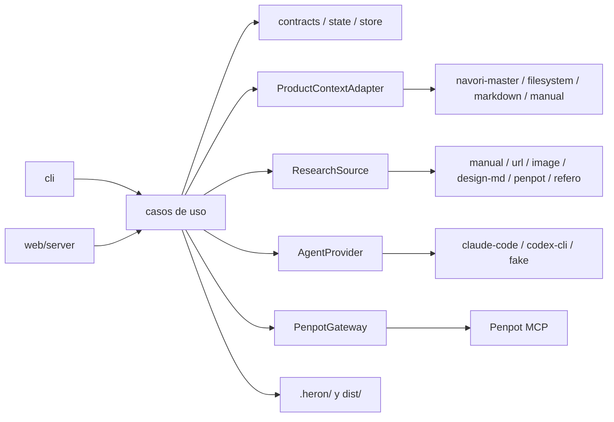

# MASTER — Navori Heron (etapa 01-heron)

## Metadatos

- Proyecto: `navori-heron`
- Etapa: `01-heron`
- Fecha: 2026-09-30
- Modo: `template` (greenfield sin template; el stack se decidió en este plan)
- Archivos de `context/md/` consolidados: `context/md/PLAN.md`
- Planes consolidados: `plans/plan1.md` (tiempo a valor), `plans/plan2.md` (solidez), `plans/plan3.md` (reuso del ecosistema)
- Decisiones aplicadas: `DECISIONS.md` D1–D27
- Evidencia externa usada por los planes: `UlisesCm/navori-harness` `origin/main` 44afd638 y rama local `feat/master-plan-ux-contract` (f16638bc + cambios sin commitear); `UlisesCm/monorepo-fullstack` `origin/main` e24995a; docs oficiales de Penpot, Penpot MCP, W3C DTCG 2025.10, WCAG 2.2, Refero, Bun, Zod, Claude Code y Codex, consultados 2026-09-30.

Origen: plan1, plan2, plan3, D1–D26

## Resumen ejecutivo

Navori Heron es una herramienta independiente y autohospedable (CLI + Web UI) que convierte el modelo funcional de un producto —idealmente un master-plan de Navori Harness con `UX.md` + `ux.json`— en un contrato de diseño neutral y versionado: research con provenance, dirección visual, foundations, tokens W3C DTCG, componentes, patterns, pantallas con estados, validación determinista y un export portable que cualquier stack consume sin instalar Heron. Penpot self-hosted es la representación editable, nunca la fuente de verdad (context/md/PLAN.md §intro, §1, §30, §44–§47).

El invariante central es dual: sin `UX.md` + `ux.json` válidos Heron trabaja en `reference-only` (research, referencias y direcciones visuales) y bloquea toda operación de producción; con ambos válidos habilita el pipeline `full` (context/md/PLAN.md §3, §76).

Hallazgo que ordena el plan: hoy ningún proyecto real puede entrar en `full`. El contrato `UX.md`/`ux.json` lo define navori-harness y se está construyendo ahora (D2), pero todavía no está en `origin/main` ni tiene schema de contenido, y el primer consumidor (`monorepo-fullstack`) no tiene master-plan. Los tres planes lo verificaron por separado.

Origen: plan1, plan2, plan3, D2

## Alcance (MoSCoW)

**Must**
- M1. `heron init [ruta] [--stage <NN-slug>] [--json]`: detecta el master-plan Navori, reporta presencia de sus artefactos, decide el modo y persiste `.heron/`, con la salida de context/md/PLAN.md §"Resultado esperado". (plan1 M1, plan2 M1, plan3 M1)
- M2. Modos `full` / `reference-only` con bloqueo verificado de producción en `reference-only`. (plan1 M4, plan2 M2, plan3 M1)
- M3. Contratos Zod versionados con JSON Schema generado, versionado en el repo y copiado en cada export. (plan2 M2, plan3 M2)
- M4. `ProductContext` v1 con adapters `navori-master`, `filesystem`, `markdown`, `manual`; precedencia de fuentes y `CONFLICT`. (plan1 M5, plan2 M3, plan3 M3)
- M5. Máquina de estados explícita con precondiciones verificables y gates humanos atados a hashes de artefactos. (plan2 M4)
- M6. Persistencia `.heron/` apta para Git: escritura atómica, lock de un escritor, recuperación tras caída. (plan2 M5)
- M7. Primitivas de seguridad: rutas seguras, SSRF, saneo de imágenes, contenido externo como dato, redacción de secretos. (plan1 M3, plan2 M6, plan3 M11)
- M8. `AgentProvider` con adapters `claude-code`, `codex-cli` y `fake`; roles configurables creator → reviewer; context packs; salida validada por schema; provenance por invocación. (plan1 M9, plan2 M7, plan3 M4)
- M9. Research con `ResearchSource` y provenance completa; salida `reference-only` de §69; brand intake con origen por dato. (plan1 M3, plan2 M8–M9, plan3 M5)
- M10. 3 propuestas de dirección visual revisables en Penpot antes de generar el sistema (specimen por dirección; en `full`, más 2 pantallas representativas) (D23–D26). En `full`: gate de dirección; foundations de 14 áreas; tokens DTCG 2025.10 en capas con light/dark; `DESIGN.md`; componentes y patterns derivados de `ux.json`; todas las pantallas con estados. (plan1 M6, plan2 M10–M12, plan3 M6)
- M11. Los 14 validadores de §28, coverage de §29 y quality gates PASS/WARNING/FAIL por las 11 categorías de §68. (plan1 M6, plan2 M13, plan3 M7)
- M12. `heron export` a `dist/` con manifest §46, checksums sha256, JSON Schemas incluidos y salida reproducible byte a byte. (plan1 M6, plan2 M14, plan3 M9)
- M13. `heron revise` con registro y preservación; `UX-PROPOSAL`. (plan1 M8, plan2 M15, plan3 M10)
- M14. Penpot self-hosted desde el compose oficial fijado + MCP oficial: `doctor` con falla rápida, `inspect` de solo lectura y `sync` determinista e idempotente. (plan1 M7, plan2 M16, plan3 M8)
- M15. Web UI de control plane con las vistas de §39 y la comparación de §40, con autenticación. (plan1 M10, plan2 M17, plan3 M12)
- M16. `docker compose up` de Heron, separado de Penpot; los 11 documentos de §74; fixtures E2E `membership-product` y `no-ux` (+ variantes de inconsistencia). (plan1 M11, plan2 M18–M20, plan3 M12–M13)

**Should**
- S1. Refero / Refero Styles como fuente opcional en P10, solo con plan de pago y términos verificados. (plan1 S1, plan2 S2, plan3 S1, D13)
- S2. Preview HTML estático, no editable, de foundations y pantallas para revisar gates antes de Penpot. (plan1 S2, plan3 P4)
- S3. Página "References" en Penpot para `reference-only` (§69). (plan2 S7, plan3 S4)
- S4. Diseño Penpot existente como `ResearchSource`. (plan1 S3, plan2 C2)
- S5. `heron run` que avanza hasta el siguiente gate y nunca aprueba. (plan2 S4)

**Could**
- C1. `heron run --auto`, desactivado por defecto. (plan1 C1, plan3 C1)
- C2. `docs/deployment/railway.md` una vez que el self-host Docker pase sus criterios (§65). (los tres)
- C3. Binario único del CLI con `bun build --compile`; V1 se instala con `bun link` desde un clon. (plan1 C3, plan3 S5, D20)
- C4. Frontmatter de `DESIGN.md` compatible con `@google/design.md` (alpha). (plan3 S2–S3)
- C5. Proveedores por API directa detrás de `AgentProvider`. (plan2 C1)

**Won't (esta etapa)**
- W1. SaaS multi-tenant (§34).
- W2. Themes/configs/componentes de implementación: Mantine, Unistyles, Tailwind, React, React Native (§47).
- W3. LangChain, LangGraph, Temporal, Kafka, Redis propio, base vectorial, base de datos propia de Heron sin necesidad demostrada (§60, §62).
- W4. Fork de Penpot, escritura en su DB o en el formato `.penpot` (§31, §32).
- W5. Importar automáticamente ediciones hechas en Penpot: solo se reportan como drift. (plan2 W6, plan3 W9)
- W6. Un LLM que escriba código libre para Penpot. (plan2 W8, plan3 decisión 2)
- W7. Adapters de contexto Jira, Notion, Linear o GitHub (§4).
- W8. Control de versiones propio (§59).
- W9. Gestión de usuarios, OAuth o SSO propios de Heron. (plan3 W8)
- W10. Pasos de IA dentro del contenedor self-host: en V1 la IA corre en el host. (D10)
- W11. Paquete npm publicado del CLI. (D20)

Origen: plan1, plan2, plan3, D10, D13, D20

## Actores y permisos

V1 tiene un solo rol autorizado; la identidad de quien aprueba queda registrada en cada gate: usuario del sistema en la CLI y nombre del token en la web (context/md/PLAN.md §34; D11).

| Actor | Puede | No puede |
|---|---|---|
| Diseñador / product owner (operador de Heron) | Correr CLI y Web UI; registrar referencias y brand inputs; aprobar o rechazar gates; reconocer `CONFLICT`; seleccionar dirección; aceptar/rechazar `UX-PROPOSAL`; pedir `revise`; exportar | Saltarse la guarda de modo; exportar con FAIL; modificar el `ux.json` fuente; aprobar un gate sin identidad registrada |
| Cliente del producto diseñado | Aportar marca, preferencias y referencias a través del diseñador (origen `provided`) | Acceder directamente a Heron en V1 |
| Operador self-host | Desplegar Heron y Penpot; gestionar secretos por variable de entorno o `*_FILE`; backups y upgrades | Ver secretos en logs o artefactos; compartir la DB de Penpot con Heron |
| Agentes IA (roles de §50 vía `AgentProvider`) | Devolver JSON que cumpla el schema de su tarea a partir de un context pack | Ejecutar herramientas, leer o escribir archivos, hacer fetch propio, cambiar estado, aprobar gates, ver secretos |
| Repo consumidor (p. ej. `monorepo-fullstack`) | Leer `dist/` y validarlo con los JSON Schemas incluidos sin instalar Heron | Recibir artefactos de framework; escribir en `.heron/` |
| Navori Harness (fuente) | Ser leído (`navori.config.json`, `specs/_master/**`) | Ser escrito por Heron; ser dependencia de runtime |
| Penpot (canvas) | Recibir escrituras deterministas vía MCP; ser inspeccionado | Ser fuente de verdad; ser accedido por DB |

Origen: plan1, plan2, plan3, D11

## Reglas de negocio

- **RN-1** Heron no depende de Navori Harness en runtime: no importa `navori`/`@navori/*` ni invoca su CLI; la integración es un adapter que reimplementa lectores tolerantes. Fuente: context/md/PLAN.md §1, §75.1–§75.2.
- **RN-2** `full` solo si `UX.md` y `ux.json` existen y son válidos. Fuente: context/md/PLAN.md §3, §75.11.
- **RN-3** Si faltan ambos: `reference-only`. Quedan bloqueados inventario, journeys y flows definitivos, design/component system de producción, tokens finales, pantallas finales, Penpot de producción y export de producción. Fuente: context/md/PLAN.md §3, §69.
- **RN-4** Si existe solo uno: informar la inconsistencia, no inferir el faltante, caer en `reference-only`, permitir research y bloquear producción. Fuente: context/md/PLAN.md §3.
- **RN-5** Todo output de `reference-only` queda marcado `reference-only`. Fuente: context/md/PLAN.md §3, §69.
- **RN-6** Heron no redefine `UX.md`/`ux.json` y conserva sus IDs estables. Fuente: context/md/PLAN.md §2; D2.
- **RN-7** Precedencia: DECISIONS.md > MASTER.md > parts.json > ux.json > UX.md > DIGEST.md > CODEBASE.md > contexto convertido > inferencia. Una contradicción produce `CONFLICT` con archivos, valores e impacto, sin elegir en silencio. Fuente: context/md/PLAN.md §6.
- **RN-8** Un `CONFLICT` abierto bloquea la aprobación del gate `intake` hasta que el humano lo reconozca con nota; la resolución de fondo vive en el master-plan. Fuente: plan2 RF-5, plan3 RN-6 (derivado de context/md/PLAN.md §6).
- **RN-9** Heron preserva reglas de negocio, roles, permisos, requisitos, decisiones explícitas, capacidades, pantallas requeridas, estados críticos, flows obligatorios y restricciones de dominio. Fuente: context/md/PLAN.md §15.
- **RN-10** Toda modificación significativa sobre `ux.json` es un `UX-PROPOSAL` (original, propuesta, razón, requisitos preservados, impacto); la fuente nunca se modifica. Fuente: context/md/PLAN.md §16. "Significativa" = cualquier cambio en pantallas, flows, estados, acciones o navegación; el naming solo visual no cuenta (D16).
- **RN-11** Cada referencia registra source, URL/origen, fecha de captura, razón, qué se estudia, qué no se copia y qué decisiones influye; las imágenes guardan crop/focus y notas. Sin alguno de esos campos es inválida. Fuente: context/md/PLAN.md §9, §57.
- **RN-12** Las referencias son evidencia, no templates: no se copian interfaces ni se mezclan colores matemáticamente. Fuente: context/md/PLAN.md §9, §10, §75.12.
- **RN-13** El research parte del trabajo de la interfaz; una consulta sin faceta de §8 se rechaza. Fuente: context/md/PLAN.md §8.
- **RN-14** Cada brand input registra origen `provided` / `derived` / `inferred` / `reference-derived`; una inferencia nunca se presenta como decisión del cliente. Fuente: context/md/PLAN.md §12, §75.14.
- **RN-15** Un color de marca inutilizable para una función genera una variante que preserva hue, carácter e identidad, y se registra la decisión. Fuente: context/md/PLAN.md §13.
- **RN-16** En `full` se generan exactamente 3 direcciones con 13 atributos y foundations no arranca sin selección humana. Fuente: context/md/PLAN.md §11. En `reference-only`, `direction select` registra `preferred` (nunca `direction-selected`); al pasar a `full` se hereda como insumo y exige un gate `direction` nuevo (D12). Cada dirección trae una propuesta visual (paleta con contraste, escala tipográfica, hoja de componentes y composición SYNTHETIC; en `full`, más 2 pantallas representativas de `ux.json` con tokens provisionales) y las 3 se revisan lado a lado en Penpot antes de elegir (D23, D24).
- **RN-17** Tokens DTCG en capas primitive → semantic → component; component tokens solo si aportan valor; semántica mínima y estados de §19. Fuente: context/md/PLAN.md §18, §19.
- **RN-18** `DESIGN.md` explica cómo y por qué usar los valores; no copia `UX.md`. Fuente: context/md/PLAN.md §20.
- **RN-19** Los anti-patterns de §21 exigen justificación registrada; sin ella son WARNING. Fuente: context/md/PLAN.md §21.
- **RN-20** Componentes derivados de `ux.json`, patterns y pantallas; patterns ligados a las pantallas que los usan. Fuente: context/md/PLAN.md §22, §23.
- **RN-21** En `full` se diseñan todas las pantallas de `ux.json`: primero un set representativo con gate, luego el resto; cada pantalla conserva campos heredados, agrega los de Heron y cubre sus estados relevantes. Fuente: context/md/PLAN.md §24–§26.
- **RN-22** Accesibilidad y calidad como findings PASS/WARNING/FAIL con evidencia, sin score 0–100. Fuente: context/md/PLAN.md §27, §68.
- **RN-23** Penpot y Refero no son fuente de verdad. Fuente: context/md/PLAN.md §30, §75.3, §75.4.
- **RN-24** Penpot desde el deployment oficial, sin fork, con versión estable fijada (nunca `latest`) y actualizable por configuración; integración solo por MCP. Fuente: context/md/PLAN.md §31, §32, §64.
- **RN-25** Los requisitos interactivos del MCP (archivo activo, plugin, MCP key) se detectan y fallan rápido con instrucción. Fuente: context/md/PLAN.md §33.
- **RN-26** Gates humanos por default; `run --auto` no es el comportamiento inicial. Fuente: context/md/PLAN.md §41.
- **RN-27** Workflow como máquina de estados explícita con precondiciones verificables. Fuente: context/md/PLAN.md §42.
- **RN-28** Una aprobación de gate queda atada a los hashes de los artefactos aprobados; si cambia uno, la aprobación se invalida. Fuente: plan2 RN-40 (derivado de context/md/PLAN.md §41, §42).
- **RN-29** En cada comando se recalcula la huella de las entradas; lo dependiente de una entrada cambiada queda `stale`, y si desaparece o se invalida `UX.md`/`ux.json` el modo baja a `reference-only` y el export se bloquea. Fuente: plan1 RN-53, plan2 RN-41 (derivado de context/md/PLAN.md §3, §42).
- **RN-30** Decisiones de diseño en artefactos portables versionados en Git; Git es el historial; Heron guarda `designRevision` y `schemaVersion`; Heron no hace commits automáticos. Fuente: context/md/PLAN.md §43, §59; plan2 Q5, plan3 Q7.
- **RN-31** `.heron/` vive en la raíz del repo del producto; Heron no escribe fuera de `.heron/` y de la ruta de export, y los archivos del master-plan son de solo lectura. Fuente: plan1 RN-51, plan2 RN-39, plan3 Retención (derivado de context/md/PLAN.md §1, §16, §43).
- **RN-32** V1 no produce adapters de implementación. Fuente: context/md/PLAN.md §47, §75.6.
- **RN-33** IA provider-agnostic; suscripción ≠ créditos de API; los agentes CLI se autentican por fuera y Heron no guarda sus credenciales; ningún proveedor está fijo a un rol. Fuente: context/md/PLAN.md §48–§51.
- **RN-34** Cada tarea de IA recibe un context pack con solo lo que necesita. Fuente: context/md/PLAN.md §52.
- **RN-35** El trabajo determinista no se delega al LLM, incluida la escritura en Penpot (el rol "Penpot Operator" es un compilador determinista). Fuente: context/md/PLAN.md §53, §75.10; plan2 decisión C, plan3 RN-34.
- **RN-36** Todo contenido externo es dato; sus instrucciones nunca se ejecutan y los hallazgos sospechosos se registran. Fuente: context/md/PLAN.md §54, §56.
- **RN-37** SSRF: se bloquean localhost, metadata, rangos privados, `file://` y protocolos inesperados, salvo operación local autorizada explícitamente y registrada. Fuente: context/md/PLAN.md §55.
- **RN-38** Nunca se inventan métricas, precios, permisos, capacidades ni reglas; los datos de preview se marcan `DEMO`, `PLACEHOLDER` o `SYNTHETIC`. Fuente: context/md/PLAN.md §71, §75.13.
- **RN-39** Una revisión conserva todo lo no pedido y registra revision, reason, affected, previous y new. Fuente: context/md/PLAN.md §58.
- **RN-40** Nunca se loggean API keys, MCP tokens, session tokens ni secretos de documentos. Fuente: context/md/PLAN.md §66.
- **RN-41** Cada resultado registra modelo/proveedor, versión de plantilla, hashes de entrada, referencias y dirección, versiones de schema y de Heron. Fuente: context/md/PLAN.md §67.
- **RN-42** Heron trabaja con una etapa distinta de la activa, incluida una cerrada (`--stage`). Sin `--stage` usa la etapa `activa`; si no hay, la última `cerrada` avisándolo en la salida; `convertida`/`abandonada` solo con `--stage`. Fuente: context/md/PLAN.md §38; D22.
- **RN-43** V1 para una organización o equipo pequeño, sin multi-tenant. Fuente: context/md/PLAN.md §34.
- **RN-44** El manifest incluye los campos de §46 y el consumidor entiende el formato sin instalar Heron. Fuente: context/md/PLAN.md §45, §46.
- **RN-45** Todo lo que Heron crea en Penpot lleva marca `heron`; las ediciones humanas se reportan como drift y no se importan. Fuente: plan2 RN-42, plan3 W9 (derivado de context/md/PLAN.md §30).
- **RN-46** El lector del estado del harness es tolerante: acepta fases y modos desconocidos (p. ej. `ux`, `desde-cero`) y solo exige los campos que usa; una versión mayor desconocida de `index.json`/`ux.json` da `reference-only` con la inconsistencia nombrada. Fuente: plan1 RN-58, plan2 Contratos (lectores anticorrupción); D2.
- **RN-47** Si el harness declara `state.json.ux = "md"` (solo `UX.md`), Heron queda en `reference-only`, muestra la declaración y no usa `UX.md` de forma parcial; si la declaración no coincide con los archivos emite `UX_DECLARATION_MISMATCH` y fuerza `reference-only` hasta que coincidan (D27). Fuente: context/md/PLAN.md §3; D6, D27.
- **RN-48** La salida de CLI y Web UI va en inglés; los artefactos generados (`DESIGN.md`, `REFERENCES.md`, notas de pantalla) van en el idioma del producto consumido; los docs del repo de Heron en español. Fuente: D14.
- **RN-49** En `full`, el gate `direction` exige Penpot: sin Penpot configurado o con su `doctor` en FAIL, la aprobación sale con código 3 y `PENPOT_REQUIRED_FOR_DIRECTION`. Exportar sin sincronizar el sistema completo en Penpot sigue permitido (D8) solo si la dirección se eligió en Penpot. En `reference-only`, registrar `preferred` no exige Penpot. Fuente: D26.

Origen: plan1, plan2, plan3, D2, D6, D12, D14, D16, D22, D23, D24, D26

## Requisitos funcionales

**Intake y modo**
- **RF-1** `heron init [ruta] [--stage] [--json] [--dry-run]` lee `navori.config.json` (`sdd.specsDir`, default `specs`), `_master/index.json` y la etapa; reporta ✓/`missing` de MASTER.md, DECISIONS.md, parts.json, UX.md, ux.json, DIGEST.md y CODEBASE.md; imprime modo, surfaces y conteos de pantallas, flows y patterns; escribe `.heron/`. `--dry-run` no escribe. (plan1 RF-1, plan2 RF-1, plan3 RF-1)
- **RF-2** `--stage` acepta cualquier etapa de `index.json`; una inexistente sale con error y lista las disponibles. (los tres)
- **RF-3** `heron status [--json]`: modo, etapa, conteos, fase, gates pendientes, artefactos `stale`, `CONFLICT` abiertos y comandos permitidos. (los tres)
- **RF-4** `heron doctor [--json] [--deep]`: checks PASS/WARNING/FAIL con remedio y timeout propio; crece por parte (base, agentes, Penpot, Refero). (los tres)
- **RF-5** `heron intake [--refresh]` construye `ProductContext` v1 con `sourceRef` por elemento y registra `CONFLICT`; `heron conflicts list|ack`. `--refresh` se acepta sin efecto: toda corrida relee las fuentes (D32). (plan1 RF-12, plan2 RF-4/RF-5, plan3 RF-5)
- **RF-6** Bloqueo: todo comando o transición de producción en `reference-only` sale con código 3 nombrando el archivo UX faltante o inválido y sin escribir. (plan1 RF-4, plan2 M2)

**Estado**
- **RF-7** `heron gate <gate> approve|reject [--note] [--reason]` registra identidad, fecha y hashes; en CLI exige TTY o `--yes`. (plan1 RF-11, plan2 RF-10, plan3 RF-9 y Seguridad)

**Research**
- **RF-8** `heron references add|list|show|compare|remove` con fuentes `manual`, `url`, `image` (local o screenshot) y `design-md`; exige provenance; `--crop x,y,w,h` con nota; importación por lote JSON. (plan1 RF-5, plan2 RF-21/RF-23, plan3 RF-7)
- **RF-9** `heron brand add --kind <11 tipos de §12> --origin <origen>`. (plan1 RF-6, plan2 RF-24)
- **RF-10** `heron research render` genera `REFERENCES.md` (derivado de JSON), `references.json`, `provenance.json`, `visual-directions.json` y moodboard HTML estático, marcados con el modo. (los tres)
- **RF-11** `heron research brief|analyze`: consultas por faceta y notas del agente con origen `inferred`, sin sobrescribir campos humanos. (plan1 RF-8/RF-9, plan3 RF-6)
- **RF-12** `heron direction propose|select <DIR-x>`; `propose` produce la propuesta visual de cada dirección y `heron penpot sync --proposals` escribe una página por dirección en Penpot. (los tres, D23–D25)

**Diseño `full`**
- **RF-13** `heron foundations`: 14 áreas, tokens DTCG, `DESIGN.md`. (los tres)
- **RF-14** `heron system`: componentes y patterns derivados con trazabilidad. (los tres)
- **RF-15** `heron screens [--representative|--all|--screen <id>]`: `ScreenDesign` con campos heredados, campos Heron, `layout` neutral y estados, más un `.md` legible por pantalla. (plan1 RF-15, plan2 RF-40, plan3 RF-12)
- **RF-16** `heron validate [--category] [--json]`: 14 validadores, coverage §29 y findings por categoría. (los tres)
- **RF-17** `heron export [--out]` (solo `full`, 0 FAIL): `dist/` con manifest, checksums y schemas. (los tres)
- **RF-18** `heron revise "<instrucción>" [--scope]` y `heron proposals list|accept|reject`. (los tres)
- **RF-19** `heron run`: avanza hasta el siguiente gate y nunca aprueba. (plan1 RF-20, plan2 RF-43, plan3 RF-18)

**Penpot**
- **RF-20** `heron penpot doctor|inspect|sync [--dry-run]`: `inspect` solo lectura; `sync` compila contratos a scripts deterministas, idempotente por marca `heron`, verifica `fileId`, reporta drift. (los tres)

**Web y operación**
- **RF-21** `heron web` / servidor: vistas de §39, comparación de §40, acciones que llaman a los mismos casos de uso que la CLI. (los tres)
- **RF-22** `docker compose up` levanta solo Heron; Penpot en proyecto compose separado. (los tres)
- **RF-23** Fuente de research `refero` sobre el MCP oficial, opcional (P10). (los tres, D13)

Origen: plan1, plan2, plan3, D13, D32

## Requisitos no funcionales

| Id | Requisito | Medida | Umbral | Origen |
|---|---|---|---|---|
| RNF-1 | Latencia de `init`/`status` | p95 sobre `membership-product`, 20 ejecuciones | ≤ 2 000 ms | plan2 RNF-2, plan3 RNF-1, D16 |
| RNF-2 | Export reproducible | Dos exports con mismas entradas y `SOURCE_DATE_EPOCH` | 100 % de bytes idénticos | los tres |
| RNF-3 | Consistencia ante caída | Fallo inyectado en cada punto de escritura | 0 `state.json` inválidos; 0 artefactos referenciados faltantes | plan2 RNF-3, plan3 RNF-9 |
| RNF-4 | Concurrencia | Segundo escritor | Código 6 en ≤ 1 s | plan1 RNF-11 |
| RNF-5 | Falla rápida de integraciones | Duración de cada check de Penpot/MCP/agentes/Refero | ≤ 10 s por check, ≤ 30 s `doctor` total; 0 llamadas externas sin timeout | plan2 RNF-4, plan3 RNF-3 |
| RNF-6 | Timeout de agente | Por invocación | 600 s default configurable; kill ≤ 5 s tras vencer; ≤ 2 reintentos de reparación | plan2 RNF-5, plan3 RNF-4 |
| RNF-7 | Secretos | Canarios en logs, run records, `.heron/`, `dist/` | 0 ocurrencias | los tres |
| RNF-8 | Cobertura de tests | `bun test --coverage` | ≥ 90 % en contratos, dominio y seguridad; ≥ 80 % global | plan2 RNF-7, plan3 RNF-7 |
| RNF-9 | Accesibilidad del output | Pares semánticos y targets | Texto ≥ 4.5:1; texto grande, UI y foco ≥ 3:1 (WCAG 2.2 SC 1.4.3, 1.4.11); target ≥ 24×24 CSS px web (SC 2.5.8); ≥ 44×44 pt mobile | los tres, D16 |
| RNF-10 | SSRF | Corpus de vectores | 100 % bloqueado, incl. redirects y rebinding | los tres |
| RNF-11 | Imágenes | Tamaño, píxeles, metadata | ≤ 20 MB y ≤ 50 MP por archivo; 0 bloques EXIF/XMP/GPS tras importar; re-encode a WebP y dedupe por sha256 | plan1 RNF-7, plan2 RNF-11, plan3 RNF-15, D15, D16 |
| RNF-12 | Context pack | Caracteres por invocación | ≤ 120 000 default configurable; recorte determinista con WARNING | plan3 RNF-11 |
| RNF-13 | Versionado | JSON persistidos | 100 % con `schemaVersion`; versión mayor desconocida falla nombrando la soportada | los tres |
| RNF-14 | Observabilidad | Comandos e invocaciones de agente | 100 % con `runId`, duración y resultado; invocaciones con los campos de RN-41 | los tres |
| RNF-15 | Dependencias | Directas de runtime | Solo las de "Stack y librerías"; agregar una exige ADR | plan1 RNF-5, plan2 RNF-17, plan3 RNF-5 |
| RNF-16 | Portabilidad del export | JSON de `dist/` | 100 % valida con ajv contra `dist/schemas/` sin código de Heron | los tres |
| RNF-17 | Arranque self-host | `docker compose up -d` a `/healthz` 200, imagen construida | ≤ 120 s | plan2 RNF-9, plan3 RNF-12 |
| RNF-18 | Upgrade de Penpot | Archivos tocados | 1 variable (`PENPOT_VERSION`) + re-fetch; 0 archivos upstream modificados (checksum) | plan3 RNF-13 |
| RNF-19 | Tipado | `any` sin `// any justified:` | 0, verificado por oxlint en el quality gate | plan1 RNF-19, CLAUDE.md |
| RNF-20 | Portabilidad del núcleo | Referencias a `Bun`/`bun:` en contratos y dominio | 0 | plan2 RNF-18 |

Origen: plan1, plan2, plan3, D15, D16

## Dominio y datos

Todas las entidades son JSON con `schemaVersion` y serialización canónica (claves ordenadas, LF final) bajo `.heron/`.

| Entidad | Archivo | Relaciones y ciclo de vida |
|---|---|---|
| HeronProject | `project.json` | Fuente (adapter, etapa), config de Penpot (`enabled`, `url` sin token, `fileId`, versión), perfiles de proveedor por rol |
| HeronState | `state.json` | `stateRevision` monotónico, modo, fase, `gates[]` (quién, cuándo, hashes), `stale[]`, `history[]`, `designRevision`; punto de commit de cada comando |
| DetectionReport / ModeDecision | `intake/mode.json` | Presencia, validez y sha256 de cada entrada; razones del modo |
| ProductContext v1 | `intake/product-context.json` | 19 bloques de §5, `sourceRef` por elemento; se regenera en `intake` |
| Conflict | `intake/conflicts.json` | `CONFLICT-n`, archivos, valores, impacto, `ack` humano |
| BrandInput | `brand/brand.json` + `brand/assets/<sha256>` | Origen RN-14 |
| ResearchReference | `research/references.json` + `provenance.json` + `research/assets/` | Provenance RN-11, crops, `agentNotes` (`inferred`), `securityFindings`, `influences` |
| VisualDirection | `research/visual-directions.json` | `DIR-A..C`, 13 atributos, referencias, estado |
| Foundations | `design/foundations/<área>.json` | 14 áreas |
| TokenDocument / ResolverDocument | `design/tokens/*.tokens.json`, `heron.resolver.json`, `themes/{light,dark}.tokens.json` | DTCG 2025.10; primitive ← semantic ← component |
| DesignSystem, Component, Pattern | `design/design-system.json`, `components/`, `patterns/` | `CMP-<Name>`; patterns con IDs de `ux.json`; huérfanos = FAIL |
| ScreenDesign | `design/screens/<id>.json` + `.md` | Campos §25, `layout` neutral, estados §26 |
| UxProposal, Revision, Decision | `decisions/` | Inmutables salvo estado de la propuesta |
| ValidationReport, Finding | `validation/report.json`, `REPORT.md` | Categoría §68, regla, severidad, evidencia |
| AgentRun | `runs/<runId>.json` | Campos RN-41; transcripciones crudas no se guardan por default |
| PenpotSyncState | `penpot/sync-state.json` | Mapa id Heron → id Penpot con hash |
| Manifest | `dist/manifest.json` | Campos §46 + `uxContractVersion`, `designRevision`, resumen de validación, estado Penpot |

**Máquina de estados** (fases persistidas solo estables; los estados "en curso" viven como runs en el journal, plan2):

| # | Hacia | Precondición verificable |
|---|---|---|
| 1 | `initialized` | `project.json` y `state.json` válidos |
| 2 | `intake-ready` | `ProductContext` válido; 0 `CONFLICT` sin reconocer; gate `intake` |
| 3 | `research-ready` | ≥ 5 referencias con provenance completa (D16); gate `research` |
| 4 | `directions-ready` | 3 direcciones válidas que citan referencias existentes; terminal en `reference-only` |
| 5 | `direction-selected` | `mode = full`; las 3 propuestas escritas en Penpot; gate `direction` (exige Penpot, D26) |
| 6 | `foundations-ready` | 14 áreas; 0 FAIL en tokens y accesibilidad; gate `foundations` |
| 7 | `representative-screens-ready` | Cubre categorías de §24 presentes; gate `representative-screens` |
| 8 | `system-ready` | 0 componentes huérfanos; cada pattern con ≥ 1 pantalla |
| 9 | `screens-ready` | 100 % de pantallas de `ux.json` |
| 10 | `penpot-synced` | Sync sin errores, `fileId` correcto, drift 0; gate `visual-review`. Con `penpot.enabled = false` se omite, queda registrado en `project.json` y en el manifest (`penpot: "disabled"`) y la categoría Penpot sync da WARNING (D8) |
| 11 | `validated` | 0 FAIL en las 11 categorías |
| 12 | `exported` | Manifest y checksums verificados |

Toda transición desde la #5 exige `mode = full`; `revise` y el rechazo de un gate regresan a la fase más temprana afectada y marcan `stale` lo posterior; cualquier par (fase, evento) fuera de la tabla se rechaza con razón nombrada.

**Retención:** `.heron/**` en Git salvo `cache/`, `logs/`, `runs/` crudos, `staging/`, `penpot/snapshots/` y `.lock`; logs locales 30 días (D16); originales de uploads no se retienen, solo la versión saneada; baja lógica de referencias y brand inputs.

Origen: plan1, plan2, plan3, D8, D16

## Arquitectura

**Decisiones consolidadas (coinciden los tres planes o una opción es superior con evidencia):**

1. **Frontera de IA.** Agentes CLI externos como proceso hijo en un `cwd` temporal vacío, sin herramientas (`--tools ""` / `--sandbox read-only`), sin MCP salvo los permitidos (`--strict-mcp-config`), sin persistencia de sesión y con salida forzada a un JSON Schema generado desde Zod que Heron revalida. Nunca `--bare`: no lee OAuth y rompería la suscripción. (plan1 C.1, plan2 D.1, plan3 decisión 1)
2. **Escritura en Penpot.** Compilador determinista: contratos → plan de operaciones → scripts de plantillas versionadas con datos solo como literal JSON, ejecutados por `execute_code`; idempotente por marca `heron`. (plan1 D.1, plan2 C.2, plan3 decisión 2)
3. **Topología de Penpot.** Proyecto compose separado con el `docker-compose.yaml` oficial sin editar, descargado del tag fijado y verificado por sha256, más `compose.override.yaml` propio (secretos, flags de producción, `enable-mcp`, sin `mailcatch`); instancia externa soportada por URL. (plan2 F.2, plan3 mapa de reuso; plan1 compatible)
4. **Persistencia.** Filesystem + Git: JSON canónico versionado, escritura atómica (tmp + fsync + rename), staging por run, lock de un escritor con reclamo de lock vencido, `state.json` como punto de commit. Sin base de datos en V1: como la IA corre solo en el host (D10), el servidor no necesita cola de jobs ni SQLite. (plan1 B.1, plan2 B.1, D10)
5. **Temas.** DTCG 2025.10 Resolver + archivos `light`/`dark` pre-resueltos para consumidores sin soporte de resolver. (plan2 R7, plan3 decisión 3)
6. **Separación determinista / IA** de §53: schemas, estado, archivos, DTCG, contraste, coverage, grafos, IDs, manifest, checksums, export y scripts de Penpot en código; interpretación, selección, direcciones, síntesis, composición y crítica en IA. (los tres)
7. **Roles de IA.** Los 9 roles de §50 agrupados en invocaciones por tarea (Analyst, Visual Researcher, Director, Screen Designer, Reviewers); creator → reviewer por configuración, 1 ronda máxima, luego gate humano. (plan3, plan2 P6; plan1 compatible)
8. **Plantillas de prompt** versionadas en archivos (`prompts/<rol>/<tarea>@v<n>.md`) con sha256 registrado; sin prompts en el código. (los tres)
9. **Web y CLI comparten casos de uso**: ninguna lógica duplicada; mismo lock. (los tres)

**Estructura del código (D4):** un solo paquete con módulos por frontera en `src/` (`cli`, `core/contracts`, `core/state`, `core/store`, `intake`, `research`, `agents`, `design`, `tokens`, `validation`, `export`, `penpot`, `web`); se divide en paquetes solo cuando exista un segundo entregable real. Reglas: `contracts` no importa nada interno; los adapters implementan puertos y no se importan entre sí; ningún módulo importa `navori`; un test de arquitectura verifica las reglas.

**Puertos:** `ProductContextAdapter` (`detect`, `load`), `ResearchSource` (`capture`, `search?`), `AgentProvider` (`probe`, `invoke`), `PenpotGateway` (`probe`, `inspect`, `apply(plan,{dryRun})`, `exportShape`); servicios `FileStore`, `Fetcher`, `Clock` (respeta `SOURCE_DATE_EPOCH`), `IdGenerator`, `Logger`.

**Flujo de un comando:** tomar lock → recuperar staging huérfano → recalcular huella y modo → evaluar precondiciones → paso determinista o paso IA (context pack → proveedor → Zod → validadores → reviewer) → escribir en staging y promover → `state.json` con `stateRevision + 1` → journal → liberar lock.

Origen: plan1, plan2, plan3, D4, D10

## Stack y librerías

Versiones exactas, `bun.lock` versionado y `bun install --frozen-lockfile`.

| Pieza | Elección | Versión | Fuente | Origen |
|---|---|---|---|---|
| Runtime, gestor, tests, bundler | Bun | 1.4.2 | https://bun.com/blog/bun-v1.4.2 (consultado 2026-09-30) | los tres |
| Lenguaje | TypeScript | 7.0.2 | https://www.npmjs.com/package/typescript (consultado 2026-09-30) | los tres |
| Schemas | Zod (`z.toJSONSchema()`, draft 2020-12) | 4.6.5 | https://zod.dev/json-schema (consultado 2026-09-30) | los tres |
| Parser de CLI | `node:util` `parseArgs` | incluido en Bun | https://bun.com/guides/process/argv (consultado 2026-09-30) | plan1, plan2 (0 dependencias, §60; citty de plan3 descartado) |
| Tests | `bun test --coverage` | incluido | https://bun.com/docs/test/code-coverage (consultado 2026-09-30) | los tres |
| Lint / formato | oxlint / oxfmt | 1.86.0 / 0.71.0 | https://www.npmjs.com/package/oxlint (consultado 2026-09-30) | los tres |
| DTCG parse, validación y resolver | @terrazzo/parser | 2.7.1 | https://terrazzo.app/docs/reference/js-api/ (consultado 2026-09-30) | plan3 (soporte verificado de resolvers 2025.10; evita reimplementar el Resolver) |
| Color y contraste | colorjs.io | 0.7.1 | https://colorjs.io (consultado 2026-09-30) | plan3 (transitiva de Terrazzo: 0 dependencias nuevas) |
| Imágenes (re-encode sin metadata) | sharp | 0.35.5 | https://sharp.pixelplumbing.com/install (consultado 2026-09-30) | plan2, plan3 (EXIF de `Bun.Image` sin verificar en plan1) |
| Cliente MCP | @modelcontextprotocol/sdk (Streamable HTTP) | 1.31.0 | https://github.com/modelcontextprotocol/typescript-sdk (consultado 2026-09-30) | plan2, plan3 |
| Servidor web y Web UI | Hono (JSX SSR sobre Bun.serve, sin build) | 4.13.12 | https://hono.dev (consultado 2026-09-30) | plan2, D9 |
| Validador JSON Schema (solo tests) | ajv | 8.20.0 | https://www.npmjs.com/package/ajv (consultado 2026-09-30) | plan1, plan3 |
| Agente 1 (externo) | Claude Code | mínimo 2.1.259; probado 2.1.286 | https://code.claude.com/docs/en/cli-reference (consultado 2026-09-30) | los tres |
| Agente 2 (externo) | Codex CLI | mínimo 0.159.2 | https://learn.chatgpt.com/docs/non-interactive-mode (consultado 2026-09-30) | los tres |
| Penpot + MCP oficial | Imágenes `penpotapp/*` y compose oficial | 2.17.2 (sonda de 2.18.x en P6) | https://github.com/penpot/penpot/releases (consultado 2026-09-30); bug https://github.com/penpot/penpot/issues/12003 (consultado 2026-09-30) | los tres, D7 |
| Tokens (spec) | W3C DTCG Format, Color, Resolver | 2025.10 | https://www.designtokens.org/TR/2025.10/format/ (consultado 2026-09-30) | los tres |
| Accesibilidad (spec) | WCAG | 2.2 | https://www.w3.org/TR/WCAG22/ (consultado 2026-09-30) | plan2, plan3 |
| Imagen Docker | `oven/bun:1.4.2-slim` por digest | 1.4.2 | https://hub.docker.com/r/oven/bun (consultado 2026-09-30) | plan2, plan3 |

Descartadas: LangChain, LangGraph, Temporal, Kafka, Redis, base vectorial, Postgres, Style Dictionary (sus transforms son del consumidor), Agent SDKs de Anthropic/OpenAI (dos modelos de integración y auth por suscripción sin verificar), MCPs comunitarios de Penpot y Refero, citty, vitest.

Origen: plan1, plan2, plan3, D7, D9

## Contratos

- Todo documento lleva `{kind, schemaVersion}`; versión mayor desconocida falla nombrando la soportada; se lee N-1 por migraciones puras y se escribe N; rutas internas como `RelativeArtifactPath` POSIX sin `..`. (plan2)
- JSON Schemas generados con `bun run gen:schemas`, versionados en el repo con prueba de deriva (`git diff --exit-code`) y copiados a `dist/schemas/`. (plan2, plan3)
- Kinds v1: HeronProject, HeronState, ModeDecision, ProductContext, Conflict, Decision, UxProposal, Revision, BrandInput, ResearchReference, Provenance, SecurityFinding, VisualDirection, Foundations, DesignSystem, Component, Pattern, ScreenDesign (con `LayoutNode` y `StateSpec`), ValidationReport, Finding, AgentRun, PenpotSyncState, Manifest, CliEnvelope. Tokens: DTCG 2025.10 validado con Terrazzo. (los tres)
- **Lectores ajenos (anticorrupción):** `navori-master` redeclara en Zod propio `index.json` v1, `state.json` y `parts.json` del harness, tolerantes a campos extra; `UxContract` es un lector provisional (subconjunto mínimo de IDs y relaciones, preserva campos desconocidos, marcado provisional) que se reemplaza por la copia fijada por sha256 del JSON Schema que publique el harness (D5). (plan1, plan2, plan3)
- **`layout` de ScreenDesign:** árbol neutral con vocabulario cerrado V1 (`frame`, `stack`, `grid`, `component`, `text`, `image`, `slot`); propiedades como referencias a tokens; lo no soportado es WARNING, nunca se inventa. (plan1, plan2 R6)
- **CLI `--json`:** `CliEnvelope {schemaVersion, command, ok, code, data, findings[], runId, next[]}`. Códigos de salida: 0 ok; 1 error inesperado; 2 uso inválido; 3 bloqueado por modo o precondición; 4 validación con FAIL; 5 dependencia externa no disponible; 6 lock ocupado o `stateRevision` en conflicto. (plan2, con campos de plan1 y plan3)
- **API HTTP** `/api/v1` validada con Zod; cada handler llama la misma función que la CLI. (los tres)
- **Eventos de log JSONL:** `state.transition`, `gate.decided`, `agent.invocation`, `penpot.error`, `fetch.blocked`, `security.finding`, `run.interrupted`, `lock.reclaimed`, `export.written`. (plan2, plan3)
- **Export `dist/`:** `manifest.json`, `DESIGN.md`, `design-system.json`, `tokens/` (primitive, semantic, component, resolver, light, dark), `components/`, `patterns/`, `screens/`, `flows/`, `assets/`, `references/`, `provenance.json`, `validation/report.json`, `schemas/`. `generatedAt` desde `SOURCE_DATE_EPOCH`. (los tres)

Origen: plan1, plan2, plan3, D5

## Seguridad

| Amenaza | Control | Origen |
|---|---|---|
| SSRF (§55) | Solo `https` (`http` por allowlist del operador); DNS resuelto y cada IP validada (loopback, privadas, link-local, CGNAT, metadata, ULA, IPv4-mapped, formas decimal/octal/hex); conexión a la IP validada con SNI; redirects manuales revalidados; timeouts y límites de cuerpo | los tres |
| Path traversal | `realpath` confinado a la raíz; symlinks que escapan rechazados; `sdd.specsDir` ajeno como no confiable; slug de etapa validado | los tres |
| Prompt injection (§56) | Contenido externo en bloques de datos delimitados con procedencia; detector que registra `SecurityFinding`; el control real es de capacidades: agente sin herramientas y salida atada a schema | los tres |
| Configuración hostil del repo analizado | El agente nunca corre con `cwd` en el repo del producto; `--strict-mcp-config`; `--setting-sources` mínimo | los tres |
| Inyección hacia Penpot | Solo plantillas versionadas; datos como literal JSON único | los tres |
| Uploads e imágenes | Magic bytes PNG/JPEG/WebP; límites RNF-11; re-encode sin EXIF/XMP/GPS; nombre por sha256; SVG solo como logo en `` | los tres |
| Secretos | Solo por variable de entorno o `*_FILE`; nunca en `.heron/`; guarda al escribir artefactos; redacción por clave, valor cargado y parámetros `userToken`/`token`/`key`; entorno del agente filtrado (sin `HERON_*`/`PENPOT_*`) | los tres |
| Defaults inseguros de Penpot | El override elimina `change-this-insecure-key`, `disable-secure-session-cookies`, `disable-email-verification`, tags `latest` y `mailcatch` | plan2, plan3 |
| XSS / CSRF en Web UI | Escape total; CSP estricta; `SameSite=Strict` + verificación de `Origin`; escucha en 127.0.0.1 por default y se niega a exponerse sin credenciales | los tres |
| Aprobación por no humanos | Gates exigen TTY o `--yes`, o sesión autenticada en la web | plan3 |
| Cadena de suministro | Versiones exactas, lockfile congelado, `trustedDependencies` solo `sharp`, imagen base por digest, compose de Penpot por sha256 | plan2, plan3 |

Autenticación web (D11): tokens nombrados definidos por el operador (se guarda solo su sha256), cookie de sesión firmada `HttpOnly; Secure; SameSite=Strict`, nombre del token en `approvedBy`.

Origen: plan1, plan2, plan3, D11

## Infraestructura y operación

- **Entornos:** `local` (CLI desde clon o binario, donde están los agentes CLI con sesión); `docker` (`compose.yaml` solo de Heron, usuario no root, healthcheck `/healthz`); `server` (misma imagen detrás de reverse proxy con TLS). Los pasos de IA corren solo en el host donde están los CLIs con sesión; la web en Docker es control plane (D10). (los tres)
- **Penpot:** `infra/penpot/` con `fetch-compose` (tag + sha256), override y `.env.example` (`PENPOT_VERSION`, `PENPOT_PUBLIC_URI`, `PENPOT_SECRET_KEY`, `PENPOT_FLAGS` con `enable-mcp`, política de registro); proxy con websocket `/mcp/ws`; upgrades de una versión a la siguiente re-verificando sha256 y `doctor`. (los tres)
- **Backups:** `.heron/` por el remoto Git del repo del producto; volúmenes de Penpot con el procedimiento oficial (no copiar la carpeta del volumen). (los tres)
- **Quality gate:** `bun run check` = `oxfmt --check` + `oxlint` + `tsc --noEmit` + `bun test --coverage` con umbrales + deriva de `gen:schemas` + tests de arquitectura (`jscpd` y `semgrep` corren solo en el CI de los PR a `develop`, D33). CI: GitHub Actions desde P1 (D21, política de D33): PR a `develop` solo jscpd + semgrep; PR y push a `main` el gate completo (`format:check`, `lint`, `typecheck`, `test:coverage`) y `test:perf` como paso propio. Pre-commit: `bun run check:fast` (formato, lint, typecheck y los tests incluidos en el commit). (plan2, plan3)
- **Observabilidad:** logs JSONL redactados a stderr y `.heron/logs/`; journal por run; `heron status` muestra runs interrumpidos; costo solo si el proveedor lo expone (`total_cost_usd` de Claude Code es estimación del cliente). (los tres)
- **Costos:** Heron 1 contenedor; Penpot 6–7 servicios (los requisitos de hardware se toman de la doc oficial en P9); IA con las suscripciones del usuario, cuyos límites y términos de uso programático P3 verifica y registra (D18); Refero con plan de pago opcional (D13). (los tres)

Origen: plan1, plan2, plan3, D10, D18, D21

## Entrega en partes

Estructura y orden de plan1, valor primero (D3), con P11 (D19) y P12 (D25). Los IDs no indican orden: el orden lo dan las dependencias. P1 → P2 → P3 dejan `reference-only` usable sobre `monorepo-fullstack`; P12 (Penpot base) sigue a P3 para revisar en Penpot las 3 propuestas visuales (D23–D24); P4 depende solo de P1 y corre en paralelo; luego P5 (slice full, con el gate de dirección en Penpot, D26) → P6 (Penpot: sistema completo) → P7; P8 empieza al cerrar P5; P9 al final; P10 es opcional (D13); P11 depende además de que el harness emita UX en `main` (D17).

Grafo: P2 ← P1 · P3 ← P2 · P12 ← P3 · P4 ← P1 · P5 ← P3 + P4 + P12 · P6 ← P5 + P12 · P7 ← P5 + P6 · P8 ← P5 · P9 ← P6 + P8 · P10 ← P3 · P11 ← P7.

Desviaciones frente a context/md/PLAN.md §77: las fases 1–3 (research, propuesta de arquitectura, ADRs) quedan cubiertas por este plan maestro y los ADRs se escriben en la parte que toma cada decisión; los contratos se definen justo a tiempo por parte; la seguridad de ingesta llega en P2 y la de agentes en P3, no en el hardening final; Penpot va antes de generalizar para ver el slice en el canvas. (plan1)

<!-- navori:master-parts hash="867cab63" -->
### P1 — Núcleo, heron init y detección de modo

Objetivo: El usuario corre `heron init <repo>` y en ≤ 2 s sabe qué modo aplica y por qué, con estado persistido, gates atados a hashes y guard de producción probado (primer slice de context/md/PLAN.md §80).
Alcance: Scaffold de un solo paquete (D4): Bun 1.4.2, TS 7.0.2 strict, Zod 4.6.5, oxlint 1.86.0, oxfmt 0.71.0, `bun test --coverage` con umbrales, `bun run check` y test de fronteras entre módulos; Workflow de GitHub Actions con `bun install --frozen-lockfile` y el gate completo en PR y push a `main`, jscpd + semgrep en PR a `develop` (D21, D33); `core/contracts`: HeronProject, HeronState, ModeDecision, CliEnvelope; gate de versión; `gen:schemas` con prueba de deriva; `core/store`: escritura atómica, staging, lock con reclamo de lock vencido, sha256, rutas seguras; `core/state`: tabla completa de estados y transiciones, gates atados a hashes (RN-28), guard de modo, propagación de `stale`; Adapter `navori-master` en modo detección: `sdd.specsDir`, `index.json` v1, etapa activa, `--stage`, última cerrada con aviso (D22), presencia de los 7 artefactos, lectura tolerante de `state.json.ux` (D6, RN-46); Lector provisional `UxContract` (D5) y adapter `filesystem`; Comandos `init` (con `--dry-run`), `status`, `doctor` base y `gate approve|reject`, salida en inglés (D14) y `--json`; Fixtures SYNTHETIC: `no-ux`, `ux-only-md`, `ux-only-json`, `ux-invalid`, `closed-stage`, `membership-product` mínimo; `README.md` con instalación por `bun link` (D20), `docs/architecture.md` y ADR de persistencia de estado
Fuera de alcance: ProductContext completo, precedencia y CONFLICT (P4); Research (P2); Agentes (P3); Web UI; Docker
Dependencias: —
Requisitos semilla: RF-1, RF-2, RF-3, RF-4, RF-6, RF-7, RN-1, RN-2, RN-3, RN-4, RN-5, RN-6, RN-27, RN-28, RN-29, RN-30, RN-31, RN-42, RN-46, RNF-1, RNF-3, RNF-4, RNF-8, RNF-13, RNF-14, RNF-19, RNF-20
- P1.A1 (test): Con `membership-product`, la salida contiene en orden `Project detected`, `Navori Master: yes`, `Stage: 01-mvp`, `UX.md:  ✓`, `ux.json: ✓`, `FULL PRODUCT`, surfaces, `Screens:`/`Flows:`/`Patterns:` iguales a los conteos del `ux.json` del fixture y `Ready for research.`, con exit 0 — tests/e2e/init.test.ts#reports FULL PRODUCT for the membership-product fixture
- P1.A2 (test): Con `no-ux`, la salida contiene `UX.md:  missing`, `ux.json: missing`, `REFERENCE ONLY`, `Full product generation disabled.` y `Visual research is available.`, con exit 0 — tests/e2e/init.test.ts#reports REFERENCE ONLY for the no-ux fixture
- P1.A3 (test): Con `ux-only-md` y con `ux-only-json`, la salida nombra el archivo faltante, `state.json.mode = reference-only`, aparece el finding `UX_INCONSISTENT` y no se crea ningún archivo UX — tests/e2e/init.test.ts#falls back to reference-only without inferring the missing UX file
- P1.A4 (test): Con `ux-invalid`, el modo es `reference-only` y el finding `UX_CONTRACT_INVALID` lista la ruta JSON de cada issue — tests/e2e/init.test.ts#treats a schema-invalid ux.json as reference-only and lists the issues
- P1.A5 (test): `--stage` con una etapa cerrada da exit 0 y la muestra; `--stage 99-x` sale con código 2 y lista las disponibles; sin etapa activa usa la última cerrada y lo dice en la salida — tests/e2e/init.test.ts#selects stages explicitly or falls back to the last closed stage with a notice
- P1.A6 (test): En `reference-only` toda transición de producción devuelve `MODE_BLOCKED`, ningún par (fase, evento) fuera de la tabla se acepta y cada transición declara una precondición verificable — tests/unit/state-machine.test.ts#blocks production transitions in reference-only and rejects pairs outside the table
- P1.A7 (test): Una aprobación de gate se invalida cuando cambia el hash de cualquier artefacto atado — tests/unit/gates.test.ts#invalidates an approval when a bound artifact hash changes
- P1.A8 (test): Un fallo inyectado en cada punto de escritura deja `state.json` válido y ningún artefacto referenciado faltante; un segundo escritor recibe el código 6 en ≤ 1 s — tests/unit/store.test.ts#keeps a consistent state on injected failures and rejects a second writer
- P1.A9 (test): Un `schemaVersion` mayor desconocido falla con un mensaje que nombra la versión soportada — tests/unit/contracts.test.ts#rejects an unknown schemaVersion naming the supported one
- P1.A10 (test): Después de `init` y `status`, el sha256 de todo archivo del repo destino fuera de `.heron/` es idéntico al previo — tests/e2e/init.test.ts#never writes outside .heron/ in the product repo
- P1.A11 (test): Con `state.json.ux = md` la salida muestra la declaración del harness y el modo es `reference-only` con mensaje explicativo (D6); con `ux: md-json` sin `ux.json` aparece `UX_DECLARATION_MISMATCH`; fases o modos desconocidos no hacen fallar al adapter — tests/e2e/init.test.ts#reports the harness UX declaration and tolerates unknown phases and modes
- P1.A12 (test): `init` y `status` sobre `membership-product` tienen p95 ≤ 2 000 ms en 20 ejecuciones — tests/perf/init.perf.test.ts#init and status p95 under 2000 ms on membership-product
- P1.A13 (test): Ningún módulo importa `navori` ni `@navori/*`, los adapters no se importan entre sí y `core/contracts` no importa nada interno — tests/repo/boundaries.test.ts#enforces module boundaries and no navori imports
- P1.A14 (comando): Los JSON Schemas versionados están sincronizados con Zod — bun run gen:schemas && git diff --exit-code schemas/
- P1.A15 (comando): El quality gate pasa completo — bun run check
- P1.A16 (test): El workflow de CI existe: en PR a `develop` ejecuta solo jscpd y semgrep; en PR y push a `main` ejecuta `bun install --frozen-lockfile`, `format:check`, `lint`, `typecheck`, `test:coverage` y `test:perf` como paso propio (D33) — tests/repo/ci.test.ts#ci workflow runs the quality gate on pull requests and main
- P1.A17 (manual): Recorrido real de instalación y detección — Siguiendo `README.md` desde un clon limpio (instalación con `bun link`) la primera salida llega en ≤ 10 min; `heron init` sobre `monorepo-fullstack` muestra `Navori Master: no` y `REFERENCE ONLY`, y sobre `navori-heron` muestra `Stage: 01-heron` y `REFERENCE ONLY`

### P2 — Research reference-only determinista y seguro

Objetivo: El diseñador registra y revisa referencias y marca con provenance completa, sin IA, en un workspace versionable y seguro frente a contenido externo; el research de `monorepo-fullstack` queda en `.heron/research/` con un moodboard revisable en el navegador.
Alcance: Puerto `ResearchSource` y fuentes `manual`, `url`, `image` (local o screenshot) y `design-md`; `references add|list|show|compare|remove`, importación por lote JSON y crops con nota; `brand add` con origen por dato; Safe fetch anti-SSRF (DNS validado, conexión a IP validada con SNI, redirects revalidados, límites), saneo de imágenes con sharp a WebP sin metadata y dedupe por sha256 (D15), rutas seguras, detector de contenido sospechoso; `research render`: `REFERENCES.md` derivado de JSON, `references.json`, `provenance.json`, moodboard HTML estático con CSP; Estados `researching`/`research-ready` (≥ 5 referencias, D16) y gate `research`; ADR de research source boundary; `docs/research.md`; sección SSRF de `docs/security.md`
Fuera de alcance: Interpretación con IA (P3); Refero (P10); Fuente Penpot (P6); Web UI (P8)
Dependencias: P1
Requisitos semilla: RF-8, RF-9, RF-10, RF-7, RN-5, RN-11, RN-12, RN-14, RN-36, RN-37, RN-38, RN-40, RNF-7, RNF-10, RNF-11
- P2.A1 (test): `references add --source manual` guarda `source`, `origin`, `capturedAt` ISO-8601, `reason`, `studies[]`, `doNotCopy[]`, `influences[]` y `mode` — tests/e2e/references.test.ts#adds a manual reference with complete provenance
- P2.A2 (test): Una referencia sin alguno de los campos de provenance sale con código 2, nombra los faltantes y no escribe nada — tests/e2e/references.test.ts#rejects a reference missing any provenance field
- P2.A3 (test): El 100 % del corpus SSRF queda bloqueado con `SSRF_BLOCKED` (loopback v4/v6, 10/8, 172.16/12, 192.168/16, 100.64/10, 169.254.169.254, fc00::/7, fe80::/10, IPv4-mapped, formas decimal/octal/hex, `file:`, `ftp:`, `gopher:`, `data:`, redirect a IP privada, rebinding); `--allow-local` permite un destino local y queda en la provenance — tests/security/ssrf.test.ts#blocks every vector of the SSRF corpus and records explicit local allowances
- P2.A4 (test): Rutas de imagen con `..`, rutas absolutas fuera de la raíz y symlinks que escapan se rechazan — tests/security/paths.test.ts#rejects image paths and symlinks escaping the allowed roots
- P2.A5 (test): Un JPEG con GPS queda con 0 etiquetas EXIF/GPS/XMP y en WebP; magic bytes distintos de PNG/JPEG/WebP se rechazan; una imagen > 20 MB o > 50 MP se rechaza; dos imports del mismo archivo producen un solo asset — tests/security/images.test.ts#sanitizes, bounds and deduplicates imported images
- P2.A6 (test): Un DESIGN.md externo con "ignore previous instructions" se guarda como dato `untrusted` con `securityFindings` (frase y offset) y ningún comando cambia de comportamiento — tests/security/untrusted-content.test.ts#records suspicious instructions in external DESIGN.md without acting on them
- P2.A7 (test): `research render` produce las 4 salidas y cada una declara `reference-only`; el moodboard escapa `<script>` inyectado y trae CSP — tests/e2e/research-render.test.ts#renders reference-only outputs with escaped text and CSP
- P2.A8 (test): Todo brand input exige un `origin` válido; sin él sale con código 2 — tests/e2e/brand.test.ts#requires an origin for every brand input
- P2.A9 (manual): Research real de monorepo-fullstack — Con ≥ 5 referencias reales (≥ 1 screenshot con crop, ≥ 1 URL, ≥ 1 DESIGN.md externo), cada tarjeta del moodboard muestra fuente, razón, qué se estudia, qué no copiar y el crop resaltado

### P3 — Agentes y direcciones visuales reference-only

Objetivo: Heron usa Claude Code y Codex CLI ya autenticados (D18) para formular el research por trabajo de interfaz, interpretar referencias y proponer 3 direcciones exploratorias, cada una con los datos de su propuesta visual (D23); el modo reference-only de §76 queda completo sobre un repo real.
Alcance: Puerto `AgentProvider` con adapters `claude-code`, `codex-cli` y `fake`; Invocación en `cwd` temporal vacío, sin herramientas, `--strict-mcp-config`, sin persistencia de sesión, salida por JSON Schema, sin `--bare`; entorno filtrado sin `HERON_*`/`PENPOT_*`; Roles y proveedores en configuración (creator Claude, reviewer Codex por default, intercambiables); Plantillas de prompt versionadas en `prompts/` con sha256; context packs por tarea con presupuesto de 120 000 caracteres; Validación Zod con ≤ 2 reintentos de reparación; `AgentRun` con los campos de RN-41; `research brief`, `research analyze`, `direction propose`, `direction select` (registra `preferred` en reference-only, D12); Datos de propuesta visual por dirección (D23): paleta provisional con contraste calculado, escala tipográfica, hoja de componentes básicos y una composición genérica marcada SYNTHETIC, validados por schema y por contraste determinista; su render en Penpot llega en P12; Checks de agentes en `doctor` y sonda `doctor --deep`; Verificación y registro de los términos de uso programático de las suscripciones (D18); ADR de AI provider boundary; `docs/agent-providers.md`
Fuera de alcance: Direcciones en modo full con contexto UX (P5); Loop creator → reviewer sobre pantallas (P7); Proveedores por API directa
Dependencias: P2
Requisitos semilla: RF-4, RF-11, RF-12, RN-13, RN-16, RN-33, RN-34, RN-35, RN-36, RN-41, RNF-6, RNF-7, RNF-12, RNF-14
- P3.A1 (test): El binario falso `claude` recibe `-p`, `--tools ""`, `--strict-mcp-config`, `--output-format json`, `--json-schema` y `--no-session-persistence`, con cwd en un directorio temporal vacío y sin `--bare`; el falso `codex` recibe `exec --sandbox read-only --ephemeral --skip-git-repo-check --output-schema` — tests/unit/agents/argv.test.ts#invokes agent CLIs isolated, tool-less and schema-bound
- P3.A2 (test): Una salida que no cumple el schema se repara como máximo 2 veces y luego el run queda `invalid-output` sin cambiar el estado de Heron — tests/unit/agents/invoke.test.ts#retries invalid output at most twice and keeps Heron state
- P3.A3 (test): Con timeout configurado de 2 s, un agente colgado termina y el run queda `timeout` en ≤ 7 s — tests/unit/agents/timeout.test.ts#kills a hung agent at the configured timeout
- P3.A4 (test): El context pack contiene solo los tipos de artefacto de la tarea, respeta el presupuesto con recorte determinista y marca `untrusted` el contenido externo — tests/unit/agents/context-pack.test.ts#builds task-scoped packs within budget and tags untrusted items
- P3.A5 (test): El `AgentRun` registra proveedor, modelo, versión de CLI, plantilla@versión+sha256, hashes de entrada y salida, duración y costo si existe, con 0 secretos canario y entorno del hijo sin `HERON_*`/`PENPOT_*` — tests/unit/agents/run-record.test.ts#records reproducibility fields and never leaks secrets
- P3.A6 (test): El proveedor de cada rol sale solo de la configuración: intercambiar creator y reviewer no toca código — tests/unit/agents/roles.test.ts#resolves role providers from configuration
- P3.A7 (test): Con el proveedor `fake` se producen 3 direcciones con los 13 atributos de §11, marcadas `reference-only` y citando solo `REF-*` existentes; `direction select` registra `preferred` y el estado nunca llega a `direction-selected` — tests/e2e/directions.test.ts#proposes three reference-only directions and records a preferred one
- P3.A8 (test): Una consulta de research sin faceta de trabajo de interfaz (p. ej. "beautiful UI") se rechaza — tests/unit/research/brief.test.ts#rejects research queries without an interface-job facet
- P3.A9 (test): `doctor` reporta disponibilidad, versión mínima y sesión de cada agente solo por exit codes, sin leer archivos de credenciales — tests/e2e/doctor.test.ts#reports agent availability from exit codes without reading credentials
- P3.A10 (test): Cada una de las 3 direcciones trae su propuesta visual completa (paleta, escala tipográfica, hoja de componentes, composición SYNTHETIC); cada par texto/fondo de la paleta trae su contraste calculado de forma determinista y una propuesta sin esos datos se rechaza — tests/e2e/directions.test.ts#each direction carries a complete visual proposal with deterministic contrast
- P3.A11 (manual): Términos de uso de las suscripciones — `docs/agent-providers.md` registra, con URL y fecha, qué dicen los términos de Claude Max y de ChatGPT/Codex sobre invocación programática y la conclusión para Heron
- P3.A12 (manual): Research y direcciones reales — Con Claude Code y Codex reales sobre `monorepo-fullstack`, el brief formula preguntas por faceta de §8, cada dirección tiene los 13 atributos, cita ≥ 2 referencias y dice qué no copiar, y las notas del agente aparecen con origen `inferred`

### P4 — Contrato UX y ProductContext

Objetivo: Heron entiende un master-plan completo como `ProductContext` v1, aplica la precedencia de fuentes y registra `CONFLICT` sin elegir en silencio; queda listo el insumo del modo full.
Alcance: Schema `ProductContext` v1 con los 19 bloques de §5 y `sourceRef` por elemento; `UxContract` provisional (D5) aislado en el adapter, con el camino de conmutación a la copia fijada del schema del harness; Adapter `navori-master` completo: MASTER.md, DECISIONS.md, parts.json, ux.json, UX.md, DIGEST.md, CODEBASE.md y contexto convertido; Adapters `markdown` y `manual`; Precedencia RN-7 y detector determinista de `CONFLICT` (IDs, actores, roles, permisos); `conflicts list|ack`; gate `intake` bloqueado por conflictos sin reconocer; Fixture `membership-product` completo y fixture `conflict` (SYNTHETIC); ADR de canonical data model; `docs/contracts.md`; `docs/integrations/navori-harness.md`; Test e2e del camino de aprobación de gates con datos reales (pendiente de la revisión de P1/T11): `heron gate intake approve` con ProductContext válido registra `approvedBy` y hashes de artefactos y commitea solo `state.json`
Fuera de alcance: Conflictos semánticos con IA; Adapters Jira, Notion o Linear; Definir o modificar el contrato UX del harness (D2)
Dependencias: P1
Requisitos semilla: RF-5, RN-6, RN-7, RN-8, RN-9, RN-38, RN-46, RNF-13, RNF-16
- P4.A1 (test): `membership-product` produce un ProductContext v1 válido con los 19 bloques y `sourceRef` en cada elemento — tests/contracts/product-context.test.ts#maps membership-product into ProductContext v1 with its nineteen sections
- P4.A2 (test): Con el mismo dato en varias fuentes gana la de mayor precedencia de RN-7 y se registra la fuente ganadora — tests/unit/intake/precedence.test.ts#applies source precedence and records the winning source
- P4.A3 (test): Si un actor de `ux.json` contradice MASTER.md se crea `CONFLICT-001` con archivos, valores e impacto, sin elegir en silencio, y el gate `intake` no se aprueba hasta el `ack` — tests/unit/intake/precedence.test.ts#records a CONFLICT and blocks the intake gate until acknowledged
- P4.A4 (test): `filesystem` llega a full solo con UX.md y ux.json válidos; `markdown` y `manual` quedan en reference-only — tests/unit/mode.test.ts#only the filesystem and navori-master adapters can reach full
- P4.A5 (test): Los campos desconocidos de `ux.json` conservan su clave, su orden y su valor en JSON canónico, los IDs no cambian y `ux.json` nunca se reescribe (sha256 igual) (D31) — tests/contracts/ux-contract.test.ts#preserves unknown ux.json fields and stable ids
- P4.A6 (test): Los JSON Schemas emitidos validan todos los fixtures con ajv 2020-12 y todo archivo de datos de `fixtures/` declara SYNTHETIC — tests/contracts/json-schema.test.ts#emitted JSON Schemas validate every fixture and fixtures are marked SYNTHETIC
- P4.A7 (comando): Intake sobre el fixture completo — d="$(mktemp -d)" && cp -R fixtures/membership-product/. "$d" && bun run heron init "$d" >/dev/null && bun run heron intake --json "$d"
- P4.A8 (test): Con un ProductContext válido y 0 conflictos, `heron gate intake approve --yes` sale con 0, registra `approvedBy`, fecha y sha256 de los artefactos atados, avanza a `intake-ready` y solo cambia `state.json` dentro de `.heron/` — tests/e2e/gate.test.ts#approves intake with valid context, recording approvedBy, artifact hashes, and committing only state.json
- P4.A9 (manual): Contrato de integración con el harness — `docs/contracts.md` y `docs/integrations/navori-harness.md` mapean archivo → campo, el subconjunto provisional exigido de `ux.json` y la conmutación a la copia fijada, sin redefinir el contrato UX del harness

### P5 — Slice vertical full: un flow y 2–3 pantallas hasta el export neutral

Objetivo: Probar el pipeline full de punta a punta con un flow y 3 pantallas del fixture antes de generalizar; primer `dist/` neutral, validado, portable y revisable como HTML estático sin Penpot.
Alcance: Direcciones en full con contexto UX: cada propuesta suma 2 pantallas representativas de `ux.json` con sus tokens provisionales, escritas en su página de Penpot (D23, D24); gate `direction` que exige Penpot (D26); Foundations de 14 áreas; color con colorjs.io (escalas OKLCH, neutrals, roles, light/dark, variantes de marca con Δhue ≤ 10° y decisión registrada); Tokens DTCG 2025.10 en capas + Resolver + light/dark pre-resueltos, validados con @terrazzo/parser; `DESIGN.md` con las 14 secciones de §20 en el idioma del producto (D14) y anti-patterns con justificación; Componentes y patterns del slice; `ScreenDesign` con `layout` neutral, estados y `.md`; Los 14 validadores de §28 acotados al slice y categorías de §68; Preview HTML estático de foundations y pantallas; `export` con manifest, checksums, schemas y `SOURCE_DATE_EPOCH`; export sin sync completo del sistema permitido y registrado, solo si la dirección se eligió en Penpot (D8 limitado por D26); Gates `foundations` y `representative-screens`; ADR de neutral export; `docs/workflow.md`; `docs/export-format.md`
Fuera de alcance: Resto de pantallas (P7); Penpot (P6); `revise` (P7)
Dependencias: P3, P4, P12
Requisitos semilla: RF-12, RF-13, RF-14, RF-15, RF-16, RF-17, RN-15, RN-16, RN-17, RN-18, RN-19, RN-20, RN-21, RN-22, RN-32, RN-35, RN-38, RN-44, RNF-2, RNF-9, RNF-16
- P5.A1 (test): Con el proveedor `fake`, un flow y 3 pantallas de `membership-product` llegan a `exported` y `state.json` registra los gates intake, research, direction, foundations y representative-screens — tests/e2e/full-slice.test.ts#runs one flow and three screens from init to export through every gate
- P5.A2 (test): El validador DTCG detecta tipo inválido, alias roto, ciclo, duplicado y nombre inválido con JSON Pointer como evidencia, y acepta los tokens del slice — tests/unit/tokens/dtcg.test.ts#validates DTCG 2025.10 types, aliases, cycles, duplicates and names
- P5.A3 (test): El contraste da 21.00 para #000000 sobre #FFFFFF y 4.54 para #767676 sobre #FFFFFF (±0.01); todo par semántico cumple RNF-9 en light y dark o produce FAIL con par, razón y umbral — tests/unit/tokens/contrast.test.ts#matches WCAG reference ratios and reports failing pairs with evidence
- P5.A4 (test): Un color de marca con contraste < 4.5:1 en su función produce una variante ≥ 4.5:1 con Δhue OKLCH ≤ 10° y una decisión con valores original y nuevo; el original se conserva en primitives — tests/unit/tokens/brand-color.test.ts#derives a usable variant for a failing brand color and records the decision
- P5.A5 (test): Si falta un token en dark, la paridad light/dark da FAIL nombrando la ruta — tests/unit/tokens/parity.test.ts#reports missing dark tokens with their path
- P5.A6 (test): Cada uno de los 14 validadores de §28 da FAIL sobre una entrada rota fabricada para él y PASS sobre el slice — tests/unit/validation/validators.test.ts#each validator fails on broken input and passes on the slice
- P5.A7 (test): Dos exports con el mismo `SOURCE_DATE_EPOCH` son idénticos byte a byte y el manifest contiene los campos de §46 con sha256 verificables — tests/e2e/export.test.ts#produces byte-identical dist and a complete manifest
- P5.A8 (test): `export` sale con código 3 en reference-only y con código 4 si hay algún FAIL; con la dirección elegida en Penpot y `penpot.enabled = false` para el sync del sistema, exporta, el manifest dice `penpot: disabled` y la categoría Penpot sync da WARNING — tests/e2e/export.test.ts#blocks export in reference-only or with FAIL and records disabled Penpot
- P5.A9 (test): `dist/` valida contra sus propios JSON Schemas con ajv sin importar código de Heron y no contiene archivos ni claves de Mantine, Unistyles, Tailwind, React ni React Native — tests/contracts/export-portability.test.ts#dist is self-describing and framework-neutral
- P5.A10 (test): Todo dato de preview fuera de `ux.json` lleva SYNTHETIC, PLACEHOLDER o DEMO, y cada anti-pattern detectado sin justificación produce WARNING — tests/unit/design/no-invented-data.test.ts#marks sample data and requires anti-pattern justifications
- P5.A11 (test): En full, cada una de las 3 propuestas incluye 2 pantallas representativas de `ux.json` renderizadas con sus tokens provisionales en su página de Penpot (MCP falso) — tests/e2e/full-slice.test.ts#renders two representative screens per direction proposal
- P5.A12 (test): Sin Penpot configurado o con `doctor` de Penpot en FAIL, `heron gate direction approve` en full sale con código 3 y `PENPOT_REQUIRED_FOR_DIRECTION` — tests/e2e/full-slice.test.ts#direction gate requires Penpot in full mode
- P5.A13 (manual): Revisión humana del slice — `DESIGN.md`, el preview de foundations (swatches, contraste, escala tipográfica) y las 3 pantallas con sus estados son coherentes con la dirección elegida; todo dato de ejemplo está marcado y cada anti-pattern tiene justificación

### P6 — Penpot: sistema completo

Objetivo: Sincronizar a Penpot el sistema del slice (tokens, componentes con variantes y pantallas) de forma determinista e idempotente sobre la base de P12, sin que Penpot sea la fuente.
Alcance: Compilación y sync de tokens (API de tokens o importación DTCG nativa verificada por lectura), componentes con variantes y pantallas del slice, con marcas `heron` y `sync --dry-run`; Verificación de `penpot.fileId` antes de escribir, detección de drift sin importar ediciones; Fuente de research `penpot` (frames exportados con `export_shape`); Gate `visual-review`
Fuera de alcance: Instalación, doctor y propuestas por dirección (P12); Todas las pantallas (P7); Fork, DB o formato `.penpot`; Importar ediciones de Penpot (solo drift)
Dependencias: P5, P12
Requisitos semilla: RF-20, RN-23, RN-24, RN-25, RN-35, RN-40, RN-45, RNF-5, RNF-7, RNF-18
- P6.A1 (test): `inspect` hace 0 escrituras; un segundo `sync` sin cambios hace 0 escrituras; `sync` se niega a escribir si el archivo conectado no es `penpot.fileId`; una forma `heron` editada se reporta como drift y no se importa — tests/unit/penpot/sync.test.ts#inspect is read-only and sync is idempotent, file-bound and drift-aware
- P6.A2 (test): En reference-only `penpot sync` sale con código 3, salvo la página References — tests/unit/penpot/mode-guard.test.ts#blocks production sync in reference-only except the References page
- P6.A3 (test): Un frame de un archivo Penpot existente se importa como referencia con provenance completa — tests/unit/research/penpot-source.test.ts#imports an existing Penpot frame as a reference with provenance
- P6.A4 (manual): Slice en el canvas — Con Penpot self-hosted según `docs/penpot.md`, `heron doctor` da PASS en Penpot y `heron penpot sync` crea la página del slice, el set de tokens, ≥ 1 componente con variantes y las 3 pantallas con tokens aplicados; un segundo sync no duplica nada

### P7 — Producto completo, revisiones y creator → reviewer

Objetivo: Generalizar el slice a todas las pantallas de `ux.json` con coverage completo, revisiones trazables y revisión cruzada entre proveedores; V1 funcional según §76 sobre `membership-product`.
Alcance: Progresión representativas → resto por lotes con packs que incluyen pantallas vecinas; reanudación por hash de entrada; Sistema completo de componentes y patterns ligados a pantallas; Validadores y coverage completos (§28, §29) y quality gates de las 11 categorías; Loop creator → reviewer configurable (1 ronda) en direcciones, foundations y pantallas representativas; `revise` con alcance por matriz de dependencias, preservación verificada, retroceso de fase e invalidación de gates; `UX-PROPOSAL` con el umbral de D16 y `proposals list|accept|reject`; `run` que se detiene en cada gate (`--auto` solo por configuración, Could); Sync de Penpot del producto completo
Fuera de alcance: Web UI (P8); Proveedores por API directa
Dependencias: P5, P6
Requisitos semilla: RF-14, RF-15, RF-16, RF-18, RF-19, RN-9, RN-10, RN-21, RN-22, RN-26, RN-33, RN-39, RNF-6, RNF-12
- P7.A1 (test): Tras el gate `representative-screens`, el 100 % de las pantallas de `ux.json` de `membership-product` tiene `ScreenDesign` válido y las 6 preguntas de §29 se responden con listas de IDs — tests/e2e/full-product.test.ts#designs every ux.json screen and answers the coverage questions
- P7.A2 (test): Un run cortado tras la pantalla k regenera solo las pendientes (conteo de invocaciones) — tests/e2e/resume.test.ts#resumes regenerating only pending screens
- P7.A3 (test): `revise "make the dashboard denser"` cambia solo el alcance declarado, el sha256 del resto no cambia y la Revision registra valores previos y nuevos; una revisión de foundations regresa la fase y invalida gates posteriores — tests/e2e/revise.test.ts#revise preserves everything outside scope and rolls back phases
- P7.A4 (test): Consolidar dos pantallas produce `UXP-001` con los 5 campos y el `ux.json` fuente conserva su sha256 — tests/unit/design/ux-proposal.test.ts#significant ux.json changes become UX-PROPOSAL and never mutate the source
- P7.A5 (test): Con reviewer configurado, la salida del creator pasa por él (1 ronda) antes del gate — tests/unit/agents/review-loop.test.ts#sends creator output to the configured reviewer before the gate
- P7.A6 (test): `run` se detiene en cada gate humano y nunca aprueba; `--auto` sale con código 3 si la configuración no lo habilita — tests/e2e/run.test.ts#run stops at every human gate and rejects --auto unless enabled
- P7.A7 (test): En `no-ux`, `foundations`, `system`, `screens`, `export`, `penpot sync` y `revise` de producción salen con código 3 sin escribir — tests/e2e/no-ux.test.ts#blocks every production command in reference-only
- P7.A8 (comando): Las 11 categorías de §68 se reportan sin score numérico — bun run heron validate --json fixtures/membership-product
- P7.A9 (manual): Revisión del producto completo — Con `membership-product` sincronizado en Penpot, el reporte de coverage muestra 100 % de pantallas, flows y patterns, y 5 pantallas al azar (incluidos sus estados empty y error) son consistentes con las representativas

### P8 — Web UI control plane

Objetivo: Un espacio de research y revisión en el navegador que no replica Penpot: comparar referencias, marcar crops, seleccionar dirección y aprobar gates sin terminal.
Alcance: Servidor Hono 4.13.12 con JSX SSR sobre Bun.serve e islas mínimas de TS (D9); API `/api/v1` validada con Zod que llama a los mismos casos de uso que la CLI y comparte el lock; Vistas de §39 y comparación de §40; exploradores de color y tipografía desde tokens; Tokens nombrados con sha256, cookie firmada `HttpOnly; Secure; SameSite=Strict`, `approvedBy` con el nombre del token (D11); Escucha en 127.0.0.1 por default y se niega a exponerse sin tokens; CSRF por `Origin`; CSP; render saneado; Uploads por el saneo de P2; copy en inglés (D14)
Fuera de alcance: Canvas o edición visual; Gestión de usuarios y multi-tenant; Ejecución de pasos de IA desde el servidor (D10)
Dependencias: P5
Requisitos semilla: RF-21, RN-26, RN-43, RNF-7
- P8.A1 (test): Todas las rutas GET de las vistas mínimas responden 200 con token válido sobre `membership-product` — tests/web/routes.test.ts#serves every minimum view
- P8.A2 (test): Toda ruta salvo `/healthz` responde 401 sin token; el servidor no arranca en una interfaz no loopback sin tokens; un POST con `Origin` ajeno recibe 403 — tests/web/auth.test.ts#enforces named tokens, loopback default and CSRF
- P8.A3 (test): Aprobar un gate desde la web produce el mismo `state.json` que la CLI, con el nombre del token en `approvedBy` — tests/web/gates.test.ts#a gate approved from the web equals the CLI decision record
- P8.A4 (test): Una nota de referencia con `<script>` y enlaces `javascript:` se renderiza inerte y toda respuesta HTML lleva CSP — tests/web/security.test.ts#renders untrusted text inert under CSP
- P8.A5 (test): Las vistas responden con p95 ≤ 300 ms sobre `membership-product` — tests/web/perf.test.ts#views respond under 300 ms p95 on membership-product
- P8.A6 (manual): Revisión desde el navegador — El usuario compara ≥ 3 referencias lado a lado (preview, fuente, por qué, influencia, propiedades visuales, pantallas o patterns influenciados, provenance), marca un crop que queda en `references.json`, selecciona una dirección y aprueba un gate con su nombre visible

### P9 — Self-host de Heron y hardening

Objetivo: Heron corre reproducible en Docker, separado de Penpot, con la documentación de §74 y listo para producción de un equipo pequeño; la IA sigue en el host (D10).
Alcance: `infra/docker/Dockerfile` sobre `oven/bun:1.4.2-slim` por digest, usuario no root, healthcheck `/healthz`; `compose.yaml` solo de Heron; Revisión de seguridad (DNS rebinding, redacción, dependencias) y pruebas de recovery; Los 11 documentos de §74, incluidos requisitos de hardware de Penpot tomados de su doc oficial; Procedimientos de backup y upgrade; ADR de self-host topology; `docs/deployment/railway.md` (Could, C2)
Fuera de alcance: Kubernetes; Imagen publicada en un registry; Multi-tenant; Agentes CLI dentro del contenedor (D10)
Dependencias: P6, P8
Requisitos semilla: RF-22, RN-30, RN-40, RN-43, RNF-15, RNF-17
- P9.A1 (comando): Heron queda sano desde un clon limpio con la imagen construida — docker compose -f infra/docker/compose.yaml up -d --wait && curl -fsS 127.0.0.1:${HERON_PORT}/healthz
- P9.A2 (comando): El contenedor no corre como root — docker compose -f infra/docker/compose.yaml exec heron id -u
- P9.A3 (test): El compose de Heron no declara servicios, volúmenes ni DB de Penpot y publica puertos solo en 127.0.0.1 — tests/infra/compose.test.ts#Heron compose has no Penpot services and binds to loopback
- P9.A4 (test): Tras matar un comando a mitad de una escritura, el siguiente detecta el lock huérfano, lo libera y opera sobre el último estado válido — tests/e2e/recovery.test.ts#recovers from an interrupted command with the last valid state
- P9.A5 (test): Los 11 documentos de §74 existen, no están vacíos y cada comando de la CLI aparece en `docs/workflow.md` — tests/docs.test.ts#the eleven minimum documents exist and document every command
- P9.A6 (test): Las dependencias de producción coinciden con la lista aprobada en MASTER.md — tests/repo/dependencies.test.ts#production dependencies match the approved list
- P9.A7 (manual): Ensayo de operación — Siguiendo `docs/self-host.md` en un host Docker limpio: Heron y Penpot en composes separados, backup y restore de `.heron/` y de los volúmenes de Penpot, y upgrade de Penpot a la siguiente versión menor

### P10 — Refero como fuente opcional

Objetivo: Enriquecer el research con Refero y Refero Styles cuando el usuario tenga plan, sin que Heron dependa de él (D13).
Alcance: Verificación previa de los términos de uso automatizado de Refero y Refero Styles; Fuente `refero` sobre el MCP oficial con token por variable de entorno y consultas por faceta de §8; Styles importados como DESIGN.md `untrusted`; `doNotCopy` por default (branding, iconos propietarios, layout exacto); Contador de tool calls con tope configurable por run y por mes; Check de Refero en `doctor`
Fuera de alcance: Scraping de refero.design o styles.refero.design; MCPs no oficiales; Guardar capturas de Refero en Git sin términos confirmados
Dependencias: P3
Requisitos semilla: RF-23, RN-11, RN-12, RN-13, RN-23, RNF-7
- P10.A1 (test): Contra un MCP falso, un screen de Refero se importa con provenance completa y el `doNotCopy` por default — tests/unit/research/refero.test.ts#imports a Refero screen with provenance and default do-not-copy items
- P10.A2 (test): Sin token, la fuente aparece `unavailable` (WARNING) en `doctor` y el resto del research funciona — tests/unit/research/refero.test.ts#Heron works with Refero disabled
- P10.A3 (test): El bearer nunca aparece en logs ni en run records, y al llegar al tope de tool calls el run se detiene con código 5 — tests/unit/research/refero.test.ts#never logs the bearer and stops at the tool-call budget
- P10.A4 (manual): Términos y research real — `docs/research.md` registra con URL y fecha los términos de Refero; con plan activo, ≥ 5 referencias de Refero para `monorepo-fullstack` tienen provenance completa

### P11 — Validación full con producto real

Objetivo: Recorrer el modo full sobre `monorepo-fullstack` hasta el export con su master-plan real con UX (D17, D19).
Alcance: Dependencia externa: la rama `feat/master-plan-ux-contract` de navori-harness llega a `main` y emite UX.md + ux.json; Master-plan con UX de `monorepo-fullstack` generado en ese repo con navori (trabajo fuera del código de Heron); Conmutación del lector provisional a la copia fijada del schema publicado por el harness (D5); Recorrido `init` → full → research → direction → foundations → screens → validate → export sobre el monorepo
Fuera de alcance: Adapters de implementación para Mantine o Unistyles (§47); Cambios al código de `monorepo-fullstack`
Dependencias: P7
Requisitos semilla: RF-1, RF-17, RN-2, RN-6, RN-46
- P11.A1 (test): El adapter valida `ux.json` contra la copia fijada del schema del harness con su sha256 registrado y ya no usa el lector provisional — tests/contracts/ux-contract.test.ts#validates ux.json against the pinned harness schema
- P11.A2 (comando): Detección real del monorepo — bun run heron init ../monorepo-fullstack --dry-run --json
- P11.A3 (manual): Recorrido full real — Heron recorre full sobre `monorepo-fullstack` hasta `dist/` con 0 FAIL y el contrato exportado es utilizable para su `packages/tokens`

### P12 — Penpot base y propuestas visuales

Objetivo: Levantar Penpot 2.17.2 (D7) con su compose oficial y conectarlo por MCP para que las 3 propuestas visuales de dirección se revisen y comparen en Penpot antes de generar el sistema (D23–D25).
Alcance: `infra/penpot/`: `fetch-compose` del tag fijado con sha256, `compose.override.yaml` (secretos, flags de producción, `enable-mcp`, sin `mailcatch`), `.env.example` con `PENPOT_VERSION=2.17.2`; `docs/penpot.md`: compose, persistencia, HTTPS con websocket `/mcp/ws`, public URI, MCP, secretos, backups y upgrade; `PenpotGateway` sobre @modelcontextprotocol/sdk 1.31.0 (Streamable HTTP), MCP key solo por variable de entorno y redactada; `penpot doctor` (URL, handshake, plugin conectado con timeout 10 s, `fileId`, versión) y `penpot inspect` solo lectura; Compilador determinista base: scripts de la Plugin API con datos solo como literal JSON, marcas `heron`, idempotencia; Una página por dirección con su propuesta visual (specimen de P3; en full, más 2 pantallas representativas vía P5) y página References; marcadas `reference-only` cuando aplica; Sonda de 2.18.x contra el bug #12003 (D7); ADR de Penpot boundary
Fuera de alcance: Sync de tokens, componentes y pantallas del sistema (P6); Fork, DB o formato `.penpot`; Importar ediciones de Penpot
Dependencias: P3
Requisitos semilla: RF-12, RF-20, RN-16, RN-23, RN-24, RN-25, RN-35, RN-40, RN-45, RN-49, RNF-5, RNF-7, RNF-18
- P12.A1 (test): El YAML fusionado (upstream + override) fija `2.17.2` en las imágenes de Penpot, no usa `latest`, incluye `enable-mcp` y no contiene `change-this-insecure-key` ni `disable-secure-session-cookies` — tests/infra/penpot-compose.test.ts#override pins the version, keeps MCP and removes insecure defaults
- P12.A2 (comando): El compose oficial descargado coincide con su sha256 registrado — PENPOT_VERSION=2.17.2 infra/penpot/fetch-compose && shasum -a 256 -c infra/penpot/docker-compose.yaml.sha256
- P12.A3 (test): Contra un MCP falso: sin plugin conectado `doctor` falla en ≤ 10 s con instrucción; una key ausente o rechazada es FAIL; ninguna línea de log ni `.heron/` contiene el `userToken` — tests/unit/penpot/doctor.test.ts#fails fast without plugin and never leaks the MCP key
- P12.A4 (test): Un nombre con `"); malicious()` llega al script de `execute_code` solo como literal JSON, y el script generado es idéntico byte a byte entre dos corridas — tests/unit/penpot/script.test.ts#embeds untrusted strings as JSON data in deterministic scripts
- P12.A5 (test): `penpot sync --proposals` escribe exactamente 3 páginas, una por dirección, con paleta, escala tipográfica, hoja de componentes y composición SYNTHETIC; una segunda corrida sin cambios hace 0 escrituras — tests/unit/penpot/proposals.test.ts#writes one idempotent page per direction with its visual proposal
- P12.A6 (test): En reference-only las páginas de propuestas quedan marcadas `reference-only` y no se escribe ningún artefacto de producción — tests/unit/penpot/proposals.test.ts#marks proposal pages reference-only and writes no production artifacts
- P12.A7 (manual): Sonda de versión — `docs/penpot.md` registra con fecha el resultado de probar 2.18.x contra el bug #12003 y la versión que queda fijada
- P12.A8 (manual): Comparación de las 3 propuestas en Penpot — Con Penpot self-hosted según `docs/penpot.md` y `heron doctor` en PASS para Penpot, las 3 páginas de propuestas de `monorepo-fullstack` (reference-only) se comparan lado a lado y cada una refleja los atributos de su dirección
<!-- /navori:master-parts -->

Origen: plan1, D3, D13, D17, D19, D25

## Testing

| Nivel | Qué cubre | Riesgo que mitiga |
|---|---|---|
| Unitario puro | Máquina de estados (matriz exhaustiva), precedencia y conflictos, DTCG, contraste con vectores WCAG, 14 validadores, coverage, JSON canónico, IDs | Transiciones ilegales, decisiones silenciosas, export no reproducible |
| Propiedades | Rutas seguras, JSON canónico, invariante "ninguna secuencia llega a producción en `reference-only`" | Casos de traversal o estado no imaginados |
| Contrato | Ida y vuelta por kind, deriva de schemas, lectores del harness, `CliEnvelope`, códigos de salida, `dist/` validable con ajv | Ruptura silenciosa de contratos y del consumidor |
| Adaptadores con dobles | Binarios `claude`/`codex` falsos (argv, env, cwd, timeouts, salida inválida); servidor MCP falso; resolver y transporte inyectados | Cambios de flags, fugas de credenciales, Penpot no disponible |
| Seguridad | Corpus SSRF, corpus de inyección, canarios de secretos, bombas de imagen, XSS, CSRF | §54–§56, §66 |
| Inyección de fallos | Fallo en cada punto de escritura, lock vencido, run interrumpido | Recuperabilidad |
| E2E deterministas (proveedor `fake`) | `membership-product`, slice, `no-ux`, `ux-only-md`, `ux-only-json`, `ux-invalid`, `conflict`, `closed-stage`, `unsupported-versions` | Invariante dual (§3, §73) |
| En vivo, opt-in | Claude Code, Codex, Penpot y Refero reales (`HERON_LIVE_*`) | Deriva de herramientas externas |
| Aceptación manual | Un criterio `manual` por parte, con "Aprobado" del usuario | Diseño válido para la máquina pero inútil para una persona |

Sin snapshots de texto de IA (§72): se prueban contratos e invariantes. Cada test lleva `// Covers: R<n>` cuando exista la spec de la parte.

Origen: plan1, plan2, plan3

## Riesgos

| Riesgo | Prob. | Impacto | Mitigación | Origen |
|---|---|---|---|---|
| El contrato UX del harness aún no se publica ni tiene schema de contenido; `full` solo corre sobre fixtures | Alta | Alta | Lector provisional y copia fijada al publicarse (D5); P11 aislada con dependencia externa (D19); `reference-only` útil primero; lector anticorrupción aislado en el adapter | los tres, D2 |
| El schema que publique el harness difiere del lector provisional | Media | Alta | Subconjunto mínimo; mapeo dentro del adapter; versión soportada documentada | plan1, plan2 |
| Penpot MCP exige pestaña activa, plugin conectado y página enfocada; multiusuario experimental | Alta | Media | Falla rápida, verificación de `fileId`, sync idempotente y reanudable, paso humano documentado | los tres |
| Penpot pasa a ser ruta crítica del modo full: el gate de dirección lo exige (D26) y su MCP requiere pestaña y plugin activos | Alta | Alta | P12 adelanta la integración justo después de P3 para validarla temprano; `doctor` con falla rápida |
| Bug #12003 en Penpot 2.18.0 self-hosted (plugin sin `userToken`) | Alta | Alta para Penpot | Fijar 2.17.2 y sondear 2.18.x en P6 (D7) | plan1, plan2 |
| La API de tokens de Penpot solo aparece en `@penpot/plugin-types` 1.5.0 (`next`) | Media | Media | Alternativa: importación DTCG nativa de Penpot verificada por lectura | plan3 |
| Cambian los flags de Claude Code / Codex (releases frecuentes) | Alta | Media | Versión mínima en `doctor`, argv fijado en tests con binarios falsos, matriz en `docs/agent-providers.md` | los tres |
| Sin `--bare`, Claude Code carga hooks, MCP y memoria del usuario | Media | Media | `cwd` temporal vacío, `--strict-mcp-config`, `--setting-sources` mínimo; sonda en la parte de agentes | los tres |
| Términos de las suscripciones para uso programático aún no revisados | Media | Alta | P3 los verifica y registra antes de depender de ellos (D18) | plan3 |
| Salida de IA válida pero genérica | Alta | Media | Anti-patterns con justificación, reviewer, gates humanos, criterios manuales | los tres |
| Assets de research inflan el Git del producto | Media | Baja | Re-encode, límites, dedupe por sha256 (D15) | los tres |
| Jobs de IA no corren en el contenedor sin CLIs autenticados | Alta | Media | La IA corre en el host; la web es control plane (D10) | los tres |
| Alcance amplio de V1 | Alta | Alta | Partes con valor propio y slice antes de generalizar | los tres |
| Soporte desigual de resolvers DTCG en consumidores | Media | Media | Temas pre-resueltos además del resolver | plan2, plan3 |

Origen: plan1, plan2, plan3, D5, D7, D10, D15, D18, D19, D26

## Preguntas abiertas

Ninguna
