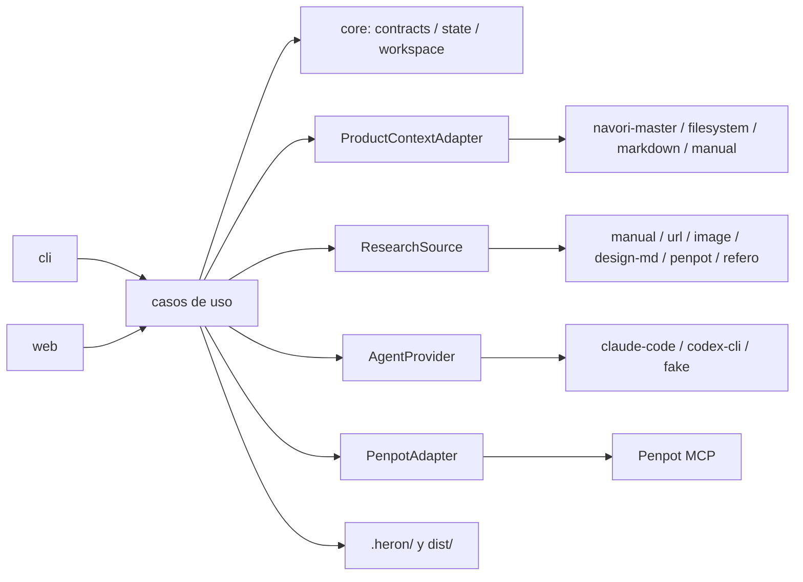

# Plan 1 — Navori Heron (prioridad: tiempo a valor)

## Metadatos

- **Proyecto:** `navori-heron`
- **Etapa:** `01-heron`
- **Fecha:** 2026-09-30
- **Modo:** `template` (greenfield sin template de stack; el stack es decisión abierta según `context/CODEBASE.md` §Stack)
- **Plan:** `plan1`
- **Prioridad de desempate asignada:** tiempo a valor. Poner en manos del usuario el Heron útil más pequeño lo antes posible, respetando todos los invariantes de `context/md/PLAN.md` §75. Cuando hay trade-off, este plan elige la entrega de valor más temprana y lo dice en el punto donde decide.
- **Archivos de `context/md/` leídos:** `context/md/PLAN.md` completo (2 917 líneas: §intro a §80 y "Resultado esperado").
- **Otros insumos leídos:** `context/DIGEST.md`, `context/CODEBASE.md`, `context/INTAKE.md`, `DECISIONS.md` (D1: seguir con el plan maestro; D2: el contrato UX lo define navori-harness y se está construyendo ahora), `state.json` (fase `mapped`). D2 se trata como restricción.
- **Etapas cerradas leídas:** ninguna (es la primera etapa).
- **Evidencia externa verificada.** El repo `navori-heron` no tiene commits ni remoto (`context/CODEBASE.md` §Estructura), así que `git fetch origin main` no aplica. Las afirmaciones sobre otros repos usan la rama nombrada:
  - `UlisesCm/navori-harness`, rama `main`, último push 2026-09-30, consultado vía `gh api` el 2026-09-30. Ninguna de sus 1 339 rutas contiene `UX.md`, `ux.json` ni un schema de UX, y no hay issues ni PRs que los mencionen. Los contratos del master-plan que Heron tiene que leer están en `packages/cli/src/lib/master/schema.ts:84-111` (`_master/index.json` v1: `number`, `slug`, `dir` = `<NN>-<slug>`, `state` ∈ `activa|cerrada|convertida|abandonada`), `:147-188` (`state.json`) y `:192+` (`parts.json`). La etapa guarda `MASTER.md`, `DECISIONS.md`, `parts.json`, `STATUS.md` y `CLOSURE.md` (`specs/0034-master-plan/design.md:14`).
  - navori 0.11.0 instalado en la máquina no tiene soporte para `UX.md`/`ux.json` (búsqueda en el paquete). Lee `sdd.specsDir` con default `specs` (`dist/index.js`).
  - Trabajo en curso del contrato UX (D2), en la ref local `feat/master-plan-ux-contract` de `/Users/ulisescm/Documents/dev-docs/navori-harness` (commit `f16638bc` más cambios sin commitear; no está en `origin/main`):
    - `packages/cli/src/lib/master/ux.ts:41-42` busca `UX.md` y `ux.json` en la raíz de la carpeta de la etapa.
    - `ux.ts:30-32` (`checkUxContent`) está vacío: todavía no hay schema de contenido.
    - El diff de `schema.ts` agrega la fase `ux` entre `mastered` y `executing`, el campo opcional `state.json.ux` ∈ `none|md|md-json` y el modo `desde-cero`.
  - `UlisesCm/monorepo-fullstack`, rama `main`, privado, último push 2026-09-30. Tiene `navori.config.json`, pero no tiene `specs/_master/`, `MASTER.md`, `DESIGN.md` ni `ux.json`. `packages/tokens/src/index.ts` define los tokens como un objeto TS con escalas de 10 tonos compatibles con Mantine, no en DTCG. `package.json` fija `bun@1.4.2`, `typescript 7.0.2`, `zod 4.6.5`, `oxlint 1.85.0`, `oxfmt 0.70.0` y `vitest 5.0.2`.
  - Herramientas en la máquina del usuario (`--version`, 2026-09-30): Bun 1.4.2, Claude Code 2.1.286 y codex-cli 0.159.2.
- **Consecuencia que ordena el plan:** hoy ningún proyecto real puede entrar en modo `full`. El harness está construyendo el contrato UX (D2), pero todavía no emite `UX.md`/`ux.json` en `main` ni tiene schema de contenido. El primer consumidor (`monorepo-fullstack`) caería en `reference-only`. Por eso el valor temprano está en `reference-only`, y el modo `full` se construye primero sobre fixtures sintéticos. Heron se ajustará al schema del harness cuando exista.

## Resumen ejecutivo

Navori Heron es una herramienta independiente (CLI y Web UI, self-hosted). Lee el modelo funcional de un producto, idealmente un master-plan de Navori Harness con `UX.md` + `ux.json`. Con eso produce investigación visual con provenance y direcciones visuales. Solo en modo `full` produce además foundations, tokens DTCG, componentes, patterns, pantallas con estados, sincronización a Penpot vía MCP y un export neutral versionado que cualquier stack consume sin instalar Heron (context/md/PLAN.md §intro, §3, §30, §44–§47).

Este plan ordena la entrega por tiempo a valor. El harness está construyendo el contrato UX (D2) pero todavía no lo emite, y el primer consumidor no tiene master-plan, así que lo primero es lo que sirve hoy:
1. `heron init`/`status` con detección de modo y estado versionado (P1, que es exactamente el primer slice de §80).
2. Un workspace de research `reference-only` con provenance, brand intake y seguridad de ingesta (P2).
3. Síntesis de research y tres direcciones visuales exploratorias usando los agentes CLI que el usuario ya tiene autenticados (P3).

Después vienen:
- La adopción del contrato UX que define el harness (D2) y `ProductContext` con precedencia y `CONFLICT` (P4).
- Un slice vertical `full` de un flow y 2–3 pantallas hasta el export (P5).
- Ver ese slice en Penpot (P6) antes de generalizar a todas las pantallas, con revisiones y creator→reviewer (P7).
- El control plane web (P8) y el self-host con hardening (P9).
- Refero como fuente opcional (P10).

Stack recomendado: TypeScript 7 + Bun 1.4 + Zod 4 en un solo paquete con fronteras por módulo, filesystem + Git como persistencia y ningún servicio adicional hasta que un requisito lo exija (§60, §62, §78).

## Alcance (MoSCoW)

**Must** (lo que define V1 según context/md/PLAN.md §76):
- M1. `heron init [ruta] [--stage <NN-slug>] [--json]` detecta el master-plan Navori y el modo, imprime la salida de §"Resultado esperado" y escribe `.heron/project.json` y `.heron/state.json` (P1).
- M2. `heron status` y `heron doctor`, que crece por parte: base (P1), agentes (P3), Penpot (P6) y Refero (P10).
- M3. Modo `reference-only` usable:
  - referencias con los 7 campos de provenance de §9 y crop/focus;
  - brand intake con origen por dato;
  - `REFERENCES.md`, `references.json`, `provenance.json`, moodboard HTML;
  - 3 direcciones marcadas `reference-only` (P2, P3).
- M4. Toda operación de producción sin `UX.md` + `ux.json` válidos sale con código 3 y nombra el archivo faltante o inválido (guard en P1; comandos en P5 y P7).
- M5. `ProductContext` v1 versionado con los adapters `navori-master`, `filesystem`, `markdown` y `manual`, precedencia de fuentes y registro `CONFLICT` (P4).
- M6. En modo `full`:
  - gate de dirección;
  - foundations de 14 áreas;
  - tokens DTCG 2025.10 en capas, con light/dark;
  - `DESIGN.md`;
  - componentes y patterns derivados de `ux.json`;
  - el 100 % de las pantallas de `ux.json` con estados;
  - los 14 validadores de §28 y las 6 preguntas de coverage de §29;
  - `dist/` con manifest §46 y checksums (P5, P7).
- M7. Penpot self-hosted documentado sobre el compose oficial con versión fijada, y adapter MCP read-only y de escritura (P6).
- M8. `heron revise` con registro de valores anteriores y nuevos, y `UX-PROPOSAL` (P7).
- M9. `AgentProvider` con adapters Claude Code (P3) y Codex CLI (P7), roles configurables y creator→reviewer (P7).
- M10. Web UI control plane con las vistas mínimas de §39 y la comparación de §40 (P8).
- M11. `docker compose up` para Heron, los 11 documentos de §74 y pruebas de seguridad y recovery (P9).

**Should:**
- S1. Fuente Refero / Refero Styles vía el MCP oficial, con Heron funcionando igual sin ella (P10; §8 la declara "importante pero NO obligatoria").
- S2. Preview HTML estático, no editable, de foundations y pantallas para revisar el slice antes de Penpot (P5).
- S3. Fuente de research "diseño Penpot existente" (P6).

**Could:**
- C1. `heron run --auto`, desactivado por defecto (§41: "posteriormente").
- C2. `docs/deployment/railway.md` una vez que el self-host Docker pase P9 (§65).
- C3. Binario único del CLI con `bun build --compile`.
- C4. Git LFS opcional para los assets de research.

**Won't (esta etapa):**
- W1. SaaS multi-tenant (§34).
- W2. Mantine theme, Unistyles theme, Tailwind config y componentes React/React Native (§47).
- W3. Proveedores por API directa (Claude API, OpenAI API, modelo local) (§48: "implementaciones futuras").
- W4. Adapters de contexto Jira, Notion, Linear o GitHub (§4: "más adelante").
- W5. LangChain, LangGraph, Temporal, Kafka, Redis y bases vectoriales (§60).
- W6. Fork de Penpot, escritura en su DB o en el formato `.penpot` (§31, §32).
- W7. Control de versiones propio (§59).

## Actores y permisos

V1 no tiene RBAC: un solo rol operador para una organización o equipo pequeño (context/md/PLAN.md §34).

| Actor | Puede | No puede |
|---|---|---|
| Diseñador / product owner (operador de Heron) | Correr el CLI y la Web UI; registrar referencias y brand inputs; aprobar o rechazar gates; seleccionar dirección; pedir revisiones; exportar | Forzar operaciones de producción en `reference-only`; exportar con findings FAIL; modificar el `ux.json` fuente (solo puede crear `UX-PROPOSAL`); aprobar un gate sin que quede registrado quién y cuándo |
| Cliente del producto diseñado | Aportar marca, preferencias y referencias a través del diseñador; sus datos quedan con origen `provided` (§12) | Acceder directamente a Heron en V1 [SUPUESTO] |
| Operador self-host | Desplegar Heron y Penpot; gestionar secretos por variables de entorno; hacer backups y upgrades | Ver o copiar credenciales de agentes CLI (Heron no las guarda, §49); compartir la DB de Penpot con Heron (§62) |
| Repo consumidor (p. ej. `monorepo-fullstack`) | Leer `dist/` y sus JSON Schemas sin instalar Heron (§45) | Escribir en `.heron/`; obtener de Heron artefactos de framework (§47) |
| Agentes IA (roles de §50 vía `AgentProvider`) | Devolver propuestas como JSON validado contra un schema | Ejecutar herramientas, leer o escribir archivos, usar MCP, aprobar gates, ver secretos |
| Navori Harness (fuente) | Ser leído (`navori.config.json`, `specs/_master/**`) | Ser escrito: Heron nunca escribe en `specs/` |
| Penpot (canvas) | Recibir escrituras vía el adapter MCP; ser inspeccionado | Ser fuente de verdad (§30); ser leído o escrito a nivel de DB (§32) |

## Reglas de negocio

- **RN-1** — Heron no depende de Navori Harness; la integración con el harness es un adapter. Fuente: context/md/PLAN.md §1, §75.1–§75.2.
- **RN-2** — El modo `full` se activa solo si `UX.md` y `ux.json` existen y son válidos. Fuente: context/md/PLAN.md §3 (Mode B), §75.11.
- **RN-3** — Si faltan ambos, el modo es `reference-only`. Fuente: context/md/PLAN.md §3 (Mode A).
- **RN-4** — Si existe solo uno: informar la inconsistencia, no inferir el faltante, caer en `reference-only`, permitir research y bloquear el diseño y el export de producción. Fuente: context/md/PLAN.md §3.
- **RN-5** — En `reference-only` quedan bloqueados: screen inventory, journeys y flows definitivos, design system y component system de producción, tokens finales, pantallas finales, Penpot de producción y export de producción. Fuente: context/md/PLAN.md §3, §69.
- **RN-6** — Todo output de `reference-only` queda marcado explícitamente `reference-only`. Fuente: context/md/PLAN.md §3, §69.
- **RN-7** — Precedencia de fuentes: DECISIONS.md > MASTER.md > parts.json > ux.json > UX.md > DIGEST.md > CODEBASE.md > context/md > inferencia. Fuente: context/md/PLAN.md §6.
- **RN-8** — Una contradicción se registra como `CONFLICT` con archivos involucrados, valores en conflicto e impacto, sin elegir en silencio. Fuente: context/md/PLAN.md §6.
- **RN-9** — Heron no redefine los contratos de `UX.md`/`ux.json` y conserva sus IDs estables (`ACT-*`, `J01`, `F01`, `M01`, `D01`, `P01`, `PT01`). Fuente: context/md/PLAN.md §2.
- **RN-10** — Cada referencia registra source, URL u origen, fecha de captura, razón, qué se estudia, qué no se copia y qué decisiones influye; las imágenes guardan crop/focus y notas. Fuente: context/md/PLAN.md §9, §57.
- **RN-11** — Las referencias son evidencia, no templates: no se copian productos ni interfaces completas y no se mezclan colores matemáticamente. Fuente: context/md/PLAN.md §9, §10, §75.12.
- **RN-12** — El research parte del trabajo de la interfaz (categoría, flow, screen type, pattern, UI element, estilo, densidad, contenido, navegación), nunca de consultas genéricas como "beautiful UI". Fuente: context/md/PLAN.md §8.
- **RN-13** — Cada brand input registra su origen: `provided`, `derived`, `inferred` o `reference-derived`. Una inferencia nunca se presenta como decisión del cliente. Fuente: context/md/PLAN.md §12, §75.14.
- **RN-14** — Un color del cliente inutilizable para una función no se descarta en silencio: se genera una variante que preserva hue, carácter e identidad, y se registra la decisión. Fuente: context/md/PLAN.md §13.
- **RN-15** — Heron preserva reglas de negocio, roles, permisos, requisitos funcionales, decisiones explícitas, capacidades, pantallas requeridas, estados críticos, flows obligatorios y restricciones de dominio. Fuente: context/md/PLAN.md §15.
- **RN-16** — Toda modificación significativa sobre `ux.json` se registra como `UX-PROPOSAL` (original, propuesta, razón, requisitos preservados, impacto) y nunca modifica la fuente. Fuente: context/md/PLAN.md §16.
- **RN-17** — Tras el research se proponen 3 direcciones visuales con 13 atributos cada una. En `full` existe un gate de selección antes de construir el sistema. Fuente: context/md/PLAN.md §11.
- **RN-18** — Los tokens usan formato compatible con W3C DTCG en capas primitive → semantic → component; los component tokens existen solo si aportan valor. Fuente: context/md/PLAN.md §18.
- **RN-19** — La semántica mínima cubre background, surface, content, border, action, interactive, feedback (success, warning, danger, info), focus, disabled y selected, con estados cuando apliquen. Fuente: context/md/PLAN.md §19.
- **RN-20** — Los anti-patterns de UI genérica de IA no se prohíben: exigen justificación registrada. Fuente: context/md/PLAN.md §21.
- **RN-21** — Los componentes se derivan de `ux.json`, patterns y screens, no de una lista estándar. Los patterns son de primera clase y se ligan a las pantallas que los usan. Fuente: context/md/PLAN.md §22, §23.
- **RN-22** — En `full` se diseñan todas las pantallas de `ux.json`, primero un set representativo y luego el resto. Cada pantalla conserva los campos heredados, agrega los campos Heron y revisa los estados relevantes más allá del happy path. Fuente: context/md/PLAN.md §24, §25, §26.
- **RN-23** — La accesibilidad se reporta con findings PASS/WARNING/FAIL con evidencia, sin score genérico. Fuente: context/md/PLAN.md §27.
- **RN-24** — Penpot no es fuente de verdad: la fuente son los contratos neutrales de Heron. Fuente: context/md/PLAN.md §30, §75.3.
- **RN-25** — Penpot se despliega desde el deployment oficial, sin fork, con una versión estable fijada (nunca `latest` en producción) y actualizable por configuración. Fuente: context/md/PLAN.md §31, §64.
- **RN-26** — La integración con Penpot es solo vía MCP: no se toca su DB ni el formato `.penpot`. Fuente: context/md/PLAN.md §32.
- **RN-27** — Los requisitos interactivos del MCP (archivo activo, plugin conectado, MCP key) se detectan, se muestran y fallan rápido con instrucción clara, sin espera indefinida. Fuente: context/md/PLAN.md §33.
- **RN-28** — Los gates humanos son el comportamiento por defecto; `run --auto` no es el comportamiento inicial. Fuente: context/md/PLAN.md §41.
- **RN-29** — El workflow es una state machine explícita con precondiciones verificables, sin estado escondido en prompts. Fuente: context/md/PLAN.md §42.
- **RN-30** — El resultado es portable y vive en Git. Una DB, si existe, es propia y solo para users, sessions, jobs, cache y UI metadata. Git es el historial; Heron guarda `designRevision` y `schemaVersion`. Fuente: context/md/PLAN.md §43, §59, §62.
- **RN-31** — V1 no produce Mantine theme, Unistyles theme, Tailwind config ni componentes React/RN. Fuente: context/md/PLAN.md §47, §75.6.
- **RN-32** — La IA es provider-agnostic, y una suscripción (Claude Max, ChatGPT Pro) no equivale a créditos de API. Fuente: context/md/PLAN.md §48, §75.5.
- **RN-33** — Los agentes CLI se usan autenticados externamente; Heron no guarda sus credenciales. Fuente: context/md/PLAN.md §49.
- **RN-34** — Los proveedores no están hardcodeados a roles; el par creator → reviewer es configurable. Fuente: context/md/PLAN.md §50, §51.
- **RN-35** — Cada tarea de IA recibe un context pack con solo lo que necesita. Fuente: context/md/PLAN.md §52.
- **RN-36** — El trabajo determinista (schemas, transiciones, archivos, DTCG, contraste, coverage, grafos, IDs, manifest, checksums, export) no se delega al LLM. Fuente: context/md/PLAN.md §53, §75.10.
- **RN-37** — Todo contenido externo (Refero, URLs, screenshots, documentos, contexto MASTER, DESIGN.md externos) es dato: nunca se ejecutan sus instrucciones y los hallazgos sospechosos se registran. Fuente: context/md/PLAN.md §54, §56.
- **RN-38** — El fetch de URLs bloquea localhost, endpoints de metadata, rangos privados, `file://` y protocolos inesperados, salvo operación local autorizada explícitamente. Fuente: context/md/PLAN.md §55.
- **RN-39** — Nunca se inventan métricas, precios, permisos, capacidades ni reglas. Los fixtures y previews se marcan DEMO, PLACEHOLDER o SYNTHETIC. Fuente: context/md/PLAN.md §71, §75.13.
- **RN-40** — Una revisión conserva todo lo no pedido y registra revision, reason, affected artifacts, previous values y new values. Fuente: context/md/PLAN.md §58.
- **RN-41** — Nunca se loggean API keys, MCP tokens, session tokens ni secretos de documentos. Fuente: context/md/PLAN.md §66.
- **RN-42** — Cada resultado registra modelo/proveedor, versión de plantilla de prompt, hashes de entrada, referencias y dirección seleccionadas, versiones de schema y versión de Heron. Fuente: context/md/PLAN.md §67.
- **RN-43** — Los quality gates son reglas PASS/WARNING/FAIL por categoría (UX coverage, accesibilidad, tokens, consistencia visual, estados, flows, pantallas, componentes, patterns, Penpot sync, integridad del export), sin score 0–100. Fuente: context/md/PLAN.md §68.
- **RN-44** — Heron trabaja también con una etapa cerrada (`--stage`). Fuente: context/md/PLAN.md §38.
- **RN-45** — V1 es para una sola organización o un equipo pequeño, sin multi-tenant. Fuente: context/md/PLAN.md §34.
- **RN-46** — Refero es una fuente opcional y no es fuente de verdad. Fuente: context/md/PLAN.md §8, §75.4.
- **RN-47** — El manifest incluye schemaVersion, heronVersion, project, masterStage, generatedAt, mode, themes, surfaces, los tres conteos, tokenSets, files y checksums, y el consumidor entiende el formato sin instalar Heron. Fuente: context/md/PLAN.md §45, §46.
- **RN-48** — [SUPUESTO] Sin `--stage`, Heron usa la etapa `activa`. Si no hay ninguna, usa la última `cerrada` por número y lo dice en la salida. Las etapas `convertida` o `abandonada` solo se usan con `--stage` explícito.
- **RN-49** — `UX.md` y `ux.json` se buscan en la raíz de la carpeta de la etapa (`<specsDir>/_master/<NN-slug>/`), junto a `MASTER.md`. Fuente: context/md/PLAN.md §37 (artefactos que se detectan por etapa) y D2 (`ux.ts:41-42` en la rama del harness).
- **RN-50** — [SUPUESTO] Validez provisional mientras el harness no publique su schema de contenido (D2, `checkUxContent` vacío):
  - `UX.md` es válido si es UTF-8 y tiene al menos 1 carácter no blanco.
  - `ux.json` es válido si es JSON y cumple el subconjunto tolerante `UxContract`: arreglos `surfaces`, `screens`, `flows` y `patterns` con `id` string únicos, y campos desconocidos preservados.
  - Cuando el harness publique su schema, `UxContract` pasa a ser el adapter de ese schema, con versión fijada, y se elimina el provisional.
- **RN-51** — [SUPUESTO] `.heron/` vive en la raíz del repo destino. Heron no escribe fuera de `.heron/` ni de la ruta `--out`, y nunca ejecuta comandos git que muten el repo (solo lecturas como `git rev-parse`).
- **RN-52** — [SUPUESTO] En `reference-only`, `direction select` registra una dirección `preferred` exploratoria. Al pasar a `full` sirve como insumo, pero exige un gate de dirección nuevo.
- **RN-53** — [SUPUESTO] Si el modo baja de `full` a `reference-only` (UX borrado o invalidado), los artefactos de producción se marcan `stale` y el export queda bloqueado hasta revalidar.
- **RN-54** — [SUPUESTO] El export exige 0 findings FAIL. Los WARNING se permiten y se listan en el manifest.
- **RN-55** — [SUPUESTO] Si Penpot no está configurado, el export se permite: el manifest registra `penpot.status = "not-synced"` y la categoría "Penpot sync" emite WARNING.
- **RN-56** — [SUPUESTO] El modo depende solo de `UX.md`/`ux.json`. Si falta `MASTER.md` o `DECISIONS.md`, se emite un WARNING en intake, porque la precedencia de RN-7 no puede aplicarse completa.
- **RN-57** — [SUPUESTO] El adapter `navori-master` lee `state.json.ux` de la etapa (`none|md|md-json`, D2) como declaración del harness y la muestra en `init`/`status`. El modo se calcula siempre desde los archivos (§3). Si la declaración y los archivos no coinciden, emite el finding `UX_DECLARATION_MISMATCH`. Con `md`, el modo es `reference-only` y el mensaje dice que el harness decidió no producir `ux.json`.
- **RN-58** — [SUPUESTO] El lector del estado del harness es tolerante: acepta fases y modos que no conoce (p. ej. `ux`, `desde-cero`) sin fallar y solo exige los campos que Heron usa. Heron no importa código de navori (RN-1).

## Requisitos funcionales

- **RF-1** — `heron init [ruta] [--stage <NN-slug>] [--json]` lee `navori.config.json` (y su `sdd.specsDir`), `<specsDir>/_master/index.json` y la etapa elegida. Reporta presencia (✓ / `missing`) de MASTER.md, DECISIONS.md, parts.json, UX.md, ux.json, DIGEST.md y CODEBASE.md. Imprime el modo, las surfaces y los conteos de pantallas, flows y patterns con el formato de context/md/PLAN.md §"Resultado esperado". Escribe `.heron/project.json`, `.heron/state.json` y `.heron/context/detection.json` (P1).
- **RF-2** — `heron status [--json]` muestra el modo, el estado de la state machine, el gate pendiente, si las entradas cambiaron desde la última detección (comparación de sha256) y los comandos permitidos a continuación (P1).
- **RF-3** — `heron doctor [--json]` corre checks con resultado PASS/WARNING/FAIL, cada uno con un texto de remedio, y sale con código distinto de 0 si hay algún FAIL. Checks por parte:
  - P1: runtime, ruta destino, permisos de escritura, repo git.
  - P3: agentes CLI instalados y con sesión.
  - P6: Penpot URI, endpoint MCP, MCP key, plugin conectado.
  - P10: token de Refero.
- **RF-4** — Todo comando o transición de producción en `reference-only` sale con código 3 y un mensaje que nombra el archivo UX faltante o inválido (guard de la state machine en P1; comandos en P5 y P7).
- **RF-5** — `heron references add|list|show|remove`:
  - fuentes `manual`, `url`, `image` (screenshot o imagen local) y `design-md` (archivo o URL);
  - exige los campos de provenance de RN-10;
  - acepta `--crop x,y,w,h` con nota por zona;
  - acepta importación por lote desde un archivo JSON (P2).
- **RF-6** — `heron brand add --kind <logo|color|secondary-color|font|guidelines|screenshot|url|existing-product|competitor|liked|disliked> --origin <provided|derived|inferred|reference-derived>` persiste en `.heron/brand/` (P2).
- **RF-7** — `heron research render` genera `research/REFERENCES.md`, `references.json`, `provenance.json` y `moodboards/index.html` (HTML estático sin dependencias externas), todos marcados con el modo (P2).
- **RF-8** — `heron research brief` genera, vía agente, preguntas de research por trabajo de interfaz (RN-12) a partir del contexto disponible y de la marca (P3).
- **RF-9** — `heron research analyze [--ref <id>]` agrega `agentNotes` y propiedades visuales por referencia con origen `inferred`, sin sobrescribir los campos humanos (P3).
- **RF-10** — `heron direction propose` genera 3 direcciones con los 13 atributos de §11 y referencias citadas. `heron direction select <DIR-x>` registra `preferred` en `reference-only` o pasa por el gate de dirección en `full` (P3, P5).
- **RF-11** — `heron approve <gate> [--note]` y `heron reject <gate> --reason <texto>` registran la decisión de gate con autor (git `user.name` o `--by`), fecha y hash de los artefactos revisados (P3, P5).
- **RF-12** — `heron intake [--adapter <id>]` construye `ProductContext` v1 y reporta `CONFLICT` y WARNING (P4).
- **RF-13** — `heron foundations` (solo `full`) produce las 14 áreas de §17. Cada área tiene tokens o una decisión explícita de "no aplica, porque …" (P5).
- **RF-14** — `heron system` produce tokens DTCG (primitives, semantic, components; themes light y dark), `design-system.json`, componentes, patterns y `DESIGN.md` (slice en P5, completo en P7).
- **RF-15** — `heron screens [--representative | --all | --screen <id>]` produce `ScreenDesign` por pantalla, con campos heredados, campos Heron, `layout` neutral y estados (P5, P7).
- **RF-16** — `heron validate` ejecuta los validadores de §28 y las preguntas de §29 y escribe `validation/report.json` y `report.md` con findings por categoría de RN-43 (P5, P7).
- **RF-17** — `heron export [--out <dir>]` (solo `full`, 0 FAIL) escribe `dist/` con manifest, checksums sha256 y JSON Schemas 2020-12 de cada contrato (P5).
- **RF-18** — `heron penpot inspect|sync|status`. `inspect` es de solo lectura; `sync` (solo `full`) escribe página, tokens, componentes y pantallas de forma idempotente vía MCP (P6).
- **RF-19** — `heron revise "<instrucción>" [--target <artefacto>]` aplica una revisión que conserva lo no pedido y registra `Revision`. Los cambios significativos sobre `ux.json` generan `UX-PROPOSAL` (P7).
- **RF-20** — `heron run` avanza el pipeline hasta el siguiente gate humano. `--auto` solo funciona si la configuración lo habilita (P7).
- **RF-21** — `heron web [--host] [--port]` sirve el control plane con las vistas de §39 y la comparación de §40 (P8).
- **RF-22** — `docker compose up` levanta Heron (web) con volumen del repo destino. Penpot corre en un proyecto compose separado (P9).
- **RF-23** — La fuente de research `refero` importa screens, flows y styles del MCP oficial como referencias con provenance (P10).
- **RF-24** — La fuente de research `penpot` importa frames de un archivo Penpot existente como referencias (P6).
- **RF-25** — Preview HTML estático, no editable y fuera de `dist/`, de foundations (swatches, contraste, escala tipográfica) y de pantallas renderizadas desde el `layout` neutral, para revisar los gates antes de Penpot (P5).

## Requisitos no funcionales

- **RNF-1** — Latencia de `heron init` y `heron status` sobre el fixture `membership-product` (≥ 30 pantallas): p95 ≤ 1 000 ms en 20 ejecuciones sin red, en la Mac Apple Silicon del usuario.
- **RNF-2** — Tiempo a valor: desde `git clone` de Heron hasta la primera salida de `heron init` sobre un repo del usuario, siguiendo `README.md`: ≤ 10 min, cronometrado de forma manual.
- **RNF-3** — Reproducibilidad del export: 2 ejecuciones con las mismas entradas y reloj fijo (`HERON_FIXED_CLOCK`) producen 0 bytes de diferencia (checksums idénticos).
- **RNF-4** — Cobertura: `bun test --coverage` ≥ 90 % de líneas y funciones, con umbral en `bunfig.toml` (el test sale con código distinto de 0 si baja).
- **RNF-5** — Dependencias de producción: solo las de la lista aprobada en "Stack y librerías" (zod desde P1, culori desde P5, @modelcontextprotocol/client desde P6). Agregar una requiere un ADR.
- **RNF-6** — SSRF: el 100 % de una matriz de ≥ 14 casos queda bloqueado. Además: timeout de fetch 10 s, ≤ 3 redirecciones con revalidación en cada salto, cuerpo ≤ 2 MiB para texto y ≤ 20 MiB para imágenes.
- **RNF-7** — Imágenes: ≤ 20 MiB y ≤ 100 MP por archivo; solo PNG, JPEG o WebP según magic bytes; 0 etiquetas EXIF, GPS o XMP después de importar.
- **RNF-8** — Secretos: 0 apariciones de valores centinela (MCP key, bearer de Refero, token web, variables de entorno de agentes) en logs, run records, `.heron/` y `dist/`.
- **RNF-9** — Fail-fast de Penpot MCP: los checks y operaciones fallan en ≤ 15 s (configurable) cuando no hay plugin conectado o archivo activo; ninguna espera sin límite.
- **RNF-10** — Timeout de agente: 300 s por tarea por defecto, configurable. Al vencer, el run queda `timeout` y el estado de Heron no cambia.
- **RNF-11** — Consistencia: escrituras atómicas (archivo temporal + rename) y lock de proyecto. En la prueba de interrupción, 0 archivos de estado corruptos. Un segundo escritor concurrente sale con código 6 en ≤ 1 s.
- **RNF-12** — Context pack: ≤ 150 000 caracteres por tarea (configurable, muy por debajo del tope de 10 MB por stdin de Claude Code) y solo los tipos de artefacto que declara la tarea.
- **RNF-13** — Versionado: el 100 % de los JSON persistidos lleva `schemaVersion`. Una versión mayor desconocida falla con un mensaje que nombra la versión de Heron requerida.
- **RNF-14** — Observabilidad: el 100 % de los comandos emite al menos 1 línea JSONL con `runId`, `command`, `durationMs` y `result`. El 100 % de las invocaciones de agente registran proveedor, modelo (si lo expone), versión de plantilla, hashes de entrada, duración y costo (si lo expone).
- **RNF-15** — Web UI: escucha en 127.0.0.1 por defecto. Con un host que no sea loopback exige token (401 sin él). Vistas con p95 ≤ 300 ms sobre `membership-product`.
- **RNF-16** — Portabilidad: el 100 % de los JSON de `dist/` valida contra los JSON Schema 2020-12 emitidos, usando un validador genérico (ajv) sin código de Heron.
- **RNF-17** — Contraste del output: el 100 % de los pares texto/fondo declarados en los semantic tokens cumple ≥ 4.5:1 (texto normal) y ≥ 3:1 (texto grande y UI), o aparece como finding FAIL con los valores medidos (WCAG AA, §27).
- **RNF-18** — Arranque self-host: `docker compose up -d` deja el healthcheck de Heron en `ok` en ≤ 60 s con la imagen ya construida.
- **RNF-19** — Tipado: 0 usos de `any` sin el comentario `// any justified: <reason>` (CLAUDE.md "Strong typing"), verificado por la regla de oxlint en el quality gate.

## Dominio y datos

**Entidades.** Todas se persisten como JSON con `schemaVersion` bajo `.heron/`.

| Entidad | Archivo | Id | Relaciones | Ciclo de vida |
|---|---|---|---|---|
| HeronProject | `project.json` | slug del repo | 1 por repo destino; `source` = adapter + etapa | Se crea en `init`; se actualiza con `init --stage` |
| HeronState | `state.json` | — | modo, estado, `gates[]`, `history[]` de transiciones, `findings[]`, `inputHashes`, `designRevision` | Transiciones por la state machine; `designRevision` +1 por gate aprobado o revisión |
| DetectionReport | `context/detection.json` | — | archivos detectados, sha256, validez, modo | Se regenera en cada comando |
| UxContract | leído de `ux.json` | ids del harness | surfaces, screens, flows, patterns, actors, journeys | Solo lectura; tolerante a campos desconocidos |
| ProductContext v1 | `context/product-context.json` | — | 19 secciones de §5; cada elemento con `sourceRef` (archivo + ancla) | Derivado; se regenera en `intake` |
| Conflict | `context/conflicts.json` | `CONFLICT-001` | archivos, valores, impacto, `status` (`open`/`resolved`), resolución humana | `open` → `resolved` solo por decisión humana registrada |
| BrandInput | `brand/brand.json` + `brand/assets/` | `BRAND-001` | `origin` (RN-13), asset por sha256 | Alta, edición y baja lógica |
| ResearchReference | `research/references.json` | `REF-0001` | provenance (RN-10), `crops[]`, `agentNotes` (`inferred`), `trust`, `suspiciousFindings[]`, `influences[]` → ids de decisión | `active` / `removed` (baja lógica) |
| ResearchBrief | `research/brief.json` | `BRIEF-n` | preguntas por faceta de §8 | Se versiona por `designRevision` |
| VisualDirection | `research/visual-directions.json` | `DIR-A..C` | 13 atributos, `references[]`, `mode`, `status` (`proposed`/`preferred`/`selected`/`rejected`) | Selección vía gate |
| Foundations | `design/foundations/<area>.json` | área | → TokenSet | `full` |
| TokenSet (DTCG) | `design/tokens/*.tokens.json` | ruta del token | primitive ← semantic ← component; themes light y dark | `full` |
| Component | `design/components/<CMP>.json` | `CMP-<Name>` | usado por screens y patterns | Huérfano = FAIL |
| Pattern | `design/patterns/<PT>.json` | id de `ux.json` | → screens que lo usan | `full` |
| ScreenDesign | `design/screens/<screenId>.json` | id de `ux.json` | heredados (§25) + Heron (§25) + `layout` + estados (§26) | Representativa → resto |
| UxProposal | `design/proposals/<UXP>.json` | `UXP-001` | original, propuesta, razón, requisitos preservados, impacto | `proposed` → `accepted`/`rejected` por humano |
| Revision | `revisions/<REV>.json` | `REV-001` | instrucción, razón, artefactos afectados, valores previos y nuevos | Inmutable |
| AgentRunRecord | `runs/<runId>.json` | UUID v4 | rol, proveedor, modelo, plantilla@versión+sha256, hashes de entrada y salida, duración, costo | Inmutable |
| ValidationReport | `validation/report.json` | — | findings (categoría, regla, severidad, evidencia, ids) | Se regenera en `validate` |
| PenpotMapping | `penpot/mapping.json` | id Heron → id de shape Penpot | archivo, páginas, hash del último sync | Se actualiza en `sync` |
| Manifest | `dist/manifest.json` | — | campos de RN-47, más `uxContractVersion`, `designRevision`, resumen de validación y estado Penpot | Se genera en `export` |

**State machine.** La tabla completa de estados va en P1; las precondiciones se implementan cuando existe el artefacto que verifican.

| Estado | Modo | Precondición verificable | Gate de salida |
|---|---|---|---|
| `initialized` | ambos | `project.json` y `state.json` válidos | — |
| `intake-ready` | full | `product-context.json` válido; 0 `CONFLICT` en `open` marcados como bloqueantes | `intake` |
| `researching` | ambos | ≥ 1 referencia activa | — |
| `research-ready` | ambos | brief existe; ≥ 5 referencias con provenance completa [SUPUESTO: umbral configurable] | `research` |
| `directions-proposed` | ambos | 3 direcciones válidas que citan referencias existentes | — |
| `direction-preferred` | reference-only | selección exploratoria registrada (RN-52) | — (fin del track reference-only) |
| `direction-selected` | full | gate `direction` aprobado con `DIR-x` | — |
| `foundations-ready` | full | 14 áreas resueltas; tokens DTCG válidos; 0 FAIL de contraste | `foundations` |
| `representative-screens-ready` | full | las pantallas representativas cubren las categorías de §24 que existan en `ux.json` | `representative-screens` |
| `system-ready` | full | 0 componentes huérfanos; cada pattern ligado a ≥ 1 pantalla | — |
| `screens-ready` | full | 100 % de las pantallas de `ux.json` diseñadas | — |
| `penpot-synced` | full | sync sin errores (se omite con RN-55) | `visual-review` |
| `validated` | full | 0 FAIL | — |
| `exported` | full | manifest y checksums escritos | — |

Transiciones hacia atrás:
- `revise` regresa al primer estado afectado y marca `stale` los artefactos posteriores.
- Si el modo baja a `reference-only`, el estado máximo pasa a ser `research-ready` (RN-53).

**Layout de `.heron/`:** se analizó §44 y se conserva su separación conceptual. Agrega `context/`, `brand/`, `runs/`, `revisions/` y `penpot/`, y mueve el export a `dist/`.

```text
.heron/
├── project.json · state.json · .gitignore
├── context/      detection.json · product-context.json · conflicts.json
├── brand/        brand.json · assets/
├── research/     REFERENCES.md · references.json · provenance.json · brief.json · visual-directions.json · assets/ · moodboards/
├── design/       DESIGN.md · design-system.json · foundations/ · tokens/ · components/ · patterns/ · screens/ · proposals/ · preview/
├── penpot/       mapping.json
├── revisions/ · runs/ · validation/
├── dist/         (export por defecto; configurable con --out)
└── cache/ · logs/   (ignorados)
```

**Retención:**
- `.heron/**` se versiona en el Git del repo destino, salvo `cache/`, `logs/`, `runs/raw/` y `.lock` (los lista el `.heron/.gitignore` que genera `init`).
- Los transcripts crudos de agentes no se guardan por defecto (`agents.keepRaw: false`); solo sus hashes.
- Los logs locales se retienen 30 días [SUPUESTO].
- La baja de referencias y brand inputs es lógica. `--purge` borra el asset solo si ninguna otra entidad lo referencia.

## Arquitectura

**Decision drivers** (derivados de las reglas del proyecto):
- DR1: independencia y adapters (context/md/PLAN.md §75.1–§75.6).
- DR2: lo determinista fuera del LLM (§53).
- DR3: portabilidad y Git (§43, §59).
- DR4: simplicidad de V1 (§60, §75.15, §78; CLAUDE.md "¿lo más simple?").
- DR5: contenido externo como dato (§54–§56).
- DR6: tiempo a valor (prioridad asignada).
- DR7: tipado fuerte sin `any` (CLAUDE.md "Strong typing").

**Decisiones y opciones.** En cada decisión se evaluaron tres escalones: patrón existente, extensión y abstracción nueva.

A. **Estructura del código.**
1. Un solo paquete (`src/`) con módulos por frontera y un test de fronteras. **Recomendada (DR4, DR6).**
2. Workspace Bun `apps/cli` + `packages/core` (+ `apps/web` en P8). Es viable, pero su beneficio aparece solo cuando hay dos entregables. Es una decisión reversible: se reabre en P8 si el servidor web lo exige.
3. La estructura completa de §61 (3 apps + 11 packages). Descartada: son 14 manifiestos y tsconfig para un código que aún no existe, y §61 pide no adoptarla automáticamente.

B. **Persistencia.**
1. Filesystem + Git: JSON versionado + Markdown, escrituras atómicas y lock de proyecto. **Recomendada (§43, §62).**
2. Agregar SQLite embebido para jobs y metadata de UI. Diferida: ningún requisito de V1 la exige (una organización, jobs secuenciales).
3. Postgres propio. Descartada en V1: es un servicio sin necesidad demostrada (§78).

C. **Frontera de IA.**
1. Agentes CLI externos (Claude Code, Codex) como procesos hijos, sin herramientas, sin MCP, con cwd en un directorio temporal vacío y salida forzada a un JSON Schema generado desde Zod, que Heron revalida. **Recomendada:** usa las suscripciones del usuario (§48), no toca credenciales (§49) y deja la escritura en Heron (§53).
2. Agentes con herramientas que escriben en el repo. Descartada: artefactos sin validar y superficie de prompt injection (§56).
3. SDK o APIs directas. Won't en V1 (§48). El puerto `AgentProvider` las admite después sin tocar el núcleo.

D. **Frontera Penpot.**
1. Heron como cliente MCP (`@modelcontextprotocol/client`) que invoca `execute_code` con scripts de Plugin API generados desde plantillas fijas y datos de contratos validados, e inspecciona con `high_level_overview` y `export_shape`. **Recomendada:** reproducible, idempotente vía `mapping.json` y comprobable con un fake MCP.
2. Delegar la operación de Penpot a un agente con el MCP configurado. Viable más adelante para crítica visual; descartada para escritura porque no es reproducible y exige dar herramientas de escritura al agente.
3. Escribir en la DB o en `.penpot`. Prohibido (§32).

E. **Web UI.**
1. HTML renderizado en servidor con `Bun.serve` y JS mínimo sin framework. **Recomendada:** 0 dependencias nuevas y reutiliza el core.
2. Hono con SSR, si el router pasa de 30 rutas.
3. SPA React con build. Descartada en V1: más dependencias y más build sin beneficio para un control plane que no replica Penpot (§39).

F. **Orden de entrega frente a §77.**
1. `reference-only` primero y contratos justo a tiempo. **Recomendada:** DR6, y la evidencia de que no existe ningún `ux.json` real.
2. Seguir §77 al pie de la letra: 9 contratos antes del modo y ADRs antes de código. Descartada como orden y conservada como contenido (ver la tabla de "Entrega en partes").

**Componentes** (módulos en `src/`):
- `cli/`: router con `node:util` `parseArgs`; salida humana y `--json`.
- `core/contracts/`: schemas Zod y emisión de JSON Schema; no importa nada interno.
- `core/state/`: tabla de estados, transiciones, precondiciones, gates e historial.
- `core/workspace/`: layout de `.heron/`, rutas seguras, escritura atómica, sha256 y lock.
- `intake/`: puerto `ProductContextAdapter` y adapters `navori-master`, `filesystem`, `markdown` y `manual`; detección, precedencia y conflictos.
- `research/`: puerto `ResearchSource` y fuentes `manual`, `url`, `image`, `design-md`, `penpot` y `refero`; `safe-fetch`; saneo de imágenes; detector de contenido sospechoso; renderers de `REFERENCES.md` y moodboard.
- `agents/`: puerto `AgentProvider` y adapters `claude-code`, `codex-cli` y `fake`; registro de roles desde configuración; plantillas de prompt versionadas en archivos (`prompts/<role>/<task>@v<n>.md`); builder de context packs; run records.
- `design/`: casos de uso de IA (brief, análisis, direcciones, foundations, sistema, pantallas, `DESIGN.md`, revisiones) que orquestan agentes y validan.
- `tokens/`: parte determinista de color (contraste WCAG 2.x, OKLCH, escalas, variantes de marca), builder y validador DTCG.
- `validation/`: validadores de §28, coverage de §29 y findings.
- `export/`: `dist/`, manifest, checksums y JSON Schemas.
- `penpot/`: puerto `PenpotAdapter` sobre MCP, generador de scripts, mapping y doctor.
- `web/`: control plane con `Bun.serve` (P8).
- Fuera de `src/`: `prompts/`, `fixtures/`, `tests/`, `docs/`, `infra/docker/` e `infra/penpot/`.

**Reglas de dependencia:**
- `cli` y `web` → casos de uso (`intake`, `research`, `design`, `validation`, `export`, `penpot`) → `core/*`.
- Los adapters implementan puertos declarados en su propio módulo.
- `core/contracts` no importa nada interno.
- Nadie importa `cli` ni `web`.
- `tests/repo/boundaries.test.ts` lo verifica.

**Flujo de cada comando:**
1. Resolver `.heron/project.json` y tomar el lock.
2. Re-detectar las entradas por sha256; si el modo cambió, registrar la transición y marcar `stale` lo afectado.
3. Guard: modo y precondición del estado destino.
4. Paso determinista, o paso IA (context pack → proveedor → validación Zod → reviewer si está configurado).
5. Escribir los artefactos de forma atómica, correr los validadores pertinentes, transicionar, emitir log JSONL y liberar el lock.



## Stack y librerías

Todo va fijado a versión exacta y con `bun.lock` versionado. Las versiones se verificaron el 2026-09-30.

| Pieza | Elección y versión fija | Fuente oficial y fecha | Notas |
|---|---|---|---|
| Runtime, package manager y test runner | Bun 1.4.2 | https://bun.com/blog/bun-v1.4.2 (consultado 2026-09-30) | Release del 2026-09-05, la última estable en GitHub releases; la misma que usa `monorepo-fullstack` |
| Lenguaje y typecheck | TypeScript 7.0.2 | https://www.npmjs.com/package/typescript (consultado 2026-09-30) | dist-tag `latest`; la misma que `monorepo-fullstack` |
| Tipos del runtime | @types/bun 1.4.2 | https://www.npmjs.com/package/@types/bun (consultado 2026-09-30) | dev |
| Schemas runtime | Zod 4.6.5 | https://zod.dev/json-schema (consultado 2026-09-30) | `z.toJSONSchema()` nativo (draft 2020-12 por defecto); `z.fromJSONSchema` es experimental y no se usa |
| Parsing del CLI | `node:util` `parseArgs` (incluido en Bun) | https://bun.com/guides/process/argv (consultado 2026-09-30) | 0 dependencias; citty descartado para no sumar una |
| Tests y cobertura | `bun test --coverage` con `coverageThreshold` en `bunfig.toml` | https://bun.com/docs/test/code-coverage (consultado 2026-09-30) | Sale con código distinto de 0 bajo el umbral; vitest 5.0.3 queda como alternativa (ver Preguntas abiertas) |
| Imágenes | `Bun.Image` (incluido en Bun) | https://bun.com/docs/runtime/image (consultado 2026-09-30) | Decodifica y codifica JPEG, PNG y WebP, con límite de píxeles. Que el re-encode elimine EXIF/GPS está [SIN VERIFICAR]: lo cubre P2.A5, y el fallback es un stripper de segmentos propio sin dependencias. sharp 0.35.5 queda descartado por ser nativo |
| Lint | oxlint 1.86.0 | https://www.npmjs.com/package/oxlint (consultado 2026-09-30) | dev; el ecosistema del usuario usa oxlint (monorepo-fullstack 1.85.0) |
| Formato | oxfmt 0.71.0 | https://www.npmjs.com/package/oxfmt (consultado 2026-09-30) | dev; versión pre-1.0 |
| Color (desde P5) | culori 4.0.2 | https://www.npmjs.com/package/culori (consultado 2026-09-30) | Conversiones OKLCH y sRGB para escalas; el contraste WCAG se calcula en código propio |
| Cliente MCP (desde P6) | @modelcontextprotocol/client 2.2.0 | https://github.com/modelcontextprotocol/typescript-sdk/releases/tag/v2.2.0 (consultado 2026-09-30) | Paquete v2 separado; `@modelcontextprotocol/sdk` 1.31.0 es la línea v1 |
| Validador JSON Schema (tests) | ajv 8.20.0 | https://www.npmjs.com/package/ajv (consultado 2026-09-30) | dev; prueba la portabilidad de `dist/` (RNF-16) |
| Servidor web (P8) | `Bun.serve` (incluido en Bun 1.4.2) | [SIN VERIFICAR] contra su página de docs; se verifica al abrir P8 | 0 dependencias. Hono 4.13.12 (https://www.npmjs.com/package/hono, consultado 2026-09-30) queda como alternativa no adoptada |
| Agente 1 | Claude Code 2.1.286 (mínimo 2.1.259 por `--permission-prompts`) | https://code.claude.com/docs/en/cli-reference (consultado 2026-09-30) | Flags usados: `-p`, `--tools ""`, `--disallowedTools "mcp__*"`, `--output-format json`, `--json-schema`, `--no-session-persistence`, `--permission-prompts none`, `--system-prompt-file`. Se leen `structured_output` y `total_cost_usd` |
| Agente 1, modo headless | `--bare` no se usa | https://code.claude.com/docs/en/headless (consultado 2026-09-30) | En bare mode Claude Code no lee OAuth ni el keychain y exige `ANTHROPIC_API_KEY`: rompería el uso de la suscripción (RN-32). Aislamiento propuesto: `--safe-mode` + cwd temporal vacío. Que `--safe-mode` sirva para automatización está [SIN VERIFICAR] (probe en P3) |
| Agente 2 (P7) | Codex CLI 0.159.2 | https://learn.chatgpt.com/docs/non-interactive-mode (consultado 2026-09-30) | `codex exec --sandbox read-only --ephemeral --skip-git-repo-check --output-schema <file> -o <file>`. La entrada del prompt por stdin está [SIN VERIFICAR]. El comando para comprobar la sesión en `doctor` está [SIN VERIFICAR] |
| Penpot (P6) | Fijar 2.17.2 (la última es 2.18.0) | https://github.com/penpot/penpot/releases (consultado 2026-09-30) | 2.18.0 salió el 2026-09-23 y 2.17.2 el 2026-08-27. La razón para fijar 2.17.2 es la fila del issue #12003 |
| Penpot, bug de MCP en self-host | Issue #12003 | https://github.com/penpot/penpot/issues/12003 (consultado 2026-09-30) | En 2.18.0 self-hosted, el plugin MCP conecta a `/mcp/ws` sin `userToken` y el servidor lo rechaza. Estado: abierto |
| Penpot, deployment | Compose oficial `docker/images/docker-compose.yaml` | https://help.penpot.app/technical-guide/getting-started/docker/ (consultado 2026-09-30) | Usa `PENPOT_VERSION`, `PENPOT_PUBLIC_URI`, `PENPOT_SECRET_KEY` y `PENPOT_FLAGS` (incluye `enable-mcp`); backup de volúmenes; upgrades en incrementos pequeños; 2.18 agrega `enable-admin-console` |
| Penpot MCP | MCP oficial integrado en Penpot desde 2.17 | https://help.penpot.app/mcp/ (consultado 2026-09-30) | Endpoint remoto `<PENPOT_PUBLIC_URI>/mcp/stream?userToken=<MCP key>`. Tools: `execute_code`, `high_level_overview`, `penpot_api_info`, `export_shape`, `import_image`. Requiere la pestaña activa con el plugin abierto, una sola pestaña y la página enfocada. La key se muestra una vez y es por usuario |
| Penpot MCP, repo anterior | `penpot/penpot-mcp`, archivado | https://github.com/penpot/penpot-mcp (consultado 2026-09-30) | Archivado el 2026-02-03 e integrado en el repo principal de Penpot |
| Tokens | W3C DTCG Format Module 2025.10 | https://www.designtokens.org/tr/2025.10/format/ (consultado 2026-09-30) | `$value`/`$type`, alias `{a.b}`, `$extends`, color con `colorSpace` + `components`, extensión `.tokens.json`, MIME `application/design-tokens+json`. El theming vive en un "Resolver Module" aparte, cuyo estado está [SIN VERIFICAR] |
| Refero (P10) | MCP oficial `api.refero.design/mcp` | https://doc.refero.design/mcp/getting-started (consultado 2026-09-30) | OAuth o Bearer; requiere plan pago Pro, Team o Lifetime; 8 000 tool calls al mes por usuario; incluye capas Sites, Styles, Screens y Flows. Los términos para usarlo dentro de otra herramienta están [SIN VERIFICAR] |
| Imagen Docker (P9) | `oven/bun:1.4.2` | [SIN VERIFICAR] | Se verifica al abrir P9, junto con las versiones de Docker Engine y Compose |
| Contratos del harness | `index.json` v1, `state.json`, `parts.json` | https://github.com/UlisesCm/navori-harness (consultado 2026-09-30) | Heron no importa navori (RN-1): replica un lector mínimo y tolerante de `index.json` v1 (`packages/cli/src/lib/master/schema.ts:36-111`) |

Descartadas por ahora: LangChain, LangGraph, Temporal, Kafka, Redis y bases vectoriales (§60), SQLite, Postgres, un framework SPA, sharp y citty.

## Contratos

**Superficie del CLI:**

| Comando | Modo | Precondición | Salida | Parte |
|---|---|---|---|---|
| `heron init [ruta] [--stage] [--json]` | ambos | ruta legible | resumen + `.heron/` | P1 |
| `heron status [--json]` | ambos | proyecto inicializado | modo, estado, gate, drift, siguientes comandos | P1 |
| `heron doctor [--json]` | ambos | — | checks PASS/WARNING/FAIL | P1, P3, P6, P10 |
| `heron brand add …` | ambos | origen declarado | `brand/brand.json` | P2 |
| `heron references add\|list\|show\|remove` | ambos | provenance completa | `research/references.json` | P2 |
| `heron research render` | ambos | ≥ 1 referencia | `REFERENCES.md`, `provenance.json`, moodboard | P2 |
| `heron research brief` / `analyze` | ambos | agente disponible | brief y `agentNotes` | P3 |
| `heron direction propose` / `select <DIR-x>` | ambos | gate `research` aprobado | direcciones; `preferred` o gate `direction` | P3, P5 |
| `heron approve <gate>` / `reject <gate> --reason` | ambos | artefactos del gate válidos | GateDecision | P3, P5 |
| `heron intake [--adapter]` | ambos | — | ProductContext y conflicts | P4 |
| `heron foundations` / `system` / `screens` | full | estado previo requerido | artefactos de diseño | P5, P7 |
| `heron validate` | ambos (en reference-only solo valida research) | — | `validation/report.*` | P5, P7 |
| `heron export [--out]` | full | `validated`, 0 FAIL | `dist/` | P5 |
| `heron penpot inspect\|sync\|status` | `inspect` y `status` en ambos; `sync` solo full | doctor de Penpot en PASS | mapping + reporte | P6 |
| `heron revise "<instrucción>"` | full (en reference-only solo research) | artefacto destino existe | Revision / UX-PROPOSAL | P7 |
| `heron run [--auto]` | ambos | — | avanza hasta el siguiente gate | P7 |
| `heron web [--host] [--port]` | ambos | — | control plane | P8 |

**Códigos de salida:**
- 0: ok.
- 1: error de uso o de entrada.
- 2: validación con FAIL.
- 3: bloqueado por modo `reference-only`.
- 4: precondición o gate pendiente.
- 5: dependencia externa no disponible (agente, Penpot, red).
- 6: proyecto bloqueado por otro proceso.

Con `--json`, todo comando imprime `{ ok, code, data | error: { code, message, hint } }`.

**Schemas.** Todos van en Zod, con `schemaVersion: 1` y JSON Schema 2020-12 emitido en `dist/schemas/`:
- `HeronProject`
- `HeronState` (incluye `GateDecision` y `Transition`)
- `DetectionReport`
- `UxContract` (subconjunto tolerante)
- `ProductContext`
- `Conflict`
- `BrandInput`
- `ResearchReference` (incluye `Crop` y `Provenance`)
- `ResearchBrief`
- `VisualDirection`
- `AgentRunRecord`
- `Foundations`
- `TokenSet` (validador DTCG)
- `DesignSystem`, `Component`, `Pattern`
- `ScreenDesign` (incluye `LayoutNode` y `ScreenState`)
- `UxProposal`
- `Revision`
- `ValidationReport` (incluye `Finding`)
- `PenpotMapping`
- `Manifest`

**Puertos** (contrato de tipos; sin cuerpos):

```ts
interface ProductContextAdapter {
  readonly id: "navori-master" | "filesystem" | "markdown" | "manual";
  detect(root: string, options: DetectOptions): Promise<DetectionReport>;
  load(root: string, options: LoadOptions): Promise<IntakeResult>; // ProductContext + Conflict[] + Finding[]
}
interface ResearchSource {
  readonly kind: "manual" | "url" | "image" | "design-md" | "penpot" | "refero";
  capture(input: CaptureInput, ctx: SourceContext): Promise<CapturedReference>; // content always trust: "untrusted"
}
interface AgentProvider {
  readonly id: string; // "claude-code" | "codex-cli" | "fake" (config-driven, never hardcoded to roles)
  check(): Promise<ProviderCheck>;
  run(task: AgentTask): Promise<AgentRunResult>;
}
interface PenpotAdapter {
  doctor(): Promise<CheckResult[]>;
  inspect(): Promise<PenpotInventory>;
  sync(plan: PenpotSyncPlan): Promise<PenpotSyncReport>;
}
```

**Contrato de tarea de agente:**
- `AgentTask`: `{ taskId, role, promptTemplate: { id, version, sha256 }, contextPack: { items: { kind, id, sha256, content, trust }[], chars }, outputSchema: JSONSchema, limits: { timeoutMs, maxBudgetUsd? } }`.
- `AgentRunResult`: `{ status: "ok" | "invalid-output" | "timeout" | "provider-error", output?: unknown, provider, model?, durationMs, costUsd?, usage? }`. `output` solo se usa después de pasar `safeParse` del schema Zod.

**Export `dist/`:**
- `manifest.json`
- `DESIGN.md`
- `design-system.json`
- `tokens/primitives.tokens.json`, `tokens/semantic.tokens.json`, `tokens/components.tokens.json`, `tokens/themes/light.tokens.json`, `tokens/themes/dark.tokens.json`
- `components/`, `patterns/`, `screens/`, `flows/`, `assets/`
- `references/references.json`
- `provenance.json`
- `schemas/*.schema.json`

El manifest lleva los campos de RN-47, más `uxContractVersion`, `designRevision`, `validation: { pass, warning, fail }` y `penpot: { status, version }`.

**Formato `layout` de ScreenDesign:** es un árbol neutral de nodos `frame | stack | grid | component | text | image | slot`. Cada nodo tiene propiedades expresadas como referencias a tokens (`{semantic.space.4}`), sin valores de framework. Lo consumen el renderer de preview (P5), el generador de scripts de Penpot (P6) y el consumidor final.

**Rutas web (P8):**
- `GET`: `/`, `/intake`, `/status`, `/references`, `/references/compare?ids=`, `/directions`, `/foundations`, `/foundations/color`, `/foundations/typography`, `/components`, `/patterns`, `/screens`, `/screens/:id/states`, `/coverage`, `/validation`, `/penpot`, `/export`, `/healthz`.
- `POST`: `/gates/:gate/approve`, `/gates/:gate/reject`, `/directions/:id/select`, `/references/:id/crops`.

Todas las acciones llaman a los mismos casos de uso que el CLI.

**Eventos:** no hay bus de eventos. El historial de transiciones de `state.json` y los logs JSONL cumplen esa función.

## Seguridad

**Autenticación:**
- CLI: local, con el usuario del sistema operativo.
- Web UI: escucha en 127.0.0.1 por defecto. Un host que no sea loopback exige `HERON_WEB_TOKEN` (≥ 32 bytes aleatorios) y TLS en un reverse proxy. No hay cuentas de usuario en V1 (RN-45).
- Agentes: cada CLI usa su propia sesión. Heron no lee `~/.claude` ni `~/.codex`, y `doctor` usa solo el exit code de `claude auth status` (documentado: 0 con sesión, 1 sin sesión).
- Penpot: `HERON_PENPOT_MCP_KEY` solo por variable de entorno; nunca en `.heron/`.
- Refero: `HERON_REFERO_TOKEN` solo por variable de entorno.

**Autorización:** un solo rol. Cada gate registra `by` y `at`. Las acciones de la web exigen el token y tienen protección CSRF.

**Datos sensibles:**
- Secretos, solo en variables de entorno.
- Assets de marca del cliente: viven en el repo destino, así que su control de acceso es el del repo.
- Metadatos de imágenes: se eliminan.
- Transcripts de agentes: no se persisten por defecto.

| Amenaza | Vector | Mitigación | Parte |
|---|---|---|---|
| SSRF (§55) | `references add --url`, DESIGN.md por URL, preview de URL | Solo `http`/`https`. Resolución DNS y bloqueo de loopback, privadas, link-local, CGNAT, metadata, ULA e IPv4-mapped. Revalidación en cada redirect (≤ 3), timeout de 10 s y límites de cuerpo. `--allow-local` explícito queda registrado en la provenance | P2 |
| DNS rebinding | Cambio de IP entre el check y la conexión | Doble resolución y revalidación; el riesgo residual se documenta y se revisa en P9 | P2, P9 |
| Path traversal y symlinks | Importar imágenes, `--out`, `--stage` | `realpath` y verificación de raíz permitida; slug de etapa `^[0-9]{2}-[a-z0-9]+(-[a-z0-9]+)*$`; rechazo de `..` y de symlinks que escapan | P1, P2 |
| Prompt injection (§56) | DESIGN.md externos, MASTER, UX, Refero, texto de screenshots | Items `untrusted` delimitados en el context pack. Agente sin herramientas, sin MCP y con cwd temporal. Salida validada por schema. Detector de frases sospechosas que registra `SUSPICIOUS_CONTENT` | P2, P3 |
| Configuración hostil del repo destino | `.claude/settings.json`, hooks o `.mcp.json` del repo analizado | El agente nunca corre con cwd en el repo destino y usa `--safe-mode` [SIN VERIFICAR para automatización]. Heron no ejecuta configuración del repo | P3 |
| Inyección de código en Penpot | Texto no confiable dentro de scripts `execute_code` | Scripts desde plantillas fijas; los datos van como literal `JSON.stringify` y nunca se concatenan como código | P6 |
| XSS | Moodboard HTML y Web UI con texto de referencias | Escape total; CSP `default-src 'self'; img-src 'self' data:`; el Markdown externo se muestra como texto plano | P2, P8 |
| Metadatos de imagen | EXIF, GPS, XMP | Re-encode o stripping; verificación por magic bytes; límite de píxeles | P2 |
| Secretos en logs (§66) | URLs con `userToken=`, headers, variables de entorno | Redacción por nombre de clave y por valor conocido; test con centinela (RNF-8) | P1, P6, P10 |
| Cadena de suministro | Dependencias | Versiones exactas, `bun.lock` versionado, allowlist de dependencias de producción (RNF-5) | P1, P9 |
| Corrupción concurrente | CLI y web escribiendo a la vez | Lock `.heron/.lock` con detección de lock huérfano (pid) y escrituras atómicas | P1, P8 |
| CSRF | POST de la web | Token en header, cookie `SameSite=Strict`, verificación de `Origin` | P8 |

## Infraestructura y operación

**Entornos:**
- `local` (P1–P8): `bun install` y `bun link` ponen `heron` en el PATH; `.heron/` se crea en el repo destino. Es el entorno donde corren los jobs de IA, porque ahí están los agentes CLI con sesión.
- `docker-local` (P9): `docker compose up` levanta `heron-web` con el repo destino montado y puertos publicados solo en 127.0.0.1.
- `self-host` (P9): el mismo compose detrás de un reverse proxy con TLS (Caddy, Nginx o Traefik; §31 exige HTTPS en producción).

**Penpot:**
- Proyecto compose separado (`docker compose -p penpot`) con el `docker-compose.yaml` oficial sin modificar, más un `.env` versionado en `infra/penpot/`: `PENPOT_VERSION` fijada, `PENPOT_PUBLIC_URI`, `PENPOT_SECRET_KEY` y `PENPOT_FLAGS` con `enable-mcp`.
- El override mínimo queda documentado. Heron lo trata como instancia externa (`HERON_PENPOT_URI`), sin compartir DB ni volúmenes (§62, §63).
- Los upgrades se hacen de una versión menor a la siguiente, como pide la guía oficial.

**Despliegue:** no hay CI/CD en esta etapa. El quality gate local es `bun run gate` (typecheck, oxlint, `oxfmt --check`, `bun test --coverage`). Una imagen publicada queda para después de P9.

**Observabilidad:**
- Logs JSONL a stdout y a `.heron/logs/heron-YYYY-MM-DD.jsonl`.
- Campos: `ts`, `level`, `runId`, `command`, `event`, `durationMs`, `stateFrom`/`stateTo`, `provider`, `model`, `costUsd`, `error.code`.
- `heron status --runs <n>` lista los últimos runs.
- Nunca se loggean secretos (RN-41).

**Recovery:**
- Escrituras atómicas.
- Un lock huérfano se detecta y se libera.
- `status` detecta artefactos cuyo hash no coincide con el registrado y sugiere `heron validate`.

**Backups:**
- `.heron/` se respalda con el remoto Git del repo destino.
- Los volúmenes de Penpot se respaldan según la guía oficial.

**Costos:**
- Heron en local no tiene infraestructura paga.
- En self-host usa un host Docker que puede compartirse con Penpot; los requisitos de hardware de Penpot están [SIN VERIFICAR].
- La IA consume las suscripciones del usuario, con límites del plan [SIN VERIFICAR]. `total_cost_usd` de Claude Code se registra como estimación del cliente.
- Refero cuesta un plan pago por usuario (precio [SIN VERIFICAR]) y solo aplica si se activa P10.

## Entrega en partes

**Orden por tiempo a valor.** P1 → P2 → P3 dejan `reference-only` usable sobre `monorepo-fullstack`. P4 depende solo de P1 y puede correr en paralelo con P2 y P3. Después: P5 → P6 → P7. P8 puede empezar al cerrar P5 y en paralelo con P7. P9 va al final. P10 es opcional y puede entrar en cualquier momento después de P3.

Grafo de dependencias:
- P2 ← P1
- P3 ← P2
- P4 ← P1
- P5 ← P3 + P4
- P6 ← P5
- P7 ← P5 + P6
- P8 ← P5 (la vista Penpot, ← P6)
- P9 ← P6 + P8
- P10 ← P3

**Desviaciones frente a context/md/PLAN.md §77:**

| Fase de §77 | Dónde queda en este plan | Por qué |
|---|---|---|
| 1. Repository research | Hecha en este plan (Metadatos, Stack), con reverificación puntual al abrir cada parte | Lo que cambia el diseño ya se verificó; repetirlo como parte retrasa el valor |
| 2. `architecture-proposal.md` | P1 genera `docs/architecture.md` a partir de `MASTER.md` | El master-plan ya es la propuesta; un segundo documento divergiría |
| 3. ADRs | En la parte que toma cada decisión: state persistence (P1), research source boundary (P2), AI provider boundary (P3), canonical data model (P4), neutral export (P5), Penpot boundary (P6), self-host topology (P9) | El ADR queda junto al código que lo prueba |
| 4. Contracts first | Justo a tiempo: P1 (HeronProject, HeronState, detección y la tabla completa de estados), P2 (ResearchReference), P3 (VisualDirection), P4 (ProductContext, UX adapter), P5 (DesignSystem, ScreenDesign, Manifest) | Un contrato sin consumidor se rehace. La tabla de estados va completa en P1 para no migrar HeronState |
| 5. Mode detection | P1 | Igual que el primer slice de §80 |
| 6. Research slice | P2 (sin IA) + P3 (con IA) | Entrega valor sin depender de agentes |
| 7. Full slice | P5, después de P4 | Igual |
| 8. Penpot | P6, antes de generalizar (P7) | El usuario ve el slice en el canvas antes de producir N pantallas en JSON |
| 9. Web UI | P8; antes, la revisión se hace con HTML estático (P2, P5) | La revisión llega sin esperar al servidor web |
| 10. Hardening | P9, pero la seguridad de ingesta va en P2 y la de agentes en P3 | SSRF, paths e injection no se difieren |

### P1 — Núcleo, `heron init` y detección de modo

- **Objetivo:** el usuario corre `heron init <repo>` y en ≤ 1 s sabe qué modo aplica y por qué, con estado persistido y guard de producción probado. Valor al cerrar: diagnóstico de cualquier repo. Hoy, `monorepo-fullstack` da `REFERENCE ONLY` porque no tiene master-plan, y `navori-heron` da `REFERENCE ONLY` porque su etapa no tiene `UX.md`/`ux.json`.
- **Alcance:**
  - scaffold (Bun 1.4.2, TS 7.0.2 strict, zod 4.6.5, oxlint, oxfmt, `bunfig.toml` con umbral de cobertura, script `gate`);
  - `core/contracts` (HeronProject, HeronState, DetectionReport, UxContract mínimo tolerante);
  - `core/workspace` (layout, escritura atómica, lock, sha256, rutas seguras);
  - `core/state` (tabla completa de estados y transiciones, guard de modo);
  - adapter `navori-master` en modo detección (`navori.config.json` → `sdd.specsDir`, `index.json` v1, selección de etapa y `--stage`, presencia de los 7 artefactos, lectura tolerante de `state.json.ux` según RN-57 y RN-58);
  - comandos `init`, `status` y `doctor` (checks base), con salida humana y `--json`;
  - fixtures `no-ux`, `ux-only-md`, `ux-only-json`, `ux-invalid` y `membership-product` (mínimo, SYNTHETIC);
  - `README.md`, `docs/architecture.md` y el ADR de state persistence.
- **Fuera de alcance:** ProductContext completo, precedencia y CONFLICT (P4); research (P2); agentes (P3); web; Docker.
- **Dependencias:** ninguna.
- **Requisitos semilla:** RF-1, RF-2, RF-3, RF-4; RN-1 a RN-6, RN-9, RN-29, RN-44, RN-48, RN-49, RN-50, RN-51, RN-53, RN-56, RN-57, RN-58; RNF-1, RNF-2, RNF-4, RNF-11, RNF-13, RNF-14, RNF-19.
- **Criterios de aceptación:**
  - **P1.A1** — Con `membership-product`, la salida contiene en orden `Project detected`, `Navori Master: yes`, `Stage: 01-mvp`, `UX.md:  ✓`, `ux.json: ✓`, `FULL PRODUCT`, la lista de surfaces, `Screens:`/`Flows:`/`Patterns:` iguales a los conteos del `ux.json` del fixture y `Ready for research.`, con exit 0. Método: `test` — `tests/e2e/init.test.ts`, caso `"reports FULL PRODUCT for the membership-product fixture"`.
  - **P1.A2** — Con `no-ux`, la salida contiene `UX.md:  missing`, `ux.json: missing`, `REFERENCE ONLY`, `Full product generation disabled.` y `Visual research is available.`, con exit 0. Método: `test` — `tests/e2e/init.test.ts`, caso `"reports REFERENCE ONLY for the no-ux fixture"`.
  - **P1.A3** — Con `ux-only-md` y con `ux-only-json`: la salida nombra el archivo faltante; `state.json.mode = "reference-only"`; `findings` incluye `UX_INCONSISTENT`; no aparece ningún archivo UX nuevo ni en el fixture ni en `.heron/`. Método: `test` — `tests/e2e/init.test.ts`, caso `"falls back to reference-only without inferring the missing UX file"`.
  - **P1.A4** — Con `ux-invalid`: modo `reference-only` y finding `UX_CONTRACT_INVALID` con la ruta JSON de cada issue. Método: `test` — `tests/e2e/init.test.ts`, caso `"treats a schema-invalid ux.json as reference-only and lists the issues"`.
  - **P1.A5** — `--stage` con una etapa cerrada existente da exit 0 y la muestra en `Stage:`. `--stage 99-x` da exit 1 y lista las etapas disponibles. Método: `test` — `tests/e2e/init.test.ts`, caso `"selects a closed stage with --stage and rejects an unknown one"`.
  - **P1.A6** — En `reference-only`, toda transición a un estado de producción devuelve `MODE_BLOCKED`, y ninguna transición de la tabla carece de precondición. Método: `test` — `tests/unit/state-machine.test.ts`, casos `"blocks every production transition in reference-only mode"` y `"declares a verifiable precondition for every transition"`.
  - **P1.A7** — Una escritura interrumpida conserva el estado anterior válido, y un segundo escritor concurrente recibe el código 6 en ≤ 1 s. Método: `test` — `tests/unit/workspace.test.ts`, casos `"keeps the previous state when a write is interrupted"` y `"rejects a second writer with exit code 6"`.
  - **P1.A8** — Un `schemaVersion` desconocido falla con un mensaje que nombra la versión de Heron requerida. Método: `test` — `tests/unit/contracts.test.ts`, caso `"rejects an unknown schemaVersion naming the required Heron version"`.
  - **P1.A9** — Después de `init` y `status`, el sha256 de cada archivo del repo destino fuera de `.heron/` es idéntico al previo. Método: `test` — `tests/e2e/init.test.ts`, caso `"never writes outside .heron/ in the product repo"`.
  - **P1.A10** — El quality gate pasa (typecheck, oxlint sin warnings, `oxfmt --check` y cobertura ≥ 90 % de líneas y funciones). Método: `comando` — `bun run gate`, con resultado esperado exit 0.
  - **P1.A11** — `init` y `status` sobre `membership-product` tienen p95 ≤ 1 000 ms en 20 ejecuciones. Método: `test` — `tests/perf/init.perf.test.ts`, caso `"init and status p95 under 1000 ms on membership-product"`.
  - **P1.A12** — Método: `manual`. El usuario sigue `README.md` desde un clon limpio de Heron y cronometra hasta la primera salida (≤ 10 min). Corre `heron init` sobre su clon de `monorepo-fullstack` (espera `Navori Master: no` y `REFERENCE ONLY`) y sobre `navori-heron` (espera `Stage: 01-heron`, ambos archivos UX `missing` y `REFERENCE ONLY`). Revisa en la terminal y responde "Aprobado".
  - **P1.A13** — Con una etapa cuyo `state.json` declara `ux: "md-json"` pero sin `ux.json`: la salida muestra la declaración, el modo es `reference-only` y aparece `UX_DECLARATION_MISMATCH`. Con fase `ux` o modo `desde-cero`, el adapter no falla. Método: `test` — `tests/e2e/init.test.ts`, casos `"reports the harness UX declaration and flags a mismatch with the files"` y `"tolerates unknown harness phases and modes"`.

### P2 — Research `reference-only` determinista y seguro

- **Objetivo:** que el diseñador registre y revise referencias y marca con provenance completa, sin IA, en un workspace versionable y seguro frente a contenido externo. Valor al cerrar: el research de `monorepo-fullstack` ya vive estructurado en `.heron/research/`, con un moodboard HTML revisable en el navegador.
- **Alcance:**
  - puerto `ResearchSource` y fuentes `manual`, `url`, `image` y `design-md`;
  - `references add|list|show|remove` con importación por lote JSON;
  - crops con nota;
  - `brand add` con origen;
  - `safe-fetch` (SSRF), saneo de imágenes, rutas seguras y detector de contenido sospechoso;
  - `research render` (`REFERENCES.md`, `references.json`, `provenance.json`, moodboard HTML estático con CSP);
  - estados `researching` y `research-ready`, y `heron approve research` / `heron reject research`;
  - ADR de research source boundary; `docs/research.md`.
- **Fuera de alcance:** interpretación con IA (P3), Refero (P10), fuente Penpot (P6), Web UI (P8).
- **Dependencias:** P1.
- **Requisitos semilla:** RF-5, RF-6, RF-7, RF-11; RN-6, RN-10, RN-11, RN-13, RN-37, RN-38, RN-39; RNF-6, RNF-7, RNF-8.
- **Criterios de aceptación:**
  - **P2.A1** — `references add --source manual …` deja en `references.json` los campos `source`, `origin`, `capturedAt` (ISO-8601), `reason`, `studies[]`, `doNotCopy[]`, `influences[]` y `mode`. Método: `test` — `tests/e2e/references.test.ts`, caso `"adds a manual reference with complete provenance"`.
  - **P2.A2** — Una referencia sin `reason`, `studies` o `doNotCopy` sale con exit 1, nombra los campos faltantes y no escribe nada. Método: `test` — `tests/e2e/references.test.ts`, caso `"rejects a reference missing reason, studies or doNotCopy"`.
  - **P2.A3** — La matriz de ≥ 14 destinos queda bloqueada con `SSRF_BLOCKED`: 127.0.0.1, `localhost`, `::1`, 10/8, 172.16/12, 192.168/16, 100.64/10, 169.254.169.254, fd00::/8, `::ffff:127.0.0.1`, `file:`, `ftp:`, `gopher:` y un redirect a IP privada. `--allow-local` permite un destino local y queda en la provenance. Método: `test` — `tests/security/ssrf.test.ts`, casos `"blocks loopback, private, link-local, metadata and non-http targets"` y `"allows local targets only with --allow-local recorded in provenance"`.
  - **P2.A4** — Rutas de imagen con `..`, rutas absolutas fuera de la raíz y symlinks que escapan se rechazan. Método: `test` — `tests/security/paths.test.ts`, caso `"rejects image paths and symlinks escaping the allowed roots"`.
  - **P2.A5** — Un JPEG con GPS queda con 0 etiquetas EXIF/GPS después de importar; un archivo con magic bytes que no son PNG/JPEG/WebP se rechaza; una imagen de más de 20 MiB o más de 100 MP se rechaza. Método: `test` — `tests/security/images.test.ts`, casos `"removes EXIF and GPS metadata on import"`, `"rejects files whose magic bytes are not PNG, JPEG or WebP"` y `"rejects images above 20 MiB or 100 MP"`.
  - **P2.A6** — Un DESIGN.md externo con "ignore previous instructions" se guarda como dato `trust: "untrusted"`, con `suspiciousFindings` (frase y offset), y ningún comando cambia de comportamiento. Método: `test` — `tests/security/untrusted-content.test.ts`, caso `"records suspicious instructions in external DESIGN.md without acting on them"`.
  - **P2.A7** — `research render` produce las 4 salidas y cada una declara `reference-only`. Método: `test` — `tests/e2e/references.test.ts`, caso `"renders REFERENCES.md, references.json, provenance.json and a moodboard marked reference-only"`.
  - **P2.A8** — El moodboard escapa `<script>` inyectado en los campos de la referencia y declara el CSP definido. Método: `test` — `tests/unit/research/moodboard.test.ts`, caso `"escapes untrusted text and ships a restrictive CSP"`.
  - **P2.A9** — Todo brand input exige un `origin` válido; sin él sale con exit 1. Método: `test` — `tests/e2e/brand.test.ts`, caso `"requires an origin for every brand input"`.
  - **P2.A10** — Un crop con nota persiste en `references.json` y el moodboard lo dibuja resaltado. Método: `test` — `tests/unit/research/crop.test.ts`, caso `"persists crop areas with notes and renders them highlighted"`.
  - **P2.A11** — Método: `manual`. El usuario registra ≥ 5 referencias reales para `monorepo-fullstack` (≥ 1 screenshot con crop, ≥ 1 URL, ≥ 1 DESIGN.md externo) y abre `.heron/research/moodboards/index.html` en el navegador. Verifica que cada tarjeta muestra fuente, razón, qué se estudia, qué no copiar y el crop resaltado. Responde "Aprobado".

### P3 — Agentes y direcciones visuales `reference-only`

- **Objetivo:** que Heron use los agentes CLI que el usuario ya tiene autenticados para formular el research por trabajo de interfaz, interpretar las referencias y proponer 3 direcciones exploratorias. Valor al cerrar: el modo `reference-only` completo que describe §76 (research, references y visual directions) funcionando sobre un repo real.
- **Alcance:**
  - puerto `AgentProvider` con adapters `claude-code` y `fake` (binario simulado para tests);
  - roles y proveedores definidos en `heron.config.json`, sin mapeo hardcodeado;
  - plantillas de prompt versionadas en archivos;
  - builder de context packs con presupuesto;
  - run records reproducibles (RN-42);
  - comandos `research brief`, `research analyze`, `direction propose` y `direction select` (este último registra `preferred` en `reference-only`);
  - checks de agentes en `doctor`;
  - probe inicial de `--safe-mode` (si falla: cwd temporal vacío, `--setting-sources` mínimo y registro del riesgo);
  - ADR de AI provider boundary; `docs/agent-providers.md`.
- **Fuera de alcance:** adapter de Codex y loop creator→reviewer (P7); direcciones en modo `full` con contexto UX (P5); Refero (P10).
- **Dependencias:** P2.
- **Requisitos semilla:** RF-3, RF-8, RF-9, RF-10, RF-11; RN-12, RN-17, RN-32, RN-33, RN-34, RN-35, RN-36, RN-37, RN-42, RN-52; RNF-8, RNF-10, RNF-12, RNF-14.
- **Criterios de aceptación:**
  - **P3.A1** — El fake `claude` en el PATH recibe `-p`, `--tools ""`, `--disallowedTools mcp__*`, `--output-format json`, `--json-schema`, `--no-session-persistence`, `--permission-prompts none` y `--system-prompt-file`, con cwd en un directorio temporal vacío, y nunca `--bare`. Método: `test` — `tests/unit/agents/claude-code.test.ts`, caso `"invokes claude headless with tools disabled, JSON schema and no session persistence"`.
  - **P3.A2** — Un `structured_output` que no cumple el schema deja el run `invalid-output` y `state.json` sin cambios. Método: `test` — `tests/unit/agents/claude-code.test.ts`, caso `"marks the run invalid-output and keeps Heron state when structured_output violates the schema"`.
  - **P3.A3** — Con un timeout configurado de 2 s, un agente colgado se termina y el run queda `timeout` en ≤ 3 s. Método: `test` — `tests/unit/agents/claude-code.test.ts`, caso `"kills a hung agent at the configured timeout"`.
  - **P3.A4** — El context pack contiene solo los tipos de artefacto declarados por la tarea, respeta el presupuesto de caracteres y marca `untrusted` el contenido externo. Método: `test` — `tests/unit/agents/context-pack.test.ts`, caso `"includes only task-scoped artifacts within the character budget and tags untrusted items"`.
  - **P3.A5** — El run record contiene proveedor, modelo, plantilla@versión+sha256, hashes de entrada, duración y costo (si el proveedor lo expone), y 0 apariciones de secretos centinela. Método: `test` — `tests/unit/agents/run-record.test.ts`, casos `"records provider, model, template version, input hashes, duration and cost when exposed"` y `"never persists sentinel secrets"`.
  - **P3.A6** — El proveedor de cada rol sale solo de la configuración: cambiarla cambia el proveedor sin tocar código. Método: `test` — `tests/unit/agents/roles.test.ts`, caso `"resolves role providers from configuration without hardcoded mapping"`.
  - **P3.A7** — Con el proveedor `fake`: se producen 3 direcciones con los 13 atributos de §11, marcadas `reference-only` y citando solo `REF-*` existentes. `direction select` registra `preferred` y el estado nunca llega a `direction-selected`. Método: `test` — `tests/e2e/directions.test.ts`, casos `"proposes three reference-only directions with thirteen attributes citing existing references"` y `"direction select in reference-only records a preferred direction and never reaches direction-selected"`.
  - **P3.A8** — `doctor` reporta la disponibilidad y la sesión de `claude` usando solo exit codes, sin leer archivos de credenciales. Método: `test` — `tests/e2e/doctor.test.ts`, caso `"reports agent CLI availability and login from exit codes without reading credentials"`.
  - **P3.A9** — Una consulta de research sin faceta de trabajo de interfaz (p. ej. `"beautiful UI"`) se rechaza. Método: `test` — `tests/unit/research/brief.test.ts`, caso `"rejects research queries without an interface-job facet"`.
  - **P3.A10** — Método: `manual`. Con Claude Code real, el usuario corre `research brief`, `research analyze` y `direction propose` sobre `monorepo-fullstack`. Verifica que el brief formula las preguntas por faceta de §8, que cada dirección tiene los 13 atributos, cita ≥ 2 referencias y dice qué no copiar, y que las notas del agente aparecen con origen `inferred`. Responde "Aprobado".

### P4 — Contrato UX y `ProductContext`

- **Objetivo:** que Heron entienda un master-plan completo como `ProductContext` v1 versionado, aplique la precedencia de fuentes y registre `CONFLICT` sin elegir en silencio. Valor al cerrar: `heron intake` sobre un master-plan explica qué dice cada fuente y dónde chocan; queda listo el insumo del modo `full`.
- **Alcance:**
  - schemas `ProductContext` v1 (19 secciones de §5) y `UxContract` como adapter del schema de contenido que publique el harness (D2); mientras no exista, el subconjunto provisional de RN-50 (preserva campos desconocidos e ids);
  - adapter `navori-master` completo: secciones de MASTER.md por encabezados de la plantilla navori en es/en, DECISIONS.md → decisiones `D<n>`, `parts.json`, `ux.json`, `UX.md`, DIGEST.md, CODEBASE.md y `context/md/*`;
  - adapters `filesystem` (carpeta con UX.md + ux.json), `markdown` y `manual` (JSON);
  - precedencia (RN-7) y conflictos deterministas en datos estructurados (actores, surfaces, ids referenciados);
  - emisión de JSON Schema;
  - fixture `membership-product` completo (MASTER, DECISIONS, parts.json, DIGEST, CODEBASE, UX.md, ux.json, brand; todo SYNTHETIC);
  - comando `intake` y estado `intake-ready` con gate `intake`;
  - ADR de canonical data model; `docs/contracts.md`, `docs/integrations/navori-harness.md`.
- **Fuera de alcance:** detección de conflictos semánticos con IA (Could, posterior); adapters Jira, Notion o Linear (W4); modificar el harness o definir el contrato UX (D2).
- **Dependencias:** P1 (puede correr en paralelo con P2 y P3). Externa: que el harness publique el schema de contenido de `ux.json` (D2). Sin él, P4 cierra con el subconjunto provisional y la conmutación queda como criterio al publicarse (pregunta abierta 1).
- **Requisitos semilla:** RF-12; RN-7, RN-8, RN-9, RN-15, RN-39, RN-56; RNF-13, RNF-16.
- **Criterios de aceptación:**
  - **P4.A1** — `membership-product` produce un `ProductContext` v1 válido con las 19 secciones y un `sourceRef` en cada elemento. Método: `test` — `tests/contracts/product-context.test.ts`, caso `"maps membership-product into ProductContext v1 with its nineteen sections"`.
  - **P4.A2** — Con el mismo dato en varias fuentes, gana la de mayor precedencia de RN-7 y el resultado registra la fuente ganadora. Método: `test` — `tests/unit/intake/precedence.test.ts`, caso `"applies DECISIONS > MASTER > parts.json > ux.json > UX.md > DIGEST > CODEBASE > context/md > inference"`.
  - **P4.A3** — Si un actor de `ux.json` contradice MASTER.md, se crea `CONFLICT-001` con archivos, valores e impacto, y ningún valor se elige en silencio. Método: `test` — `tests/unit/intake/precedence.test.ts`, caso `"records a CONFLICT with files, values and impact instead of choosing"`.
  - **P4.A4** — `filesystem` llega a `full` solo con UX.md y ux.json válidos; `markdown` y `manual` quedan en `reference-only`. Método: `test` — `tests/unit/intake/adapters.test.ts`, casos `"filesystem adapter reaches full only with valid UX.md and ux.json"` y `"markdown and manual adapters stay reference-only"`.
  - **P4.A5** — Los campos desconocidos de `ux.json` se preservan byte a byte en el ProductContext, y los ids no cambian. Método: `test` — `tests/contracts/ux-contract.test.ts`, caso `"preserves unknown ux.json fields and stable ids"`.
  - **P4.A6** — Los JSON Schemas emitidos validan todos los fixtures con ajv (draft 2020-12). Método: `test` — `tests/contracts/json-schema.test.ts`, caso `"emitted JSON Schemas validate every fixture with a generic 2020-12 validator"`.
  - **P4.A7** — Todo archivo de datos de `fixtures/` declara `SYNTHETIC`. Método: `test` — `tests/unit/fixtures.test.ts`, caso `"every fixture data file is marked SYNTHETIC"`.
  - **P4.A8** — Método: `comando`. En `fixtures/membership-product`, `heron intake --json` da exit 0 y un JSON con `data.mode = "full"`, `data.conflicts = []` y conteos iguales a los de `ux.json`.
  - **P4.A9** — Método: `manual`. El usuario lee `docs/contracts.md` y `docs/integrations/navori-harness.md` (mapeo archivo → campo, subconjunto exigido de `ux.json` y versiones soportadas) y confirma que Heron no redefine el contrato UX del harness. Responde "Aprobado".

### P5 — Slice vertical `full`: un flow y 2–3 pantallas hasta el export neutral

- **Objetivo:** probar el pipeline `full` de punta a punta con un flow y 3 pantallas del fixture antes de generalizar (§77, fase 7). Valor al cerrar: primer `dist/` neutral, validado y portable, revisable como HTML estático sin necesidad de Penpot.
- **Alcance:**
  - direcciones en `full` con contexto UX y gate `direction` → `direction-selected`;
  - foundations de 14 áreas;
  - color determinista: contraste WCAG 2.x, escalas OKLCH con culori, neutrals, roles semánticos, light/dark y variantes de marca con decisión registrada;
  - builder y validador DTCG 2025.10;
  - `DESIGN.md` y anti-patterns con justificación;
  - componentes y patterns que necesita el slice;
  - `ScreenDesign` con `layout` neutral y estados;
  - los 14 validadores de §28, acotados al slice;
  - preview HTML estático;
  - `export` con manifest, checksums y schemas;
  - gates `foundations` y `representative-screens`;
  - ADR de neutral export; `docs/workflow.md`, `docs/export-format.md`.
- **Fuera de alcance:** el resto de pantallas (P7), Penpot (P6), `revise` (P7), reviewer (P7).
- **Dependencias:** P3 y P4.
- **Requisitos semilla:** RF-4, RF-10, RF-11, RF-13, RF-14, RF-15, RF-16, RF-17, RF-25; RN-14, RN-17 a RN-23, RN-31, RN-36, RN-39, RN-43, RN-47, RN-54, RN-55; RNF-3, RNF-16, RNF-17.
- **Criterios de aceptación:**
  - **P5.A1** — Con el proveedor `fake`, un flow y 3 pantallas de `membership-product` llegan a `exported`, y `state.json` registra los gates `intake`, `research`, `direction`, `foundations` y `representative-screens`. Método: `test` — `tests/e2e/full-slice.test.ts`, caso `"runs one flow and three screens from init to export through every gate"`.
  - **P5.A2** — El validador DTCG detecta tipo inválido, alias roto, ciclo y duplicado, y acepta los tokens del slice. Método: `test` — `tests/unit/tokens/dtcg.test.ts`, caso `"validates DTCG 2025.10 types, aliases, cycles and duplicates"`.
  - **P5.A3** — El contraste calculado da 21.00 para #000000 sobre #FFFFFF y 4.54 para #767676 sobre #FFFFFF, con tolerancia ±0.01. Método: `test` — `tests/unit/tokens/contrast.test.ts`, caso `"matches WCAG reference ratios"`.
  - **P5.A4** — Para un color de marca con contraste < 4.5:1 en su función, se genera una variante con ≥ 4.5:1 y ΔH OKLCH ≤ 10° [SUPUESTO: umbral], y se registra la decisión con los valores original y nuevo. Método: `test` — `tests/unit/tokens/brand-color.test.ts`, caso `"derives a usable variant for a failing brand color and records the decision"`.
  - **P5.A5** — Cada uno de los 14 validadores de §28 da FAIL sobre una entrada rota fabricada para él y PASS sobre el slice. Método: `test` — `tests/unit/validation/validators.test.ts`, un caso por validador con nombre `"<validator> fails on broken input and passes on the slice"`.
  - **P5.A6** — Dos exports con `HERON_FIXED_CLOCK` son idénticos byte a byte, y el manifest contiene todos los campos de RN-47 con sha256 verificables. Método: `test` — `tests/e2e/export.test.ts`, casos `"produces byte-identical dist with a fixed clock"` y `"writes a manifest with every required field and valid sha256 checksums"`.
  - **P5.A7** — `export` sale con 3 en `reference-only` y con 2 si hay algún FAIL. Método: `test` — `tests/e2e/export.test.ts`, caso `"blocks export in reference-only (exit 3) and with FAIL findings (exit 2)"`.
  - **P5.A8** — `dist/` valida contra sus propios JSON Schemas con ajv, sin importar código de Heron. Método: `test` — `tests/contracts/export-portability.test.ts`, caso `"validates dist against its own JSON Schemas without Heron code"`.
  - **P5.A9** — `dist/` no contiene archivos ni claves de Mantine, Unistyles, Tailwind, React ni React Native. Método: `test` — `tests/contracts/export-portability.test.ts`, caso `"dist contains no framework-specific artifacts"`.
  - **P5.A10** — Cada anti-pattern de §21 detectado en el slice exige una justificación, o genera un finding WARNING. Método: `test` — `tests/unit/design/anti-patterns.test.ts`, caso `"requires a justification for each flagged anti-pattern"`.
  - **P5.A11** — Método: `manual`. El usuario abre `.heron/design/DESIGN.md`, el preview de foundations (swatches, tabla de contraste, escala tipográfica) y el preview de las 3 pantallas con sus estados. Confirma que todo dato de ejemplo dice SYNTHETIC, PLACEHOLDER o DEMO y que cada anti-pattern presente tiene justificación. Responde "Aprobado".

### P6 — Penpot self-hosted + MCP

- **Objetivo:** ver y editar el slice en Penpot sin que Penpot sea la fuente. Valor al cerrar: el canvas editable del slice, sincronizado de forma idempotente desde los contratos.
- **Alcance:**
  - `infra/penpot/` (`.env` de ejemplo con versión fijada, flags `enable-mcp` y override mínimo sobre el compose oficial);
  - `docs/penpot.md` (compose, persistencia, HTTPS, public URI, MCP, secretos, backups y upgrade; §31, §64);
  - checks de Penpot en `doctor` (URI, versión, endpoint MCP, key, plugin conectado vía `high_level_overview` con timeout de 15 s);
  - `penpot inspect` (solo lectura);
  - `penpot sync` con escritura idempotente de página, tokens, componente con variantes y pantallas vía `execute_code`, con `mapping.json`;
  - fuente de research `penpot` (frames exportados con `export_shape`);
  - gate `visual-review`;
  - ADR de Penpot boundary.
- **Fuera de alcance:** todas las pantallas (P7); fork de Penpot o acceso a su DB (W6); automatización sin humano (el MCP exige pestaña y plugin abiertos).
- **Dependencias:** P5.
- **Requisitos semilla:** RF-3, RF-18, RF-24; RN-24, RN-25, RN-26, RN-27, RN-41; RNF-8, RNF-9.
- **Criterios de aceptación:**
  - **P6.A1** — `infra/penpot/.env.example` fija una versión explícita (no `latest`) e incluye `enable-mcp` en `PENPOT_FLAGS`. Método: `test` — `tests/infra/penpot-config.test.ts`, casos `"pins an explicit Penpot version and never latest"` y `"enables the MCP flag in PENPOT_FLAGS"`.
  - **P6.A2** — Contra un fake MCP: sin plugin conectado, `doctor` falla en ≤ 15 s con instrucción; una key ausente o rechazada se reporta como FAIL; ninguna línea de log contiene el valor de `userToken`. Método: `test` — `tests/unit/penpot/doctor.test.ts`, casos `"fails within 15 s when no plugin is connected"`, `"reports a missing or rejected MCP key"` y `"redacts userToken from every log line"`.
  - **P6.A3** — Un nombre con `"); malicious()` llega al script de `execute_code` solo como literal JSON. Método: `test` — `tests/unit/penpot/script.test.ts`, caso `"embeds untrusted strings as JSON data, never as code"`.
  - **P6.A4** — `inspect` hace 0 llamadas de escritura, y un segundo `sync` sin cambios en los contratos hace 0 escrituras. Método: `test` — `tests/unit/penpot/sync.test.ts`, casos `"inspect performs zero write calls"` y `"a second sync with unchanged contracts performs zero writes"`.
  - **P6.A5** — Un frame de un archivo Penpot existente se importa como referencia con provenance completa. Método: `test` — `tests/unit/research/penpot-source.test.ts`, caso `"imports an existing Penpot frame as a reference with provenance"`.
  - **P6.A6** — Método: `manual`. Con Penpot self-hosted montado según `docs/penpot.md`, el usuario corre `heron doctor` (todos los checks de Penpot en PASS) y `heron penpot sync`. En Penpot verifica la página del slice, el set de tokens, ≥ 1 componente con variantes y las 3 pantallas con tokens aplicados. Responde "Aprobado".

### P7 — Producto completo, revisiones y creator → reviewer

- **Objetivo:** generalizar el slice a todas las pantallas de `ux.json` con coverage completo, revisiones trazables y revisión cruzada entre proveedores. Valor al cerrar: V1 funcional según §76 sobre `membership-product`.
- **Alcance:**
  - flujo progresivo de pantallas representativas y luego el resto;
  - sistema completo (componentes y patterns de todas las pantallas);
  - validadores y coverage completos (§28, §29);
  - adapter `codex-cli`;
  - loop creator → reviewer configurable;
  - `revise` con Revision y marcado `stale`;
  - `UX-PROPOSAL`;
  - `run` con parada en cada gate (`--auto` detrás de configuración, Could);
  - sync de Penpot del producto completo;
  - fixture `no-ux` con todos los comandos de producción bloqueados.
- **Fuera de alcance:** Web UI (P8); APIs directas (W3).
- **Dependencias:** P5 y P6.
- **Requisitos semilla:** RF-14, RF-15, RF-16, RF-19, RF-20; RN-15, RN-16, RN-22, RN-28, RN-34, RN-40, RN-43; RNF-10, RNF-12.
- **Criterios de aceptación:**
  - **P7.A1** — Después del gate `representative-screens`, el 100 % de las pantallas de `ux.json` de `membership-product` tienen un `ScreenDesign` válido. Método: `test` — `tests/e2e/full-product.test.ts`, caso `"designs every ux.json screen after the representative gate"`.
  - **P7.A2** — El reporte responde las 6 preguntas de §29 con listas de ids por pregunta. Método: `test` — `tests/unit/validation/coverage.test.ts`, caso `"answers the six coverage questions"`.
  - **P7.A3** — Una revisión "make the dashboard denser" cambia solo los artefactos de densidad y pantallas del dashboard: el sha256 del resto no cambia, y la Revision registra los valores previos y nuevos. Método: `test` — `tests/e2e/revise.test.ts`, caso `"changes only requested artifacts and records previous and new values"`.
  - **P7.A4** — Consolidar dos pantallas de `ux.json` produce `UXP-001` y el `ux.json` fuente no cambia (sha256 igual). Método: `test` — `tests/unit/design/ux-proposal.test.ts`, caso `"significant ux.json changes become UX-PROPOSAL and never mutate the source"`.
  - **P7.A5** — El fake `codex` recibe `exec --sandbox read-only --ephemeral --skip-git-repo-check --output-schema … -o …`, y con un reviewer configurado la salida del creator pasa por él antes del gate. Método: `test` — `tests/unit/agents/codex.test.ts`, caso `"invokes codex exec read-only, ephemeral, with an output schema"`; y `tests/unit/agents/review-loop.test.ts`, caso `"sends creator output to the configured reviewer before the gate"`.
  - **P7.A6** — `run` se detiene en cada gate humano, y `--auto` se rechaza con código 4 si la configuración no lo habilita. Método: `test` — `tests/e2e/run.test.ts`, casos `"heron run stops at every human gate"` y `"--auto is rejected unless enabled in configuration"`.
  - **P7.A7** — En `no-ux`, `foundations`, `system`, `screens`, `export`, `penpot sync` y `revise` sobre producción salen con código 3. Método: `test` — `tests/e2e/no-ux.test.ts`, caso `"blocks every production command in reference-only"`.
  - **P7.A8** — Método: `manual`. Con `membership-product` completo sincronizado en Penpot, el usuario revisa el reporte de coverage (100 % de pantallas, flows y patterns) y 3 pantallas al azar, incluidos sus estados empty y error. Responde "Aprobado".

### P8 — Web UI control plane

- **Objetivo:** un espacio de research y revisión en el navegador que no replica Penpot. Valor al cerrar: comparar referencias lado a lado, marcar crops, seleccionar dirección y aprobar gates sin usar la terminal.
- **Alcance:**
  - `heron web` con `Bun.serve` y HTML renderizado en servidor;
  - las rutas listadas en Contratos;
  - comparación de referencias con los campos de §40;
  - explorador de color y tipografía (lectura de tokens);
  - acciones POST que llaman a los mismos casos de uso que el CLI;
  - token, CSRF y CSP;
  - lock compartido con el CLI.
- **Fuera de alcance:** edición visual tipo canvas (§39), multiusuario (W1), SPA.
- **Dependencias:** P5 (la vista de Penpot depende de P6).
- **Requisitos semilla:** RF-21; RN-28, RN-45; RNF-15.
- **Criterios de aceptación:**
  - **P8.A1** — Las 18 rutas GET de Contratos responden 200 sobre `membership-product`. Método: `test` — `tests/web/routes.test.ts`, caso `"serves every minimum view"`.
  - **P8.A2** — El servidor escucha en 127.0.0.1 por defecto. Con un host que no es loopback responde 401 sin token, y rechaza un POST con `Origin` ajeno. Método: `test` — `tests/web/auth.test.ts`, casos `"binds to 127.0.0.1 by default"`, `"returns 401 without token on a non-loopback host"` y `"rejects cross-origin POST"`.
  - **P8.A3** — Aprobar un gate desde la web produce un `GateDecision` equivalente campo a campo al del CLI. Método: `test` — `tests/web/gates.test.ts`, caso `"a gate approved from the web equals the CLI decision record"`.
  - **P8.A4** — El texto de las referencias sale escapado y toda respuesta HTML lleva CSP. Método: `test` — `tests/web/security.test.ts`, caso `"escapes reference text and sends CSP"`.
  - **P8.A5** — Las vistas responden con p95 ≤ 300 ms sobre `membership-product`. Método: `test` — `tests/web/perf.test.ts`, caso `"views respond under 300 ms p95 on membership-product"`.
  - **P8.A6** — Método: `manual`. El usuario compara ≥ 3 referencias lado a lado (preview, fuente, por qué, influencia, propiedades visuales, pantallas o patterns influenciados, provenance), marca un crop y lo ve persistido en `references.json`, selecciona una dirección y aprueba un gate. Responde "Aprobado".

### P9 — Self-host de Heron y hardening

- **Objetivo:** que Heron corra reproducible en Docker y quede listo para producción de un equipo pequeño. Valor al cerrar: la instalación completa con `docker compose up`, con la documentación de §74.
- **Alcance:**
  - `infra/docker/Dockerfile` y `compose.yaml` de Heron (sin servicios de Penpot);
  - healthcheck;
  - revisión de seguridad (DNS rebinding, redacción, dependencias);
  - pruebas de recovery;
  - los 11 documentos de §74;
  - procedimientos de backup y upgrade;
  - ADR de self-host topology;
  - `docs/deployment/railway.md` (Could).
- **Fuera de alcance:** Kubernetes; imagen publicada en un registry (queda para después); multi-tenant.
- **Dependencias:** P6 y P8.
- **Requisitos semilla:** RF-22; RN-30, RN-41, RN-45; RNF-4, RNF-5, RNF-8, RNF-11, RNF-18.
- **Criterios de aceptación:**
  - **P9.A1** — Método: `comando`. `docker compose up -d && curl -fsS 127.0.0.1:4700/healthz` imprime `ok` en ≤ 60 s. El puerto 4700 es [SUPUESTO] y configurable.
  - **P9.A2** — El compose de Heron no declara servicios, volúmenes ni DB de Penpot y publica puertos solo en 127.0.0.1. Método: `test` — `tests/infra/compose.test.ts`, casos `"Heron compose has no Penpot services, volumes or database"` y `"publishes ports only on 127.0.0.1"`.
  - **P9.A3** — Después de matar un comando a mitad de una escritura, el siguiente comando detecta el lock huérfano, lo libera y opera sobre el último estado válido. Método: `test` — `tests/e2e/recovery.test.ts`, caso `"recovers from an interrupted command with the last valid state and a stale lock"`.
  - **P9.A4** — Los 11 documentos de §74 existen y no están vacíos. Método: `test` — `tests/docs.test.ts`, caso `"the eleven minimum documents exist and are non-empty"`.
  - **P9.A5** — Las dependencias de producción coinciden con la allowlist de Stack. Método: `test` — `tests/repo/dependencies.test.ts`, caso `"production dependencies match the approved list"`.
  - **P9.A6** — Método: `comando`. `bun run gate` da exit 0.
  - **P9.A7** — Método: `manual`. El usuario sigue `docs/self-host.md` en un host Docker limpio: levanta Heron y Penpot en composes separados, hace backup y restore de `.heron/` y de los volúmenes de Penpot, y sube Penpot de la versión fijada a la siguiente menor. Responde "Aprobado".

### P10 — Refero como fuente opcional (Should)

- **Objetivo:** enriquecer el research con Refero y Refero Styles cuando el usuario tenga el plan, sin que Heron dependa de él. Valor al cerrar: referencias de producto reales (screens, flows y styles) importadas con provenance.
- **Alcance:**
  - fuente `refero` sobre el MCP oficial (Bearer por variable de entorno) con consultas construidas por faceta de §8;
  - Styles importados como DESIGN.md `untrusted`;
  - `doNotCopy` por defecto (branding, iconos propietarios, layout exacto; §9);
  - contador de tool calls con tope configurable por run y por mes (el plan incluye 8 000 al mes);
  - check de Refero en `doctor`.
- **Fuera de alcance:** scraping de `refero.design` o `styles.refero.design`; MCPs de terceros no oficiales; caché que redistribuya imágenes fuera del repo del usuario.
- **Dependencias:** P3.
- **Requisitos semilla:** RF-23; RN-10, RN-11, RN-12, RN-46; RNF-8.
- **Criterios de aceptación:**
  - **P10.A1** — Contra un fake MCP, un screen de Refero se importa con provenance completa y el `doNotCopy` por defecto. Método: `test` — `tests/unit/research/refero.test.ts`, caso `"imports a Refero screen with provenance and default do-not-copy items"`.
  - **P10.A2** — Sin token, la fuente aparece `unavailable` en `doctor` (WARNING) y los demás comandos de research funcionan. Método: `test` — `tests/unit/research/refero.test.ts`, caso `"Heron works with Refero disabled"`.
  - **P10.A3** — El bearer nunca aparece en logs ni en run records. Método: `test` — `tests/unit/research/refero.test.ts`, caso `"never logs the Refero bearer token"`.
  - **P10.A4** — Al llegar al tope configurado de tool calls, el run se detiene con código 5 y un mensaje. Método: `test` — `tests/unit/research/refero.test.ts`, caso `"stops at the configured tool-call budget"`.
  - **P10.A5** — Método: `manual`. Con un plan Refero activo, el usuario corre el research de `monorepo-fullstack` y revisa ≥ 5 referencias Refero (screens o styles) con su provenance. Responde "Aprobado".

## Testing

| Nivel | Qué cubre | Riesgo que mitiga |
|---|---|---|
| Unitario (`bun test`) | Detección, state machine, precedencia, DTCG, contraste, variantes de color, validadores, coverage, manifest, checksums | Regresiones en reglas deterministas (RN-2 a RN-8, RN-18, RN-36) |
| Contrato | Los schemas Zod parsean fixtures; los JSON Schemas emitidos validan con ajv; se rechaza una versión desconocida; se preservan campos desconocidos de `ux.json` | Deriva de contratos y ruptura del consumidor (RN-9, RN-47, RNF-13, RNF-16) |
| E2E del CLI | Se lanza `heron` como proceso sobre copias temporales de los fixtures `no-ux`, `ux-only-md`, `ux-only-json`, `ux-invalid` y `membership-product` | Flujos rotos, códigos de salida, escritura fuera de `.heron/` (RN-51) |
| Adapters de agentes | Binarios simulados `tests/fakes/bin/claude` y `codex` en el PATH: flags, timeout, JSON inválido, exit distinto de 0, costo | Cambios de flags en las CLIs y cuelgues, sin gastar la suscripción en CI |
| Invariantes de salida IA | 3 direcciones × 13 atributos, ids citados existentes, origen `inferred`, marcas SYNTHETIC. No se usan snapshots de texto (§72) | Deriva del modelo sin tests frágiles |
| Seguridad | Matriz SSRF, rutas y symlinks, EXIF, XSS, secretos centinela, inyección en scripts de Penpot, contenido sospechoso | Amenazas de §54–§56 |
| Penpot | Fake MCP (Streamable HTTP) para doctor, inspect y sync; smoke manual contra Penpot fijado | Cambios del MCP o de la Plugin API; requisitos interactivos (RN-27) |
| Web | Tests HTTP contra `Bun.serve`: rutas, auth, CSRF, CSP, latencia | Exposición accidental y XSS |
| Reproducibilidad y performance | Export doble con reloj fijo; p95 de init/status y de vistas | RNF-1, RNF-3, RNF-15 |
| Recovery | Escritura interrumpida, lock huérfano | RNF-11 |
| Aceptación manual | Un criterio `manual` por parte, con "Aprobado" del usuario | Diseño válido para la máquina pero inútil para una persona |

Convención: cuando cada parte se vuelva spec, cada test lleva `// Covers: R<n>` (CLAUDE.md, SDD). El quality gate `bun run gate` es obligatorio desde P1.

## Riesgos

| Riesgo | Probabilidad | Impacto | Mitigación |
|---|---|---|---|
| El harness aún no emite `UX.md`/`ux.json` en `main` ni tiene schema de contenido (D2: en construcción); el modo `full` solo corre sobre fixtures | Alta | Alta | Entregar `reference-only` primero (P1–P3); subconjunto provisional marcado; adoptar el schema del harness al publicarse; pregunta abierta 1 |
| El schema de contenido que publique el harness difiere del subconjunto provisional de Heron y obliga a rehacer fixtures de P4 y P5 | Media | Alta | Subconjunto mínimo (solo ids y relaciones que Heron usa), mapeo dentro del adapter, versión del harness soportada en `docs/integrations/navori-harness.md`; coordinar con la rama `feat/master-plan-ux-contract` |
| El MCP de Penpot exige la pestaña activa y el plugin abierto; no se automatiza sin una persona | Alta | Media | Fail-fast ≤ 15 s, sync idempotente por lotes y paso humano documentado |
| Bug #12003 en Penpot 2.18.0 self-hosted (plugin sin `userToken`) | Alta | Alta para P6 | Fijar 2.17.2 o verificar el fix al abrir P6; pregunta abierta 3 |
| La Plugin API o `execute_code` cambia entre versiones | Media | Media | Versión fijada, `penpot_api_info` en doctor, fake MCP y smoke manual |
| Cambian los flags de Claude Code o Codex (releases frecuentes) | Media | Media | Adapter aislado, versión mínima en doctor, tests con binarios simulados |
| `--safe-mode` no sirve para automatización y el agente carga hooks, CLAUDE.md o MCP del usuario (p. ej. su CLAUDE.md global y el MCP `engram`) | Media | Media | Probe al inicio de P3; fallback: cwd temporal vacío + `--setting-sources` mínimo + `--disallowedTools "mcp__*"` |
| Los límites de las suscripciones cortan runs largos (todas las pantallas en P7) | Media | Media | Context packs acotados, reanudación por pantalla, run records |
| La salida de IA converge a UI genérica | Media | Alta | Anti-patterns con justificación, reviewer, gates humanos, criterios manuales |
| Los assets de research inflan el Git del repo destino | Media | Baja | Límites de tamaño, dedupe por sha256, LFS opcional (pregunta abierta 2) |
| Riesgo residual de DNS rebinding en SSRF | Baja | Media | Doble resolución y revalidación; revisión en P9 |
| Los jobs de IA no pueden correr en el contenedor self-host sin CLIs autenticados | Alta | Media | En V1 la IA corre donde están los CLIs (local) y la web en Docker funciona como control plane; pregunta abierta 5 |
| El alcance total (10 partes) retrasa el cierre de V1 | Media | Media | Cada parte entrega valor usable por sí misma y el orden sigue el valor |
| TypeScript 7 es un major reciente | Baja | Media | Misma versión exacta que `monorepo-fullstack`; se puede fijar el patch |
| Costo, licencia o cuota de Refero | Media | Baja | P10 es opcional; tope de tool calls; pregunta abierta 4 |

## Preguntas abiertas

1. **Consumo del contrato UX del harness (dueño ya resuelto por D2).** Quedan tres puntos:
   - ¿El harness publicará el schema de contenido de `ux.json` como JSON Schema versionado en un archivo, de modo que Heron lo consuma sin importar navori (RN-1)? ¿O Heron debe replicarlo desde el código?
   - ¿P4 y P5 esperan ese schema, o avanzan con el subconjunto provisional de RN-50 y conmutan cuando se publique (recomendado por tiempo a valor)?
   - Con `state.json.ux = "md"` (solo `UX.md`), ¿basta con que Heron quede en `reference-only` con un mensaje explicativo (RN-57), o se espera algún uso parcial de `UX.md`?
2. **Ubicación de `.heron/` y de las imágenes.** ¿En la raíz del repo destino (RN-51) o en un repo de diseño separado? ¿Las imágenes van en Git directo o en LFS (C4)?
3. **Versión de Penpot a fijar.** ¿2.17.2, o 2.18.x con el issue #12003 resuelto? ¿La instancia self-hosted ya existe o la monta P6?
4. **Refero.** ¿El usuario tiene plan Pro, Team o Lifetime? ¿Los términos de Refero permiten usar su MCP dentro de una herramienta interna self-hosted (hoy [SIN VERIFICAR])? ¿P10 entra en esta etapa o se difiere?
5. **Dónde corren los jobs de IA en self-host.** En Docker no hay CLIs autenticados, y Heron no debe guardar credenciales. ¿V1 acepta que la IA corra solo en local (la web en el servidor como control plane), o se requiere otra vía?
6. **Desviaciones de orden frente a §77 y §80.** ¿Se acepta el orden de este plan: `reference-only` primero, contratos justo a tiempo, ADRs por parte, Penpot antes de generalizar y Web UI después del slice?
7. **Idioma de la copy del CLI, la Web UI y los artefactos.** La salida de ejemplo de §"Resultado esperado" está en inglés; `navori.config.json` declara `language: "es"`. ¿Qué idioma usa Heron (y sus tests de salida)?
8. **Etapa por defecto sin etapa activa** (RN-48). ¿La última cerrada con aviso, o se exige `--stage`?
9. **Export sin Penpot** (RN-55). ¿Se permite con WARNING, o Penpot es obligatorio para exportar?
10. **Exposición de la Web UI en V1.** ¿Solo localhost, o expuesta en la red del equipo? En el segundo caso, ¿basta un token compartido o se usa la auth del reverse proxy?
11. **Distribución del CLI.** ¿`bun link` desde un clon, un binario compilado (C3) o un paquete npm?
12. **Test runner.** `bun test` (0 dependencias, recomendado por tiempo a valor) o vitest 5, que ya usan `navori-harness` y `monorepo-fullstack`.
13. **Placeholders de `navori.config.json`** (`context/CODEBASE.md` §Estructura). Propuesta:
    - `codeLanguage: "typescript"`;
    - `criticalAreas`: `src/research`, `src/core/workspace`, `src/agents`, `src/penpot`, `src/web`;
    - `architectureRule`: "cli/web → casos de uso → puertos → adapters; contratos = zod; sin `any`".
14. **Umbrales de diseño.** ΔH OKLCH ≤ 10° para variantes de marca (P5.A4) y ≥ 5 referencias para `research-ready`: ¿se aceptan o se fijan otros valores?
15. **Codex como reviewer** (P7). ¿El usuario tiene Codex CLI con sesión en un plan que cubra ese uso, o el reviewer se configura con el mismo proveedor y otro rol?
16. **Dirección preferida en `reference-only`** (RN-52). ¿Se registra como `preferred` y se hereda como insumo, o no se permite ninguna selección fuera de `full`?
