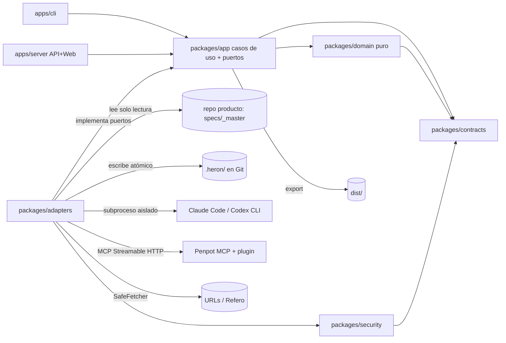

## Metadatos

- **Proyecto:** `navori-heron`
- **Etapa:** `01-heron`
- **Fecha:** 2026-09-30
- **Modo:** `template` (greenfield; sin código de producto; stack = decisión abierta, `context/CODEBASE.md` § Stack)
- **Plan:** `plan2`
- **Prioridad de desempate:** **solidez**. Van primero los contratos, la máquina de estados, el determinismo, la seguridad (SSRF, path traversal, prompt injection y secretos), la recuperabilidad, la reproducibilidad y la testabilidad. Cuando dos opciones empatan en valor, este plan elige la más robusta y lo dice en cada punto.
- **Archivos de `context/md/` leídos:** `context/md/PLAN.md` (completo, §intro–§80 y "Resultado esperado").
- **Otros insumos leídos:** `context/DIGEST.md`, `context/CODEBASE.md`, `context/INTAKE.md`, `DECISIONS.md` (D1: seguir con plan maestro), `state.json` (fase `mapped`).
- **Etapas cerradas leídas:** ninguna (etapa 1).
- **Verificación externa (refs usadas, tras `git fetch origin main`):**
  - `UlisesCm/navori-harness` @ `origin/main` 44afd63 (2026-09-30).
  - `UlisesCm/monorepo-fullstack` @ `origin/main` e24995a (2026-09-30).
  - Docs oficiales de Penpot, Penpot MCP, W3C DTCG 2025.10, WCAG 2.2, Refero, Zod, Bun, Claude Code y Codex; el registro npm y el de Docker Hub. Todos se consultaron el 2026-09-30 y se citan en "Stack y librerías".

## Resumen ejecutivo

Navori Heron es una herramienta autohospedable e independiente de Navori Harness (context/md/PLAN.md §intro, §1, §75.1). Convierte el modelo funcional de un producto (idealmente un master-plan con `UX.md` + `ux.json`) en un **contrato de diseño neutral y versionado**: research con provenance, dirección visual, foundations, tokens W3C DTCG, componentes, patterns, pantallas con estados, validación y export portable. Penpot funciona como representación editable, no como fuente de verdad (§30).

Este plan propone construirlo en 14 partes con el mismo orden de fondo:

1. Primero, contratos Zod versionados, una máquina de estados pura con gates atados a hashes y un almacén `.heron/` atómico y recuperable.
2. Luego, las primitivas de seguridad para contenido no confiable, antes de que cualquier research o IA las necesite.
3. Después, el motor determinista de diseño (DTCG, contraste, validadores, coverage, export reproducible), probado con un diseño de fixture escrito a mano. Así la salida de la IA queda sometida a validadores desde el primer día.
4. Al final, la IA, Penpot y la Web UI, siempre detrás de puertos.

Cuatro hallazgos verificados cambian el alcance:

- **(a)** Hoy el master-plan de Harness **no produce `UX.md` ni `ux.json`**: `git grep -i -E 'ux\.json|UX\.md' origin/main` en `navori-harness` 44afd63 no devuelve coincidencias de producto. Heron tiene que leer un contrato UX que todavía no existe (ver Riesgos R1 y Preguntas abiertas Q1).
- **(b)** Penpot MCP opera ejecutando JavaScript arbitrario con la Plugin API a través de la herramienta `execute_code`. Necesita una pestaña del navegador con el plugin conectado a la página en foco (https://help.penpot.app/mcp/, consultado 2026-09-30). Su modo multiusuario está marcado como "under development" (`penpot/penpot` `mcp/docs/multi-user-mode.md` @2.17.2) y tiene el bug abierto #12003 en 2.18.0. Por eso este plan compila la escritura en Penpot de forma **determinista** a partir de plantillas versionadas y **nunca** deja que un LLM escriba código para Penpot en V1.
- **(c)** Claude Code en modo `--bare` no usa la suscripción, y sin `--bare` ejecuta hooks y servidores MCP del directorio de trabajo (https://code.claude.com/docs/en/headless, consultado 2026-09-30). Por eso los agentes CLI se invocan en un directorio aislado y con herramientas deshabilitadas.
- **(d)** El primer consumidor tiene tokens como constantes TypeScript, no DTCG (`monorepo-fullstack` `packages/tokens/src/index.ts:1-10` @e24995a). El adaptador DTCG→TS queda del lado del consumidor (§47).

## Alcance (MoSCoW)

**Must (V1)**

- M1. `heron init [path] [--stage <NN-slug>] [--dry-run]` detecta el master-plan de Navori y la presencia de los 8 artefactos (§37, §38), e imprime la tabla de presencia y el modo.
- M2. Los dos modos obligatorios: `full` solo con `UX.md` + `ux.json` presentes y válidos, y `reference-only` en cualquier otro caso. Toda operación de producción en `reference-only` sale con código 3 y no escribe nada (§3, §69, §75.11).
- M3. `ProductContext` v1 con `SourceRef` por elemento. Precedencia de fuentes (§6), con registro `CONFLICT` y resolución humana explícita (`heron conflicts resolve`).
- M4. Una máquina de estados explícita y pura, con precondiciones nombradas y gates humanos atados a hashes de artefactos (§41, §42).
- M5. Persistencia en `.heron/` apta para Git: escrituras atómicas, lock de un solo escritor, staging por run, recuperación tras caída y JSON canónico (§43, §59, §62).
- M6. Primitivas de seguridad: SafePath, SafeFetcher anti-SSRF, saneo de uploads con borrado de metadata, escáner de inyección, guarda de secretos al escribir y redacción de logs (§54–§56, §66).
- M7. El puerto `AgentProvider` con los adaptadores `claude-code-cli`, `codex-cli` y `fake` (replay determinista). También: roles configurables sin proveedor fijo, context packs, salida estructurada validada con Zod y provenance de cada invocación (§48–§53, §67).
- M8. Research con `ResearchSource` (URL, captura, imagen local, DESIGN.md externo, referencia manual) y provenance completa. Salida reference-only según §69 (§7, §9, §57).
- M9. Brand intake con origen por dato (§12) y color intelligence determinista (§13).
- M10. Tres direcciones visuales con los 13 atributos y un gate de selección (§11).
- M11. Foundations en 14 áreas y tokens DTCG 2025.10 en capas (primitive → semantic → component solo cuando se justifica). Temas light/dark con el Resolver module. `DESIGN.md` (§17–§20).
- M12. Componentes derivados de `ux.json`, patterns ligados a pantallas, pantallas representativas y luego todas, con sus estados relevantes (§22–§26).
- M13. Los 14 validadores (§28), findings de accesibilidad PASS/WARNING/FAIL con evidencia (§27), coverage (§29) y quality gates por las 11 categorías (§68).
- M14. `heron export` a `dist/` con manifest (§46), checksums y JSON Schemas incluidos, reproducible byte a byte (§45, §67).
- M15. `heron revise` con registro `Revision` y garantía de preservación (§58).
- M16. Penpot: `penpot doctor` con falla rápida, `penpot inspect` de solo lectura y `penpot sync` determinista e idempotente de tokens, componentes y pantallas, más detección de drift (§30–§33).
- M17. Web UI de control plane con las vistas mínimas de §39 y la comparación lado a lado de §40, con autenticación.
- M18. `docker compose up` de Heron. Penpot se despliega como proyecto compose separado a partir del compose oficial en un tag fijado, con runbooks de secretos, HTTPS, backups y upgrade (§31, §63, §64).
- M19. Fixtures E2E `membership-product` (full), `membership-slice` (1 flow, 3 pantallas), `no-ux`, `ux-md-only`, `ux-json-only` y fixtures adversariales (§73).
- M20. La documentación mínima de §74 (11 archivos).

**Should**

- S1. Los adaptadores de entrada `markdown` y `manual` (§4).
- S2. Las fuentes Refero Styles (URL pública vía SafeFetcher) y Refero MCP (opcional, con token) (§8).
- S3. Revisión creator → reviewer en dirección, foundations y pantallas (§51).
- S4. `heron run`, que avanza hasta el siguiente gate pendiente y nunca aprueba gates (§41).
- S5. OpenAPI de `/api/v1` generado desde Zod.
- S6. Tests de propiedades (fast-check) para SafePath, JSON canónico y la máquina de estados.
- S7. Página "References" en Penpot para el modo reference-only (§69).

**Could**

- C1. Adaptadores de API directa (Anthropic, OpenAI) detrás del mismo puerto `AgentProvider` (§48, "implementaciones futuras").
- C2. Un diseño Penpot existente como `ResearchSource`, reusando `penpot inspect` (§7).
- C3. `docs/deployment/railway.md`, solo después de que Docker funcione (§65).

**Won't (V1)**

- W1. SaaS multi-tenant (§34).
- W2. Adaptadores de implementación Mantine, Unistyles, Tailwind, React o RN (§47).
- W3. Escribir `.penpot` o tocar la DB de Penpot (§32).
- W4. LangChain, LangGraph, Temporal, Kafka, Redis, base de datos vectorial ni ninguna otra DB propia en V1 (§60, §62).
- W5. `heron run --auto` (§41: "no debe ser el comportamiento inicial").
- W6. Importar automáticamente ediciones hechas en Penpot. Solo se reporta drift [SUPUESTO].
- W7. Adaptadores Jira, Notion o Linear (§4, "más adelante").
- W8. Un LLM que opere Penpot libremente con `execute_code`.
- W9. Un control de versiones propio (§59).

## Actores y permisos

| Actor | Puede | No puede |
|---|---|---|
| **Operador self-host** | Instalar Heron y Penpot. Configurar secretos, tokens de acceso nombrados, allowlist de servicios locales, versión de Penpot, backups y upgrades. Ejecutar toda la CLI (§31, §34, §64). | Ver secretos en logs o en artefactos (RN-32). Hacer que Heron escriba en `specs/_master/` (RN-39). |
| **Diseñador / product owner** (portador de un token nombrado o usuario local de la CLI) | Ejecutar el pipeline. Aprobar o rechazar gates, con su identidad registrada. Resolver `CONFLICT`. Seleccionar dirección. Pedir `revise`. Revisar en Penpot (§41, §58). | Saltarse la guarda de modo (RN-2) o un gate con FAIL. Modificar `ux.json` desde Heron (RN-10). Exportar con FAIL (RF-31). |
| **Cliente del producto diseñado** | Aportar marca y preferencias a través del diseñador; cada dato queda como `provided` (§12). | Acceder a Heron directamente en V1 [SUPUESTO]. |
| **Repo consumidor** (p. ej. `monorepo-fullstack`) | Leer `dist/` y validarlo con los JSON Schemas incluidos, sin instalar Heron (§45). | Recibir themes ni componentes de implementación (§47). |
| **Agentes IA** (roles de §50) | Proponer salidas **restringidas a un schema** a partir de un context pack (§52). | Ejecutar herramientas, leer fuera de su directorio aislado, escribir archivos, cambiar estado o aprobar gates. Su salida siempre pasa por validación Zod y por gates (RN-33). |
| **Penpot** (sistema) | Renderizar y permitir la edición visual (§30). | Ser fuente de verdad (RN-23). |

En V1 hay un solo rol autorizado (cualquier token válido equivale a diseñador u operador), y la identidad se registra en cada aprobación [SUPUESTO; ver Q6].

## Reglas de negocio

- **RN-1** Heron no depende de Navori Harness; la integración con Harness es un adaptador de entrada (context/md/PLAN.md §1, §75.1, §75.2).
- **RN-2** El modo `full` se activa solo cuando `UX.md` y `ux.json` existen **y** son válidos (context/md/PLAN.md §3 Mode B, §75.11).
- **RN-3** Si faltan ambos, el modo es `reference-only`. Queda bloqueado producir: inventario de pantallas definitivo, journeys y flows definitivos, design system de producción, sistema de componentes, tokens finales, pantallas finales, diseño de producción en Penpot y export de producción (context/md/PLAN.md §3 Mode A, §69).
- **RN-4** Si existe solo uno de los dos archivos, Heron informa la inconsistencia, no infiere el faltante, cae en `reference-only`, permite el research y bloquea producción y export (context/md/PLAN.md §3).
- **RN-5** Todo output de modo reference se marca explícitamente `reference-only` (context/md/PLAN.md §3, §69).
- **RN-6** Heron no redefine el contrato de `UX.md` ni de `ux.json`, y los IDs de origen (`ACT-*`, `J01`, `F01`, `M01`, `D01`, `P01`, `PT01`) se conservan sin cambios (context/md/PLAN.md §2).
- **RN-7** Precedencia de fuentes: DECISIONS.md > MASTER.md > parts.json > ux.json > UX.md > DIGEST.md > CODEBASE.md > context/md/* > inferencia. Una contradicción genera un `CONFLICT` con archivos, valores e impacto, y Heron no elige en silencio (context/md/PLAN.md §6).
- **RN-8** `ux.json` y `UX.md` no pueden contradecir reglas de negocio ni decisiones de MASTER.md o DECISIONS.md (context/md/PLAN.md §6).
- **RN-9** Heron preserva: reglas de negocio, roles, permisos, requisitos funcionales, decisiones explícitas, capacidades, pantallas requeridas, estados críticos, flows obligatorios y restricciones de dominio (context/md/PLAN.md §15).
- **RN-10** Toda modificación significativa sobre `ux.json` se registra como `UX-PROPOSAL` (original, propuesta, razón, requisitos preservados, impacto). El archivo fuente nunca se modifica (context/md/PLAN.md §16). El umbral de "significativa" es [SUPUESTO] (ver Q8).
- **RN-11** Las referencias son evidencia, no plantillas. Cada una registra: fuente, URL u origen, fecha de captura, razón, qué se estudia, qué no copiar y qué decisiones influye (context/md/PLAN.md §9, §10, §75.12).
- **RN-12** El research parte del trabajo que hace la interfaz (categoría, flow, tipo de pantalla, pattern, elemento, estilo, densidad, estrategia de contenido, navegación), nunca de "beautiful UI" (context/md/PLAN.md §8).
- **RN-13** Cada dato de marca registra su origen: `provided`, `derived`, `inferred` o `reference-derived`. Una inferencia nunca se registra como decisión del cliente (context/md/PLAN.md §12, §75.14).
- **RN-14** Un color de marca inutilizable para una función no se descarta en silencio. Se genera una variante que preserva tono, carácter e identidad percibida, y se registra la decisión (context/md/PLAN.md §13).
- **RN-15** En `full` se generan 3 direcciones con 13 atributos cada una, más un gate de selección. No se genera el sistema completo antes de seleccionar (context/md/PLAN.md §11).
- **RN-16** Los tokens son compatibles con DTCG y van en capas primitive → semantic → component. Los component tokens se crean solo si aportan valor, y hay que evitar la explosión de tokens (context/md/PLAN.md §18). La semántica mínima y los estados se definen en §19.
- **RN-17** `DESIGN.md` explica cómo y por qué se usan los valores, y no copia `UX.md` (context/md/PLAN.md §20).
- **RN-18** Los anti-patterns de §21 no están prohibidos, pero cada uso exige una justificación registrada (context/md/PLAN.md §21).
- **RN-19** Los componentes se derivan de `ux.json`, patterns y pantallas, no de una lista estándar. Cada pattern se liga a las pantallas que lo usan (context/md/PLAN.md §22, §23).
- **RN-20** En `full` se diseñan todas las pantallas de `ux.json`: primero un set representativo y, después de validar foundations, el resto (context/md/PLAN.md §24).
- **RN-21** Cada pantalla conserva los campos heredados de §25 y agrega los campos de Heron. Se revisan los estados relevantes de §26, más allá del happy path (context/md/PLAN.md §25, §26).
- **RN-22** La accesibilidad y la calidad se expresan como findings PASS/WARNING/FAIL con evidencia, sin score 0-100 (context/md/PLAN.md §27, §68).
- **RN-23** Ni Penpot ni Refero son fuente de verdad. La fuente son los contratos neutrales de Heron (context/md/PLAN.md §30, §75.3, §75.4).
- **RN-24** Sin fork de Penpot, sin tocar su DB y sin generar ni modificar el formato `.penpot` en V1 (context/md/PLAN.md §31, §32).
- **RN-25** Los requisitos interactivos de Penpot MCP (archivo activo, plugin conectado, MCP key) se detectan, se muestran y fallan rápido, sin esperas indefinidas (context/md/PLAN.md §33).
- **RN-26** Los gates humanos están activos por default; la ejecución automática llega después (context/md/PLAN.md §41).
- **RN-27** Las decisiones de diseño viven en artefactos portables versionados en Git, nunca solo en una DB. Git es el historial y Heron guarda `designRevision` y `schemaVersion` (context/md/PLAN.md §43, §59).
- **RN-28** V1 no produce themes ni componentes de implementación (context/md/PLAN.md §47, §75.6).
- **RN-29** Heron nunca inventa métricas, precios, permisos, capacidades ni reglas. El contenido de preview se marca `DEMO`, `PLACEHOLDER` o `SYNTHETIC` (context/md/PLAN.md §71, §75.13).
- **RN-30** Documentos, páginas, DESIGN.md externos, capturas y el propio contexto del master son **datos**. Sus instrucciones nunca se ejecutan y los hallazgos sospechosos se registran (context/md/PLAN.md §54, §56).
- **RN-31** Protección SSRF: se bloquean localhost, endpoints de metadata, rangos privados, `file://` y protocolos inesperados, salvo una operación local explícitamente autorizada (context/md/PLAN.md §55).
- **RN-32** Nunca se registran en logs API keys, tokens MCP, tokens de sesión ni secretos de documentos (context/md/PLAN.md §66).
- **RN-33** El trabajo determinista nunca se delega a un LLM (context/md/PLAN.md §53, §75.10).
- **RN-34** Una suscripción no equivale a créditos de API. Los agentes CLI se autentican por fuera y Heron no guarda sus credenciales (context/md/PLAN.md §48, §49).
- **RN-35** Ningún proveedor queda fijo a un rol (context/md/PLAN.md §51).
- **RN-36** Una revisión conserva todo lo que no se pidió cambiar y registra revisión, razón, artefactos afectados, valores previos y valores nuevos (context/md/PLAN.md §58).
- **RN-37** El export se entiende sin instalar Heron e incluye un manifest con los campos de §46 (context/md/PLAN.md §45, §46).
- **RN-38** Heron es autohospedable para una sola organización, sin multi-tenant, y se ejecuta en local, en Docker y en servidor (context/md/PLAN.md §34).
- **RN-39** Heron nunca escribe en los archivos del repo fuente fuera de su raíz `.heron/` ni en `dist/`. Los archivos del master-plan son de solo lectura [SUPUESTO; se deriva de §1 y §16].
- **RN-40** Una aprobación de gate queda atada a los hashes de los artefactos aprobados; si alguno cambia, la aprobación se invalida [SUPUESTO; se deriva de §41 y §42].
- **RN-41** En cada comando se recalcula la huella de las entradas. Si una entrada cambió, los artefactos dependientes se marcan `stale`, y si desaparece `UX.md` o `ux.json` el modo se degrada a `reference-only` [SUPUESTO; se deriva de §3 y §42].
- **RN-42** Todo contenido que Heron crea en Penpot lleva la marca `heron`. Las ediciones humanas en Penpot se reportan como drift y no se importan en silencio [SUPUESTO; se deriva de §30].

## Requisitos funcionales

**Intake y modo (P4, P7)**

- **RF-1** `heron init [path]` detecta estos artefactos y muestra una tabla de presencia (§37): `navori.config.json`, `<sdd.specsDir>/_master/index.json` (default `specs`, `navori-harness` `packages/cli/src/lib/config/schema.ts:152`), la etapa activa, `MASTER.md`, `DECISIONS.md`, `parts.json`, `UX.md`, `ux.json`, `context/DIGEST.md` y `context/CODEBASE.md`.
- **RF-2** `--stage <NN-slug>` selecciona cualquier etapa listada en `index.json`, esté activa o cerrada. Una etapa inexistente produce un error que lista las disponibles (§38).
- **RF-3** Se registra un `ModeDecision` (`full` o `reference-only`) con estas razones: presencia y validez de cada archivo, versión de `ux.json` soportada o no, e inconsistencias.
- **RF-4** Se construye un `ProductContext` v1 con los 19 bloques de §5. Cada elemento lleva un `SourceRef` (archivo, puntero o línea, y rango de autoridad según RN-7).
- **RF-5** Las contradicciones entre fuentes generan un `CONFLICT` (`conflicts.json`). `heron conflicts resolve <CONFLICT-n> --keep <source> --note <texto>` registra la decisión humana. El gate `intake` no se aprueba mientras quede un `CONFLICT` abierto [SUPUESTO].
- **RF-6** `heron status [--json]` muestra: modo, etapa, conteos de surfaces, screens, flows y patterns, fase, gates pendientes, artefactos `stale` y los comandos permitidos en ese momento (formato del "Resultado esperado" del brief).
- **RF-7** Cada comando recalcula `intake/inputs.lock.json` (sha256 por fuente) y aplica RN-41.
- **RF-8** `heron doctor [--json] [--deep]` ejecuta checks con id, severidad y remedio, y sale con 0 si no hay ningún FAIL. En P4 incluye runtime, repo, permisos y lock. P6 le agrega los checks de agentes y P12 los de Penpot.
- **RF-9** Adaptadores de entrada: `navori-master` y `filesystem` (P4); `markdown` y `manual` (P7) (§4).

**Estado y persistencia (P3)**

- **RF-10** `heron gate <gate> approve|reject [--note]` registra la identidad y los hashes de los artefactos. Las transiciones siguen la tabla de "Contratos › Máquina de estados".
- **RF-11** Toda escritura es atómica. Un solo escritor por proyecto (lock). Si un run se interrumpe, el siguiente comando lo reporta y descarta su staging sin corromper `state.json`.

**Seguridad de contenido (P5)**

- **RF-12** SafeFetcher: permite solo `https`, y `http` únicamente en la allowlist del operador. Resuelve el DNS y valida cada IP. Conecta a la IP validada con SNI. Maneja redirecciones a mano, hasta 5, revalidando cada salto. Aplica timeouts, límite de tamaño y allowlist de content-type.
- **RF-13** Uploads: verifica los magic bytes, limita peso y píxeles, recodifica sin metadata EXIF/XMP/GPS y nombra cada archivo por su sha256. SVG solo se acepta como logo de marca y se sirve únicamente dentro de `` [SUPUESTO].
- **RF-14** El escáner de inyección detecta patrones de instrucción en contenido externo y registra un `SecurityFinding` sin alterar el contenido.
- **RF-15** La guarda de secretos bloquea la escritura de cualquier artefacto que contenga un valor de secreto cargado o un patrón de token conocido. El logger redacta por nombre de clave, por valor de secreto cargado y por los parámetros de URL `userToken`, `token`, `key` y `secret`.

**IA (P6)**

- **RF-16** Los adaptadores `claude-code-cli`, `codex-cli` y `fake` corren en un directorio temporal aislado que contiene solo el context pack. Sin herramientas (salvo `Read` de ese directorio para tareas con imagen), sin persistencia de sesión y sin servidores MCP.
- **RF-17** La configuración asigna roles a perfiles de proveedor (creator y reviewer), sin valores fijos en el código (§50, §51).
- **RF-18** Las plantillas de prompt están versionadas en `prompts/<role>/<task>.v<N>.md`. Los context packs se arman por tarea con selectores declarados y un presupuesto de bytes (§52).
- **RF-19** La salida estructurada se pide con JSON Schema generado desde Zod y se valida con Zod. Si falla, hay hasta 2 reintentos de reparación y después el paso falla con los errores registrados.
- **RF-20** Cada invocación registra: proveedor, modelo, versión de la CLI, id, versión y sha256 de la plantilla, sha256 del pack, sha256 de la salida, duración, y uso y costo cuando el proveedor los expone (§66, §67).

**Research (P7)**

- **RF-21** Las fuentes de `ResearchSource` son `url`, `local-image`, `screenshot`, `design-md`, `manual`, `refero-styles-url` y `refero-mcp` (opcional). `penpot-existing` queda como stub hasta P12 (§7).
- **RF-22** Las consultas de research se derivan de las facetas del `ProductContext`. Una consulta que no cite al menos una faceta de RN-12 se rechaza.
- **RF-23** Provenance por referencia según §9, más los recortes de §57 (x, y, w, h y nota) y los `SecurityFinding` asociados.
- **RF-24** `heron brand add <kind> <valor|ruta|url> --origin <origen>` cubre los 11 tipos de §12.
- **RF-25** Salida reference-only: `REFERENCES.md`, `references.json`, `visual-directions.json`, `moodboards/` y `provenance.json`, todos con `mode: "reference-only"` (§69).

**Motor determinista (P8)**

- **RF-26** Validación DTCG 2025.10 (Format): tipos, alias `{}` y `$ref` JSON Pointer, ciclos y nombres. Temas light/dark con el Resolver module.
- **RF-27** Motor de color: conversiones OKLCH, escalas, neutrales, roles, contraste WCAG 2.x y variantes de marca con decisión registrada (§13).
- **RF-28** Los 14 validadores de §28.
- **RF-29** Checks de accesibilidad de §27, con evidencia (par de colores, ratio medido y umbral).
- **RF-30** Coverage: respuesta a las 6 preguntas de §29, con la lista de IDs infractores.
- **RF-31** Quality gates por las 11 categorías de §68. Cualquier FAIL bloquea el export (código de salida 4).
- **RF-32** `heron export [--out dist]` produce la estructura de §45, más `schemas/*.schema.json` y `validation/report.json`, con un manifest que cubre los campos de §46 y un sha256 por archivo.

**Dirección y foundations (P9)**

- **RF-33** Tres direcciones (DIR-A, DIR-B y DIR-C) con los 13 atributos de §11, cada una con al menos 1 `REF-*` existente. `heron direction select <DIR-x>`.
- **RF-34** Foundations en las 14 áreas de §17. Tokens en capas con `themes/light` y `themes/dark`.
- **RF-35** `DESIGN.md` con las 14 secciones de §20. Todo token que cite debe existir.
- **RF-36** Detectores de los 15 anti-patterns de §21. Cada ocurrencia sin `justification` es WARNING.

**Sistema y pantallas (P10, P11)**

- **RF-37** Derivación de componentes con justificación y trazabilidad a pantallas y patterns.
- **RF-38** Patterns ligados a las pantallas que los usan (§23).
- **RF-39** Selección determinista de pantallas representativas que cubre las 9 categorías de §24 presentes en el producto, más el gate `representative-screens`.
- **RF-40** Un `ScreenDesign` por pantalla con los campos de §25, `layoutTree`, estados relevantes (§26) y un `.md` legible para humanos junto a cada JSON (§75.8).
- **RF-41** Registro de `UX-PROPOSAL` (§16).
- **RF-42** `heron revise "<instrucción>" [--scope <artefactos>]` según RN-36. La fase retrocede al punto más temprano afectado y los gates posteriores se invalidan.
- **RF-43** `heron run` avanza hasta el siguiente gate pendiente. Una generación por lotes interrumpida retoma solo las pantallas cuyo hash de entrada cambió o que quedaron sin generar.

**Penpot (P12)**

- **RF-44** `heron penpot doctor` verifica: URL, handshake MCP, disponibilidad de `execute_code`, plugin conectado, identidad del archivo abierto (`fileId`) y coincidencia de versiones entre Penpot y MCP.
- **RF-45** `heron penpot inspect` es de solo lectura: páginas, componentes, token sets y temas, y formas con marca `heron`.
- **RF-46** `heron penpot sync [--dry-run]` compila los contratos a un plan de operaciones y luego a scripts de plantillas versionadas. Cubre tokens (sets y temas), componentes y pantallas, con marca `setSharedPluginData("heron", …)`, y es idempotente.
- **RF-47** Detección de drift, evidencia visual con `export_shape` y el gate `visual-review`.

**Web UI (P13)**

- **RF-48** API `/api/v1` que reutiliza los mismos casos de uso que la CLI.
- **RF-49** Las vistas de §39 más la comparación de §40.
- **RF-50** Autenticación con tokens nombrados. Por default se enlaza solo a loopback, y el servidor se niega a arrancar en otra interfaz si no hay tokens configurados.

**Operación (P14)**

- **RF-51** Imagen Docker de Heron y `compose.yaml` de Heron.
- **RF-52** `infra/penpot/` con el compose oficial vendorizado en un tag fijado, su sha256 y un override. Runbooks de §64.
- **RF-53** Logs JSON estructurados y un journal por run (§66).
- **RF-54** Los 11 documentos de §74.

## Requisitos no funcionales

| Id | Requisito | Medida | Umbral |
|---|---|---|---|
| RNF-1 | Export reproducible | Dos `heron export` con las mismas entradas y el mismo `SOURCE_DATE_EPOCH` | Byte a byte idénticos en 100 % de los archivos (`diff -r` vacío) |
| RNF-2 | Latencia de `init` y `status` | Tiempo de pared sobre `membership-product` (≤ 50 pantallas) en el runner de CI | p95 ≤ 2 s en 20 ejecuciones [SUPUESTO] |
| RNF-3 | Consistencia ante caída | Fallo inyectado en cada punto de escritura k = 1..N de cada paso | En 100 % de los casos, `state.json` parsea y ningún artefacto referenciado falta |
| RNF-4 | Falla rápida de Penpot | Tiempo hasta el diagnóstico con el plugin desconectado o Penpot caído | ≤ 10 s [SUPUESTO]; timeout por llamada MCP ≤ 30 s [SUPUESTO] |
| RNF-5 | Invocaciones de IA acotadas | Timeout, reintentos y presupuesto | Timeout ≤ 600 s por invocación, ≤ 2 reintentos de reparación, `maxBudgetUsd` configurable por run [SUPUESTO] |
| RNF-6 | Cero fuga de secretos en artefactos | Secretos canario en la suite E2E; búsqueda en `.heron/` y `dist/` | 0 ocurrencias |
| RNF-7 | Cobertura de tests | `bun test --coverage` | `packages/domain` y `packages/security` con ≥ 90 % de líneas; global ≥ 80 % [SUPUESTO] |
| RNF-8 | Accesibilidad del diseño generado | Pares semánticos texto/fondo, UI/fondo, foco y target | Texto ≥ 4.5:1, texto grande ≥ 3:1, UI y foco ≥ 3:1 (WCAG 2.2 SC 1.4.3 y 1.4.11); target ≥ 24×24 CSS px (SC 2.5.8) en web; ≥ 44×44 pt en mobile [SUPUESTO, Q13] |
| RNF-9 | Arranque self-host | `docker compose up -d --wait` desde clon limpio hasta `/healthz` 200 | ≤ 120 s; imagen ≤ 300 MB [SUPUESTO] |
| RNF-10 | Cobertura de autenticación | Recorrido de la tabla de rutas sin token | 100 % de las rutas, salvo `/healthz`, responde 401 |
| RNF-11 | Límites de upload | Tamaño y píxeles decodificados | ≤ 20 MB y ≤ 50 MP; si no, 413 o 422 [SUPUESTO] |
| RNF-12 | SSRF | Corpus de vectores (sección Seguridad) | 100 % bloqueado, incluidas redirecciones y rebinding |
| RNF-13 | Provenance de IA completa | Campos de RF-20 en cada `AgentInvocation` | 100 % de las invocaciones |
| RNF-14 | Redacción de logs | Secretos canario y `userToken` en toda la suite | 0 ocurrencias en stdout, stderr y journals |
| RNF-15 | Control de explosión de tokens | Conteo de tokens semánticos y de componente | WARNING si semánticos > 300 o component tokens > 3 × número de componentes [SUPUESTO] |
| RNF-16 | Duración del quality gate | `bun run check` en CI | ≤ 5 min [SUPUESTO] |
| RNF-17 | Pocas dependencias | Dependencias directas de runtime en todos los `package.json` | ≤ 8 [SUPUESTO] |
| RNF-18 | Portabilidad del núcleo | Referencias a `Bun` o `bun:` en `contracts`, `domain` y `app` | 0 |
| RNF-19 | Recursos del fetcher | Timeouts y tamaño | Conexión ≤ 5 s, total ≤ 20 s, cuerpo ≤ 20 MB, ≤ 5 redirecciones [SUPUESTO] |

## Dominio y datos

**Entidades** (todas son documentos JSON con `kind`, `schemaVersion` y un orden canónico de claves):

- `HeronProject` (`.heron/project.json`): id del proyecto, nombre, fuente (adaptador, ruta relativa y etapa), configuración de Penpot (`enabled`, `url`, `fileId`, `version`), perfiles de proveedores por rol, `heronVersion` de creación.
- `HeronState` (`.heron/state.json`): `stateRevision` (entero monotónico), `mode`, `phase`, `gates[]` (nombre, estado, por quién, cuándo, hashes de artefactos), `stale[]`, `history[]` de transiciones con las precondiciones evaluadas, y `designRevision`.
- `ModeDecision`, `SourceRef`, `ProductContext` (§5), `Conflict` (§6), `Decision` (origen `provided`, `derived`, `inferred` o `reference-derived`; incluye resoluciones de conflicto y waivers), `UxProposal` (§16), `Revision` (§58).
- `ResearchReference` (REF-001…), `Provenance`, `Crop`, `SecurityFinding`, `BrandInput`, `VisualDirection` (DIR-A…C).
- `Foundations`, `TokenDocument` (DTCG), `ResolverDocument` (DTCG Resolver), `DesignSystem`, `ComponentSpec` (`CMP-<PascalName>`), `PatternSpec` (usa los `PT*` de ux.json), `ScreenDesign` (usa los IDs de ux.json), `LayoutNode`, `StateSpec`.
- `ValidationReport` y `Finding` (regla, categoría de §68, severidad, evidencia `{artifact, pointer, measured, threshold}`).
- `Manifest` (§46).
- `RunRecord` y `AgentInvocation`.
- `PenpotSyncState` (mapa de id Heron → id Penpot con su hash).

**Relaciones:**

- `ProductContext` 1—N `SourceRef`.
- `Conflict` N—N `SourceRef`.
- `ResearchReference` N—N `Decision`, a través de `influences`.
- `VisualDirection` N—N `ResearchReference`.
- `TokenDocument`: semantic → primitive y component → semantic, por alias.
- `ComponentSpec` N—N `ScreenDesign` y `PatternSpec`.
- `ScreenDesign` → flows, journeys y requisitos, por IDs de origen.
- `Finding` → artefacto y puntero.
- `Gate` → hashes de artefactos.
- La **matriz de dependencias entre artefactos** (intake → research → directions → foundations/tokens → system → screens → penpot → validation → export) define la propagación de `stale`, el alcance de `revise` y la invalidación de gates.

**Ciclo de vida:** los artefactos se crean en staging (`.heron/staging/<runId>/`), se promueven por rename y, al final, se escribe `state.json`, que es el punto de commit. Un cambio en una entrada marca los dependientes como `stale` sin borrarlos, y `revise` los regenera. Nada de diseño se borra salvo por un comando explícito, y Git conserva la historia.

**Retención:**

- Artefactos de diseño: permanentes en Git.
- `.heron/runs/` (journals y transcripciones redactadas): locales, ignorados por Git, retenidos 30 días o los últimos 50 runs [SUPUESTO].
- `.heron/cache/` (respuestas fetch direccionadas por contenido): ignorada por Git, LRU con 1 GB máximo [SUPUESTO].
- Originales de uploads: no se retienen; solo la versión saneada [SUPUESTO].
- Instantáneas de Penpot: ignoradas por Git, se regeneran con cada `sync`.

**Layout de `.heron/`** (analizado a partir de §44, no copiado tal cual):

```text
.heron/
├── project.json · state.json · .gitignore (runs/ cache/ staging/ penpot/snapshots/)
├── intake/ product-context.json · mode.json · conflicts.json · inputs.lock.json
├── decisions/ decisions.json (Decision, UX-PROPOSAL, Revision, waivers)
├── brand/ brand.json · assets/<sha256>.<ext>
├── research/ REFERENCES.md · references.json · provenance.json · visual-directions.json · moodboards/ · images/<sha256>.webp
├── design/ DESIGN.md · design-system.json · foundations/*.json
│   ├── tokens/ primitives.tokens.json · semantic.tokens.json · components.tokens.json · themes/{light,dark}.tokens.json · heron.resolver.json
│   └── components/ · patterns/ · screens/<ID>.json + <ID>.md
├── validation/ report.json · REPORT.md
├── penpot/ sync-state.json · snapshots/
└── runs/ · staging/ · cache/
```

## Arquitectura

### Drivers de decisión (tomados de las reglas del propio proyecto)

- D1: las 15 reglas de §75.
- D2: la calidad objetivo de §79 (contratos explícitos, schemas versionados, validadores deterministas, adapters, máquina de estados limpia, trazabilidad, testabilidad).
- D3: la separación determinista/IA de §53.
- D4: la seguridad de §54–§56.
- D5: persistencia en filesystem + Git sin sacrificar recuperación de §62.
- D6: la regla de simplicidad y las dependencias vetadas de §60 y §78.
- D7: `CLAUDE.md` del repo: `any` prohibido, tipado explícito, tests para lógica no trivial (`context/CODEBASE.md` § Convenciones).
- D8: la prioridad de este plan, **solidez**.

### Opciones por decisión estructural

**A. Runtime y toolchain**

1. **Patrón existente del ecosistema:** Node 24 como runtime con Bun como gestor de paquetes, `vitest`, `citty` y `tsdown`, igual que `navori-harness` (`package.json` `packageManager: bun@1.4.2`, `.nvmrc` 24.20.0, `packages/cli/package.json` con `citty ^0.1.6`, `vitest ^5.0.1` y `zod ^4.4.3`, @44afd63). Requiere dos runtimes y 3 dependencias de desarrollo más.
2. **Extensión:** Bun 1.4.2 como runtime, gestor de paquetes, test runner (`bun test`) y bundler (`bun build --compile` produce un binario único, útil para self-host), con `node:util` `parseArgs` para la CLI. Se agrega una **regla de portabilidad**: `contracts`, `domain` y `app` no referencian `Bun` ni `bun:`, verificada por un test (RNF-18). El costo de revertir es bajo: solo `adapters` y `apps` tocan APIs de Bun.
3. **Otro lenguaje (Go, Python):** descartado. El brief prefiere TypeScript + Zod (§5, §60) y los schemas de Harness ya son Zod (`navori-harness` `packages/cli/src/lib/master/schema.ts:9`). Cambiar de lenguaje obligaría a duplicar los schemas.

**Recomendación: opción 2.** Cumple la preferencia de §60 con menos dependencias (RNF-17), un solo runtime fijado y un binario reproducible. La regla de portabilidad mantiene abierta la salida hacia la opción 1. La opción 1 no se elige porque agrega runtime y dependencias sin ganar robustez medible.

**B. Persistencia**

1. **Filesystem + Git**, con escrituras atómicas, lock, staging y `state.json` como punto de commit.
2. Lo anterior más SQLite (`bun:sqlite`) para jobs y sesiones.
3. PostgreSQL: descartado, porque §62 prefiere simplicidad y no hay necesidad de concurrencia multiusuario.

**Recomendación: opción 1.** Las sesiones se resuelven sin estado (tokens y cookie firmada) y los jobs quedan en el journal. SQLite entra solo si una necesidad demostrada lo exige. Así cada decisión vive en un solo lugar portable (§43) y el costo de revertir es bajo, porque el puerto `FileStore` aísla la implementación.

**C. Escritura en Penpot**

1. **Modo nativo de Penpot MCP:** el LLM escribe y ejecuta JavaScript con `execute_code` (el README de `penpot/penpot` `mcp/README.md` @2.17.2 dice: "The LLM is free to write and execute arbitrary code snippets"). No es determinista ni idempotente, y una inyección en una referencia se convierte en ejecución de código en la sesión del navegador del diseñador.
2. **Compilador determinista:** contratos neutrales → plan de operaciones → scripts de plantillas versionadas, con los datos embebidos solo como literales JSON, ejecutados por `execute_code`. La Plugin API de 2.17.2 expone lo necesario:
   - `createPage` (`plugins/libs/plugin-types/index.d.ts:1282`)
   - `createBoard` (`:1065`)
   - `library.local.createComponent` (`:2679`)
   - `library.tokens: TokenCatalog` (`:2644`) con `addSet`, `addTheme` y `addToken` (`:5193`, `:5208`, `:5283`)
   - `setSharedPluginData` (`:3477`)
3. Generar `.penpot` o escribir en la DB: descartado por §32.

**Recomendación: opción 2.** Es idempotente (marcas `heron`), probable sin Penpot vivo (se testea el plan y los scripts) y cierra el vector de ejecución de código por inyección. El rol "Penpot Operator" de §50 queda como el compilador determinista más un auditor visual de solo lectura con IA (a partir de `export_shape`), lo que cumple §53. El costo de revertir es medio: la opción 1 podría añadirse después como un modo experimental detrás del mismo puerto.

**D. Integración de agentes**

1. **Subproceso de las CLIs autenticadas** (`claude -p`, `codex exec`) con salida por schema, que aprovecha las suscripciones del usuario (§48, §49).
2. Embeber el Agent SDK de un proveedor: ata la integración a ese proveedor, contra §51.
3. SDKs HTTP de API: requieren créditos de API (§48) y se difieren a Could (C1) detrás del mismo puerto.

**Recomendación: opción 1, más el adaptador `fake`.** Es la única que usa lo que el usuario ya tiene sin guardar credenciales.

**E. Límites de paquetes**

§61 sugiere 11 paquetes y 3 apps y pide analizar los límites antes de adoptarlos. Este plan propone **5 paquetes y 2 apps**, separados por dirección de dependencia y por I/O en lugar de por feature. Las features van como carpetas dentro de cada paquete:

- `packages/contracts`: schemas Zod, JSON canónico, gramática de IDs y generación de JSON Schema. Solo depende de `zod`.
- `packages/domain`: funciones puras sin I/O (máquina de estados, precedencia y conflictos, DTCG, color, validación, coverage, anti-patterns, plan de export, compilador de operaciones Penpot).
- `packages/app`: casos de uso, puertos (interfaces), definiciones de tareas de IA, ensamblado de context packs y registro de plantillas.
- `packages/security`: SafePath, SafeFetcher, redacción, escáner de inyección, guarda de secretos y saneo de uploads. Es transversal y área crítica.
- `packages/adapters`: `product-context/*`, `research/*`, `agents/*`, `penpot/*` y `store/*`.
- `apps/cli`: el binario `heron`.
- `apps/server`: la API Hono **y** la Web UI en un solo proceso y contenedor. Web y server se fusionan en V1 para reducir la topología.

Regla de dependencias: `contracts ← domain ← app ← adapters ← apps`, y `security` solo depende de `contracts`. Un test propio verifica la regla (P1.A2). El costo de revertir es bajo: partir una carpeta en un paquete no cambia contratos.

**F. Topología de Penpot**

1. Un profile dentro del compose de Heron: obliga a copiar los internals de Penpot, que §63 desaconseja.
2. **Un proyecto compose separado** que consume el compose oficial vendorizado en el tag fijado, verificado por sha256, más un override propio.
3. Una instancia externa, que siempre queda soportada vía URL.

**Recomendación: opción 2, con la 3 como alternativa.** Hay una desviación consciente respecto de la doc oficial, que descarga el compose desde `main` (https://help.penpot.app/technical-guide/getting-started/docker/, consultado 2026-09-30): aquí se descarga desde el **tag** fijado, para que sea reproducible.

### Componentes y flujo principal



Flujo de un comando:

1. Adquirir el lock.
2. Ejecutar la recuperación: descartar staging huérfano y reportar runs interrumpidos.
3. Recalcular la huella de entradas y el modo (RN-41).
4. Evaluar las precondiciones de la transición pedida con funciones puras que devuelven evidencia.
5. Ejecutar el paso: los pasos deterministas corren en `domain`; los pasos de IA pasan por `AgentProvider`, validación Zod y validadores deterministas.
6. Escribir en staging y promover.
7. Escribir `state.json` con `stateRevision + 1`.
8. Registrar el journal y liberar el lock.

Los estados "en curso" (p. ej. `researching` en §42) **no se persisten como fase**: viven como runs en el journal. Así una caída nunca deja una fase intermedia. Es una desviación consciente de §42, justificada por RNF-3.

### Desviaciones justificadas respecto de §77 y §80

1. Las primitivas de seguridad (P5) llegan antes del research, no en la fase 10 de hardening: el research es la primera parte que ingiere contenido no confiable.
2. El motor determinista (P8) va antes de la generación con IA (P9 y P10): toda salida de IA pasa por validadores desde el día 1.
3. La escritura en Penpot es determinista (opción C.2).
4. Paquetes y apps se reducen según la opción E.
5. Las fases 1 a 3 del brief (research, propuesta de arquitectura, ADRs) quedan cubiertas por este plan maestro y por P1, que materializa `docs/architecture.md` y los ADRs.
6. El primer slice de §80 corresponde a P4, pero se entrega sobre P2 y P3 para que sus tests "completos" cubran contratos y estado reales.

### Conocimiento durable (destino propuesto; el arquitecto no lo escribe)

- **`CLAUDE.md` › Contexto del proyecto** (a través de `navori.config.json` y del CLI del harness): hoy hay placeholders (`context/CODEBASE.md` § Estructura).
  - Reemplazar `architectureRule` por "contracts ← domain ← app ← adapters ← apps; domain sin I/O; Penpot solo vía PenpotGateway; IA solo vía AgentProvider".
  - Reemplazar `criticalAreas` por `packages/security`, `packages/domain/src/state`, `packages/adapters/src/penpot` y `packages/adapters/src/agents`.
  - Definir el quality gate como `bun run check`.
- **Skill `dominio`:** glosario de modo, gate, CONFLICT, UX-PROPOSAL, provenance, stale, waiver y drift.
- **Docs del repo:** `docs/adr/0001…0009` (ver P1).

## Stack y librerías

| Nombre | Versión fija | Uso | URL oficial | Consulta |
|---|---|---|---|---|
| Bun | 1.4.2 | Runtime, gestor de paquetes, `bun test`, `bun build --compile` | https://github.com/oven-sh/bun/releases/tag/bun-v1.4.2 · https://bun.com/docs | consultado 2026-09-30 |
| TypeScript | 7.0.2 | Typecheck (`tsc --noEmit`) | https://www.npmjs.com/package/typescript | consultado 2026-09-30 |
| Zod | 4.6.5 | Schemas; `z.toJSONSchema()` nativo (draft 2020-12). No admite `transform` ni `date` en schemas exportables | https://zod.dev/json-schema | consultado 2026-09-30 |
| Hono | 4.13.12 | Servidor HTTP y JSX SSR para la Web UI (recomendado, Q4) | https://hono.dev · https://www.npmjs.com/package/hono | consultado 2026-09-30 |
| @modelcontextprotocol/sdk | 1.31.0 | Cliente MCP (Penpot, Refero) por Streamable HTTP | https://github.com/modelcontextprotocol/typescript-sdk · npm | consultado 2026-09-30 |
| sharp | 0.35.5 | Recodificación de imágenes y eliminación de metadata. Soporta Bun según la doc de instalación. El borrado de metadata por defecto se verifica con el test P5.A4 | https://sharp.pixelplumbing.com/install | consultado 2026-09-30 |
| oxlint (dev) | 1.86.0 | Lint (`no-explicit-any`) | https://oxc.rs · npm | consultado 2026-09-30 |
| fast-check (dev) | 4.10.2 | Tests de propiedades | https://fast-check.dev · npm | consultado 2026-09-30 |
| @types/bun (dev) | 1.4.2 | Tipos | npm | 2026-09-30 |
| `node:util` `parseArgs` | incluido en Bun 1.4.2 | Parser de la CLI (sin dependencia) | https://bun.com/docs | [SIN VERIFICAR] compatibilidad exacta; se confirma en P1 |
| Fetch de Bun | incluido | `redirect: "manual"`, `tls.serverName`, `proxy: false`, `AbortSignal.timeout` para fijar IP y SNI | https://bun.com/docs/runtime/networking/fetch | consultado 2026-09-30 |
| DB | ninguna en V1 | Decisión B | — | — |
| Validador JSON Schema genérico (dev) | a fijar en la spec de P8 | Probar que `dist/` se entiende sin Heron | — | [SIN VERIFICAR] |
| Imagen base Docker | `oven/bun:1.4.2` con digest fijado | Contenedor de Heron | https://hub.docker.com/r/oven/bun | [SIN VERIFICAR] existencia del tag y digest; se confirma en P14 |

**Dependencias externas (no npm)**

| Nombre | Versión | Hechos relevantes | URL | Consulta |
|---|---|---|---|---|
| Claude Code CLI | 2.1.286 (actual). Mínimo propuesto ≥ 2.1.259 por `--permission-prompts`; `--json-schema` valida el schema desde 2.1.205 | Flags: `-p`, `--output-format json`, `--json-schema` (el resultado va en `structured_output`), `--tools ""`, `--disallowedTools "mcp__*"`, `--strict-mcp-config`, `--no-session-persistence`, `--max-turns`, `--max-budget-usd`, `--system-prompt-file`; `claude auth status` sale con 0 o 1. `--bare` **no** usa la suscripción, y sin `--bare` se ejecutan los hooks y el `.mcp.json` del directorio de trabajo | https://code.claude.com/docs/en/headless · https://code.claude.com/docs/en/cli-reference | consultado 2026-09-30 |
| Codex CLI | 0.159.2 | `codex exec`, `--output-schema`, `--json`, `--sandbox read-only` (default), `--ephemeral`, `--skip-git-repo-check`, `-o` | https://learn.chatgpt.com/docs/non-interactive-mode | consultado 2026-09-30 |
| Penpot | **2.17.2** candidata; 2.18.0 es la última (2026-09-23) | Compose oficial: servicios `penpot-frontend`, `penpot-backend`, `penpot-exporter`, `penpot-mcp` (`penpotapp/mcp:${PENPOT_VERSION}`), `postgres:15` y `valkey/valkey:8.1`. Los flags por default incluyen `enable-mcp` y `disable-secure-session-cookies`, que hay que quitar en producción. Existe la imagen `penpotapp/mcp:2.17.2`. Bug #12003 (abierto, 2.18.0): el plugin integrado no envía `userToken` | https://github.com/penpot/penpot/releases · `docker/images/docker-compose.yaml` @2.17.2 · https://github.com/penpot/penpot/issues/12003 · https://hub.docker.com/r/penpotapp/mcp | consultado 2026-09-30 |
| Penpot MCP | la misma versión que Penpot | Herramientas: `execute_code`, `high_level_overview`, `penpot_api_info`, `export_shape`, `import_image`. Exige pestaña activa con el plugin y opera sobre la página en foco. Endpoint remoto: `/mcp/stream?userToken=<MCP key>`; local en `:4401/mcp`. `PENPOT_MCP_TOOL_TIMEOUT_S` = 120 por default. En npm, `@penpot/mcp` tiene `latest` 2.15.4 y `next` 2.17.0, así que no hay paquete npm 2.17.2 ni 2.18.0 para el modo local | https://help.penpot.app/mcp/ · `mcp/README.md` @2.17.2 · https://www.npmjs.com/package/@penpot/mcp | consultado 2026-09-30 |
| W3C DTCG | 2025.10 (Format, Color, Resolver) | `$value` y `$type`; alias `{a.b}` y `$ref` (JSON Pointer); los nombres no empiezan con `$` ni contienen `{`, `}` ni `.`; `dimension` es `{value, unit: px\|rem}`; extensiones `.tokens.json` y `.resolver.json`; los temas se expresan como contextos de modificador | https://www.designtokens.org/TR/2025.10/format/ · https://www.designtokens.org/TR/2025.10/resolver/ | consultado 2026-09-30 |
| WCAG | 2.2 (Recomendación del 12-dic-2024) | SC 1.4.3, 1.4.11, 2.4.7, 2.5.8 | https://www.w3.org/TR/WCAG22/ | consultado 2026-09-30 |
| Refero MCP | servicio | `https://api.refero.design/mcp`, OAuth o Bearer; requiere plan pagado (Pro, Team o Lifetime); límite de 8 000 llamadas al mes por usuario | https://doc.refero.design/mcp/getting-started | consultado 2026-09-30 |
| Refero Styles | beta | Más de 2 000 estilos con DESIGN.md; la página no publica términos de uso automatizado | https://styles.refero.design/ | 2026-09-30; términos [SIN VERIFICAR] |

**No se adoptan** (por RNF-17 y §60): `citty`, `vitest`, `tsdown`, un logger externo, ORM ni DB, ni LangChain o LangGraph.

## Contratos

### Documentos versionados

- Todo documento lleva `{ "kind": "<Kind>", "schemaVersion": <int> }`.
- Una versión mayor a la soportada **falla con un mensaje que nombra la versión soportada**. Es el mismo patrón que Harness (`navori-harness` `packages/cli/src/lib/master/schema.ts:18`, `versionField`).
- Se lee N-1 mediante migraciones puras registradas `vN→vN+1` y siempre se escribe N [SUPUESTO].
- Serialización canónica: claves ordenadas, 2 espacios, LF y salto de línea final.
- Las rutas dentro de los contratos usan `RelativeArtifactPath`: POSIX relativa, sin `..`, sin `\`, sin NUL y sin letra de unidad.

| Kind | Archivo | v |
|---|---|---|
| HeronProject, HeronState, ModeDecision, ProductContext, Conflict, Decision, UxProposal, Revision | `.heron/` | 1 |
| ResearchReference, Provenance, SecurityFinding, BrandInput, VisualDirection | `.heron/research`, `.heron/brand` | 1 |
| Foundations, DesignSystem, ComponentSpec, PatternSpec, ScreenDesign, ValidationReport | `.heron/design`, `.heron/validation` | 1 |
| TokenDocument / ResolverDocument | DTCG 2025.10 (formato externo; el schema Zod cubre el subconjunto que Heron emite) | — |
| RunRecord, AgentInvocation, PenpotSyncState | `.heron/runs`, `.heron/penpot` | 1 |
| Manifest | `dist/manifest.json` | 1 |
| CliEnvelope | stdout con `--json` | 1 |

### Lectores de contratos ajenos (anticorrupción)

- **`navori-master`** refleja en Zod propios los schemas v1 de Harness: `MasterIndexSchema` (`schema.ts:84`), `MasterStateSchema` (`:147`) y `PartsSchema` (`:342`), más `sdd.specsDir` (`config/schema.ts:152`). Una versión desconocida produce la inconsistencia `NAVORI_MASTER_UNSUPPORTED_VERSION` y el modo `reference-only`. Heron **no** invoca el CLI `navori` (RN-1).
- **`UxContract@0`** es el lector provisional de `ux.json`, **[SUPUESTO]** hasta que Harness publique su contrato (Q1). Un `uxContractVersion` desconocido produce `UX_JSON_UNSUPPORTED_VERSION` y el modo `reference-only`.
- **Validez de `UX.md`** [SUPUESTO, Q9]: existe, es UTF-8, pesa ≤ 1 MB y tiene al menos 1 encabezado. Un ID que aparezca en `UX.md` y no exista en `ux.json` genera un `CONFLICT`, no invalidez.

### Puertos (en `packages/app`)

- `ProductContextAdapter`
  - `detect(root) → DetectionResult`
  - `load(root, {stage}) → {context, sources[], inconsistencies[], conflicts[]}`
- `ResearchSource`
  - `kind`, `capabilities`
  - `acquire(request) → ReferenceCandidate[]` (toda la red pasa por el `Fetcher` inyectado)
- `AgentProvider`
  - `id`, `probe() → ProviderStatus`
  - `invoke(task: {role, templateRef, contextPack, outputSchema, limits}) → AgentResult`
- `PenpotGateway`
  - `probe()`, `inspect()`
  - `apply(opPlan, {dryRun}) → ApplyReport`
  - `exportShape(id)`
- Servicios de infraestructura: `FileStore`, `Fetcher`, `Clock` (respeta `SOURCE_DATE_EPOCH`), `IdGenerator` (secuencial por tipo en artefactos) y `Logger`.

### Máquina de estados

Las fases persistidas son solo estados estables. En la tabla, "gate `x` ✓" significa aprobación vigente, es decir, con los hashes coincidentes.

| # | Desde | Evento | Hacia | Precondiciones verificables |
|---|---|---|---|---|
| 1 | ∅ | `init` | `initialized` | La ruta existe; `.heron/` se puede escribir; no hay un proyecto previo |
| 2 | `initialized` | intake completo | `intake-ready` | `ProductContext`, `ModeDecision` y `conflicts.json` válidos |
| 3 | `intake-ready` | research completo | `research-ready` | Gate `intake` ✓; 0 `CONFLICT` abiertos; ≥ 3 referencias con provenance completa [SUPUESTO] |
| 4 | `research-ready` | directions completas | `directions-ready` | Gate `research` ✓; 3 direcciones válidas en `full`, o ≥ 1 marcada `reference-only` |
| 5 | `directions-ready` | `direction select` | `direction-selected` | `mode = full`; la dirección existe |
| 6 | `direction-selected` | foundations completas | `foundations-ready` | Tokens sin FAIL en las categorías tokens y accessibility |
| 7 | `foundations-ready` | representativas completas | `representative-screens-ready` | Gate `foundations` ✓; se cubren las categorías de §24 presentes; sin FAIL |
| 8 | `representative-screens-ready` | sistema completo | `system-ready` | Gate `representative-screens` ✓; trazabilidad PASS |
| 9 | `system-ready` | pantallas completas | `screens-ready` | Coverage de pantallas = 100 % |
| 10 | `screens-ready` | `penpot sync` | `penpot-synced` | `penpot.enabled`; `fileId` coincide; drift = 0 |
| 11a | `penpot-synced` | `validate` | `validated` | Gate `visual-review` ✓; 0 FAIL |
| 11b | `screens-ready` | `validate` | `validated` | `penpot.enabled = false` (registrado en `project.json`; el manifest muestra `penpot: "disabled"`); 0 FAIL |
| 12 | `validated` | `export` | `exported` | Checksums verificados |

Reglas transversales:

- Toda transición desde la #5 en adelante exige `mode = full` (RN-2).
- `inputs.changed` agrega entradas a `stale[]` y bloquea el avance hasta `intake --refresh`.
- `revise` y el rechazo de un gate hacen retroceder a la fase más temprana afectada.
- Cualquier par (fase, evento) que no esté en la tabla se rechaza con una razón nombrada.
- El camino terminal de `reference-only` es `directions-ready`.

### CLI (automatización, §35–§36)

- **Comandos:**
  - `init [path] [--stage] [--adapter] [--dry-run]`
  - `doctor [--deep]`, `status`, `intake [--refresh]`
  - `conflicts list|resolve`, `gate <g> approve|reject`
  - `brand add|list`, `research`, `references list|show|crop|add`
  - `direction propose|select`
  - `foundations`, `system`, `screens [--representative|--all]`
  - `penpot doctor|inspect|sync [--dry-run]`
  - `validate`, `export [--out]`, `revise`, `run`, `serve`
- Todos aceptan `--json`, que emite `CliEnvelope {schemaVersion, command, ok, data, findings[], runId}`.
- **Códigos de salida:**

  | Código | Significado |
  |---|---|
  | 0 | OK |
  | 1 | Error inesperado |
  | 2 | Uso inválido |
  | 3 | Bloqueado por modo o precondición |
  | 4 | FAIL de validación |
  | 5 | Dependencia externa no disponible (agente o Penpot) |
  | 6 | Lock ocupado o `stateRevision` en conflicto |

### HTTP API `/api/v1` (P13)

- `GET /healthz`
- `POST /session` (token → cookie)
- `GET /projects`, `GET /projects/{id}/status`
- `GET /projects/{id}/artifacts/{path}` (SafePath dentro de `.heron/`)
- `POST /projects/{id}/gates/{gate}:approve|:reject`
- `POST /projects/{id}/conflicts/{cid}:resolve`
- `POST /projects/{id}/references` (multipart o URL), `PATCH /projects/{id}/references/{ref}` (crop y notas)
- `POST /projects/{id}/direction:select`
- `POST /projects/{id}/runs` → `202 {runId}`, `GET /runs/{runId}`
- `GET /projects/{id}/validation`, `GET /projects/{id}/penpot/status`
- `POST /projects/{id}/export`

Cada request se valida con Zod. Los proyectos se descubren solo dentro de las raíces que configura el operador.

### Eventos de log

Formato JSON por línea: `{ts, level, runId, projectId, event, msg, data}`.

Eventos: `state.transition`, `gate.decided`, `agent.invocation`, `penpot.error`, `fetch.blocked`, `security.finding`, `run.interrupted` y `lock.reclaimed`.

### Export (`dist/`)

- `manifest.json` con los campos de §46, más `penpot` (`synced` o `disabled`) y `files[] {path, sha256, kind, schemaVersion}`.
- `DESIGN.md`, `design-system.json`.
- `tokens/*.tokens.json` y `tokens/heron.resolver.json`.
- `components/`, `patterns/`, `screens/`, `flows/`, `assets/`, `references/`.
- `provenance.json`, `validation/report.json` y `schemas/*.schema.json`.
- `generatedAt` sale de `SOURCE_DATE_EPOCH` cuando existe.

## Seguridad

**Autenticación**

- **CLI:** la hereda el usuario del sistema operativo.
- **Web:**
  - Tokens nombrados definidos por el operador. Se guarda solo su sha256.
  - `POST /session` emite una cookie `HttpOnly; Secure; SameSite=Strict` firmada con `HERON_SECRET_KEY`.
  - Por default el servidor se enlaza a `127.0.0.1`. Se niega a arrancar en una interfaz no loopback si no hay tokens (P13.A2).

**Autorización:** en V1 hay un solo rol (Q6), y cada aprobación registra el nombre del token o `cli:<usuario>`.

**Datos sensibles y controles**

| Amenaza (§54) | Control | Verificación |
|---|---|---|
| Secretos (`HERON_SECRET_KEY`, MCP key, token de Refero) | Variables de entorno o archivos `*_FILE` (Docker secrets); nunca se guardan en `.heron/` (que va a Git). Guarda de secretos al escribir y redacción por clave y por valor | P5.A6, P3.A7, RNF-6, RNF-14 |
| MCP key de Penpot en la query (`?userToken=`) | Se redacta en logs y errores; nunca se imprime la URL completa | P3.A7 |
| Credenciales de agentes | Heron no las lee ni las guarda; solo consulta `claude auth status` | P6.A1 |
| Ejecución de configuración ajena por la CLI del agente | Directorio de trabajo temporal aislado, nunca el repo del producto (evita los hooks y el `.mcp.json` del repo); `--strict-mcp-config` sin servidores; `--tools ""` (o solo `Read`); `--no-session-persistence`. Codex: `--sandbox read-only --ephemeral` | P6.A1, P6.A2 |
| Documentos y páginas no confiables; prompt injection | Envoltura de datos con delimitador nonce; escáner que registra `SecurityFinding`; el control real es de capacidades: el agente no tiene herramientas y su salida está atada a un schema validado | P5.A5, P7.A6 |
| Inyección hacia Penpot (`execute_code`) | Solo plantillas versionadas; los datos entran como literal JSON único; el LLM nunca genera código de Penpot | P12.A2 |
| SSRF | SafeFetcher (RF-12). Corpus: `127.0.0.0/8`, `::1`, `10/8`, `172.16/12`, `192.168/16`, `169.254/16` (incluye `169.254.169.254`), `100.64/10`, `0.0.0.0/8`, `fc00::/7`, `fe80::/10`, IPv4 mapeada en IPv6, formas decimales, octales y hexadecimales de IP, multicast, y los esquemas `file:`, `gopher:`, `data:` y `ftp:`. Allowlist explícita del operador para Penpot y Refero (§55) | P5.A1–A3, P5.A7 |
| Path traversal | SafePath: realpath confinado a la raíz y symlinks que escapen se rechazan. `RelativeArtifactPath` en los contratos. `sdd.specsDir` de un repo ajeno se trata como no confiable | P2.A4, P3.A6, P4.A6 |
| Uploads e imágenes | Magic bytes; ≤ 20 MB y ≤ 50 MP; recodificación sin EXIF, XMP ni GPS; nombre por sha256; SVG solo como logo y servido dentro de `` | P5.A4 |
| XSS en la Web UI por contenido de referencias | Markdown saneado; CSP estricta; nunca se inyecta HTML de terceros | P13.A4 |
| CSRF | `SameSite=Strict` más verificación de `Origin` en mutaciones | P13.A3 |
| DoS o recursos | Límites de RNF-11 y RNF-19; timeouts de IA (RNF-5); un run concurrente por proyecto (lock) | P3.A5 |
| Cadena de suministro | Versiones exactas; `bun install --frozen-lockfile`; `trustedDependencies` limitado a `sharp`; imagen base fijada por digest; compose de Penpot verificado por sha256 | P1.A6, P14.A3 |
| Logs | Nunca claves, tokens ni secretos de documentos; las transcripciones de agentes se guardan redactadas y fuera de Git | P3.A7 |

## Infraestructura y operación

**Entornos:**

- `local`: CLI desde el clon, con `bun run heron …`.
- `docker`: `compose.yaml` de Heron.
- `server`: la misma imagen detrás de un reverse proxy con HTTPS.
- Los fixtures de CI no usan red, IA real ni Penpot: se usan el proveedor `fake` y un servidor MCP falso en proceso.

**Despliegue de Heron:**

- Imagen multi-stage basada en `oven/bun:1.4.2` fijada por digest, con usuario no root, sistema de archivos raíz de solo lectura, un volumen para el workspace (repos de producto) y healthcheck en `/healthz`.
- `docker compose up` levanta **solo Heron** (§63).

**Despliegue de Penpot:**

- `infra/penpot/` contiene el `docker-compose.yaml` oficial vendorizado desde el tag fijado, junto con su sha256, un `compose.override.yaml` y un `.env` de ejemplo.
- Se levanta con `docker compose -p heron-penpot -f infra/penpot/docker-compose.yaml -f infra/penpot/compose.override.yaml up -d`.
- El override hace esto:
  - `PENPOT_VERSION` explícita.
  - Quita `disable-secure-session-cookies` y `disable-email-verification` en producción (así lo advierte el propio compose @2.17.2, líneas 24-27).
  - Define la política de registro y `PENPOT_PUBLIC_URI`.
  - Configura `PENPOT_SECRET_KEY` (generación documentada en https://help.penpot.app/technical-guide/configuration/). (consultado 2026-09-30)
  - Mantiene `enable-mcp`.
- El proxy HTTPS debe incluir el websocket `/mcp/ws` y `client_max_body_size 367001600` (https://help.penpot.app/technical-guide/getting-started/docker/, consultado 2026-09-30).
- Se soporta también una instancia externa vía `penpot.url`.

**Backups y upgrades:**

- `.heron/` se respalda con Git (`git push`).
- Los volúmenes de Penpot (PostgreSQL y assets) se respaldan con contenedores temporales, según la doc oficial ("You cannot directly copy the contents of the volume data folder").
- Upgrade de Penpot: subir `PENPOT_VERSION` de una versión a la siguiente, re-vendorizar el compose del nuevo tag con su sha256 y correr `heron penpot doctor`, que verifica la coincidencia de versión con MCP.

**Observabilidad:** logs JSON por stderr (eventos de "Contratos") y un journal por run (`.heron/runs/<runId>/journal.jsonl`). `heron status` expone los runs interrumpidos. El costo solo se registra cuando el proveedor lo informa: `total_cost_usd` de Claude Code es una estimación del cliente según su doc.

**Costos:**

- **IA:** con suscripciones (Claude Max o ChatGPT Pro) no hay cobro por token a Heron, pero sí límites de plan [SIN VERIFICAR magnitudes]. Con API aplica el costo por token (Could C1). Hay tope por run con `--max-budget-usd` en Claude Code.
- **Refero MCP:** requiere plan pagado, con 8 000 llamadas al mes por usuario; el precio queda [SIN VERIFICAR].
- **Penpot self-host:** 6 contenedores (compose @2.17.2); el dimensionamiento queda [SIN VERIFICAR] y se documenta en P14 desde la doc oficial.
- **Heron:** 1 contenedor.

## Entrega en partes

### P1 — Fundaciones del repo y decisiones registradas

- **Objetivo:** un repositorio TS/Bun reproducible con quality gate, límites de dependencia verificados por test y los ADRs de las decisiones estructurales.
- **Alcance:**
  - Workspace Bun (`apps/cli`, `apps/server`, `packages/{contracts,domain,app,security,adapters}`).
  - `tsconfig` estricto (`strict`, `noUncheckedIndexedAccess`, `exactOptionalPropertyTypes`).
  - oxlint con `no-explicit-any`.
  - `bun run check`: formato, lint, typecheck, `bun test --coverage` con umbrales, tests de arquitectura, jscpd y semgrep (plugins ya habilitados, `navori.config.json:48-67`).
  - `packageManager: bun@1.4.2`, versiones exactas y lockfile congelado.
  - Tests de arquitectura: límites, portabilidad y versiones fijas.
  - `docs/architecture.md`.
  - ADRs `docs/adr/0001…0009`: modelo canónico, persistencia de estado, frontera de IA, frontera de Penpot, frontera de research, export neutral, topología self-host, runtime y toolchain, límites de paquetes.
  - Un README mínimo.
- **Fuera de alcance:** funcionalidades de producto, imagen Docker y proveedor de CI (Q12).
- **Dependencias:** ninguna.
- **Requisitos semilla:** RNF-7, RNF-16, RNF-17, RNF-18, RN-33.
- **Criterios de aceptación:**
  - **P1.A1** Desde un clon limpio, la instalación y el quality gate pasan. Método: `comando` — `bun install --frozen-lockfile && bun run check`, que sale con 0.
  - **P1.A2** Un import que viola la dirección de dependencias hace fallar la verificación. Método: `test` — `tests/architecture/boundaries.test.ts`, casos "fails when domain imports adapters" y "passes on the current tree".
  - **P1.A3** El núcleo no referencia APIs de Bun. Método: `test` — `tests/architecture/portability.test.ts`, caso "contracts, domain and app never reference the Bun global or bun: modules".
  - **P1.A4** `any` explícito rechazado. Método: `comando` — `bunx oxlint -c .oxlintrc.json tests/architecture/fixtures/explicit-any.ts`, que sale distinto de 0 y reporta `no-explicit-any`.
  - **P1.A5** Todas las dependencias usan versión exacta. Método: `test` — `tests/architecture/pins.test.ts`, caso "every dependency in every package.json uses an exact version".
  - **P1.A6** Los 9 ADRs existen con Contexto, Decisión, Alternativas y Consecuencias, y coinciden con el `MASTER.md` aprobado. Método: `manual` — el usuario lee `docs/adr/0001…0009` y responde "Aprobado".

### P2 — Contratos v1 versionados

- **Objetivo:** cada documento de Heron tiene un schema Zod versionado, JSON Schema exportable, serialización canónica y reglas de versión que fallan con mensaje explícito.
- **Alcance:**
  - Todos los kinds de "Contratos", más los lectores `navori-master` v1 y `UxContract@0` [SUPUESTO].
  - Gramática de IDs, `RelativeArtifactPath` y JSON canónico.
  - Subconjunto DTCG 2025.10 y Resolver.
  - `bun run gen:schemas` hacia `schemas/`, con los archivos versionados en el repo.
  - Registro de migraciones.
  - `docs/contracts.md` generado.
  - Regla: sin `transform` ni `date` en schemas exportables (limitación de `z.toJSONSchema`).
- **Fuera de alcance:** lógica que use los schemas.
- **Dependencias:** P1.
- **Requisitos semilla:** RN-6, RN-7, RN-13, RN-37, RF-3, RF-4, RNF-1.
- **Criterios de aceptación:**
  - **P2.A1** Un documento con `schemaVersion` mayor a la soportada falla y el mensaje nombra la versión soportada. Método: `test` — `packages/contracts/test/versioning.test.ts`, caso "rejects a newer schemaVersion naming the supported one".
  - **P2.A2** La serialización canónica no depende del orden de las claves. Método: `test` — `packages/contracts/test/canonical-json.test.ts`, caso "equal objects serialize to identical bytes regardless of key order" (propiedad).
  - **P2.A3** Los JSON Schemas versionados están sincronizados con Zod. Método: `comando` — `bun run gen:schemas && git diff --exit-code schemas/`, que sale con 0.
  - **P2.A4** Las rutas de artefacto peligrosas se rechazan. Método: `test` — `packages/contracts/test/artifact-path.test.ts`, caso "rejects absolute, '..', backslash, NUL and drive-letter paths".
  - **P2.A5** Cada kind tiene ida y vuelta sin pérdida. Método: `test` — `packages/contracts/test/roundtrip.test.ts`, caso "parse(serialize(x)) equals x for a representative instance of every kind".
  - **P2.A6** Validación DTCG de nombres y estructura según la spec. Método: `test` — `packages/contracts/test/dtcg.test.ts`, caso "accepts Format 2025.10 examples and rejects names with '.', '{', '}' or leading '$'".
  - **P2.A7** `ProductContext` cubre los 19 bloques de §5 y `ScreenDesign` los 14 campos heredados más los 7 de Heron de §25. Método: `manual` — el usuario revisa `docs/contracts.md` contra §5 y §25 y responde "Aprobado".

### P3 — Núcleo de estado y persistencia confiable

- **Objetivo:** una máquina de estados pura con gates atados a hashes, más un almacén `.heron/` atómico con lock y recuperación.
- **Alcance:**
  - Tabla de transiciones, precondiciones nombradas con evidencia, guarda de modo, propagación de `stale` y retroceso por revisión.
  - `FileStore`: SafePath, escritura atómica (tmp + fsync + rename), staging por run y `state.json` como punto de commit.
  - Lock `.heron/.lock` (O_EXCL, pid, host y heartbeat; se reclama como vencido si el heartbeat tiene más de 2 min [SUPUESTO]).
  - Compare-and-swap sobre `stateRevision`.
  - Journal por run, recuperación al iniciar y logger con redacción.
  - `.heron/.gitignore`.
  - `heron gate`.
- **Fuera de alcance:** adaptadores de entrada y comandos de pipeline.
- **Dependencias:** P2.
- **Requisitos semilla:** RN-26, RN-27, RN-40, RN-41, RF-10, RF-11, RF-15 (logs), RNF-3, RNF-14.
- **Criterios de aceptación:**
  - **P3.A1** Todo par (fase, evento) fuera de la tabla se rechaza con una razón nombrada. Método: `test` — `packages/domain/test/state/machine.test.ts`, caso "rejects every (phase, event) pair not in the transition table" (matriz exhaustiva).
  - **P3.A2** En `reference-only` no hay transición de producción posible. Método: `test` — el mismo archivo, caso "no transition from #5 onward is allowed when mode is reference-only".
  - **P3.A3** Una aprobación se invalida cuando cambia un hash atado. Método: `test` — `packages/domain/test/state/gates.test.ts`, caso "approval is invalidated when any bound artifact hash changes".
  - **P3.A4** Un fallo inyectado en cada punto de escritura deja un estado consistente (RNF-3). Método: `test` — `packages/adapters/test/store/crash-consistency.test.ts`, caso "failure at every write step leaves state.json valid and no referenced artifact missing".
  - **P3.A5** Un segundo escritor obtiene código 6 y un lock vencido se reclama con evento. Método: `test` — `packages/adapters/test/store/lock.test.ts`, caso "second writer gets LOCK_BUSY and a stale lock is reclaimed with lock.reclaimed".
  - **P3.A6** Symlinks y `..` que escapan de la raíz se rechazan. Método: `test` — `packages/security/test/safe-path.test.ts`, caso "rejects any path resolving outside the root" (propiedad).
  - **P3.A7** Ninguna línea de log contiene un secreto cargado ni un `userToken`. Método: `test` — `packages/security/test/redaction.test.ts`, caso "never emits a loaded secret value or token query parameter".

### P4 — Intake Navori y detección de modo (primer vertical slice, §80)

- **Objetivo:** `heron init`, `status`, `doctor` (base) e `intake` funcionando contra repos con y sin UX, con la salida del "Resultado esperado" del brief.
- **Alcance:**
  - Adaptadores `navori-master` y `filesystem`.
  - Resolución de `sdd.specsDir` con SafePath, etapa activa o `--stage`, y presencia de los 8 artefactos.
  - Lector `UxContract@0` y validez de `UX.md`.
  - `ModeDecision` e inconsistencias.
  - Precedencia y detector de `CONFLICT` (comparación determinista de IDs, nombres, roles y permisos presentes en más de una fuente), más `conflicts resolve`.
  - `ProductContext` con `SourceRef`, huella de entradas y `init --dry-run`.
  - Fixtures: `membership-product`, `membership-slice`, `no-ux`, `ux-md-only`, `ux-json-only`, `conflicting`, `closed-stage`, `unsupported-versions` y `traversal-specsdir`.
- **Fuera de alcance:** research, IA y los adaptadores `markdown` y `manual`.
- **Dependencias:** P3.
- **Requisitos semilla:** RN-1 a RN-8, RN-39, RN-41, RF-1 a RF-9.
- **Criterios de aceptación:**
  - **P4.A1** Con UX completa, el modo es `full` y los conteos coinciden con el `ux.json` del fixture. Método: `test` — `tests/e2e/init.test.ts`, caso "membership-product: mode full, stage, six artifact ticks, surfaces and screen/flow/pattern counts equal ux.json".
  - **P4.A2** Sin UX, el modo es `reference-only`. Método: `comando` — `bun run heron init fixtures/no-ux --json | jq -r .data.mode`, que imprime `reference-only`.
  - **P4.A3** Con un solo archivo, se reporta la inconsistencia, no se sintetiza el faltante y el modo es `reference-only`. Método: `test` — `tests/e2e/mode-detection.test.ts`, caso "ux-md-only and ux-json-only report inconsistency, create no UX file and fall back to reference-only".
  - **P4.A4** Una contradicción DECISIONS vs `ux.json` produce un `CONFLICT` completo sin elección silenciosa. Método: `test` — `packages/domain/test/intake/precedence.test.ts`, caso "conflict lists both files, both values and impact and keeps neither silently".
  - **P4.A5** `--stage` acepta una etapa cerrada y rechaza una desconocida listando las disponibles. Método: `test` — `packages/adapters/test/product-context/navori-master.test.ts`, caso "selects a closed stage and rejects an unknown one listing available stages".
  - **P4.A6** Un `sdd.specsDir` que escapa del repo se rechaza. Método: `test` — el mismo archivo, caso "rejects sdd.specsDir resolving outside the repository".
  - **P4.A7** `init`, `intake` y `status` no modifican nada fuera de `.heron/`. Método: `test` — `tests/e2e/read-only-source.test.ts`, caso "source tree hashes are identical before and after".
  - **P4.A8** Si se borra `ux.json` después de `init`, el modo se degrada y se marcan artefactos `stale`. Método: `test` — `tests/e2e/stale-inputs.test.ts`, caso "missing ux.json downgrades to reference-only on next status".
  - **P4.A9** Una versión desconocida de `index.json` o `ux.json` produce `reference-only` con la inconsistencia nombrada. Método: `test` — `tests/e2e/mode-detection.test.ts`, caso "unsupported versions yield named inconsistencies".
  - **P4.A10** Contra este mismo repo (etapa `01-heron`, sin UX), la detección es correcta y no escribe nada. Método: `comando` — `bun run heron init . --dry-run --json | jq -r '.data.stage, .data.mode'`, que imprime `01-heron` y `reference-only`.

### P5 — Ingesta segura de contenido no confiable

- **Objetivo:** tener las primitivas de red, uploads y texto no confiable antes de que las usen el research o la IA.
- **Alcance:**
  - SafeFetcher (RF-12, RNF-19), con resolver y transporte inyectables.
  - Allowlist del operador.
  - Saneo de uploads (RF-13).
  - Envoltura de datos con nonce.
  - Escáner de inyección con un corpus versionado.
  - Guarda de secretos conectada al `FileStore`.
  - Carga de secretos por variable de entorno o `*_FILE`.
- **Fuera de alcance:** la lógica de research y el render en la Web UI.
- **Dependencias:** P3.
- **Requisitos semilla:** RN-30, RN-31, RN-32, RF-12 a RF-15, RNF-6, RNF-11, RNF-12, RNF-19.
- **Criterios de aceptación:**
  - **P5.A1** El 100 % del corpus SSRF de "Seguridad" se bloquea. Método: `test` — `packages/security/test/safe-fetch.test.ts`, caso "blocks every vector of the SSRF corpus".
  - **P5.A2** Una redirección hacia una IP privada se bloquea en el salto. Método: `test` — el mismo archivo, caso "revalidates every redirect hop".
  - **P5.A3** El DNS rebinding no alcanza una IP privada, porque la conexión va a la IP validada con SNI. Método: `test` — el mismo archivo, caso "rebinding between validation and connect cannot reach a private IP".
  - **P5.A4** La imagen de salida no tiene EXIF, XMP ni GPS, y una bomba de más de 50 MP se rechaza. Método: `test` — `packages/security/test/uploads.test.ts`, caso "strips metadata and rejects decompression bombs".
  - **P5.A5** Cada muestra del corpus de inyección genera un `SecurityFinding` y el contenido queda intacto. Método: `test` — `packages/security/test/injection-scanner.test.ts`, caso "flags every corpus sample without altering content".
  - **P5.A6** No se escribe ningún artefacto que contenga un secreto cargado. Método: `test` — `packages/adapters/test/store/secret-guard.test.ts`, caso "refuses to write an artifact containing a loaded secret".
  - **P5.A7** Una URL local se permite solo si está en la allowlist. Método: `test` — `packages/security/test/safe-fetch.test.ts`, caso "allows an operator-allowlisted local URL only when listed".

### P6 — Frontera de IA

- **Objetivo:** invocar agentes externos a través de un puerto independiente del proveedor, con aislamiento, salida estructurada validada y provenance completa.
- **Alcance:**
  - `AgentProvider`.
  - Adaptadores `claude-code-cli`, `codex-cli` y `fake` (replay de grabaciones por tarea, con aviso si cambia el hash del pack).
  - Aislamiento según la sección Seguridad.
  - Versión mínima y `auth status` en `doctor`, y sonda de salida estructurada con `doctor --deep`.
  - Registro de roles: los 9 roles de §50 agrupados en 5 familias de tarea [SUPUESTO].
  - Perfiles creator y reviewer por configuración.
  - Registro de plantillas con sha256.
  - Ensamblador de context packs: selectores por tarea y presupuesto ≤ 200 KB de texto [SUPUESTO].
  - Validación y reparación.
  - `AgentInvocation`.
- **Fuera de alcance:** tareas de diseño concretas y adaptadores de API (C1).
- **Dependencias:** P3, P5.
- **Requisitos semilla:** RN-33, RN-34, RN-35, RF-16 a RF-20, RNF-5, RNF-13.
- **Criterios de aceptación:**
  - **P6.A1** La invocación de Claude Code corre en un directorio aislado vacío, con `--tools ""`, `--strict-mcp-config`, `--no-session-persistence` y `--json-schema`, sin pasar credenciales. Método: `test` — `packages/adapters/test/agents/claude-code-cli.test.ts`, caso "spawns in an isolated workdir with tools disabled and no credentials" (un binario `claude` falso captura argv, env y cwd).
  - **P6.A2** Codex corre con `--sandbox read-only`, `--ephemeral` y `--output-schema`. Método: `test` — `packages/adapters/test/agents/codex-cli.test.ts`, caso "uses read-only sandbox, ephemeral session and output schema".
  - **P6.A3** Una salida inválida se reintenta como máximo 2 veces y luego falla con los errores registrados. Método: `test` — `packages/app/test/agents/invoke.test.ts`, caso "retries invalid output at most twice then fails with recorded errors".
  - **P6.A4** Cada invocación registra todos los campos de RF-20. Método: `test` — el mismo archivo, caso "records provider, model, cli version, template id+version+sha256, pack sha256 and output sha256".
  - **P6.A5** El pack de una tarea de pantalla contiene solo sus selectores declarados y respeta el presupuesto. Método: `test` — `packages/app/test/agents/context-pack.test.ts`, caso "screen pack includes only declared selectors within budget".
  - **P6.A6** Ningún rol tiene proveedor fijo en código. Método: `test` — `packages/app/test/agents/roles.test.ts`, caso "providers come only from configuration".
  - **P6.A7** Con las CLIs reales autenticadas del usuario, ambos proveedores devuelven la sonda válida y no aparece ningún archivo de credenciales en `.heron/`. Método: `manual` — el usuario ejecuta `bun run heron doctor --deep`, revisa la salida y `git status .heron`, y responde "Aprobado". Esta sonda también confirma que la suscripción funciona sin `--bare` desde un directorio aislado (R4).

### P7 — Research y salida reference-only

- **Objetivo:** un research útil en ambos modos, con provenance completa, y la salida limitada de reference-only con los bloqueos de producción verificados.
- **Alcance:**
  - `ResearchSource` con las fuentes de RF-21.
  - Adaptadores de entrada `markdown` y `manual`.
  - `brand add` con origen.
  - Planificación de consultas por facetas y guarda contra consultas genéricas.
  - Roles UX Researcher y Visual Researcher.
  - Provenance y recortes.
  - Notas de síntesis, direcciones conceptuales marcadas `reference-only` y la salida de §69.
  - Gate `research`.
  - Bloqueo con código 3 de todos los comandos de producción en `reference-only`.
- **Fuera de alcance:** las direcciones de `full` con selección (P9) y la página de Penpot (P12).
- **Dependencias:** P4, P5, P6.
- **Requisitos semilla:** RN-3, RN-5, RN-11, RN-12, RN-13, RN-30, RF-21 a RF-25.
- **Criterios de aceptación:**
  - **P7.A1** En `no-ux`, el research produce los 5 artefactos de §69 marcados `reference-only`. Método: `test` — `tests/e2e/reference-mode.test.ts`, caso "no-ux research produces the §69 outputs marked reference-only" (proveedor `fake`).
  - **P7.A2** En `no-ux`, `foundations`, `system`, `screens`, `penpot sync` y `export` salen con código 3 y `MODE_REFERENCE_ONLY`, sin escribir. Método: `test` — el mismo archivo, caso "production commands exit 3 and write nothing".
  - **P7.A3** Una referencia sin alguno de los 7 campos de §9 se rechaza. Método: `test` — `packages/domain/test/research/provenance.test.ts`, caso "rejects a reference missing any provenance field".
  - **P7.A4** Toda consulta cita al menos una faceta y las genéricas se rechazan. Método: `test` — `packages/domain/test/research/queries.test.ts`, caso "every query cites an interface-job facet; generic queries are rejected".
  - **P7.A5** Un valor inferido no puede registrarse como `provided`. Método: `test` — `packages/domain/test/brand/origin.test.ts`, caso "inferred value cannot be recorded as provided".
  - **P7.A6** Una página con "ignore previous instructions" se guarda como dato, genera un `SecurityFinding` y la invocación no tenía herramientas. Método: `test` — `tests/e2e/injection.test.ts`, caso "injected reference is data, is flagged, and the agent had no tools".
  - **P7.A7** En un producto real sin UX, cada referencia de `REFERENCES.md` explica por qué se eligió, qué se estudia y qué no copiar. Método: `manual` — el usuario revisa `REFERENCES.md` y la comparación de referencias y responde "Aprobado".

### P8 — Motor determinista de diseño

- **Objetivo:** todo lo determinista de §53 funcionando sobre un diseño de fixture escrito a mano (SYNTHETIC), antes de que la IA lo alimente.
- **Alcance:**
  - Validador DTCG 2025.10 y Resolver.
  - Reglas de capas de tokens.
  - Motor de color (RF-27; tolerancia de tono de ±10° en OKLCH [SUPUESTO]).
  - Los 14 validadores, los checks de accesibilidad, el coverage y el agregador de gates por categoría.
  - Detectores de anti-patterns.
  - Plan y escritor del export con manifest, checksums y schemas.
  - `heron validate` y `heron export`.
  - `fixtures/membership-slice/expected-design/`.
  - `docs/export-format.md`.
- **Fuera de alcance:** la generación con IA.
- **Dependencias:** P2, P3. Puede avanzar en paralelo con P4 a P7.
- **Requisitos semilla:** RN-16, RN-22, RN-33, RN-37, RF-26 a RF-32, RNF-1, RNF-8, RNF-15.
- **Criterios de aceptación:**
  - **P8.A1** Se detectan referencias rotas, ciclos, duplicados y nombres inválidos, con el JSON Pointer como evidencia. Método: `test` — `packages/domain/test/tokens/dtcg.test.ts`, caso "reports broken refs, cycles, duplicates and invalid names with pointer evidence".
  - **P8.A2** Los ratios de contraste coinciden con los valores de referencia (#000/#fff = 21:1; #777777/#fff = 4.48:1 ± 0.01). Método: `test` — `packages/domain/test/color/contrast.test.ts`, caso "matches WCAG reference ratios".
  - **P8.A3** Cada uno de los 14 validadores da FAIL sobre su fixture roto y PASS sobre el limpio. Método: `test` — `packages/domain/test/validation/rules.test.ts`, caso "each validator fails its broken fixture and passes the clean one" (14 filas).
  - **P8.A4** Las 6 preguntas de §29 se responden con listas de IDs. Método: `test` — `packages/domain/test/coverage/coverage.test.ts`, caso "answers the six coverage questions with offending IDs".
  - **P8.A5** Dos exports con las mismas entradas son idénticos byte a byte y los checksums verifican (RNF-1). Método: `test` — `tests/e2e/export-reproducibility.test.ts`, caso "two exports are byte-identical and checksums verify".
  - **P8.A6** Un FAIL bloquea el export con código 4 y lista los findings. Método: `test` — `tests/e2e/export-blocked.test.ts`, caso "any FAIL blocks export with exit 4".
  - **P8.A7** Todo JSON de `dist/` valida contra `dist/schemas` con un validador JSON Schema genérico. Método: `test` — `tests/e2e/dist-self-describing.test.ts`, caso "dist validates with a generic JSON Schema validator".
  - **P8.A8** El formato de export permite implementar un adaptador de consumidor sin Heron. Método: `manual` — el usuario revisa `docs/export-format.md` pensando en `monorepo-fullstack` (`packages/tokens`) y responde "Aprobado".

### P9 — Dirección visual, marca y foundations (full)

- **Objetivo:** en `full`, pasar de un research aprobado a una dirección seleccionada y a foundations, tokens y `DESIGN.md` validados.
- **Alcance:**
  - Rol Design Director: 3 direcciones con los 13 atributos.
  - `direction select`.
  - Inteligencia de color sobre el motor de P8, con justificación escrita por la IA.
  - Foundations en las 14 áreas y tokens en capas con temas.
  - `DESIGN.md`.
  - Justificaciones de anti-patterns.
  - Revisión por Accessibility Reviewer y Consistency Auditor (S3).
  - Gate `foundations`.
- **Fuera de alcance:** componentes y pantallas.
- **Dependencias:** P7, P8.
- **Requisitos semilla:** RN-13 a RN-18, RF-33 a RF-36.
- **Criterios de aceptación:**
  - **P9.A1** Se generan exactamente 3 direcciones con 13 atributos y al menos 1 `REF-*` existente cada una. Método: `test` — `tests/e2e/full-direction.test.ts`, caso "membership-slice yields 3 complete directions citing existing references".
  - **P9.A2** `foundations` sin una dirección seleccionada sale con código 3 (`DIRECTION_NOT_SELECTED`). Método: `test` — el mismo archivo, caso "foundations blocked before selection".
  - **P9.A3** Los tokens pasan DTCG, la paridad light/dark y el contraste AA en todos los pares semánticos. Método: `test` — `tests/e2e/full-foundations.test.ts`, caso "tokens pass DTCG, parity and AA contrast".
  - **P9.A4** Un color de marca inutilizable produce una variante dentro de la tolerancia y una decisión registrada. Método: `test` — `packages/domain/test/color/brand-variant.test.ts`, caso "unusable brand color yields a recorded in-tolerance variant".
  - **P9.A5** `DESIGN.md` tiene las 14 secciones y todo token que cita existe. Método: `test` — `packages/domain/test/design-md/design-md.test.ts`, caso "has 14 sections and cites only existing tokens".
  - **P9.A6** Las 3 direcciones de un producto real son diferenciables y aptas, y el usuario selecciona una. Método: `manual` — el usuario revisa `visual-directions.json` y su `.md`, ejecuta `heron direction select` y responde "Aprobado".

### P10 — Slice full-mode: componentes, patterns y pantallas representativas hasta el export

- **Objetivo:** el pipeline `full` completo sobre `membership-slice` (1 flow y 3 pantallas), hasta un export validado y sin Penpot (`penpot.enabled = false`).
- **Alcance:**
  - Rol Design System Architect: derivación de componentes con justificación.
  - Patterns ligados.
  - Rol Screen Designer: `ScreenDesign` con `layoutTree`, estados y su `.md`.
  - Selección representativa determinista y gate `representative-screens`.
  - `UX-PROPOSAL`.
  - Transiciones #8, #9, #11b y #12.
- **Fuera de alcance:** el producto completo (P11) y Penpot (P12).
- **Dependencias:** P9.
- **Requisitos semilla:** RN-9, RN-10, RN-19, RN-20, RN-21, RN-29, RF-37 a RF-41.
- **Criterios de aceptación:**
  - **P10.A1** `init` → `export` sobre `membership-slice` con el proveedor `fake` y 0 FAIL. Método: `test` — `tests/e2e/full-slice.test.ts`, caso "membership-slice runs end to end with zero FAIL".
  - **P10.A2** Todo componente se usa en al menos una pantalla o pattern, y todo pattern lista sus pantallas. Método: `test` — `packages/domain/test/system/traceability.test.ts`, caso "no orphan component and every pattern lists its screens".
  - **P10.A3** A un `ScreenDesign` no le falta ningún campo heredado y los valores heredados son iguales a la fuente. Método: `test` — `packages/domain/test/screens/contract.test.ts`, caso "inherited fields are complete and equal to ux.json".
  - **P10.A4** Una fusión de pantallas propuesta queda como `UX-PROPOSAL` y los bytes de `ux.json` no cambian. Método: `test` — `tests/e2e/ux-proposal.test.ts`, caso "proposal recorded and ux.json unchanged".
  - **P10.A5** Todo contenido de ejemplo está marcado `DEMO`, `PLACEHOLDER` o `SYNTHETIC`. Método: `test` — `tests/e2e/no-invented-data.test.ts`, caso "every sample value carries a synthetic marker".
  - **P10.A6** El `DESIGN.md` y las 3 pantallas del slice son coherentes con la dirección elegida. Método: `manual` — el usuario revisa `dist/DESIGN.md` y `dist/screens/*.md` y responde "Aprobado".

### P11 — Generalización: todas las pantallas, revisión y `heron run`

- **Objetivo:** escalar a `membership-product` completo con progresión de representativas al resto, reanudación, `revise` y `run`.
- **Alcance:**
  - Generación por lotes con packs que incluyen las pantallas vecinas.
  - Idempotencia por hash de entrada.
  - `revise` con alcance calculado por la matriz de dependencias, verificación de preservación, retroceso de fase e invalidación de gates.
  - `heron run`.
  - Tope de presupuesto por run.
- **Fuera de alcance:** `run --auto` (W5).
- **Dependencias:** P10.
- **Requisitos semilla:** RN-20, RN-36, RF-40, RF-42, RF-43, RNF-5.
- **Criterios de aceptación:**
  - **P11.A1** Todas las pantallas de `ux.json` quedan diseñadas y las 6 preguntas de coverage dan PASS. Método: `test` — `tests/e2e/full-product.test.ts`, caso "membership-product: all screens designed and coverage PASS".
  - **P11.A2** Un run cortado después de la pantalla k regenera solo k+1..n (se cuentan las invocaciones). Método: `test` — `tests/e2e/resume.test.ts`, caso "resumes regenerating only pending screens".
  - **P11.A3** `revise "make the dashboard denser"` cambia solo el alcance declarado, los demás hashes quedan iguales y `Revision` registra los valores previos y nuevos. Método: `test` — `tests/e2e/revise.test.ts`, caso "revise preserves everything outside scope".
  - **P11.A4** Una revisión que toca foundations regresa la fase a `foundations-ready` e invalida los gates posteriores. Método: `test` — el mismo archivo, caso "foundation revision rolls back phase and gates".
  - **P11.A5** `heron run` se detiene en el siguiente gate pendiente y nunca aprueba. Método: `test` — `tests/e2e/run-command.test.ts`, caso "run stops at next pending gate".
  - **P11.A6** En un producto real, las pantallas no representativas mantienen la consistencia con las representativas aprobadas. Método: `manual` — el usuario revisa `validation/REPORT.md` y una muestra de 5 pantallas y responde "Aprobado".

### P12 — Integración Penpot (MCP)

- **Objetivo:** Penpot como representación editable: diagnóstico con falla rápida, inspección de solo lectura y sync determinista e idempotente.
- **Alcance:**
  - `PenpotGateway` sobre el cliente MCP del SDK, con timeouts.
  - `penpot doctor`, `inspect` y `sync --dry-run`.
  - Compilador determinista (opción C.2) de páginas, token sets y temas, componentes y pantallas con layout flex/grid, con marcas `heron`.
  - `PenpotSyncState`, drift e instantáneas vía `export_shape`.
  - Gate `visual-review` y la página "References" en `reference-only` (S7).
  - `infra/penpot/` de desarrollo con la versión fijada.
  - Sonda comparativa 2.17.2 vs 2.18.0 para cerrar Q2.
  - La lectura de P12.A1 y P12.A5 puede empezar después de P4.
- **Fuera de alcance:** importar ediciones de Penpot (W6), el formato `.penpot` y la DB de Penpot.
- **Dependencias:** P4 (doctor e inspect), P8 y P10 (sync).
- **Requisitos semilla:** RN-23, RN-24, RN-25, RN-42, RF-44 a RF-47, RNF-4.
- **Criterios de aceptación:**
  - **P12.A1** Con el plugin desconectado, `doctor` devuelve `PENPOT_PLUGIN_NOT_CONNECTED` con una instrucción en ≤ 10 s. Método: `test` — `packages/adapters/test/penpot/doctor.test.ts`, caso "reports plugin not connected within 10 s" (servidor MCP falso).
  - **P12.A2** Las cadenas no confiables solo aparecen dentro del literal JSON único del script, y una carga útil con comillas, backticks y `</script>` no altera el código. Método: `test` — `packages/adapters/test/penpot/compiler.test.ts`, caso "untrusted strings are confined to the JSON data literal".
  - **P12.A3** Un segundo `sync` sin cambios produce 0 operaciones. Método: `test` — `packages/adapters/test/penpot/sync.test.ts`, caso "second sync yields zero operations".
  - **P12.A4** `sync` se niega a escribir si el archivo conectado no es `project.json` `penpot.fileId`. Método: `test` — el mismo archivo, caso "refuses to write to a different file".
  - **P12.A5** Una forma marcada `heron` y editada en Penpot se reporta como drift y no se importa. Método: `test` — `packages/adapters/test/penpot/drift.test.ts`, caso "edited tagged shape is reported, not imported".
  - **P12.A6** El compose de desarrollo fija la versión en las 4 imágenes de Penpot y no usa `latest`. Método: `comando` — `docker compose -p heron-penpot -f infra/penpot/docker-compose.yaml -f infra/penpot/compose.override.yaml config | grep -E 'image: .*penpotapp/(frontend|backend|exporter|mcp):' | grep -vc "$PENPOT_VERSION"`, que imprime `0`.
  - **P12.A7** Con Penpot autohospedado y el plugin conectado, `sync` de `membership-slice` crea la página de tokens, los componentes y las 3 pantallas con tokens aplicados, y un segundo `sync` no duplica nada. Método: `manual` — el usuario lo revisa en Penpot y responde "Aprobado".

### P13 — Web UI control plane

- **Objetivo:** el workspace web de control, research y revisión (§39, §40) sobre los mismos casos de uso que la CLI, con autenticación y superficie web endurecida.
- **Alcance:**
  - Hono `/api/v1` con validación Zod.
  - Sesión por token, CSRF y CSP.
  - Render saneado.
  - Uploads vía P5.
  - Vistas: proyectos, estado del master, referencias y comparación con recortes, direcciones y selección, preview de foundations (exploradores de color y tipografía a partir de tokens), componentes, patterns, pantallas y estados (vista estructural, no canvas), coverage, validación, estado de Penpot y export.
  - Aprobaciones de gate con identidad.
- **Fuera de alcance:** canvas o edición visual (Penpot), gestión de usuarios y multi-tenant.
- **Dependencias:** P11 y P12 para las vistas completas. El esqueleto de API y autenticación puede empezar después de P7.
- **Requisitos semilla:** RF-48 a RF-50, RNF-10.
- **Criterios de aceptación:**
  - **P13.A1** Toda ruta salvo `/healthz` responde 401 sin un token válido. Método: `test` — `apps/server/test/auth.test.ts`, caso "every route except healthz requires auth" (recorre la tabla de rutas).
  - **P13.A2** El servidor no arranca en una interfaz no loopback sin tokens configurados. Método: `test` — `apps/server/test/bind.test.ts`, caso "refuses non-loopback bind without tokens".
  - **P13.A3** Una mutación con `Origin` ajeno recibe 403. Método: `test` — `apps/server/test/csrf.test.ts`, caso "foreign Origin mutation is rejected".
  - **P13.A4** Una nota de referencia con `<script>` y enlaces `javascript:` se renderiza inerte, y la respuesta trae CSP. Método: `test` — `apps/server/test/render.test.ts`, caso "untrusted markdown renders inert under CSP".
  - **P13.A5** Aprobar un gate por API o por CLI produce el mismo `state.json`. Método: `test` — `apps/server/test/parity.test.ts`, caso "API and CLI gate approval are equivalent".
  - **P13.A6** El usuario compara dos referencias lado a lado y aprueba el gate `research` desde el navegador, y ve su nombre en la aprobación. Método: `manual` — hace la revisión en el navegador y responde "Aprobado".

### P14 — Self-host, operación y documentación

- **Objetivo:** instalación reproducible con `docker compose up`, operación documentada y el set de documentación de §74.
- **Alcance:**
  - Dockerfile según "Infraestructura" y `compose.yaml` de Heron.
  - `infra/penpot/` de producción con los runbooks de §64.
  - Retención de journals.
  - Los 11 documentos de §74.
  - Recorrido del modelo de amenazas.
  - Opcionalmente, `railway.md` (C3).
- **Fuera de alcance:** Kubernetes y funcionalidades propietarias de Railway (§65).
- **Dependencias:** P12, P13.
- **Requisitos semilla:** RN-38, RF-51 a RF-54, RNF-9.
- **Criterios de aceptación:**
  - **P14.A1** Desde un clon limpio, Heron queda sano en ≤ 120 s. Método: `comando` — `docker compose up -d --wait && curl -fsS 127.0.0.1:${HERON_PORT}/healthz`, que responde `{"status":"ok"}` y sale con 0.
  - **P14.A2** El contenedor no corre como root. Método: `comando` — `docker compose exec heron id -u`, que imprime un valor distinto de `0`.
  - **P14.A3** El compose oficial vendorizado coincide con su sha256 registrado y toda imagen de Penpot usa `PENPOT_VERSION`. Método: `test` — `tests/infra/penpot-compose.test.ts`, caso "vendored compose matches sha256 and pins every Penpot image".
  - **P14.A4** Existen los 11 documentos de §74 y cada comando de la CLI aparece en `docs/workflow.md`. Método: `test` — `tests/docs/docs-exist.test.ts`, caso "all §74 docs exist and every CLI command is documented".
  - **P14.A5** Hay un ensayo de backup y restore de Penpot en una VM de staging siguiendo `docs/self-host.md`, y el archivo de diseño se restaura. Método: `manual` — el operador ejecuta el runbook y responde "Aprobado".
  - **P14.A6** Dentro del contenedor, `doctor` pasa contra el Penpot de compose. Método: `comando` — `docker compose exec heron heron doctor --json | jq -e '.ok'`, que imprime `true`.

## Testing

| Nivel | Qué cubre | Riesgo que responde |
|---|---|---|
| Unitario puro (`packages/domain`, `packages/contracts`) | Matriz exhaustiva de la máquina de estados, precedencia y conflictos, DTCG, contraste con vectores de referencia WCAG, validadores de tabla (14), coverage, JSON canónico, gramática de IDs | Transiciones ilegales (R10), decisiones silenciosas (RN-7), export no reproducible (RNF-1) |
| Propiedades (fast-check) | SafePath, JSON canónico, invariantes de la máquina de estados (ninguna secuencia de eventos alcanza producción en `reference-only`) | Casos no imaginados de traversal o de estado |
| Contrato | Ida y vuelta por kind; `schemas/` sincronizado; lectores `navori-master` contra instancias que imitan `schema.ts` de Harness v1; `CliEnvelope` y códigos de salida | Ruptura silenciosa de contratos (R1, R5) |
| Adaptadores con dobles | Binarios `claude` y `codex` falsos (argv, env, cwd, salidas inválidas, timeouts); servidor MCP falso en proceso con el SDK; resolver y transporte inyectados para el SafeFetcher | Cambios de flags de las CLIs (R5), fugas de credenciales, Penpot no disponible (R2, R3) |
| Seguridad | Corpus SSRF, corpus de inyección, secretos canario, bombas de imagen, rutas maliciosas, render XSS, CSRF, tabla de rutas sin auth | RN-30 a RN-32, RNF-6, RNF-10 a RNF-14 |
| Inyección de fallos | Fallo en cada punto de escritura (`FileStore` que falla en el paso k), lock vencido, run interrumpido | RNF-3 (recuperabilidad) |
| E2E deterministas | `membership-slice`, `membership-product` (con `fake`), `no-ux`, `ux-md-only`, `ux-json-only`, `conflicting`, `unsupported-versions` y `adversarial` | Invariante dual de §3 y §73; pipeline completo |
| Smoke en vivo (opt-in, fuera de CI) | Claude Code y Codex reales (P6.A7), Penpot real (P12.A7) | Supuestos sobre sistemas externos que solo una sonda confirma (R2, R4) |
| Calidad de IA | Sin snapshots de texto (§72). Invariantes: salida válida por schema, referencias resolubles, coverage, marcas SYNTHETIC. Revisor IA y gates humanos | Salidas plausibles pero incorrectas (R11) |

Cada test nuevo lleva `// Covers: R<n>` cuando exista la spec de la parte (convención SDD del repo, `context/CODEBASE.md` § Convenciones).

## Riesgos

| Id | Riesgo | Prob. | Impacto | Mitigación |
|---|---|---|---|---|
| R1 | El contrato `ux.json`/`UX.md` no existe en Harness (verificado: sin coincidencias en `origin/main` 44afd63). El lector de Heron puede divergir del contrato futuro | Alta | Alta: bloquea `full` real | Lector anticorrupción `UxContract@0` versionado que falla con mensaje explícito ante versiones desconocidas. El fixture documenta la forma asumida. Q1 se escala al dueño de Harness. El impacto de un cambio queda en `packages/adapters/src/product-context` |
| R2 | Penpot MCP autohospedado en modo multiusuario es experimental (`multi-user-mode.md` @2.17.2) y tiene el bug abierto #12003 en 2.18.0 | Alta | Alta: bloquea P12 | Versión fijada después de la sonda de P12 (Q2). `penpot.enabled = false` como camino explícito sin Penpot (transición #11b). El contrato neutral nunca depende de Penpot |
| R3 | MCP requiere una pestaña activa con el plugin en la página en foco, y una sola pestaña a la vez | Alta | Media | `doctor` con falla rápida (≤ 10 s), verificación de `fileId` antes de escribir, sync reanudable e idempotente, e instrucciones claras (RN-25) |
| R4 | En Claude Code, `--bare` no usa la suscripción, y sin `--bare` corren los hooks y el MCP del directorio de trabajo | Media | Alta: ejecución de configuración ajena | Directorio de trabajo aislado, `--strict-mcp-config`, `--tools ""` y `--setting-sources` mínimo. La sonda P6.A7 confirma la autenticación por suscripción |
| R5 | Las CLIs de agentes cambian flags con frecuencia (Claude Code 2.1.x publica varias versiones al mes) | Alta | Media | Versión mínima en `doctor`; tests con binarios falsos que fijan el argv esperado; matriz de compatibilidad en `docs/agent-providers.md` |
| R6 | La fidelidad del compilador determinista a Penpot (layout flex/grid, instancias) crece más de lo previsto | Media | Alta | `layoutTree` con un vocabulario cerrado V1 [SUPUESTO: frame, stack, grid, component-instance, text, image-placeholder]; lo que no se soporta produce un finding WARNING y no se inventa |
| R7 | Los consumidores no soportan el Resolver de DTCG 2025.10 | Media | Media | Además del resolver, se exportan archivos `themes/{light,dark}.tokens.json` ya resueltos [SUPUESTO] |
| R8 | Incompatibilidades de Bun (sharp, SDK MCP, fijación de IP en fetch) | Media | Media | Regla de portabilidad (RNF-18); pruebas de integración de P5 y P12; salida hacia la opción A.1 |
| R9 | El volumen de alcance de V1 (54 RF) | Alta | Alta | 14 partes con gates y un slice pequeño antes de generalizar (P10 → P11) |
| R10 | Estado corrupto por concurrencia CLI + Web | Media | Alta | Lock, compare-and-swap sobre `stateRevision` y el mismo caso de uso para ambas entradas (P13.A5) |
| R11 | Salidas de IA válidas por schema pero pobres en diseño | Alta | Media | Revisor configurable, validadores deterministas y gates humanos; ninguna métrica 0-100 |
| R12 | Imágenes de research inflan el repo Git | Media | Media | Recodificación WebP, límites de peso y Q7 (LFS) |
| R13 | Términos de uso de Refero y Refero Styles para acceso automatizado [SIN VERIFICAR] | Media | Baja: fuente opcional | Solo URLs aportadas por el usuario y el MCP oficial con token; sin scraping de catálogo |

## Preguntas abiertas

- **Q1 (dueño del contrato UX):** `navori-harness` `origin/main` 44afd63 no produce `UX.md` ni `ux.json`. ¿Quién define su schema y cuándo? Recomendación: Harness es el dueño y publica un JSON Schema versionado; Heron vendoriza una copia fijada con su sha256. Mientras tanto, Heron usa `UxContract@0` [SUPUESTO], marcado experimental. ¿Se acepta ese provisional, o P4 espera al contrato real?
- **Q2 (versión de Penpot y modo MCP):** ¿se fija 2.17.2 o 2.18.0 (bug #12003 abierto)? ¿V1 apunta al MCP remoto autohospedado (multiusuario experimental, `userToken` en la URL) o al MCP local por diseñador? En npm no hay `@penpot/mcp` 2.17.2 ni 2.18.0 (`latest` 2.15.4, `next` 2.17.0), pero sí existen las imágenes Docker `penpotapp/mcp:2.17.2` y `2.18.0`. Recomendación: decidir con la sonda de P12; mientras tanto, 2.17.2.
- **Q3 (¿el export exige Penpot?):** §41 pone PENPOT antes de VALIDATE y EXPORT. Este plan permite exportar con `penpot.enabled = false`, registrado en `project.json` y en el manifest (transición #11b), para que Penpot, que no es fuente de verdad, no bloquee el contrato. ¿Se acepta, o el export de producción exige `penpot-synced`?
- **Q4 (framework de la Web UI):** recomendación: Hono JSX SSR con islas mínimas de TS, sin pipeline de build adicional, porque es la dependencia que ya se usa para el servidor. La alternativa es una SPA React con Vite, alineada con el consumidor pero con más dependencias. ¿Cuál?
- **Q5 (ubicación de `.heron/` y commits):** ¿`.heron/` vive dentro del repo del producto (default propuesto) o en un repo de diseño separado? ¿Heron hace commits automáticos? La propuesta es que no: sugiere el mensaje de commit y nunca muta Git.
- **Q6 (roles y autenticación web):** ¿basta un solo rol con tokens nombrados, o V1 necesita distinguir quién aprueba gates (diseñador) de quién opera (operador)? ¿Hace falta OIDC mediante un reverse proxy?
- **Q7 (imágenes en Git):** ¿Git plano con límites o Git LFS para `research/images` y `brand/assets`? ¿La retención de runs (30 días o 50 runs) es aceptable?
- **Q8 (umbral de UX-PROPOSAL):** ¿qué cuenta como modificación "significativa" de `ux.json` (§16)? Propuesta: cualquier cambio en pantallas, flows, estados, acciones o navegación. El naming solo visual no cuenta.
- **Q9 (validez de UX.md):** ¿basta el criterio propuesto (existe, UTF-8, ≤ 1 MB, al menos 1 encabezado; los IDs sin correspondencia generan CONFLICT), o `UX.md` debe declarar la misma `uxContractVersion` que `ux.json`?
- **Q10 (ediciones humanas en Penpot):** V1 solo reporta drift (W6). ¿Se necesita un camino para convertir un drift en `revise`?
- **Q11 (Refero):** ¿se usará Refero MCP con plan pagado, o solo URLs y DESIGN.md aportados manualmente?
- **Q12 (CI y remoto):** el repo no tiene commits ni remoto (`context/CODEBASE.md` § Estructura). ¿Se usa GitHub Actions para `bun run check`?
- **Q13 (targets en mobile):** WCAG 2.2 SC 2.5.8 exige 24×24 CSS px. ¿Se usa 44×44 pt para las surfaces mobile, como propone este plan?
- **Q14 (alcance del revisor):** ¿qué operaciones requieren creator → reviewer (propuesta: direcciones, foundations y pantallas representativas) y cuántas rondas (propuesta: 1)?
- **Q15 (idioma del copy de la CLI y la Web UI):** `CLAUDE.md` pide el copy de UI en `es`, pero el brief muestra la salida de la CLI en inglés ("Resultado esperado"). ¿En qué idioma va el copy de Heron?
- **Q16 (runtime):** ¿se confirma Bun como runtime (opción A.2) o se sigue el patrón de Harness, Node con Bun como gestor de paquetes (A.1)?
- **Q17 (config del harness):** `project.criticalAreas` y `project.architectureRule` son placeholders (`navori.config.json:70-77`). ¿Se actualizan con los valores de "Conocimiento durable" una vez aprobado el `MASTER.md`?
