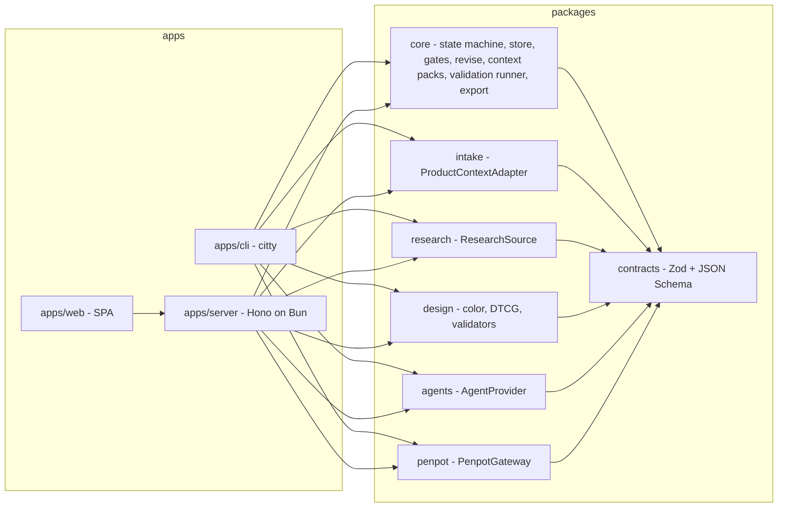
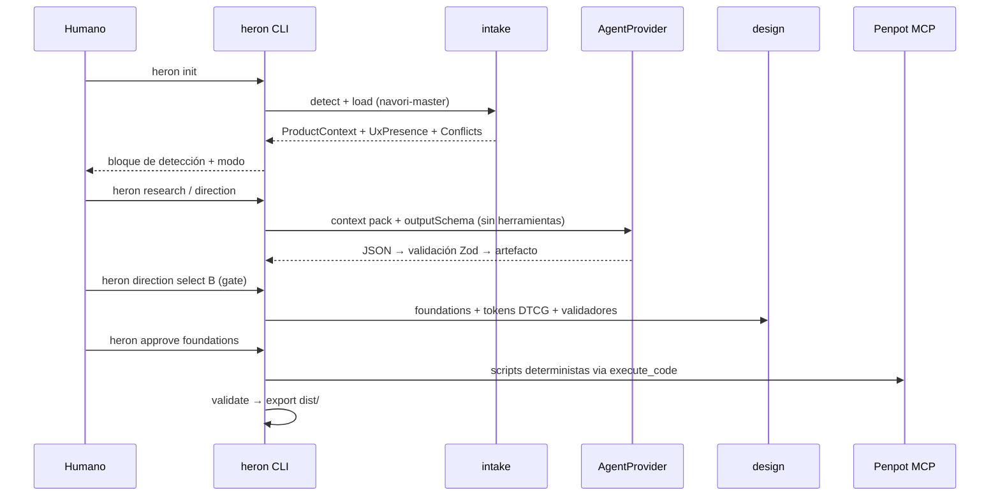

## Metadatos

| Campo | Valor |
|---|---|
| Proyecto | `navori-heron` |
| Etapa | `01-heron` |
| Fecha | 2026-09-30 |
| Modo | `template` (según `state.json`), pero **no existe template ni código**: el stack se trata como decisión abierta (`context/CODEBASE.md` §Stack). Ver nota al final de esta sección. |
| Plan | `plan3` |
| Prioridad de desempate | **Reuso del ecosistema**: ante un trade-off, gana el bloque existente y mantenido (patrones de navori-harness, compose oficial y MCP oficial de Penpot, W3C DTCG y su tooling, librerías de color, agentes CLI existentes) sobre el código propio, sin violar la independencia en runtime frente a navori-harness (context/md/PLAN.md §75.1). |
| Archivos de `context/md/` leídos | `context/md/PLAN.md` (completo, §intro–§80 y "Resultado esperado"). |
| Otros insumos leídos | `context/DIGEST.md`, `context/CODEBASE.md`, `DECISIONS.md` (D1: seguir con plan maestro), plantilla de plan. |
| Etapas cerradas leídas | Ninguna (etapa 1; `specs/_master/index.json` solo lista `01-heron` activa). |
| Evidencia externa inspeccionada | Clon local de `UlisesCm/navori-harness` tras `git fetch origin main` → `origin/main` = `44afd638`. Clon local de `UlisesCm/monorepo-fullstack` tras `git fetch origin main` → `origin/main` = `e24995a`. Registro npm, Docker Hub, docs oficiales de Penpot, DTCG, Refero y Bun, y `--help` de `claude` 2.1.286 y `codex` 0.159.2 instalados localmente. Todo consultado el 2026-09-30. |

Nota de modo: `state.json` registra `template`, pero no hay template que restrinja el stack. En navori-harness existe trabajo local sin commitear que agrega un modo `desde-cero` justo para este caso (`packages/cli/src/lib/master/schema.ts`, diff local no publicado en `origin/main`). Este plan trata el stack como decisión abierta y la propone.

## Resumen ejecutivo

Heron se construye como un **compilador de diseño pequeño que orquesta bloques ya existentes en lugar de reimplementarlos**. En TypeScript sobre Bun 1.4.2 reusa la misma cadena de herramientas y los mismos patrones probados de navori-harness: schemas Zod con versión explícita, JSON Schema derivado con prueba de deriva, CLI con citty, transiciones con precondiciones verificables, escrituras atómicas y Markdown derivado de JSON. **Copia esos patrones, no los importa**, así que no hay dependencia de runtime con Harness. Usa W3C DTCG 2025.10 (Format, Color y Resolver) como contrato de tokens, validado con `@terrazzo/parser`, y `colorjs.io` como motor de color y contraste. Penpot se levanta con el `docker-compose.yaml` oficial sin modificar y fijado por tag, más un override propio; se opera a través del contenedor `penpot-mcp` oficial con scripts deterministas de la Plugin API. La IA corre sobre Claude Code y Codex CLI ya autenticados, con salida estructurada validada por los mismos JSON Schemas (`--json-schema` / `--output-schema`) y sin herramientas: el agente razona y Heron escribe. Refero entra como fuente opcional mediante su MCP oficial. La entrega son 7 partes: el núcleo con la detección de modo del §80, la capa de agentes, el research útil en `reference-only`, un slice vertical en modo `full` con export, Penpot, la generalización a todas las pantallas con revisión y, al final, la Web UI con el self-host. El mayor riesgo verificado: **el contrato `UX.md`/`ux.json` todavía no existe en navori-harness `origin/main`**, y todo el modo `full` depende de él.

## Alcance (MoSCoW)

### Must

- M1. `heron init [dir] [--stage NN-slug]` detecta el master-plan de Navori, lee sus artefactos, decide el modo (`full` o `reference-only`) y persiste `.heron/project.json` y `.heron/state.json`. La salida es equivalente a la de "Resultado esperado" de context/md/PLAN.md.
- M2. Contratos Zod versionados, con JSON Schema generado y versionado en el repo y copiado en cada export.
- M3. Adaptadores de entrada `navori-master`, `filesystem`, `markdown` y `manual` detrás de `ProductContextAdapter` (context/md/PLAN.md §4).
- M4. `AgentProvider` con adaptadores `claude-code` y `codex-cli` (salida estructurada validada), más `fake` para tests. El mapeo rol → proveedor es configurable.
- M5. Research en `reference-only` que produce `REFERENCES.md`, `references.json`, `provenance.json`, `visual-directions.json` y `moodboards/`, con provenance completa por referencia.
- M6. En `full`: 3 direcciones visuales con gate de selección; foundations en 14 áreas; tokens DTCG 2025.10 en capas primitive/semantic/component con temas light/dark vía Resolver; `DESIGN.md`; componentes y patterns derivados del `ux.json`; todas las pantallas del `ux.json` con sus estados relevantes.
- M7. Los 14 validadores de context/md/PLAN.md §28 y los quality gates de 11 categorías, con resultado PASS/WARNING/FAIL y evidencia, sin score numérico.
- M8. Penpot self-host desde el compose oficial fijado por tag, sin editar el archivo upstream. Integración vía MCP oficial: primero lectura, después escritura de tokens, páginas, componentes y pantallas. `heron doctor` comprueba la integración y falla rápido.
- M9. `heron export` a `dist/` con manifest (todos los campos de §46), checksums sha256, JSON Schemas incluidos y salida byte a byte reproducible.
- M10. `heron revise` con registro de la revisión y preservación de lo que no se pidió cambiar.
- M11. Seguridad: SSRF, path traversal, redacción de secretos, prompt injection como dato y metadata de imágenes eliminada.
- M12. Web UI de control plane con las vistas de §39 y §40, y self-host de Heron con Docker Compose separado de Penpot.
- M13. Los 11 documentos de §74.

### Should

- S1. Fuente de research `refero` mediante el MCP oficial de Refero (`https://api.refero.design/mcp`, OAuth, plan de pago), invocado a través del agente CLI ya autenticado. (consultado 2026-09-30)
- S2. Leer los `DESIGN.md` externos (p. ej. los de Refero Styles) con `@google/design.md` cuando cumplan esa spec, y como texto plano cuando no.
- S3. El `DESIGN.md` final lleva un frontmatter compatible con `@google/design.md` (alpha), derivado de los tokens semánticos y validado con su `lint`.
- S4. Página "References" en Penpot para `reference-only` (context/md/PLAN.md §69).
- S5. CLI distribuible como binario único (`bun build --compile`) además del paquete ejecutable con `bunx`.
- S6. `docs/deployment/railway.md`, solo cuando el self-host con Docker pase sus criterios (context/md/PLAN.md §65).

### Could

- C1. `heron run --auto`, que recorre los gates sin pausa y solo se habilita tras cerrar P6 (context/md/PLAN.md §41: "posteriormente").
- C2. Reglas de lint de Terrazzo (`a11y/min-contrast`, `core/required-modes`) como segunda opinión sobre los tokens.
- C3. Contraste APCA como WARNING informativo, adicional al WCAG 2.x.

### Won't (V1)

- W1. Adapters de implementación: theme de Mantine o Unistyles, config de Tailwind, componentes React o RN (context/md/PLAN.md §47).
- W2. SaaS multi-tenant (context/md/PLAN.md §34).
- W3. Proveedores de IA por API key directa (Anthropic, OpenAI, local). Solo queda la interfaz lista (context/md/PLAN.md §48: "implementaciones futuras").
- W4. LangChain, LangGraph, Temporal, Kafka, Redis propio de Heron, vector DB (context/md/PLAN.md §60).
- W5. Acceso a la DB de Penpot, edición del formato `.penpot` o fork de Penpot (context/md/PLAN.md §31, §32).
- W6. Control de versiones propio (context/md/PLAN.md §59).
- W7. Adapters de Jira, Notion o Linear (context/md/PLAN.md §4: "más adelante").
- W8. Gestión de usuarios, OAuth o SSO propios de Heron. En V1 hay un único token de operador `[SUPUESTO]`.
- W9. Sincronización Penpot → Heron automática. Los cambios hechos en Penpot solo se reportan como deriva `[SUPUESTO]`.

## Actores y permisos

| Actor | Puede | No puede |
|---|---|---|
| Diseñador / product owner (humano) | Ejecutar comandos de CLI; aprobar gates (`intake`, `research`, `direction`, `foundations`, `representative-screens`, `visual-review`); seleccionar dirección; aceptar o rechazar `UX-PROPOSAL`; pedir `revise`; reconocer `CONFLICT` con nota. | Aprobar un gate sin TTY interactivo o sin `--yes` escrito por él; exportar en `reference-only`; editar `ux.json` fuente desde Heron. |
| Cliente del producto | Aportar insumos de marca (logo, colores, fuentes, guías, referencias que le gustan o no) que se registran con origen `provided` (context/md/PLAN.md §12). | Acceder a Heron directamente en V1 `[SUPUESTO]`. |
| Operador self-host | Desplegar Heron y Penpot, gestionar secretos (`PENPOT_SECRET_KEY`, MCP key, token de operador), backups y upgrades (context/md/PLAN.md §31, §34, §64). | Ver secretos en logs; modificar el compose upstream de Penpot (se usa override). |
| Agente IA (rol vía `AgentProvider`) | Recibir un context pack y devolver JSON que cumpla el schema de su tarea. En research puede usar solo los MCP que Heron le habilite (p. ej. Refero). | Escribir archivos, ejecutar shell, hacer fetch web propio, aprobar gates, cambiar el estado o ver secretos. Todo su output pasa por validación de schema. |
| Repo consumidor (p. ej. `monorepo-fullstack`) | Leer `dist/` y validarlo con los JSON Schemas incluidos sin instalar Heron (context/md/PLAN.md §45). | Recibir themes o componentes de implementación (context/md/PLAN.md §47). |
| Navori Harness (productor) | Producir `MASTER.md`, `DECISIONS.md`, `parts.json`, `UX.md`, `ux.json`, etc. | Ser dependencia de runtime de Heron (context/md/PLAN.md §75.1). |

## Reglas de negocio

- **RN-1.** Heron entra en modo `full` solo si `UX.md` y `ux.json` existen y ambos son válidos. En cualquier otro caso usa `reference-only` (context/md/PLAN.md §3).
- **RN-2.** Si solo existe uno de los dos archivos, Heron informa la inconsistencia, no infiere el faltante, cae en `reference-only`, permite research y bloquea el diseño y el export de producción (context/md/PLAN.md §3).
- **RN-3.** En `reference-only` quedan bloqueados: inventario definitivo de pantallas, journeys y flows definitivos, design system y component system de producción, tokens finales, pantallas finales, diseño de producción en Penpot y export de producción. Los comandos correspondientes terminan con código 2 y nombran los artefactos faltantes (context/md/PLAN.md §3 Mode A, §69).
- **RN-4.** Precedencia de fuentes: `DECISIONS.md` > `MASTER.md` > `parts.json` > `ux.json` > `UX.md` > `DIGEST.md` > `CODEBASE.md` > `context/md/*` > inferencia. Ante una contradicción se registra un `CONFLICT` con archivos, valores e impacto, y nunca se elige en silencio (context/md/PLAN.md §6).
- **RN-5.** `ux.json` es la fuente machine-readable de la estructura UX. Ni `ux.json` ni `UX.md` pueden contradecir reglas o decisiones de `MASTER.md` o `DECISIONS.md` (context/md/PLAN.md §6).
- **RN-6.** Un `CONFLICT` con impacto en producción bloquea la aprobación del gate `intake` hasta que el humano lo reconozca con una nota. La nota no resuelve el conflicto en la fuente: la resolución vive en el master-plan `[SUPUESTO]`.
- **RN-7.** Heron preserva reglas de negocio, roles, permisos, requisitos funcionales, decisiones explícitas del usuario, capacidades, pantallas requeridas, estados críticos, flows obligatorios y restricciones de dominio (context/md/PLAN.md §15).
- **RN-8.** Toda modificación significativa a lo definido en `ux.json` se registra como `UX-PROPOSAL` con original, propuesta, razón, requisitos preservados e impacto. El `ux.json` fuente nunca se modifica (context/md/PLAN.md §16).
- **RN-9.** Cada referencia registra source, URL u origen, fecha de captura, razón de selección, qué se estudia, qué NO se debe copiar y qué decisiones de Heron influye. Una referencia sin alguno de estos campos es inválida (context/md/PLAN.md §9).
- **RN-10.** Las referencias son evidencia, no templates: no se copian interfaces completas ni se mezclan colores matemáticamente (context/md/PLAN.md §9, §10, §75.12).
- **RN-11.** Las consultas de research parten del trabajo que hace la interfaz (categoría, flow, tipo de pantalla, pattern, elemento, estilo, densidad, estrategia de contenido, navegación). Una consulta sin al menos uno de esos ejes se rechaza (context/md/PLAN.md §8).
- **RN-12.** Cada dato de marca registra su origen: `provided`, `derived`, `inferred` o `reference-derived`. Una inferencia nunca se presenta como decisión del cliente (context/md/PLAN.md §12).
- **RN-13.** Un color del cliente que no sirve para una función no se descarta: se genera una variante usable que preserva hue, carácter e identidad percibida, y se registra la decisión (context/md/PLAN.md §13).
- **RN-14.** En `full` se generan exactamente 3 direcciones visuales, cada una con 13 atributos (personality … when it doesn't). Foundations no arranca hasta que un humano selecciona una (context/md/PLAN.md §11).
- **RN-15.** En `reference-only` las direcciones se producen como propuestas. `direction select` queda bloqueado porque habilita foundations `[SUPUESTO]`.
- **RN-16.** Por defecto, cada etapa del pipeline se detiene en su gate humano. `run --auto` no es el comportamiento inicial (context/md/PLAN.md §41).
- **RN-17.** Los tokens usan formato compatible con DTCG en capas primitive → semantic → component. Los component tokens solo existen si un componente los necesita, y hay que evitar la explosión de tokens (context/md/PLAN.md §18). La semántica mínima cubre background, surface, content, border, action, interactive, feedback (success, warning, danger, info), focus, disabled y selected, con los estados aplicables (context/md/PLAN.md §19).
- **RN-18.** Los componentes se derivan del `ux.json`, sus patterns y sus pantallas; no se parte de una lista estándar (context/md/PLAN.md §22). Cada pattern referencia las pantallas que lo usan (context/md/PLAN.md §23).
- **RN-19.** En `full` se diseñan todas las pantallas del `ux.json`: primero un set representativo con gate y después el resto (context/md/PLAN.md §24). Cada pantalla conserva los campos heredados y agrega los de Heron (context/md/PLAN.md §25), con sus estados relevantes (context/md/PLAN.md §26).
- **RN-20.** La accesibilidad y los quality gates se reportan como hallazgos PASS/WARNING/FAIL con evidencia. Está prohibido un score 0–100 (context/md/PLAN.md §27, §68).
- **RN-21.** Los anti-patterns de §21 no se prohíben: su uso exige una justificación registrada. Sin justificación son WARNING (context/md/PLAN.md §21).
- **RN-22.** Penpot y Refero no son fuente de verdad; la fuente son los contratos neutrales de Heron (context/md/PLAN.md §30, §75.3, §75.4).
- **RN-23.** Penpot se integra por MCP cuando la operación está soportada. Nunca se toca su DB ni el formato `.penpot` (context/md/PLAN.md §32).
- **RN-24.** Si la integración MCP necesita un archivo activo, el plugin conectado o la MCP key, Heron lo detecta, muestra el estado y falla rápido con una instrucción, sin esperas indefinidas (context/md/PLAN.md §33).
- **RN-25.** Nunca se inventan métricas, precios, permisos, capacidades ni reglas. Los datos de preview se marcan `DEMO`, `PLACEHOLDER` o `SYNTHETIC` (context/md/PLAN.md §71).
- **RN-26.** Todo contenido externo (Refero, URLs, screenshots, documentos, contexto del master, `DESIGN.md` externos) es dato: sus instrucciones nunca se ejecutan y los hallazgos sospechosos se registran (context/md/PLAN.md §54, §56).
- **RN-27.** El fetch de URLs bloquea localhost, endpoints de metadata, rangos privados, `file://` y protocolos inesperados, salvo una operación local autorizada explícitamente (context/md/PLAN.md §55).
- **RN-28.** Una revisión conserva todo lo que no se pidió cambiar y registra revision, reason, affected artifacts, previous values y new values (context/md/PLAN.md §58).
- **RN-29.** Heron no guarda credenciales de Claude Code, Codex CLI ni de sus suscripciones. Una suscripción no equivale a créditos de API (context/md/PLAN.md §48, §49).
- **RN-30.** En logs nunca aparecen API keys, MCP tokens, session tokens ni secretos de documentos (context/md/PLAN.md §66).
- **RN-31.** Heron no depende de navori-harness en runtime: no importa paquetes `navori` ni `@navori/*` ni invoca su CLI. El reuso es copia de patrones con atribución (licencia MIT) y copia fijada de JSON Schemas (context/md/PLAN.md §75.1, §75.2; la interpretación de "copia fijada" es `[SUPUESTO]`).
- **RN-32.** Heron puede trabajar con una etapa distinta de la activa, incluida una cerrada (context/md/PLAN.md §38).
- **RN-33.** V1 no produce adapters de implementación (context/md/PLAN.md §47).
- **RN-34.** El trabajo determinista (schemas, estado, archivos, DTCG, contraste, coverage, grafos, IDs, manifest, checksums, export) nunca se delega al LLM (context/md/PLAN.md §53, §75.10). Esto incluye al rol "Penpot Operator", que en este plan es generación determinista de scripts y no un agente (decisión de este plan, derivada de §53).

## Requisitos funcionales

- **RF-1.** `heron init [dir] [--stage NN-slug]` resuelve el origen (primero `navori-master`, si no `filesystem`), imprime el bloque de detección (origen, etapa, ✓/missing por artefacto, modo, superficies, conteos de pantallas, flows y patterns) y deja `.heron/` en estado `initialized`. Si ya existe, no sobrescribe decisiones ni aprobaciones.
- **RF-2.** Sin `--stage` se usa la etapa `activa` de `<specsDir>/_master/index.json`. Con `--stage` se acepta cualquier etapa listada. Una etapa inexistente termina con código 2 y la lista de etapas disponibles.
- **RF-3.** `heron status [--json]` muestra el estado, el modo, los gates pendientes, los comandos permitidos en ese momento, los conteos, los `CONFLICT` abiertos, los artefactos `stale` y los archivos de `.heron/` sin commit.
- **RF-4.** `heron doctor [--json]` corre checks independientes (runtime, git, permisos de escritura, agentes CLI con su versión y flags requeridos, Penpot, MCP, plugin conectado, archivo enfocado, Refero opcional). Cada uno da `ok`, `warn` o `fail`, con instrucción de corrección y timeout propio.
- **RF-5.** `heron intake` construye el `ProductContext` desde el adapter, registra los `CONFLICT` y acepta insumos de marca (`--brand <archivo|dir>`) y referencias manuales.
- **RF-6.** `heron research [--query …]` planifica consultas por trabajo de interfaz, ejecuta las fuentes habilitadas y produce referencias candidatas con provenance.
- **RF-7.** `heron references list|add|show|compare|remove` gestiona referencias, incluidas regiones crop/focus y notas.
- **RF-8.** `heron direction` genera 3 direcciones; `heron direction select <id>` registra la selección humana (solo en `full`).
- **RF-9.** `heron approve <gate>` registra una aprobación humana (`approvedBy`, fecha, hashes de artefactos) y `heron gates` lista su estado.
- **RF-10.** `heron foundations` genera foundations, tokens DTCG y `DESIGN.md`.
- **RF-11.** `heron system` genera el inventario de componentes y patterns derivado del `ux.json`.
- **RF-12.** `heron screens [--representative | --all | --screen <id>]` genera los `ScreenDesign`.
- **RF-13.** `heron penpot status|inspect|push [--dry-run]` opera Penpot vía MCP.
- **RF-14.** `heron validate [--category …] [--coverage] [--json]` ejecuta los validadores y quality gates y responde las 6 preguntas de coverage de §29.
- **RF-15.** `heron export [--out dist]` produce el paquete neutral.
- **RF-16.** `heron revise "<instrucción>" [--scope …]` aplica una revisión trazable.
- **RF-17.** `heron proposals list|accept|reject <id>` gestiona los `UX-PROPOSAL`. Aceptar uno no toca el `ux.json` fuente: se exporta como propuesta para el master-plan `[SUPUESTO]`.
- **RF-18.** `heron run` ejecuta el siguiente paso pendiente y se detiene en el siguiente gate.
- **RF-19.** Todos los comandos aceptan `--json` y emiten `heron.cli-result.v1` con códigos de salida estables.
- **RF-20.** La Web UI ofrece las vistas de §39 (projects, intake, master-plan status, references, comparación, directions, selección, foundations preview, exploradores de color y tipografía, components, patterns, screens, estados, coverage, validation, Penpot status y export) y la comparación lado a lado de §40.

## Requisitos no funcionales

| ID | Requisito | Medida | Umbral |
|---|---|---|---|
| RNF-1 | Latencia de `init` y `status` | Tiempo de pared sobre `fixtures/membership-product`, 20 ejecuciones | p95 ≤ 2 000 ms |
| RNF-2 | Reproducibilidad del export | Dos exports con las mismas entradas y el mismo `SOURCE_DATE_EPOCH`, comparados por sha256 | 100 % de archivos idénticos |
| RNF-3 | Fallo rápido en integraciones externas | Duración de cada check de Penpot, MCP, agentes y Refero; duración total de `doctor` | ≤ 10 s por check; ≤ 30 s en total; 0 llamadas externas sin timeout (test de arquitectura) |
| RNF-4 | Corte de invocaciones de agente | Timeout configurable; tiempo entre vencimiento y fin del proceso hijo | Default 600 s; kill ≤ 5 s después |
| RNF-5 | Superficie de dependencias | Dependencias directas de runtime en todo el workspace, sin contar dev ni built-ins de Bun | ≤ 15, cada una justificada en un ADR |
| RNF-6 | Secretos | Ocurrencias de secretos sembrados en logs, run records, `.heron/` y `dist/` | 0 |
| RNF-7 | Cobertura de tests | Líneas cubiertas (`bun test --coverage`) | ≥ 90 % en `packages/contracts` y en los validadores de `packages/design`; ≥ 80 % en `packages/core` |
| RNF-8 | Accesibilidad del output (WCAG 2.2 AA) | Contraste de pares semánticos y tamaño mínimo de target | Texto normal ≥ 4.5:1; texto grande ≥ 3:1; componentes UI e indicador de foco ≥ 3:1 (SC 1.4.3, 1.4.11); target ≥ 24×24 CSS px (SC 2.5.8) |
| RNF-9 | Integridad ante fallos | Archivos JSON truncados tras un fallo inyectado entre write y rename | 0 |
| RNF-10 | Compatibilidad de schemas | Leer una versión major desconocida; leer fixtures de versiones anteriores de la misma major | La primera termina con código 2 y un mensaje que nombra la versión soportada; las segundas se leen al 100 % |
| RNF-11 | Presupuesto de context pack | Caracteres por invocación | ≤ 120 000 por defecto (configurable); si se excede, recorte determinista y WARNING |
| RNF-12 | Self-host de Heron | Tiempo desde `docker compose up -d` (imagen ya construida) hasta `/healthz` 200 en un host de 2 vCPU y 4 GB | ≤ 120 s |
| RNF-13 | Upgrade de Penpot | Archivos a tocar para subir de versión; archivos upstream modificados | 1 variable (`PENPOT_VERSION`) más volver a ejecutar el fetch; 0 archivos upstream modificados (verificado por checksum) |
| RNF-14 | Observabilidad | Transiciones de estado e invocaciones de agente con `runId`, timestamp y duración | 100 % |
| RNF-15 | Assets de imagen | Tamaño de entrada y lado mayor tras normalizar | Entrada ≤ 10 MB; lado mayor ≤ 2 560 px; 0 bloques EXIF/XMP/GPS en la salida `[SUPUESTO]` |

## Dominio y datos

### Entidades

| Entidad | Contenido clave | Relaciones | Archivo |
|---|---|---|---|
| `HeronProject` | `schemaVersion`, `id`, `name`, `source` (`navori-master`, `filesystem`, `markdown`, `manual`), `masterStage`, `mode`, `designRevision`, `heronVersion` | 1–1 `HeronState`; 1–1 `ProductContext` | `.heron/project.json` |
| `HeronState` | `state`, `history[]` (from, to, at, runId, checks), `gates[]` (gate, approvedBy:`user`, at, artifactHashes), `stale[]` | Referencia gates y revisiones | `.heron/state.json` |
| `ProductContext` | Los 19 bloques de §5 con `sourceRef` (archivo y ancla) por elemento | Lo alimentan los adapters; lo consumen los context packs | `.heron/intake/product-context.json` |
| `Conflict` | `id`, archivos, valores, impacto, `detectedBy` (`deterministic` o `agent`), `ack` (nota humana) | Pertenece a `ProductContext` | `.heron/intake/conflicts.json` |
| `BrandInput` | Valor, tipo (logo, color, fuente…), `origin` (`provided`, `derived`, `inferred`, `reference-derived`) | Lo usa `VisualDirection` y foundations | `.heron/intake/brand.json` |
| `ResearchReference` | Los 7 campos de §9, `evidence[]` (imagen, crop/focus, notas), `influences[]` | N–M con `VisualDirection`, `ScreenDesign` y `Pattern` | `.heron/research/references.json`, `provenance.json` |
| `Moodboard` | Conjunto de referencias con intención | Agrupa referencias | `.heron/research/moodboards/<id>.md` |
| `VisualDirection` | Los 13 atributos de §11 y `mode` | Referencia `ResearchReference` | `.heron/research/visual-directions.json` |
| `Foundations` | 14 áreas (§17) | Deriva de la dirección seleccionada | `.heron/design/foundations/<area>.json` |
| `TokenSet` | DTCG 2025.10: `primitive`, `semantic`, `component`, más el documento Resolver (light/dark) | Lo consumen `Component` y `ScreenDesign` | `.heron/design/tokens/*.tokens.json`, `heron.resolver.json` |
| `DesignSystem` | Índice de token sets, componentes, patterns y reglas | Agrega los anteriores | `.heron/design/design-system.json` |
| `Component` | `id`, propósito, variantes, estados, tokens usados, pantallas que lo usan | N–M con `ScreenDesign` | `.heron/design/components/<id>.json` |
| `Pattern` | `id` (p. ej. `PT01` del `ux.json`), pantallas y componentes | N–M con `ScreenDesign` | `.heron/design/patterns/<id>.json` |
| `ScreenDesign` | Campos heredados de §25 y campos Heron, `states[]` | Referencia flows, patterns y componentes | `.heron/design/screens/<screenId>.json` |
| `UxProposal` | original, proposal, reason, requirementsPreserved, impact, `status` | Referencia IDs del `ux.json` | `.heron/intake/ux-proposals.json` |
| `Finding` | `category` (11), `rule`, `status` (PASS, WARNING, FAIL), `evidence`, `subjectIds[]` | Lo agrega `ValidationReport` | `.heron/validation/report.json` |
| `Revision` | revision, reason, affected, previous, new, `designRevision` | Marca artefactos `stale` | `.heron/revisions/<n>.json` |
| `AgentRun` | `runId`, rol, proveedor, modelo (si se expone), plantilla `id@version`+sha256, hashes de entrada, duración, uso o costo (si se expone), resultado | Reproducibilidad (§67) | `.heron/runs/<runId>.json` |
| `PenpotBinding` | `baseUrl` (sin token), `fileId`, mapa `heronId → shapeId` | Sincronización | `.heron/penpot.json` |
| `Manifest` | Los campos de §46 | Describe `dist/` | `dist/manifest.json` |
| `Job`, `Session` | Cola de trabajos del server y sesión del operador | Solo en el server | SQLite (`bun:sqlite`) en un volumen del server |

### Ciclo de vida (state machine)

Estados propuestos. Cada transición tiene precondiciones verificables con el patrón `checksForTransition` → `CheckFailure[]` (ver Arquitectura):

1. `initialized`: `project.json` válido y modo calculado.
2. `intake-ready`: `ProductContext` válido, todos los `CONFLICT` con impacto reconocidos y gate `intake` aprobado.
3. `research-ready`: al menos 6 referencias `[SUPUESTO]` con provenance completa y gate `research` aprobado.
4. `directions-ready`: 3 `VisualDirection` válidas que referencian IDs existentes. **Estado terminal en `reference-only`.**
5. `direction-selected`: solo en `full`; aprobación `direction` registrada.
6. `foundations-ready`: 14 áreas, tokens que parsean con Terrazzo, 0 FAIL en `tokens` y `accessibility`, gate `foundations` aprobado.
7. `representative-screens-ready`: set representativo que cubre las categorías de §24 presentes, 0 FAIL en `states` para ese set y gate aprobado.
8. `system-ready`: todos los componentes y patterns, 0 FAIL en `components` y `patterns`.
9. `screens-ready`: 100 % de las pantallas del `ux.json` y 0 FAIL en `screens`, `flows` y `states`.
10. `penpot-synced`: sync report con 0 FAIL y gate `visual-review` aprobado. Si en la config `penpot.required=false`, se salta con WARNING en `Penpot sync` `[SUPUESTO]`.
11. `validated`: 0 FAIL en las 11 categorías.
12. `exported`: `dist/` escrito y checksums verificados.

`revise` regresa el estado al gate pendiente del primer artefacto afectado y marca los posteriores como `stale`. Si cambian los hashes de los insumos del master-plan, se degrada a `initialized` y se vuelve a pedir el gate `intake`.

### Retención

- `.heron/` vive dentro del repo del producto y se versiona en Git. Git es el historial y Heron no hace commits automáticos `[SUPUESTO]`.
- Los logs completos de ejecución van en `.heron/.cache/` (gitignored), con retención de 30 días `[SUPUESTO]`. Los `AgentRun` resumidos sí se versionan.
- SQLite del server: jobs con 30 días de retención y sesiones que expiran a las 12 h `[SUPUESTO]`. No guarda decisiones de diseño (context/md/PLAN.md §43).
- Assets de research: imágenes normalizadas en `.heron/research/assets/`. Las capturas de Refero quedan fuera hasta confirmar los términos de uso (Preguntas abiertas).

## Arquitectura

### Límites y paquetes

Se evalúa la estructura de §61 y se reduce de 11 a 7 paquetes. Solo existe un paquete donde hay un **puerto de adapter** (intake, research, agents, penpot) o un **dominio puro** (contracts, core, design); `state`, `validation` y `export` se funden en `core` porque comparten el mismo modelo y son pequeños.



Reglas de dependencia, verificadas por `tests/arch/boundaries.test.ts`:

- `contracts` solo depende de `zod`.
- `core` depende de `contracts` y define los puertos (interfaces).
- Los adapters (`intake`, `research`, `agents`, `penpot`) y `design` dependen de `contracts` y `core`, pero no entre sí.
- Solo `apps/*` compone implementaciones.
- Ningún paquete importa `navori` ni `@navori/*`.

### Flujo principal



### Capa determinista vs capa IA (§53)

| Determinista (código de Heron o bloque reusado) | IA (vía `AgentProvider`, siempre con schema de salida) |
|---|---|
| Parseo y validación de contratos; detección de modo; precedencia y conflictos de ID; state machine; context packs; escalas de color, contraste y gamut (`colorjs.io`); DTCG y Resolver (`@terrazzo/parser`); coverage y grafos; manifest y checksums; export; **scripts de Penpot** generados desde los contratos | Interpretar el contexto de producto, detectar conflictos semánticos, planear e interpretar el research, seleccionar referencias, direcciones visuales, síntesis de estilo, propuestas UX, composición de componentes y pantallas, crítica de diseño (reviewer) |

### Roles de IA y orquestación (§50–§51)

Los 9 roles conceptuales se agrupan en 4 invocaciones por tarea y 2 revisores; Penpot Operator pasa a ser determinista:

- **Analyst** (Product UX Analyst + UX Researcher): intake y planeación del research.
- **Visual Researcher**: selección y análisis de referencias. Es el único rol con un MCP habilitado (Refero).
- **Director** (Design Director + Design System Architect): direcciones, foundations y sistema.
- **Screen Designer**: composición de `ScreenDesign`.
- **Reviewers** (Accessibility Reviewer, Consistency Auditor): crítica con salida `Finding[]`. Complementan los validadores deterministas y nunca los reemplazan.

El flujo creator → reviewer se configura en `.heron/config.json` (`roles.<rol>.creator` y `roles.<rol>.reviewer` apuntan a proveedores por nombre). Admite como máximo 1 ronda de corrección; después decide el gate humano.

### Mapa de reuso (prioridad de este plan)

| Necesidad | Bloque reusado | Forma de reuso | Evidencia |
|---|---|---|---|
| Versionado de contratos con error explícito ante una versión desconocida | Patrón `versionField` de navori | Copia de patrón (MIT, con atribución en el ADR) | navori-harness `origin/main` `packages/cli/src/lib/master/schema.ts:18` |
| JSON Schema publicado y sin deriva respecto a Zod | `z.toJSONSchema()` de Zod 4 más el script y la prueba de deriva de navori | Copia de patrón | `packages/cli/scripts/gen-schemas.mjs:10,210`; schemas publicados en `apps/website/public/schema/navori.config.v1.json` |
| CLI con subcomandos pequeños | `citty` | Misma librería que navori | `packages/cli/src/index.ts:1,30,36` |
| Transiciones con precondiciones verificables | Patrón `checksForTransition` y `runMasterAdvance` | Copia de patrón | `packages/cli/src/lib/master/checks.ts:580,618` |
| Escrituras sin corrupción | Patrón `writeFileAtomic` (tmp → fsync → rename) | Copia de patrón | `packages/cli/src/lib/primitives/atomic.ts:22` |
| Markdown derivado de JSON, nunca escrito a mano | Patrón `renderStatusMd` | Copia de patrón (`REFERENCES.md`, secciones tabulares de `DESIGN.md`) | `packages/cli/src/lib/master/status.ts:232` |
| Aprobación humana como evidencia | `ApprovalEvidenceSchema` (`approvedBy: "user"`) | Copia de forma | `packages/cli/src/lib/master/schema.ts:208` |
| Proceso hijo con timeout y fallo rápido | `defaultVerify` (spawn, timeout, kill) | Copia de patrón en los adapters de agentes y en `doctor` | `packages/cli/src/commands/codex.ts:138` |
| Lectura del master-plan | Convenciones `sdd.specsDir` (default `specs`), `_master`, etapa `activa`, schemas de index, state y parts v1 | Schemas de **solo lectura** redeclarados en Heron, tolerantes a campos extra; sin importar código | `packages/cli/src/lib/config/schema.ts:152`; `packages/cli/src/lib/master/stages.ts:13,112`; `packages/cli/src/lib/master/schema.ts:84,147,342` |
| Toolchain | `bun@1.4.2`, TypeScript 7.0.2, Zod 4.6.5, oxlint y oxfmt | Mismas versiones que navori; `zod` igual al consumidor | navori `package.json:5` y `bun.lock`; monorepo-fullstack `package.json` (`zod` 4.6.5) |
| Contrato de tokens | W3C DTCG 2025.10 (Format, Color, Resolver) | Estándar; no se inventa un formato de temas | designtokens.org |
| Parseo y validación DTCG; aplicación de temas | `@terrazzo/parser` 2.7.1 (`parse`, `createResolver().apply()`) | Librería | terrazzo.app |
| Color, contraste y gamut | `colorjs.io` 0.7.1 | Librería, **ya transitiva** de `@terrazzo/parser` (0 dependencias nuevas) | `npm view @terrazzo/parser@2.7.1 dependencies` |
| Canvas editable | Compose oficial de Penpot en el tag 2.18.0 más el contenedor `penpot-mcp` | Archivo upstream **sin editar** más `compose.override.yaml` propio (merge nativo de Compose) | Descargado y verificado (sha256 abajo) |
| Operar Penpot | MCP oficial (`execute_code`, `high_level_overview`, `penpot_api_info`, `export_shape`) y tipos de la Plugin API | Scripts deterministas tipados contra `@penpot/plugin-types` | help.penpot.app/mcp |
| Cliente MCP | `@modelcontextprotocol/sdk` 1.31.0 (Streamable HTTP) | Librería | Tarball verificado: `dist/esm/client/streamableHttp.js` |
| Research en Refero | MCP oficial de Refero | Lo usa el agente CLI ya autenticado; Heron no guarda OAuth | github.com/referodesign/refero_skill |
| Razonamiento IA | Claude Code (`-p --output-format json --json-schema --tools "" --strict-mcp-config --no-session-persistence`) y Codex CLI (`exec --output-schema --sandbox read-only --ephemeral --json`) | Proceso hijo; **los mismos JSON Schemas** de `contracts` definen el output | `claude --help` 2.1.286 y `codex exec --help` 0.159.2 locales |
| DB, HTTP, tests, bundler, binario | `bun:sqlite`, `Bun.serve`, `bun test`, Bun bundler, `bun build --compile` | Built-ins de Bun (0 dependencias) | bun.sh/docs |
| Routing y middleware HTTP | Hono 4.13.12 (bearer auth, secure headers, validación) | Librería | hono.dev |
| SSRF | `ipaddr.js` 2.5.0 (clasificación de rangos) | Librería | npm |
| Metadata de imágenes | `sharp` 0.35.5 (re-encode sin metadata, crop, resize) | Librería; navori ya la lista en `trustedDependencies` | navori `package.json` |
| Timestamps reproducibles | Convención `SOURCE_DATE_EPOCH` | Estándar de reproducible-builds | reproducible-builds.org |

**Qué no se reusa y por qué**:

- Style Dictionary 5.5.5: sus transforms a plataformas pertenecen al consumidor (§47).
- Paquetes `navori` y `@navori/*` en runtime: lo prohíbe §75.1.
- MCP comunitarios de Penpot (p. ej. `ancrz/penpot-mcp-server`) y de Refero Styles: no son oficiales y el brief pide integración oficial (§31, §32).
- Agent SDKs (`@anthropic-ai/claude-agent-sdk` 0.3.286, `@openai/codex-sdk` 0.159.2): agregan 2 dependencias y 2 modelos de integración distintos, mientras que el proceso hijo da la misma interfaz para ambos. Su compatibilidad con autenticación por suscripción está `[SIN VERIFICAR]`.

### Opciones consideradas (decisiones con alternativas genuinas)

1. **Invocación de IA.**
   - (a) **Agente CLI como proceso hijo, sin herramientas y con salida estructurada. Elegida**: reusa la autenticación que el usuario ya tiene (§48–§49) y un solo JSON Schema sirve para Zod, Claude y Codex.
   - (b) Agent SDKs: descartada, ver arriba.
   - (c) API directa: queda fuera de V1 (W3).
   - Costo de revertir: bajo, porque todo pasa por la interfaz `AgentProvider`.
   - Hecho verificado: `--bare` de Claude Code **no lee OAuth ni keychain**, solo `ANTHROPIC_API_KEY`, así que rompería una suscripción Claude Max. El adapter no debe usarlo.
2. **Escritura en Penpot.**
   - (a) **Scripts deterministas de la Plugin API enviados por `execute_code`. Elegida**: cumple §53 y es idempotente con los IDs de Heron.
   - (b) Un agente "Penpot Operator" que escribe código libre: descartada por no determinista.
   - (c) MCP comunitario con decenas de herramientas: descartada por no oficial.
   - Tokens: la API de tokens aparece en `@penpot/plugin-types` 1.5.0 (tag `next`: `TokenCatalog.addSet`, `addTheme`, `addToken`, `applyToken`) pero no en 1.4.2 (`latest`). Si el runtime del Penpot fijado no la expone, el camino alternativo es la importación DTCG nativa de Penpot, que se hace a mano desde la UI y Heron verifica por lectura. Queda `[SIN VERIFICAR]` hasta la prueba de P5.
3. **Temas light/dark.**
   - (a) **Documento Resolver de DTCG 2025.10 más archivos pre-resueltos `light.tokens.json` y `dark.tokens.json` generados con Terrazzo. Elegida**: estándar para quien entiende resolvers y archivos planos para quien no.
   - (b) Solo `light.json` y `dark.json` ad-hoc, como en §44: descartada porque inventa un formato.
   - (c) Formato Tokens Studio: descartada por ser formato de un proveedor.
4. **Persistencia.**
   - (a) **Filesystem más Git como verdad, con SQLite (`bun:sqlite`) solo para jobs y sesiones del server. Elegida** (§43, §62).
   - (b) Postgres propio: descartada porque agrega un servicio sin un problema demostrado.

## Stack y librerías

Todas las filas se consultaron el **2026-09-30**. El método de verificación va en cada fila.

| Componente | Elección | Versión fija | URL oficial | Verificación |
|---|---|---|---|---|
| Lenguaje | TypeScript | 7.0.2 | https://www.typescriptlang.org/ (consultado 2026-09-30) | `npm view typescript version`; misma versión que navori `bun.lock` |
| Runtime, gestor de paquetes, tests, bundler, SQLite | Bun | 1.4.2 | https://bun.sh/docs (consultado 2026-09-30) (sqlite: https://bun.sh/docs/runtime/sqlite) | `npm view bun version`; `bun --version` local; imagen `oven/bun:1.4.2-slim` existe en Docker Hub |
| Schemas | Zod | 4.6.5 | https://zod.dev (consultado 2026-09-30) | `npm view zod version`; igual a navori y a monorepo-fullstack |
| CLI | citty | 0.2.2 | https://github.com/unjs/citty | `npm view citty version`. Navori usa 0.1.6: la compatibilidad de sus patrones con 0.2.x está `[SIN VERIFICAR]`; si la API difiere, se fija 0.1.6 |
| Prompts de CLI y color | @clack/prompts, picocolors | 1.8.1, 1.1.1 | https://github.com/bombshell-dev/clack (consultado 2026-09-30), https://github.com/alexeyraspopov/picocolors | npm registry (navori usa @clack/prompts 0.10.1) |
| Lint y formato | oxlint, oxfmt | 1.86.0, 0.71.0 | https://oxc.rs (consultado 2026-09-30) | npm registry |
| Tokens (spec) | W3C DTCG Format, Color y Resolver | 2025.10 | https://www.designtokens.org/tr/2025.10/ (consultado 2026-09-30) | Página oficial: módulos `format/`, `color/`, `resolver/`; anuncio W3C del 2025-10-28 |
| Parser y validador DTCG | @terrazzo/parser | 2.7.1 | https://terrazzo.app/docs/reference/js-api/ (consultado 2026-09-30) | npm registry; la doc de la JS API cita `parse`, `build`, `createResolver` y soporte de resolvers 2025.10 |
| Color y contraste | colorjs.io | 0.7.1 | https://colorjs.io (consultado 2026-09-30) | npm registry; dependencia de `@terrazzo/parser@2.7.1` |
| Penpot | Imágenes `penpotapp/*` y compose oficial | 2.18.0 (candidata; ver Preguntas abiertas) | https://help.penpot.app/technical-guide/getting-started/docker/ (consultado 2026-09-30) ; https://github.com/penpot/penpot/releases | La página de releases muestra 2.18.0 publicada el 23-sep (el año no aparece en la extracción; el issue #10398 de jun-2026 cita 2.16, lo que ubica 2.18.0 en 2026). Tags `penpotapp/frontend:2.18.0` y `penpotapp/mcp:2.18.0` existen en Docker Hub. `https://raw.githubusercontent.com/penpot/penpot/2.18.0/docker/images/docker-compose.yaml` responde 200 con sha256 `bfba4174b66f4d92530ed6969c9a137e29f47c692ba886aebdd0feea7d2aced0` |
| Penpot MCP | Contenedor `penpotapp/mcp` del compose oficial (modo remoto por `/mcp/stream?userToken=…`) | 2.18.0 (igual a Penpot) | https://help.penpot.app/mcp/ (consultado 2026-09-30) | Doc oficial: herramientas `execute_code`, `high_level_overview`, `penpot_api_info`, `export_shape`, `import_image` (esta solo en MCP local); opera sobre la página enfocada, con el plugin conectado y la pestaña activa. Alternativa local: `@penpot/mcp` 2.15.4 (dist-tag `stable`) |
| Tipos de la Plugin API | @penpot/plugin-types | 1.4.2 (`latest`) y 1.5.0 (`next`, incluye tokens) | https://www.npmjs.com/package/@penpot/plugin-types | Tarballs inspeccionados. Qué versión expone el runtime de Penpot 2.18.0: `[SIN VERIFICAR]` |
| Cliente MCP | @modelcontextprotocol/sdk | 1.31.0 | https://github.com/modelcontextprotocol/typescript-sdk (consultado 2026-09-30) | npm registry; el tarball incluye `client/streamableHttp` |
| Servidor HTTP | Hono sobre `Bun.serve` | 4.13.12 | https://hono.dev (consultado 2026-09-30) | npm registry |
| Web UI | React y React DOM (bundle con Bun) | 19.3.0 | https://react.dev (consultado 2026-09-30) | npm registry. Elección sujeta a Preguntas abiertas |
| Kit de UI de la Web de Heron (interna) | @mantine/core | 9.6.3 | https://mantine.dev (consultado 2026-09-30) | npm registry. **Solo para la UI propia de Heron**, nunca en contratos ni exports; sujeta a Preguntas abiertas |
| SSRF | ipaddr.js | 2.5.0 | https://github.com/whitequark/ipaddr.js (consultado 2026-09-30) | npm registry |
| Imágenes | sharp | 0.35.5 | https://sharp.pixelplumbing.com (consultado 2026-09-30) | npm registry |
| `DESIGN.md` (Should) | @google/design.md | 0.4.0 (formato `alpha`) | https://github.com/google-labs-code/design.md (consultado 2026-09-30) | npm registry; README: comandos `lint`, `diff`, `export --format dtcg`, licencia Apache-2.0 |
| Validador JSON Schema (solo tests del lado consumidor) | ajv | 8.20.0 | https://ajv.js.org (consultado 2026-09-30) | npm registry |
| Agente CLI (externo, no es dependencia) | Claude Code | mínimo 2.1.286 | https://docs.anthropic.com/en/docs/claude-code (consultado 2026-09-30) | `claude --help` local: `-p`, `--output-format json`, `--json-schema`, `--tools ""`, `--strict-mcp-config`, `--mcp-config`, `--no-session-persistence`, `--setting-sources`; `--bare` no lee OAuth |
| Agente CLI (externo, no es dependencia) | Codex CLI | mínimo 0.159.2 | https://github.com/openai/codex (consultado 2026-09-30) | `codex exec --help` local: `--output-schema`, `--json`, `-o`, `--sandbox`, `--ephemeral`, `--skip-git-repo-check` |
| Refero (opcional) | MCP oficial `https://api.refero.design/mcp` | n/a (servicio) | https://github.com/referodesign/refero_skill | README oficial: MCP de solo lectura, OAuth, "Live research requires a paid Refero plan". El catálogo y los términos de uso de Refero Styles están `[SIN VERIFICAR]` |
| Contenedores | Docker Compose v2 | `[SIN VERIFICAR]` (versión mínima exacta) | https://docs.docker.com/compose/ | La doc de Penpot exige Compose V2 |

## Contratos

### Schemas versionados (`packages/contracts`)

Todos los schemas llevan `schemaVersion` con un gate de versión al estilo `versionField`. Se generan a `packages/contracts/schemas/<id>.schema.json` con `z.toJSONSchema()`, con una prueba de deriva, y se copian a `dist/schemas/`.

| ID | Archivo | Parte |
|---|---|---|
| `heron.project.v1`, `heron.state.v1` | `.heron/project.json`, `.heron/state.json` | P1 |
| `heron.product-context.v1`, `heron.conflict.v1`, `heron.ux-presence.v1` | `.heron/intake/*` | P1 |
| `heron.cli-result.v1` | stdout de `--json` | P1 |
| `heron.agent-run.v1`, `heron.agent-task.<role>.v1` (output por rol) | `.heron/runs/*`; input de `--json-schema` y `--output-schema` | P2 |
| `heron.brand.v1`, `heron.reference.v1`, `heron.provenance.v1`, `heron.direction.v1` | `.heron/intake/brand.json`, `.heron/research/*` | P3 |
| `heron.foundations.v1`, `heron.design-system.v1`, `heron.component.v1`, `heron.pattern.v1`, `heron.screen.v1`, `heron.finding.v1`, `heron.manifest.v1` | `.heron/design/*`, `.heron/validation/*`, `dist/manifest.json` | P4 |
| `heron.penpot-binding.v1`, `heron.penpot-sync.v1` | `.heron/penpot.json`, `.heron/validation/penpot-sync.json` | P5 |
| `heron.revision.v1`, `heron.ux-proposal.v1` | `.heron/revisions/*`, `.heron/intake/ux-proposals.json` | P6 |
| Tokens | DTCG 2025.10: no hay schema de Heron; se validan con `@terrazzo/parser` | P4 |

**Contrato UX de entrada.** `ux.json` se valida contra una copia fijada (`packages/contracts/vendor/ux/<versión>.schema.json`, con su sha256 registrado) del schema que publique el productor. **Hoy no existe**: en navori-harness `origin/main` (`44afd638`), `git grep "ux\.json\|UX\.md"` solo devuelve coincidencias ajenas en `add.test.ts:338` y `plugins/gh/plugin.json:20`. Mientras tanto, la validez de `ux.json` depende de la Pregunta abierta 1.

### Puertos (interfaces en `core`)

```ts
interface ProductContextAdapter {
  readonly id: "navori-master" | "filesystem" | "markdown" | "manual";
  detect(root: string): Promise<Detection>;            // sin efectos
  load(root: string, opts: LoadOptions): Promise<LoadResult>; // ProductContext + UxPresence + Conflict[]
}
interface ResearchSource {
  readonly id: "url" | "local-image" | "screenshot" | "design-md" | "manual" | "refero" | "existing-penpot";
  search?(query: ResearchQuery): Promise<CandidateReference[]>;
  capture(input: CaptureInput): Promise<ResearchReference>;
}
interface AgentProvider {
  readonly id: string;                                 // "claude-code" | "codex-cli" | "fake"
  health(): Promise<ProviderHealth>;                   // binario, versión, flags requeridos
  invoke<T>(task: AgentTask<T>): Promise<AgentResult<T>>; // task: role, template id@version, contextPack, outputSchema, timeoutMs, allowedMcp[]
}
interface PenpotGateway {
  health(): Promise<PenpotHealth>;                     // url, mcp, plugin, fileId enfocado
  overview(): Promise<PenpotOverview>;
  runScript(script: PenpotScript): Promise<ScriptResult>; // execute_code
  exportShape(id: string): Promise<Uint8Array>;
}
```

### CLI

- Comandos: los de RF-1 a RF-18.
- Salida `--json`: `heron.cli-result.v1` = `{ ok, command, state, mode, findings[], next[] }`.
- Códigos de salida: `0` OK; `1` hubo FAIL en validación; `2` precondición o gate no cumplido, o modo que no lo permite; `3` dependencia externa no disponible (Penpot, agente, Refero); `64` error de uso.

Bloque de detección de `init`: formato de "Resultado esperado" en context/md/PLAN.md, con dos líneas extra, `Source:` (adapter) y `Conflicts: <n>`.

### API del server (P7)

REST en `/api/v1`: `projects`, `projects/:id/status`, `…/gates/:gate/approve`, `…/references` (CRUD más crop), `…/directions/select`, `…/jobs` (encolar paso, consultar), `…/validation`, `…/penpot/status`, `…/export`. Cada handler llama la **misma función de `core`** que la CLI, sin lógica duplicada.

### Eventos (logs estructurados JSONL)

`state.transition`, `gate.approved`, `agent.invoke.start|end`, `research.reference.added`, `penpot.script.run`, `validation.finding`, `export.written`, `security.suspicious-content`. Campos comunes: `ts`, `runId`, `projectId`, `event`, `durationMs?`.

### Export (`dist/`)

Estructura de §45 más `schemas/`:

- `tokens/`: `primitive.tokens.json`, `semantic.tokens.json`, `component.tokens.json`, `heron.resolver.json`, `light.tokens.json` y `dark.tokens.json` pre-resueltos.
- Manifest con todos los campos de §46. `files[]` lleva `path` y `sha256`. `generatedAt` sale de `SOURCE_DATE_EPOCH` cuando está definido.

## Seguridad

| Amenaza | Control | Verificación |
|---|---|---|
| SSRF al capturar URLs | Solo `https:` (y `http:` si se autoriza en local); resolución DNS previa y clasificación con `ipaddr.js` (bloquea loopback, link-local 169.254/16 y fe80::/10, privados RFC 1918, ULA fc00::/7, CGNAT 100.64/10, `0.0.0.0`, IPv4-mapped); se revalida en cada redirect (máximo 3); tamaño máximo 10 MB; timeout de 10 s (context/md/PLAN.md §55) | Tabla de casos en `packages/research/test/ssrf.test.ts` |
| Fetch hecho por el propio agente, fuera del guard de Heron | Los agentes corren **sin herramientas** (`--tools ""`; Codex con `--sandbox read-only`). Heron captura el contenido y lo pasa como dato. El único MCP habilitado es Refero, vía `--strict-mcp-config` | `packages/agents/test/claude-code.test.ts` |
| Prompt injection | El contenido externo va en bloques de datos delimitados con procedencia; un detector determinista registra patrones sospechosos (`security.suspicious-content`); la salida del agente se valida con schema y no puede ejecutar nada (context/md/PLAN.md §56) | `packages/agents/test/context-pack.test.ts` |
| Path traversal | Toda ruta se resuelve con `realpath` y debe quedar dentro de la raíz del proyecto o de `.heron/`; se rechazan nombres de upload con separadores o `..` | `packages/core/test/fs-safety.test.ts` |
| Metadata de imágenes | Re-encode con `sharp` sin metadata; tipos MIME permitidos: png, jpeg y webp, con verificación de magic bytes | `packages/research/test/image.test.ts` |
| Secretos: MCP key de Penpot, token del operador, `PENPOT_SECRET_KEY` | Se leen de variables de entorno o de archivos de secreto (`*_FILE`), nunca de `.heron/`; `PenpotBinding` guarda la URL **sin** `userToken`; un redactor de logs cubre query params `userToken`, cabeceras `Authorization` y valores sembrados (context/md/PLAN.md §66) | `packages/core/test/redaction.test.ts`, tests de escaneo de RNF-6 |
| Credenciales de los agentes | Heron no las lee ni las copia: el proceso hijo hereda un entorno **filtrado**, sin variables `HERON_*` ni `PENPOT_*`; no se usa `--bare` porque rompe el OAuth de suscripción (§49) | `packages/agents/test/env.test.ts` |
| Contexto global del usuario filtrado al agente (p. ej. `~/.claude/CLAUDE.md`, `~/.codex/AGENTS.md`) | Proceso hijo en un `cwd` temporal vacío; `--setting-sources` mínimo. La exclusión de la memoria de usuario queda `[SIN VERIFICAR]` hasta la prueba de P2 | Prueba en vivo de P2 |
| Aprobación de gates por no humanos | `approve` exige TTY interactivo o `--yes` explícito; los agentes no tienen herramientas ni acceso a la CLI; en la API, el endpoint exige sesión de operador | `packages/core/test/gates.test.ts`, `apps/server/test/auth.test.ts` |
| Auth de la Web UI | Token único de operador (`HERON_ADMIN_TOKEN_FILE`) comparado en tiempo constante; cookie `HttpOnly`, `Secure` y `SameSite=Strict`; secure headers de Hono; HTTPS en el proxy delante del server `[SUPUESTO]` | `apps/server/test/auth.test.ts` |
| Defaults inseguros del compose de Penpot | El compose oficial 2.18.0 trae `PENPOT_SECRET_KEY: change-this-insecure-key`, password de DB `penpot`, `disable-secure-session-cookies` y `mailcatcher:latest`. Heron **no edita** el archivo: los sobreescribe en `compose.override.yaml` (secret desde `.env`, flags de producción, servicio `mailcatch` fuera de ejecución mediante `profiles`) | `infra/penpot/test/override.test.ts` (el YAML fusionado no contiene los valores inseguros) |
| Derechos de las referencias | `do_not_copy` obligatorio; binarios de Refero fuera del repo hasta confirmar términos | Schema de `heron.reference.v1` |

## Infraestructura y operación

### Entornos y topologías

1. **Local, solo CLI.** `bunx navori-heron …` o el binario compilado, dentro del repo del producto. Los agentes CLI son los del usuario, ya autenticados.
2. **Local con Penpot.** `infra/penpot/fetch-compose` descarga el compose del tag fijado y verifica su sha256. Luego: `docker compose -p penpot -f infra/penpot/docker-compose.yaml -f infra/penpot/compose.override.yaml --env-file infra/penpot/.env up -d`. Penpot queda como **proyecto de Compose separado** (§63: reduce acoplamiento y hace el upgrade seguro).
3. **Server self-host.** `infra/docker/compose.yaml` levanta solo Heron (imagen basada en `oven/bun:1.4.2-slim`, volúmenes para los workspaces y para SQLite) y apunta a Penpot por URL (instancia externa o el proyecto de la topología 2). La ejecución de pasos de IA en contenedor depende de la Pregunta abierta 3.

### Despliegue y upgrades

- **Penpot**: el upgrade consiste en cambiar `PENPOT_VERSION`, volver a correr `fetch-compose` con el sha256 nuevo registrado, respaldar volúmenes y hacer `pull` + `up`. Todo se documenta en `docs/penpot.md` y `docs/self-host.md` (§31, §64).
- **Backups**: volúmenes de Postgres y assets de Penpot con el procedimiento oficial de backup de volúmenes (la doc oficial indica que no se copie directamente la carpeta del volumen). El `.heron/` ya queda respaldado por Git.
- **Railway**: solo documentación (S6), sin features propietarias en el core (§65).

### Observabilidad

- Logs JSONL con `runId` y los eventos de Contratos, redactados.
- `.heron/runs/<runId>.json` para reproducibilidad: modelo o proveedor, versión de plantilla, hashes de entrada, referencias y dirección, versiones de schema y de Heron (§67).
- `/healthz` y `/readyz` en el server.

### Costos

- **Penpot**: 7 servicios en el compose oficial 2.18.0 (frontend, backend, exporter, mcp, admin-console, postgres, valkey) más mailcatch, que queda desactivado. Los requisitos de CPU y RAM están `[SIN VERIFICAR]`.
- **Heron**: 1 contenedor.
- **IA**: las suscripciones existentes del usuario, sin créditos de API (§48). Si el proveedor expone costo o uso en su salida JSON, se registra. Qué campos exactos expone cada CLI está `[SIN VERIFICAR]`.
- **Refero**: plan de pago, opcional.

## Entrega en partes

**Desviaciones respecto de §77 y §80, y su justificación:**

1. Las fases 1 a 3 (research, arquitectura, ADRs) no son una parte aparte. Este plan maestro, con la evidencia ya verificada, cumple la función de propuesta de arquitectura, y los 7 ADRs de §77 Phase 3 se entregan en P1 como criterio de aceptación.
2. "Contracts first" se aplica **por parte**, no como un bloque inicial de 9 schemas. Varios contratos se reusan de estándares (DTCG en lugar de un schema de tokens propio) o heredan del `ux.json`, que todavía no existe. Definirlos por adelantado sería especular.
3. La capa de agentes (P2) va antes del research porque todo el valor de `reference-only` depende de ella, y reusar los CLIs existentes es la decisión de mayor apalancamiento.
4. Hardening y documentación se reparten entre las partes, sin una fase 10 al final.

Paralelismo: la porción de solo lectura de P5 puede arrancar después de P1, y P7 puede arrancar después de P3.

### P1 — Núcleo reusando el toolchain de navori, contratos base y detección de modo (slice de §80)

- **Objetivo.** `heron init <dir>` detecta el master-plan de Navori, valida la presencia y la validez de `UX.md` y `ux.json`, decide el modo, persiste el estado y `heron status` lo reporta. Es el invariante central del producto.
- **Alcance.**
  - Workspace Bun con el toolchain de navori (TS 7.0.2, Zod 4.6.5, citty, oxlint/oxfmt, `bun test`) y `bun run check` como quality gate.
  - `packages/contracts`: schemas de la tabla marcados como P1, gate de versión y `gen:schemas` con prueba de deriva.
  - `packages/intake`: puerto `ProductContextAdapter` más los adapters `navori-master` (lee `navori.config.json` → `sdd.specsDir` → `_master/index.json` → etapa activa o `--stage`, y luego `MASTER.md`, `DECISIONS.md`, `parts.json`, `context/DIGEST.md`, `context/CODEBASE.md`, `UX.md` y `ux.json`) y `filesystem`.
  - Detección determinista de conflictos por ID y precedencia (RN-4).
  - `packages/core`: store de `.heron/` con escritura atómica, state machine completa (se ejercitan `initialized` e `intake-ready`), render de status en texto y `--json`, y `doctor` base (runtime, git, permisos).
  - Fixtures: `membership-product` (`SYNTHETIC`), `no-ux`, `only-ux-md`, `only-ux-json`, `invalid-ux-json`, `conflict` y `closed-stage`.
  - Documentación: 7 ADRs, `docs/architecture.md`, `docs/contracts.md`, `docs/integrations/navori-harness.md` y `README.md`.
- **Fuera de alcance.** Agentes, research, adapters `markdown` y `manual` (van en P3), Penpot, export y web.
- **Dependencias.** Ninguna para la presencia de archivos. Para la **validez** de `ux.json`: Pregunta abierta 1. Mientras no se resuelva, se usa el schema del fixture, marcado `provisional`.
- **Requisitos semilla.** RF-1, RF-2, RF-3, RF-4 (base), RF-19; RN-1, RN-2, RN-3, RN-4, RN-5, RN-6, RN-31, RN-32; RNF-1, RNF-5, RNF-7, RNF-9, RNF-10.
- **Criterios de aceptación.**
  - **P1.A1**: Sobre `fixtures/membership-product`, el modo es `full` y los conteos de superficies, pantallas, flows y patterns son iguales a los del `ux.json` del fixture. — `test`: `packages/intake/test/navori-master.test.ts`, caso `"membership-product → full con conteos de ux.json"`.
  - **P1.A2**: Sobre `fixtures/no-ux`, se imprime `UX.md:  missing`, `ux.json: missing`, `Mode:` / `REFERENCE ONLY` y `Full product generation disabled.`, con código de salida 0. — `comando`: `bun apps/cli/src/index.ts init fixtures/no-ux`; resultado esperado: stdout contiene esas 4 líneas y `echo $?` → `0`.
  - **P1.A3**: Con uno solo de los dos archivos, se reporta la inconsistencia nombrando el faltante, el modo queda en `reference-only` y `product-context.json` no trae contenido inferido del faltante. — `test`: `packages/intake/test/navori-master.test.ts`, casos `"only-ux-md → inconsistencia + reference-only"` y `"only-ux-json → inconsistencia + reference-only"`.
  - **P1.A4**: Con un `ux.json` que existe pero no cumple el schema, el modo queda en `reference-only` y se listan los errores con su ruta JSON. — `test`: `packages/intake/test/ux-presence.test.ts`, caso `"invalid-ux-json → reference-only con errores de schema"`.
  - **P1.A5**: `--stage` acepta una etapa cerrada; una etapa inexistente termina con código 2 y la lista de etapas. — `test`: `packages/intake/test/navori-master.test.ts`, casos `"closed-stage seleccionable con --stage"` y `"stage inexistente → exit 2 con lista"`.
  - **P1.A6**: El fixture `conflict` produce registros `CONFLICT` con archivos, valores e impacto; ningún valor en conflicto se elige en `product-context.json`. — `test`: `packages/intake/test/precedence.test.ts`, caso `"conflicto MASTER vs ux.json se registra sin elegir"`.
  - **P1.A7**: Un `state.json` con `schemaVersion` major desconocida falla con código 2 y un mensaje que nombra la versión soportada. — `test`: `packages/contracts/test/versioning.test.ts`, caso `"major desconocida falla con versión soportada"`.
  - **P1.A8**: Los JSON Schemas del repo no difieren de lo que generan los schemas Zod. — `comando`: `bun run gen:schemas && git diff --exit-code packages/contracts/schemas`; resultado esperado: código 0.
  - **P1.A9**: Ningún paquete ni app depende de `navori` o `@navori/*`, y ningún paquete de adapter importa a otro adapter. — `test`: `tests/arch/boundaries.test.ts`, casos `"sin dependencia de navori-harness"` y `"adapters no se importan entre sí"`.
  - **P1.A10**: Un fallo inyectado entre write y rename deja intacto el `state.json` anterior. — `test`: `packages/core/test/store.test.ts`, caso `"escritura atómica ante fallo"`.
  - **P1.A11**: `heron init` sobre el propio repo `navori-heron` detecta el master de Navori, la etapa `01-heron` y el modo `reference-only`. — `comando`: `bun apps/cli/src/index.ts init .`; resultado esperado: stdout contiene `Navori Master: yes`, `Stage: 01-heron` y `REFERENCE ONLY`.
  - **P1.A12**: El p95 de `init` y `status` sobre `membership-product` es ≤ 2 000 ms en 20 ejecuciones. — `test`: `tests/perf/init-status.test.ts`, caso `"p95 init/status ≤ 2000 ms"`.
  - **P1.A13**: El quality gate pasa completo. — `comando`: `bun run check`; resultado esperado: código 0.
  - **P1.A14**: Los 7 ADRs (modelo canónico, persistencia de estado, límite con proveedores de IA, límite con Penpot, límite con fuentes de research, export neutral, topología self-host) incluyen el mapa de reuso y las alternativas descartadas. — `manual`: el usuario lee `docs/adr/*.md` y confirma que cada ADR nombra el bloque reusado, la alternativa descartada y el costo de revertir.

### P2 — Capa de agentes sobre CLIs existentes (`AgentProvider`)

- **Objetivo.** Invocar Claude Code y Codex CLI ya autenticados como motores de razonamiento, con salida validada por schema, sin herramientas, sin guardar credenciales, con roles configurables creator → reviewer y un registro reproducible.
- **Alcance.**
  - Puerto `AgentProvider` y adapters:
    - `claude-code`: `-p --output-format json --json-schema <schema> --tools "" --strict-mcp-config [--mcp-config <solo MCP permitidos>] --no-session-persistence`, en un `cwd` temporal y sin `--bare`.
    - `codex-cli`: `exec --output-schema <file> --sandbox read-only --ephemeral --skip-git-repo-check --json -o <file>`.
    - `fake`: respuestas enlatadas para tests.
  - `doctor` de agentes: binario presente, versión ≥ mínima y flags requeridos en `--help`.
  - Plantillas de prompt como Markdown con frontmatter (`id`, `version`, `role`, `outputSchema`), sin prompts hardcodeados en el código (§79).
  - Constructor de context packs por tarea con presupuesto y manifiesto de artefactos incluidos (§52).
  - Validación de salida con 1 reintento como máximo, `AgentRun` redactado, entorno filtrado, timeout con kill y detector de contenido sospechoso.
- **Fuera de alcance.** Proveedores por API (W3); la semántica de cada rol, que llega con su parte.
- **Dependencias.** P1.
- **Requisitos semilla.** RN-26, RN-29, RN-30, RN-34; RNF-3, RNF-4, RNF-6, RNF-11, RNF-14; `docs/agent-providers.md`.
- **Criterios de aceptación.**
  - **P2.A1**: Una salida del agente que no cumple el schema provoca 1 reintento y después el error `AGENT_OUTPUT_INVALID` con los issues de Zod; no se escribe ningún artefacto. — `test`: `packages/agents/test/invoke.test.ts`, caso `"salida inválida → 1 reintento → error sin artefacto"`.
  - **P2.A2**: La línea de comando de `claude-code` incluye `--json-schema`, `--tools ""`, `--strict-mcp-config` y `--no-session-persistence`, y **no** incluye `--bare`. La de `codex-cli` incluye `--output-schema`, `--sandbox read-only` y `--ephemeral`. — `test`: `packages/agents/test/argv.test.ts`, casos `"argv claude-code mínimo y sin --bare"` y `"argv codex-cli read-only"`.
  - **P2.A3**: El entorno del proceso hijo no contiene variables `HERON_*` ni `PENPOT_*`, y ningún `AgentRun` contiene los secretos sembrados. — `test`: `packages/agents/test/env.test.ts`, caso `"entorno filtrado y run record sin secretos"`.
  - **P2.A4**: Intercambiar proveedores en `.heron/config.json` cambia qué binario hace de creator y cuál de reviewer, sin tocar código. — `test`: `packages/agents/test/roles.test.ts`, caso `"mapeo rol→proveedor desde config"`.
  - **P2.A5**: Cuando vence el timeout, el proceso hijo termina en ≤ 5 s y el `AgentRun` registra `outcome: "timeout"`. — `test`: `packages/agents/test/timeout.test.ts`, caso `"timeout mata proceso ≤ 5 s"`.
  - **P2.A6**: Un context pack de pantalla incluye solo los tipos de artefacto de §52. Si excede 120 000 caracteres, se recorta en orden determinista y queda un WARNING. — `test`: `packages/agents/test/context-pack.test.ts`, casos `"pack de pantalla con tipos permitidos"` y `"recorte determinista por presupuesto"`.
  - **P2.A7**: El texto "ignore previous instructions" dentro de una referencia llega dentro de un bloque de datos y genera el evento `security.suspicious-content`. — `test`: `packages/agents/test/context-pack.test.ts`, caso `"inyección tratada como dato y registrada"`.
  - **P2.A8**: Con los CLIs autenticados, ambos proveedores devuelven JSON válido contra `heron.agent-task.smoke.v1`. — `comando`: `HERON_LIVE_AGENTS=1 bun test packages/agents/test/live.smoke.test.ts`; resultado esperado: 2 pruebas pasan.
  - **P2.A9**: `heron doctor --json` reporta `agents.claude-code` y `agents.codex-cli` con `ok`, `missing` o `unsupported-version` y la versión mínima. — `comando`: `bun apps/cli/src/index.ts doctor --json`; resultado esperado: JSON con ambas claves y un `status` válido.

### P3 — Research y direcciones visuales (útil en `reference-only`; con gate de selección en `full`)

- **Objetivo.** En cualquier modo, producir referencias con provenance, moodboards y 3 direcciones visuales. En `full`, además, registrar la dirección que elige un humano.
- **Alcance.**
  - Adapters de intake `markdown` y `manual`.
  - Brand intake con origen por dato.
  - Puerto `ResearchSource` con las fuentes `url` (fetch con guard SSRF), `local-image` y `screenshot` (normalización con `sharp`, crop/focus), `design-md` (dato; parseo con `@google/design.md` si cumple su spec, que es Should), `manual` y `refero` (MCP oficial a través del agente con `allowedMcp: ["refero"]`, que es Should).
  - Planeación de consultas por trabajo de interfaz, con un validador que rechaza consultas genéricas.
  - Salidas: `REFERENCES.md` (derivado de JSON), `references.json`, `provenance.json`, `visual-directions.json` y `moodboards/<id>.md` más un HTML estático.
  - Gates `intake` y `research`, y `direction select` solo en `full`.
  - Bloqueo con código 2 de los comandos de producción en `reference-only`.
  - `docs/research.md` y `docs/security.md` (sección SSRF).
- **Fuera de alcance.** Foundations y tokens; la página References en Penpot (S4, en P5); `existing-penpot` como fuente (en P5).
- **Dependencias.** P1, P2.
- **Requisitos semilla.** RF-5, RF-6, RF-7, RF-8, RF-9; RN-3, RN-9, RN-10, RN-11, RN-12, RN-14, RN-15, RN-16, RN-26, RN-27; RNF-15.
- **Criterios de aceptación.**
  - **P3.A1**: E2E sobre `fixtures/no-ux` con el agente `fake`: init → intake → research → direction produce los 5 artefactos de salida, todos con `mode: "reference-only"`, y `heron foundations` termina con código 2 nombrando `UX.md` y `ux.json`. — `test`: `tests/e2e/no-ux.e2e.test.ts`, caso `"reference-only produce research y bloquea producción"`.
  - **P3.A2**: Una referencia a la que le falta cualquiera de los 7 campos de provenance se rechaza y no se persiste. — `test`: `packages/research/test/provenance.test.ts`, caso `"referencia sin campo de provenance se rechaza"`.
  - **P3.A3**: Se bloquean `127.0.0.1`, `[::1]`, `169.254.169.254`, `10.0.0.1`, `192.168.1.1`, `100.64.0.1`, `file://`, `gopher://`, un hostname que resuelve a IP privada y un redirect de una URL pública a una privada. Se permite una URL `https` pública (servidor de prueba). — `test`: `packages/research/test/ssrf.test.ts`, caso `"tabla SSRF"`.
  - **P3.A4**: Una imagen con EXIF GPS sale sin metadata; una de más de 10 MB se rechaza; un nombre con `../` se rechaza. — `test`: `packages/research/test/image.test.ts`, casos `"strip EXIF"`, `"límite de tamaño"` y `"nombre con traversal"`.
  - **P3.A5**: Hay exactamente 3 direcciones, cada una con sus 13 atributos no vacíos, y cada `references[]` apunta a IDs existentes. — `test`: `packages/research/test/directions.test.ts`, caso `"3 direcciones completas con referencias válidas"`.
  - **P3.A6**: Todo valor de marca lleva `origin`, y una salida del agente que marque como `provided` un valor ausente del insumo del cliente se rechaza. — `test`: `packages/intake/test/brand.test.ts`, caso `"inferido nunca se presenta como provided"`.
  - **P3.A7**: En `full`, `heron direction select B` registra la aprobación (`approvedBy: "user"`, fecha, hash) y el estado pasa a `direction-selected`. En `reference-only`, termina con código 2. — `test`: `packages/core/test/gates.test.ts`, casos `"selección de dirección en full"` y `"selección bloqueada en reference-only"`.
  - **P3.A8**: Las consultas del estilo "beautiful UI", sin eje de trabajo, se rechazan. — `test`: `packages/research/test/query.test.ts`, caso `"consulta genérica rechazada"`.
  - **P3.A9**: Legibilidad de `REFERENCES.md` y del moodboard. — `manual`: el usuario abre en el navegador `.heron/research/moodboards/<id>.html` y `REFERENCES.md` del fixture `no-ux` y confirma que cada referencia muestra fuente, fecha, razón, qué se estudia, qué no copiar e influencias.
  - **P3.A10** (Should): Con un plan de pago de Refero y el agente autenticado, se obtiene al menos 1 referencia con `source: "refero"` y su URL. — `comando`: `HERON_LIVE_REFERO=1 bun test packages/research/test/live.refero.test.ts`; resultado esperado: 1 prueba pasa.

### P4 — Slice vertical en `full`: foundations, tokens DTCG, `DESIGN.md`, 1 flow con 2–3 pantallas y export v1

- **Objetivo.** Probar el modo `full` de punta a punta sobre un flow y 2–3 pantallas del fixture (§77 Phase 7), con tokens DTCG validados y un export portable y reproducible, antes de generalizar.
- **Alcance.**
  - Motor de color sobre `colorjs.io`: escalas, neutrals, roles semánticos, de superficie, interactivos y de feedback, dark mode y variante usable con decisión registrada.
  - Foundations en 14 áreas.
  - Tokens DTCG 2025.10 en 3 sets, más el Resolver y los archivos light/dark pre-resueltos con `@terrazzo/parser`.
  - Validadores: referencias rotas, duplicados, contraste WCAG 2.2 AA, mapeo semántico faltante, estado interactivo faltante, paridad light/dark y valores arbitrarios.
  - `DESIGN.md` con las 14 secciones de §20 y anti-patterns que exigen justificación.
  - Inventario de componentes del slice, 1 pattern y `ScreenDesign` para 2–3 pantallas con sus estados relevantes.
  - Gates `foundations` y `representative-screens`, este último aplicado al slice.
  - Export v1 a `dist/` con manifest, sha256, `schemas/` y `SOURCE_DATE_EPOCH`.
  - Preview estático en HTML de los tokens.
  - `docs/export-format.md` y `docs/workflow.md`.
- **Fuera de alcance.** El resto de pantallas, `revise` y `UX-PROPOSAL` (en P6); Penpot (en P5).
- **Dependencias.** P1, P2, P3. La validez real del `ux.json` depende de la Pregunta abierta 1; con el fixture `SYNTHETIC` se puede avanzar.
- **Requisitos semilla.** RF-9, RF-10, RF-11 (slice), RF-12 (slice), RF-14 (parcial), RF-15; RN-13, RN-17, RN-18, RN-20, RN-21, RN-25, RN-33, RN-34; RNF-2, RNF-8.
- **Criterios de aceptación.**
  - **P4.A1**: Todo par semántico texto/fondo cumple ≥ 4.5:1 (texto normal) y todo par de componente o foco cumple ≥ 3:1, en light y en dark. Un par que no cumple produce un FAIL con el par, la razón calculada y el umbral. — `test`: `packages/design/test/contrast.test.ts`, casos `"pares AA en light y dark"` y `"par fallido produce FAIL con evidencia"`.
  - **P4.A2**: Un color de cliente que no cumple como fondo de acción genera una variante con Δhue OKLCH ≤ 10° `[SUPUESTO]` y un registro de decisión; el color original se conserva en primitives. — `test`: `packages/design/test/color-variant.test.ts`, caso `"variante usable preserva hue y registra decisión"`.
  - **P4.A3**: Los tokens del slice parsean con Terrazzo sin errores y `validate` no reporta FAIL en `tokens`. — `comando`: `bun apps/cli/src/index.ts validate --category tokens --json` sobre `fixtures/membership-product`; resultado esperado: `findings` sin ningún `status: "FAIL"` y código 0.
  - **P4.A4**: Si falta un token en dark, la paridad da FAIL nombrando la ruta del token. — `test`: `packages/design/test/parity.test.ts`, caso `"token ausente en dark → FAIL con ruta"`.
  - **P4.A5**: Dos exports con el mismo `SOURCE_DATE_EPOCH` son idénticos y los checksums del manifest coinciden con `shasum -a 256`. — `comando`: `SOURCE_DATE_EPOCH=1767225600 bun apps/cli/src/index.ts export --out /tmp/a && SOURCE_DATE_EPOCH=1767225600 bun apps/cli/src/index.ts export --out /tmp/b && diff -r /tmp/a /tmp/b`; resultado esperado: sin salida y código 0.
  - **P4.A6**: `dist/manifest.json` y los archivos de `dist/` validan con `ajv` usando solo los schemas de `dist/schemas/`, sin importar Heron. — `test`: `tests/consumer/dist-validates.test.ts`, caso `"dist valida sin Heron"`.
  - **P4.A7**: `export` termina con código 2 en `reference-only` y con código 1 si hay algún FAIL. — `test`: `packages/core/test/export.test.ts`, casos `"export bloqueado en reference-only"` y `"export bloqueado con FAIL"`.
  - **P4.A8**: Cada componente del inventario es usado por al menos una pantalla o pattern del slice; uno huérfano da FAIL. — `test`: `packages/design/test/coverage.test.ts`, caso `"componente huérfano → FAIL"`.
  - **P4.A9**: Todo contenido de preview que no está en el `ux.json` lleva la marca `SYNTHETIC` o `PLACEHOLDER`; una métrica sin marca da FAIL. — `test`: `packages/design/test/no-invented-data.test.ts`, caso `"dato sin marca → FAIL"`.
  - **P4.A10**: Revisión humana de las foundations. — `manual`: el usuario abre el preview HTML de tokens y `DESIGN.md` del slice, verifica que cada anti-pattern usado tenga justificación y aprueba con `heron approve foundations`.

### P5 — Penpot self-host oficial y MCP (lectura, luego escritura del slice)

- **Objetivo.** Levantar Penpot con su compose oficial fijado, conectarlo por el MCP oficial y materializar tokens, página, componentes y pantallas del slice como representación editable, sin que Penpot sea fuente de verdad.
- **Alcance.**
  - `infra/penpot/`: `fetch-compose` (tag fijado más sha256), `compose.override.yaml` con secretos y flags de producción y `mailcatch` fuera, `.env.example` (`PENPOT_VERSION`, `PENPOT_PUBLIC_URI`, `PENPOT_SECRET_KEY`, flags incluido `enable-mcp` y política de registro) y documentación de HTTPS, backups y upgrade.
  - `packages/penpot`: `PenpotGateway` sobre `@modelcontextprotocol/sdk` (Streamable HTTP a `/mcp/stream`, token por variable de entorno y redactado).
  - `doctor`: URL, handshake MCP, plugin conectado (llamada a `high_level_overview` con timeout de 10 s) y archivo enfocado igual a `fileId`.
  - Lectura: overview e inventario, y la fuente de research `existing-penpot`.
  - Prueba de la API de tokens del runtime:
    - si existe, tokens por `TokenCatalog`;
    - si no, importación DTCG nativa guiada y verificada por lectura.
  - Escritura: generador determinista de scripts de la Plugin API, idempotente por `heronId` guardado en plugin data. Crea una página por superficie, un board por pantalla y estado, y los componentes y variantes del slice.
  - Sync report (categoría `Penpot sync`).
  - Página References (S4).
  - `docs/penpot.md`.
- **Fuera de alcance.** DB, `.penpot` y fork (W5); sincronización Penpot → Heron (W9); todas las pantallas (en P6).
- **Dependencias.** P1 para la porción de lectura; P4 para la escritura.
- **Requisitos semilla.** RF-4 (Penpot), RF-13; RN-22, RN-23, RN-24, RN-30; RNF-3, RNF-6, RNF-13.
- **Criterios de aceptación.**
  - **P5.A1**: `fetch-compose` con la versión fijada descarga un archivo cuyo sha256 es igual al registrado, y el archivo upstream no tiene cambios locales. — `comando`: `PENPOT_VERSION=2.18.0 infra/penpot/fetch-compose && shasum -a 256 infra/penpot/docker-compose.yaml`; resultado esperado: `bfba4174b66f4d92530ed6969c9a137e29f47c692ba886aebdd0feea7d2aced0` (si se confirma 2.18.0; ver Pregunta abierta 5).
  - **P5.A2**: El YAML fusionado (upstream más override) no contiene `change-this-insecure-key`, `disable-secure-session-cookies` ni ninguna imagen con tag `latest` en los servicios activos, y sí contiene `enable-mcp`. — `test`: `infra/penpot/test/override.test.ts`, caso `"override elimina defaults inseguros y mantiene enable-mcp"` (usa la salida de `docker compose config`).
  - **P5.A3**: Penpot responde en `PENPOT_PUBLIC_URI` en ≤ 5 min desde `up -d`, con las imágenes ya descargadas. — `comando`: `docker compose -p penpot -f infra/penpot/docker-compose.yaml -f infra/penpot/compose.override.yaml --env-file infra/penpot/.env up -d` y después `curl -fsS -o /dev/null -w "%{http_code}" $PENPOT_PUBLIC_URI`; resultado esperado: `200` en ≤ 300 s.
  - **P5.A4**: Con el MCP inalcanzable, `doctor` falla en ≤ 10 s con una instrucción. Con el plugin desconectado, el estado es `plugin-disconnected` y la instrucción dice "Abre el archivo y usa File → MCP Server → Connect". — `test`: `packages/penpot/test/doctor.test.ts`, casos `"MCP inalcanzable falla ≤ 10 s"` y `"plugin desconectado con instrucción"`.
  - **P5.A5**: Ni los logs ni `.heron/penpot.json` contienen el `userToken`. — `test`: `packages/penpot/test/redaction.test.ts`, caso `"userToken nunca persiste ni se loggea"`.
  - **P5.A6**: El script generado para el slice es idéntico byte a byte entre dos corridas y pasa typecheck contra `@penpot/plugin-types`. — `test`: `packages/penpot/test/script-gen.test.ts`, casos `"script determinista"` y `"script tipa contra plugin-types"`.
  - **P5.A7**: Contra Penpot real, `push` ejecutado dos veces crea 0 shapes nuevos la segunda vez, y el sync report no tiene FAIL. — `comando`: `HERON_LIVE_PENPOT=1 bun test packages/penpot/test/live.push.test.ts`; resultado esperado: la prueba pasa y el reporte trae `created: 0` en la segunda corrida.
  - **P5.A8**: En `reference-only`, `penpot push` termina con código 2, salvo `--references-page`. — `test`: `packages/penpot/test/mode-guard.test.ts`, caso `"push bloqueado en reference-only salvo References"`.
  - **P5.A9**: Revisión visual. — `manual`: el usuario abre el archivo en Penpot, revisa las 2–3 pantallas con sus estados y los tokens aplicados, y aprueba con `heron approve visual-review`.

### P6 — Generalización en `full`: todas las pantallas, patterns, estados, cobertura, `UX-PROPOSAL` y `revise`

- **Objetivo.** Diseñar todas las pantallas del `ux.json` con el enfoque progresivo, cerrar la cobertura y los quality gates de las 11 categorías, y permitir revisiones trazables.
- **Alcance.**
  - Selección determinista del set representativo, que cubre las categorías de §24 presentes, seguida de su gate y luego del resto por lotes.
  - Sistema completo de componentes y patterns ↔ pantallas.
  - Estados relevantes por pantalla, incluidos los de dominio del `ux.json`.
  - Los 14 validadores de §28 y las 6 respuestas de coverage de §29.
  - Registros de `UX-PROPOSAL` y comandos `proposals`.
  - `revise`: registro, preservación por hash e invalidación de lo que queda aguas abajo.
  - `push` a Penpot de todas las pantallas.
  - `heron run` sin `--auto`.
  - E2E completo de §73.
- **Fuera de alcance.** `run --auto` (C1); adapters de implementación (W1).
- **Dependencias.** P4 y P5.
- **Requisitos semilla.** RF-11, RF-12, RF-14, RF-16, RF-17, RF-18; RN-7, RN-8, RN-18, RN-19, RN-20, RN-28; RNF-2.
- **Criterios de aceptación.**
  - **P6.A1**: Cada pantalla del `ux.json` del fixture tiene su `ScreenDesign`; si se quita una, hay FAIL en `screens` con su ID. — `test`: `packages/design/test/coverage.test.ts`, caso `"cobertura de pantallas 100 % y FAIL por ausencia"`.
  - **P6.A2**: Un flow sin pantallas da FAIL; una pantalla huérfana da FAIL; un pattern sin implementación visual da FAIL. — `test`: `packages/design/test/coverage.test.ts`, casos `"flow sin pantallas"`, `"pantalla huérfana"` y `"pattern sin implementación"`.
  - **P6.A3**: `revise "The client wants less purple"`, con el agente `fake`, cambia solo los tokens de color afectados. El sha256 de todos los demás artefactos no cambia, el registro trae los 5 campos y el estado vuelve al gate `foundations`. — `test`: `packages/core/test/revise.test.ts`, caso `"revise preserva lo no pedido"`.
  - **P6.A4**: Un `UX-PROPOSAL` que fusiona 2 pantallas deja el sha256 del `ux.json` fuente sin cambios y trae los 5 campos, con los requisitos preservados listados. — `test`: `packages/core/test/ux-proposal.test.ts`, caso `"propuesta no modifica ux.json"`.
  - **P6.A5**: El set representativo cubre cada categoría de §24 presente en el fixture, o reporta las que están ausentes. — `test`: `packages/design/test/representative.test.ts`, caso `"cobertura de categorías representativas"`.
  - **P6.A6**: `validate --json` en `full` reporta las 11 categorías con estado y evidencia, sin ningún campo de score numérico. — `comando`: `bun apps/cli/src/index.ts validate --json` sobre `fixtures/membership-product`; resultado esperado: 11 claves de categoría y ninguna clave `score`.
  - **P6.A7**: E2E de §73 con agentes `fake`: init → full → research → direction → foundations → design → validate → export. — `test`: `tests/e2e/membership-product.e2e.test.ts`, caso `"flujo full completo"`.
  - **P6.A8**: Revisión completa. — `manual`: el usuario recorre en Penpot todas las pantallas y estados del fixture y confirma que ninguna pantalla del `ux.json` falta y que las reglas y permisos del fixture se respetan.

### P7 — Web UI de control plane y self-host de Heron

- **Objetivo.** Operar Heron desde el navegador (vistas de §39 y §40) y desplegarlo con Docker Compose, separado de Penpot.
- **Alcance.**
  - `apps/server`: Hono sobre Bun; API delgada sobre `core`; jobs en SQLite con recuperación tras reinicio; auth con token de operador; `/healthz` y `/readyz`.
  - `apps/web`: SPA con las vistas de RF-20, comparación lado a lado y marcado de crop.
  - `infra/docker/`: Dockerfile sobre `oven/bun:1.4.2-slim` y compose solo de Heron.
  - `docs/self-host.md` y `docs/security.md` (web).
  - S6 (Railway), condicionado a que se cumplan P7.A1 y P7.A3.
- **Fuera de alcance.** Multi-tenant (W2); gestión de usuarios (W8); replicar el canvas de Penpot (§39).
- **Dependencias.** P3 para las vistas de research; P6 para las vistas de `full`.
- **Requisitos semilla.** RF-19, RF-20; RN-16, RN-30; RNF-6, RNF-12, RNF-14.
- **Criterios de aceptación.**
  - **P7.A1**: Desde un clon limpio con la imagen construida, `/healthz` responde 200 en ≤ 120 s. — `comando`: `docker compose -f infra/docker/compose.yaml up -d && curl -fsS localhost:$HERON_PORT/healthz`; resultado esperado: `200` en ≤ 120 s.
  - **P7.A2**: Sin token se recibe 401 y con token 200; aprobar un gate por la API exige sesión y registra `approvedBy: "user"`. — `test`: `apps/server/test/auth.test.ts`, casos `"401 sin token"` y `"gate por API exige sesión"`.
  - **P7.A3**: Un job interrumpido al matar el proceso queda como `interrupted` al reiniciar y se puede reanudar, sin artefactos a medio escribir. — `test`: `apps/server/test/jobs.test.ts`, caso `"recuperación tras reinicio"`.
  - **P7.A4**: `GET /api/v1/projects/:id/status` es igual a `heron status --json` para el mismo proyecto. — `test`: `apps/server/test/parity.test.ts`, caso `"API y CLI comparten core"`.
  - **P7.A5**: Los logs JSON del server traen `runId` y no contienen los secretos sembrados. — `test`: `apps/server/test/logging.test.ts`, caso `"logs con runId y sin secretos"`.
  - **P7.A6**: Una ruta con `../` en la API de assets devuelve 400. — `test`: `apps/server/test/fs-safety.test.ts`, caso `"traversal en assets → 400"`.
  - **P7.A7**: Comparar y recortar desde la web. — `manual`: el usuario compara 2 referencias lado a lado, marca un crop y confirma que aparece en `references.json` con sus coordenadas y nota.
  - **P7.A8**: Selección desde la web visible en la CLI. — `manual`: el usuario selecciona una dirección en la web y confirma que `heron status` en la CLI muestra `direction-selected`.

## Testing

| Nivel | Qué cubre | Riesgo que mitiga |
|---|---|---|
| Unitario de contratos (`packages/contracts/test`) | Parseo, gate de versión, deriva de JSON Schema | JSON sin schema; incompatibilidad silenciosa entre versiones (§72, §79) |
| Unitario de dominio (`packages/core/test`, `packages/design/test`) | State machine y precondiciones, gates, `revise`, contraste, paridad, coverage, anti-patterns, datos inventados | Estado escondido en prompts; regresiones de accesibilidad; pérdida de cambios no pedidos |
| Contratos de adapters (`packages/intake|research|agents|penpot/test`) | Detección de master y modo, precedencia y conflictos, provenance, argv de agentes, generación de scripts de Penpot | Acoplamiento a un proveedor; errores de detección del invariante central |
| Seguridad (tablas) | SSRF, traversal, metadata de imágenes, redacción de secretos, entorno de agentes, inyección como dato | §54–§56, §66 |
| Arquitectura (`tests/arch`) | Límites entre paquetes, 0 dependencias de navori, 0 llamadas externas sin timeout | Violar §75.1; esperas indefinidas (§33) |
| Consumidor (`tests/consumer`) | `dist/` validable con `ajv` sin Heron | Formato no portable (§45) |
| E2E con agente `fake` (`tests/e2e`) | `no-ux` (reference-only) y `membership-product` (full), deterministas | El comportamiento dual (§73); snapshots frágiles de IA (§72): se comparan contratos e invariantes, no el texto |
| Vivo, opcional (`HERON_LIVE_AGENTS`, `HERON_LIVE_PENPOT`, `HERON_LIVE_REFERO`) | Flags reales de los CLIs, MCP de Penpot real, Refero | Deriva de herramientas externas que se publican a diario (Claude Code y Codex tienen releases el mismo 2026-09-30) |
| Rendimiento (`tests/perf`) | RNF-1 | Regresión de latencia del comando más usado |
| Reproducibilidad | RNF-2 (doble export) | Exports no deterministas (§72 "export reproducibility") |

Quality gate del repo: `bun run check` = `oxfmt --check` + `oxlint` + `tsc --noEmit` + `bun test --coverage` con los umbrales de RNF-7 + la deriva de `gen:schemas`. Los plugins `jscpd` y `semgrep` ya están habilitados en `navori.config.json`.

## Riesgos

| Riesgo | Probabilidad | Impacto | Mitigación |
|---|---|---|---|
| El contrato `UX.md`/`ux.json` no existe en el productor (verificado: navori-harness `origin/main` `44afd638` no lo menciona) | Alta | Alto (bloquea el modo `full` real) | Copia fijada del schema por hash; mientras tanto, schema del fixture marcado `provisional`; Pregunta abierta 1 |
| El primer consumidor (`monorepo-fullstack`, `origin/main` `e24995a`) no tiene `specs/_master` (0 archivos) y sus tokens son un módulo TS con una escala compatible con Mantine de 10 tonos, provisional (`packages/tokens/src/index.ts:5,12`) | Alta | Medio | El E2E se apoya en un fixture; el adapter del consumidor queda fuera de Heron (§47); Pregunta abierta 11 |
| Penpot MCP exige una pestaña activa, el plugin conectado y actúa sobre la página enfocada | Alta | Medio | `doctor` con fallo rápido; scripts pequeños e idempotentes; gate `visual-review` humano |
| El runtime del Penpot fijado no expone la API de tokens (solo aparece en `plugin-types` 1.5.0 `next`) | Media | Medio | Camino alternativo con la importación DTCG nativa de Penpot, verificada por lectura |
| Un upgrade de Penpot rompe el MCP o la Plugin API | Media | Alto | Compose e imagen fijados al mismo tag; pruebas en vivo; procedimiento de upgrade documentado |
| Cambian los flags de los CLIs de agentes (releases diarias) | Alta | Medio | Versión mínima más verificación de flags en `--help` dentro de `doctor`; argv aislado en el adapter; pruebas en vivo |
| Los términos de uso de las suscripciones limitan el uso programático de los CLIs `[SIN VERIFICAR]` | Media | Alto | Los gates humanos reducen el volumen; la interfaz queda lista para API (W3); Pregunta abierta 12 |
| Refero: plan de pago y términos sobre guardar capturas | Media | Medio | Refero es opcional (S1); sin binarios en el repo hasta confirmar; Pregunta abierta 4 |
| La memoria global del usuario (`~/.claude/CLAUDE.md`) se filtra al agente y sesga la salida | Media | Medio | `cwd` temporal, `--setting-sources` mínimo; prueba en P2; el schema de salida limita el efecto |
| La salida de la IA es genérica | Media | Alto | Anti-patterns con justificación, rol reviewer, gates humanos, research anclado al trabajo de la interfaz |
| Dependencia de specs en alpha (`@google/design.md` 0.4.0) | Media | Bajo | Solo Should; el frontmatter es opcional y se puede quitar sin romper el contrato |
| Soporte desigual de los resolvers DTCG en herramientas del consumidor | Media | Medio | Se exportan también `light.tokens.json` y `dark.tokens.json` pre-resueltos |
| Los agentes CLI dentro de Docker necesitan autenticación | Alta | Medio | En V1 los pasos de IA pueden correr en el host; Pregunta abierta 3 |
| El alcance de V1 es amplio | Alta | Alto | 7 partes con slices verticales y gates; Won't explícitos |
| Deriva entre los patrones copiados de navori y su evolución | Baja | Bajo | Copia con atribución en los ADRs y sin import; el reuso es de forma, no de código compartido |

## Preguntas abiertas

1. **Dueño y ubicación del contrato UX.** ¿Quién define y publica el schema de `ux.json` v1 (y la estructura mínima de `UX.md`), y en qué ruta de la etapa viven (p. ej. `<specsDir>/_master/<NN-slug>/UX.md` y `ux.json`)? Hoy no existen en navori-harness `origin/main`. Recomendación: que navori-harness lo publique con su pipeline `gen:schemas` (como `navori.config.v1.json`) y que Heron guarde una copia fijada por sha256. Así no hay dependencia de runtime y no se redefine el contrato (§2). Afecta la validez en P1 y todo P4 a P6.
2. **Stack de la Web UI propia de Heron.** ¿La regla "no acoplarse a Mantine/React" (§0) aplica solo al output o también a la UI interna de Heron? Recomendación: React 19.3.0 con Mantine 9.6.3 solo en `apps/web`, por reuso del stack que el equipo ya conoce, sin aparecer nunca en contratos ni exports. Alternativa: UI sin kit (más código propio).
3. **Topología de los agentes en self-host.** ¿Los pasos de IA del server en Docker usan CLIs instalados en el contenedor, autenticados por el operador con su propio volumen de config (Heron no los lee), o en V1 solo se ejecutan desde la CLI en el host, con la web limitada a control plane y aprobaciones? Recomendación: la segunda en V1 por simplicidad y menor superficie de credenciales.
4. **Refero.** ¿Hay un plan de pago de Refero disponible? ¿Los términos permiten guardar capturas en `.heron/research/assets/` y versionarlas en Git? Por defecto, solo URL, ID y notas.
5. **Versión de Penpot a fijar.** ¿2.18.0 (la más reciente, publicada 7 días antes de la consulta, con MCP y admin-console) o la última de la línea 2.17 (2.17.2)? Recomendación: 2.18.0, confirmada por la prueba de la API de tokens de P5; si falla, 2.17.2.
6. **Auth de la Web UI V1.** ¿Basta un token único de operador detrás de un proxy HTTPS, o se requiere más de un usuario con identidad para registrar `approvedBy`?
7. **Commits de `.heron/`.** ¿Heron debe hacer commits automáticos por gate o solo reportar lo que falta commitear? Recomendación: solo reportar.
8. **Dirección en `reference-only`.** ¿Se permite registrar una dirección "preferida" sin habilitar foundations (RN-15 es `[SUPUESTO]`)?
9. **Ubicación del proyecto de diseño.** ¿`.heron/` vive dentro del repo del producto (recomendado, §43) o en un repo de diseño separado?
10. **Assets binarios.** ¿Se usa Git LFS para imágenes de research y assets exportados, o hay un límite de tamaño por repo?
11. **Primer consumidor real.** `monorepo-fullstack` no tiene master-plan. ¿Se planea generar uno con UX para el primer uso real de `full`, o V1 se acepta sobre el fixture `membership-product`?
12. **Términos de las suscripciones.** ¿Está confirmado que invocar Claude Code y Codex CLI de forma programática con Claude Max o ChatGPT Pro es un uso permitido para este flujo (§48)?
13. **Distribución de la CLI.** ¿Paquete npm ejecutable con `bunx`, binario compilado (`bun build --compile`) o ambos? ¿Con qué nombre de paquete?
14. **Idioma de los artefactos generados** (`DESIGN.md`, `REFERENCES.md`): ¿el `language` del producto (p. ej. `es` en `navori.config.json`) o inglés?
15. **Penpot como paso obligatorio.** ¿El export exige `penpot-synced`, o se permite exportar sin Penpot con WARNING en `Penpot sync` (supuesto del estado 10)?
16. **Umbrales marcados `[SUPUESTO]`**: mínimo de 6 referencias para `research-ready`, Δhue ≤ 10° en variantes, límites de imagen (10 MB y 2 560 px), retenciones (30 días y 12 h). ¿Se confirman?
